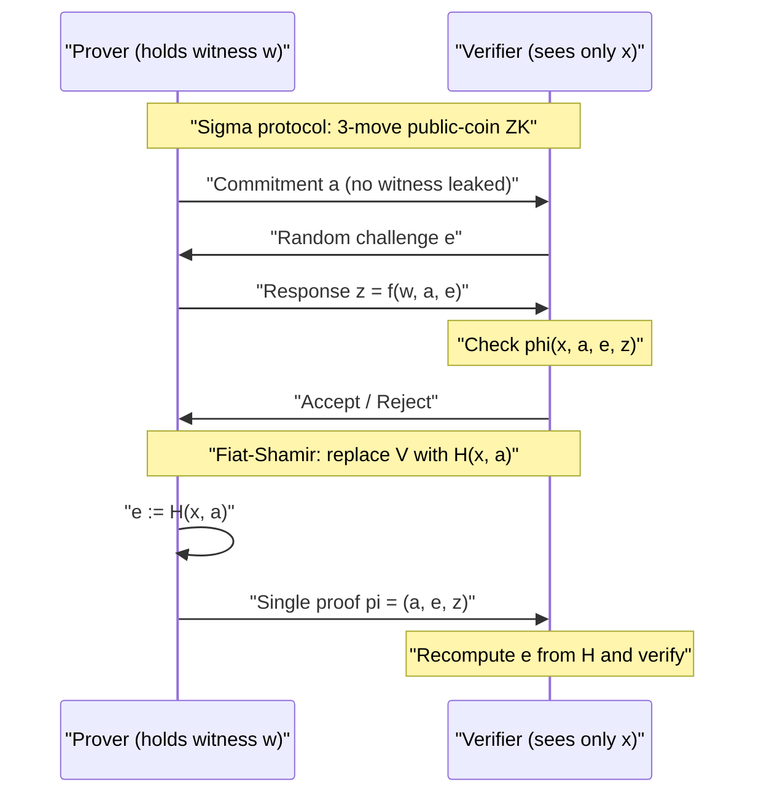
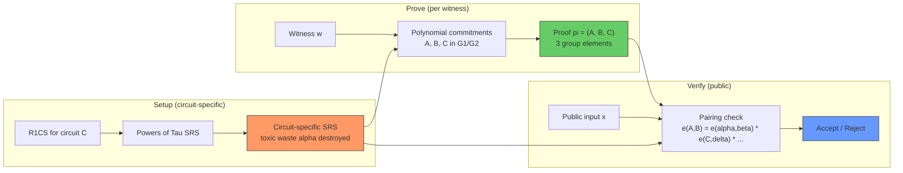
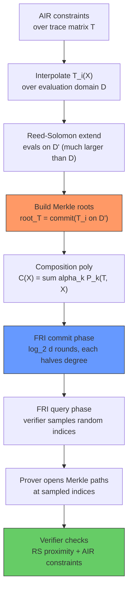

# Zero-Knowledge Proofs, ZK-SNARKs, and ZK-STARKs

Zero-knowledge proofs (ZKPs) are one of the most elegant ideas in modern cryptography: a *prover* convinces a *verifier* that a statement is true without revealing *why* it is true, or any witness beyond the bare fact of validity. Since Goldwasser, Micali, and Rackoff introduced the notion in their 1989 paper *"The Knowledge Complexity of Interactive Proof Systems"*, ZKPs have grown from a theoretical curiosity into a load-bearing primitive for privacy-preserving blockchains, credential systems, and verifiable computation. Two production-grade descendants dominate modern engineering: **ZK-SNARKs** (succinct, non-interactive, pairing-based arguments) and **ZK-STARKs** (scalable, transparent, hash-based arguments). This page covers the formal definitions, the construction lineages from Sigma protocols through Groth16 and PLONK to FRI-based STARKs, the trusted-setup vs transparent trade-off, recursive composition, and the engineering heuristics for picking a scheme. The aim is to give a working software engineer the vocabulary and the mental model needed to evaluate any new ZK system they encounter in production.

## Mathematical Foundations

ZK proofs are built on a small set of algebraic and computational primitives that recur across every construction. A working understanding of these building blocks is essential for reading the literature and for diagnosing production bugs.

- **Finite fields** — Every ZKP works over a prime field \\( \mathbb{F}_p \\) where \\( p \\) is a large prime. Arithmetic (addition, multiplication, inversion) is modulo \\( p \\). SNARKs typically use the scalar field of an elliptic curve (e.g. the 254-bit field of BN254); STARKs prefer small, CPU-friendly primes such as the Goldilocks prime \\( p = 2^{64} - 2^{32} + 1 \\) or the Mersenne prime \\( 2^{31} - 1 \\) for faster arithmetic.
- **Elliptic curve groups** — A pairing-friendly curve (BN254, BLS12-381) provides two source groups \\( \mathbb{G}_1, \mathbb{G}_2 \\) and a target group \\( \mathbb{G}_T \\). The discrete log problem is hard in all three. Groth16 and PLONK use these groups for their commitments.
- **Bilinear pairings** — A map \\( e : \mathbb{G}_1 \times \mathbb{G}_2 \to \mathbb{G}_T \\) with \\( e(g^a, h^b) = e(g, h)^{ab} \\). Pairings let the verifier check that two committed polynomials agree at a secret point \\( \tau \\) without ever learning \\( \tau \\).
- **Polynomial commitments** — A scheme to commit to a polynomial \\( f(X) \\) and later open it at any point \\( z \\) with a short proof \\( \pi_z \\) that \\( f(z) = y \\), without revealing \\( f \\) elsewhere. KZG is pairing-based (constant-size openings, trusted setup); FRI is hash-based (logarithmic-size openings, transparent); IPA (Inner Product Argument, used in Halo) is discrete-log-based (logarithmic size, transparent).
- **Reed–Solomon codes** — The error-correcting code formed by evaluating a low-degree polynomial at many points. STARKs rely on the fact that a function is *close* to a degree-\\( d \\) polynomial iff its evaluations form a codeword close to the Reed–Solomon code of degree \\( d \\).
- **Merkle trees** — A transparent vector commitment: commit to a vector \\( v \\) by publishing the root of a binary hash tree over its elements; open \\( v[i] \\) by revealing the \\( O(\log n) \\) sibling hashes along the authentication path. FRI uses Merkle trees where KZG uses pairings.

## Sigma Protocols in Depth

The Sigma protocol pattern is the template that all modern ZKPs descend from, and understanding it concretely is the fastest way to internalise the abstract definitions above. A Sigma protocol for a relation \\( R \\) is a three-move public-coin protocol with a special structure: the prover's first message \\( a \\) commits to randomness, the verifier's challenge \\( e \\) is a uniformly random field element, and the response \\( z \\) is a deterministic function of \\( (w, r, e) \\). Two accepting transcripts \\( (a, e, z) \\) and \\( (a, e', z') \\) with the same \\( a \\) but different \\( e \\neq e' \\) can be algebraically combined to recover the witness \\( w \\) — this is **special soundness**, and it implies both standard soundness and knowledge soundness. Honest-verifier zero-knowledge comes from the simulator picking \\( e, z \\) first and computing a matching \\( a \\), so the simulator never needs \\( w \\) at all.

The Schnorr identification protocol is the canonical example. To prove knowledge of the discrete log \\( x \\) of \\( X = g^x \\) over a group of prime order \\( q \\):

```python
# Schnorr identification protocol (interactive, illustrative)
import secrets

# Public parameters: group of prime order q with generator g
q = 2**252 + 27742317777372353535851937790883648493  # ed25519 group order
g = 3  # placeholder; in practice a base point on the curve

# Prover's secret: x, with public key X = g^x mod q
x = secrets.randbelow(q)
X = pow(g, x, q)

# Round 1: commitment  a = g^r mod q  (prover -> verifier)
r = secrets.randbelow(q)
a = pow(g, r, q)

# Round 2: random challenge e in [0, q)  (verifier -> prover)
e = secrets.randbelow(q)

# Round 3: response z = r + e*x mod q  (prover -> verifier)
z = (r + e * x) % q

# Verifier checks: g^z == a * X^e  (mod q)
assert pow(g, z, q) == (a * pow(X, e, q)) % q
# Note: this proves knowledge of x without revealing x.
# Fiat-Shamir: replace `e` with H(X, a) to make it non-interactive.
```

The Chaum–Pedersen protocol extends the same template to prove that two discrete logs are *equal*: given \\( X = g^x \\) and \\( Y = h^x \\), prove \\( \log_g X = \log_h Y \\) without revealing \\( x \\). This is the building block for verifiable encryption, threshold cryptography, and many credential schemes. The template generalises: any Sigma protocol can be made non-interactive via Fiat–Shamir, composed in parallel via AND-proofs, or used to prove OR-statements via disjoint-set tricks (proving "I know \\( x \\) for circuit A *or* circuit B" without revealing which). These composition rules are how complex ZK statements are assembled from simple building blocks in practice.

A minimal Fiat–Shamir transform for the Schnorr protocol is just a hash of the public statement and the prover's commitment, replacing the verifier's challenge:

```python
import hashlib

def fiat_shamir_schnorr_prove(g, q, x, X):
    """Non-interactive Schnorr proof of knowledge of x with X = g^x."""
    # 1. Prover commits: a = g^r mod q
    r = secrets.randbelow(q)
    a = pow(g, r, q)

    # 2. Challenge derived via random oracle: e = H(X || a)
    #    Domain-separation prefix prevents cross-protocol attacks.
    transcript = b"schnorr-v1|" + X.to_bytes(32, "big") + a.to_bytes(32, "big")
    e = int.from_bytes(hashlib.sha256(transcript).digest(), "big") % q

    # 3. Response z = r + e*x mod q
    z = (r + e * x) % q
    return (a, z)  # proof pi

def fiat_shamir_schnorr_verify(g, q, X, pi):
    """Verify a non-interactive Schnorr proof."""
    a, z = pi
    transcript = b"schnorr-v1|" + X.to_bytes(32, "big") + a.to_bytes(32, "big")
    e = int.from_bytes(hashlib.sha256(transcript).digest(), "big") % q
    # Check g^z == a * X^e  (mod q)
    return pow(g, z, q) == (a * pow(X, e, q)) % q

# The proof (a, z) is now a single, portable object. Anyone can verify it
# without ever talking to the prover again — this is the basis of all NIZKs.
```

The pattern generalises: every public-coin interactive proof has a non-interactive counterpart via Fiat–Shamir, and the security reduction to the random oracle model is the standard justification. Concrete instantiations must hash *enough* context to bind the proof to its statement — forgetting to hash the public key, the circuit, or the round number has caused real-world vulnerabilities.

## Defining Zero Knowledge

A zero-knowledge proof system is defined for an **NP relation** \\( R \subseteq \\{0,1\\}^* \times \\{0,1\\}^* \\). The prover holds a statement \\( x \\) (the public input) and a witness \\( w \\) such that \\( (x, w) \in R \\). The verifier, seeing only \\( x \\), must become convinced that *some* valid \\( w \\) exists, while learning nothing else about \\( w \\). A classic motivating example is graph isomorphism: given public graphs \\( G_0, G_1 \\), the prover claims to know an isomorphism \\( \pi \\) with \\( \pi(G_0) = G_1 \\), and proves it without revealing \\( \pi \\). Every NP statement can be reduced to circuit satisfiability, so in principle any NP witness can be hidden inside a ZKP — this is why the family is so expressive. In practice, the relation is usually the satisfiability of an arithmetic circuit representing a program, and the witness is the intermediate values that program produces on a specific input.

Three orthogonal security properties must hold for any ZKP. **Completeness** says that an honest prover who really knows \\( w \\) always convinces an honest verifier: \\( \Pr[(P,V)(x,w)=1 \mid (x,w)\in R] \geq 1 - \mathsf{negl}(\lambda) \\). **Soundness** says a cheating prover cannot convince the verifier of a false statement: \\( \Pr[\exists P^* : (P^*,V)(x)=1 \mid x \notin L] \leq \mathsf{negl}(\lambda) \\). **Zero-knowledge** says the verifier learns nothing beyond validity: for every efficient verifier \\( V^* \\) there exists a polynomial-time simulator \\( S \\) that, given only \\( x \\), produces transcripts distributed identically (or computationally indistinguishably) from real ones. The simulator is the cryptographic phrasing of "the verifier could have fabricated this conversation alone, so it carries no information about \\( w \\)." A fourth property — **knowledge soundness** — strengthens soundness by requiring an *extractor* that, given black-box access to any successful prover, outputs \\( w \\); this is what makes a proof an *argument of knowledge* rather than just an argument of truth.

### Interactive vs Non-Interactive Proofs

Early ZKPs were interactive — a multi-round dialogue in which the verifier issues random challenges and the prover responds. The classical three-move pattern is a **Sigma protocol**: (1) prover sends a *commitment* \\( a \\), (2) verifier sends a random *challenge* \\( e \\), (3) prover replies with a *response* \\( z \\) and the verifier checks a predicate \\( \phi(x, a, e, z) \\). Special soundness (any two accepting transcripts sharing \\( a \\) but with different \\( e \\) yield \\( w \\)) and honest-verifier zero-knowledge (a simulator samples \\( e, z \\) first and computes a matching \\( a \\)) are the technical guarantees a Sigma protocol provides. The Schnorr identification protocol — prove knowledge of the discrete log \\( x \\) of \\( X = g^x \\) by sending \\( a = g^r \\), receiving \\( e \\), responding \\( z = r + ex \\) — is the textbook example, and the Chaum–Pedersen protocol extends the pattern to prove equality of two discrete logs (a building block for many threshold cryptography schemes).

The **Fiat–Shamir heuristic** makes any public-coin interactive proof non-interactive by replacing the verifier's challenge with a hash of the transcript so far, \\( e = H(x, a) \\). Under the random oracle model, this transform preserves soundness because the prover cannot grind \\( e \\) after committing to \\( a \\). Non-interactive ZKPs (NIZKs) are what make blockchains, identity wallets, and rollups practical: a single, portable proof object that anyone can verify without ever talking to the prover again. The trade-off is that soundness now rests on the hash being modelled as a random oracle — a strong idealisation — and on the prover's inability to find collisions or preimages. Concrete instantiation bugs (forgetting to hash the public statement, allowing malleable proofs, or using a hash with insufficient domain separation) have caused real-world breakages, so production systems hash the full protocol transcript including circuit hashes and any context-binding tags.



The trade-off between interactive and non-interactive forms is the first of several axes that recur throughout ZK engineering. Interactive proofs give the strongest theoretical guarantees (information-theoretic zero-knowledge is achievable for some languages), but require liveness on both sides, complicate auditing, and cannot be replayed by third parties. Non-interactive proofs are broadcast-friendly and immutable once produced, but their soundness typically relies on either a trusted setup (SNARKs) or the random-oracle idealisation (Fiat–Shamir STARKs and Bulletproofs). The choice is rarely free: most production deployments — Zcash, zkSync, Aztec, StarkNet — are forced into the NIZK regime because proofs must be verified asynchronously on-chain or by third-party auditors long after the prover has gone offline.

| Property | Interactive ZKP | Non-Interactive ZKP (NIZK) |
|---|---|---|
| Rounds | 3+ rounds, public-coin | Single message from prover |
| Verifier source of randomness | Live random oracle / coin flips | Hash of transcript (Fiat–Shamir) or CRS |
| Setup | Typically none | Either trusted setup (Groth16, PLONK) or transparent (STARK, Bulletproof) |
| Replayability | No — challenges are session-bound | Yes — anyone can re-verify \\( \pi \\) later |
| Soundness model | Information-theoretic possible | Computational / random oracle |
| Typical use | Theoretical foundations, MPC sub-protocols | Blockchains, credentials, verifiable computation |
| Communication cost | Linear in circuit size | Constant or logarithmic (succinct) |

### Commitments and NP Relations

A **commitment scheme** is the glue that makes ZKPs work. It is a two-phase primitive: *commit* locks a value \\( m \\) into an opaque object \\( C = \mathsf{Com}(m; r) \\) using randomness \\( r \\), and *open* later reveals \\( (m, r) \\) so the verifier checks consistency. Two properties are required: **hiding** (\\( C \\) reveals nothing about \\( m \\)) and **binding** (the prover cannot open \\( C \\) to two different values). Pedersen commitments \\( C = g^m h^r \\) over a discrete-log-hard group are statistically hiding and computational binding; polynomial commitments such as KZG (Kate–Zaverucha–Goldberg) allow a prover to commit to a polynomial \\( f(X) \\) and later open it at any point \\( z \\) with a short proof \\( \pi_z \\) that \\( f(z) = y \\). KZG commitments are the backbone of Groth16, PLONK, and Marlin — they give succinct opening proofs at the cost of a trusted setup, because the verifier needs pairing-friendly group elements \\( (g, g^\tau, g^{\tau^2}, \dots) \\) that the prover must not be able to forge.

Every concrete ZKP is ultimately a statement about an **NP relation**, and the prover's job is to argue that some witness satisfies that relation without exposing it. In practice the relation is encoded one of three ways: as a Boolean or arithmetic **circuit** (the natural form for "this program computes correctly"), as a **Rank-1 Constraint System (R1CS)** — a list of triples \\( (A_i, B_i, C_i) \\) of linear forms over witness variables such that \\( (A_i \cdot z) \cdot (B_i \cdot z) = (C_i \cdot z) \\) for all \\( i \\), where \\( z = (1, x, w) \\) is the extended witness — or as an **Algebraic Intermediate Representation (AIR)**, which expresses the computation as a trace matrix whose adjacent rows satisfy polynomial transition constraints. R1CS is the input language for Groth16 and Marlin; AIR is the native form for STARKs. Each encoding favours different optimisations: R1CS is dense in multiplications, AIR is dense in lookups and range checks, and modern systems like PLONK and Halo2 blur the line with custom gates and lookup arguments.

## ZK-SNARKs

A **ZK-SNARK** is a *Succinct Non-interactive ARgument of Knowledge*. "Succinct" means the proof size is \\( O(\log |C|) \\) or constant (a few hundred bytes) regardless of circuit size, and verification time is \\( O(\log |C|) \\) or better. "Argument" rather than "proof" signals that soundness holds only against *computationally bounded* provers — the underlying hardness assumptions (discrete log, knowledge-of-exponent, q-SDH) would collapse against an unbounded adversary. "Of knowledge" means the system satisfies **knowledge soundness**: any prover that convinces the verifier can be *extracted* to actually produce a witness \\( w \\), not merely argue that one exists. The extraction is formalised by an *extractor* algorithm that, given black-box access to the prover's strategy, outputs \\( w \\) with non-negligible probability — the SNARK "knows" the witness, which is a strictly stronger property than merely arguing that a witness exists. This is what makes SNARKs usable for authentication ("I know the password") and confidential transactions ("I own the coin being spent") rather than just theorem proving.

The defining cost of most SNARKs is a **trusted setup**: a structured reference string (SRS) \\( \mathsf{pp} = (g, g^\alpha, g^{\alpha^2}, \dots, g^{\alpha^d}) \\) generated by a trusted party in a ceremony, after which the toxic-waste secret \\( \alpha \\) must be destroyed. Anyone holding \\( \alpha \\) can forge proofs undetectably. The **Powers of Tau** ceremony, introduced for Zcash Sapling and refined for Filecoin and Ethereum's KZG commitments, mitigates this via multi-party computation: as long as *one* participant is honest and discards their share, the joint \\( \alpha \\) is unrecoverable. The ceremony is universal — the same SRS supports many circuits up to a degree bound \\( d \\). The opposite design — *transparent* setups needing no secret at all — requires different algebraic machinery and is the main selling point of STARKs and Bulletproofs.

### Trusted Setup vs Transparent Setup

The trusted setup question is the single most consequential operational choice in ZK engineering. A trusted setup produces a *structured reference string* (SRS) that both the prover and verifier use; the secret scalar \\( \tau \\) that parameterises the SRS must be destroyed, because anyone who knows \\( \tau \\) can forge proofs of any statement. The risk is mitigated — never eliminated — by multi-party ceremonies in which participants take turns raising the SRS to their own secret and discarding it; one honest participant suffices to make \\( \tau \\) unrecoverable. Transparent setups avoid the secret entirely: the public parameters are just a hash function and a finite field, both of which are public knowledge. The price is larger proofs (no constant-size KZG-style commitments) and weaker succinctness (logarithmic rather than constant verifier).

| Property | Trusted Setup (Groth16, PLONK, Marlin) | Transparent Setup (STARK, Bulletproof, Halo) |
|---|---|---|
| Public parameters | SRS with secret \\( \tau \\) (Powers of Tau) | Hash function + finite field, fully public |
| Toxic waste | Yes — \\( \tau \\) must be destroyed | None |
| Mitigation | Multi-party ceremony (one honest suffices) | None needed |
| Universality | Circuit-specific (Groth16) or universal (PLONK, Marlin) | Always universal |
| Proof size | Constant (200 B – 1 KB) | Logarithmic (1–200 KB) |
| Verifier work | Constant (few pairings or hashes) | Logarithmic |
| Post-quantum | No (pairings/DLP broken by Shor) | Yes (STARK), No (Bulletproof, Halo) |
| Operational risk | Ceremony compromise undetectable | None |

### Groth16

Groth16 (Jens Groth, 2016) is the canonical pairing-based SNARK and remains the smallest known: proofs are three group elements (≈ 200 bytes on BN254) and verification is a constant number of pairings independent of circuit size. The construction encodes R1CS as a quadratic arithmetic program \\( \sum_i (A_i \cdot z)(B_i \cdot z) \gamma_i = \sum_i (C_i \cdot z) \delta_i \\) over a pairing-friendly curve (BN254, BLS12-381), and the prover commits to the witness via KZG-style polynomial commitments. The proof consists of three curve points \\( (A, B, C) \\) satisfying a pairing equation \\( e(A, B) = e(\alpha, \beta) \cdot e(\sum_i L_i \gamma_i, \gamma) \cdot e(C, \delta) \\). The pairing \\( e : \mathbb{G}_1 \times \mathbb{G}_2 \to \mathbb{G}_T \\) is a non-degenerate bilinear map, and the verifier recomputes both sides using only public information and the three proof elements. The setup is **circuit-specific**: changing one constraint invalidates the SRS, which is Groth16's main operational drawback. Despite that, it powered Zcash Sapling, was the first SNARK deployed on Ethereum (starting with the Byzantium precompiles), and remains the gold standard for "smallest proof, fastest verifier."



### PLONK, Marlin, and Universal Setup

**PLONK** (Gabizon, Williamson, Ciobotaru, 2019) relaxes Groth16's per-circuit setup into a **universal and updatable** SRS. A single ceremony produces an SRS for all circuits up to size \\( N \\); when a new circuit is deployed, the prover only publishes a small verifier key derived from the universal SRS, with no fresh toxic waste. PLONK's constraint model is also richer than raw R1CS: each "gate" combines a fan-in-2 multiplication and a few additions via a permutation argument that enforces wire copy constraints. The proof is nine group elements plus three scalar-field openings (≈ 500 bytes on BN254), and verification is a fixed set of pairings. PLONK's flexibility — custom gates, lookups via Plookup, and the easy addition of specialised gates for hashes and elliptic curve operations — has made it the substrate for Aztec, zkSync's zkEVM, Scroll, and the Ethereum proto-danksharding KZG commitments (EIP-4844). The PLONKish arithmetisation has effectively become the de facto standard for new SNARK deployments.

**Marlin** (Chiesa, Ojha, Spooner, 2019) sits between Groth16 and PLONK: it offers a universal SRS like PLONK but keeps the R1CS front-end, giving a cleaner separation between the arithmetisation and the polynomial commitment. Marlin proofs are slightly larger than PLONK's but the prover does less polynomial I/O, which is sometimes a win in constrained environments. The deeper contribution is a linear-time prover with a succinct verifier — historically these were in tension. Together with Sonic, PLONK, and Marlin, the "universal SRS" line of work established that circuit-specific setup is not a fundamental requirement of pairing-based SNARKs, only a feature of the first generation.

### Comparison: Groth16 vs PLONK vs Marlin

| Property | Groth16 (2016) | PLONK (2019) | Marlin (2019) |
|---|---|---|---|
| Setup model | Circuit-specific | Universal & updatable | Universal & updatable |
| Front-end / arithmetisation | R1CS → QAP | PLONKish gates + permutations | R1CS |
| Proof size (BN254) | ~200 B (3 group elts) | ~500 B (9 G + 3 Fr) | ~800 B |
| Verifier work | 3 pairings (constant) | 2 pairings + FFT-free checks | Poly-logarithmic |
| Prover work | \\( O(N) \\) FFTs + MSMs | \\( O(N) \\) FFTs + MSMs + permutation | \\( O(N) \\), lighter MSMs |
| Custom gates / lookups | None natively | First-class | Via separate lookup arguments |
| Re-affected by circuit change | New setup required | Derive new vk from universal SRS | Derive new vk from universal SRS |
| Notable deployments | Zcash Sapling, Tornado Cash | Aztec, zkSync Era, Scroll, EIP-4844 | Aleo, Findora |

## ZK-STARKs

A **ZK-STARK** is a *Scalable Transparent ARgument of Knowledge*. Where SNARKs trade transparent setup for succinctness via pairings, STARKs achieve transparency by relying only on **symmetric cryptography** — collision-resistant hash functions and Reed–Solomon codes. The construction, introduced by Ben-Sasson, Bentov, Horesh, and Riabzev in their 2018 paper *"Scalable, transparent, and post-quantum secure cryptographic arguments"*, has two headline properties. First, **no trusted setup** is required: the public parameters are just a hash function and a finite field. Second, **post-quantum security**: the only assumptions are hash collision resistance and Reed–Solomon proximity testing, both of which are believed to resist quantum attacks. The cost is larger proofs (tens to hundreds of kilobytes) and slower verifiers (logarithmic rather than constant) than pairing-based SNARKs. The prover is also typically *faster* in absolute terms than a pairing-based SNARK prover, because it does only hashes and field arithmetic rather than elliptic curve multi-scalar multiplications — this makes STARKs attractive for very large computations where the SNARK prover is the bottleneck.

The STARK pipeline starts from an **AIR** — a list of polynomial transition constraints over a 2D execution trace. The prover interpolates each trace column as a univariate polynomial \\( T_i(X) \\) over a multiplicative coset, extends the trace to a Reed–Solomon codeword by evaluating \\( T_i \\) at many more points, and computes the **composition polynomial** \\( C(X) = \sum_k \alpha_k \cdot P_k(T_1(X), \dots, T_m(X), X) \\) which vanishes on the trace domain if and only if the constraints are satisfied. The prover commits to these polynomials via a **Merkle tree** of their Reed–Solomon evaluations (this is the transparent replacement for KZG), and proves that \\( C \\) is low-degree via the **FRI** protocol — Fast Reed–Solomon Interactive Oracle Proof of Proximity. FRI recursively splits \\( C \\) into two halves, commits to each via Merkle roots, and at each level the verifier samples random indices and asks the prover to open the corresponding leaves. After \\( O(\log d) \\) rounds the verifier is left with a constant-degree polynomial that it can check directly.

### FRI and ethSTARK

FRI is the engine that makes STARKs work. Given oracle access to a function \\( f \\) claimed to be a polynomial of degree \\( < d \\), FRI verifies that \\( f \\) is *close* to such a polynomial (in Reed–Solomon distance) by repeatedly halving the degree: at each round, the verifier picks a random \\( \alpha \\), and the prover produces a new function \\( f'(X) = \frac{f(\beta X) + f(-\beta X)}{2} + \alpha \cdot \frac{f(\beta X) - f(-\beta X)}{2 \beta X} \\) that, if \\( f \\) really were a degree-\\( d \\) polynomial, would be degree \\( < d/2 \\). After \\( \log_2 d \\) rounds the claimed degree is constant and can be checked directly by querying a few evaluations. Each round requires the prover to commit to a Merkle tree of evaluations, and each query requires revealing logarithmically many authentication paths — this is where STARK proof sizes come from. The number of queries and the Reed–Solomon expansion factor together determine the soundness error; production STARKs tune these to reach \\( 2^{-80} \\) or \\( 2^{-128} \\) soundness with manageable proof sizes.

**ethSTARK** (Ben-Sasson et al., 2021) is the productionised, deterministic Fiat–Shamir version deployed for Ethereum STARK provers, with carefully tuned field choices (the 64-bit Goldilocks prime \\( p = 2^{64} - 2^{32} + 1 \\) — small enough for fast arithmetic, large enough that random values hit soundness bounds) and constraint systems tailored for EVM bytecode. The Stone prover from StarkWare and the RISC Zero STARK library implement the same family of techniques for general-purpose CPUs, treating the execution trace of a RISC-V core as the AIR and producing proofs that arbitrary machine code ran correctly. This shift from "circuit for one specific program" to "universal CPU trace" is what makes STARKs a credible substrate for general verifiable computation: the prover writes a normal program and gets a proof of correct execution, with no per-program circuit synthesis step.



### SNARKs vs STARKs vs Bulletproofs

| Property | ZK-SNARK (Groth16/PLONK) | ZK-STARK | Bulletproofs |
|---|---|---|---|
| Trusted setup | Yes (circuit-specific or universal) | No (transparent) | No (transparent) |
| Underlying assumption | Discrete log, q-SDH, pairings | Hash collision resistance, RS proximity | Discrete log |
| Post-quantum secure | No (broken by Shor) | Yes | No (broken by Shor) |
| Proof size | 200 B – 1 KB | 45 KB – 200 KB | \\( O(\log N) \\), ~1–2 KB |
| Verifier time | \\( O(1) \\) (few pairings) | \\( O(\log^2 N) \\) hashes | \\( O(\log N) \\) exponentiations |
| Prover time | \\( O(N) \\) FFTs + MSMs (slow MSMs) | \\( O(N \log N) \\) hashes (fast, GPU-friendly) | \\( O(N) \\) exponentiations |
| Arithmetisation | R1CS / PLONKish / custom gates | AIR | R1CS (range proofs native) |
| Best fit | On-chain verification (gas costs) | General computation, post-quantum | Confidential transactions, range proofs |
| Notable deployments | Zcash, zkSync, Scroll, Aztec | StarkNet, Polygon Miden, Risc Zero | Monero, Grin, Liquid |

## Recursive Composition and Folding

A single SNARK or STARK is limited by the prover's memory and time budget: a circuit with \\( 10^{10} \\) constraints cannot be proven on any single machine in reasonable time. **Recursive composition** solves this by making the verifier itself a circuit: a SNARK verifies another SNARK's proof inside a SNARK proof. The outer proof is then only \\( O(\log \log N) \\) in size, and the prover can split the original circuit across many machines that each prove a shard, then aggregate. The technical challenge is that verifying a pairing-based SNARK requires computing pairings inside the circuit, which is expensive — the cycle of curves trick (a pair of curves \\( E_1, E_2 \\) whose scalar fields match each other's base fields, e.g. BN254 paired with a twisted-ED 25519 curve) makes this tractable by allowing non-native field arithmetic to be expressed natively.

**Folding schemes** — Halo (Bowe, Grigg, Hopwood, 2020), Nova (Kothapalli, Setty, Tzialla, 2021), ProtoStar (Bünz, Eberhardt, Fisch, Sasson, 2023) — generalise recursion by avoiding the verifier-circuit overhead entirely. Instead of proving "this proof verifies," folding combines two instances of a relation into one instance with a single linear combination, deferring the actual proof to the end. Nova's *Relaxed R1CS* introduces a slack variable that absorbs the cross-terms, so the fold is non-interactive and the final SNARK is generated once over the accumulated instance. Folding gives incremental verifiable computation — each step adds a constant amount of work to the prover regardless of how many steps have come before — which is the right model for blockchain rollups where the chain of state transitions grows unboundedly.

### Lookup Arguments and Custom Gates

A surprising amount of realistic computation is *table lookup* — fetching a value from a precomputed table indexed by a key. Hash functions, AES, and the EVM opcode table are all dominated by lookups. A naive R1CS encoding of an \\( n \\)-entry table needs \\( O(n) \\) constraints per lookup, which is prohibitive. **Plookup** (Gabizon & Williamson, 2020) and subsequent lookup arguments (Caulk, Baloo, cq, LogUp) reduce this to \\( O(\log n) \\) or even \\( O(1) \\) per lookup using a combination of permutation arguments and multiset hashing. The result is that PLONKish circuits can include precompiled tables for SHA-256, Keccak, AES, and elliptic curve operations, paying only a small fraction of what a hand-rolled R1CS would cost. This single advance is what made zkEVMs feasible — without lookups, proving an EVM block with a SNARK would require tens of billions of constraints.

Custom gates generalise the lookup idea: instead of a uniform PLONK gate (one multiplication + additions per row), the circuit includes specialised gates for particular operations (e.g. a Poseidon permutation gate, an ECDSA verify gate). Each custom gate costs a few extra constraints in the verifier's pairing check, but can collapse hundreds of generic constraints into one. Halo2, Plonky2, and Plonky3 are built around this pattern — the circuit designer picks a set of custom gates appropriate to the workload, and the prover/verifier pay only for what they use. The trade-off is that custom gates are circuit-specific: a Poseidon gate helps a hash-heavy circuit but is dead weight in an arithmetic-heavy one. This is one reason universal zkVMs (which use only generic gates) are slower than hand-tuned zkEVMs but easier to maintain.

## Applications and Production Deployments

Zero-knowledge proofs moved from theory to production in the last decade, driven primarily by blockchain applications where the verifier is a smart contract with a strict gas budget. Each major deployment illustrates a different point in the design space.

| System | Scheme | Use Case | Notes |
|---|---|---|---|
| Zcash Sapling | Groth16 | Shielded transactions | First major production SNARK; per-circuit setup |
| Tornado Cash | Groth16 | Private Ethereum transfers | Fixed-denomination anonymity set |
| zkSync Era | PLONK | zkEVM rollup | Universal SRS, custom gates for EVM opcodes |
| Aztec Network | PLONK + lookups | Private smart contracts | Encrypted state, note model |
| Scroll | Halo2 (PLONKish) | zkEVM rollup | Chinese-remainder-style accumulation, recursive |
| StarkNet | STARK (Cairo AIR) | General-purpose zkVM | Transparent, post-quantum |
| Polygon Miden | STARK | zkVM | Winterfell prover, 64-bit Goldilocks field |
| RISC Zero | STARK | Verifiable RISC-V execution | General-purpose compute proven correct |
| Monero | Bulletproofs | Confidential transaction amounts | No setup, native range proofs |
| Ethereum EIP-4844 | KZG commitments | Proto-danksharding data blobs | Powers of Tau ceremony (~140k contributors) |
| Filecoin | Groth16 | Proof of replication & spacetime | Largest deployed SNARK circuits to date |

The pattern is clear: on-chain verification forces the SNARK regime (small proofs, constant verifiers); general-purpose computation and post-quantum requirements push toward STARKs; short witness statements like range proofs fit Bulletproofs. Each system has a complex ceremony, tooling, and auditing story behind it — the cryptographic primitive is the smallest part of the deployment.

## Performance Characteristics

Engineering performance in ZK systems is dominated by a few bottleneck operations: **multi-scalar multiplication (MSM)** for SNARK provers, **fast Fourier transforms (FFTs)** for both SNARKs and STARKs, and **hash evaluations** for STARK provers. Concrete numbers vary by an order of magnitude across implementations, but the qualitative shape is stable.

| Operation | Complexity | Per-op cost (relative) | Bottleneck for |
|---|---|---|---|
| Elliptic curve scalar mul | \\( O(\log q) \\) field muls | ~1000× field mul | SNARK prover (MSM) |
| Multi-scalar mul (MSM) | \\( O(N) \\) scalar muls | ~100× field mul / point | SNARK prover |
| Fast Fourier transform (FFT) | \\( O(N \log N) \\) field muls | ~5× field mul | SNARK & STARK prover |
| Pairing | constant, expensive | ~10000× field mul | SNARK verifier |
| SHA-2 / Keccak hash | constant | ~50 ns / 64-byte block | STARK prover |
| Merkle tree authentication | \\( O(\log N) \\) hashes | ~50 ns × log | STARK verifier |

Practical implications: SNARK provers are bottlenecked by MSMs, which is why GPU and ASIC accelerators (e.g. PipeZK, Cysic) target them specifically. STARK provers are bottlenecked by hashing and field arithmetic, both of which are embarrassingly parallel — STARK provers scale better on commodity hardware but produce larger proofs. Recursive composition converts STARK proofs into SNARK proofs for on-chain verification, getting the best of both worlds at the cost of additional engineering complexity.

## Common Pitfalls and Attacks

- **Malleable Fiat–Shamir transcripts** — If the hash input does not bind to *all* relevant context (circuit hash, public inputs, previous-round messages), a malicious prover can re-use a partial proof for a different statement. The fix is to hash the entire transcript at every step, with explicit domain separators.
- **Trusted setup compromise** — If even one ceremony participant's secret is leaked *and* all other participants' secrets are also leaked, the SRS is compromised. The mitigation is the largest possible ceremony; the EIP-4844 KZG ceremony had ~140k contributors.
- **Non-deterministic prover code** — A prover that uses floating-point arithmetic, uninitialized memory, or a non-thread-safe RNG can produce proofs that are technically valid but irreproducible, breaking auditing. Production provers must be deterministic given (circuit, witness, transcript).
- **Field overflow / wrong field** — Mixing the base field and scalar field of an elliptic curve, or using a prime that is too small for the desired soundness level, silently breaks security. Always check that the field size matches the security parameter.
- **Under-constrained circuits** — A circuit that omits a constraint (e.g. forgetting to enforce that a value is boolean) lets the prover submit proofs for invalid witnesses. Formal auditing tools like Ecircom exist to detect this.
- **Random oracle granularity** — Fiat–Shamir with a single hash call per round gives the prover too much control if the hash output is small. Use wide challenges (256+ bits) and avoid re-using challenges across rounds.
- **Witness extraction failures** — A "SNARK" without knowledge soundness lets a prover argue that *some* witness exists without knowing one. Always check that the construction satisfies knowledge soundness, not just soundness.
- **Side-channel leakage in the prover** — The prover's running time, memory access pattern, and power draw can leak information about the witness. Hardened provers use constant-time field arithmetic and oblivious data structures when the witness is highly sensitive.
- **Frozen random oracle** — A Fiat–Shamir transcript hashed with a weak or non-standardised hash function (e.g. a custom hash instead of SHA-256 or Poseidon) may have subtle biases. Use audited hash functions with proven domain separation.
- **Circuit desynchronisation** — When the prover and verifier disagree on the circuit definition (different versions, different compilation flags), proofs can appear valid while proving the wrong statement. Bind the circuit hash into the proof.
- **Insecure recursion** — A recursive proof whose inner verifier is mis-implemented (e.g. accepting any pairing equation) lets a malicious prover submit a "valid" proof of an invalid inner proof. Always audit the inner verifier circuit against the real verifier algorithm.
- **Salt re-use across proofs** — Reusing the same prover randomness across two proofs for the same statement can leak the witness, because two transcripts with shared randomness can be combined via special soundness. Always use fresh randomness per proof.

## Choosing a Scheme

The right ZKP scheme depends on which axis dominates your system. For Ethereum rollups where on-chain verification gas is the bottleneck and the data availability layer already pays for posting the proof, Groth16's three-pairing verifier is essentially unbeatable — but you must live with the trusted setup and accept that upgrading the circuit means a new ceremony (or a migration to a universal-SRS system like PLONK). For general-purpose verifiable computation, especially when the computation is large and the verifier is off-chain, STARKs scale better: the prover does only hashes and field arithmetic (no elliptic curves), the verifier is logarithmic, and the absence of a setup ceremony simplifies governance. Bulletproofs fill a niche where small proofs are wanted, no setup is acceptable, but the verifier is willing to do \\( O(\log N) \\) group work — they are the native choice for confidential transaction amounts (Monero, Liquid) where the witness is a short range proof rather than a large circuit.

There is no free lunch in ZK engineering. The concrete trade-offs to consider when choosing a scheme are:

- **Verifier budget** — On-chain gas (Ethereum), packet size (mobile), or per-verification CPU cost (server).
- **Prover budget** — Memory, time, and energy. SNARK provers bottleneck on MSMs (GPU/ASIC friendly); STARK provers bottleneck on hashing (commodity CPU friendly).
- **Post-quantum requirement** — Long-lived confidential data must use STARKs; ephemeral proofs may use SNARKs.
- **Operational capacity for ceremony** — A trusted setup ceremony requires community coordination, audit, and ongoing custody of the SRS.
- **Circuit upgrade frequency** — Frequent upgrades favour universal-SRS (PLONK, Marlin) or transparent (STARK) systems.
- **Witness structure** — Range proofs fit Bulletproofs; EVM execution fits PLONKish + lookups; CPU traces fit STARK AIR.

Newer systems (Halo, Nova, ProtoStar, HyperPlonk) attempt to fold these trade-offs: recursive composition lets a SNARK verify a STARK, giving small on-line proofs with transparent trust assumptions, while lookup arguments collapse the cost of hash and signature verification inside the circuit. The **ZKProof community reference**, maintained by an academic-industrial consortium, tracks these constructions and their security analyses — it is the recommended starting point when evaluating any new scheme for production. For a software engineer, the practical questions are: what is my verifier budget? what is my prover budget? do I need post-quantum security? and do I have the operational capacity to run a trusted setup ceremony? The answers narrow the field quickly.

## Tooling and Domain-Specific Languages

Modern ZK engineering is rarely done by hand-writing R1CS or AIR constraints; instead, developers write circuits in a high-level DSL that compiles down to the arithmetisation expected by the proving backend. The dominant tools are:

- **Circom + SnarkJS** — The original SNARK DSL used by Tornado Cash and many early Ethereum ZK apps. Compiles to R1CS for Groth16 (and PLONK via SnarkJS).
- **Halo2** — Originally Zcash's PLONKish implementation, now used by Scroll, the Ethereum Foundation's EIP-4844 specs, and many others. Written in Rust; circuits are Rust traits.
- **Cairo** — StarkWare's Turing-complete language for STARK provers. Used by StarkNet and general-purpose zkVMs.
- **Noir (nargo)** — Aztec's Rust-like DSL that targets multiple backends (Halo2, Plonky2, Marlin). Decouples circuit logic from proving backend.
- **Plonky2 / Plonky3** — Polygon Zero's Rust library implementing PLONK + FRI, optimised for fast recursion.
- **RISC Zero** — A STARK prover for RISC-V programs; developers write Rust, the zkVM proves correct execution.
- **Leo** — Aleo's DSL for private smart contracts on a Marlin-based SNARK backend.

Each tool makes different trade-offs between expressivity, auditability, and proving performance. The trend is toward general-purpose zkVMs (RISC Zero, Cairo, Miden) that prove CPU traces — this avoids the per-circuit synthesis step that has historically made SNARK deployment slow and error-prone.

## Interview Questions

**Q1: State the three defining properties of a zero-knowledge proof and explain what the simulator captures.**
A: Completeness (an honest prover with a valid witness convinces an honest verifier), soundness (a cheating prover cannot convince the verifier of a false statement beyond negligible probability), and zero-knowledge (for every efficient verifier \\( V^* \\) there exists a polynomial-time simulator \\( S \\) producing transcripts indistinguishable from real ones, given only the public statement \\( x \\)). The simulator formalises "the verifier learned nothing it could not have fabricated alone" — the transcript carries no information about the witness \\( w \\). A fourth property, knowledge soundness, strengthens this by requiring an extractor that recovers \\( w \\) from any successful prover.

**Q2: What does the Fiat–Shamir heuristic do, and what assumption does it rely on?**
A: Fiat–Shamir converts a public-coin interactive proof (Sigma protocol) into a non-interactive one by replacing the verifier's random challenge \\( e \\) with a hash of the transcript so far, \\( e = H(x, a) \\). Soundness is preserved in the random oracle model because the prover, having already committed to \\( a \\), cannot grind \\( e \\) to a favourable value. In practice the hash is modelled as a random oracle; concrete instantiation bugs (not hashing enough context, allowing malleability) have caused real-world attacks on ZK systems, so strong domain separation is essential.

**Q3: Why does Groth16 need a trusted setup and what does Powers of Tau do about it?**
A: Groth16's SRS contains encodings of a secret scalar \\( \alpha \\) as \\( (g, g^\alpha, g^{\alpha^2}, \dots, g^{\alpha^d}) \\); anyone recovering \\( \alpha \\) can forge proofs for any statement. Powers of Tau is a multi-party ceremony in which each participant takes the previous SRS, raises it to a fresh secret \\( \alpha_i \\), and discards \\( \alpha_i \\). As long as one participant is honest, the combined \\( \alpha = \prod_i \alpha_i \\) is unrecoverable. The ceremony is universal for all circuits up to degree \\( d \\), so it amortises over many deployments.

**Q4: Contrast the SRS model of Groth16 with that of PLONK. Why does this matter for operations?**
A: Groth16 has a circuit-specific SRS — every change to the circuit requires a fresh setup ceremony and new toxic waste. PLONK uses a universal and updatable SRS: a single ceremony covers all circuits up to size \\( N \\), and deploying a new circuit only requires publishing a small verifier key derived from the universal SRS. Operationally this means PLONK circuits can be upgraded, patched, and rolled out without coordinating new ceremonies — a major reason the Ethereum L2 ecosystem migrated from Groth16-style systems to PLONKish ones.

**Q5: What is FRI and why is it the core of every ZK-STARK?**
A: FRI (Fast Reed–Solomon IOPP) verifies that an oracle-accessible function is close to a low-degree polynomial by recursively halving the degree: each round, the prover commits to a Merkle tree of evaluations of a derived function that, if the original were degree \\( d \\), would be degree \\( < d/2 \\). After \\( O(\log d) \\) rounds the degree is constant and checkable directly. FRI replaces the polynomial commitment (KZG) used in SNARKs with a hash-based one, which is why STARKs need no trusted setup and are plausibly post-quantum — at the cost of larger proofs (every query requires revealing Merkle authentication paths).

**Q6: Why are ZK-STARKs considered post-quantum while Groth16 SNARKs are not?**
A: Groth16's soundness reduces to discrete log, q-SDH, and pairing assumptions that Shor's algorithm solves in polynomial time on a sufficiently large quantum computer. STARKs rely only on collision-resistant hash functions and Reed–Solomon proximity testing, both of which are believed to resist quantum attack (Grover gives only a quadratic speedup on hash collisions, doubling the security parameter is sufficient). For long-lived confidential data that may be stored today and attacked tomorrow, this matters; for ephemeral rollup proofs, it usually does not.

**Q7: When would you pick Bulletproofs over a SNARK or STARK?**
A: Bulletproofs shine when (a) you cannot tolerate a trusted setup, (b) the witness is naturally a short range proof or aggregate of range proofs (e.g. confidential transaction amounts in Monero or Liquid), and (c) the verifier is online and can afford \\( O(\log N) \\) exponentiations. They are a poor fit for large general-purpose circuits because verification scales linearly with circuit size, and they are not post-quantum (discrete-log based). For rollup-style on-chain verification, the verifier cost is prohibitive — use a SNARK or STARK instead.

**Q8: Explain the difference between R1CS and AIR as front-ends for ZKPs.**
A: R1CS (Rank-1 Constraint System) encodes a computation as a list of bilinear constraints \\( (A_i z)(B_i z) = (C_i z) \\) over a witness vector \\( z \\); it is the native input to Groth16 and Marlin and naturally expresses circuits with multiplications. AIR (Algebraic Intermediate Representation) encodes the computation as a 2D execution trace whose adjacent rows satisfy polynomial transition constraints; it is the native form for STARKs and excels at lookups, range checks, and state-machine transitions. PLONKish (PLONK + custom gates + Plookup) is a hybrid that borrows AIR-style constraints on a PLONK-style circuit, getting the best of both for zkEVM designs.

**Q9: What is recursive proof composition and why does it matter?**
A: Recursive composition means proving that *another* ZK proof verifies, inside a fresh ZK proof. The outer proof is constant-size regardless of how large the inner proof was, so it lets us aggregate many proofs into one (good for rollups) or break a huge computation into shards that are each proven separately and then combined. The technical challenge is that verifying a pairing-based SNARK requires computing pairings inside the circuit, which is expensive in non-native field arithmetic. Cycle-of-curves constructions (BN254 paired with a twisted-Edwards curve whose scalar field is BN254's base field) and folding schemes (Halo, Nova) solve this in different ways.

**Q10: Sketch the STARK proving pipeline at a high level.**
A: (1) Express the computation as an AIR — a set of polynomial transition constraints over a 2D trace. (2) Interpolate each trace column as a polynomial over a coset domain. (3) Reed–Solomon-extend the trace by evaluating at many more points (this is the redundancy that FRI will check). (4) Commit to the extended trace via Merkle roots. (5) Combine all constraints into a single composition polynomial \\( C(X) \\) using random linear combination. (6) Run FRI to prove \\( C \\) is low-degree, by recursively halving and committing via Merkle trees. (7) Apply Fiat–Shamir to make all verifier challenges non-interactive. (8) The verifier checks Merkle openings, Reed–Solomon proximity, and the AIR constraints at sampled points.

## Cross-References

- [Cryptography Overview](./README.md) — broader context of cryptographic primitives, where ZKPs sit alongside commitments, signatures, and encryption
- [Security: Cryptography](../security/cryptography.md) — applied security view of cryptography across the rest of the book
- [Formal Methods](../cs-theory/formal-methods.md) — proof systems, interactive proofs, and the IP = PSPACE theorem that underpins ZK theory
- [Complexity Classes](../cs-theory/complexity-classes.md) — NP, NP-complete, and the complexity landscape that defines which statements have short witnesses to hide

## Further Reading

For engineers who want to go deeper, the following resources are the most useful next stops after this page:

- **ZKProof Community Reference (v3)** — The community standardisation effort, with formal definitions, security analyses, and reference implementations of the major SNARK and STARK constructions.
- **"Proofs, Arguments, and Zero-Knowledge" by Justin Thaler** — A free online textbook covering the algorithmic foundations of modern ZK systems, with emphasis on SNARKs.
- **"The Moonmath Manual to zk-SNARKs" by Least Authority** — A practitioner-oriented introduction that works through the algebra in detail.
- **"Anatomy of a STARK" by Alan Szepieniec** — A six-part tutorial that implements a tiny STARK from scratch, excellent for understanding FRI.
- **"Plonk by Hand" by Youssef El Housni** — A worked example of the entire PLONK protocol on a tiny circuit, illuminating the polynomial commitment and permutation argument.
- **Real-world cryptography libraries** — `arkworks-rs` (Rust), `gnark` (Go), `halo2` (Rust), `snarkjs` (JavaScript), `pycirc` (Python). Reading and running their examples is the fastest way to internalise the engineering trade-offs.
- **Standards and security analyses** — The Ethereum Foundation's KZG ceremony report, the Zcash protocol specification, and the StarkWare STARK paper series all contain detailed security analyses that are essential reading before deploying any ZK system in production.

## References

- Goldwasser, S., Micali, S., Rackoff, C. — *"The Knowledge Complexity of Interactive Proof Systems"* (1989), STOC; the paper that introduced zero-knowledge proofs and the simulator paradigm.
- Goldreich, O. — *Foundations of Cryptography, Volume I (Basic Tools) and Volume II (Basic Applications)*, Cambridge University Press. The canonical reference for formal definitions of ZK, commitments, and proof systems.
- Ben-Sasson, E., Chiesa, A., Garman, C., Green, M., Miers, I., Tromer, E., Virza, M. — *"Succinct Non-Interactive Zero Knowledge for a von Neumann Architecture"* (2014). The Pinocchio/SAP lineage paper that brought pairing-based SNARKs to general computation.
- Groth, J. — *"On the Size of Pairing-Based Non-interactive Arguments"* (2016), EUROCRYPT. The Groth16 construction — still the smallest known pairing-based SNARK.
- Gabizon, A., Williamson, Z. J., Ciobotaru, O. — *"PLONK: Permutations over Lagrange-bases for Oecumenical Noninteractive arguments of Knowledge"* (2019). Universal and updatable SRS for pairing-based SNARKs.
- Chiesa, A., Ojha, D., Spooner, N. — *"Marlin: Preprocessing zkSNARK with Universal and Updatable SRS"* (2019). Linear-time prover with universal setup.
- Ben-Sasson, E., Bentov, I., Horesh, Y., Riabzev, M. — *"Scalable, Transparent, and Post-Quantum Secure Cryptographic Arguments"* (2018), CRYPTO. The founding STARK paper.
- Ben-Sasson, E., Bentov, I., Horesh, Y., Riabzev, M. — *"ethSTARK Documentation"* (2021). The production-grade, deterministic Fiat–Shamir STARK for Ethereum.
- Bünz, B., Bootle, J., Boneh, D., Poelstra, A., Wuille, P., Maxwell, G. — *"Bulletproofs: Short Proofs for Confidential Transactions and More"* (2018), S&P. Transparent range proofs with logarithmic size.
- Bowe, S., Grigg, J., Hopwood, D. — *"Recursive Proof Composition without a Trusted Setup (Halo)"* (2020). Folding-based recursion for pairing-based SNARKs.
- Kothapalli, A., Setty, S., Tzialla, I. — *"Nova: Recursive Zero-Knowledge Arguments from Folding Schemes"* (2021). Incremental verifiable computation via relaxed R1CS folding.
- Kate, A., Zaverucha, G., Goldberg, I. — *"Constant-Size Commitments to Polynomials and Their Applications"* (2010), ASIACRYPT. The KZG polynomial commitment underlying Groth16, PLONK, and Marlin.
- ZKProof Community — *ZKProof Community Reference* (v3, 2024). Community-maintained reference and standardisation effort at https://zkproof.org.
- Boneh, D., Shoup, V. — *A Graduate Course in Applied Cryptography*, Chapter 20 (Zero-Knowledge Proofs). Free online textbook treatment.
- Thaler, J. — *"Proofs, Arguments, and Zero-Knowledge"* (2022), Foundations and Trends in Theoretical Computer Science. Free online textbook on modern SNARKs and STARKs.
