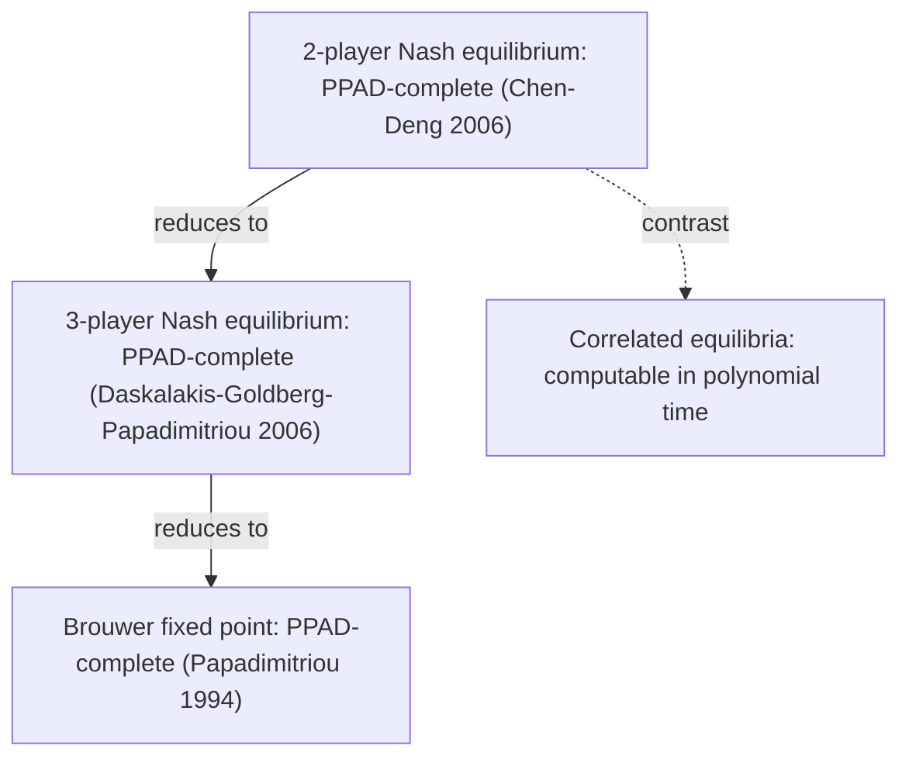
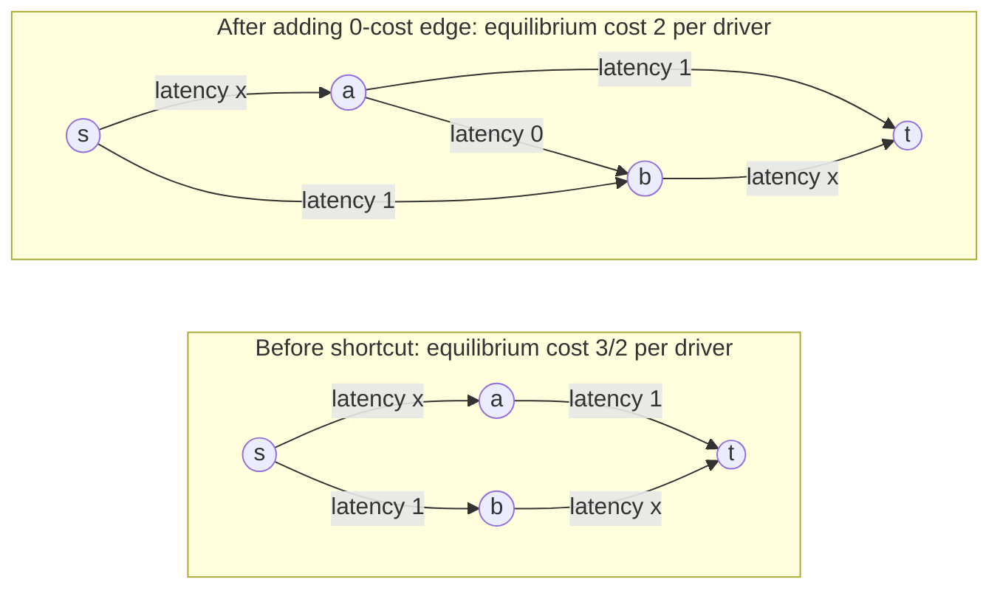
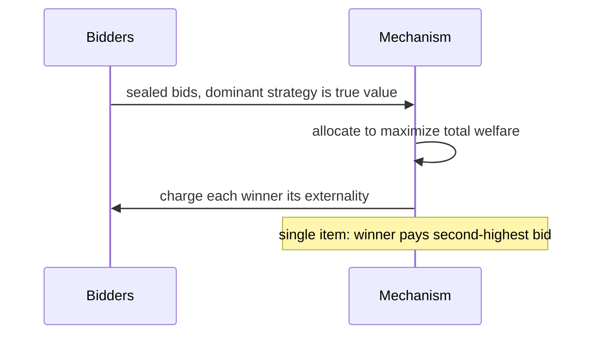

# Algorithmic Game Theory

## Overview

Algorithmic game theory studies what happens when self-interested agents — users, bidders, autonomous routing nodes — pick strategies inside a system the designer does not fully control, and what it *costs* to compute the resulting equilibria. It welds game theory's equilibrium concepts to complexity theory: Nash equilibria always exist (Nash 1950) but are PPAD-complete to compute even for two players, and unregulated self-interest can degrade a network's total latency by a provable factor — the **price of anarchy**. The field is the mathematical backbone of ad auctions at Google and Meta, blockchain MEV markets, and congestion-aware routing, and it surfaces in interviews for marketplace, infrastructure, and research-adjacent roles. This page covers the equilibrium landscape, the complexity of finding equilibria, the price of anarchy with the Pigou and Braess analyses, mechanism design via VCG, and the auction formats behind modern advertising systems.

## 1. Games, Strategies, and Equilibrium Concepts

A **normal-form game** has \\( n \\) players, strategy sets \\( S_1, \dots, S_n \\), and utilities \\( u_i(s_1, \dots, s_n) \\). A strategy is a **dominant strategy** if it is a best response to *every* opponent profile — the strongest rationality demand one can make. A **Nash equilibrium (NE)** is a strategy profile \\( s = (s_1, \dots, s_n) \\) where no player gains by a unilateral deviation:

\\[ u_i(s_i, s_{-i}) \;\ge\; u_i(s_i', s_{-i}) \qquad \forall\, i,\; \forall\, s_i' \in S_i. \\]

Pure strategies may fail to yield an equilibrium (matching pennies), but Nash's theorem guarantees a **mixed** equilibrium in every finite game. The canonical cautionary example is the prisoner's dilemma, whose unique equilibrium is strictly worse for both players than an available alternative:

| Player A \ Player B | Cooperate | Defect |
|---|---|---|
| **Cooperate** | (3, 3) | (0, 5) |
| **Defect** | **(1, 1) ← unique NE** | (5, 0) |

That gap — between the equilibrium outcome and the best available outcome — is exactly the phenomenon the price of anarchy quantifies in Section 3. Note the equilibrium concept matters as much as the game: pure vs mixed, correlated, and approximate equilibria all change both the analysis and the computational complexity.

### Zero-Sum Games Are Easy

For two-player **zero-sum** games (\\( u_1 = -u_2 \\)), von Neumann's minimax theorem gives value \\( V = \max_{p} \min_{q} p^\top A q = \min_q \max_p p^\top A q \\), and optimal mixed strategies are computable by **linear programming** — the LP dual of the maximin program is the minimax program. This is the one game family where equilibrium computation is genuinely efficient; the LP machinery is the same as in [Chapter 151: Linear Programming](../dsa/chapters/ch151-linear-programming.md). Every generalization past zero-sum (even two-player general-sum) lands in the PPAD territory of the next section.

## 2. Existence Is Cheap, Computation Is Expensive: PPAD-Completeness

Nash (1950) proved every finite game has a mixed equilibrium via **Brouwer's fixed-point theorem**: the best-response correspondence maps the product of probability simplices to itself, so it has a fixed point. The proof is non-constructive — it gives no handle for *finding* the fixed point, and that is the crux. Papadimitriou (1994) defined the class **PPAD** (Polynomial Parity Arguments on Directed graphs) to capture total search problems whose existence guarantee comes from parity/path arguments like Sperner's lemma: every instance *has* a solution, but finding it may be exponential. Brouwer fixed points are PPAD-complete, and hardness propagates:

Daskalakis–Goldberg–Papadimitriou settled three-player games (STOC 2006, journal version SIAM J. Comput. 2009); Chen–Deng (FOCS 2006) closed the gap for **two**-player games, the smallest possible setting. The practical reading: unless PPAD collapses to P — widely disbelieved — no polynomial-time algorithm computes an exact Nash equilibrium of a general game. Even constant-factor approximations resist: quasi-polynomial algorithms exist for \\( \varepsilon \\)-approximate NE (Lipton–Markakis–Mehta–Nandakishoran 2003), but no polynomial algorithm is known for any small constant \\( \varepsilon \\).

Two clarifications interviewers probe:

- **Nash search is not believed NP-hard.** Existence is guaranteed, so the problem is *total*; an NP-hard total problem would imply \\( \mathrm{NP} \subseteq \mathrm{coNP} \\) (Megiddo–Papadimitriou). Totality is precisely why the problem sits in PPAD rather than NP.
- **Correlated equilibria are polynomially computable** — for normal-form games, an LP with polynomially many variables/constraints finds one (Papadimitriou 2007 gives poly-time oracles even for succinct games). The 2005-era proof that correlated equilibria are easy while Nash is hard is a textbook example of equilibrium-concept choice dominating complexity.

The classical **Lemke–Howson** algorithm (1964) pivots through a pair of tableaux to find one equilibrium of a two-player game; it is the practical method, but its worst case is exponential (Savani–von Stengel 2006 constructed exponential-path instances).

| Equilibrium concept | Existence | Complexity of finding | Notes |
|---|---|---|---|
| Pure NE | not guaranteed | NP-hard decision variants | guaranteed in congestion/potential games |
| Mixed NE | always (Nash 1950) | PPAD-complete, 2 players | Lemke–Howson: exponential worst case |
| Correlated equilibrium | always | polynomial (LP) | distribution over strategy profiles |
| \\( \varepsilon \\)-approximate NE | always | quasi-poly known; poly open | hardness persists for constant \\( \varepsilon \\) |

### Congestion Games: Where Pure Equilibria Always Exist

**Congestion games** (Rosenthal 1973) are the workhorse model for routing and load balancing: each player picks a set of resources (edges, machines), and each resource's cost is a function of its load. Rosenthal defined the potential function

\\[ \\Phi(f) \\;=\\; \\sum_{e}\\;\\sum_{i=1}^{f_e} a_e(i), \\]

where \\( a_e(i) \\) is the marginal cost an \\( i \\)-th user imposes on resource \\( e \\). Any player's improving move strictly decreases \\( \\Phi \\), and \\( \\Phi \\) is bounded below — so there are no improvement cycles, a **pure** Nash equilibrium exists, and best-response dynamics always converge. For affine resource costs \\( a_e(x) = a_e + b_e x \\) the same potential grounds the atomic PoA bound of \\( 5/2 \\) in the table above. This is the reason pure equilibria are routinely assumed in traffic and scheduling models: the game class, not optimism, guarantees them.

## 3. Price of Anarchy and Selfish Routing

The **price of anarchy (PoA)** — coined by Koutsoupias and Papadimitriou (1999) as "worst-case equilibria" — is the worst-case ratio, over instances, between the social cost at equilibrium and the optimal (centrally planned) social cost. For routing with total latency \\( C(f) = \sum_e \ell_e(f_e)\, f_e \\):

\\[ \mathrm{PoA} \;=\; \max_{\text{instances } I}\; \frac{C(f^{\mathrm{NE}})}{C(f^{*})}. \\]

It plays the role for self-interested multi-agent systems that an approximation ratio plays for an algorithm: a worst-case guarantee of how much coordination is worth. See [Approximation Algorithms](approximation-algorithms.md) for that parallel world of approximation ratios.

### The Pigou Example with Affine Latency

Two parallel links carry one unit of traffic from \\( s \\) to \\( t \\). The top link has constant latency \\( \ell_1(x) = 1 \\) (i.e. \\( a = 1, b = 0 \\) in the affine form \\( \ell(x) = a + b x \\)); the bottom link has latency \\( \ell_2(x) = x \\) (\\( a = 0, b = 1 \\)). Selfish drivers compare current latencies: for any \\( x < 1 \\) the bottom link is strictly faster, so the unique equilibrium sends **everything** over the bottom link, where each driver experiences cost \\( \ell_2(1) = 1 \\). Total latency at equilibrium: \\( C(f^{\mathrm{NE}}) = 1 \\).

The optimum splits the flow half and half:

\\[ C(f^{*}) \;=\; \tfrac12 \cdot \ell_1(\tfrac12) + \tfrac12 \cdot \ell_2(\tfrac12) \;=\; \tfrac12 \cdot 1 + \tfrac12 \cdot \tfrac12 \;=\; \tfrac34, \\qquad \mathrm{PoA} = \frac{1}{3/4} = \frac{4}{3}. \\]

Roughgarden and Tardos (2002) proved this is the **universal** bound: every network with affine (\\( a + bx \\)) latency functions has PoA \\( \le 4/3 \\), and the Pigou instance is tight. Two quantitative extensions matter: with parallel links only, \\( \ell_2(x) = x^d \\) still gives bounded PoA (tending to 2 as \\( d \to \infty \\)); but on *arbitrary* networks with degree-\\( d \\) polynomial latencies the PoA grows as \\( \Theta(d / \log d) \\) and is **unbounded** — congestion games lose constant-factor coordination guarantees once latency functions are allowed to be steeply nonlinear.

### Braess's Paradox: Adding Capacity Can Hurt Everyone

Four nodes, one unit of traffic. The two "outer" edges (out of \\( s \\), into \\( t \\)) carry congestion-sensitive latency \\( x \\); the two "middle" edges are constant-latency 1. Before any changes there are two symmetric routes, each costing \\( x + 1 \\); the equilibrium splits \\( 1/2 \mid 1/2 \\) and every driver pays \\( 1 + 1/2 = 3/2 \\). Now build a **zero-latency** shortcut \\( a \to b \\):

With the shortcut present, the zig-zag path \\( s \to a \to b \to t \\) costs \\( x + 0 + x \\). If a fraction \\( \alpha \\) takes the zig-zag, its cost is \\( 1 + \alpha \\), which is at most the cost of either outer route \\( (1 + \alpha + r_i) \\) only when those routes carry no traffic. Working the equilibrium conditions, the **unique** equilibrium routes all traffic through the shortcut: every driver pays \\( 1 + 1 = 2 > 3/2 \\). Every driver is strictly worse off *after* a free road is added, and the optimum \\( 3/2 \\) is still achievable by forbidding the shortcut — the paradox is about equilibria, not about what is possible. Real instances exist: closing New York's 42nd Street in 1990 and demolishing Seoul's Cheonggyecheon elevated highway (2003–2005) both improved traffic flow, Braess in reverse.

### Selfish-Routing PoA Cheat Sheet

| Setting | Equilibrium concept | Worst-case PoA | Result |
|---|---|---|---|
| Pigou parallel links, affine \\( a + bx \\) | pure NE | \\( 4/3 \\), tight | Pigou 1920 instance |
| Arbitrary network, affine latencies | NE (pure or mixed) | \\( \le 4/3 \\), tight | Roughgarden–Tardos 2002 |
| Arbitrary network, degree-\\( d \\) polynomials | NE | \\( \Theta(d / \log d) \\), unbounded | Roughgarden–Tardos 2002 |
| Parallel links only, \\( x^d \\) latencies | NE | \\( \to 2 \\) as \\( d \to \infty \\) | Pigou instance |
| Atomic unsplittable congestion, affine | pure NE | \\( 5/2 \\) | Christodoulou–Koutsoupias 2005 |
| Truthful VCG mechanism | dominant strategies | \\( 1 \\) (efficient outcome) | Vickrey 1961 |
| GSP ad auction | pure NE | efficient equilibria exist, not DSIC | Edelman–Ostrovsky–Schwarz 2007 |

### Coordination Mechanisms: Lowering PoA Without a Center

When \\( 4/3 \\) matters, the designer's levers change the *game*, not the players. Three standard mechanisms: **marginal-cost pricing** — charge each user a toll equal to the externality it imposes (for differentiable latency \\( \\ell \\), the toll is \\( x\\,\\ell'(x) \\)), which makes the selfish flow coincide with the optimal flow, so PoA becomes 1 at the price of implementing tolls; **Stackelberg routing** — a leader centrally routes a fraction \\( \\alpha \\) of the traffic optimally before selfish users route the rest, yielding constant-factor improvements on every instance; and **coordination mechanisms** — redefining the local rules (say, the scheduling policy on a shared link: Longest-in-System instead of FIFO) so the *resulting* atomic game has better equilibria, with no global authority at all. The design principle generalizes beyond routing: whenever an equilibrium guarantee is poor, ask whether a price, a priority rule, or a protocol change moves the equilibrium rather than the agents.

## 4. Mechanism Design and the VCG Mechanism

Mechanism design is game theory run backwards: fix the **rules** (an outcome rule plus a payment rule) so that self-interested reporting and behavior produce the outcome you wanted. A mechanism is **dominant-strategy incentive-compatible (DSIC)** — "truthful" — when reporting true private values is a dominant strategy for every agent, **individually rational (IR)** when participation never yields negative utility, and **efficient** when it maximizes total welfare. The benchmark construction is **VCG** (Vickrey 1961, Clarke 1971, Groves 1973):

1. Allocate to maximize total reported welfare \\( \sum_i v_i(\text{allocation}) \\).
2. Charge each agent \\( i \\) the **externality** it imposes on everyone else:

\\[ p_i \;=\; \sum_{j \ne i} v_j\big(\text{best outcome with } i \text{ present}\big) \;-\; \sum_{j \ne i} v_j\big(\text{best outcome with } i \text{ absent}\big). \\]

For a single item this collapses to the **Vickrey (second-price) auction**: the highest bidder wins and pays the second-highest bid — with bids 7, 5, 3 the winner pays 5. Truthfulness is a two-case argument: if a misreport does not change who wins, it does not change the payment; if it flips the win to the agent, the agent now pays at least its true value (negative utility), and if it flips the win away, the agent loses a nonnegative surplus. Either way honesty is a dominant strategy. The same logic holds verbatim for the general externality formula, which is why VCG is the canonical DSIC *efficient* mechanism.

VCG's practical shortcomings are standard interview material: payments (and revenue) are hard to predict and can behave non-monotonically; winner determination for **combinatorial** auctions is NP-hard, so the "maximize welfare" step is itself an approximation problem ([Approximation Algorithms](approximation-algorithms.md)); and the mechanism is vulnerable to collusion through shill identities. These are the reasons real ad systems shipped a different mechanism (Section 5).

### Reserve Prices: Myerson's Optimal Auction

Truthfulness is not the only design target — revenue is. For a single bidder with value distribution \\( F \\), a take-it-or-leave-it price \\( r \\) earns \\( r \\cdot (1 - F(r)) \\); for uniform \\( [0,1] \\) values this is \\( r(1-r) \\), maximized at \\( r = 1/2 \\) with revenue \\( 1/4 \\) — double the \\( 1/8 \\) that a plain Vickrey auction extracts from a single bidder. Myerson (1981) generalized this via the **virtual value** \\( \\varphi(v) = v - \\frac{1-F(v)}{f(v)} \\): the revenue-optimal DSIC mechanism allocates to the bidder with the highest nonnegative virtual value, which for regular distributions is a second-price auction with a **monopoly reserve** \\( r^{*} = \\varphi^{-1}(0) \\). Reserve prices are everywhere in deployed systems — eBay's suggested reserves, per-query floors in keyword auctions — precisely because they are the one revenue lever that preserves truthfulness.

## 5. Auctions: First Price, Second Price, and Revenue Equivalence

**Second-price (Vickrey)**: bid your value; the mechanism does the strategic work. **First-price sealed-bid**: the winner pays their own bid, so truthful bidding is dominated — with \\( n \\) risk-neutral bidders whose values are i.i.d. uniform on \\( [0,1] \\), the symmetric Bayes–Nash equilibrium is to shade to \\( b(v) = \frac{n-1}{n} v \\): with two bidders, bid half your value. First-price bidding therefore requires every bidder to know (or learn) the value distribution; second-price requires no distributional knowledge at all, which is exactly what makes it deployable.

**Revenue equivalence** (Vickrey 1961; Myerson 1981; Riley–Samuelson 1981): with risk-neutral bidders and i.i.d. values from a common distribution \\( F \\), *every* DSIC and IR mechanism with the same allocation rule yields the same expected revenue. Consequently the four classic formats — English ascending, Dutch descending, first-price sealed-bid, Vickrey second-price — have identical expected revenue under the stated assumptions. The theorem's fine print is where practice diverges: risk aversion, asymmetric or correlated values, and resale all break it, and empirically first-price formats raise more revenue under risk aversion.

| Property | First-price | Second-price (Vickrey) |
|---|---|---|
| Optimal bidding | shade below value: \\( \frac{n-1}{n} v \\) (uniform case) | bid exactly \\( v \\) |
| Strategic knowledge needed | value distribution of rivals | none (dominant strategy) |
| Truthful / DSIC | no | yes |
| Expected revenue (risk-neutral i.i.d.) | equal | equal |
| Dominant deployed variant | header bidding, display ad exchanges | single-item spot markets |

### Ad Auctions: GSP vs VCG

Internet advertising sells **slots**, not items, with per-slot click-through rates \\( \mathrm{ctr}_1 > \mathrm{ctr}_2 > \dots \\). The **generalized second-price (GSP)** mechanism — the accidental invention of early sponsored search (Overture), analyzed by Edelman–Ostrovsky–Schwarz and Varian (2007) — ranks bidders by bid and charges each winner the bid of the advertiser *below* them, per click. Worked example with two slots (\\( \mathrm{ctr}_1 = 0.5 \\), \\( \mathrm{ctr}_2 = 0.3 \\)) and per-click bids 4, 2, 1:

- **GSP**: bidder-4 takes slot 1 paying 2 per click; bidder-2 takes slot 2 paying 1 per click. Revenue per impression: \\( 0.5 \cdot 2 + 0.3 \cdot 1 = 1.3 \\).
- **VCG**: payments are externalities. Bidder-4's presence demotes bidder-2 from slot 1 to slot 2 and displaces bidder-1 entirely, so bidder-4 pays \\( (2 \cdot 0.5 + 1 \cdot 0.3) - (2 \cdot 0.3) = 0.7 \\) per impression, i.e. \\( 1.4 \\) per click; bidder-2 pays \\( 0.3 \\) per impression (\\( 1.0 \\) per click). Revenue per impression: \\( 0.7 + 0.3 = 1.0 \\).

GSP is **not DSIC** — truthful bidding is not a dominant strategy — yet it has honest, efficient equilibria and, critically, its dynamics are simple and its payments are stable, which is why it conquered search advertising. Meta's ad system is the prominent VCG deployment; first-price formats took over much of display advertising during the header-bidding shift of 2017–2019, driving an entire industry of ML **bid-shading** systems whose job is to approximate the equilibrium shading \\( \frac{n-1}{n} v \\) when no dominant strategy exists.

## 6. Applications Beyond Auctions

- **Ad and marketplace auctions**: GSP/VCG for search and social ads; reserve prices tuned via Myerson's optimal-auction theory (the virtual-value characterization, Myerson 1981). Auction clearing at billion-query scale forces engineering compromises (approximate VCG, ML shading) that the theory predicts.
- **Network routing and congestion control**: the \\( 4/3 \\) affine PoA is the quantitative argument for centralized traffic engineering in SDN — central control buys at most a \\( 4/3 \\) latency improvement over selfish routing on realistic (affine) links, but unbounded gains when latency functions are steep.
- **Blockchain markets**: MEV extraction, priority gas auctions, and builder auctions ([MEV and PBS](../blockchain/mev-pbs.md)) are live adversarial games where the "equilibrium" is emergent behavior of bidding bots; price-of-anarchy-style analysis motivates protocol-level mechanisms (e.g., proposer-builder separation) over hoping agents cooperate.
- **Matching and scheduling**: stable matching with preferences, and job scheduling on self-interested machines, reuse the same equilibrium-existence and PoA tooling (atomic congestion games above).

The connective skill across these applications is choosing the analysis level deliberately: exact equilibrium computation when the game is small and strategic (accepting PPAD-hardness as a small-case reality); PoA bounds when the population is large and worst-case reasoning is affordable; and price or protocol adjustments (the coordination mechanisms above) when the bound is not good enough. Interviewers reward candidates who can move between the three levels in one answer rather than reciting a single theorem.

## Interview Questions

1. **Nash equilibria always exist — so why is computing one hard, and hard in what sense?**
   Existence (Nash 1950) is a fixed-point argument with no constructive content. Finding an equilibrium is a *total* search problem — a solution is guaranteed — so it is not expected to be NP-hard (that would imply \\( \mathrm{NP} \subseteq \mathrm{coNP} \\)); instead it is **PPAD-complete**, even for two players (Chen–Deng 2006) and even for \\( \varepsilon \\)-approximate equilibria at small constant \\( \varepsilon \\). Practically: Lemke–Howson pivoting works on small games but has exponential worst case, and correlated equilibria — a weaker solution concept — are computable in polynomial time via LP.
2. **State the price of anarchy for affine-latency routing and prove the tight example.**
   For any network with latency functions \\( \ell(x) = a + bx \\), the PoA is at most \\( 4/3 \\) (Roughgarden–Tardos 2002). Tightness: the Pigou instance — two parallel links, unit traffic, \\( \ell_1 = 1 \\), \\( \ell_2 = x \\). Equilibrium sends everything to the bottom link (cost 1); the optimum splits \\( 1/2 \mid 1/2 \\) for total \\( 1/2 + 1/4 = 3/4 \\). Ratio \\( 4/3 \\). With nonlinear latencies the guarantee collapses: degree-\\( d \\) polynomials give PoA \\( \Theta(d/\log d) \\), unbounded as \\( d \\) grows.
3. **Explain Braess's paradox with numbers.**
   Unit traffic, two symmetric two-edge routes \\( s\to a\to t \\) and \\( s\to b\to t \\) where the \\( s \\)-side and \\( t \\)-side edges have latency \\( x \\) and the middles are constant 1. Equilibrium: \\( 1/2 \\) per route, everyone pays \\( 1.5 \\). Add a zero-latency edge \\( a \to b \\): the unique equilibrium routes everything through \\( s\to a\to b\to t \\), paying \\( 1 + 1 = 2 \\). Free infrastructure raised everyone's latency from 1.5 to 2. The Seoul Cheonggyecheon highway demolition (2003–2005) is the canonical real-world instance — removing capacity *improved* flow.
4. **Why is VCG truthful? What limits its real-world use?**
   VCG pays each agent the externality it imposes on others. Report truthfully and your utility equals the total welfare you generate; any misreport either leaves your allocation unchanged (same payment) or changes it — in which case a one-line inequality shows your utility cannot improve. Single item: winner pays the second price, so shading never helps. Limits: payments/revenue are hard to predict and can be non-monotone; combinatorial winner determination is NP-hard; and it is open to collusion and shill bidding, which is why search ads use GSP and first-price exchanges use ML bid shading instead.
5. **First-price vs second-price: bidding behavior and when revenues match.**
   Second-price has the dominant strategy "bid your value"; first-price requires shading to \\( \frac{n-1}{n} v \\) under i.i.d. uniform values — equilibrium behavior that depends on the distribution. **Revenue equivalence** (Myerson 1981) says expected revenues coincide across any DSIC, IR mechanisms with the same allocation rule for risk-neutral i.i.d. bidders — so English, Dutch, first-price, and Vickrey formats all match in the idealized model. Break any assumption (risk aversion, correlation, asymmetry) and the equivalence fails; risk aversion empirically favors first-price.
6. **What does PoA buy you as an engineer that average-case analysis does not?**
   PoA is a worst-case, assumption-light guarantee: it bounds the damage of *any* equilibrium of *any* instance given only the latency structure, without a distribution over inputs or behaviors. That is the same epistemic position as competitive analysis for online algorithms ([Online Algorithms](online-algorithms.md)) — and it directly prices the value of coordination: under affine latencies, centralized traffic engineering is worth at most \\( 4/3 \\), so optimizing further requires changing the game (pricing, capacity) rather than the algorithm.

## Key Takeaways

- Nash equilibria exist in all finite games but are **PPAD-complete to find** for two players (Chen–Deng 2006); total search problems are not expected to be NP-hard, hence PPAD rather than NP.
- Correlated equilibria are polynomial-time computable (LP) — the choice of equilibrium concept, not the game size, usually decides complexity.
- Price of anarchy = worst-case ratio of equilibrium social cost to optimum; it is the approximation-ratio analogue for self-interested systems.
- Affine latency \\( a + bx \\) routing has PoA exactly **4/3** (Pigou instance tight, Roughgarden–Tardos); degree-\\( d \\) polynomials give \\( \Theta(d/\log d) \\) — unbounded.
- **Braess's paradox**: adding a free edge raised every driver's cost from 3/2 to 2; verified empirically (Seoul 2003–2005). Equilibria, not optima, respond to infrastructure.
- VCG is DSIC and efficient via externality payments (single item = second price); its practical rivals — GSP for ads, first-price with ML bid shading — trade truthfulness for payment stability and simplicity.
- Revenue equivalence: risk-neutral i.i.d. bidders + same allocation + IC/IR ⇒ equal expected revenue across English, Dutch, first-price, Vickrey formats.
- Zero-sum two-player games are the efficiency exception: minimax value and optimal strategies via LP duality.

## References

1. Nash (1950), *Equilibrium Points in N-Person Games*, PNAS 36(1):48–49 — <https://www.pnas.org/doi/10.1073/pnas.36.1.48>
2. Chen & Deng (2006), *Settling the Complexity of Two-Player Nash Equilibrium*, FOCS 2006 (journal: SIAM J. Comput. 42(1), 2013).
3. Daskalakis, Goldberg & Papadimitriou (2009), *The Complexity of Computing a Nash Equilibrium*, SIAM J. Comput. 39(1) (STOC 2006).
4. Koutsoupias & Papadimitriou (1999), *Worst-case Equilibria*, STACS 1999 — the paper that introduced the price of anarchy.
5. Roughgarden & Tardos (2002), *How Bad is Selfish Routing?*, J. ACM 49(2):236–259 (affine PoA 4/3 and the \\( \Theta(d/\log d) \\) polynomial bound).
6. Edelman, Ostrovsky & Schwarz (2007), *Internet Advertising and the Generalized Second-Price Auction*, American Economic Review 97(1).
7. Myerson (1981), *Optimal Auction Design*, Mathematics of Operations Research 6(1) — revenue equivalence and optimal auctions.
8. Nisan, Roughgarden, Tardos & Vazirani (eds.) (2007), *Algorithmic Game Theory*, Cambridge University Press — chapters 1, 9, 18–19 cover this page.
9. Roughgarden, *CS364A: Algorithmic Game Theory* (Stanford, Fall 2013), lecture notes and videos — <http://theory.stanford.edu/~tim/f13/f13.html>
10. MIT OpenCourseWare, *6.254 Game Theory with Engineering Applications* — <https://ocw.mit.edu>

## Cross-References

- [Complexity Classes](./complexity-classes.md) — where PPAD sits relative to P and NP, and why total search problems differ from NP-hard decision problems.
- [Approximation Algorithms](./approximation-algorithms.md) — approximation ratios vs price of anarchy; gap problems; the same \\( 4/3 \\)-style tight-instance methodology.
- [Online Algorithms](./online-algorithms.md) — competitive analysis as the worst-case sibling of PoA; ski rental and paging under adversaries.
- [Chapter 151: Linear Programming](../dsa/chapters/ch151-linear-programming.md) — LP duality solves zero-sum minimax and correlated-equilibrium LPs.
- [MEV and PBS](../blockchain/mev-pbs.md) — mechanism design under adversarial bidding bots in production blockchain markets.
