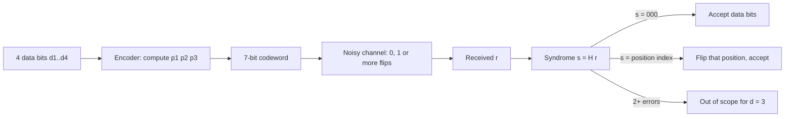
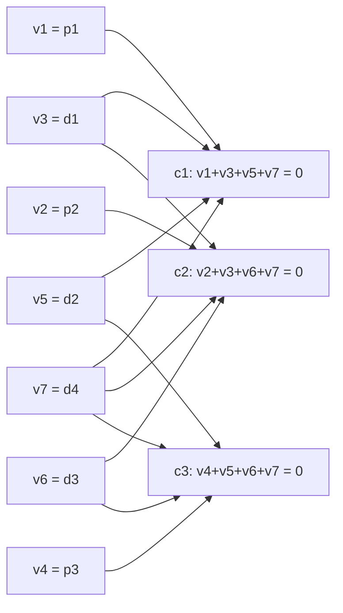
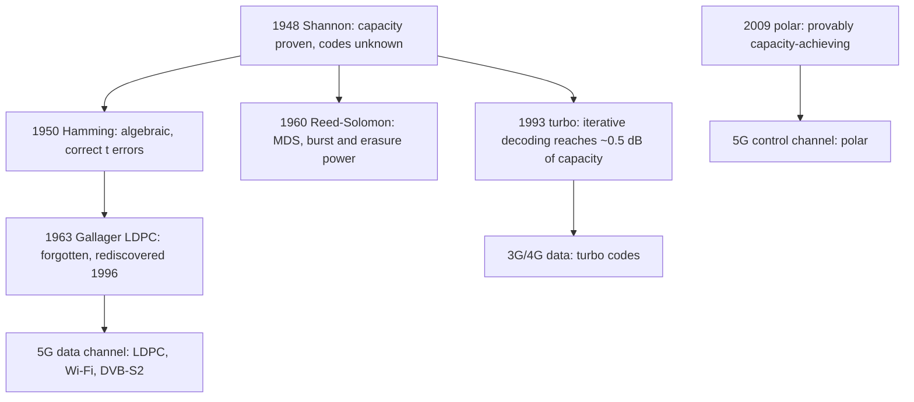

# Coding Theory

## Overview

Coding theory builds the redundancy that lets digital systems survive noise: every network packet,
SSD page, QR code, and RAID stripe carries an error-correcting code. The field is the
*constructive* twin of information theory — Shannon proved rates below capacity are achievable,
and codes (Hamming, Reed–Solomon, LDPC, polar) are how. This page works the distance/bound
vocabulary, walks the Hamming(7,4) encode–decode example end to end (the canonical whiteboard
question), explains Reed–Solomon's evaluation view and why CDs and QR codes lean on it, covers the
modern capacity-approaching codes (LDPC + polar in 5G, Viterbi/turbo briefly), and lands on
RAID-6/erasure coding, where the same algebra stores data in Ceph, HDFS, and S3. Storage-side
mechanics live in [Erasure Coding](../storage/erasure-coding.md) and
[Advanced Erasure Coding](../storage/advanced/erasure-coding-deep.md); packet FEC in
[FEC for Packet Networks](../networks/advanced/fec-networking.md); the capacity ceilings in
[Information Theory](information-theory.md).

## 1. Hamming Distance, Weight, and Linear Codes

For binary strings \\( x, y \in \{0,1\}^n \\):

- **Hamming distance** \\( d(x, y) \\) = number of differing positions; **weight**
  \\( \text{wt}(x) \\) = number of 1s; \\( d(x,y) = \text{wt}(x \oplus y) \\).
- A **code** is a subset \\( \mathcal{C} \subseteq \{0,1\}^n \\); its **minimum distance**
  \\( d = \min_{x \ne y \in \mathcal{C}} d(x, y) \\) determines power:

\\[ \text{detect } d-1 \text{ errors}, \qquad \text{correct } t = \left\lfloor \frac{d-1}{2} \right\rfloor \text{ errors}. \\]

Detection needs every error pattern of weight < d to be non-codeword; correction needs radius-t
balls around codewords to be disjoint (two balls of radius t around codewords at distance
\\( \le 2t \\) would overlap). The erasure counterpart: with \\( f \\) known-position losses,
\\( f \le d - 1 \\) is correctable — knowing *where* the damage is halves the distance budget
(section 4, why CD scratches are recoverable).

- A **linear** code is a \\( k \\)-dimensional subspace of \\( \{0,1\}^n \\) (or \\( \text{GF}(q)^n \\)):
  \\( [n, k, d] \\) code, **rate** \\( R = k/n \\). Encoding is a matrix multiply by the generator
  \\( G \\) (\\( c = mG \\)); checking is multiplication by the parity-check matrix
  \\( H \\) (\\( Hc = 0 \\) for codewords). For linear codes \\( d = \\) minimum weight of a
  nonzero codeword.
- The **syndrome** \\( s = Hr^{\!\top} \\) of a received word \\( r \\) is zero iff \\( r \\) is a
  codeword; for small codes, \\( s \\) *identifies the error position* directly — the decode
  mechanism in section 3.

## 2. The Singleton and Hamming Bounds

Three inequalities fence in what codes can exist. Knowing them turns "can we build X?" into
arithmetic.

| Bound | Statement | Meaning | Achieved by |
|---|---|---|---|
| Singleton | \\( d \le n - k + 1 \\) | distance costs rate 1-for-1 | Reed–Solomon (MDS codes) |
| Hamming (sphere-packing) | \\( 2^k \sum_{i=0}^{t}\binom{n}{i} \le 2^n \\) | correction balls can't overlap | Hamming, Golay (perfect codes) |
| Gilbert–Varshamov | codes exist with \\( d \ge \\) given GV value | existence guarantee (greedy) | random linear codes (whp) |

**Worked check — Hamming(7,4) is perfect.** \\( t = 1 \\), \\( \sum_{i=0}^{1}\binom{7}{i} = 8 \\),
\\( 2^4 \times 8 = 128 = 2^7 \\): the radius-1 balls around all 16 codewords tile the whole
7-cube with no gaps or overlaps. Perfection is rare — the only nontrivial binary perfect codes
are Hamming and the [23,12,7] Golay code.

**Rate-vs-distance reality check**: the Singleton bound says a \\( [n, k, d] \\) code pays
\\( d - 1 \\) redundancy symbols. For large \\( n \\), random coding achieves
\\( R = 1 - H_2(d/n) \\) (GV) while the best possible is \\( R = 1 - 2d/n \\) for relative
distance up to ~0.11 (the McEliece–Rodemich–Rumsey–Welch/LP bound) — a gap open for 45+ years.

## 3. Parity Bits to Hamming(7,4): Full Worked Example

A single **parity bit** detects any odd number of flips but corrects nothing. Richard Hamming
(1950) spread parity across overlapping groups so the *pattern* of failed parities points at the
bad bit. In \\( [7,4,3] \\): 4 data bits, 3 parity bits at positions \\( 2^i \\); each parity
covers the positions whose binary index has that bit set.

Layout: positions 1–7 hold \\( p_1, p_2, d_1, p_3, d_2, d_3, d_4 \\). Parity rules (even parity):

\\[ p_1 = d_1 \oplus d_2 \oplus d_4 \;\; (\text{pos } 3,5,7), \qquad
   p_2 = d_1 \oplus d_3 \oplus d_4 \;\; (\text{pos } 3,6,7), \qquad
   p_3 = d_2 \oplus d_3 \oplus d_4 \;\; (\text{pos } 5,6,7) \\]

**Encode** \\( d = 1011 \\) (\\( d_1 d_2 d_3 d_4 = 1, 0, 1, 1 \\)):

\\[ p_1 = 1 \oplus 0 \oplus 1 = 0, \qquad p_2 = 1 \oplus 1 \oplus 1 = 1, \qquad p_3 = 0 \oplus 1 \oplus 1 = 0 \\]

Codeword (positions 1→7): **0110011**. Rate 4/7 ≈ 0.571, distance 3.

**Decode with a single error.** Suppose position 5 flips: received \\( r = 0110111 \\). Recompute
the three parities over \\( r \\) — this vector is the **syndrome**:

\\[ s_1 = r_1 \oplus r_3 \oplus r_5 \oplus r_7 = 0 \oplus 1 \oplus 1 \oplus 1 = 1, \quad
   s_2 = r_2 \oplus r_3 \oplus r_6 \oplus r_7 = 1 \oplus 1 \oplus 1 \oplus 1 = 0, \quad
   s_3 = r_4 \oplus r_5 \oplus r_6 \oplus r_7 = 0 \oplus 1 \oplus 1 \oplus 1 = 1 \\]

Syndrome \\( (s_3 s_2 s_1) = 101_2 = 5 \\) — the syndrome *is* the binary index of the flipped
position. Flip position 5, recheck: all parities pass. No error (syndrome 000) or a parity-only
error decode to the original data for free; two errors look like one (this code cannot detect
that — distance 3).

The syndrome's binary-index trick generalizes: shortened Hamming codes with the same geometry
protect ECC DRAM (72-bit DIMM words = 64 data + 8 SECDED check bits, adding an overall parity for
double-error *detection*). The bipartite view of "checks cover bits" below is the **Tanner
graph** — the data structure LDPC decoders run belief propagation on (section 5).

## 4. Reed–Solomon: Evaluation View, Erasures, CDs and QR

Reed–Solomon (1960) treats the message as a **polynomial** rather than a bit string. Work over
\\( \text{GF}(2^8) \\) (byte arithmetic, 256 elements): take \\( k \\) message bytes as the
coefficients of a polynomial \\( P(x) \\) of degree \\( < k \\), and define the codeword as its
\\( n \\) **evaluations** at \\( n \\) fixed points \\( x_1, \dots, x_n \\) (typically
\\( \alpha^0, \dots, \alpha^{n-1} \\)). Two facts do all the work:

- A degree-\\( <k \\) polynomial is determined by any \\( k \\) of its evaluation points
  (Lagrange interpolation), so any \\( k \\) surviving positions recover the message — **erasures**.
- Two distinct degree-< k polynomials agree in fewer than \\( k \\) points, so any two codewords
  differ in more than \\( n - k \\) positions: \\( d = n - k + 1 \\) — **MDS**, meeting the
  Singleton bound with equality. No code of rate \\( k/n \\) over \\( n \\) positions can do better.

Correction budgets: with \\( e \\) unknown errors and \\( f \\) known erasures,

\\[ 2e + f \;\le\; d - 1 \;=\; n - k. \\]

Erasure decoding is *interpolation* (cheap, linear algebra); error decoding must first *locate*
the errors (Berlekamp–Massey finds the error-locator polynomial; decode in \\( O(n^2) \\), or
\\( O(n \log n) \\) via FFT-friendly constructions — the polynomial/evaluation duality is exactly
the FFT machinery of [Chapter 167: FFT and NTT](../dsa/chapters/ch167-fft-ntt.md)).

**Why CDs use it**: a scratch destroys a *burst* of adjacent bits — as interleaved byte positions,
that is a set of known-ish losses. CD audio (CIRC) uses two interleaved shortened RS codes over
\\( \text{GF}(2^8) \\) — RS(32,28) and RS(28,24) — correcting bursts up to ~4000 bits (~2.5 mm of
track) and concealing beyond that. **QR codes** append RS blocks over \\( \text{GF}(2^8) \\) with
levels L/M/Q/H recovering ~7/15/25/30% of codewords — that is why a torn QR sticker still scans.
NASA's deep-space standard RS(255,223) corrects 16 byte errors per 255-byte block; the same
\\( [n, k, n-k+1] \\) family, with different fields and lengths, reappears as storage erasure
codes (section 6). Code-based cryptography (McEliece over binary Goppa codes) shows the flip
side: decoding is hard enough to build crypto on — see
[Code-Based Cryptography](../cryptography/code-based-crypto.md).

## 5. Capacity-Approaching Codes: Convolutional, Turbo, LDPC, Polar

Shannon said \\( R < C \\) is achievable; for 45 years practical codes sat 3+ dB short. The modern
story is three revolutions, all decoded *iteratively* on graphs:

- **Convolutional codes + Viterbi**: a shift register of length \\( K \\) convolves the bit stream
  with generator polynomials; the classic rate-1/2, \\( K = 7 \\) code (polynomials \\( 171_o,
  133_o \\)) flew on Voyager and lived in GSM, DSL, and 802.11a. Viterbi decoding runs maximum
  likelihood over a trellis of \\( 2^{K-1} = 64 \\) states — \\( O(n \cdot 2^{K-1}) \\) work,
  feasible only for small \\( K \\). Coding gain ~5 dB at \\( 10^{-5} \\) BER — good, still ~3 dB
  from the BSC/AWGN limit.
- **Turbo codes** (Berrou, Glavieux, Thitimajshima, ICC 1993): two parallel convolutional codes
  with interleavers, decoded by exchanging soft probabilities (iterative "belief" passing). The
  reported ~0.5 dB gap to Shannon capacity forced the entire field onto iterative decoding and
  made turbo the 3G/4G workhorse.
- **LDPC** (low-density parity-check; Gallager 1963, revived ~1996 by MacKay–Neal): a
  parity-check matrix with few 1s per row/column defines a sparse Tanner graph (section 3's
  diagram, scaled up to thousands of nodes); belief propagation on that graph decodes in time
  linear in block length per iteration, ~10–50 iterations. LDPC is what Shannon-gap engineering
  looks like in deployment: **5G NR data channel (PDSCH)**, **Wi-Fi 802.11n/ac/ax**, **DVB-S2/S2X**
  (within ~0.7–1 dB of the AWGN limit), 10GBase-T Ethernet.
- **Polar codes** (Arıkan, 2009): recursively combine and split copies of a channel until the
  synthesized channels polarize — a fraction \\( I(W) \\) become noiseless, the rest pure noise;
  send data only on the good ones. First constructive scheme with *provable* capacity achievement
  for symmetric binary channels at rate \\( I(W) \\), with \\( O(N \log N) \\) encode/decode via
  the successive-cancellation decoder (list decoding closes most of the SC-decoder gap). The
  **5G story**: 3GPP's 2016 shootout picked polar codes for the **control channels (PDCCH/PBCH)**
  — short blocks, where polar's SC decoding shines — and LDPC for the **data channel**; the
  decision was geopolitically visible (Huawei-backed polar vs Qualcomm-backed LDPC) and put
  Arıkan's 2009 paper into every phone shipped since 2018. Spec: 3GPP TS 38.212.

## 6. RAID-6 and Erasure Coding in Storage

Storage is coding theory with disks as symbols. **RAID-5** (single parity \\( P \\)) is a \\( d = 2 \\)
code — one XOR stripe per row detects and survives one failure; a second failure during rebuild
kills the array, and with multi-TB disks the rebuild window made that a real probability (the
"RAID-5 write hole" and URE-during-rebuild discussions). **RAID-6** adds a second, algebraically
independent parity:

\\[ P = d_0 \oplus d_1 \oplus \dots \oplus d_{k-1}, \qquad Q = \sum_i g^i \, d_i \;\; \text{in } \mathrm{GF}(2^8), \\]

with \\( g \\) a generator of the field (implementations fix the primitive polynomial, e.g.
`0x11D` in Linux MD). Losing any two disks \\( a, b \\) leaves two linear equations in two
unknowns over \\( \text{GF}(2^8) \\) — solvable because the \\( g^i \\) make the system
Vandermonde/non-singular. This is \\( [n, n-2, 3] \\) MDS exactly Reed–Solomon logic: two parity
symbols, distance 3, survive two erasures. Wide-striping generalizes to \\( m \\) parities for any
survival count — Ceph EC(8,3), HDFS-RS(6,3), and LizardFS/MinIO all ship RS-based layouts, and
regenerating codes (MSR/Clay) cut the repair traffic below the MDS minimum. Full encodings,
field arithmetic, and the storage tradeoff table:
[Erasure Coding](../storage/erasure-coding.md),
[Advanced Erasure Coding](../storage/advanced/erasure-coding-deep.md), and the RAID-level
comparison in [RAID](../os/filesystems/raid.md). On the wire, packet FEC (RaptorQ fountain codes,
RFC 6330; XOR/Reed–Solomon in QUIC's DATAGRAM extensions and WebRTC) applies the same erasure
math to lossy links — see [FEC for Packet Networks](../networks/advanced/fec-networking.md).

## 7. Code Family Comparison

| Code | Params / where | Rate | Distance / strength | Decoding | Classic use |
|---|---|---|---|---|---|
| Parity | RAID-5, UART | ~1 | d = 2, detect 1 | XOR | single-failure protection |
| Hamming(7,4) / ECC DRAM | \\( [7,4,3] \\), [72,64] SECDED | 0.571 / 0.889 | d = 3, correct 1 | syndrome lookup | RAM, legacy telemetry |
| Reed–Solomon | \\( [255,223] \\) over GF(2^8); QR; CD CIRC | 0.6–0.94 | MDS: \\( d = n-k+1 \\) | Berlekamp–Massey \\( O(n^2) \\) | CDs, QR, DVB, storage EC, RAID-6 |
| Convolutional (K=7) | rate 1/2 | 0.5 | ~5 dB coding gain | Viterbi \\( O(n\,2^{K}) \\) | Voyager, GSM, 802.11a |
| Turbo | parallel concatenated, 3G/4G | 1/3–0.9 | ~0.5 dB from capacity | iterative MAP | LTE, UMTS, CCSDS |
| LDPC | sparse H, long blocks | 1/5–0.9 | 0.7–1 dB from capacity | belief propagation, linear/iter | 5G data, Wi-Fi ax, DVB-S2 |
| Polar | Arıkan; short blocks | selectable | provably \\( R \to C \\) | SCL \\( O(N \log N) \\) | 5G control (PDCCH/PBCH) |
| RaptorQ (fountain) | rateless | any \\( k \to n \\) | any \\( k+ \\) symbols suffice | belief propagation + peeling | RFC 6330, IP multicast,repair streams |

Rules of thumb for interviews: algebraic codes (Hamming/RS) give *hard guarantees* at short
lengths and are the only choice when you need MDS (storage); iterative codes (LDPC/turbo) dominate
long noisy *bit* channels where soft information exists; polar wins short control payloads;
fountain codes win when the receiver count or channel quality is unknown.

## Interview Questions

1. **A code has minimum distance d — what exactly can it do?**
   Detect any error pattern of weight ≤ d−1; correct any pattern of weight ≤ ⌊(d−1)/2⌋; correct up
   to d−1 *erasures* (positions known). Reasoning: correction needs radius-t balls disjoint, which
   requires d ≥ 2t+1; erasures already locate the damage, so each erasure costs one dimension
   (interpolation) instead of two (location + value) — the 2e + f ≤ d−1 budget. This erasure
   discount is why RS suits bursty media and storage faults.
2. **Encode 1011 with Hamming(7,4), then decode a one-bit error.**
   Parities: \\( p_1 = d_1\oplus d_2 \oplus d_4 = 0 \\), \\( p_2 = d_1\oplus d_3\oplus d_4 = 1 \\),
   \\( p_3 = d_2\oplus d_3\oplus d_4 = 0 \\) → codeword 0110011. If position 5 flips, recomputing
   the three parity groups gives syndrome \\( (s_3 s_2 s_1) = 101_2 = 5 \\): the syndrome is the
   binary index of the bad position. Flip it, verify zero syndrome, extract data bits. Rate 4/7,
   d = 3, perfect code (\\( 2^4(1+7) = 2^7 \\)).
3. **Why do CDs and QR codes use Reed–Solomon specifically?**
   RS is MDS (\\( d = n-k+1 \\), Singleton-tight) over byte-sized symbols, so a fixed redundancy
   buys the maximum possible erasure tolerance, and symbol-level codes absorb *burst* errors —
   interleaving spreads a physical scratch across many codewords as scattered symbol losses.
   Decoding 2e + f ≤ n−k means known-position damage is pure interpolation. QR level H recovers
   ~30% of codewords; CD's CIRC survives ~2.5 mm scratches; the same MDS property is why storage
   erasure coding uses RS.
4. **What changed with LDPC and polar codes, and why does 5G use both?**
   LDPC (sparse parity-check graph + belief propagation) and polar (channel polarization,
   capacity-achieving with \\( O(N\log N) \\) successive-cancellation decoding) both approach the
   Shannon limit where classical algebraic codes plateau ~3 dB short. 3GPP TS 38.212 split the
   job: LDPC for the data channel (long blocks, high rates, soft iterative decoding amortizes
   well), polar for control channels (short blocks where list-decoded polar beats LDPC). It is a
   rare case of two code families from different eras deployed side by side by standard.
5. **How does RAID-6 survive two disk failures with just two parity stripes?**
   \\( P \\) is the XOR of the data stripes; \\( Q = \sum g^i d_i \\) over \\( \mathrm{GF}(2^8) \\)
   is a second, linearly independent equation. Losing any two disks leaves two independent
   equations in the two unknown stripes — solvable in the field because \\( g^i \\) (a
   Vandermonde-style system) guarantees non-singularity for any pair. That is an
   \\( [n, n-2, 3] \\) MDS code: distance 3 = two erasures + one detection, exactly the
   RS/Singleton logic. RAID-5 is the \\( d = 2 \\) special case; three-plus parities generalize.
6. **Relation between Hamming and Hamming bounds — and why "perfect" is rare?**
   The Hamming (sphere-packing) bound \\( 2^k \sum_{i \le t} \binom{n}{i} \le 2^n \\) says
   radius-t balls cannot overlap. A code is *perfect* when equality holds — balls tile the space.
   Binary perfect nontrivial cases are only Hamming codes (t = 1) and the Golay [23,12,7]; most
   codes waste some packing space, which is why capacity-approaching design moved from algebraic
   constructions to probabilistic/iterative ones.

## Key Takeaways

- \\( [n, k, d] \\): detect \\( d-1 \\), correct \\( \lfloor (d-1)/2 \rfloor \\), correct
  \\( d-1 \\) erasures; linear codes encode with \\( G \\), diagnose with the syndrome \\( Hr^\top \\).
- Hamming(7,4): parity bits at positions 1, 2, 4; syndrome = binary index of the flipped bit;
  1011 → 0110011 → flip pos 5 → 1011. Perfect code: \\( 2^4 \cdot 8 = 2^7 \\).
- Singleton bound \\( d \le n-k+1 \\) is met by Reed–Solomon (MDS): evaluation view — message =
  polynomial coefficients, codeword = evaluations; erasures = interpolation, errors need
  Berlekamp–Massey; budget \\( 2e + f \le n - k \\).
- CDs (CIRC) and QR (L/M/Q/H ≈ 7/15/25/30%) use RS for burst/erasure tolerance; NASA ships
  RS(255,223); the identical algebra stores data in RAID-6 (P, Q over GF(2^8)) and Ceph/HDFS
  erasure layouts.
- Iterative decoding revolution: turbo (1993, ~0.5 dB from capacity) and LDPC (sparse Tanner
  graphs, belief propagation) — 5G data channel is LDPC, Wi-Fi ax and DVB-S2 are LDPC.
- Polar codes (Arıkan 2009): provably capacity-achieving, \\( O(N \log N) \\) SC decoding —
  3GPP chose them for 5G control channels (TS 38.212).
- RAID-6's P/Q parities are an \\( [n, n-2, 3] \\) MDS code: two independent GF(2^8) equations
  solve any two-disk loss; erasure coding = RS with wide stripes.
- Know the comparison table: algebraic codes for short/MDS guarantees, LDPC/turbo for long
  soft-decision channels, polar for short blocks, fountain (RaptorQ, RFC 6330) for unknown
  receivers.

## References

1. Shannon (1948), *A Mathematical Theory of Communication*, Bell System Technical Journal 27 —
   capacity, the target all codes chase.
2. Hamming (1950), *Error Detecting and Error Correcting Codes*, Bell System Technical Journal
   29(2) — the [7,4] code and syndrome decoding.
3. Reed & Solomon (1960), *Polynomial Codes over Certain Finite Fields*, J. SIAM 8(2) — the
   evaluation-view MDS code.
4. MacKay, *Information Theory, Inference, and Learning Algorithms*, Cambridge University Press —
   LDPC, belief propagation, and the capacity story, free online —
   <https://www.inference.org.uk/mackay/itila/>
5. Arıkan (2009), *Channel Polarization: A Method for Constructing Capacity-Achieving Codes for
   Symmetric Binary-Input Memoryless Channels*, IEEE Trans. Information Theory 55(7) —
   <https://arxiv.org/abs/0807.3917>
6. 3GPP TS 38.212, *NR; Multiplexing and channel coding* (LDPC for data, polar for control) —
   <https://www.3gpp.org>
7. IETF RFC 6330, *RaptorQ Forward Error Correction Scheme for Object Delivery* —
   <https://datatracker.ietf.org/doc/rfc6330/>
8. Berrou, Glavieux & Thitimajshima (1993), *Near Shannon Limit Error-Correcting Coding and
   Decoding: Turbo-Codes*, IEEE ICC — the iterative-decoding turning point.

## Cross-References

- [Information Theory](./information-theory.md) — capacity bounds these codes approach; entropy
  and the BSC/AWGN formulas.
- [Erasure Coding](../storage/erasure-coding.md) — RS layouts, EC(k,m) tradeoffs, and rebuild
  behavior in object stores.
- [Advanced Erasure Coding](../storage/advanced/erasure-coding-deep.md) — GF(2^8) arithmetic,
  Vandermonde/Cauchy matrices, regenerating (MSR/Clay) codes.
- [RAID](../os/filesystems/raid.md) — RAID-5/6 level semantics, write hole, and rebuild risk.
- [FEC for Packet Networks](../networks/advanced/fec-networking.md) — packet-level erasure
  coding and the FEC-vs-ARQ decision.
- [Code-Based Cryptography](../cryptography/code-based-crypto.md) — syndrome decoding as a
  hardness assumption (McEliece), the cryptanalytic mirror of decoding.
- [Chapter 167: FFT and NTT](../dsa/chapters/ch167-fft-ntt.md) — polynomial evaluation/
  interpolation machinery behind FFT-based RS encoding.
