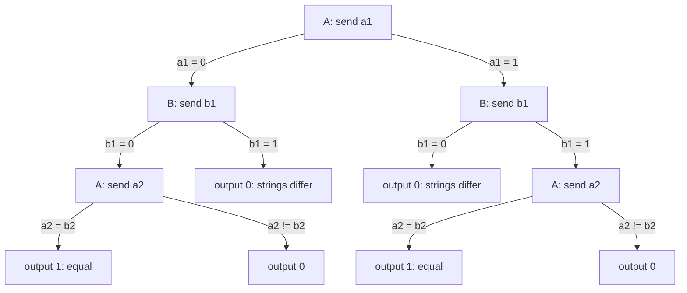
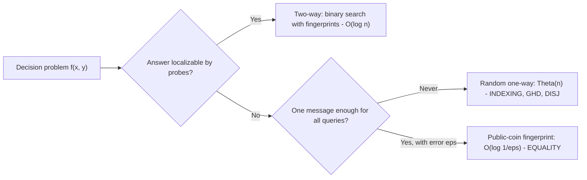
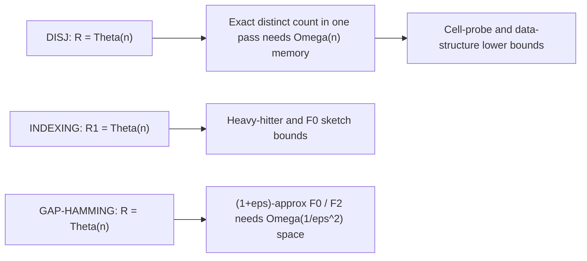

# Communication Complexity

## Overview

Communication complexity measures the minimum number of bits two parties must exchange to compute
a function when each holds only part of the input — Alice has \\( x \\), Bob has \\( y \\), neither
sees the other's string. Introduced by Yao (1979), it is the master lower-bound tool of
theoretical CS: streaming memory limits, data-structure query costs, circuit depth, and
distributed-protocol sizes all reduce to it. This page builds the deterministic and randomized
models, proves the EQUALITY lower bound two ways (fooling sets, rank), surveys the flagship
problems (INDEXING, GAP-HAMMING, set disjointness), and shows the reduction templates that turn
communication statements into the memory lower bounds you quote in system interviews — including
why exact distinct counting provably needs linear memory while HyperLogLog must be approximate.
The adjacent theory page [Randomized Algorithms](randomized-algorithms.md) supplies the
fingerprinting algebra used in section 3.

## 1. The Two-Party Model and Protocol Trees

A **deterministic protocol** is a binary tree. Each internal node is owned by Alice or Bob; the
node's outgoing edges are labeled by the bits the owner sends next — which may depend on that
player's own input *and* on the message history (the root-to-node path). Leaves carry outputs.
The **cost** of a protocol is the depth of the tree (worst-case bits exchanged); the
**deterministic complexity** \\( D(f) \\) is the minimum cost over protocols computing \\( f \\)
exactly on all inputs. For relations or approximations, leaves carry sets of acceptable answers.

Three structural facts drive everything:

- Every deterministic protocol partitions the \\( 2^n \times 2^n \\) input matrix \\( X \times Y \\)
  into **monochromatic rectangles**: sets \\( A \times B \\) on which the protocol follows one
  root-to-leaf path and outputs one value. A rectangle is monochromatic because within it both
  players have seen the same transcript, so \\( f \\) is constant there.
- \\( D(f) \\) is at least the base-2 logarithm of the minimum number of monochromatic rectangles
  in any partition — a tree of depth \\( c \\) has ≤ \\( 2^c \\) leaves.
- Exchanging nothing: \\( f(x,y) \\) depends only on a player's own input iff the function splits
  into \\( |X| \\) or \\( |Y| \\) trivial rectangles. Even "easy-looking" functions have
  exponentially many rectangles.

The diagram is the optimal deterministic protocol for EQUALITY on \\( n = 2 \\) bits: Alice
transmits her bits, Bob aborts at the first mismatch. Depth \\( n \\) generalizes — and section 2
shows no deterministic protocol does better, while section 3 shows a public coin crushes it to a
constant.

## 2. Deterministic Lower Bounds: EQUALITY by Fooling Sets and Rank

**Problem (EQ)**: \\( f(x, y) = 1 \\) iff \\( x = y \\), for \\( x, y \in \{0,1\}^n \\).

**Fooling set argument.** A fooling set is a set of input pairs \\( S \\) such that for all
\\( i \ne j \\), at least one of \\( f(x_i, y_j), f(x_j, y_i) \\) differs from \\( f(x_i, y_i) \\) —
the pairs cannot share a rectangle. For EQ take \\( S = \{(x, x)\} \\), all \\( 2^n \\) diagonal
pairs. Each diagonal pair is a 1-input, and \\( (x, y) \\) with \\( x \ne y \\) is a 0-input, so no
rectangle containing \\( (x,x) \\) can also contain \\( (x, y) \\): all \\( 2^n \\) pairs need
distinct rectangles, hence \\( 2^{D(EQ)} \ge 2^n \\) and

\\[ D(\text{EQ}) = n. \\]

The upper bound (send the whole string) matches, so this is exact. The general lesson: to prove
\\( D(f) \ge c \\), exhibit \\( 2^c \\) mutually incompatible input pairs.

**Rank argument.** Form the \\( 2^n \times 2^n \\) **communication matrix** \\( M_f[x, y] = f(x,y) \\).
Every monochromatic rectangle is a rank-1 0/1 matrix, and the rectangle decomposition induced by a
protocol sums to \\( M_f \\), so \\( \text{rank}(M_f) \le 2^{D(f)} \\), giving the **log-rank lower
bound** \\( D(f) \ge \log_2 \text{rank}(M_f) \\). For EQ, \\( M_f \\) is the identity matrix after
relabeling — rank \\( 2^n \\), so \\( D(\text{EQ}) \ge n \\) again. The rank method is strictly
stronger than fooling sets and anchors the famous open **log-rank conjecture**: is
\\( D(f) \le \text{poly}(\log \text{rank}(M_f)) \\)? Worst known gaps are quasi-polynomial.

| Problem | \\( D(f) \\) | \\( R_{\text{pub}}^1 \\) (one-way, public coins, error 1/3) | \\( R^2 \\) (interactive) |
|---|---|---|---|
| EQUALITY | \\( n \\) | \\( O(\log 1/\varepsilon) \\) via fingerprints | \\( O(\log 1/\varepsilon) \\) |
| GREATER-THAN | \\( n + 1 \\) | \\( \Theta(n) \\) | \\( O(\log n) \\) (binary search) |
| SET DISJOINTNESS | \\( 2^n \\)-size matrix, \\( \Theta(n) \\) | \\( \Theta(n) \\) | \\( \Theta(n) \\) |
| GAP-HAMMING | \\( \Theta(n) \\) | \\( \Theta(n) \\) | \\( \Theta(n) \\) |
| INDEXING | \\( n \\) | \\( \Theta(n) \\) | \\( O(\log n) \\) |

## 3. Randomized Protocols: Public vs Private Coins

Allow the players to toss coins. With a **public coin** both see the same random string (a shared
random pad); with **private coins** each player's randomness is hidden. A randomized protocol
computes \\( f \\) with error \\( \varepsilon \\) if for every input pair the answer is correct
with probability \\( \ge 1 - \varepsilon \\) over the coins — note the guarantee is per-input, not
on average (protocols correct only on most inputs are studied as distributional complexity, and
Yao's minimax principle connects the two).

**EQUALITY in O(1) with public coins.** Alice and Bob use the shared randomness to pick a hash
\\( h \\); each evaluates a \\( k \\)-bit fingerprint of its own string (a random linear form
\\( \langle x, r \rangle \bmod p \\) — the Freivalds algebra from
[Randomized Algorithms](randomized-algorithms.md)), and they compare the \\( k \\) bits. If
\\( x = y \\) the fingerprints always match; if \\( x \ne y \\) they collide with probability
\\( \le 2^{-k} \\). Cost \\( k = O(\log 1/\varepsilon) \\) — for \\( \varepsilon = 2^{-64} \\),
65 bits total, versus \\( n \\) deterministically. The deterministic-to-randomized gap for EQ is
the single most quotable result in the field.

**Private coins cost log n more — Newman's theorem.** A public coin is a shared random string,
which real systems do not have. Newman (1991):

\\[ R^{\text{priv}}_\varepsilon(f) \;\le\; R^{\text{pub}}_\varepsilon(f) + O(\log n). \\]

Proof intuition: sample \\( O(n) \\) public strings once, fix them, and agree on an index of a
good one — the index costs \\( O(\log n) \\) bits to communicate. So public-coin protocols are
efficiently simulatable privately. EQ with private coins therefore costs \\( O(\log n) \\), and
that is tight.

**Error reduction** works as in any Monte Carlo setting: \\( t \\) independent repetitions with
majority vote drive error to \\( 2^{-\Theta(t)} \\), multiplying communication by \\( t \\).
Because fingerprint equality is one-sided (x = y never errs), repetition here is an AND, not a
vote.

## 4. Flagship Problems: GAP-HAMMING and INDEXING

**INDEXING**: Alice has \\( x \in \{0,1\}^n \\); Bob has an index \\( i \\); Bob must output
\\( x_i \\). Deterministically Alice sends all \\( n \\) bits. In the **one-way** model (Alice
sends one message; Bob answers with no further interaction) even public-coin randomness cannot
help: \\( R^1(\text{INDEXING}) = \Theta(n) \\). Intuition: Alice's single message must serve *all*
possible queries \\( i \\) simultaneously, and a message of \\( o(n) \\) bits cannot preserve
random-looking coordinates for a worst-case \\( x \\). INDEXING is the workhorse reduction for
one-pass streaming lower bounds because a stream is inherently a one-way conversation between
"the past" and "the future".

**GAP-HAMMING (GHD)**: Alice has \\( x \\), Bob has \\( y \in \{0,1\}^n \\); decide whether the
Hamming distance \\( \Delta(x,y) \le n/2 \\) or \\( \ge n/2 + \sqrt{n} \\) (promised to be one of
the two). The gap \\( \sqrt{n} \\) is exactly what makes approximate algorithms exist elsewhere,
yet the randomized communication complexity is still \\( \Theta(n) \\) — the conjecture circulated
for a decade before Chakrabarti and Regev proved the \\( \Omega(n) \\) lower bound (STOC 2011),
with Sherstov later simplifying and extending it. GHD's role: it is the canonical barrier between
\\( O(1/\varepsilon^2) \\)-space sketches and anything smaller, because estimating inner products
(or equivalently \\( F_2 \\)-type moments) to relative error \\( \varepsilon \\) embeds a GHD
instance in the sketch state.

**Set disjointness (DISJ)**: Alice and Bob hold sets; decide if they intersect. Deterministically
\\( \Theta(n) \\) trivially; the deep result is that randomness does not help either —
\\( R(\text{DISJ}) = \Theta(n) \\) (Kalyanasundaram–Schnitger 1992; Razborov's proof via
information complexity). Any streaming algorithm deciding, say, whether two frequency vectors are
elementwise disjoint in one pass inherits an \\( \Omega(n) \\) memory bound.

## 5. One-Way vs Two-Way

One-way \\( R^1 \\): Alice sends one message, Bob outputs. Two-way \\( R^2 \\): adaptive rounds.
Interaction buys a lot:

- **GREATER-THAN**: one-way needs \\( \Theta(n) \\) (Alice must transmit enough of \\( x \\) to
  decide every comparison outcome), but two-way randomized protocols find the first differing bit
  of \\( x, y \\) by binary search in \\( O(\log n) \\) bits with error \\( 1/\text{poly}(n) \\).
- **INDEXING** flips from \\( \Theta(n) \\) one-way to \\( O(\log n) \\) with two-way rounds —
  Alice and Bob binary-search the index with an equality fingerprint check at each probe.
- **EQUALITY** does not need interaction at all — fingerprints are inherently one-shot.

The pattern interviewers care about: **interaction helps when the answer depends on a small,
findable region of agreement/disagreement** (binary-searchable structure), and fails to help when
the whole input must be defended at once (fingerprinting, or one-shot streaming semantics).

## 6. From Communication to Circuits, Data Structures, and Streams

Communication complexity is lower-bound currency; three conversion rates matter.

**Circuits (Karchmer–Wigderson, 1988).** For a Boolean function \\( f \\), define a game where
Alice gets \\( x \in f^{-1}(1) \\), Bob gets \\( y \in f^{-1}(0) \\), and they must agree on a
coordinate where \\( x \\) and \\( y \\) differ (one always exists). The deterministic
communication complexity of this game **equals** the minimum depth of a fan-in-2 circuit for
\\( f \\). Lower-bounding communication therefore lower-bounds circuit depth — one of the few
known routes to explicit super-logarithmic depth bounds (e.g., monotone depth for STCONNECT).

**Data structures (asymmetric communication).** A static data-structure problem is a two-player
game: Alice (the algorithm, big space) sends one long message (the memory cells); Bob (the query)
is cheap. Asymmetric communication complexity (Miltersen; Pătrașcu; Larsen) lower-bounds
probe-vs-space tradeoffs — e.g., Larsen's near-optimal \\( \Omega(\log n / \log(S/n)) \\) query
bound for polynomial-space dynamic range-emptiness, and Pătrașcu's cell-probe lower bounds for
2D range counting. When an interviewer asks "can a smarter index beat a B-tree?", these results
are the rigorous no.

**Streaming (the interview-relevant one).** A one-pass streaming algorithm with memory \\( s \\)
is a one-way protocol: Alice runs the algorithm on the first half of the stream and sends her
\\( s \\)-bit state to Bob, who finishes the job. Hence

- **Exact \\( F_0 \\) (distinct count) in one pass: \\( \Omega(n) \\) bits.** Reduce DISJ: Alice's
  set becomes the first half of the stream, Bob's the second half; the streams are disjoint iff
  the distinct count equals \\( n \\). Exact counting = disjointness = linear memory. This is why
  **no exact sublinear distinct counter exists** — a fact with a production consequence (section 7).
- **\\( (1+\varepsilon) \\)-approximate \\( F_0 \\): \\( \Omega(1/\varepsilon^2) \\) bits** —
  Indyk–Woodruff (2003), via an INDEXING-style reduction where the \\( \sqrt{F_0} \\)-heavy
  frequencies carry the embedded instance. HyperLogLog's \\( O(\varepsilon^{-2}) \\) registers are
  therefore optimal, not an implementation accident.
- **\\( F_2 \\) moments**: the AMS sketch's \\( O(\varepsilon^{-2}\log 1/\delta) \\) space matches
  the same lower bound; GHD supplies the \\( \Omega(1/\varepsilon^2) \\) core.

Sketches, frequency moments, and their upper bounds are covered hands-on in
[Streaming and Sublinear Algorithms](../dsa/advanced/streaming-sublinear.md) and
[Chapter 147: Streaming Algorithms](../dsa/chapters/ch147-streaming-algorithms.md).

## 7. Interview Framing: Why Exact Distinct Counting Needs Memory

The question "design a system that counts distinct daily users exactly, in small memory" is a
trap with a theorem in it. The reduction argument gives you the vocabulary to answer well:

1. **Claim**: one pass, exact, sublinear memory is impossible.
2. **Reduction**: embed set disjointness. Feed Alice's \\( n/2 \\)-element set as stream part 1,
   Bob's as part 2; exact distinct count answers disjointness; DISJ needs \\( \Omega(n) \\)
   randomized communication; so memory \\( \Omega(n) \\) — linear in the universe of user IDs.
3. **Numbers**: a bitset over \\( 2^{32} \\) users is \\( 2^{32} \\) bits = 512 MB "exactly"; over
   \\( 2^{64} \\) IDs it is hopeless. Linear memory is not a tunable constant.
4. **The escape hatch** is relaxing exactness: HyperLogLog with 16 384 registers (\\( \approx 12 \\) KB,
   \\( \varepsilon \approx 1.04/\sqrt{m} \approx 0.8\\% \\)) answers the \\( 1\% \\)-accurate
   version in constant memory — and by the \\( \Omega(1/\varepsilon^2) \\) bound, that accuracy
   cost is provably necessary, not an implementation detail.
5. **Two-pass or distributed caveats**: the bound is for one pass; more passes or coordinated
   multi-node sketches change the model (that is why Kafka-style partitioned HLL merges are
   allowed — merging sketch states is itself a communication protocol, but the states are the
   \\( O(\varepsilon^{-2}) \\) registers, not the raw data).

Being able to *prove* the impossibility (in two sentences: disjointness → distinct count) rather
than assert it is the difference between a senior-sounding answer and a junior one.

## Interview Questions

1. **Prove D(EQUALITY) = n.**
   Lower bound via fooling sets: the \\( 2^n \\) diagonal pairs \\( (x, x) \\) each need their own
   monochromatic rectangle, since \\( (x, x) \\) is a 1-input and \\( (x, y) \\) with \\( x \ne y \\)
   is a 0-input, so no two can share a leaf; a depth-c protocol has ≤ \\( 2^c \\) leaves, hence
   \\( D \ge n \\). Upper bound: Alice sends her n bits and Bob compares. The rank view: the
   communication matrix is the identity, rank \\( 2^n \\), and rank ≤ \\( 2^{D} \\).
2. **Public vs private coins — what changes and by how much?**
   Public coins let both players condition on one shared random string; private coins hide each
   side's randomness. Newman's theorem: public buys at most \\( O(\log n) \\) — sample \\( O(n) \\)
   public strings and communicate the index of a good one. EQUALITY shows the regimes: public-coin
   fingerprints cost \\( O(\log 1/\varepsilon) \\) bits forever; private-coin EQ needs
   \\( \Theta(\log n) \\).
3. **Why is randomized set disjointness still Ω(n) when equality is O(1)?**
   Equality's 1-inputs are perfectly clustered on the diagonal — fingerprints collapse the whole
   structure. DISJ's 1-inputs (disjoint pairs) are scattered, and information-complexity arguments
   (Razborov, refined by Bar-Yossef et al.) show every protocol must exchange
   \\( \Omega(n) \\) bits in the worst case — the input lacks any compressible certificate
   structure. This hardness is what transfers \\( \Omega(n) \\) to exact streaming.
4. **State one concrete streaming lower bound and how the reduction goes.**
   (1+ε)-approximate distinct counting needs \\( \Omega(1/\varepsilon^2) \\) bits (Indyk–Woodruff).
   A one-pass streaming algorithm is a one-way communication protocol (Alice's state = her half,
   message = memory contents). The reduction embeds an INDEXING/GHD instance into \\(
   \Theta(1/\varepsilon^2) \\) frequency classes; a sub-\\( 1/\varepsilon^2 \\)-bit sketch would
   solve GHD in \\( o(n) \\), contradicting its \\( \Theta(n) \\) bound.
5. **Does interaction ever beat one-way communication? Give a function where it helps asymptotically.**
   Yes — GREATER-THAN: one-way is \\( \Theta(n) \\) (Alice cannot know which bit will be decisive),
   but two-way protocols binary-search the most significant differing bit using \\( O(\log n) \\)
   fingerprint-equality probes, with error per probe controlled by repetition. INDEXING similarly
   drops from \\( \Theta(n) \\) one-way to \\( O(\log n) \\) interactive.
6. **How do communication lower bounds say anything about circuit depth?**
   Karchmer–Wigderson: the game "Alice holds x with f(x)=1, Bob holds y with f(y)=0, find a
   differing coordinate" has deterministic communication complexity exactly equal to the fan-in-2
   circuit depth of f. Proving a communication lower bound for the game is thus a circuit-depth
   lower bound — the method behind known super-logarithmic depth separations in the monotone
   setting.

## Key Takeaways

- Deterministic protocols = monochromatic rectangle partitions; \\( D(f) \ge \log_2(\text{min
  rectangles}) \ge \log_2 \text{rank}(M_f) \\).
- EQUALITY: deterministic \\( n \\) (fooling set / identity-matrix rank), randomized public-coin
  \\( O(\log 1/\varepsilon) \\) via fingerprints — the field's flagship gap.
- Newman's theorem caps the public-coin advantage at \\( O(\log n) \\) bits.
- INDEXING and GAP-HAMMING are \\( \Theta(n) \\) even randomized one-way — the engines behind
  streaming lower bounds; DISJ is \\( \Theta(n) \\) even two-way.
- Streaming = one-way communication: exact distinct counting needs \\( \Omega(n) \\) memory;
  (1+ε)-approximate \\( F_0 \\) needs \\( \Omega(1/\varepsilon^2) \\), matching HyperLogLog.
- One-way vs two-way matters when answers are binary-searchable (GT, INDEXING: exponential
  savings); it does not for fingerprinting or whole-input semantics.
- Karchmer–Wigderson games convert communication lower bounds into circuit-depth lower bounds;
  asymmetric communication bounds data-structure probe costs.
- In interviews, quote the impossibility with its reduction ("disjointness → distinct count"),
  then give the approximate design and its matching \\( 1/\varepsilon^2 \\) lower bound.

## References

1. Kushilevitz & Nisan, *Communication Complexity*, Cambridge University Press, 1997 — the
   standard monograph (fooling sets, rank, Newman's theorem).
2. Chakrabarti & Regev, *An Optimal Lower Bound on the Communication Complexity of Gap-Hamming
   Distance*, STOC 2011 — the \\( \Omega(n) \\) GHD bound.
3. Kalyanasundaram & Schnitger (1992), *The Probabilistic Communication Complexity of Set
   Intersection*, SIAM J. Discrete Math. 5(4); Razborov (1992) proof.
4. Indyk & Woodruff, *The Space Complexity of Approximating the Frequency Moments*, J. ACM 52(6),
   2005 (STOC 2003) — \\( \Omega(1/\varepsilon^2) \\) for \\( F_k \\).
5. Karchmer & Wigderson (1988), *Monotone Circuits for Connectivity Require Super-Logarithmic
   Depth*, SIAM J. Discrete Math. 3(2).
6. Newman (1991), *Private vs. Common Random Bits in Communication Complexity*, Information
   Processing Letters 39(2).
7. MIT OCW 6.045J *Automata, Computability, and Complexity* (lower-bound technique survey) —
   <https://ocw.mit.edu>

## Cross-References

- [Randomized Algorithms](./randomized-algorithms.md) — Freivalds/Schwartz–Zippel fingerprinting,
  the algebra behind the equality protocol.
- [Complexity Classes](./complexity-classes.md) — P/NP context and reduction discipline reused
  for communication reductions.
- [Comparison Sorting Lower Bound](./comparison-sorting-lower-bound.md) — the decision-tree
  sibling: information-theoretic \\( \Omega(n \log n) \\) via leaves instead of rectangles.
- [Streaming and Sublinear Algorithms](../dsa/advanced/streaming-sublinear.md) — sketch upper
  bounds (AMS, HyperLogLog, Count-Min) whose optimality this page's bounds certify.
- [Chapter 147: Streaming Algorithms](../dsa/chapters/ch147-streaming-algorithms.md) — the
  algorithmic counterpart: windowing, sampling, heavy hitters.
- [Byzantine Faults](../distributed/fundamentals/byzantine-faults.md) — message complexity of
  consensus, communication costs in a distributed (multi-party) setting.
