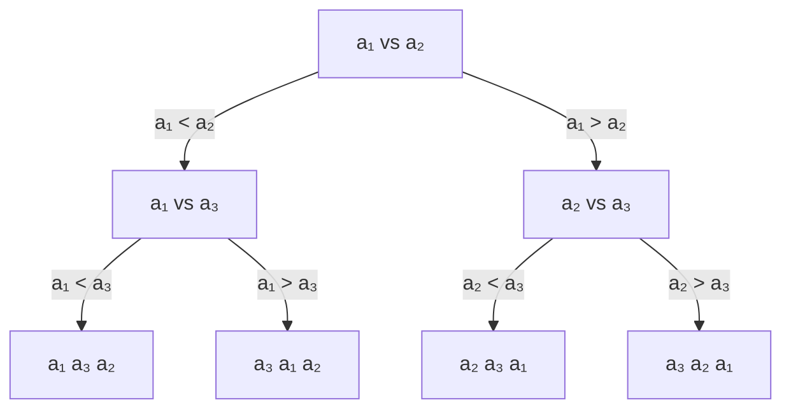

# Comparison Sorting Lower Bound

## The Decision Tree Model

Any comparison-based sort can be modeled as a **decision tree**. Each internal node compares two elements, and each leaf represents a permutation (a unique sorted order). For n elements, there are n! possible permutations, so the tree must have at least n! leaves.



## The Ω(n log n) Proof

A binary tree with n! leaves has height h ≥ log₂(n!). By Stirling's approximation:

``nh ≥ log₂(n!) = log₂(n · (n-1) · ... · 1)
                ≥ log₂((n/2)^(n/2))        (lower half of terms)
                = (n/2) · log₂(n/2)
                = Ω(n log n)
```

Therefore, **any** comparison-based sorting algorithm requires Ω(n log n) comparisons in the worst case. This lower bound applies to merge sort, quicksort, heapsort — all of them are optimal up to constants.

| Algorithm | Best | Average | Worst | Stable? |
|-----------|------|---------|-------|---------|
| Merge Sort | Ω(n log n) | Θ(n log n) | Θ(n log n) | Yes |
| Quick Sort | Ω(n log n) | Θ(n log n) | O(n²) | No |
| Heap Sort | Ω(n log n) | Θ(n log n) | Θ(n log n) | No |
| Tim Sort | Ω(n) | Θ(n log n) | Θ(n log n) | Yes |

## Non-Comparison Sorts

Non-comparison sorts bypass the Ω(n log n) bound by exploiting structure in the input (e.g., integer keys with bounded range).

### Counting Sort — O(n + k)

Counts occurrences of each value, then reconstructs. Requires O(k) space where k is the range of values.

```python
def counting_sort(arr, max_val):
    count = [0] * (max_val + 1)
    for x in arr:
        count[x] += 1
    # Prefix sum for stable sort positions
    for i in range(1, len(count)):
        count[i] += count[i - 1]
    output = [0] * len(arr)
    for x in reversed(arr):
        count[x] -= 1
        output[count[x]] = x
    return output
```

### Radix Sort — O(d · (n + k))

Sorts digit by digit using a stable subroutine (counting sort). d = number of digits, k = radix (base).

| Sort | Time | Space | Constraints |
|------|------|-------|-------------|
| Counting | O(n + k) | O(k) | Small integer range |
| Radix (LSD) | O(d(n + k)) | O(n + k) | Fixed-width keys |
| Bucket | O(n) avg | O(n) | Uniform distribution |

## Interview Questions

**Q: Why is the lower bound for comparison sorting Ω(n log n)?**
A: There are n! possible orderings. A comparison-based sort is a binary decision tree, so distinguishing n! outcomes requires height ≥ log₂(n!) = Ω(n log n) by Stirling's approximation.

**Q: When would you use radix sort over quicksort?**
A: When sorting fixed-width integers or strings, especially when n is large and the key range is manageable. Radix sort's O(d·n) beats O(n log n) for practical d values (e.g., 32-bit integers need only d=4 passes with 8-bit digits).

**Q: Is there a sorting algorithm with O(n) worst case for arbitrary input?**
A: No — Ω(n log n) is a lower bound for *comparison-based* sorting of arbitrary input. Non-comparison sorts can achieve O(n) but require constraints on input (bounded integers, uniform distribution, etc.).

## References

- [Introduction to Algorithms — CLRS, Chapter 8](https://mitpress.mit.edu/9780262046305/introduction-to-algorithms/)
- [The Art of Computer Programming Vol. 3 — Knuth](https://www.elsevier.com/books/the-art-of-computer-programming/knuth/978-0-201-89683-1)
- See also: [Complexity Classes](./complexity-classes.md), [Sets, Relations, Functions](./sets-relations-functions.md)
