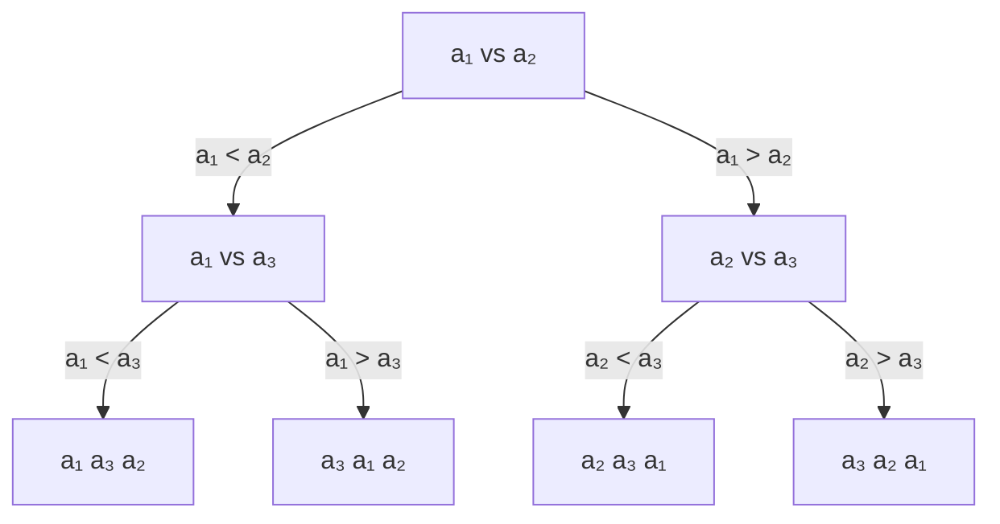
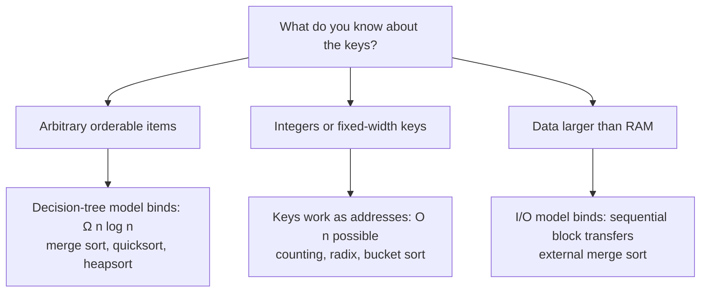

# Comparison Sorting Lower Bound

## Overview

The Ω(n log n) bound is the classic example of a *model-dependent* lower bound: it applies only to algorithms that learn about the input exclusively through element comparisons. Understanding why — decision trees, information theory, adversary arguments — tells you exactly when the bound can be beaten and by what. Interviews love this topic because it tests whether you can reason about impossibility, not just implementation: "can sorting ever be O(n)?" has a genuinely subtle answer.

## The Decision Tree Model

Any comparison-based sort can be modeled as a **decision tree**. Each internal node compares two elements, and each leaf represents a permutation (a unique sorted order). For n elements, there are n! possible permutations, so the tree must have at least n! leaves.


```mermaid
graph TD
    A["a₁ vs a₂"] -->|"a₁ < a₂"| B["a₁ vs a₃"]
    A -->|"a₁ > a₂"| C["a₂ vs a₃"]
    B -->|"a₁ < a₃"| D["a₁ a₃ a₂"]
    B -->|"a₁ > a₃"| E["a₃ a₁ a₂"]
    C -->|"a₂ < a₃"| F["a₂ a₃ a₁"]
    C -->|"a₂ > a₃"| G["a₃ a₂ a₁"]
```

Two assumptions make the model work. First, a comparison returns one of three outcomes (<, =, >), but for distinct inputs the = branch is useless, so the tree is binary. Second, the algorithm is *correct for all inputs*, so every one of the n! input permutations must lead to a leaf that outputs the matching order — an algorithm that cannot distinguish two permutations outputs the same (wrong) order for one of them.

### Formalizing the Argument

A binary tree of height h has at most 2ʰ leaves, so correctness requires 2ʰ ≥ n!, giving:

\\[ h \\ge \\log_2(n!) = \\sum_{i=1}^{n} \\log_2 i \\]

Stirling's approximation \\( n! \\approx \\sqrt{2\\pi n}\\,(n/e)^n \\) converts this exactly:

\\[ \\log_2(n!) = n \\log_2 n - (\\log_2 e)\\, n + O(\\log n) = n \\log_2 n - 1.4427\\, n + O(\\log n) \\]

Worked numbers:

| n | log₂(n!) (exact) | n·log₂n − 1.4427n | Merge sort worst case (n⌈lg n⌉ − 2^⌈lg n⌉ + 1) |
|---|---|---|---|
| 10 | 21.79 | 21.19 | 25 |
| 100 | 524.76 | 520.11 | 572 |
| 1,000,000 | 18,488,733 | 18,487,200 | 18,918,945 |

The linear term matters: even for n = 10 the bound is 21.79 comparisons, not "10·log₂10 = 33" — Stirling's −1.4427n correction is why the real constants are tight. Merge sort is within ~15% of optimal at n = 10 and ~2.3% at n = 10⁶, so the search for asymptotically faster comparison sorts is provably hopeless.

## The Ω(n log n) Proof

A binary tree with n! leaves has height h >= log2(n!). By Stirling's approximation:

> h >= log2(n!) = log2(n * (n-1) * ... * 1)
>                   >= log2((n/2)^(n/2))        (lower half of terms)
>                   = (n/2) * log2(n/2)
>                   = Omega(n log n)


This coarser argument (dropping the upper half of the terms) gives the same asymptotic answer without Stirling and is the version to reproduce on a whiteboard.

Therefore, **any** comparison-based sorting algorithm requires Ω(n log n) comparisons in the worst case. This lower bound applies to merge sort, quicksort, heapsort — all of them are optimal up to constants.

The same tree argument bounds the *average* case: summing external path lengths over all n! leaves, the average depth of a leaf in any binary tree with L leaves is ≥ log₂ L (the entropy bound), so average-case Ω(n log n) holds too. Heapsort's Ω(n log n) *best* case is not an accident — it compares through the sift-down even on sorted input, while merge sort and quicksort approach the bound more gracefully.

| Algorithm | Best | Average | Worst | Stable? |
|-----------|------|---------|-------|---------|
| Merge Sort | Ω(n log n) | Θ(n log n) | Θ(n log n) | Yes |
| Quick Sort | Ω(n log n) | Θ(n log n) | O(n²) | No |
| Heap Sort | Ω(n log n) | Θ(n log n) | Θ(n log n) | No |
| Tim Sort | Ω(n) | Θ(n log n) | Θ(n log n) | Yes |

## The Information-Theoretic View

The decision tree is an encoding argument in disguise. The output of a sort is a permutation, and the algorithm's comparisons must acquire enough bits to identify which one. For an input of n items with **k distinct values**, the number of distinguishable orderings is the multinomial count \\( n! / (n_1! \\, n_2! \\cdots n_k!) \\) where nᵢ is the multiplicity of value i. By the entropy bound, decisions needed ≥ log₂ of that count, which is maximized (over multiplicities) when each value appears n/k times:

\\[ \\log_2 \\frac{n!}{((n/k)!)^k} = n \\log_2 n - n \\log_2 (n/k) = n \\log_2 k \\]

So sorting n items with k distinct values requires **Ω(n log k)** comparisons. The cases check out: k = n (all distinct) recovers Ω(n log n); k = 2 (binary values) drops to Ω(n) — and indeed a two-pass zero/one count sorts a binary array in exactly n operations. 3-way partition quicksort (Dutch national flag) matches this bound in expectation: its running time is O(n · H) where H is the entropy of the key distribution, so it is optimal for skewed distributions with few distinct keys.

## Non-Comparison Sorts

Non-comparison sorts bypass the Ω(n log n) bound by exploiting structure in the input (e.g., integer keys with bounded range). The decision-tree model grants the algorithm *zero* information beyond comparison outcomes; counting and radix sorts instead use the keys as **array indices**, extracting O(log k) bits of information in a single addressing operation — arithmetic the model does not charge for. No contradiction: they violate the model's assumption, not the mathematics. The Ω(n) input-reading floor still applies, and stability matters because radix sort composes passes (each pass must preserve the previous pass's order).

### Counting Sort — O(n + k)

Counts occurrences of each value, then reconstructs. Requires O(k) space where k is the range of values.

```python
def counting_sort(arr, max_val):
    count = [0] * (max_val + 1)
    for x in arr:
        count[x] += 1
    # Prefix sum for stable sort positions
    for i in range(1, len(count)):
        count[i] += count[i - 1]
    output = [0] * len(arr)
    for x in reversed(arr):
        count[x] -= 1
        output[count[x]] = x
    return output
```

### Radix Sort — O(d · (n + k))

Sorts digit by digit using a stable subroutine (counting sort). d = number of digits, k = radix (base).

| Sort | Time | Space | Constraints |
|------|------|-------|-------------|
| Counting | O(n + k) | O(k) | Small integer range |
| Radix (LSD) | O(d(n + k)) | O(n + k) | Fixed-width keys |
| Bucket | O(n) avg | O(n) | Uniform distribution |

Radix sort on 32-bit integers with 8-bit digits needs d = 4 passes: 4·(n + 256) ≈ 4n work, beating n log₂ n once n ≳ 16. For floating-point keys, bit-manipulation tricks (IEEE-754 sign-flip mapping) make the same trick work — the bound is escaped through the *representation*, not the values.

The model selector below summarizes when the Ω(n log n) argument binds and when it does not:


```mermaid
flowchart TD
    Q["What do you know about the keys?"] --> A["Arbitrary orderable items"]
    Q --> B["Integers or fixed-width keys"]
    Q --> C["Data larger than RAM"]
    A --> A1["Decision-tree model binds: Ω n log n<br/>merge sort, quicksort, heapsort"]
    B --> B1["Keys work as addresses: O n possible<br/>counting, radix, bucket sort"]
    C --> C1["I/O model binds: sequential block transfers<br/>external merge sort"]
```

## External Sorting (I/O Model)

When data exceeds RAM, the bottleneck moves from comparisons to I/Os, but the comparison lower bound still governs how many element comparisons happen — external merge sort simply makes each comparison cheap relative to a block transfer. With block size B and memory M, \\( k \\)-way external merge sort performs \\( O\\!\\left(\\frac{n}{B} \\log_{M/B} \\frac{n}{B}\\right) \\) sequential I/Os: sort runs of size M in memory, then merge with a B-ary heap. Replacement selection and multiway merging are the standard refinements. The I/O-optimal treatment (including cache-oblivious funnelsort, which matches the bound without knowing B and M) lives in [Chapter 159: External Memory Algorithms](../dsa/chapters/ch159-external-memory.md) and [Cache-Oblivious Algorithms](../dsa/advanced/cache-oblivious-algorithms.md).

**Worked sizing.** Sort 2 TB with 32 GB of RAM and 8 MB blocks: the file is n/B = 250,000 blocks, memory holds M/B = 4,096 blocks, so phase 1 produces ⌈250,000 / 4,096⌉ = 61 sorted runs, and phase 2 merges all 61 runs in a single pass (fan-in 61 ≪ 4,096). Two passes × read + write = 1,000,000 block transfers ≈ 8 TB of sequential I/O — measured in terabytes moved, not comparisons executed, which is exactly the point of the I/O model.

## Adaptive Sorting

A sort is **adaptive** if it runs faster on inputs that are already partially ordered — measured by a *measure of presortedness*:

| Measure | Definition | Best known comparison bound |
|---|---|---|
| RUNS ρ | Number of maximal ascending runs | Θ(n log ρ) |
| INV | Number of inversions | Θ(n + INV) |
| EXC | Minimum transpositions to sort | Θ(n + EXC) |

Insertion sort is adaptive under INV: each element moves left exactly as far as its inversion count, giving Θ(n + INV) — perfect for nearly-sorted data, catastrophic for random data (Θ(n²)).

**Timsort** (Tim Peters, 2002; the default `list.sort()` in Python and `Arrays.sort()` for objects in Java) is adaptive under RUNS:

1. Scan once, detecting natural ascending/descending runs (descending runs are reversed in place); extend every run to at least `minrun` (32–64) using binary insertion sort.
2. Push runs onto a stack with invariants (each run ≥ sum of the two below it) that force balanced merges; merge with **galloping mode** — exponential search when one run repeatedly "wins".

**Adaptivity proof sketch** (Θ(n log ρ)): there are ρ runs with lengths n₁, …, n_ρ, Σnᵢ = n. Detection is O(n). Each balanced merge roughly halves the number of remaining runs, so any element participates in at most ⌈log₂ ρ⌉ merges; a merge of total size s costs ≤ s comparisons, and summing s over each "level" of the merge tree gives ≤ n per level:

\\[ \\text{comparisons} \\le n \\lceil \\log_2 \\rho \\rceil = O(n \\log \\rho) \\]

With ρ = 1 (already sorted), this is O(n) with zero data movement — and Ω(n log ρ) is a matching decision-tree lower bound, since distinguishing ρ-run inputs has entropy n·H(run structure) ≥ n log ρ in the worst case. The merge-stack invariants matter for worst-case robustness: without them, a pathological input (e.g., strict runs of sizes 1, 2, 4, 8, …) forces unbalanced merges and degrades to O(n²) in the worst case; the invariants keep every merge balanced, which is what makes the n log ρ bound unconditional. Practical detail: Timsort needs O(n) buffer space and was formally verified after a 2015 bug in the merge invariant (de Gouw et al.) — a rare case of a *formal methods* win over a shipped standard-library sort.

## Beyond Sorting: Selection Lower Bounds

The decision-tree technique gives exact answers for simpler selection problems, which interviewers use as a warm-up for median arguments.

**Simultaneous min and max in ⌈3n/2⌉ − 2 comparisons (exact).** Process elements in pairs: ⌊n/2⌋ comparisons sort each pair into a winner and a loser. The max is the max of the winners (⌈n/2⌉ − 1 comparisons); the min is the min of the losers (⌈n/2⌉ − 1). Total: ⌊n/2⌋ + 2(⌈n/2⌉ − 1) = ⌈3n/2⌉ − 2 — for n = 10, that is 13 comparisons versus the naive 2(n − 1) = 18. The optimality proof is an adversary argument: every element except the max must lose once, every element except the min must win once, so 2n − 2 "win/loss events" are needed; a comparison between two fresh elements supplies two events, every other comparison supplies at most one, and the adversary forces at least ⌈n/2⌉ one-event comparisons.

**Median.** The median is harder than min+max: it must be certified to beat the lower half *and* lose to the upper half, and adversary arguments push the lower bound above 2n comparisons. On the upper side, **deterministic select** (median-of-medians, Blum–Floyd–Pratt–Rivest–Tarjan 1973) achieves worst-case O(n): partition into groups of 5, recursively find each group median, recursively select the median-of-medians as pivot, giving the recurrence T(n) ≤ T(n/5) + T(7n/10) + Θ(n) — the groups shrink geometrically (n/5 + 7n/10 = 9n/10 < n), so the work telescopes to linear, with a constant around 5.4 comparisons per element under careful counting. Randomized selection has comparable expected cost with far simpler code; both are covered hands-on in [Randomized Algorithms — Randomized Selection vs Median-of-Medians](./randomized-algorithms.md) and [Chapter 39: Divide and Conquer](../dsa/chapters/ch39-divide-conquer.md).

## Interview Questions

**Q: Why is the lower bound for comparison sorting Ω(n log n)?**
A: There are n! possible orderings. A comparison-based sort is a binary decision tree, so distinguishing n! outcomes requires height ≥ log₂(n!) = Ω(n log n) by Stirling's approximation.

**Q: When would you use radix sort over quicksort?**
A: When sorting fixed-width integers or strings, especially when n is large and the key range is manageable. Radix sort's O(d·n) beats O(n log n) for practical d values (e.g., 32-bit integers need only d=4 passes with 8-bit digits).

**Q: Is there a sorting algorithm with O(n) worst case for arbitrary input?**
A: No — Ω(n log n) is a lower bound for *comparison-based* sorting of arbitrary input. Non-comparison sorts can achieve O(n) but require constraints on input (bounded integers, uniform distribution, etc.).

**Q: If an array has only k distinct values, how fast can you sort it?**
A: Ω(n log k) comparisons in the worst case — the information content is the multinomial log n!/(n₁!···n_k!), maximized at n log₂ k. 3-way quicksort (Dutch national flag) achieves O(n·H) expected, which is optimal. With k = 2, counting zeros and rewriting the array does it in O(n). Note the gap: distinguishing n! permutations was the old bound; multiplicities genuinely reduce the output entropy.

**Q: Why does Timsort beat merge sort in practice on real data?**
A: Real data has presortedness (appends to sorted logs, merged streams, timestamps). Timsort detects natural runs, extends them to minrun with binary insertion, then does balanced merges with galloping — Θ(n log ρ) where ρ is the run count, Θ(n) on sorted input, while standard merge sort always pays the full n log n. It is stable, needs O(n) space, and its Θ(n log ρ) matches the comparison lower bound for the RUNS measure, so it is adaptively optimal, not just empirically fast.

**Q: Can you find both the min and max in fewer than 2n − 2 comparisons?**
A: Yes — ⌈3n/2⌉ − 2, which is optimal. Compare elements in pairs (⌊n/2⌋ comparisons), then take the max of the pairwise winners and the min of the pairwise losers. Each element therefore participates in at most one "loser" and one "winner" comparison, halving the naive count. The optimality proof is an adversary argument counting win/loss events: 2n − 2 are required and comparisons between fresh elements supply two each.

**Q: Why doesn't counting sort contradict the Ω(n log n) bound?**
A: The bound holds only in the comparison model, where the algorithm sees nothing but comparison outcomes. Counting sort uses keys as array subscripts — it reads log k bits in one indexed memory access, an operation the decision-tree model cannot express. When keys are arbitrary reals with no exploitable structure, you are back in the comparison model and the bound applies.

**Q: Does Ω(n log n) mean every input needs n log n comparisons?**
A: No — it is a worst-case (and average-case) statement about the height of the decision tree. Individual inputs can be much cheaper: an already-sorted array takes n − 1 comparisons for adaptive algorithms like Timsort or natural merge sort, and insertion sort takes Θ(n + INV) in general. The bound says no comparison sort can guarantee fewer than log₂(n!) comparisons on *all* inputs; it says nothing about per-input adaptivity, which is exactly the loophole adaptive sorts exploit.

## Key Takeaways

- Comparison sorting is a binary decision tree over n! permutations: height ≥ log₂(n!) = n log₂ n − 1.4427n + O(log n) — merge sort is within a few percent of optimal.
- The bound is *model-dependent*: it covers algorithms that only compare; counting/radix/bucket sorts escape by using keys as addresses (arithmetic, not comparisons).
- Ω(n log k) governs sorting n items with k distinct values; 3-way quicksort is entropy-optimal; k = 2 collapses the problem to O(n).
- Average-case Ω(n log n) also holds (entropy bound on external path length); heapsort pays n log n even on sorted input, merge sort and quicksort do not.
- Adaptive sorts exploit presortedness: insertion sort Θ(n + INV), Timsort Θ(n log RUNS) — adaptively optimal and standard in Python/Java.
- Min + max: ⌈3n/2⌉ − 2 comparisons (exact, adversary-proved); median is harder — deterministic select is O(n) via the 5-group recurrence T(n) = T(n/5) + T(7n/10) + O(n).
- External sorting moves the cost to I/Os — O((n/B) log_{M/B}(n/B)) sequential block transfers — but the comparison bound still governs comparisons.
- "Lower bound" answers in interviews need a named model: comparisons, I/Os, or arithmetic — the model *is* the claim.

## References

- [Introduction to Algorithms — CLRS, Chapter 8](https://mitpress.mit.edu/9780262046305/introduction-to-algorithms/)
- [The Art of Computer Programming Vol. 3 — Knuth](https://www.elsevier.com/books/the-art-of-computer-programming/knuth/978-0-201-89683-1)
- [MIT OCW 6.042J — Mathematics for CS](https://ocw.mit.edu/courses/6-042j-mathematics-for-computer-science-fall-2010/) — Stirling's approximation and decision-tree counting
- Blum, Floyd, Pratt, Rivest & Tarjan — "Time Bounds for Selection", *Journal of Computer and System Sciences* 7(4), 1973 (deterministic select)
- Peters, T. — "listsort.txt", CPython source description of Timsort — https://github.com/python/cpython (file `Objects/listsort.txt`)
- de Gouw et al. — "Proving the Android Timsort Bug", *Engineering of Software* volume, Springer 2016 (title + venue)
- Estivill-Castro & Wood — "A Survey of Adaptive Sorting Algorithms", *ACM Computing Surveys* 24(4), 1992 (title + venue)
- Dor, Zwick & Paterson — "On Selecting the Median", *SIAM Journal on Computing* 28(5), 1995 (title + venue)
- See also: [Complexity Classes](./complexity-classes.md), [Sets, Relations, Functions](./sets-relations-functions.md)

## Cross-References

- [Chapter 5: Sorting](../dsa/chapters/ch05-sorting.md) — implementation-level treatment of every sort tabulated here
- [Chapter 159: External Memory Algorithms](../dsa/chapters/ch159-external-memory.md) — the I/O model, external merge sort, and replacement selection
- [Cache-Oblivious Algorithms](../dsa/advanced/cache-oblivious-algorithms.md) — funnelsort and optimal I/O without tuning to B and M
- [Information Theory](./information-theory.md) — entropy, the tool behind the Ω(n log k) argument
- [Randomized Algorithms](./randomized-algorithms.md) — randomized selection and its expected-case analysis
- [Chapter 39: Divide and Conquer](../dsa/chapters/ch39-divide-conquer.md) — median-of-medians derivation drill
- [Communication Complexity](./communication-complexity.md) — information-theoretic lower bounds as a general method
- [Proof Techniques](./proofs.md) — adversary and counting arguments formalized
