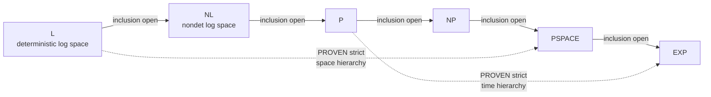

# Complexity Classes

## Overview

Complexity classes sort decidable problems by the resources (time, space, advice, interaction) a Turing machine needs to solve them. The definitions are cheap; the value is in knowing which inclusions are *proven*, which are open, and which conditional assumptions (ETH, P ≠ NP) turn a class diagram into engineering guidance about what is achievable in practice. This page keeps the classic P/NP treatment and adds the space classes, log-space reductions and completeness, ETH and its consequence table, average-case complexity, and interactive proofs.

## P (Polynomial Time)

Decision problems solvable by a deterministic Turing machine in O(n^k) time.

**Examples in P**:
- Sorting (O(n log n))
- Shortest path — Dijkstra (O((V+E) log V))
- Maximum flow (O(VE²))
- Primality testing (AKS: O(n^12))
- Linear programming

P is robust: it is invariant under reasonable machine models (RAM vs Turing machine differs by at most polynomial slowdown) and closed under composition — a polynomial-time algorithm calling another polynomial-time subroutine is polynomial time. That robustness is why "in P" tracks the informal notion of *efficiently solvable*.

## NP (Nondeterministic Polynomial Time)

Decision problems where a "yes" answer can be **verified** in polynomial time given a certificate (witness).

**Key insight**: P ⊆ NP (if you can solve it, you can verify it).

**Examples in NP**:
- SAT (given an assignment, verify it satisfies the formula)
- Hamiltonian path (given a path, verify it visits all vertices)
- Graph coloring (given a coloring, verify no adjacent same color)
- Subset sum (given a subset, verify it sums to target)
- Traveling salesman (given a tour, verify it's ≤ k)

The certificate view and the nondeterministic view are equivalent: an NP machine's accepting branch *is* the certificate, and a polynomial-length certificate can be guessed branch by branch.

## NP-Complete

A problem L is NP-complete if:
1. L ∈ NP
2. Every problem in NP is polynomial-time reducible to L

**Implication**: If ANY NP-complete problem is in P, then P = NP.

### Classic NP-Complete Problems

| Problem | Input | Question |
|---|---|---|
| SAT | Boolean formula | Is it satisfiable? |
| 3-SAT | 3-CNF formula | Is it satisfiable? |
| Vertex Cover | Graph G, integer k | Cover of size ≤ k? |
| Clique | Graph G, integer k | Complete subgraph of size k? |
| Independent Set | Graph G, integer k | Independent set of size k? |
| Hamiltonian Path | Graph G | Path visiting all vertices? |
| TSP | Graph G, integer k | Tour of cost ≤ k? |
| Subset Sum | Set S, target t | Subset summing to t? |
| 3-Coloring | Graph G | Colorable with 3 colors? |

### Polynomial-Time Reductions

To prove problem B is NP-complete:
1. Show B ∈ NP
2. Pick a known NP-complete problem A
3. Show A ≤_p B (polynomial reduction from A to B)
4. Conclude B is NP-complete

Direction matters: you reduce *from* the known-hard problem *to* your candidate, since "A reduces to B" means B is at least as hard as A. The reduction is many-one (Karp) — a single input transformation — while Turing reductions allow adaptive oracle calls; NP-completeness is standardly stated for Karp reductions.

## NP-Hard

Problems at least as hard as NP-complete, but not necessarily in NP.

**Examples**: Halting problem (undecidable), optimization versions of NP-complete problems.

## NP vs co-NP

- **NP**: "yes" answers have short proofs
- **co-NP**: "no" answers have short proofs
- Example: UNSAT (formula is unsatisfiable) is in co-NP
- Open question: NP = co-NP?

### co-NP and What Certification Means

co-NP is best understood through the verifier lens. A language L is in NP iff "x ∈ L" has a polynomial-size, polynomial-time-checkable certificate; L is in co-NP iff "x ∉ L" has one. So UNSAT ∈ co-NP because a "no" for SAT *is* the instance itself in the complement — the deep statement is that proving *unsatisfiability* needs its own short certificate, and resolution refutations are one candidate (they are short for easy formulas, provably exponential for hard ones — see [Logic](./logic.md)). **TAUTOLOGY** ("does φ evaluate to true on every assignment?") is co-NP-complete: it is the complement of SAT and every co-NP problem reduces to it, so it is the canonical "certify the negative" problem. Consequences worth stating precisely: NP = co-NP iff some NP-complete problem has its complement in NP; P is closed under complement, so P = NP would collapse NP = co-NP; and NP ≠ co-NP would imply P ≠ NP. Factoring sits tantalizingly in NP ∩ coNP (certificates both ways via Pratt-style primality proofs and quotient/remainder checks), which is evidence — not proof — that it is neither NP-complete nor in P.

## The Landscape at a Glance



```
┌──────────────────────────────────────┐
│              NP-Hard                 │
│                                      │
│    ┌──────────────────────────┐      │
│    │          NP              │      │
│    │  ┌──────────────────┐    │      │
│    │  │   NP-Complete    │    │      │
│    │  │  (SAT, TSP-dec)  │    │      │
│    │  └──────────────────┘    │      │
│    │  ┌──────────────────┐    │      │
│    │  │        P         │      │
│    │  │ (Sort, Shortest  │      │
│    │  │  Path)           │      │
│    │  └──────────────────┘    │      │
│    └──────────────────────────┘      │
│                                      │
│  (NP-Hard problems outside NP, e.g.  │
│   Halting Problem, are in the        │
│   NP-Hard region but NOT in NP)      │
└──────────────────────────────────────┘

Note: NP-Hard is NOT a superset of NP. NP-Hard problems are "at least
as hard as the hardest NP problems." Some NP-Hard problems are in NP
(these are NP-Complete), and some are outside NP (e.g. undecidable
problems like the Halting Problem). The intersection of NP and NP-Hard
is exactly NP-Complete.
```

Unknown: P = NP?  (million-dollar question)

Reading the diagram precisely: **L ⊆ NL ⊆ P ⊆ NP ⊆ PSPACE ⊆ EXP** are all provable inclusions, but only two strictness results in the chain are known unconditionally — **L ⊊ PSPACE** (via the space hierarchy theorem, padded through NL) and **P ⊊ EXP** (via the time hierarchy theorem). Whether L = NL, NL = P, P = NP, NP = PSPACE, or PSPACE = EXP are all open; any *one* collapse can cascade (e.g., P = NP would leave the rest of the chain untouched above it, while NP = PSPACE would force NP-complete problems to be solvable in polynomial *space* only).

## Savitch and the Hierarchy Theorems

Three theorems anchor the diagram:

- **Savitch's theorem (1970)**: NSPACE(f(n)) ⊆ SPACE(f(n)²) for f ≥ log n — nondeterminism buys at most a quadratic in space. Reached by REACHABILITY: to decide whether s reaches t in ≤ 2ᵏ steps, guess (recursively search) a midpoint m and recurse on s→m, m→t; depth log n with O(log n) stack per level = O(log² n) space. Consequence: NPSPACE = PSPACE, so nondeterminism does not enlarge polynomial space.
- **Time hierarchy theorem**: with time-constructible f, TIME(f(n)) ⊊ TIME(f(n) log² f(n)) — more time strictly buys more languages. Consequence: P ⊊ EXP.
- **Space hierarchy theorem**: with space-constructible f, SPACE(f(n)) ⊊ SPACE(g(n)) whenever f(n) = o(g(n)). Consequence: L ⊊ PSPACE. Space is friendlier to diagonalization than time because a space-bounded machine can be restarted on all inputs of a given length within bounded space.

These are the *only* unconditional separations available; every "practical" separation (P vs NP) resists diagonalization because of relativization barriers (Baker–Gill–Solovay), which is why proofs that escape the barrier (arithmetization, PCP machinery) are celebrated — see [PCP Theorem and Inapproximability](./pcp-inapproximability.md).

## Completeness Under Log-Space Reductions

A **log-space reduction** \\( A \\le_L B \\) is a log-space transducer: read-only input tape, write-only output tape, O(log n) work tape — it outputs an instance of B in log space and poly time. The point is *robustness of completeness*: log-space transducers compose (two chained O(log n) work tapes still fit in O(log n)), so completeness under ≤_L survives composition and yields tighter statements than ≤_p. Canonical complete problems:

| Class | Complete under | Canonical complete problem | Status |
|---|---|---|---|
| NL | ≤_L | ST-CONN (s→t reachability in a directed graph) | In NL; in L? open |
| L | ≤_L | UST-CONN (undirected s→t reachability) | **In L** (Reingold 2005) |
| P | ≤_L | Circuit Value Problem | P-complete: inherently sequential unless P = NC |
| PSPACE | ≤_p | TQBF (quantified Boolean formula: ∀x∃y⋯φ) | PSPACE-complete; alternation captures quantifiers |

ST-CONN ∈ NL is the prototype nondeterministic space computation: guess the next vertex on the path, O(log n) bits to store the current one. Reingold's proof that UST-CONN ∈ L (undirected reachability needs no nondeterminism, via expander-walking zig-zag products) resolved a decades-old question and won the Gödel Prize — a rare instance of a "too-hard-looking" problem collapsing into L. The P-complete entry is the theory behind "this loop cannot be parallelized easily": if Circuit Value were in NC, P = NC and everything sequential parallelizes.

## PSPACE

Problems solvable with polynomial space (no time limit).

P ⊆ NP ⊆ PSPACE

PSPACE-complete: QBF (Quantified Boolean Formula)

PSPACE = NPSPACE (Savitch) = the class of games with polynomial-size game boards where the first player has a winning strategy (generalized geography, Go with polynomial board). The quantifier alternation in TQBF is the intuition: ∀/∃ alternation is nondeterminism with adversarial branches, and PSPACE = AP (alternating polynomial time).

## Approximation Algorithms

For NP-hard optimization problems:

| Problem | Approximation Ratio |
|---|---|
| Vertex Cover | 2-approx |
| TSP (metric) | 3/2-approx (Christofides) |
| Set Cover | O(ln n)-approx |
| Max Cut | 0.878-approx (SDP) |

These ratios are provably optimal for some problems under complexity assumptions — the hardness side is derived from the PCP theorem ([PCP Theorem and Inapproximability](./pcp-inapproximability.md)), with algorithm details in [Approximation Algorithms](./approximation-algorithms.md).

## The Exponential Time Hypothesis (ETH)

The Exponential Time Hypothesis (Impagliazzo & Paturi, 2001) states that **3-SAT cannot be solved in \\( 2^{o(n)} \\) time** on formulas with n variables — a strictly stronger, quantitative assumption than P ≠ NP. The sparsification lemma makes it robust: any k-SAT instance reduces to 2^{O(n)} linear-size instances, so ETH is insensitive to formula density. ETH supplies *fine-grained* lower bounds that P ≠ NP cannot:

| Consequence | Under ETH, no algorithm in... | Technique |
|---|---|---|
| 3-SAT | 2^{o(n)} | The hypothesis itself |
| k-SAT (any fixed k ≥ 3) | 2^{o(n)} | Sparsification lemma (IPZ 2001) |
| Vertex Cover, parameter k | 2^{o(k)} · n^{O(1)} | Reduction from sparse 3-SAT (branches ≤ 3ᵐ) |
| Clique, parameter k | n^{o(k)} | Chen et al. — reduction preserving parameter |
| General SAT | 2^{o(N)} for N clauses | Linear-size encodings of 3-SAT |

The last row kills the classic interview trap: a reduction that blows up the instance polynomially can turn a "subexponential" algorithm into a mere "superpolynomial" one, so subexponential algorithms for dense SAT would not violate ETH directly — which is exactly why the sparsification lemma is needed. ETH also grounds the parameterized-complexity landscape (W[1]-hardness via Clique), and its stronger cousin SETH (no 2^{(1−ε)n} for SAT) calibrates the *exact base* of modern SAT-solver worst-case analyses (2^{0.386n} for 3-SAT via PPSZ, still far from the heuristic performance on industrial instances).

## Average-Case Complexity

Worst-case hardness does not automatically give average-case hardness: an NP-complete problem could be hard on a sparse set of adversarial instances and easy almost everywhere. Levin's theory of average-case complexity (1970s) fixes a distribution over instances (usually the simple "coin-flip" distribution, giving the class distNP) and defines reductions that preserve *expected* running time. The flagship results are positive reductions: Ajtai (1996) showed that worst-case hardness of short lattice problems implies average-case hardness of related problems, and this is the foundation of lattice cryptography (LWE) — the rare case where a cryptographic primitive provably rests on worst-case assumptions. Smoothed analysis (Spielman & Teng, 2004) reframes the question: the simplex algorithm is exponential on adversarial LPs but polynomial under small random perturbations of the input, \\( \\tilde{O}(n^2 m \\sqrt{m}) \\) per unit of perturbation — matching practice where simplex beats interior-point methods on typical instances. Interview soundbite: "P vs NP is about adversarial inputs; cryptography and heuristics live on the average case, which is a different and largely open theory."

## Interactive Proofs

An **interactive proof** (IP) relaxes certification: a computationally unbounded prover convinces a polynomial-time randomized verifier through a conversation, with completeness (honest prover succeeds w.p. ≥ 2/3) and soundness (any prover succeeds w.p. ≤ 1/3). The landmark **IP = PSPACE** (Shamir 1992, via Lund–Fortnow–Karloff–Nisan and Shamir's arithmetization of TQBF) says interaction plus randomness buys exactly polynomial *space* power — a verifier can be convinced that a huge QBF instance is true by checking one low-degree polynomial identity at a time (the sum-check protocol). Multi-prover versions go further: MIP = NEXP. The "read a few spots of an encoded proof" refinement of the same machinery is the PCP theorem — the bridge to hardness of approximation in [PCP Theorem and Inapproximability](./pcp-inapproximability.md) — and its cryptographic descendants (zero-knowledge, SNARKs) let a verifier delegate computation with constant-size checks: [Zero-Knowledge Proofs](../cryptography/zk-proofs.md).

## Interview Questions

**Q: What is the difference between P and NP?**
A: P = problems solvable in polynomial time. NP = problems where solutions can be verified in polynomial time. Every P problem is in NP, but whether NP problems are in P is the million-dollar P vs NP question.

**Q: What does NP-complete mean?**
A: A problem that is (1) in NP (solution verifiable in polynomial time) and (2) at least as hard as every other NP problem (all NP problems reduce to it). If any NP-complete problem is in P, then P = NP.

**Q: Is P = NP? Why does it matter?**
A: Unknown (one of the Millennium Prize Problems). If P = NP, many "hard" problems (cryptography, optimization, AI) would become efficiently solvable. Most computer scientists believe P ≠ NP.

**Q: How do you prove a problem is NP-complete?**
A: (1) Show it's in NP (verify solution in polynomial time), (2) pick a known NP-complete problem, (3) reduce it to your problem in polynomial time, (4) conclude NP-completeness.

**Q: Why use log-space reductions instead of polynomial-time reductions for some classes?**
A: Because ≤_L transducers compose in log space, completeness statements survive composition, and the resulting notions are strict enough to separate L, NL, and P meaningfully — polynomial reductions cannot (they would make L-complete and P-complete coincide trivially). The canonical example: ST-CONN is NL-complete under ≤_L, and UST-CONN is L-complete (Reingold), a separation-flavored fact invisible at poly-time resolution.

**Q: What does a "certificate" mean for co-NP problems like TAUTOLOGY?**
A: co-NP requires short, checkable proofs for the *negative* answers. TAUTOLOGY ∈ co-NP because its complement (SAT) has assignment certificates, and every co-NP problem reduces to TAUTOLOGY — it is the canonical co-NP-complete problem. Note the asymmetry: we do not know compact certificates for tautologyhood itself (resolution refutations can be exponential), so co-NP membership of TAUTOLOGY is trivial-by-complement while in-NP-ness of it would collapse NP = co-NP.

**Q: State Savitch's theorem and one consequence.**
A: NSPACE(f(n)) ⊆ SPACE(f(n)²) for constructible f ≥ log n: decide reachability by recursively guessing midpoints, costing depth log n times O(log n) stack. Consequences: PSPACE = NPSPACE — nondeterminism adds no power for polynomial space — and it is why NP ⊆ PSPACE is a theorem rather than a conjecture.

**Q: What is ETH and how does it differ from P ≠ NP?**
A: ETH says 3-SAT needs 2^{Ω(n)} time on n variables — P ≠ NP only says no polynomial algorithm exists, with no rate. ETH is strictly stronger: it implies P ≠ NP plus quantitative lower bounds, e.g., no 2^{o(k)} · n^{O(1)} Vertex Cover and no n^{o(k)} Clique. The sparsification lemma makes ETH stable under reductions that change formula density, which is what lets it power the parameterized (W[1]-hardness) landscape.

**Q: What does IP = PSPACE mean, intuitively?**
A: Anything computable in polynomial space can be *verified interactively* in polynomial time: an all-powerful prover convinces a randomized verifier via arithmetization — the TQBF formula becomes a low-degree polynomial, and the verifier checks one variable at a time with the sum-check protocol, needing only O(poly) communication. Interaction + randomness is thus exactly PSPACE-powerful; strip one prover to none and you get NP; add provers and you reach NEXP (MIP = NEXP).

## Key Takeaways

- The chain L ⊆ NL ⊆ P ⊆ NP ⊆ PSPACE ⊆ EXP: all inclusions provable, only L ⊊ PSPACE and P ⊊ EXP known strict (hierarchy theorems).
- Savitch: nondeterminism ≤ quadratic blowup in space; NPSPACE = PSPACE; NP ⊆ PSPACE by composing with the same reachability argument.
- Completeness is relative to a reduction type: ST-CONN is NL-complete, UST-CONN ∈ L (Reingold 2005), Circuit Value is P-complete, TQBF is PSPACE-complete (alternation = quantifiers).
- co-NP = short certificates for "no" answers; TAUTOLOGY and UNSAT are its canonical members; NP = co-NP iff some NP-complete complement is in NP.
- ETH (3-SAT ∉ 2^{o(n)}) is the quantitative P ≠ NP: via sparsification it yields 2^{o(k)} and n^{o(k)} lower bounds for Vertex Cover and Clique.
- Average-case hardness is a separate theory (distNP, Levin reductions); lattice problems are the flagship worst-to-average reduction; smoothed analysis explains simplex.
- IP = PSPACE (Shamir): interaction + randomness = polynomial space; MIP = NEXP; PCP = locally checkable IP proofs → hardness of approximation and SNARKs.
- For interviews: name the class, name the reduction direction, and name the assumption before citing a hardness consequence.

## References

- [Introduction to Algorithms — CLRS](https://mitpress.mit.edu/9780262046305/introduction-to-algorithms/)
- [Computational Complexity — Arora & Barak](http://theory.cs.princeton.edu/complexity/)
- [Clay Mathematics — P vs NP](https://web.archive.org/web/20230501083644/https://www.claymath.org/millennium-problems/p-vs-np-problem)
- [Introduction to the Theory of Computation — Sipser, 3e (Cengage)](https://www.cengage.com/c/introduction-to-the-theory-of-computation-sipser-3e/)
- [MIT OpenCourseWare](https://ocw.mit.edu) — 6.045J *Automata, Computability, and Complexity* (space classes, hierarchy theorems)
- Savitch — "Relationships Between Nondeterministic and Deterministic Tape Complexities", *J. Comput. Syst. Sci.* 4(2), 1970 (title + venue)
- Impagliazzo & Paturi — "On the Complexity of k-SAT", *J. Comput. Syst. Sci.* 62(2), 2001; Impagliazzo, Paturi & Zane — "Which Problems Have Strongly Exponential Complexity?", *J. Comput. Syst. Sci.* 63(4), 2001 (ETH, sparsification)
- Shamir — "IP = PSPACE", *Journal of the ACM* 39(3), 1992 (title + venue)
- Reingold — "Undirected ST-Connectivity in Log-Space", *STOC 2005 / SIAM J. Comput. 38(4)* (Gödel Prize 2009; title + venue)
- Spielman & Teng — "Smoothed Analysis of Algorithms: Why the Simplex Algorithm Usually Takes Polynomial Time", *Journal of the ACM* 51(3), 2004 (title + venue)
- Arora, Lund, Motwani, Sudan & Szegedy (1998), *Proof Verification and the Hardness of Approximation Problems*, J. ACM 45(3) — <https://doi.org/10.1145/273865.273901>

## Cross-References

- [PCP Theorem and Inapproximability](./pcp-inapproximability.md) — locally checkable proofs and the hardness side of the approximation table
- [Approximation Algorithms](./approximation-algorithms.md) — the algorithmic half of that table
- [Turing Machines](./turing-machines.md) — the machine models these classes quantify over
- [Computability](./computability.md) — the undecidable line EXP sits well below
- [Logic](./logic.md) — SAT, TAUTOLOGY, and TQBF as the canonical complete problems
- [Randomized Algorithms](./randomized-algorithms.md) — BPP and the randomness-vs-computation question
- [Derandomization and Pseudorandomness](./derandomization-pseudorandomness.md) — whether BPP = P and where hardness randomness comes from
- [Communication Complexity](./communication-complexity.md) — lower-bound machinery reused for space classes
- [Quantum Computing](./quantum-computing.md) — BQP, the quantum column of the class diagram
- [Zero-Knowledge Proofs, ZK-SNARKs, and ZK-STARKs](../cryptography/zk-proofs.md) — interactive proofs deployed as cryptography
- [Chapter 70: Computational Models and Complexity Classes](../dsa/chapters/ch70-computational-models.md) — interview-flavored tour of the same territory
