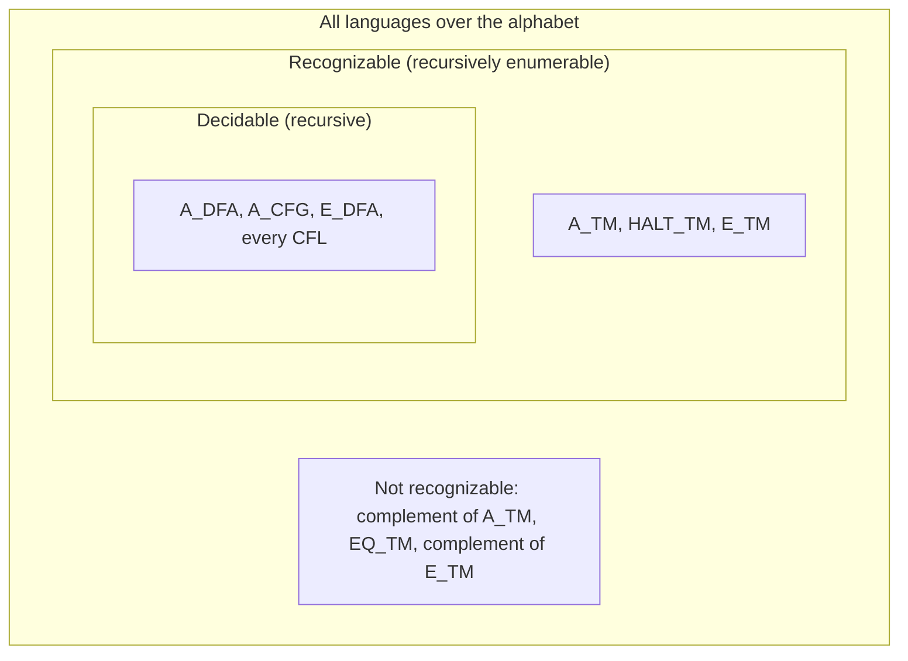
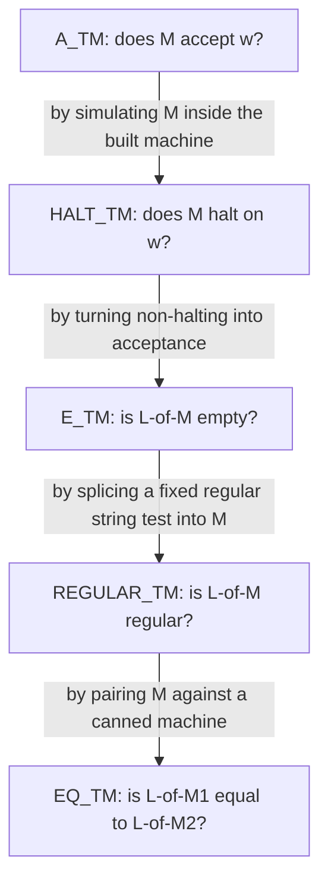

# Computability

## Overview

Computability theory draws the exact boundary between problems that any computer — past, present, or future — can solve and problems that are provably beyond computation. Its central results, the undecidability of the halting problem and Rice's theorem, are not curiosities: they dictate what compilers, static analyzers, and verification tools can ever guarantee. Interviews use this topic to test whether you understand that some engineering limits are mathematical, and whether you know the standard escape hatches (semi-decision, conservative approximation, restricted models).

## Decidable vs Undecidable

A language L is **decidable** if there exists a Turing machine that halts on every input and correctly accepts/rejects. L is **recognizable** (recursively enumerable) if a TM accepts all strings in L but may loop forever on strings not in L.

| Property | Decidable | Recognizable (but not decidable) | Not recognizable |
|----------|-----------|----------------------------------|-------------------|
| L | TM always halts | TM halts on yes, may loop on no | No TM recognizes L |
| Complement | Decidable | Not recognizable | Recognizable |
| Example | A_DFA | A_TM | ¬A_TM |

The table's complement row encodes a complete characterization: if both L and its complement are recognizable, dovetailing the two recognizers (run them in alternating steps) yields a decider for L — so for undecidable L, at most one of L, ¬L is recognizable. A_TM is the canonical asymmetric case: recognizable but its complement is not. Languages like EQ_TM (machine equivalence) are even worse: neither they nor their complements are recognizable.

## Turing-Recognizable vs Decidable: The Landscape



| Language | Decidable? | Recognizable? | Co-recognizable? |
|---|---|---|---|
| A_DFA (does DFA M accept w?) | ✓ | ✓ | ✓ |
| A_CFG (does CFG G derive w?) | ✓ | ✓ | ✓ |
| E_TM (is L(M) empty?) | ✗ | ✓ | ✗ |
| A_TM (does M accept w?) | ✗ | ✓ | ✗ |
| ¬A_TM | ✗ | ✗ | ✓ |
| EQ_TM (is L(M₁) = L(M₂)?) | ✗ | ✗ | ✗ |

Why is ¬A_TM not recognizable? If it were, dovetailing its recognizer with a recognizer for A_TM would decide A_TM, contradicting undecidability. This one argument generates the entire right-hand column: undecidability of a recognizable language immediately makes its complement unrecognizable.

### Dovetailing and Semi-Decision, Mechanically

A recognizer is a **semi-decision procedure**: it returns YES when the answer is yes and diverges otherwise, which is exactly how a loop-prone computation is still useful. Dovetailing is the scheduling trick that makes recognizers composable — interleave the step-by-step executions of two recognizers so that if either accepts, you learn the answer, without one infinite run starving the other:

```python
def decide_with_two_recognizers(R_L, R_notL, w, steps):
    """If L and its complement are BOTH recognizable, L is decidable:
    alternate steps of the two recognizers until one accepts."""
    for t in range(1, steps + 1):
        if R_L(w, t):     return True    # L's recognizer accepted
        if R_notL(w, t):  return False   # complement's recognizer accepted
    return None                          # budget exhausted; unbounded loop never returns None
```

This snippet is the machine behind the complement column of the table above, and the same interleaving idea enumerates RE languages (a recognizer plus dovetailing over all inputs yields an enumerator). Practical analyzers run the bounded version: run the semi-decision procedure with a step or wall-clock budget, and report "unknown" on timeout — honesty about the third outcome is what separates a principled tool from a misleading one.

## The Halting Problem

**A_TM = { ⟨M, w⟩ | M is a TM that accepts input w }**

A_TM is recognizable but **undecidable**. Proof by diagonalization:

1. Assume A_TM is decidable by TM H.
2. Construct D that on input ⟨M⟩: run H on ⟨M, ⟨M⟩⟩; if H accepts, reject; if H rejects, accept.
3. Run D on ⟨D⟩: D accepts ⟨D⟩ iff D rejects ⟨D⟩ — contradiction.

```
D(⟨M⟩) =
  run H(⟨M, ⟨M⟩⟩)
  if H accepts → REJECT
  if H rejects → ACCEPT

D(⟨D⟩): accepts iff rejects → CONTRADICTION
```

### Proof Sketch, Done Carefully

**Theorem.** A_TM is undecidable.

**Proof.** Suppose, for contradiction, that a decider H decides A_TM — H halts on every input ⟨M, w⟩ and answers correctly. Build D as above; note that D is itself a decider, because it calls H (which always halts) and then answers. Now examine D on its own encoding ⟨D⟩, and trace both cases: if D accepts ⟨D⟩, then by D's definition H must have *rejected* ⟨D, ⟨D⟩⟩, which means D does not accept ⟨D⟩ — contradiction. If D rejects ⟨D⟩, then H must have *accepted* ⟨D, ⟨D⟩⟩, which means D does accept ⟨D⟩ — contradiction. Both branches are impossible, so the assumed H cannot exist. ∎

Two subtleties make this proof sound rather than hand-wavy. First, D must halt on all inputs for the case analysis to be exhaustive — that is guaranteed only because H is assumed to be a *decider*; the construction would break if H were merely a recognizer. Second, the self-reference is legitimate: ⟨D⟩ is a finite string, and feeding a machine its own encoding is no more paradoxical than a compiler compiling itself. The same diagonal structure appears in Cantor's proof that reals are uncountable and in Gödel's diagonal lemma — see [Gödel's Incompleteness Theorems](./godel-incompleteness.md) for the arithmetic incarnation.

The companion result: **HALT_TM = {⟨M, w⟩ : M halts on w}** is undecidable by a direct reduction — if HALT_TM were decidable, wrap any machine M into one that loops explicitly instead of rejecting, and a decider for HALT_TM would decide A_TM.

## Reductions

A **mapping reduction** f: Σ* → Σ* is computable and w ∈ A₁ iff f(w) ∈ A₂ (written A₁ ≤_m A₂). If A₁ ≤_m A₂:

- If A₂ is decidable → A₁ is decidable
- If A₁ is undecidable → A₂ is undecidable
- If A₁ is recognizable and A₂ is decidable → A₂ is recognizable (and the contrapositive direction for recognizability)

The direction matters and trips people up: you reduce the *known-undecidable* problem **to** the problem you want to prove undecidable. The reduction f is a total, computable, always-halting transformation — the undecidability "flows" from A₁ through f into A₂.

Common reduction chain:

```
A_TM (known undecidable)
  ↓ reduce
HALT_TM = {⟨M, w⟩ | M halts on w}
  ↓ reduce
E_TM = {⟨M⟩ | L(M) = ∅}
  ↓ reduce
REGULAR_TM = {⟨M⟩ | L(M) is regular}
  ↓ reduce
EQ_TM = {⟨M₁, M₂⟩ | L(M₁) = L(M₂)}
```



A fully worked link, A_TM ≤ Ē_TM (which proves E_TM undecidable, since decidability is closed under complement): given ⟨M, w⟩, construct M′ that on *any* input x first simulates M on w; if M accepts, M′ accepts x; if M never accepts w, M′ never accepts anything. Then L(M′) = Σ* exactly when M accepts w, and L(M′) = ∅ exactly when M does not accept w. A decider for E_TM (or its complement) would therefore decide A_TM.

## Rice's Theorem

> Any non-trivial property of the language recognized by a Turing machine is undecidable.

A property P is **non-trivial** if some TMs satisfy it and some don't. Rice's theorem means you cannot decide *anything* interesting about what a program computes: whether it accepts anything, whether it's equivalent to another program, whether it accepts a specific string, etc.

| Property | Decidable? | Reason |
|----------|-----------|--------|
| L(M) = ∅ | No | Rice's theorem |
| L(M) = Σ* | No | Rice's theorem |
| M accepts "hello" | No | Rice's theorem |
| M has ≥ 5 states | Yes | Property of M, not L(M) |
| M runs in O(n²) | Unknown | Open problem |

**Proof sketch.** Let P be a non-trivial semantic property; pick a TM T_yes whose language has P and a TM T_no whose language does not. Reduce A_TM to P: given ⟨M, w⟩, build M′ that on input x simulates M on w and, only if M accepts, then runs T_yes on x; if M never accepts w, M′ loops forever (language ∅ — the "no" side). Then M accepts w iff L(M′) has P, so a decider for P would decide A_TM. The construction hijacks M's computation as a prefix gate — this is exactly the pattern used in every reduction in the chain above. ∎

The theorem's scope is precise and worth stating in interviews: it applies only to properties *of the language* L(M), not to properties of the machine's syntax or internals. "Does M have at least 5 states?" is decidable by inspecting the encoding; "is M total (halts on all inputs)?" is undecidable but *not* by Rice's theorem, since totality is not determined by L(M) alone (it is Π₂-complete in the arithmetical hierarchy). The row "M runs in O(n²)" sits outside Rice for the same reason.

### Beyond Rice: The Arithmetical Hierarchy

Undecidable problems are not all equally undecidable: hardness is graded by the number of unbounded quantifier alternations needed over a decidable (bounded-time checkable) predicate. Each level of the resulting hierarchy is strictly harder than the one below, so "undecidable" is a family, not a binary:

| Level | Logical form | Example problem | Computability status |
|---|---|---|---|
| Decidable | no unbounded quantifiers | A_DFA, A_CFG | algorithm exists |
| Σ₁ (RE) | ∃t : checkable(t) | A_TM, HALT_TM | recognizable, not decidable |
| Π₁ (co-RE) | ∀t : checkable(t) | ¬A_TM, non-halting | co-recognizable only |
| Σ₂ | ∃x ∀y : checkable(x, y) | FIN — is L(M) finite? | neither RE nor co-RE |
| Π₂ | ∀x ∃y : checkable(x, y) | TOT — does M halt on all inputs? | neither RE nor co-RE |

The membership question for A_TM is Σ₁ because "M accepts w" means *some* finite computation accepts, which is checkable by simulation; TOT is Π₂ because it quantifies over all inputs and then demands existence of a halting time. This grading explains why totality evades Rice's theorem yet remains undecidable, and why termination tools' "unknown" answers are unavoidable rather than an implementation gap.

## Key Undecidable Problems

- **Post Correspondence Problem (PCP)**: Given dominoes with top/bottom strings, can you arrange a sequence where top = bottom?
- **Hilbert's Tenth Problem**: Does a Diophantine equation have integer solutions?
- **Word Problem for Groups**: Given a group presentation, does a word equal the identity?

## Practical Undecidability

Undecidability is not confined to logic puzzles — it lands squarely on engineering work:

- **Post Correspondence Problem** is the workhorse for proving program-analysis problems undecidable, because arbitrary computations can be encoded as domino sequences (Post, 1946). Its decidable fragments (bounded-length sequences) are what tools actually check.
- **Mortality of matrix semigroups**: given a finite set of 3×3 integer matrices, does some product equal the zero matrix? Undecidable (Paterson, 1970) — which dashes hopes of fully generic "does this linear system reach a bad state" solvers.
- **Type inference limits**: typability in System F (polymorphic lambda calculus) is undecidable (Wells, 1999). Hindley–Milner inference is decidable precisely because it restricts to prenex rank-1 polymorphism — see [Hindley-Milner Type Inference](./hindley-milner.md). Every annotation you write in Scala or Rust is buying back decidability at a higher rank.
- **Static analysis limits**: by Rice's theorem, no analyzer can decide, for all programs, whether a variable is null-dereferenced, whether two pointers alias, or whether a taint flow reaches a sink *exactly*. Real analyzers therefore approximate in a documented direction.
- **Program termination**: "does M halt on every input?" is undecidable (in fact Π₂-complete). Termination checkers (e.g., ranking-function based ones in verification tools) succeed only on restricted classes and report "unknown" otherwise.

| Problem | Statement | Undecidability source |
|---|---|---|
| PCP | domino sequence with equal tops and bottoms | Post (1946), from A_TM |
| Wang tile domino problem | can given tiles tile the infinite plane? | reduction from PCP |
| Matrix mortality | zero product in 3×3 integer matrix semigroup | Paterson (1970) |
| System F typability | is expression e typable? | Wells (1999) |
| Totality | does M halt on all inputs? | Π₂-complete, beyond Rice |
| Exact alias / null / value analysis | any non-trivial semantic property | Rice's theorem |

## What To Do in Practice

Since exact answers are impossible, every sound tool picks a side of the soundness/completeness tradeoff:

| Tool stance | Guarantee | Representative systems |
|---|---|---|
| Sound + incomplete (over-approximation) | never misses a real bug; may report false positives | abstract interpretation (Astrée), type systems |
| Complete but unsound (under-approximation) | every report is a real bug; may miss some | fuzzing, concrete testing, bounded model checking |
| Semi-decision + resource bounds | yes-instances eventually confirmed; others time out | SMT solvers with quantifiers, first-order provers |
| Restrict the input model | decidability restored | finite-state model checking, quantifier-free SMT, HM type inference |

Over-approximation is the right choice when *missing* a bug is catastrophic (avionics, seL4): abstract interpretation computes a conservative superset of reachable states using fixpoint iteration on a finite abstract domain. Under-approximation suits development loops, where a cheap likely-bug beats a slow certainty. The abstraction is sound because it is a *conservative* mapping: if the abstract analysis says "no bug," the concrete program genuinely has none — this is exactly the Knaster–Tarski fixpoint machinery described in [Sets, Relations & Functions](./sets-relations-functions.md).

Bounded analysis is the second escape hatch: unroll loops k times and hand the formula to a SAT/SMT solver ([SAT & SMT Solvers](../formal-methods/sat-smt-solvers.md)). Bounded model checking is decidable because the input is finite; completeness is recovered only up to the bound (the "diameter" of the state space). The final trick is changing the model: finite-state abstractions, quantifier-free fragments, and monadic second-order theories on trees (decidable via tree automata) all trade expressiveness for an algorithm.

## Interview Questions

**Q: Why is the halting problem undecidable?**
A: By diagonalization — if a decider H existed, we could build a machine D that contradicts itself when run on its own encoding. D(⟨D⟩) accepts iff it rejects, an impossibility.

**Q: What is Rice's theorem? Give an example.**
A: Rice's theorem states that any non-trivial semantic property of a TM's language is undecidable. Example: determining whether a program accepts any input at all is undecidable, because it's a property of the language, not the machine's syntax.

**Q: How do you use reductions to prove undecidability?**
A: To prove B is undecidable, reduce a known undecidable problem A to B: build a computable function f such that w ∈ A iff f(w) ∈ B. If B were decidable, A would be too — contradiction.

**Q: Is the complement of A_TM recognizable? Why does the answer matter?**
A: No. If both A_TM and its complement were recognizable, we could run the two recognizers in dovetail (alternate steps) and decide A_TM: whichever recognizer accepts first settles the answer. Since A_TM is undecidable, its complement cannot be recognizable. This dovetailing argument is the standard tool for showing that a language's complement is unrecognizable.

**Q: Why doesn't Rice's theorem apply to "does M have at least 5 states"?**
A: Rice's theorem covers only properties of the *language* L(M) — two machines with identical languages must receive the same verdict. State count is a syntactic property of the machine's description, not of its language: two 3-state and 10-state machines can recognize the same language. Syntactic questions are decidable by inspecting the encoding.

**Q: How do type checkers terminate if type-related problems are undecidable in general?**
A: They restrict the type system. Hindley–Milner inference (used in ML, Haskell without extensions) is decidable because it limits polymorphism to prenex rank-1; full System F typability is undecidable (Wells 1999), so languages that approach it (Scala's higher-kinded generics, Rust's trait system at certain corners) fall back on explicit annotations and give up completeness rather than soundness.

**Q: Your static analyzer reports a possible null dereference that cannot happen. Which property did it sacrifice, and what's the alternative?**
A: It sacrificed completeness while staying sound — over-approximating the set of concrete executions, so it flags some impossible states rather than ever missing a real one (the only acceptable direction for safety-critical certification). The alternative is under-approximation: concrete execution, fuzzing, or bounded model checking, where every report is real but coverage is partial. No analyzer can be both, exactly, by Rice's theorem.

**Q: Is A_CFG decidable? Outline the algorithm.**
A: Yes. Convert the CFG to Chomsky Normal Form (poly-time, size-preserving up to a squaring), then run the CYK chart algorithm on the input: O(n³) time and O(n²) space. Decidability of A_CFG matters as the boundary marker — automata for Type 3 and Type 2 have deciders, while the analogous question for TMs (A_TM) is the halting problem. The contrast shows that decidability is about the *representation class*, not the string w.

## Key Takeaways

- Decidable ⊊ recognizable ⊊ all languages; if L and ¬L are both recognizable, L is decidable (dovetailing).
- The halting problem (A_TM) is proven undecidable by diagonalization; the proof needs H to be a *decider* so that the constructed D halts on every input.
- Mapping reductions A₁ ≤_m A₂ transfer undecidability from A₁ to A₂; the reduction function must be computable and total.
- Rice's theorem: every non-trivial property of L(M) is undecidable — but it applies to language properties only, not to syntax (state counts) or to machine-behavior properties like totality.
- EQ_TM is neither recognizable nor co-recognizable; ¬A_TM is recognizable by no one — the complement column of the landscape table is as important as the decidability column.
- Practical undecidability is everywhere: PCP, matrix mortality, System F typability, exact static analysis, termination.
- Every real tool resolves undecidability by choosing sound-but-incomplete (abstract interpretation, types), complete-but-unsound (fuzzing, BMC), semi-decision with timeouts (SMT), or a decidable fragment (finite-state, quantifier-free, HM).

## References

- [Introduction to the Theory of Computation — Sipser](https://www.cengage.com/c/introduction-to-the-theory-of-computation-sipser-3e/)
- [Computability, Complexity, and Languages — Davis, Sigal, Weyuker](https://www.elsevier.com/books/computability-complexity-and-languages/davis/978-0-12-206382-0)
- A. M. Turing, "On Computable Numbers, with an Application to the Entscheidungsproblem," *Proc. London Math. Soc.* s2-42 (1936) — [doi:10.1112/plms/s2-42.1.230](https://doi.org/10.1112/plms/s2-42.1.230)
- H. G. Rice, "Classes of Recursively Enumerable Sets and Their Decision Problems," *Transactions of the AMS*, 74 (1953).
- E. Post, "A Variant of a Recursively Unsolvable Problem," *Bulletin of the AMS*, 52 (1946).
- J. B. Wells, "Typability and type checking in System F are equivalent and undecidable," *Ann. Pure Appl. Logic* 98 (1999) — <https://doi.org/10.1016/S0168-0072(98)00047-5>
- M. Paterson, "Unsolvability in 3 × 3 Matrices," *Studies in Applied Mathematics*, 49 (1970).

## Cross-References

- [Turing Machines](./turing-machines.md) — the underlying machine model, configurations, and the universal TM
- [Formal Languages](./formal-languages.md) — Type 0 of the Chomsky hierarchy is exactly the recognizable world
- [Complexity Classes](./complexity-classes.md) — what changes when you add time bounds to decidability
- [Gödel's Incompleteness Theorems](./godel-incompleteness.md) — diagonalization and self-reference in arithmetic
- [Hindley-Milner Type Inference](./hindley-milner.md) — the decidable fragment below undecidable System F
- [Lambda Calculus](./lambda-calculus.md) — the other universal model feeding the Church–Turing thesis
- [Model Checking](../formal-methods/model-checking.md) — regaining decidability via finite-state abstraction
- [SAT & SMT Solvers](../formal-methods/sat-smt-solvers.md) — bounded decision procedures as the practical escape hatch
