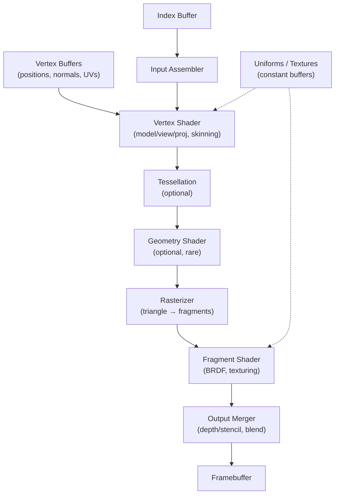
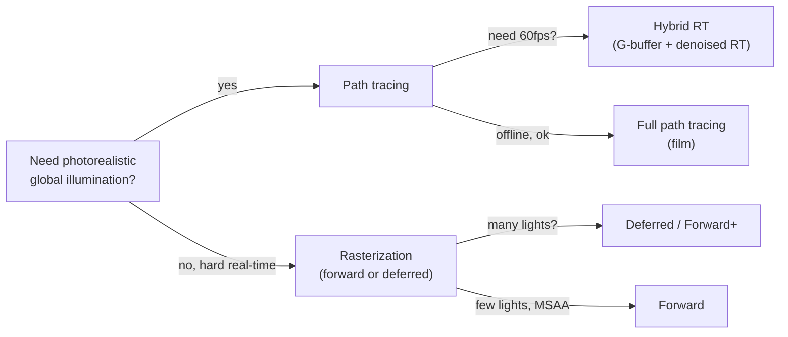
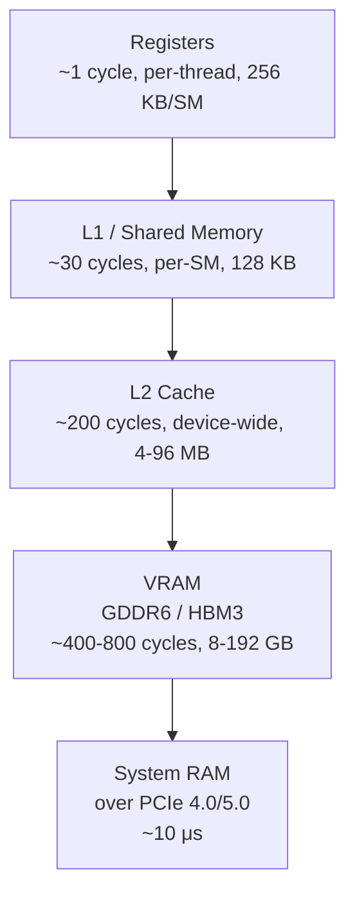

# Computer Graphics — Rasterization, Ray Tracing, and the GPU Pipeline

## Overview

**Computer graphics** is the discipline of synthesizing images from geometric, material, and lighting descriptions. A scene is a collection of meshes, textures, lights, and a camera; a **renderer** turns that scene into a 2D array of pixels. The field is split, roughly, into **real-time rendering** (games, VR, CAD previews, targeting 60–240 fps on a GPU) and **offline rendering** (film VFX, architectural visualization, where a single frame may take minutes to hours). The two communities share math but optimize for opposite objectives: real-time cares about latency and throughput per frame; offline cares about physical fidelity and convergence of light simulation.

The intellectual core of graphics is threefold. First, **geometry**: how to represent shape (triangles, subdivision surfaces, NURBS, signed-distance fields) and transform it through coordinate systems (model → world → view → clip → screen). Second, **light transport**: how light interacts with surfaces (reflection, refraction, scattering, subsurface effects) and how to integrate the rendering equation (Kajiya 1986) over the hemisphere of incoming directions. Third, **systems**: how to map the work onto massively parallel GPU hardware through programmable shader stages, render passes, and memory hierarchies. This page covers all three layers with enough depth for a placement interview, then points to [GPU Architecture](../arch/parallelism/gpu.md) and [CUDA](../arch/parallelism/cuda.md) for the hardware-side details.

> Related: [GPU Architecture](../arch/parallelism/gpu.md), [CUDA Programming](../arch/parallelism/cuda.md), [Memory Hierarchy](../arch/memory-hierarchy/README.md), [SIMD](../arch/parallelism/simd.md), [Mathematics](../mathematics/README.md)

## Mathematical Foundations

Everything in graphics starts with **linear algebra**. A 3D point `p` is a column vector `[x, y, z, 1]ᵀ` (homogeneous coordinates; the `w=1` lets translations act as matrix multiplications). Transformations are 4×4 matrices applied left-to-right: `p' = M_proj · M_view · M_model · p`. The **model matrix** places an object in the world (scale, rotate, translate); the **view matrix** transforms world coordinates into camera space (camera at origin, looking down −Z); the **projection matrix** maps camera space to clip space, where the frustum becomes a unit cube. Perspective division (`[x/w, y/w, z/w]`) then yields normalized device coordinates (NDC), and the viewport transform maps NDC to screen pixels.

Coordinate systems come in two flavors: **right-handed** (OpenGL, Blender; +X right, +Y up, +Z out of screen) and **left-handed** (Direct3D, Unity; +Z into screen). Mixing them silently flips winding order and breaks culling — a classic bug. Rotations use **quaternions** (unit quaternions `q = cos(θ/2) + sin(θ/2)·(u·i + v·j + w·j)` for axis `(u,v,w)`) rather than Euler angles because quaternions avoid gimbal lock and compose cleanly via the Hamilton product `q₁ ⊗ q₂`. **Interpolation** of rotations uses *spherical linear interpolation* (slerp), not lerp, to keep the result on the unit sphere.

The **camera model** is the pinhole camera: a focal length `f`, an image plane at distance `f` behind the lens, and a projection `x_screen = f · X / Z`. Real cameras add depth of field (circle of confusion from a finite aperture), motion blur (temporal integration over the shutter), and lens distortion. The **viewing frustum** is the truncated pyramid the camera can see; planes `near`, `far`, `left`, `right`, `top`, `bottom` define it, and **frustum culling** discards geometry outside before it enters the pipeline. For animation, **keyframe interpolation** (cubic Bézier, TCB splines) drives camera and object transforms over time, and **skinning** linearly blends the influence of skeleton bones per vertex (`p = Σ wᵢ Mᵢ · p_rest`).

## The Rasterization Pipeline

The **rasterization pipeline** is the algorithm GPUs run for real-time rendering. It is a fixed-function scaffold with programmable stages (shaders) injected at specific points. The pipeline is **object-order**: it iterates over triangles and "pushes" them to the screen, deciding per-pixel which triangle wins via the depth buffer. This is the opposite of ray tracing, which is **image-order**: it iterates over pixels and "pulls" scene geometry by shooting rays.



The stages are: **Input Assembler** reads vertex and index buffers and assembles primitives (points, lines, triangles, patches). The **Vertex Shader (VS)** runs once per vertex, transforming positions to clip space and computing any per-vertex data (normals, tangent space, UV unwrap). **Tessellation** (optional) subdivides a coarse patch into finer triangles on the GPU, driven by a hull shader + fixed tessellator + domain shader — used for terrain LOD and adaptive displacement. The **Geometry Shader (optional)** takes a whole primitive and can emit 0–N new primitives; in practice it is rarely used because it is slow on most hardware (replaced by mesh shaders on modern APIs). The **Rasterizer** converts a triangle into a set of fragments by scan-converting the screen-space triangle and interpolating vertex attributes (perspective-correct interpolation uses `1/w` weighting). The **Fragment Shader (FS)** runs once per fragment and computes its color — this is where BRDFs, texturing, and lighting live. The **Output Merger** runs the depth test (reject fragments behind what is already drawn), stencil test, and blends the fragment into the framebuffer (alpha blending, additive blending).

Two performance properties define the pipeline. **Overdraw** is when multiple fragments map to the same pixel — wasted FS work. A **depth pre-pass** (Z-pre-pass) renders the scene first with a trivial shader to populate the depth buffer, then the real draw skips occluded fragments entirely via `==` depth test. **Tile-based rendering** (mobile GPUs: Mali, Adreno, Apple) splits the framebuffer into tiles (e.g. 16×16), runs the whole pipeline per tile in fast on-chip RAM (tile memory), and writes the resolved tile to main memory once — this conserves the bandwidth that mobile DDR cannot supply. Vulkan's render passes and Metal's tile shaders expose this explicitly; OpenGL hides it behind the driver.

## Shaders and Shader Languages

A **shader** is a small program run on the GPU for one stage of the pipeline. Three languages dominate: **GLSL** (OpenGL, OpenGL ES, WebGL), **HLSL** (Direct3D), and **MSL** (Metal). Vulkan uses **SPIR-V**, a binary intermediate representation — GLSL/HLSL source is compiled to SPIR-V offline by `glslangValidator` or `shaderc`, and the driver only does a quick link step at runtime. This eliminates the runtime compile latency that plagued OpenGL, where shaders were compiled from source on first use, producing frame hitches and inconsistent drivers.

```glsl
// GLSL vertex shader: transforms a vertex and passes UV and normal through
#version 460 core
layout(location = 0) in vec3 a_pos;
layout(location = 1) in vec3 a_normal;
layout(location = 2) in vec2 a_uv;

uniform mat4 u_mvp;        // model-view-projection
uniform mat4 u_model;

out vec3 v_world_normal;
out vec2 v_uv;

void main() {
    gl_Position = u_mvp * vec4(a_pos, 1.0);
    v_world_normal = mat3(u_model) * a_normal;
    v_uv = a_uv;
}
```

```glsl
// GLSL fragment shader: simple Lambert + ambient
#version 460 core
in vec3 v_world_normal;
in vec2 v_uv;
out vec4 frag_color;
uniform sampler2D u_albedo;
uniform vec3 u_light_dir;   // points toward light
void main() {
    vec3 N = normalize(v_world_normal);
    float diff = max(dot(N, normalize(u_light_dir)), 0.0);
    vec3 albedo = texture(u_albedo, v_uv).rgb;
    frag_color = vec4(albedo * (diff + 0.2), 1.0);
}
```

**Compute shaders** are a separate path: they bypass the graphics pipeline entirely and run as a grid of thread groups (identical to CUDA — see [CUDA Programming](../arch/parallelism/cuda.md)). They are used for particle simulation, image processing, culling, GPU-driven rendering, and increasingly for ML inference. **Mesh shaders** (Vulkan, D3D12, Metal 3) replace the VS/GS pipeline with a compute-like mesh shader that produces triangles directly, giving the programmer fine-grained control over culling and LOD. **Ray tracing shaders** (VK_KHR_ray_tracing, DXR) add `raygen`, `closest-hit`, `miss`, and `any-hit` shader stages driven by an acceleration-structure traversal unit on the GPU (NVIDIA RT Cores, AMD RDNA2 Ray Accelerators).

Shader performance is dominated by three things: (1) **register pressure** — too many live variables reduces occupancy (warps per SM); (2) **texture bandwidth** — sampling a 4K BC7 texture is ~8 MB, and over-sampling tanks the L2; (3) **divergence** — `if` branches where neighboring fragments take different paths serialize on the SIMT units. Modern shader compilers (glslang, dxc, SPIR-V backend of LLVM) do constant folding, common subexpression elimination, and register allocation, but hand-tuning still matters for hot shaders in AAA games.

## Textures and Sampling

A **texture** is a multidimensional array of texels sampled by the shader. 2D textures store albedo, normals, roughness; cube maps store environment reflections (six faces of a cube); 3D textures store volumetric data (fog, density fields). Texture arrays let you index by layer without rebinding. **Mipmaps** are pre-filtered downsampled copies (each level is 1/4 the resolution of the previous) used to avoid aliasing when a texture is minified — sampling a 4K texture on a 10-pixel triangle without mipmaps produces shimmering noise because the sample points skip over most texels.

Sampling uses **magnification filters** (nearest, linear) and **minification filters** (nearest, linear, nearest-mipmap-nearest, linear-mipmap-nearest, linear-mipmap-linear = trilinear). **Anisotropic filtering** samples the texture as a stretched ellipse rather than a square, dramatically improving grazing-angle quality for floors and roads at a cost of up to 16× the samples. Texture **addressing modes** (repeat, mirror, clamp, border) define behavior outside `[0,1]`. **Texture compression** formats (BC1–BC7 on desktop, ETC2/EAC on OpenGL ES, ASTC on mobile) compress textures 4:1 to 8:1 with fixed-rate blocks so a fetch stays in a single cache line; uncompressed RGBA8 at 4K is 64 MB per texture, which is unworkable.

**Sampling and aliasing** are governed by the Nyquist theorem: a signal of frequency `f` must be sampled at ≥ `2f` to be reconstructable. Mipmaps halve frequency per level, keeping the effective sample rate above Nyquist. **Normal maps** store perturbed normals in tangent space (a TBN matrix transforms them to world space); **parallax mapping** offsets the UV by the view angle to fake depth on a flat polygon; **displacement mapping** actually moves vertices, requiring tessellation. **Shadow maps** are depth textures rendered from the light's point of view (covered below). **Bindless textures** (Vulkan, D3D12) let a shader index into an array of thousands of texture handles without re-binding, which is essential for GPU-driven rendering where draw calls are emitted by a compute shader.

**Vector graphics** is the resolution-independent counterpart to raster images: instead of a grid of pixels, a vector image stores geometric primitives (paths, curves, fills, gradients) that are rasterized on demand. SVG, PDF, and PostScript are the dominant file formats; browsers rasterize SVG via the same GPU pipelines covered here. Vector graphics scale without aliasing because the rasterizer samples the analytic curve at the output resolution, so a logo looks crisp at 16×16 and 4K. The trade-off is that complex scenes (photographs, detailed textures) are impractical to express as vectors — pixels win for natural imagery. Modern UI frameworks (Skia for Android/Chrome, Core Graphics for Apple, Direct2D for Windows) are hybrid: paths are tessellated into triangles on the CPU or GPU and rendered through the standard pipeline, with anti-aliasing handled by analytical coverage (signed-area coverage at the edge) rather than MSAA.

## Lighting, Shading Models, and BRDFs

The **rendering equation** (Kajiya 1986) is the canonical statement of light transport:

```
L_o(p, ω_o) = L_e(p, ω_o) + ∫_Ω f(p, ω_i, ω_o) · L_i(p, ω_i) · (N · ω_i) dω_i
```

The **BRDF** `f(p, ω_i, ω_o)` (bidirectional reflectance distribution function) describes how much light arriving from direction `ω_i` is reflected toward `ω_o` at point `p`. A physically plausible BRDF satisfies energy conservation (reflects ≤ 100% of incident light), reciprocity (`f(ω_i, ω_o) = f(ω_o, ω_i)`), and non-negativity. Real-time renderers split the BRDF into **diffuse** (Lambert, Oren-Nayar) and **specular** (Phong, Blinn-Phong, Cook-Torrance) terms; the diffuse term models subsurface micro-scattering and the specular term models surface micro-reflection.

| BRDF Model | Type | Properties | Cost | Typical Use |
|------------|------|------------|------|-------------|
| **Lambert** | Diffuse | `f = albedo / π`; constant for any outgoing direction | Trivial (1 mul) | Unlit base, simple matte surfaces |
| **Oren-Nayar** | Diffuse | Models rough diffuse surfaces (clay, moon); V-cavities | Cheap (~10 ops) | Rough organic surfaces |
| **Phong** | Specular | `R · V`^n; non-physical (no energy conservation) | Cheap | Legacy, education |
| **Blinn-Phong** | Specular | `N · H`^n where H is half-vector; cheaper than Phong | Cheap | Legacy, retro look |
| **Cook-Torrance** | Specular (microfacet) | `D·F·G / (4·(N·L)·(N·V))`; physically based | Moderate (~50 ops) | PBR film and games |
| **GGX / Trowbridge-Reitz** | Specular microfacet distribution | Long-tailed, realistic highlights | Moderate | Industry-standard PBR |
| **Disney BRDF** | Full artist-friendly PBR | 10–12 parameters (roughness, metallic, sheen, etc.) | Moderate-high | Walt Disney Animation, Substance |
| **Ashikhmin-Shirley** | Anisotropic specular | Models brushed metal (hair-line highlights) | High | Brushed metal, hair |

The **Cook-Torrance** microfacet model is the foundation of modern PBR. The specular term is `D(α) · F(η, F₀) · G / (4 · (N·L) · (N·V))`, where `D` is the **normal distribution function** (how micro-facets are oriented — GGX is the de-facto standard), `F` is the **Fresnel term** (Schlick's approximation `F₀ + (1−F₀)(1−cos θ)^5`), and `G` is the **geometry/shadowing term** (micro-facets occlude each other). The Disney BRDF (Burley 2012, "Physically Based Shading at Disney") parameterizes this with artist-friendly controls (metallic, roughness, specular, subsurface, anisotropic, sheen, clearcoat) that became the Substance Painter / Unreal Engine / glTF standard.

## Shadow Mapping and Forward vs Deferred Rendering

**Shadow mapping** is the dominant real-time shadow algorithm. Render the scene from the light's point of view into a depth texture (the **shadow map**); then in the fragment shader, transform the world-space fragment into the light's clip space, sample the shadow map, and if the stored depth is less than the fragment's depth, the fragment is in shadow. The algorithm is simple but suffers from **shadow acne** (self-shadowing artifacts from depth quantization, fixed by a bias) and **Peter-panning** (objects floating above their shadows when the bias is too large). **PCF** (percentage-closer filtering) averages multiple samples for soft edges; **PCSS** adds a variable penumbra based on blocker distance; **VSM** (variance shadow maps) enables bilinear filtering and hardware mipmaps via Chebyshev's inequality but suffers light-bleeding.

**Forward rendering** renders each object once per light: `for each object, for each light, draw`. Cost is `O(objects × lights)`, so it scales poorly past ~8 dynamic lights. **Deferred rendering** splits the pipeline: a first **G-buffer pass** writes albedo, normal, roughness, depth, etc. into multiple render targets (the G-buffer, ~16–32 bytes/pixel), and a second **lighting pass** runs once per pixel per light, reading the G-buffer. Cost is `O(screen pixels × lights)`, so it handles hundreds of lights. The trade-off: deferred uses massive bandwidth (G-buffer at 4K is hundreds of MB per frame), struggles with transparency (no per-pixel material in the G-buffer for transparent objects — they are rendered in a separate forward pass), and MSAA is awkward. **Forward+** (clustered forward rendering) tiles the screen into 16×16 clusters, frustum-culls lights into clusters, and runs a forward pass with only the lights affecting the current cluster — it gives deferred's light counts with forward's material flexibility and MSAA support. Unreal Engine 5's Nanite + Lumen effectively does GPU-driven forward rendering with software rasterization for sub-pixel triangles.

## Anti-Aliasing

Aliasing is the artifact of sampling a continuous signal below its Nyquist rate. In rendering it shows up as jagged triangle edges ("jaggies"), shimmering on thin geometry, and moiré patterns on regular textures. The fundamental fix is **supersampling** — evaluating the signal at more points than the output resolution and averaging. **SSAA** (supersample anti-aliasing) renders the whole frame at 2× or 4× resolution and downsamples; it is the gold standard but quadruples (or worse) every cost in the pipeline. **MSAA** (multisample anti-aliasing) is the pragmatic variant: run the fragment shader once per pixel (not per sample), but evaluate coverage and depth at 2×, 4×, or 8× samples, and resolve by averaging the covered samples. MSAA only anti-aliases geometric edges, not shader aliasing — specular shimmer from a sharp normal map is unaffected, because the shader runs once.

**FXAA** (fast approximate anti-aliasing, Tim Lottes 2009) is a post-process: detect edges in the final image and blur them. It is essentially free but blurs texture detail. **TAA** (temporal anti-aliasing) is the modern standard: each frame jitter the projection by a sub-pixel offset, reproject the previous frame's color using the motion vectors, blend with the current frame (typically `0.9 · history + 0.1 · current`), and fix disocclusions with a heuristic neighborhood clamp. TAA gives near-MSAA quality at zero extra shading cost but introduces ghosting (mitigated by better reprojection and history rejection) and a small amount of softening. **DLSS** / **FSR** / **XeSS** are neural/analytical upscalers built on top of TAA: render at 1080p, upscale to 4K with motion vectors and depth as inputs, and reconstruct detail. DLSS 2.x+ uses a trained CNN on NVIDIA Tensor Cores; FSR 2+ is a hand-tuned analytic version; both have largely replaced native 4K rendering in modern AAA games because the savings pay for ray tracing.

| Technique | Cost | Edge AA? | Shader AA? | Ghosting? | Notes |
|-----------|------|----------|------------|-----------|-------|
| **SSAA** | 4×–16× shading | Yes | Yes | No | Gold standard, unworkable at 4K |
| **MSAA** | 2×–8× coverage | Yes | No | No | Legacy standard, breaks deferred |
| **FXAA** | Post-process | Soft yes | Soft yes | No | Blurs detail |
| **TAA** | Reproject + blend | Yes | Yes | Yes | Modern default |
| **DLSS/FSR/XeSS** | TAA + upscale NN | Yes | Yes | Some | Renders below native, upscales |

## Color, HDR, and Tone Mapping

Real-world luminance ranges from starlight at ~10⁻³ cd/m² to direct sunlight at ~10⁵ cd/m² — eight orders of magnitude. A monitor displays ~0.1–400 cd/m². **HDR rendering** computes lighting in a linear, floating-point space (typically R11G11B10 or RGBA16F render targets) so that bright sources (the sun, light bulbs) can exceed 1.0 and naturally bleed into neighboring pixels via bloom. **Tone mapping** then compresses the HDR frame into the display's range. The Reinhard operator `L_d = L / (1 + L)` is the simple classic; the **ACES filmic** curve (Narkowicz 2015, fitting the Academy Color Encoding System) is the de-facto standard in modern engines because it preserves saturation and roll-off at the highlights better than Reinhard.

Color is more subtle than "RGB triple." Light is a spectrum; the CIE standard observer maps a spectrum to XYZ tristimulus values, which can be converted to sRGB, Rec. 709 (HD video), Rec. 2020 (UHD), or DCI-P3 (digital cinema) primaries. **Gamma correction** corrects the non-linear response of CRTs (and the perceptual uniformity of human vision): sRGB is roughly `linear ≈ sRGB^2.2`, and a renderer must do all lighting in linear space then convert to sRGB only at the final output. Forgetting this — lighting in sRGB space — produces a washed-out, overly bright look that is the most common mistake in hobby graphics code. Color management pipelines (ICC profiles, OpenColorIO in film) ensure that an asset authored in one color space looks identical on every display; Vulkan and D3D12 support swapchain formats like `VK_FORMAT_R10G10B10A2_UNORM` and `VK_FORMAT_R16G16B16A16_SFLOAT` plus color space extensions (`VK_EXT_swapchain_colorspace`) for HDR10 and Dolby Vision output.

## Ray Tracing — Whitted and Beyond

**Ray tracing** simulates light by shooting rays from the camera through each pixel and intersecting them with scene geometry. **Whitted ray tracing** (Turner Whitted, 1980, "An Improved Illumination Model for Shaded Display") was the seminal algorithm: a primary ray is shot from the camera; at each hit, spawn shadow rays toward each light, a reflection ray (for shiny surfaces), and a refraction ray (for transparent surfaces); recurse up to a depth limit (typically 5). Whitted's algorithm produced reflections, refractions, and hard shadows that were impossible with rasterization — but it only handled perfect speculars and point lights, not diffuse interreflection.

```mermaid
flowchart TD
    START["For each pixel:<br/>shoot primary ray"] --> HIT{Ray hits<br/>scene?}
    HIT -->|"no"| MISS["Return background<br/>/ sky color"]
    HIT -->|"yes"| SHADOW{In shadow?<br/>(shadow ray test)}
    SHADOW -->|"yes"| AMB["Ambient term only"]
    SHADOW -->|"no"| DIRECT["Direct lighting<br/>(BRDF · N · L)"]
    AMB --> RECURSE{Depth < max<br/>and material<br/>reflects/refracts?}
    DIRECT --> RECURSE
    RECURSE -->|"yes"| SPAWN["Spawn reflection<br/>+ refraction rays<br/>recurse"]
    SPAWN --> HIT
    RECURSE -->|"no"| COMBINE["Sum contributions<br/>return color"]
    MISS --> COMBINE
```

Modern ray tracing replaces Whitted's recursion with **Monte Carlo path tracing** (Kajiya 1986, "The Rendering Equation"). Instead of deterministically spawning one reflection ray, sample a random direction proportional to the BRDF and recurse; average many such paths to converge on the true rendering equation solution. This produces **global illumination** — color bleeding, soft shadows, caustics, glossy interreflection — at the cost of high variance (noise) that needs hundreds to thousands of samples per pixel for a clean image. **Bidirectional path tracing** (BDPT) and **Metropolis light transport** (Veach 1997) improve sampling efficiency for difficult paths (caustics, indirect lighting through small gaps). **Photon mapping** (Jensen 1996) decouples photon tracing from gather for caustics; **VCM** (Veach-style MIS + photon merging, 2012) unifies the two. Film studios use **path tracing with importance sampling, multiple importance sampling (MIS), and denoising** to converge in ~64–256 samples per pixel; the denoiser (OptiX AI denoiser, OIDN) reconstructs the clean image from a noisy input.

Real-time ray tracing arrived in 2018 with **NVIDIA RTX** (Turing) and the **Microsoft DXR** API, exposing hardware **acceleration structures** (BVH — bounding volume hierarchy, bottom-up of triangles, top-up of instances) and **ray traversal units** (RT Cores on NVIDIA, Ray Accelerators on AMD). The intersection test is fixed-function; the shading is in `closest-hit` / `any-hit` / `miss` shaders. Real-time ray tracing is **hybrid**: rasterize the G-buffer, then trace rays for reflections, shadows, and ambient occlusion at half resolution, denoise, and composite. Unreal Engine 5's **Lumen** does this with screen-space + voxel + mesh-SDF tracing, hitting 60 fps on consoles.

## Rendering Algorithms Compared



| Algorithm | Order | Cost per pixel | Handles GI? | Noise | Hardware | Typical Use |
|-----------|-------|-----------------|-------------|-------|----------|-------------|
| **Rasterization** (forward) | Object | O(triangles) per draw | No | None | Any GPU | Mobile, low-end, MSAA scenes |
| **Rasterization** (deferred) | Object | O(pixels × lights) | No | None | Any GPU | AAA games, many lights |
| **Rasterization** (Forward+/clustered) | Object | O(pixels × cluster lights) | No | None | Any GPU | Modern AAA (Unreal, id Tech) |
| **Whitted ray tracing** | Image | O(depth × lights) | Partial (specular only) | None | CPU/GPU | 1980s–90s film, education |
| **Path tracing** | Image | O(samples × depth) | Yes, fully | High | CPU or GPU | Film VFX (PBRT, Arnold, RenderMan) |
| **Bidirectional path tracing** | Image | O(samples × depth²) | Yes, better caustics | Medium | CPU or GPU | Difficult light transport |
| **Photon mapping** | Two-pass | O(photons + gather) | Yes, biased | Low | CPU or GPU | Caustics, participating media |
| **Metropolis light transport** | Image | O(mutations) | Yes | Adaptive | CPU | Hard paths, research |
| **Hybrid RT** (DXR / RTX) | Mixed | O(raster + few rays + denoise) | Approximate | Medium → denoised | RTX / RDNA2+ | Modern games (Cyberpunk RT, Control) |
| **Ray marching** (SDF) | Image | O(steps × scene complexity) | Optional | Low | GPU compute | Demoscene, volumetrics, Signed Distance Field rendering |

**Ray marching** deserves a callout: it steps a ray through space and evaluates a signed distance function (SDF) at each step, advancing by the minimum distance to any surface. It is the dominant technique in the demoscene (Inigo Quilez's work), for volumetric clouds and fog, and for rendering implicit surfaces ( metaballs, fractals). It composes beautifully with sphere tracing for analytic SDFs.

## Graphics APIs — OpenGL, Vulkan, Metal, Direct3D, WebGPU

A **graphics API** is the contract between the application and the GPU driver. The historical progression is from **implicit-state** APIs (OpenGL, old Direct3D) where the driver tracks a global state machine, to **explicit-command** APIs (Vulkan, D3D12, Metal) where the application records command buffers, manages memory, and synchronizes explicitly. The explicit APIs trade programmer effort for predictability and performance: there is no "magic" driver optimization, no hidden synchronization, and the application can hit console-level efficiency.

| API | Year | Style | Platforms | Shading Language | Abstraction Level | Modern Status |
|-----|------|-------|-----------|------------------|-------------------|---------------|
| **OpenGL** | 1992 (1.0), 2008 (3.0) | Fixed-function → programmable, implicit state | Windows, Linux, macOS (deprecated) | GLSL | High | Legacy; still taught |
| **OpenGL ES** | 2003 | OpenGL subset, mobile | Android, iOS (until 2018), embedded | GLSL ES | High | Legacy mobile |
| **Direct3D 11** | 2009 | Implicit state, multithreaded context | Windows, Xbox One | HLSL | High | Mature, still widely used |
| **Direct3D 12** | 2015 | Explicit command lists, descriptor heaps | Windows, Xbox Series X/S | HLSL + DXIL | Low | Modern Windows AAA |
| **Vulkan** | 2016 | Explicit, multi-threaded, cross-vendor | Windows, Linux, Android, Switch | SPIR-V (from GLSL/HLSL) | Low | Modern cross-platform |
| **Metal** | 2014 | Explicit but lighter than Vulkan | macOS, iOS, iPadOS | MSL | Medium | Apple platforms |
| **WebGL** | 2011 | OpenGL ES 2.0/3.0 in browser | All browsers | GLSL ES | High | Being replaced by WebGPU |
| **WebGPU** | 2023 | Native API over browser (Dawn, wgpu) | All modern browsers | WGSL | Low-medium | Emerging standard |

The trade-off between explicit and implicit APIs is concrete: a Vulkan "hello triangle" is ~1000 lines of code (instance, physical device, logical device, swapchain, render pass, framebuffer, pipeline, command buffer, semaphore, fence), versus ~30 lines in OpenGL. The payoff is that the Vulkan version can scale to multi-threaded command recording (each thread fills its own command buffer), explicit memory placement (host-visible vs device-local, coherent vs non-coherent), and predictable frame timing — no driver stalls. **WebGPU** brings the explicit-API model to the browser with a sane default (single-threaded, browser-managed memory) and is the future of web graphics; it shipped in Chrome 113 (2023) and is in Firefox/Safari behind flags.

Real-world choices: AAA Windows/Xbox games use **D3D12**; PlayStation uses Sony's proprietary GNM/GNMX; Apple platforms mandate **Metal** (OpenGL is deprecated and emulated); cross-platform engines (Unreal, id Tech, Source 2) abstract over all of them via a rendering hardware interface (RHI). **Mantle** (AMD, 2013) was the first explicit API and directly inspired Vulkan and D3D12.

## GPU Memory Hierarchy and Compute

The GPU memory hierarchy is the dominant performance constraint in real-time graphics. From fastest/smallest to slowest/largest: **registers** (per-thread, ~256 KB per SM, ~1-cycle latency), **L1 cache and shared memory** (per-SM, ~128 KB partitioned, ~30 cycles), **L2 cache** (device-wide, 4–96 MB, ~200 cycles), **VRAM / global memory** (GDDR6 12–24 GB at ~1 TB/s, or HBM3 80 GB at ~3 TB/s on datacenter GPUs, ~400–800 cycles), and **host memory** accessed over PCIe 4.0/5.0 (~64 GB/s, ~10 μs). A 4K framebuffer is 33 MB; a 4K BC7 albedo texture is 21 MB; a 4K float16 normal + roughness texture is 22 MB. A frame budget at 60 fps is 16.6 ms, during which a desktop GPU can move ~16 GB over its memory bus — every byte fetched matters.



**GPU compute** uses the same hardware as graphics. CUDA (NVIDIA only), OpenCL (cross-vendor but stagnant), and compute shaders (every graphics API) all run kernels as grids of thread blocks; warps of 32 threads execute in SIMT lockstep; shared memory and barriers enable cooperation within a block. Compute shaders are how modern engines do **GPU-driven rendering**: a compute shader culls and lod-trees the visible objects, writes an indirect draw argument buffer, and a single `vkCmdDrawIndirect` submits all surviving draws with no CPU round-trip. **Mesh shaders** go further, replacing vertex fetch + index buffer with a compute-like mesh shader that emits triangles directly. The boundary between "graphics" and "compute" is dissolving — see [GPU Architecture](../arch/parallelism/gpu.md) and [CUDA Programming](../arch/parallelism/cuda.md) for the hardware and programming-model details, and [Deep Learning](../ml/deep-learning/README.md) for the ML side of GPU compute (the same Tensor Cores that accelerate matrix multiplies in PyTorch also accelerate neural radiance caching in modern renderers).

A minimal GLSL compute shader that frustum-culls draw calls into an indirect draw buffer illustrates the pattern. Each thread handles one object: transforms its bounding sphere into clip space, tests against the frustum planes, and if visible, atomically appends its draw arguments:

```glsl
#version 460 core
layout(local_size_x = 64) in;

struct DrawArgs { uvec4 indexCount_instCount firstIndex vertexOffset firstInstance; };
struct Object   { vec4 sphere;     // xyz center, w radius (object space)
                  uvec4 drawArgs;  // indexCount, firstIndex, vertexOffset, _
                  mat4  model; };

layout(std430, binding = 0) readonly buffer InBuf  { Object objects[]; };
layout(std430, binding = 1) writeonly buffer OutBuf { DrawArgs outDraws[]; };
layout(binding = 2) uniform atomic_uint drawCount;

uniform vec4 frustumPlanes[6];   // each plane: xyz normal, w offset

bool inside(vec4 clip) {
    for (int i = 0; i < 6; ++i) {
        vec4 p = frustumPlanes[i];
        if (dot(p.xyz, clip.xyz) + p.w < -clip.w * /* radius scaled */ 1.0) return false;
    }
    return true;
}

void main() {
    uint idx = gl_GlobalInvocationID.x;
    if (idx >= objects.length()) return;
    Object o = objects[idx];
    vec4 center = o.model * vec4(o.sphere.xyz, 1.0);
    if (inside(center)) {
        uint slot = atomicCounterIncrement(drawCount);
        outDraws[slot].indexCount_instCount =
            uvec4(o.drawArgs.x, 1u, o.drawArgs.y, o.drawArgs.z);
    }
}
```

After this dispatch, `vkCmdDrawIndexedIndirect` consumes `outDraws[]` directly — no CPU readback, no per-object draw call. This is the architectural foundation of Nanite-style rendering.

## Pitfalls

- **Mixing coordinate systems** — right-handed OpenGL matrices with left-handed DirectX math silently flip winding and cull back-faces. Mitigation: pick one convention, assert at the boundary, document on the matrix struct.
- **Forgetting perspective-correct interpolation** — linearly interpolating `1/w` weighted attributes gives affine-looking distortion on wide triangles. All modern APIs do this by default; bugs arise when you bypass it in compute.
- **Alpha blending without sorting** — transparent objects must be drawn back-to-front after opaque. Failing to sort produces incorrect compositing; sorting every frame is `O(n log n)` and often the bottleneck for particle systems.
- **Z-fighting** — coplanar surfaces flicker as the depth buffer cannot distinguish them. Mitigation: polygon offset, log-depth buffer, or reverse-Z (map near to 1 and far to 0) which leverages floating-point precision where it matters.
- **Shader compile hitches** — compiling shaders on first use in OpenGL produces multi-frame stalls. Mitigation: pre-compile SPIR-V offline; in OpenGL, use `glShaderBinary` or persistent pipelines.
- **Ignoring mobile GPU architecture** — writing desktop-style rendering on a tile-based mobile GPU thrashes bandwidth by reading/writing the framebuffer per pass. Mitigation: use Vulkan render passes / Metal tile shaders to keep tiles in on-chip RAM.
- **Path tracing without denoising** — shipping a noisy image at low sample counts looks broken. Mitigation: SVGF, OIDN, OptiX denoiser; or accumulate over time with temporal reprojection.
- **Treating the GPU as a fast CPU** — kernels with low arithmetic intensity, branchy code, or uncoalesced memory access run slower on GPU than CPU. Profile with Nsight / Radeon GPU Profiler before assuming.

## Interview Questions

**Q: Walk through the graphics pipeline from vertex buffer to framebuffer.**
The input assembler reads vertex and index buffers and assembles primitives. The vertex shader transforms each vertex to clip space (model → view → projection) and outputs per-vertex attributes (normals, UVs). Optional tessellation and geometry shader stages refine or generate primitives. The rasterizer scan-converts each triangle into fragments, interpolating vertex attributes perspective-correctly. The fragment shader computes a color per fragment (texturing, BRDF lighting). The output merger runs depth and stencil tests and blends the fragment into the framebuffer. A swapchain presents the framebuffer to the screen.

**Q: What is the difference between rasterization and ray tracing?**
Rasterization is object-order: for each triangle, find which pixels it covers. Ray tracing is image-order: for each pixel, find which triangles a ray through that pixel hits. Rasterization is extremely fast for primary visibility (GPU hardware is built for it) but handles reflections and shadows only approximately (shadow maps, screen-space reflections). Ray tracing handles reflections, refractions, and shadows naturally by spawning secondary rays, but each ray requires an acceleration-structure traversal and is far more expensive per pixel. Modern real-time renderers are hybrid: rasterize the G-buffer, trace rays for shadows/reflections/AO, denoise, composite.

**Q: Explain the rendering equation in plain English.**
The outgoing radiance at a point in a direction equals the emitted radiance (zero for non-light surfaces) plus the integral over the hemisphere of incoming light, weighted by the BRDF (how the surface scatters light from each incoming direction into the outgoing direction) and the cosine foreshortening factor. Every realistic renderer is trying to estimate this integral — rasterization approximates it with a tiny number of samples (one per light), path tracing estimates it with Monte Carlo sampling.

**Q: What is a BRDF and what makes one physically based?**
A BRDF `f(ω_i, ω_o)` gives the ratio of reflected radiance in direction `ω_o` to incident irradiance from `ω_i`. A physically based BRDF satisfies three constraints: energy conservation (reflected energy ≤ incident), Helmholtz reciprocity (`f(ω_i, ω_o) = f(ω_o, ω_i)`), and non-negativity. Lambert is `albedo / π` (constant). Cook-Torrance is `D·F·G / (4·(N·L)·(N·V))` with microfacet distribution `D` (GGX), Fresnel `F` (Schlick), and geometry/shadowing `G`. The Disney BRDF adds artist-friendly parameters (metallic, roughness, subsurface, sheen, clearcoat).

**Q: Why use deferred rendering and what are its limitations?**
Deferred rendering splits the pipeline: a G-buffer pass writes albedo, normals, roughness, depth into multiple render targets; a lighting pass computes shading once per pixel per light. Cost is `O(pixels × lights)` rather than `O(objects × lights)`, so it scales to hundreds of dynamic lights. Limitations: high bandwidth (G-buffer is 16–32 bytes/pixel), no native transparency (transparent objects need a separate forward pass), and MSAA is awkward. Forward+ (clustered forward) gives deferred's light counts with forward's material flexibility.

**Q: What is shadow mapping and why does it have artifacts?**
Shadow mapping renders the scene from the light into a depth texture, then in the fragment shader checks whether the fragment's depth from the light is greater than the stored depth (meaning something else is closer to the light, so this fragment is shadowed). Artifacts: shadow acne (self-shadowing from depth precision, fixed by a bias), Peter-panning (gap when bias too large), and aliasing on the shadow edges (fixed by PCF or PCSS for soft shadows). Cascaded shadow maps (CSM) use multiple shadow maps at different resolutions for near and far geometry.

**Q: Compare Vulkan and OpenGL. Why is Vulkan faster for AAA games?**
OpenGL has a global implicit state machine — every draw inherits whatever state was last set, and the driver spends CPU time validating and translating it. Vulkan requires the application to record command buffers into command pools (threadable), explicitly manage descriptor sets (texture/buffer bindings), allocate and barrier memory, and synchronize with semaphores and fences. There is no hidden synchronization, no driver magic — the application can hit console-level efficiency and multi-threaded command recording. The cost is ~30× more boilerplate for a hello-triangle, which is why engines wrap it in an RHI.

**Q: What is GPU-driven rendering and why is it displacing CPU draw calls?**
GPU-driven rendering moves culling, LOD selection, and draw-call submission onto the GPU. A compute shader frustum-culls the scene against the camera, writes surviving draws' arguments into an indirect draw buffer, and a single `vkCmdDrawIndexedIndirect` (or `ExecuteIndirect` in D3D12) submits all of them with no CPU readback. This breaks the ~10k–100k CPU draw-call ceiling and lets engines (Unreal Engine 5 Nanite) render millions of instances at 60 fps. Mesh shaders extend this further by replacing vertex fetch + index buffer with a compute-like stage that emits triangles directly.

**Q: Why must lighting happen in linear space, and what goes wrong if you don't?**
Human vision and display gammas are non-linear (sRGB is approximately `linear ≈ sRGB^2.2`), and physically correct lighting math assumes linear energy addition. If you sample an sRGB albedo texture and directly multiply by light intensity, the multiply happens in the wrong space — the result is too bright in midtones and the highlights blow out unnaturally. The fix is to convert sRGB to linear on texture fetch (use `VK_FORMAT_R8G8B8A8_SRGB` so the hardware sampler does it for free), do all lighting in linear, then convert back to sRGB only at the final output. Forgetting this is the most common mistake in hobby graphics code and produces a characteristic washed-out look.

## Cross-References

- [GPU Architecture](../arch/parallelism/gpu.md) — SMs, warps, SIMT, RT Cores, Tensor Cores (the hardware this page runs on)
- [CUDA Programming](../arch/parallelism/cuda.md) — compute kernels, shared memory, coalesced access (the same model used by compute shaders)
- [SIMD](../arch/parallelism/simd.md) — CPU-side data parallelism, the conceptual ancestor of SIMT
- [Memory Hierarchy](../arch/memory-hierarchy/README.md) — caches, bandwidth, the lens through which to read the GPU memory pyramid
- [Mathematics](../mathematics/README.md) — linear algebra, quaternions, numerical integration for path tracing
- [Deep Learning](../ml/deep-learning/README.md) — neural-network denoising, NeRF, the shared GPU compute ecosystem
- [Performance Engineering](../performance-engineering/README.md) — frame budgets, profiling, the 16.6 ms discipline

## References

- Tomas Akenine-Möller, Eric Haines, Naty Hoffman — *"Real-Time Rendering"* (4th ed., A K Peters, 2018) — the canonical real-time graphics reference, http://www.realtimerendering.com/
- Matt Pharr, Wenzel Jakob, Greg Humphreys — *"Physically Based Rendering: From Theory to Implementation"* (4th ed., 2023) — the path-tracing textbook, free online at https://pbrt.org/
- Turner Whitted — "An Improved Illumination Model for Shaded Display" (CACM, 1980) — the original ray-tracing paper
- James Kajiya — "The Rendering Equation" (SIGGRAPH 1986) — the path-tracing paper
- Brent Burley — "Physically Based Shading at Disney" (SIGGRAPH 2012 Practical Physically-Based Shading course) — the Disney BRDF
- Bruce Walter et al. — "Microfacet Models for Refraction through Rough Surfaces" (EGSR 2007) — the GGX distribution
- Eric Veach — "Robust Monte Carlo Methods for Light Transport Simulation" (Stanford PhD, 1997) — MIS, BDPT, MLT
- Henrik Wann Jensen — "Global Illumination using Photon Maps" (EGWR 1996) — photon mapping
- Khronos Group — Vulkan 1.3 Specification, https://www.khronos.org/registry/vulkan/
- Khronos Group — VK_KHR_ray_tracing extension, https://www.khronos.org/blog/ray-tracing-in-vulkan
- Microsoft — DirectX 12 and DXR documentation, https://learn.microsoft.com/en-us/windows/win32/direct3d12/
- Apple — Metal Shading Language Specification, https://developer.apple.com/metal/
- W3C / GPU for the Web Working Group — WebGPU specification, https://www.w3.org/community/gpu/
- Inigo Quilez — "Raymarching Distance Fields" — https://iquilezles.org/articles/raymarchff/
- SIGGRAPH "Advances in Real-Time Rendering" and "Physically Based Shading in Theory and Practice" courses — annual state-of-the-art, https://blog.selfshadow.com/
