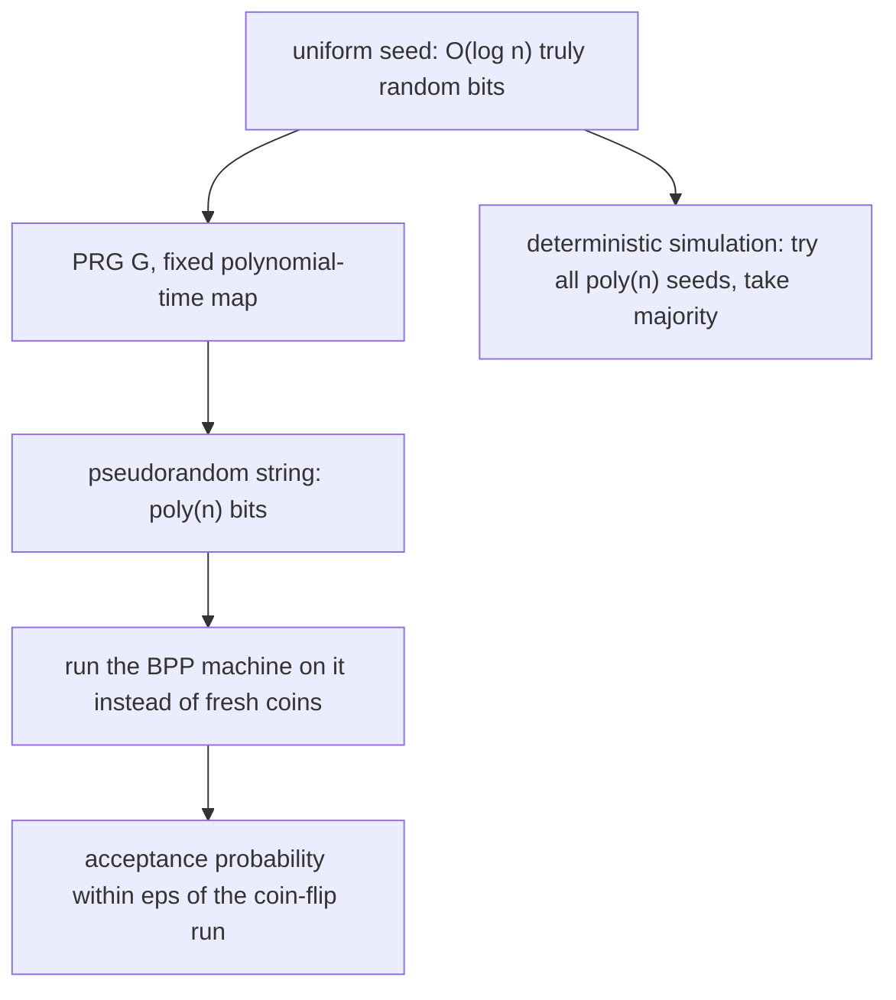
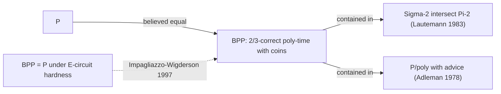

# Derandomization and Pseudorandomness

## Overview

Derandomization asks whether coin flips are ever *necessary* for efficient computation: can every randomized algorithm be replaced by a deterministic one with comparable cost? Pseudorandomness answers with a technology: deterministically generate long bit strings from short seeds so that no efficient observer can distinguish them from uniform — then feed the generated string to the randomized algorithm. This page covers pseudorandom generators (PRGs) and seed stretching, pairwise- and k-wise independence with their polynomial constructions over \\( \mathrm{GF}(2^t) \\), the method of conditional expectations with a worked max-cut derandomization, hitting sets and small-bias spaces, the state of BPP vs P, and extractors for weak randomness. It is the systematic counterpart of the "Derandomization Teaser" section in [Randomized Algorithms](randomized-algorithms.md); the complexity classes it manipulates (BPP, RP) are defined in [Complexity Classes](complexity-classes.md).

## 1. The Question: Is Randomness Necessary?

Randomized algorithms (randomized quicksort, Miller–Rabin, Karger's min-cut, Freivalds' verification) get their guarantees from independence of the coins from the input. Three pressures motivate removing them:

- **Engineering**: cryptographically secure or physically seeded randomness is slow, quota-limited (`/dev/random` blocking), and a reproducibility hazard — a deterministic algorithm can be replayed, debugged, and verified bit-for-bit.
- **Theory**: if BPP = P, then "randomized" is a convenience, not a capability. Every complexity-class claim about BPP (from [Complexity Classes](complexity-classes.md)) would collapse to the deterministic world.
- **Security**: adversarial settings punish predictable randomness catastrophically (the 2012 Debian OpenSSL entropy bug is the canonical engineering cautionary tale).

The consensus conjecture is **BPP = P** — a random-looking \\( n \\)-bit string should be replaceable by one of \\( \mathrm{poly}(n) \\) explicit strings. Pseudorandomness is the framework that makes "random-looking" precise: a distribution fools a test class if every test in the class accepts it with probability within \\( \varepsilon \\) of its acceptance probability on truly uniform input.

## 2. PRGs and Seed Stretching

A **pseudorandom generator** is a function \\[ G : \{0,1\}^{s} \to \{0,1\}^{m} \\] that stretches a short uniform **seed** into \\( m \gg s \\) bits that **fool** a class \\( \mathcal{C} \\) of distinguishers: for every \\( D \in \mathcal{C} \\),

\\[ \Big|\Pr_{u \sim U_s}\big[D(G(u)) = 1\big] \;-\; \Pr_{y \sim U_m}\big[D(y) = 1\big]\Big| \;\le\; \varepsilon. \\]

Three regimes of \\( (s, m, \mathcal{C}) \\) cover the theory:

| Regime | Seed length \\( s \\) | Output \\( m \\) | Distinguisher class | Status |
|---|---|---|---|---|
| Unconditional, restricted model | \\( O(\log m) \\) | \\( \mathrm{poly}(m) \\) | space-\\( S \\)-bounded machines (Nisan 1992) | proven; drives space-bounded derandomization |
| Cryptographic PRG | \\( O(\log m) \\)-ish (e.g. 128–256 bits) | arbitrary | all poly-time statistical tests | equivalent to one-way functions (HILL) |
| Hardness-vs-randomness | \\( O(\log m) \\) | \\( \mathrm{poly}(m) \\) | circuits of size \\( \mathrm{poly}(m) \\) | conditional on circuit lower bounds |

The deep result is the **hardness-vs-randomness paradigm** (Blum–Micali, Yao 1980s): a *hard* function is a *random-looking* one. Yao showed that next-bit unpredictability is equivalent to statistical pseudorandomness, and the Blum–Micali construction extracts one hard-core bit per iteration. **Impagliazzo–Wigderson (1997)** completed the program: if some function in \\( \mathrm{E} = \mathrm{DTIME}(2^{O(n)}) \\) requires circuits of size \\( 2^{\Omega(n)} \\), then every BPP algorithm can be deterministically simulated in polynomial time — i.e. \\( \mathrm{BPP} = \mathrm{P} \\) — via a PRG whose seed is \\( O(\log n) \\) and which fools all polynomial-size circuits. The converse trade is also known (Kabanets–Impagliazzo 2004): derandomizing even **PIT** (polynomial identity testing, the co-RP flagship from [Randomized Algorithms](randomized-algorithms.md)) yields nontrivial circuit lower bounds, which is why derandomization and lower bounds are the same frontier.



The deterministic simulation is now trivial to state: enumerate all \\( 2^{O(\log n)} = \mathrm{poly}(n) \\) seeds, run the randomized algorithm on each generated string, and take the majority answer — the fooling guarantee guarantees the majority is correct.

## 3. Pairwise Independence: \\( O(n^2) \\) Sample Spaces

Many algorithms need only **pairwise independence** — every pair of outputs uniform and independent — not full independence. A family \\( \{h : \mathcal{U} \to [q]\} \\) is pairwise independent when for all distinct \\( x \ne y \\) and all \\( a, b \\), \\( \Pr_{h}[h(x) = a \wedge h(y) = b] = 1/q^2 \\). The two-line construction over a field: pick \\( \alpha, \beta \in \mathrm{GF}(q) \\) uniformly and set

\\[ h_{\alpha,\beta}(x) \;=\; \alpha x + \beta \pmod{q}. \\]

Two constraints (values at two points) determine \\( (\alpha, \beta) \\) uniquely, which is exactly the independence count. The seed is \\( 2\log q \\) bits, and evaluating on \\( n \\) points yields a sample space of size \\( q^2 = O(n^2) \\) versus \\( 2^{n} \\) for independent coins — exponential compression. Instantiating over \\( \mathrm{GF}(2^t) \\) with \\( q = 2^t \ge n \\) gives \\( n^2 \\) sample points describable by \\( 2t \\) field elements; arithmetic is a few XOR/multiply circuits.

Consequences that show up in production and interviews:

- **Universal hashing** (Carter–Wegman): \\( h_{\alpha,\beta} \\) is universal; expected \\( O(1) \\) hash chains for *every* input, with randomness only in the seed — the hash-flooding defense from [Randomized Algorithms](randomized-algorithms.md), section 7, needs exactly this much randomness and no more.
- **Concentration via Chebyshev**: pairwise-independent \\( 0/1 \\) variables satisfy \\( \mathrm{Var}[\sum X_i] \le \mathbb{E}[\sum X_i] \\), so Chebyshev bounds replace Chernoff — weaker tails, but provable from an \\( O(n^2) \\)-size space.
- **Perfect hashing (FKS)**: static dictionaries built from a two-level scheme whose outer hash needs only pairwise independence — \\( O(n) \\) space with \\( O(1) \\) worst-case lookup.
- **Sampling**: to estimate the mean of an \\( n \\)-item array within \\( \pm\varepsilon \\), \\( \sqrt{n}/\varepsilon^2 \\) pairwise-independent samples suffice by Chebyshev, all derivable from one \\( O(\log n) \\)-bit seed.

## 4. k-wise Independence via Polynomials over \\( \mathrm{GF}(2^t) \\)

The polynomial trick generalizes: a uniformly random **degree-\\( (k-1) \\)** polynomial \\( p(x) \\) over a field \\( \mathrm{GF}(q) \\) — i.e. \\( k \\) random field coefficients — makes the evaluations \\( p(x_1), \dots, p(x_n) \\) at any \\( n \\) distinct points **k-wise independent**, because \\( k \\) point-values determine the polynomial uniquely (Lagrange interpolation) and the map is a bijection. The sample space is \\( q^{k} \\) with seeds of \\( k \log q \\) bits.

Over characteristic 2, the XOR-flavored variant is the one used in practice: work over \\( \mathrm{GF}(2^t) \\) (equivalently \\( t \\)-bit words under carry-less multiplication), draw \\( k \\) random words \\( c_0, \dots, c_{k-1} \\), and output the \\( t \\)-bit blocks \\[ p(x_j) = \bigoplus_{i=0}^{k-1} c_i \cdot x_j^{i}. \\] Each block is \\( k \\)-wise uniform, and the \\( t \\) bit-planes are independent — giving \\( k \\)-wise independent bits with \\( kt \\)-bit seeds and \\( n \cdot t \\) output bits.

| Independence | Seed (bits) | Sample space | Concentration available | Typical use |
|---|---|---|---|---|
| pairwise (\\( k=2 \\)) | \\( 2t \\) | \\( q^2 \le n^2 \\) | Chebyshev | universal hashing, FKS, sketching |
| 4-wise | \\( 4t \\) | \\( q^4 \\) | limited Chernoff-type | variance-critical sampling, pivots |
| \\( k \\)-wise | \\( kt \\) | \\( q^k \\) | \\( \delta \\)-tails for \\( k \approx \log(1/\delta) \\) | amplification with tiny seeds, min-wise |
| full \\( n \\)-wise | \\( nt \\) | \\( q^n \\) | full Chernoff | baseline \\( = \\) true randomness |

Two caveats keep the table honest. First, \\( k \\)-wise independence does **not** fully recover Chernoff tails: Schmidt–Siegel–Talwar (2010) exhibited \\( k \\)-wise independent distributions fooling Chernoff only up to a point, so claims need the right \\( k \approx \log(1/\delta) \\). Second, the constructions are *linear* maps from seed to output, which is precisely why they also serve as **small-bias spaces** in Section 6.

## 5. Method of Conditional Expectations: Derandomizing Max-Cut

The method converts any randomized algorithm whose *expected* value is efficiently computable into a deterministic one: fix the random choices one at a time, each time selecting the value that does not decrease the conditional expectation. Since

\\[ \mathbb{E}[W] \;=\; \mathbb{E}\big[\,\mathbb{E}[W \mid x_1, \dots, x_i]\,\big], \\]

the conditional expectation is non-increasing as it is revealed, so the final deterministic outcome is at least the original expectation \\( \mathbb{E}[W] \\).

**Worked example — max cut.** The trivial randomized 2-coloring cuts each edge \\( e \\) with probability \\( 1/2 \\), so \\( \mathbb{E}[W] = W_{\text{total}}/2 \\) where \\( W_{\text{total}} = \sum_e w_e \\); this is the \\( 1/2 \\)-approximation from [Approximation Algorithms](approximation-algorithms.md). Enumerate vertices \\( v_1, \dots, v_n \\); before fixing \\( v_i \\), each unfixed vertex contributes its edges' cut-probability \\( 1/2 \\), fixed vertices contribute exactly 0 or 1. Compute the conditional expectation under \\( x_i = S \\) and under \\( x_i = T \\), keep the better — an \\( O(nm) \\) deterministic algorithm with cut \\( \ge m/2 \\) on every input:

```python
# Deterministic max-cut via conditional expectations (guarantee: cut >= W/2).
import random

def derandomized_max_cut(n, edges):
    fixed = [None] * n                     # None = still fair coin (prob 1/2 per side)

    def expected_cut():                    # E[cut | current partial assignment]
        exp = 0.0
        for u, v, w in edges:
            pu = 0.5 if fixed[u] is None else (1.0 if fixed[u] else 0.0)
            pv = 0.5 if fixed[v] is None else (1.0 if fixed[v] else 0.0)
            exp += w * (pu * (1 - pv) + pv * (1 - pu))   # P[endpoints differ]
        return exp

    for i in range(n):
        fixed[i] = True                    # tentatively put vertex i in S
        e_s = expected_cut()
        fixed[i] = False                   # tentatively put vertex i in T
        e_t = expected_cut()
        fixed[i] = e_s >= e_t              # keep the side with higher expectation
    return sum(w for u, v, w in edges if fixed[u] != fixed[v])

rng = random.Random(7)
n = 14
edges = [(u, v, 1) for u in range(n) for v in range(u + 1, n) if rng.random() < 0.4]
W = sum(w for _, _, w in edges)
cut = derandomized_max_cut(n, edges)
print(f"vertices={n} edges={len(edges)} W={W} guarantee={W/2:.1f} achieved={cut}")
```

The printed run of this block achieves a cut strictly above the \\( W/2 \\) guarantee on the seeded instance (e.g. `edges=34 W=34 guarantee=17.0 achieved=19`) — the guarantee is per-input, so 19 vs 17.0 confirms the method, and local-search post-processing is a strict improvement on top. The same derandomization applies to set-cover greedy (which is already deterministic), to randomized rounding of LPs when the objective is linear, and to any expectation-based analysis where the conditional expectation is polynomial-time computable — the limiting condition in practice.

## 6. Hitting Sets and Small-Bias Spaces

A **hitting set** for a family \\( \mathcal{F} \subseteq 2^{[n]} \\) is a (multi)set \\( H \subseteq [n] \\) intersecting every member of \\( \mathcal{F} \\). Its derandomization role: an **RP** algorithm errs only on a set of "bad" random strings; a polynomial-size set of seeds hitting every bad family turns the one-sided-error algorithm deterministic by trying only the seeds in \\( H \\). Formally, for a language with an RP verifier and \\( r = O(\log n) \\) random bits, there exist \\( \mathrm{poly}(n) \\) seeds such that for every input, at least one seed leads to the correct answer — constructible unconditionally for restricted families, and the seed-based version of the enumeration argument in the PRG diagram of Section 2.

A **small-bias (\\( \varepsilon \\)-biased) space** is a distribution \\( D \\) on \\( \{0,1\}^n \\) such that every nonzero linear test \\( a \in \{0,1\}^n \\) has bias \\( \le \varepsilon \\):

\\[ \Big|\Pr_{x \sim D}\big[\langle a, x\rangle = 1\big] \;-\; \tfrac12\Big| \;\le\; \varepsilon. \\]

Naor–Naor (1993) construct such spaces of size \\( O(n^2/\varepsilon^2) \\) from dual error-correcting codes (BCH codes); they are the canonical "explicit small universe that fools all parity tests". Connections worth stating: small-bias spaces are exactly distributions fooling the class of GF(2)-linear functions; they yield hitting sets for linear-combination tests; and Nisan's PRG for space-bounded computation (1992) — seed \\( O(S \log n) \\) fooling space-\\( S \\) machines — is the landmark unconditional generator built from limited-independence blocks. The trio (PRGs for time-bounded computation, hitting sets for one-sided error, small-bias for linear tests) is one object viewed through three constraint classes, and the tools table below summarizes the toolkit.

| Tool | Seed / size | Fools | Flagship application |
|---|---|---|---|
| Pairwise-independent family \\( \alpha x + \beta \\) | \\( 2\log q \\) bits | pairwise statistics | universal hashing, FKS dictionaries |
| Degree-\\( (k{-}1) \\) polynomial over \\( \mathrm{GF}(2^t) \\) | \\( k\log q \\) bits | \\( k \\)-wise statistics | low-seed amplification, min-hash |
| \\( \varepsilon \\)-biased space (Naor–Naor) | \\( O(\log n + \log 1/\varepsilon) \\)-bit seeds | all parity/linear tests | derandomizing XOR algorithms, streaming |
| Nisan's PRG (1992) | \\( O(S \log n) \\) bits | space-\\( S \\) machines | \\( \mathrm{BPL} \subseteq \mathrm{P} \\)-style space derandomization |
| Impagliazzo–Wigderson PRG | \\( O(\log n) \\) bits | poly-size circuits | \\( \mathrm{BPP} = \mathrm{P} \\) under hardness assumptions |
| Conditional expectations | none (algorithmic) | expectation analyses | deterministic max-cut, LP rounding |

## 7. BPP vs P: What Is Actually Known

The unconditional landscape, in increasing order of strength:

- **\\( \mathrm{BPP} \subseteq \mathrm{P/poly} \\)** (Adleman 1978): a counting argument over \\( \mathrm{poly}(n) \\) random strings shows one "good" coin string exists for all inputs of length \\( n \\); BPP computations therefore have polynomial-size **advice**. Randomness adds at most advice.
- **\\( \mathrm{BPP} \subseteq \Sigma_2^{\mathrm{P}} \cap \Pi_2^{\mathrm{P}} \\)** (Sipser–Gács–Lautemann 1983): BPP sits in the second level of the polynomial hierarchy — evidence it is nowhere near NP-complete territory unless PH collapses.
- **Hardness-vs-randomness (Impagliazzo–Wigderson 1997)**: \\( \mathrm{E} \\) containing a \\( 2^{\Omega(n)} \\)-circuit-hard function implies \\( \mathrm{BPP} = \mathrm{P} \\). Weaker hardness assumptions give \\( \mathrm{BPP} \subseteq \mathrm{SUBEXP} \\).
- **PIT as the sharpest concrete target**: derandomizing polynomial identity testing even for special circuit classes implies circuit lower bounds (Kabanets–Impagliazzo 2004) — the direction of implication that makes derandomization *hard to do* rather than merely open.



The one spectacular success story is primality: Miller–Rabin (randomized, \\( O(k \log^3 n) \\), error \\( 4^{-k} \\)) was derandomized by **AKS (2002)** into deterministic poly time — proving that at least one BPP-flavored capability was an illusion of not-yet-found algorithms. Related resources: [Probability and Statistics for Programmers](../mathematics/probability-statistics.md) covers the Chebyshev/Chernoff machinery the k-wise bounds lean on.

## 8. Extractors: Harvesting Weak Randomness

PRGs assume a short *uniform* seed; the physical world supplies long but **biased** or correlated strings (thermal noise, disk seek times). A source has **min-entropy** \\( k \\) if no outcome has probability above \\( 2^{-k} \\) — the worst-case entropy measure. A **seeded extractor** is a function

\\[ \mathrm{Ext} : \{0,1\}^{n} \times \{0,1\}^{d} \;\to\; \{0,1\}^{m} \\]

such that for *every* source \\( X \\) with min-entropy \\( k \\), \\( \mathrm{Ext}(X, U_d) \\) is \\( \varepsilon \\)-close to uniform in \\( m \\) bits. The **leftover hash lemma** (Impagliazzo–Levin–Luby 1989) gives the universal construction: pairwise-independent hashing is an extractor with \\( d = n \\)-bit seeds outputting \\( m = k - 2\log(1/\varepsilon) \\) bits — the same \\( \alpha x + \beta \\) family from Section 3, reused with a different guarantee. Cryptographic **privacy amplification** (turning a partially compromised shared secret into a uniform key) is exactly extractor application.

The conceptual unity interviewers like: **PRGs and extractors are the same definition with different adversary models** — a PRG fools efficiently *decidable* tests on a uniform seed; an extractor fools *all* statistical tests but pays for it with a longer seed and a worst-case source guarantee. Landmark milestone: two-source extractors — needing no uniform seed at all, just two independent weak sources — were achieved for polylogarithmic min-entropy by Chattopadhyay–Zuckerman (2015), a decade-long open problem, with explicit constructions remaining an active area (Vadhan's monograph is the standard map of the field).

## Interview Questions

1. **What does a pseudorandom generator buy, and what would proving one exist unconditionally mean?**
   A PRG \\( G : \{0,1\}^{O(\log n)} \to \{0,1\}^{\mathrm{poly}(n)} \\) fooling poly-size circuits turns any BPP algorithm deterministic: enumerate all \\( \mathrm{poly}(n) \\) seeds, take majority — the fooling guarantee makes the majority correct. Impagliazzo–Wigderson shows such \\( G \\) exists if some E-function needs \\( 2^{\Omega(n)} \\) circuits, so an unconditional construction of this strength would itself be a massive circuit lower bound. Derandomization and lower bounds are two faces of one open problem.
2. **Give a 2-line pairwise-independent family and state what \\( n^2 \\) means here.**
   Over \\( \mathrm{GF}(q) \\): \\( h_{\alpha,\beta}(x) = \alpha x + \beta \\) with uniform \\( \alpha, \beta \\); two fixed distinct inputs have jointly uniform outputs because \\( (\alpha, \beta) \\) solve uniquely for any target pair. For \\( n \\) inputs (\\( q \ge n \\)) the sample space has \\( q^2 = O(n^2) \\) points versus \\( 2^n \\) for full independence — an exponential compression at the cost of only Chebyshev-grade concentration instead of Chernoff.
3. **How do you get k-wise independent bits, and what is the cost curve?**
   Sample a random degree-\\( (k-1) \\) polynomial over \\( \mathrm{GF}(2^t) \\) (\\( k \\) random \\( t \\)-bit coefficients) and output its evaluations at the \\( n \\) points: any \\( k \\) evaluations determine the polynomial uniquely, hence are \\( k \\)-wise independent, including bit-plane-wise. Cost: \\( kt \\)-bit seeds, \\( q^k \\) sample space; \\( k \approx \log(1/\delta) \\) buys \\( \delta \\)-tail bounds. Note the caveat: k-wise independence does not give the full Chernoff regime (Schmidt–Siegel–Talwar), so \\( k \\) must scale with the target error.
4. **Derandomize the max-cut 1/2-approximation in one sentence and state the guarantee.**
   Fix vertices \\( v_1, \dots, v_n \\) in order, placing each in \\( S \\) or \\( T \\) according to which keeps the conditional expectation of the cut (unfixed vertices contribute their edges at probability \\( 1/2 \\)) non-decreasing; the chain rule for expectation guarantees the final deterministic cut is at least \\( \mathbb{E}[W] = W/2 \\) on every input, computed in \\( O(nm) \\) time.
5. **Where does randomness provably not help, and where is it still needed?**
   Advice-wise it never helps much: BPP ⊆ P/poly (Adleman) and BPP ⊆ \\( \Sigma_2 \cap \Pi_2 \\) (Lautemann) bound its power; AKS derandomized primality outright. But no unconditional BPP = P is known — PIT ( Schwartz–Zippel identity testing) remains open, and derandomizing it would imply circuit lower bounds (Kabanets–Impagliazzo), so randomized identity testing is still the practical and theoretical state of the art.
6. **What is the difference between a PRG and an extractor?**
   A PRG takes a short *uniform* seed and fools a restricted (efficiently decidable) class of tests — enough for derandomization. An extractor takes a long *arbitrary* source of min-entropy \\( k \\) plus a seed and produces output statistically close to uniform, fooling *all* tests — enough for cryptography (privacy amplification, key derivation from noisy entropy). The leftover hash lemma shows the pairwise-independent hash family serves as both, with different parameter regimes.

## Key Takeaways

- Derandomization's bet: \\( \mathrm{BPP} = \mathrm{P} \\); PRGs with \\( O(\log n) \\)-bit seeds fooling poly-size circuits would settle it, and exist conditionally (Impagliazzo–Wigderson) on exponential circuit hardness.
- Pairwise independence from \\( \alpha x + \beta \\) over \\( \mathrm{GF}(q) \\): \\( O(n^2) \\) sample spaces, universal hashing, FKS dictionaries, Chebyshev-grade concentration — from \\( 2\log q \\)-bit seeds.
- k-wise independence: random degree-\\( (k-1) \\) polynomials over \\( \mathrm{GF}(2^t) \\); \\( kt \\)-bit seeds, \\( q^k \\) spaces; \\( k \approx \log(1/\delta) \\) for tail bounds, with Schmidt–Siegel–Talwar marking the Chernoff limit.
- Method of conditional expectations: any efficiently computable expectation derandomizes for free — worked max-cut gives a deterministic \\( \ge W/2 \\) cut in \\( O(nm) \\).
- Hitting sets derandomize one-sided error (RP); \\( \varepsilon \\)-biased spaces (Naor–Naor) fool all linear tests; Nisan's PRG handles space-bounded computation unconditionally.
- Known unconditionally: \\( \mathrm{BPP} \subseteq \mathrm{P/poly} \\) (Adleman) and \\( \mathrm{BPP} \subseteq \Sigma_2 \cap \Pi_2 \\) (Lautemann); derandomizing PIT implies circuit lower bounds (Kabanets–Impagliazzo).
- AKS (2002) is the flagship success: Miller–Rabin's randomness was removable; reproducibility and auditability are real engineering dividends.
- Extractors convert min-entropy-\\( k \\) weak sources to near-uniform output; leftover hash lemma = universal hashing as extraction; PRG and extractor are one definition under two adversary models.

## References

1. Motwani & Raghavan, *Randomized Algorithms*, Cambridge University Press, 1995 (chapters on derandomization and limited independence).
2. Impagliazzo & Wigderson (1997), *P = BPP if E Requires Exponential Circuits*, STOC 1997 — the hardness-vs-randomness theorem.
3. Kabanets & Impagliazzo (2004), *Derandomizing Polynomial Identity Tests Means Proving Circuit Lower Bounds*, Computational Complexity 13(1–2).
4. Naor & Naor (1993), *Small-Bias Probability Spaces: Efficient Constructions and Applications*, STOC 1993 (journal: SIAM J. Comput. 22(4)).
5. Nisan (1992), *PRGs for Space-Bounded Computation*, STOC 1992; Nisan & Zuckerman (1996), *Randomness is Linear in Space*, J. Comput. Syst. Sci. 52(1).
6. Impagliazzo, Levin & Luby (1989), *Pseudo-Random Generation from One-Way Functions*, STOC 1989 (leftover hash lemma).
7. Schmidt, Siegel & Talwar (2010), *The Autocorrelation of Limited Independence Constructions*, RANDOM 2010 (limits of k-wise Chernoff).
8. Chattopadhyay & Zuckerman (2015), *Explicit Two-Source Extractors and Resilient Functions*, STOC 2015 (best paper).
9. Vadhan, *Pseudorandomness*, Foundations and Trends in Theoretical Computer Science 7(1–3), 2012 — the standard monograph.
10. Agrawal, Kayal & Saxena (2004), *PRIMES is in P*, Annals of Mathematics 160(2) — <https://arxiv.org/abs/math/0209351>
11. Arora & Barak, *Computational Complexity: A Modern Approach* (chapter 8: pseudorandomness) — <http://theory.cs.princeton.edu/complexity/>
12. MIT OpenCourseWare, *6.045J Automata, Computability, and Complexity* (BPP, derandomization lectures) — <https://ocw.mit.edu>

## Cross-References

- [Randomized Algorithms](./randomized-algorithms.md) — the Monte Carlo/Las Vegas toolkit this page strips randomness from; its section 8 is the teaser this page expands.
- [Complexity Classes](./complexity-classes.md) — BPP, RP, and the P vs NP backdrop against which derandomization theorems live.
- [PCP Theorem and Inapproximability](./pcp-inapproximability.md) — amplification idioms shared with soundness boosting; extractors powering the strongest inapproximability results (Zuckerman).
- [Chapter 63: Randomized Algorithms](../dsa/chapters/ch63-randomized-algorithms.md) — implementation drills (reservoir sampling, skip lists) that the limited-independence constructions above can seed.
- [Cryptographic Hashing](../cryptography/hashing.md) — universal and keyed hashing: pairwise independence in its adversarial deployment.
- [Probability and Statistics for Programmers](../mathematics/probability-statistics.md) — Chebyshev and Chernoff bounds used by the k-wise analysis.
