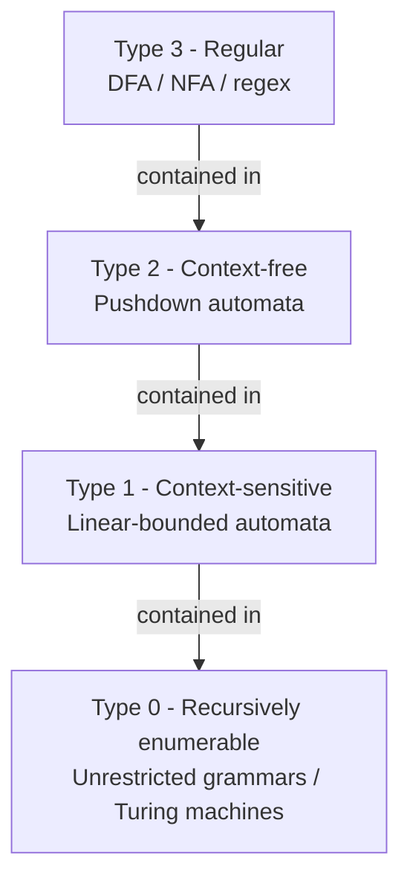
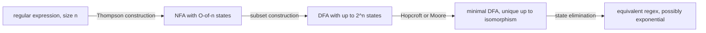

# Formal Languages

## Overview

Formal languages classify what finite machines can recognize, forming the theoretical backbone of compilers, static analyzers, regex engines, and verification tools. The Chomsky hierarchy assigns every language to one of four classes, each tied to a minimal automaton model, which tells you exactly how much machinery a problem needs. Interviews use this topic to test whether you can reason about expressiveness versus cost: spotting when a regex is sufficient, when a context-free grammar is required, and how to prove a language is impossible for a given machine class.

## Chomsky Hierarchy

Formal languages are classified by the generative grammars that produce them:

| Type | Grammar | Automaton | Language Class | Example |
|------|---------|-----------|---------------|--------|
| 3 | Regular | DFA/NFA | Regular | `a*b*` |
| 2 | Context-Free | Pushdown Automaton | Context-Free | `{aⁿbⁿ}` |
| 1 | Context-Sensitive | Linear-Bounded Automaton | Context-Sensitive | `{aⁿbⁿcⁿ}` |
| 0 | Unrestricted | Turing Machine | Recursively Enumerable | A_TM |

```
Type 0 (Recursively Enumerable)
  ⊃ Type 1 (Context-Sensitive)
    ⊃ Type 2 (Context-Free)
      ⊃ Type 3 (Regular)
```

Each level is a **proper** superset of the one below it: `{aⁿbⁿ}` is context-free but not regular, and `{aⁿbⁿcⁿ}` is context-sensitive but not context-free. Every containment is strict, which is why the automaton upgrade (no memory → stack → tape bounded by input → unbounded tape) is not optional — each added memory feature buys exactly one new level of expressiveness.



### Closure Properties Across the Hierarchy

Closure properties are the practical tool for proving a language is *not* in a class: build it from known members using operations the class cannot support.

| Operation | Regular | Context-Free | Context-Sensitive | Recursively Enumerable |
|---|---|---|---|---|
| Union | ✓ | ✓ | ✓ | ✓ |
| Intersection | ✓ | ✗ | ✓ | ✓ |
| Complement | ✓ | ✗ | ✓ | ✗ |
| Concatenation | ✓ | ✓ | ✓ | ✓ |
| Kleene star | ✓ | ✓ | ✓ | ✓ |
| Intersection with a regular language | ✓ | ✓ | ✓ | ✓ |
| Homomorphism | ✓ | ✓ | ✓ | ✓ |
| Inverse homomorphism | ✓ | ✓ | ✓ | ✓ |

Two entries deserve explanation. **CFLs are not closed under intersection**: `{aⁿbⁿcᵐ}` and `{aᵐbⁿcⁿ}` are both context-free, but their intersection is `{aⁿbⁿcⁿ}`, which is not. If CFLs were closed under complement, De Morgan would make them closed under intersection (since they are closed under union), so non-closure under complement follows too. **Context-sensitive languages *are* closed under complement** — this was a famous open problem until the Immerman–Szelepcsényi theorem (1987) showed NSPACE is closed under complementation.

## Regular Languages

Defined by regular expressions or recognized by DFAs/NFAs. Key closure properties: union, intersection, complementation, concatenation, Kleene star.

**Pumping Lemma for Regular Languages**: If L is regular, ∃p (pumping length) such that any string s ∈ L with |s| ≥ p can be split s = xyz where |xy| ≤ p, |y| > 0, and xyⁱz ∈ L for all i ≥ 0.

**Using the pumping lemma to prove non-regularity** (proof by contradiction):

1. Assume L is regular. Let p be the pumping length.
2. Choose a string s ∈ L with |s| ≥ p.
3. Show that for *any* valid split xyz, some xyⁱz ∉ L.
4. Contradiction → L is not regular.

```python
def is_regular_by_dfa(string, transitions, start, accept):
    """Check membership in a regular language via DFA simulation."""
    state = start
    for ch in string:
        state = transitions.get((state, ch))
        if state is None:
            return False
    return state in accept
```

### Pumping Lemma: Worked Proof That {aⁿbⁿ} Is Not Regular

**Claim.** \\(L = \\{a^n b^n \\mid n \\ge 0\\}\\) is not regular.

**Proof.** Suppose L is regular and let p ≥ 1 be its pumping length. Choose \\(s = a^p b^p \\in L\\); since \\(|s| = 2p \\ge p\\), the lemma applies to s. Consider an arbitrary decomposition s = xyz with |xy| ≤ p and |y| > 0. Because |xy| ≤ p, the substring xy lies entirely inside the first p symbols of s, which are all a's; hence y = aᵏ for some k ≥ 1. Pump down: xy⁰z = xz = aᵖ⁻ᵏbᵖ, and since k ≥ 1 the number of a's and b's differ, so xy⁰z ∉ L. This contradicts the pumping lemma, therefore no DFA recognizes L. ∎

The key step is the adversarial choice: the prover picks s *after* seeing p, and the constraint |xy| ≤ p forces y into the a-block. Treat the pumping lemma as a game you play against the adversary who supplies the split — you must win for *every* split.

**Caveat**: the pumping lemma is a necessary but not sufficient condition for regularity. There exist non-regular languages that satisfy it (the classic example is `{aⁱbʲcᵏ : i, j, k ≥ 0 and if i = 1 then j = k}`), so a successful pumping argument only ever proves non-regularity, never regularity. For regularity proofs, exhibit a DFA, NFA, or regex; for sharper impossibility proofs, use the Myhill–Nerode theorem.

### {aⁿbⁿcⁿ} Is Not Even Context-Free

The CFL pumping lemma splits s = uvxyz with |vxy| ≤ p and |vy| > 0. Choose s = aᵈbᵈcᵈ where d is the pumping length. Because the window vxy is shorter than one full block, it can overlap at most two of the three symbol blocks — it cannot simultaneously cover a's, b's, and c's. Pumping with i = 0 or i = 2 therefore changes the counts in at most two blocks while the third block keeps exactly d symbols, and equal counts are lost for some i. Hence \\(\\{a^n b^n c^n\\}\\) is not context-free, yet a linear-bounded automaton recognizes it by crossing off one symbol of each type per pass — proving Type 1 ⊋ Type 2. When the CFL pumping lemma is too weak, Ogden's lemma (which lets you mark which positions must be pumped) is the stronger tool.

## Regular Expressions and Finite Automata

Kleene's theorem ties the three regular representations together: regular expressions, NFAs, and DFAs all define exactly the regular languages, and each conversion is effective.



### Regex → NFA: Thompson's Construction

Thompson's construction (1968) translates a regex of size n into an NFA with O(n) states and O(n) ε-transitions by structural induction: concatenation wires the accept state of one fragment to the start of the next, alternation adds a new start with ε-branches, and star adds ε-loops around the fragment. The result is an NFA with a single start state and single accept state, which is why streaming matchers can run it directly in O(n·m) time for input length n and pattern size m — no exponential blowup ever materializes unless you insist on a DFA.

### NFA → DFA: Subset Construction

The subset construction simulates the NFA's *set* of reachable states, producing a DFA with at most 2ⁿ states. The blowup is tight: recognizing "the n-th symbol from the end is an a" requires 2ⁿ states in any DFA, while an NFA needs only n+1. Practical tools avoid materializing the DFA eagerly — they build *lazy* DFAs, creating a subset state the first time it is reached (this is how grep, RE2, and the Rust regex crate stay fast on ordinary patterns). After construction, minimization algorithms (Moore O(n²), Hopcroft O(n log n)) produce the unique minimal DFA, whose existence and uniqueness is the content of the Myhill–Nerode theorem.

### DFA → Regex: State Elimination

State elimination runs the conversion in reverse via a generalized NFA whose edges carry regular expressions: repeatedly remove a state q, and for every pair of remaining states (p, r) add the edge expression `R_pr + R_pq · R_qq* · R_qr`. With n states the algorithm performs O(n³) edge updates, and the *output* regex can grow exponentially — there are DFAs over k symbols whose minimal equivalent regex has size 2^Ω(n/k). This direction matters in verification tools that convert automata into constraints, not in everyday regex engines.

| Construction | Direction | Size bound | Primary use |
|---|---|---|---|
| Thompson | regex → NFA | O(n) states | streaming matchers |
| Glushkov / position automaton | regex → NFA | m+1 states, no ε-moves | direct DFA builders |
| Subset construction | NFA → DFA | ≤ 2ⁿ states | lexers |
| Hopcroft / Moore | DFA → minimal DFA | unique minimum | canonical lexers, equivalence tests |
| State elimination | DFA → regex | O(n³) steps, exponential regex | model checking, tooling |

## Regex Engines: DFA Simulation vs Backtracking

Two implementation strategies dominate, and the difference is visible in production incidents:

- **Automaton simulation** (Thompson-style NFA simulation or lazy DFA): time O(n·m) guaranteed, immune to pathological patterns. RE2 and the Rust `regex` crate take this route; both deliberately omit backreferences.
- **Backtracking** (PCRE, Python `re`, JavaScript `RegExp`): tries one alternative at a time and revisits on failure. Fast in the common case, but worst-case exponential; supports backreferences and lookaround, which strictly exceed regular power.

```python
import re

# Catastrophic backtracking: (a+)+ forces re-splitting the a-run
# at every failure point — about 2^30 candidate paths for 30 a's.
re.match(r"(a+)+$", "a" * 30)     # noticeable delay
re.match(r"(a+)+$", "a" * 100)    # effectively never finishes
```

This is the mechanism behind **ReDoS** (Regular expression Denial of Service): a WAF or input validator running a vulnerable backtracking pattern on attacker-controlled input pins a CPU core for hours. Mitigations in order of strength: run a linear-time engine (RE2, Rust regex), add per-match timeouts (PCRE `match_limit`), lint patterns for nested quantifiers like `(a+)+` or `(a|a)*` in CI.

| Engine | Strategy | Worst case | Backrefs / lookaround | Typical users |
|---|---|---|---|---|
| RE2 | NFA simulation + lazy DFA | O(n·m) | no (by design) | Google Code Search, log pipelines |
| Rust `regex` | lazy DFA + NFA fallback | O(n·m) | no | ripgrep |
| PCRE2 | backtracking | exponential | yes | PHP, Apache, nginx |
| Python `re`, JS `RegExp` | backtracking | exponential | yes | validators, scripting |

Patterns with backreferences are genuinely non-regular: `(.*)\1` matches the copy language `{ww}`, which no DFA can recognize, and deciding whether an input matches a backreference pattern is NP-complete (Aho 1990) — so no linear-time engine can support the full PCRE feature set.

## Context-Free Languages

Generated by context-free grammars (CFGs) or recognized by pushdown automata (PDAs). The stack gives them the power to match balanced delimiters.

**CYK Algorithm** (O(n³|G|)) parses any CFG in Chomsky Normal Form:

```
For string w = a₁a₂...aₙ:
  R[i][i] = { A | A → aᵢ is a rule }        (length 1 substrings)
  R[i][j] = { A | A → BC, B ∈ R[i][k], C ∈ R[k+1][j] }  (longer substrings)
  w ∈ L(G) iff S ∈ R[1][n]
```

**Pumping Lemma for CFLs**: If L is context-free, ∃p such that s = uvxyz with |vy| > 0, |vxy| ≤ p, and uvⁱxyⁱz ∈ L for all i ≥ 0.

### CYK Parsing Sketch: A Worked Example

Take a CNF grammar for `{aⁿbⁿ}`: `S → AB | AC`, `A → a`, `B → b`, `C → SB`, and parse w = aabb. Fill length-1 cells from terminal rules, then combine: cell (i, j) gets nonterminal X whenever some split (i, k)(k+1, j) has Y ∈ R[i][k] and Z ∈ R[k+1][j] with X → YZ.

| i \ j | 1 (a) | 2 (a) | 3 (b) | 4 (b) |
|---|---|---|---|---|
| 1 | A | ∅ | ∅ | S |
| 2 | | A | S | C |
| 3 | | | B | ∅ |
| 4 | | | | B |

Reading the fills: (2,3) = {S} from A·B covering "ab"; (2,4) = {C} from S·B covering "abb"; (1,4) = {S} from A·C covering "aabb". Since S ∈ R[1][4], the string is in L(G). CYK needs O(n³) time and O(n²) space and requires Chomsky Normal Form (conversion costs at most a squaring of grammar size). For deterministic subsets of the CFLs, LR(k) parsers run in O(n) and are what compiler frontends actually use; Earley and GLR handle arbitrary (even ambiguous) CFGs without CNF conversion — see [Advanced Parsing](../compilers/parsing-advanced.md) for production implementations.

## Context-Sensitive Languages

Generated by context-sensitive grammars where production rules α → β satisfy |α| ≤ |β| (except possibly S → ε). Recognized by linear-bounded automata (TMs with tape bounded by input length). Example: `{aⁿbⁿcⁿ | n ≥ 0}`.

Membership for context-sensitive languages is decidable but expensive: the problem is PSPACE-complete, and the nondeterministic space bound is exactly linear by definition. By Immerman–Szelepcsényi, the complement of a context-sensitive language is again context-sensitive, so this class sits comfortably inside the decidable world — one level below the undecidable frontier marked by Type 0.

## Decidability of Membership per Class

"Given a generator/recognizer for L and a string w, is w ∈ L?" has a different answer at every level of the hierarchy:

| Language class | Membership decided by | Decidable? | Complexity |
|---|---|---|---|
| Regular | DFA / NFA simulation | yes | O(n) for a DFA; O(n·m) for a regex |
| Context-free | CYK / LR / Earley | yes | O(n³) general; O(n) for LR(k) subsets |
| Context-sensitive | linear-bounded automaton | yes | PSPACE-complete |
| Recursively enumerable | Turing machine | semi-decidable | undecidable in general (this is A_TM) |
| Unrestricted grammar | TM simulation | semi-decidable | equivalent to TM recognition |

Note the contrast that interviews like: "does M accept w *ever*?" is undecidable, but "does M accept w *within t steps*?" is trivially decidable — just simulate t steps. Every practical verification tool (fuzzers with timeouts, model checkers with unroll bounds, SMT solvers with step limits) exploits exactly this bounded variant of an undecidable question.

## Applications

- **Lexing**: the tokenizer of every compiler is a DFA derived from a regex specification; maximal-munch and longest-match rules are decided by DFA state (see [Lexical Analysis](../compilers/lexical-analysis.md)).
- **Parsing**: headers, expressions, JSON, SQL, and programming language syntax are CFGs; the automaton behind LALR table generation is a DFA over item sets.
- **Protocol and system verification**: protocol state machines are treated as regular languages; regular model checking represents configurations as words and transitions as transducers to prove safety properties (see [Model Checking](../formal-methods/model-checking.md)).
- **Deep packet inspection**: Suricata and Snort compile signature regexes into DFA/hyperscan structures to match gigabit-rate traffic — the 2ⁿ blowup is fought with lazy construction and multi-string DFAs.
- **Compression and string algorithms**: grammar-based compression (RePair) and the LZ family exploit the regular/concatenation structure of text (see [Advanced String Processing](../dsa/chapters/ch164-adv-strings.md)).

## Interview Questions

**Q: How do you prove a language is not regular?**
A: Use the pumping lemma. Assume it's regular, pick a string longer than the pumping length, and show that pumping any valid division breaks membership. For `{aⁿbⁿ}`, pick `aᵖbᵖ` — pumping y (which must be all a's) breaks the equal-count property.

**Q: Why can't a DFA recognize `{aⁿbⁿ}`?**
A: A DFA has finite memory (fixed states). To count n a's and verify exactly n b's, it would need unbounded memory — n can be arbitrarily large. A PDA solves this with its stack.

**Q: What is the difference between the pumping lemmas for regular and context-free languages?**
A: The regular pumping lemma splits strings into 3 parts (xyz) and guarantees the *middle* part can be pumped. The CFL pumping lemma splits into 5 parts (uvxyz) and guarantees the two middle parts pump *together* (same exponent). The CFL version is more flexible, reflecting the greater power of CFGs.

**Q: Why does the subset construction blow up to 2ⁿ states, and what do real engines do about it?**
A: The DFA state is a *set* of NFA states, and up to 2ⁿ distinct sets are reachable — the bound is tight, e.g., "n-th symbol from the end is a" needs 2ⁿ DFA states but only n+1 NFA states. Real engines avoid eager conversion: RE2 and the Rust regex crate build a *lazy* DFA, materializing each reachable subset only when first encountered at runtime, and fall back to NFA simulation when the DFA cache would explode. This keeps worst-case time at O(n·m) with no pathological inputs.

**Q: Is the pattern `(a+)+` itself exponential, or is it the engine?**
A: It's the engine. Under NFA simulation, `(a+)+$` against "aaaa…a!" runs in linear time; the exponential behavior is an artifact of backtracking, which re-enumerates the exponentially many ways to partition the a-run into `(a+)` groups. This is why ReDoS is a property of the engine-plus-pattern pair, and why security-sensitive code either bans nested quantifiers or runs a linear-time engine.

**Q: Why can't regexes with backreferences be implemented with a DFA?**
A: A backreference like `(.*)\1` enforces that two separated parts of the input are identical — the copy language {ww} — which is provably not regular. Worse, matching with backreferences is NP-complete (Aho 1990), so RE2's decision to drop them is not a performance shortcut but a principled trade: keep worst-case linear time by giving up non-regular features.

**Q: When would you choose CYK over an LR parser?**
A: CYK accepts *any* CFG (converted to Chomsky Normal Form) in O(n³), including ambiguous and nondeterministic grammars where no LR table exists. LR(k) is O(n) but only covers deterministic subsets. Use CYK inside probabilistic CFG toolkits (speech/NLP) where you need all parse probabilities, or over ambiguous grammars; use LR/LALR in compilers where the grammar is engineered to be deterministic and per-token cost matters.

**Q: Give one language at each level of the Chomsky hierarchy.**
A: Regular: `a*b*`. Context-free but not regular: `{aⁿbⁿ}` (needs counting — the stack does it). Context-sensitive but not context-free: `{aⁿbⁿcⁿ}` (needs two independent counts — one stack is insufficient). Recursively enumerable but not context-sensitive: the complement of A_TM, or the set of pairs ⟨M, w⟩ where M accepts w — recognized but not decidable, hence outside any decidable class.

## Key Takeaways

- The Chomsky hierarchy is a strict chain: regular ⊊ context-free ⊊ context-sensitive ⊊ recursively enumerable, each level equal to recognition by one minimal automaton model.
- Pumping lemmas only prove non-membership in a class; they are adversary games where you choose the string after learning the pumping length.
- `{aⁿbⁿ}` defeats DFAs (finite memory cannot count), and `{aⁿbⁿcⁿ}` defeats PDAs (one stack cannot track two independent counts).
- Regex ≡ NFA ≡ DFA (Kleene's theorem); the 2ⁿ subset-construction blowup is real but managed in practice by lazy DFA construction.
- Backtracking regex engines (PCRE, Python, JS) are exponential in the worst case — ReDoS — while simulation engines (RE2, Rust regex) are linear but omit backreferences, which are non-regular anyway.
- CFLs are closed under union and star but *not* intersection or complement; context-sensitive languages are closed under complement (Immerman–Szelepcsényi, 1987).
- Membership is decidable for Types 3, 2, 1 (linear, cubic, PSPACE-complete respectively) and only semi-decidable for Type 0 — the bounded version (within t steps) is always decidable.

## References

- [Introduction to the Theory of Computation — Sipser](https://www.cengage.com/c/introduction-to-the-theory-of-computation-sipser-3e/)
- [Formal Languages and Their Relation to Automata — Hopcroft & Ullman](https://www.addisonwesley.com/)
- [RE2: an efficient, principled regular expression engine](https://github.com/google/re2)
- [The Rust `regex` crate — syntax and performance guarantees](https://docs.rs/regex)
- [Russ Cox, "Regular Expression Matching Can Be Simple And Fast" (2007)](https://swtch.com/~rsc/regexp/regexp1.html)
- [PCRE — Perl Compatible Regular Expressions](https://www.pcre.org/)
- N. Chomsky, "Three Models for the Description of Language," *IRE Transactions on Information Theory*, 2(3), 1956.
- K. Thompson, "Programming Techniques: Regular Expression Search Algorithm," *Communications of the ACM*, 11(6), 1968.

## Cross-References

- [Turing Machines](./turing-machines.md) — the Type 0 recognizer and the model behind linear-bounded automata
- [Computability](./computability.md) — why Type 0 membership is only semi-decidable (A_TM)
- [Logic](./logic.md) — the formal-systems view of grammars as inference rules
- [Lexical Analysis](../compilers/lexical-analysis.md) — regex-to-DFA machinery as used by real tokenizers
- [Advanced Parsing](../compilers/parsing-advanced.md) — CYK, Earley, GLR, and Pratt parsing in production
- [Model Checking](../formal-methods/model-checking.md) — regular-language techniques applied to protocol verification
- [Advanced String Processing](../dsa/chapters/ch164-adv-strings.md) — grammar compression and the LZ family
