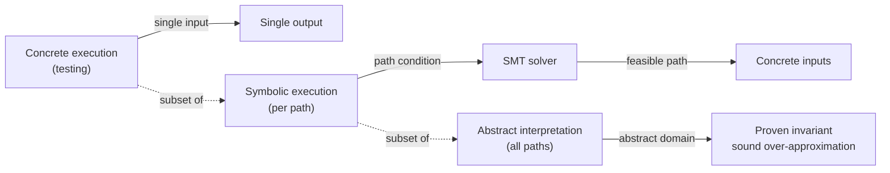

# Formal Methods — Specification, Verification & Model Checking

## Overview

**Formal methods** are mathematically rigorous techniques for specifying, designing, and verifying software and hardware systems. Where conventional testing checks a finite set of inputs, formal methods reason about *all* possible behaviors of a system — proving that a property holds for every reachable state, not just the ones a test happened to exercise.

The field rests on three pillars:

- **Formal specification** — writing down what a system should do in a precise, unambiguous mathematical notation (temporal logic, set theory, refinement calculus).
- **Formal verification** — mechanically checking that an implementation satisfies its specification, either by exhaustive state-space exploration (model checking) or by mathematical proof (theorem proving).
- **Refinement** — stepwise transformation of an abstract specification into a concrete implementation, with proof that each step preserves the original semantics.

Formal methods are standard practice in hardware design (Intel and AMD verify floating-point units with theorem provers after the Pentium FDIV bug cost $475M in 1994), in safety-critical embedded systems (DO-178C for avionics, ISO 26262 for automotive), and increasingly in distributed systems (AWS uses TLA+ for S3, DynamoDB, and Step Functions; Cosmos DB uses TLA+ for its consistency-model checker). They are uncommon in ordinary business software because the up-front cost is high and most bugs are not specification violations but implementation defects that cheaper techniques catch.

> Related: [Proof Techniques](./proofs.md), [Logic](./logic.md), [Complexity Classes](./complexity-classes.md), [Turing Machines](./turing-machines.md), [Testing Overview](../testing/README.md), [Distributed Consensus](../distributed/fundamentals/README.md)

## Why Formal Methods?

Consider a distributed lock service. The correctness property is: *at most one client holds the lock at any time*. A test might verify this for 100 clients over 10 minutes, but the property could still be violated by an interleaving the test did not exercise — a specific sequence of message delays, retries, and crashes. A model checker, by contrast, explores every possible interleaving (subject to the state-space bound) and either finds a violating trace or proves no such trace exists. AWS's use of TLA+ on DynamoDB found a bug that had eluded six months of testing and code review; the bug required a precise combination of membership change, failure, and retry that no test had hit.

The trade-off is cost. A formal specification takes days to weeks to write, the tools have a learning curve, and the verification step has scalability limits (model checking's state-space explosion, theorem proving's manual proof effort). Formal methods are therefore used selectively — for the parts of a system where the cost of a bug is high enough to justify the upfront investment.

## Formal Specification Languages

| Language | Style | Primary Domain | Notable Users |
|----------|-------|----------------|---------------|
| **TLA+** | Temporal logic of actions, declarative, set-based | Distributed systems, concurrent algorithms | AWS (S3, DynamoDB, Step Functions), Microsoft (Cosmos DB, Azure Storage), MongoDB |
| **Alloy** | Relational logic, set-based, scope-bounded | Software design, structural modeling | MIT courses, Kubernetes API design exploration |
| **Z** | Zermelo-Fränkel set theory, schema-based | Sequential systems, requirements | IBM CICS, UK air traffic control |
| **B-Method** | Refinement-based, set theory with guarded commands | Safety-critical embedded | Paris Metro line 14, smart card firmware |
| **VDM** | Vienna Development Method, pre/post-conditions | Sequential refinement | Danishaise systems, Ada compilers |
| **Event-B** | Event-driven refinement, an evolution of B | Distributed, reactive systems | Rodin platform, European railway systems |
| **CSP** | Communicating Sequential Processes, process algebra | Concurrent systems, protocols | Occam programming language, security protocols |
| **mCRL2** | Process algebra with data | Communication protocols, embedded | Industrial protocol verification |

The most commonly encountered in industry interviews are **TLA+** (for distributed systems) and **Alloy** (for software design).

## TLA+ — Temporal Logic of Actions

TLA+ was designed by Leslie Lamport (Turing Award 2013, also author of Paxos) for reasoning about distributed and concurrent systems. A TLA+ specification describes a system as a state machine: a set of variables, an initial predicate, and a next-state relation that defines how variables evolve. The "actions" in the name are predicates over pairs of states (current, next); the "temporal" part adds operators like `[]` (always) and `<>` (eventually) to express liveness and safety properties.

A minimal TLA+ spec for a counter:

```tla
---- MODULE Counter ----
EXTENDS Naturals
VARIABLES n

Init == n = 0
Next == n' = n + 1
Spec == Init /\ [][Next]_n

Invariant == n >= 0
====
```

Reading: `Init` says the initial state has `n = 0`. `Next` says the next state's `n` is the current `n + 1`. `Spec` is the full behavior: start in `Init` and forever take `Next` steps (the `[]` is "always", the `_n` is the "stuttering" form that allows environment steps that don't change `n`). `Invariant` is the property we want to check: `n` stays non-negative.

The companion tool **TLC** is an explicit-state model checker: it explores every reachable state of the spec up to a configurable bound and checks that the invariant holds. If it finds a violation, it prints a counterexample trace. **TLAPS** (the TLA+ Proof System) is a separate interactive theorem prover for proving properties that exceed TLC's state-space capacity.

Real-world uses:

- **AWS DynamoDB**: TLA+ spec for the replication protocol; TLC found a bug where a particular sequence of membership changes and writes could cause data loss, undetected by 6 months of testing.
- **AWS S3**: TLA+ spec for the metadata layer; the team rewrote the spec after a major outage and the new spec found several subtle issues.
- **Cosmos DB**: TLA+ spec for the five consistency levels; the spec is checked on every commit to the consistency implementation.
- **MongoDB**: TLA+ specs for replica set elections and sharded cluster balancing.

## Alloy — Relational Logic for Structural Modeling

Alloy (MIT, Daniel Jackson) is a relational specification language with a bounded model finder. Where TLA+ excels at behavioral specifications (what the system does over time), Alloy excels at structural specifications (what the system's data looks like at any instant). It is widely used for designing APIs, type systems, and data models.

An Alloy model describes signatures (sets of atoms), fields (relations between atoms), and predicates (constraints). The analyzer then searches for instances (concrete models) that satisfy the predicates, up to a configurable scope (e.g., "at most 5 atoms per signature"). If a predicate has no satisfying instance, the analyzer reports unsat; if the predicate is supposed to be always-true but a counterexample exists, the analyzer displays the counterexample graphically.

Example — checking that a file system's path invariant holds:

```alloy
sig File { }
sig Directory { parent: lone Directory, contents: set File }

fact Acyclic {
    no d: Directory | d in d.^parent
}

pred NoOrphans {
    all d: Directory | some d.parent or d = Root
}

run NoOrphans for 3 but 3 Directory
```

Running this asks the analyzer to find a 3-directory model where the `NoOrphans` predicate holds and the `Acyclic` fact is satisfied. If it succeeds, you can inspect the instance; if it fails, you know the predicates are inconsistent.

Alloy has been used to model the Kubernetes API (finding a bug in the `finalizer` semantics), the NASA Mars rover's file system, and various access-control policies.

## Theorem Provers — Coq, Lean, Isabelle/HOL, Agda

Theorem provers are interactive tools for constructing mathematical proofs that are mechanically checked by a small, trusted kernel. Unlike model checkers, they are not bounded by state-space size — they can prove universal properties of unbounded systems — but they require significant human effort to drive.

The landscape:

- **Coq** (INRIA, since 1989): based on the Calculus of Inductive Constructions, dependent type theory. Famously used for the CompCert verified C compiler (every optimization pass is proven semantics-preserving), the Four Colour Theorem proof (2005), and the Feit-Thompson Odd Order Theorem (2012). The proofs are terms in a typed lambda calculus; the kernel type-checks them.
- **Lean** (Microsoft Research / Amazon, since 2013): also based on dependent type theory, designed to be both an interactive prover and a programming language. Lean 4 (2021) compiles to C and is the foundation for Mathlib, the largest formally verified mathematics library. Used by AWS for verifying distributed protocols via the `verdi` framework.
- **Isabelle/HOL** (Cambridge / TUM, since 1986): based on higher-order logic, less expressive than Coq/Lean but easier to learn. Used for the seL4 microkernel proof (2009, the first general-purpose OS kernel with a complete end-to-end correctness proof), the L4.verified project, and the Flyspeck project (proof of the Kepler conjecture).
- **Agda** (Chalmers): dependent type theory, used mostly in academic programming-language research.
- **PVS** (SRI): used in NASA aerospace verification.

The seL4 proof is illustrative: 200 000 lines of Isabelle script prove that the C implementation of the seL4 microkernel refines an abstract specification, which in turn refines a more abstract model. The proof took 20 person-years. The payoff is that any property true of the abstract model is true of the running kernel (assuming the C compiler, assembly, and hardware behave as specified — each of which is itself an active research area).

## Dafny — Auto-Active Verification

Dafny (Microsoft Research) is a middle ground between theorem provers and conventional languages: a programming language with built-in specification constructs (preconditions, postconditions, invariants, termination metrics) and an automated verifier (backed by the Z3 SMT solver) that checks each method against its specification at compile time. The developer writes code and specifications together; the verifier either proves correctness or reports a counterexample.

Example — a binary search method:

```dafny
method BinarySearch(a: array<int>, key: int) returns (i: int)
  requires forall k, l :: 0 <= k < l < a.Length ==> a[k] <= a[l]
  ensures 0 <= i < a.Length && a[i] == key  // when key is present
  ensures i == -1 ==> forall k :: 0 <= k < a.Length ==> a[k] != key
{
  var lo, hi := 0, a.Length;
  while lo < hi
    invariant 0 <= lo <= hi <= a.Length
    invariant forall k :: 0 <= k < lo ==> a[k] < key
    invariant forall k :: hi <= k < a.Length ==> a[k] > key
    decreases hi - lo
  {
    var mid := (lo + hi) / 2;
    if a[mid] < key { lo := mid + 1; }
    else if a[mid] > key { hi := mid; }
    else { return mid; }
  }
  return -1;
}
```

The verifier proves: (1) the invariants hold at loop entry and are preserved by each iteration; (2) the loop variant `hi - lo` decreases on each iteration, guaranteeing termination; (3) the postcondition holds when the method returns. If any check fails, Dafny reports a counterexample.

Dafny is used in teaching (it is the verification language in several MOOCs), in some Microsoft internals, and in research projects. It is the closest to a "verification-ready general-purpose language" in active use.

## Model Checking — State-Space Exploration

A **model checker** takes a finite-state model of a system and a temporal-logic property, and explores every reachable state to determine whether the property holds. If it does not, the checker returns a counterexample trace. The fundamental challenge is the **state-space explosion**: a system with `n` boolean variables has `2^n` states, and concurrent systems multiply state spaces (the product of `k` components each with `s` states has `s^k` states).

Techniques that mitigate state-space explosion:

- **Symbolic model checking** (BDD-based, McMillan 1992): represents state sets as binary decision diagrams rather than enumerating them. The BDD for "all states where `x` is true" is one node, even if it represents billions of states. Symbolic model checking scales to systems with 10^20+ states.
- **Bounded model checking** (BMC, Biere et al. 1999): unrolls the transition relation for `k` steps and encodes the resulting formula as a SAT problem. If the SAT solver finds a satisfying assignment, that is a counterexample of length `k`; if not, the property holds up to depth `k`. BMC is good at finding shallow bugs fast.
- **Partial-order reduction** (Godefroid, Holzmann): exploits the fact that independent transitions commute — only one interleaving needs to be explored. Critical for protocol verification.
- **Symmetry reduction**: if the system is symmetric under permutation of processes, only one representative of each equivalence class needs to be explored.
- **Abstraction**: collapse concrete states into abstract states, prove the property on the abstract model, and prove that the abstraction preserves the property.

Industry tools:

- **SPIN** (Holzmann, Bell Labs): explicit-state model checker for Promela specifications. Widely used for protocol verification; NASA Mars rover protocols verified with SPIN.
- **NuSMV** / **nuXmv**: symbolic model checker for finite-state systems.
- **CBMC** (C Bounded Model Checker): model checks C programs directly by unrolling loops up to a bound. Used in industry for embedded C verification.
- **TLA+ TLC**: explicit-state model checker for TLA+ specifications.
- **Alloy Analyzer**: bounded relational model finder for Alloy specifications.

## Symbolic Execution & Abstract Interpretation

Two program-analysis techniques that are not full formal methods but are formal-methods-adjacent:

**Symbolic execution** executes a program with symbolic inputs rather than concrete ones, maintaining a *path condition* (a constraint on the inputs that must hold for the path to be taken) at each branch point. At the end of a path, the constraints are solved with an SMT solver to determine whether the path is feasible and what inputs would trigger it. Tools: KLEE (LLVM-based, academic), angr (binary-level), SAGE (Microsoft, used to fuzz Office). The fundamental limitation is path explosion — programs with many branches generate exponentially many paths.

**Abstract interpretation** (Cousot & Cousot, 1977) computes a sound over-approximation of the program's behavior in an abstract domain. For example, the sign abstract domain `{negative, zero, positive, unknown}` can be used to prove that a subtraction `a - b` never overflows (if `a` is non-negative and `b` is non-positive, the result is non-negative, no overflow possible). The classic application is the Astrée analyzer (used by Airbus to prove the absence of runtime errors in fly-by-wire control software). Soundness means: if the analyzer says "no overflow", there is provably no overflow; if it says "possible overflow", there might or might not be one (a false positive).



Both techniques are used in production compilers and static analyzers: Clang Static Analyzer uses symbolic execution; the Rust borrow checker is an abstract interpretation over lifetimes; Coverity, CodeQL, and Infer use a combination.

## Verification of Distributed Systems

Distributed systems are the natural home of formal methods in industry because (a) the state space is enormous but the abstractions are clean, (b) the cost of a bug is high (data loss, consistency violation), and (c) the algorithms are notoriously hard to reason about informally — Paxos was published in 1998 and was considered un-understandable until Lamport rewrote it as "Paxos Made Simple" in 2001.

Common patterns:

- **TLA+ spec of a consensus algorithm** — Raft, Paxos, EPaxos, Fast Paxos; TLC checks safety (no two leaders in the same term) and liveness (eventually a leader is elected if a majority can communicate).
- **TLA+ spec of a replication protocol** — DynamoDB, Cosmos DB, CockroachDB; TLC checks that the protocol provides the claimed consistency level.
- **Coq/Lean verified implementations** — the Verdi framework (Cornell) verifies distributed system implementations written in Coq; IronFleet (Microsoft) uses a combination of TLA+ and Z3 to verify the IronRing key-value store end-to-end.
- **Property-based testing of stateful systems** — quickcheck-style generators produce random command sequences; the system under test is checked against a simple reference model. Not a proof, but catches many bugs cheaply. Used by Riak, Couchbase, and various database engines.

A representative TLA+ workflow for a distributed system:

1. Write the spec: state variables (e.g., `term`, `votedFor`, `log`), `Init` predicate, `Next` action (handles `RequestVote`, `AppendEntries`, timeout).
2. Write invariants: `OneLeaderPerTerm`, `LogMatching`, `Safety`.
3. Run TLC with a small model (e.g., 3 nodes, 5 terms, log length up to 5). State space is typically a few million states; TLC finishes in minutes.
4. If TLC finds a violation, inspect the counterexample trace, fix the spec or the implementation, re-run.
5. For properties beyond TLC's reach, use TLAPS (the proof system) to discharge them interactively.

## Trade-offs and When to Use Formal Methods

| Aspect | Cost | Benefit |
|--------|------|---------|
| Specification effort | Days to weeks | Forces precise thinking about edge cases; reveals ambiguity in requirements |
| Tool learning curve | Days (TLA+) to months (Coq) | Once learned, specifications become faster to write |
| Model checking time | Minutes to days | Exhaustive coverage of bounded state space |
| Theorem proving effort | Days to person-years | Universal correctness, unbounded |
| Maintenance | Specs must be updated with code | Specs double as living documentation |
| Team adoption | High initial resistance | Specs become onboarding artifacts |

When formal methods are worth it:

- **Safety-critical systems** — avionics, automotive, medical devices, nuclear. The cost of a bug is measured in lives; the cost of verification is amortized over thousands of units.
- **Distributed protocols** — consensus, replication, locking. The cost of a bug is data loss or inconsistency; testing is weak because the bug surfaces only under specific failure combinations.
- **Cryptography** — protocols, primitives. The cost of a bug is a security vulnerability; the abstractions are mathematical, so they fit formal methods well.
- **Compilers** — particularly optimization passes. The cost of a bug is silently miscompiled code, which is extremely hard to debug.

When they are usually not worth it:

- **CRUD applications** — the cost of a bug is low; tests and code review suffice.
- **UI code** — the specification is hard to formalize (what does "looks good" mean?); the cost of a bug is cosmetic.
- **Rapidly changing systems** — the spec becomes stale faster than the code; the maintenance burden is high.
- **Greenfield exploration** — you do not yet know what the system should do; formalizing prematurely locks in wrong decisions.

## Pitfalls

- **Specification bugs** — the spec itself can be wrong. A verified system that meets a wrong spec is still wrong. Mitigation: review the spec as carefully as the code; use the spec to generate test cases that exercise the implementation.
- **Abstraction gap** — the spec models idealized behavior; the implementation has real-world issues (compiler bugs, hardware errata, clock drift). Verification of the spec does not guarantee the running binary is correct. Mitigation: verify the implementation against the spec using a tool like CBMC or a verified compiler like CompCert.
- **State-space bounds** — bounded model checking only proves properties up to the bound. A bug that requires 11 nodes and a spec checked with 5 nodes will not be found. Mitigation: use the smallest bound that exercises the property; for unbounded properties, switch to theorem proving.
- **Tool immaturity** — some tools (TLA+, Coq) are mature; others (Lean 4) are still evolving. Picking a tool with a small community can leave you stranded. Mitigation: prefer tools with active industrial users.
- **Over-formalization** — writing a spec for code that changes weekly is a recipe for stale specs. Mitigation: formalize only the stable core of the system.

## Interview Questions

**Q: What is the difference between testing and formal verification?**
Testing executes the system on a finite set of inputs and checks the outputs. It can show the presence of bugs but never their absence — there may always be an untested input that triggers a bug. Formal verification reasons about *all* possible behaviors of a system, either by exhaustive state-space exploration (model checking, bounded by the state space) or by mathematical proof (theorem proving). The trade-off is that formal verification requires a formal specification and is much more expensive than testing.

**Q: What is TLA+ and where is it used?**
TLA+ is a formal specification language designed by Leslie Lamport for reasoning about distributed and concurrent systems. A TLA+ spec describes a state machine (variables, initial predicate, next-state relation) plus temporal-logic properties. The TLC model checker explores every reachable state up to a bound and checks the properties. Used at AWS (S3, DynamoDB, Step Functions), Microsoft (Cosmos DB), and MongoDB for verifying replication and consensus protocols.

**Q: What is the state-space explosion problem and how is it mitigated?**
The number of reachable states of a system grows exponentially with the number of state variables. A system with 50 boolean variables has 2^50 ≈ 10^15 states, infeasible to enumerate. Mitigations: symbolic model checking with BDDs (represent state sets as boolean formulas, not enumerations), bounded model checking (unroll the transition relation for k steps and solve as SAT), partial-order reduction (skip equivalent interleavings), symmetry reduction (collapse equivalent states), and abstraction (collapse concrete states into abstract states).

**Q: What is the difference between model checking and theorem proving?**
Model checking is automated: given a finite-state model and a property, the tool explores all states and reports a counterexample if one exists. It is bounded by the state space. Theorem proving is interactive: the human constructs a proof, the tool checks it. It is unbounded but requires significant human effort. Model checking is good for finding bugs in protocols; theorem proving is good for proving universal correctness of algorithms.

**Q: What is abstract interpretation and how is it sound?**
Abstract interpretation (Cousot & Cousot, 1977) computes an over-approximation of a program's behavior in an abstract domain (e.g., the sign domain `{neg, zero, pos, unknown}`). The analysis is *sound*: if it reports "no possible overflow", there is provably no overflow. If it reports "possible overflow", there may or may not be one — false positives are possible. Soundness is achieved by designing the abstract operations to over-approximate the concrete operations (e.g., `pos + neg = unknown`, even though the concrete result might be `zero`). The Rust borrow checker is an abstract interpretation over lifetimes.

**Q: Why does AWS use TLA+ for DynamoDB?**
DynamoDB is a distributed key-value store with strict consistency and availability requirements. The replication protocol involves leader election, log replication, membership changes, and failure handling — precisely the kind of system where bugs hide in specific interleavings that testing rarely hits. AWS used TLA+ to specify the replication protocol and TLC found a bug where a particular sequence of membership change and write could cause data loss, undetected by six months of testing. The spec is now part of the design process: changes to the protocol are first made in the TLA+ spec and checked before implementation.

**Q: What is the difference between Coq and Dafny?**
Coq is an interactive theorem prover based on dependent type theory; proofs are constructed manually as terms in a typed lambda calculus and checked by a small kernel. It is extremely expressive but requires significant expertise. Dafny is a programming language with built-in specification constructs (preconditions, postconditions, invariants) and an automated verifier backed by the Z3 SMT solver; the developer writes code and specifications together and the verifier checks them at compile time. Dafny is much easier to use but less expressive than Coq. Dafny is suitable for "auto-active" verification of everyday algorithms; Coq is suitable for deep mathematical proofs and verified compilers like CompCert.

**Q: When would you not use formal methods?**
For rapidly-changing systems where the spec would become stale faster than the code, for UI code where the specification is hard to formalize (what does "looks good" mean?), for CRUD applications where the cost of a bug is low and tests suffice, and for greenfield exploration where you do not yet know what the system should do. The cost-benefit trade-off favors formal methods when the cost of a bug is high (safety-critical systems, distributed protocols, cryptography, compilers) and the system is stable enough to make the spec maintenance worthwhile.

## Cross-References

- [Proof Techniques](./proofs.md) — induction, contradiction, the mathematical foundations formal methods automate
- [Logic](./logic.md) — propositional and predicate logic, the basis of all specification languages
- [Complexity Classes](./complexity-classes.md) — PSPACE-completeness of model checking
- [Turing Machines](./turing-machines.md) — the theoretical model of computation
- [Testing Overview](../testing/README.md) — the cheaper alternative for non-critical systems
- [Property-Based Testing](../testing/property-based-testing.md) — a lightweight formal-methods cousin
- [Distributed Consensus](../distributed/fundamentals/README.md) — Raft, Paxos: prime TLA+ targets
- [Concurrency](../concurrency/overview.md) — concurrency bugs are formal methods' sweet spot

## References

- Leslie Lamport — "Specifying Systems: The TLA+ Language and Tools for Hardware and Software Engineers" (Addison-Wesley, 2002) — the canonical TLA+ text, free PDF at https://lamport.org/tla/book.html
- Daniel Jackson — "Software Abstractions: Logic, Language, and Analysis" (MIT Press, 2012) — the Alloy book
- Adam Chlipala — "Certified Programming with Dependent Types" (MIT Press, 2013) — Coq textbook, free at https://chlipala.github.io/cpdt/
- The TLA+ Video Course — Leslie Lamport's online lectures at https://lamport.org/tla/video.html
- C. A. R. Hoare — "Communicating Sequential Processes" (Prentice Hall, 1985) — the CSP book, free at https://usingcsp.com/cspbook.pdf
- Cousot & Cousot — "Abstract Interpretation: A Unified Lattice Model for Static Analysis of Programs by Construction or Approximation of Fixpoints" (POPL 1977) — the foundational paper
- Edmund Clarke et al. — "Model Checking" (MIT Press, 1999) — the standard textbook
- The seL4 project — https://sel4.systems/ — the verified microkernel
- CompCert — https://compcert.org/ — the verified C compiler
- AWS — "Use of Formal Methods at AWS" (CACM 2015) — https://aws.amazon.com/builders-library/why-amazon-prime-video-services-uses-formal-methods/ and the original CACM article
- Microsoft Research — IronFleet project — https://www.microsoft.com/en-us/research/project/ironfleet/
