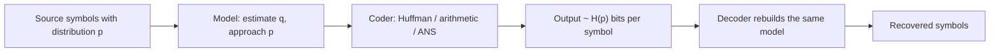
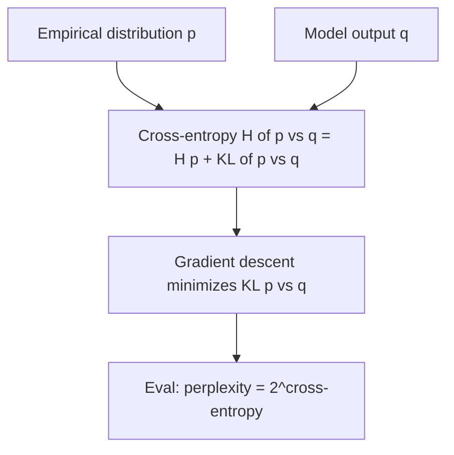

# Information Theory

## Overview

Information theory, founded by Shannon (1948), quantifies information in bits: the **entropy**
of a source is a hard floor on lossless compression, and the **capacity** of a channel is a hard
ceiling on reliable transmission. Both bounds are exact, constructive (codes achieve them), and
show up constantly in engineering interviews — compression pipelines (Huffman, arithmetic,
ANS/Zstandard), channel budgets (Shannon–Hartley in network planning), and machine learning
(cross-entropy loss, perplexity, KL-regularized objectives). This page works the definitions with
numbers you can reproduce on a whiteboard, derives the source-coding limit, compares the three
code families in production use, states Fano's inequality and its lower-bound role, and connects
everything to the loss function you train models with. Coding theory (constructing codes that
reach channel capacity) is the companion page
[Coding Theory](coding-theory.md); probability preliminaries are in
[Probability and Statistics for Programmers](../mathematics/probability-statistics.md).

## 1. Entropy: Definition and Worked Examples

For a discrete random variable \\( X \\) with distribution \\( p(x) \\):

\\[ H(X) = -\sum_{x} p(x) \log_2 p(x) \quad \text{(bits; use } \ln \text{ for nats)} \\]

Entropy is the expected surprise \\( \log_2 (1/p(x)) \\): rare events carry many bits, certain
events carry none. Properties: \\( 0 \le H(X) \le \log_2 |\mathcal{X}| \\), with equality on the
right iff uniform; \\( H(X) \\) depends on the distribution, not on the value names.

**Worked examples** (all values computable by hand with \\( \log_2 x = \ln x / \ln 2 \\)):

- **Fair coin**: \\( H = 1 \\) bit. **Fair die**: \\( H = \log_2 6 \approx 2.585 \\) bits.
- **Biased coin \\( p = 0.99 \\)**:
  \\( H = -0.99\log_2 0.99 - 0.01\log_2 0.01 \approx 0.99(0.0145) + 0.01(6.6439) \approx 0.0808 \\)
  bits. A stream of such coins carries 12× less information than fair coins — the number behind
  "retry storms are cheap to log but busy loops are not".
- **The symbol distribution \\( \{0.4, 0.3, 0.2, 0.1\} \\)**:
  \\( H = 0.4(1.3219) + 0.3(1.7370) + 0.2(2.3219) + 0.1(3.3219) \approx 1.846 \\) bits/symbol —
  this is the running example for section 4.
- **English text**: ~1.0–1.5 bits/char measured by prediction experiments (Shannon, 1951), versus
  4.7 for uniform ASCII — the ~70% headroom every real text compressor exploits.

| Source | Distribution | Entropy (bits) |
|---|---|---|
| Fair coin | 0.5 / 0.5 | 1.0 |
| Fair die | 1/6 each | 2.585 |
| Skewed flag | 0.99 / 0.01 | 0.0808 |
| Symbols \\( a,b,c,d \\) | 0.4 / 0.3 / 0.2 / 0.1 | 1.846 |
| ASCII chars (uniform) | 1/128 each | 7.0 |
| English text (empirical) | — | ~1.0–1.5 per char |

## 2. Joint and Conditional Entropy

Two variables define three quantities, connected by the **chain rule**:

\\[ H(X, Y) = H(X) + H(Y \mid X) = H(Y) + H(X \mid Y), \qquad H(Y \mid X) = -\sum_{x,y} p(x,y)\log_2 p(y \mid x) \\]

\\( H(Y \mid X) \\) is the bits still needed to describe \\( Y \\) once \\( X \\) is known.
Conditioning never increases uncertainty: \\( H(Y \mid X) \le H(Y) \\), with equality iff
independent. Note the asymmetry trap: \\( H(X \mid Y) \ne H(Y \mid X) \\) in general, though
\\( H(X) - H(X\mid Y) = H(Y) - H(Y \mid X) \\) (section 3's mutual information is that shared
quantity).

**Worked example.** Let \\( X \\) be a fair bit, \\( Y = X \oplus Z \\) with \\( Z \\) an
independent fair bit. Then \\( H(X, Y) = 2 \\) (four equally likely pairs), \\( H(Y \mid X) = 1 \\)
(\\( Y \\) is a fresh fair bit given \\( X \\)), \\( H(Y) = 1 \\), and \\( H(X \mid Y) = 1 \\) —
knowing \\( Y \\) tells you nothing about \\( X \\). Contrast \\( Y = X \\): then
\\( H(X, Y) = 1 \\), \\( H(Y \mid X) = 0 \\). Entropy of the pair pinpoints the redundancy: a
compressor given correlated streams can drop \\( Y \\) entirely (deltas, XOR dedup, and
referential encodings are all \\( H(Y \mid X) \\) engineering — see
[Deduplication / CAS](../storage/advanced/dedup-cas.md) for the storage incarnation).

## 3. Mutual Information and KL Divergence

**Mutual information** is the shared information:

\\[ I(X;Y) = H(X) - H(X \mid Y) = H(Y) - H(Y \mid X) = H(X) + H(Y) - H(X,Y) \ge 0. \\]

It is the general dependency detector: zero iff independent, symmetric, and it equals the
reduction in description length. A communication channel with input \\( X \\), output \\( Y \\)
has \\( I(X;Y) \\) bits of signal per use — the quantity capacity maximizes (section 6).

**Worked example (binary symmetric channel, \\( p = 0.1 \\), uniform input).** The output flips
each bit with probability 0.1. \\( H(Y) = 1 \\) (uniform output), and the noise contributes
\\( H(Y \mid X) = H_2(0.1) \approx 0.469 \\) bits, so

\\[ I(X;Y) = 1 - 0.469 = 0.531 \text{ bits per channel use}. \\]

Each transmitted bit delivers 0.531 bits of information — the rest is burned by noise.

**KL divergence** measures the inefficiency of modeling the truth:

\\[ D_{KL}(p \,\|\, q) = \sum_x p(x) \log_2 \frac{p(x)}{q(x)} \ge 0, \quad (= 0 \iff p = q) \\]

Gibbs' inequality: KL is nonnegative and is *not* a metric (asymmetric, no triangle inequality).
It re-enters coding as the redundancy gap: cross-entropy \\( H(p, q) = H(p) + D_{KL}(p\|q) \\)
is the expected length when you encode \\( p \\)-distributed symbols with a code built for
\\( q \\) — the exact quantity minimized by ML training (section 8) and by adaptive models in
section 5.

## 4. The Source Coding Theorem

Shannon's noiseless coding theorem: the expected length \\( L \\) of any uniquely decodable binary
code for i.i.d. symbols from \\( X \\) satisfies \\( L \ge H(X) \\), and codes with
\\( L < H(X) + \varepsilon \\) exist by coding *blocks* of \\( n \\) symbols
(\\( L \to H \\) as \\( n \to \infty \\)). Entropy is not "a good heuristic" — it is a proven
floor, tight in the block limit.

**Worked example on \\( \{a, b, c, d\} = \{0.4, 0.3, 0.2, 0.1\} \\)** (\\( H = 1.846 \\)).
Huffman construction: merge the two smallest repeatedly —
(0.1, 0.2) → 0.3; (0.3, 0.3) → 0.6; (0.4, 0.6) → 1.0. Assign bits down the tree:

| Symbol | p | code | length | p·length |
|---|---|---|---|---|
| a | 0.4 | `0` | 1 | 0.40 |
| b | 0.3 | `10` | 2 | 0.60 |
| c | 0.2 | `110` | 3 | 0.60 |
| d | 0.1 | `111` | 3 | 0.30 |

\\( L = 1.9 \\) bits/symbol vs the \\( H = 1.846 \\) floor: redundancy 0.054 bits. Huffman is
optimal *among symbol-by-symbol prefix codes*, yet can sit up to 1 bit above \\( H \\) (Gallager's
bound: \\( L < H + p_{\max} + 0.086 \\)); block coding (pair symbols → 16-symbol alphabet →
re-run Huffman) closes most of the gap at the cost of table size, which is exactly what
arithmetic/ANS coders automate.

## 5. Huffman vs Arithmetic vs ANS

| | Huffman | Arithmetic / range coding | rANS / tANS |
|---|---|---|---|
| Rate vs \\( H \\) | ≤ \\( H + 1 \\) per symbol; needs blocking | \\( H + O(1/L) \\), \\( L \\) = coded block length | within ~0.001–0.01 of \\( H \\) |
| Granularity | whole bits only | fractions of a bit | whole bits, near-optimal allocation |
| Speed (decode) | table-driven, fastest historically | multiplies/carries per symbol, slower | ~Huffman speed (tANS), SIMD-friendly |
| Adaptive models | rebuild trees, awkward | natural (interval narrows incrementally) | natural for rANS with per-symbol state |
| IP history | free | patent-encumbered until ~2004 | free, recent (Duda 2009–2014) |
| Where you meet it | DEFLATE (zlib, gzip, PNG), JPEG, HTTP/2 HPACK | CABAC (H.264/HEVC), JPEG 2000, bzip2 (MTF+BWT stage) | Zstandard (FSE), LZFSE (Apple), JPEG XL, LZ4+xxHash ecosystem |

The mechanics, briefly: **arithmetic coding** represents the entire message as one real number in
\\( [0,1) \\) — each symbol carves the current interval proportionally to its probability; output
precision tracks \\( -\log_2 p \\) per symbol, so fractional entropies are captured exactly.
**ANS (asymmetric numeral systems)** inverts the same idea into a single-integer state machine:
the state \\( x \\) is pushed/popped with `x = (x / p) << 1 | ...`-style formulas that behave like
arithmetic coding but need no carry propagation; **tANS** precomputes the transition tables
(Huffman-speed, Zstandard's FSE), **rANS** is the streaming interleaved variant (JPEG XL).
Practical rule: DEFLATE-era formats keep Huffman for compatibility; new high-performance formats
(especially byte-aligned ones like Zstandard) ship ANS. A worked micro-example of the interval
view: symbols \\( p = \{0.5, 0.25, 0.25\} \\) for message `bcb`: start [0,1); `b` → [0.5, 0.75);
`c` → [0.6875, 0.75); `b` → [0.6875, 0.71875) — emit binary `0.1011…`, ~2.4 bits for a message
whose \\( H = -(0.5\log_2 0.5 + 2 \times 0.25\log_2 0.25) = 1.5 \\) bits/symbol ⇒ 4.5 bits floor
for length 3 (rounding artifacts dominate at this toy length; real coders emit into a bit
reservoir).

## 6. Channel Capacity and Rate-Distortion

**Channel capacity** is the maximum mutual information over input distributions:

\\[ C = \max_{p(x)} I(X;Y). \\]

Shannon's noisy coding theorem: at any rate \\( R < C \\), codes exist with error probability → 0
(and conversely \\( R > C \\) is impossible). Two formulas carry all interview traffic:

- **BSC(p)** (each bit flipped with probability \\( p \\)): symmetric ⇒ uniform input is optimal,
  \\[ C = 1 - H_2(p) \text{ bits/use}. \quad H_2(0.1) \approx 0.469 \Rightarrow C \approx 0.531; \quad H_2(0.01) \approx 0.0808 \Rightarrow C \approx 0.919. \\]
- **Shannon–Hartley (AWGN)**: \\[ C = B \log_2\!\left(1 + \frac{S}{N}\right) \text{ bits/s}. \\]
  Worked number: \\( B = 1 \\) MHz, SNR = 20 dB ⇒ \\( S/N = 100 \\): \\( C = 10^6 \log_2 101
  \approx 6.66 \\) Mb/s. Doubling bandwidth or +3 dB both buy ~1 Mb/s here — the log is why
  spectrum is precious and power amplifiers hit diminishing returns. LTE/NR link adaptation
  (MCS tables, CQI feedback) is this formula with implementation losses.

**Rate-distortion**: lossy compression replaces \\( H \\) with \\( R(D) \\), the minimum rate to
describe a source within expected distortion \\( D \\). For a Gaussian source with squared error:

\\[ R(D) = \tfrac{1}{2}\log_2 \frac{\sigma^2}{D}, \quad D \le \sigma^2. \\]

Read it as "each added bit halves the mean-squared error" — the 6.02 dB-per-bit rule for
quantizers. JPEG/video quantization tables and speech codecs (16 kbps CELP etc.) are
rate-distortion engineering: \\( R(D) \\) is the floor their codecs chase. The channel side of
this tradeoff — actually achieving \\( C \\) with codes — is
[Coding Theory](coding-theory.md).

## 7. Fano's Inequality and Lower Bounds

**Fano's inequality**: if you guess \\( X \\) from an observation \\( Y \\) and err with
probability \\( P_e \\), then

\\[ H(X \mid Y) \;\le\; H_2(P_e) + P_e \log_2 (|\mathcal{X}| - 1). \\]

It converts *uncertainty* into *error* bounds: if \\( H(X \mid Y) \\) is large, no estimator of
\\( X \\) from \\( Y \\) can be accurate. Standard uses you can cite:

- **Communication/streaming lower bounds**: if a protocol transcript \\( \Pi \\) has
  \\( I(X;\Pi) \\) small, then Bob's error probability \\( P_e \\) obeys
  \\( H(X \mid \Pi) \gtrsim \log_2|\mathcal{X}| \cdot (1 - I/\log_2|\mathcal{X}|) \\), forcing
  \\( P_e \\) toward 1/2 — the information-cost method behind modern DISJ and GHD proofs
  (see [Communication Complexity](communication-complexity.md)).
- **Lower bounds on learning**: with \\( \log_2 M \\) hypotheses and observation \\( Y \\),
  \\( P_e \ge 1 - \frac{I(X;Y) + 1}{\log_2 M} \\) — sample-complexity floors for
  agnostic learning.
- **Perfect secrecy one-liner**: perfect secrecy requires \\( H(K) \ge H(M) \\) — derivable from
  the same chain-rule bookkeeping (Shannon's one-time-pad theorem).

## 8. Entropy in Machine Learning

The training loss *is* information theory:

- **Cross-entropy loss** \\( = H(p, q) = H(p) + D_{KL}(p\|q) \\). With one-hot targets \\( p \\),
  \\( H(p) = 0 \\), so minimizing cross-entropy is exactly minimizing \\( D_{KL}(p\|q) \\): make
  the model's predicted distribution match the empirical one. For a single example with label
  \\( y \\): loss \\( = -\log q_y \\) — the surprise of the correct class under the model.
- **Perplexity** of a language model on test text: \\( 2^{H_{\text{cross}}} \\) — the effective
  vocabulary size the model is choosing among per token. GPT-class models at perplexity ~10 on
  web text are saying "each token is worth ~3.3 bits" — English's ~1.0–1.5 bits/char from
  section 1 is the character-level view of the same quantity.
- **VAE objective**: \\( \log p(x) - D_{KL}(q(z|x)\,\|\,p(z)) \\) — reconstruction plus a KL
  regularizer pulling the posterior to the prior; the KL term is also what makes latent codes
  compressible.
- **Decision trees (ID3/C4.5)** pick splits by information gain \\( = H(Y) - H(Y \mid \text{split}) \\)
  — literally maximizing per-question mutual information.
- **MDL / minimum description length** reframes regularization: total description length = model
  + residuals; the bias-variance tradeoff as a coding tradeoff.

## Interview Questions

1. **Compute the entropy of a source with p = {0.5, 0.25, 0.25} and explain what it bounds.**
   \\( H = 0.5(1) + 0.25(2) + 0.25(2) = 1.5 \\) bits/symbol. It is the proven lower bound on the
   expected length of any lossless code for this source: a symbol-by-symbol prefix code needs
   integer lengths (here Huffman gives 1/2/2 → 1.5, hitting the floor exactly because the
   probabilities are dyadic), and no scheme can beat 1.5 on average over i.i.d. symbols —
   arithmetic/ANS match it; Huffman can overshoot by up to 1 bit for non-dyadic distributions.
2. **Why does Huffman coding fall short of entropy, and how do arithmetic coding and ANS fix it?**
   Huffman assigns whole-bit code lengths, so a symbol with probability 0.9 still costs 1 bit even
   though \\( -\log_2 0.9 \approx 0.15 \\). Arithmetic coding narrows a real interval by each
   symbol's probability, spending \\( -\log_2 p \\) bits on average — fractional bits included;
   ANS reorganizes the same accounting into integer state transitions with Huffman-like speed.
   That is why Zstandard ships tANS and JPEG XL ships rANS, while DEFLATE keeps Huffman for
   legacy and table simplicity.
3. **Derive the capacity of a BSC(p) and give the numbers for p = 0.1.**
   The BSC is symmetric, so the capacity-achieving input is uniform, \\( H(Y) = 1 \\). The output
   given the input is the flip noise, \\( H(Y\mid X) = H_2(p) \\). Hence
   \\( C = 1 - H_2(p) \\): 0.531 bits/use at \\( p = 0.1 \\), 0.919 at \\( p = 0.01 \\). Below
   0.531 bits/use, codes exist with error → 0; above, no code helps — the capacity gap between
   \\( p = 0.1 \\) and \\( p = 0.01 \\) is why every dB of SNR is money.
4. **What does the Shannon–Hartley bound say about your 1 MHz link at 20 dB SNR?**
   \\( C = B\log_2(1 + S/N) = 10^6 \times \log_2 101 \approx 6.66 \\) Mb/s — a hard ceiling for
   any modulation/coding scheme. Practical links run 1–3 dB below it (implementation loss). It
   also quantifies tradeoffs: +3 dB SNR multiplies \\( 1+S/N \\) by ~2 (≈ +1 Mb/s here), and
   doubling bandwidth adds the same at fixed spectral efficiency — the reason 5G chases both
   wider channels and better SINR.
5. **Why is cross-entropy the standard classification loss rather than accuracy or MSE?**
   Cross-entropy with one-hot targets equals \\( D_{KL}(p\|q) \\), so gradient descent directly
   minimizes the information-theoretic mismatch between empirical and predicted distributions;
   gradients \\( (\hat{y} - y) \\) are well-scaled and logs punish confident wrong answers
   (−log q_y → ∞ as q_y → 0), which MSE does not. Accuracy is non-differentiable and ignores
   calibration; MSE on softmax probabilities yields badly-scaled gradients (the classic reason
   softmax+MSE was abandoned). Perplexity on held-out data is exactly 2^cross-entropy — the
   model's effective branching factor.
6. **State Fano's inequality and one lower-bound use.**
   Guessing \\( X \\) from \\( Y \\) with error \\( P_e \\):
   \\( H(X \mid Y) \le H_2(P_e) + P_e \log_2(|\mathcal{X}| - 1) \\). In communication bounds: a
   transcript with small \\( I(X;\Pi) \\) leaves \\( H(X\mid\Pi) \\) large, so \\( P_e \\) must be
   near 1/2 — this is the engine of modern lower bounds for set disjointness and Gap-Hamming,
   which in turn prove streaming memory lower bounds like \\( \Omega(1/\varepsilon^2) \\) for
   distinct counting.

## Key Takeaways

- \\( H(X) = -\sum p \log_2 p \\): fair coin 1 bit, \\( \{0.4,0.3,0.2,0.1\} \\) = 1.846 bits,
  p = 0.99 flag = 0.0808 bits — entropy is the compression floor, not a heuristic.
- Chain rule and \\( I(X;Y) = H(X) - H(X\mid Y) \ge 0 \\): BSC(0.1) with uniform input delivers
  \\( 1 - H_2(0.1) = 0.531 \\) bits per use.
- Source coding theorem: \\( L \ge H \\) always; Huffman ≤ \\( H + 1 \\) per symbol (1.9 vs 1.846
  in the worked example), arithmetic/ANS approach \\( H \\) with fractional-bit accounting.
- ANS (Zstandard FSE, Apple LZFSE, JPEG XL) delivers near-entropy coding at Huffman speed —
  know the three-family tradeoff table.
- Capacity: BSC \\( C = 1 - H_2(p) \\); AWGN \\( C = B\log_2(1 + S/N) \\) — 1 MHz at 20 dB
  ≈ 6.66 Mb/s. Rates above \\( C \\) are physically impossible, not merely hard.
- Gaussian rate-distortion \\( R(D) = \tfrac12\log_2(\sigma^2/D) \\): each bit halves MSE
  (6.02 dB/bit) — the quantization rule of thumb.
- Fano: \\( H(X\mid Y) \le H_2(P_e) + P_e\log_2(|\mathcal{X}|-1) \\) — the bridge from small
  information to unavoidable error, powering DISJ/GHD/streaming lower bounds.
- Cross-entropy loss = KL minimization; perplexity = \\( 2^{H_{\text{cross}}} \\); information
  gain, VAE KL terms, and MDL are the same bookkeeping in disguise.

## References

1. Shannon (1948), *A Mathematical Theory of Communication*, Bell System Technical Journal 27 —
   entropy, source coding, channel capacity.
2. Cover & Thomas, *Elements of Information Theory*, 2nd ed., Wiley — chapters 2–5 (entropy,
   channel capacity), 10 (rate-distortion), 17 (information theory and statistics).
3. MacKay, *Information Theory, Inference, and Learning Algorithms*, Cambridge University Press —
   free online; the bridge from coding to ML — <https://www.inference.org.uk/mackay/itila/>
4. MIT OCW 6.441 *Information Theory* (graduate course; entropy, capacity, Fano applications) —
   <https://ocw.mit.edu>
5. Duda (2009/2013), *Asymmetric Numeral Systems* — the ANS coder family (tANS/rANS), later
   published in Information Processing Letters 113(3).
6. Salomon, *Data Compression: The Complete Reference*, 4th ed., Springer — Huffman, arithmetic,
   and format histories (DEFLATE, JPEG, CABAC).

## Cross-References

- [Coding Theory](./coding-theory.md) — the channel side: Hamming, Reed–Solomon, LDPC, polar
  codes reaching Shannon capacity.
- [Communication Complexity](./communication-complexity.md) — mutual information and Fano as
  lower-bound tools; fingerprinting as compression-flavored protocols.
- [Comparison Sorting Lower Bound](./comparison-sorting-lower-bound.md) — decision-tree
  information-theoretic \\( \Omega(n\log n) \\), the sorting cousin of the \\( L \ge H \\) bound.
- [Probability and Statistics for Programmers](../mathematics/probability-statistics.md) —
  random variables, expectation, and KL divergence prerequisites.
- [HTTP/2 HPACK](../networks/http/hpack.md) and [QPACK](../networks/http/qpack.md) — Huffman
  tables deployed in header compression; production entropy coding on the wire.
- [Cryptographic Hashing](../cryptography/hashing.md) — why min-entropy (not Shannon entropy)
  is the right measure for key-guessing security.
