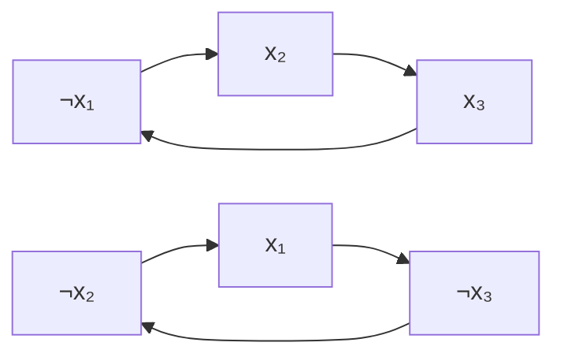
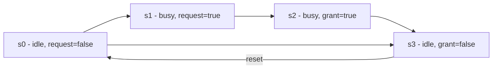

# Logic

## Overview

Logic is the substrate every other tool in this book stands on: Boolean formulas compile to hardware, CNF-SAT drives industrial verifiers, temporal logic specifies protocols, and proof systems certify both algorithms and programs. In interviews, logic appears directly (truth tables, quantifier negation, satisfiability) and indirectly — every correctness argument you make is a proof in propositional or first-order logic. This page covers the two core logics, satisfiability and the 2-SAT algorithm, resolution and DPLL, model checking, and the completeness/compactness theorems.

## Propositional Logic

Propositional logic reasons about atomic statements that are either true or false, combined with connectives.

### Connectives

| Symbol | Name | Meaning |
|---|---|---|
| ∧ | AND | Both true |
| ∨ | OR | At least one true |
| ¬ | NOT | Negation |
| → | Implication | If P then Q |
| ↔ | Biconditional | P if and only if Q |

### Truth Tables

```
P | Q | P∧Q | P∨Q | P→Q | P↔Q | ¬P
T | T |  T  |  T  |  T  |  T  |  F
T | F |  F  |  T  |  F  |  F  |  F
F | T |  F  |  T  |  T  |  F  |  T
F | F |  F  |  F  |  T  |  T  |  T
```

**Key insight**: P→Q is false ONLY when P is true and Q is false.

### Logical Equivalences

| Name | Law |
|---|---|
| De Morgan's | ¬(P∧Q) = ¬P∨¬Q, ¬(P∨Q) = ¬P∧¬Q |
| Double negation | ¬¬P = P |
| Contrapositive | P→Q = ¬Q→¬P |
| Material conditional | P→Q = ¬P∨Q |
| Distributive | P∧(Q∨R) = (P∧Q)∨(P∧R) |
| Absorption | P∨(P∧Q) = P |

### Tautology, Contradiction, Contingency

- **Tautology**: Always true (e.g., P∨¬P)
- **Contradiction**: Always false (e.g., P∧¬P)
- **Contingency**: Sometimes true, sometimes false

## Predicate Logic

### Quantifiers

- **Universal** (∀): "For all x, P(x)" — ∀x P(x)
- **Existential** (∃): "There exists x such that P(x)" — ∃x P(x)

### Negation of Quantifiers

- ¬(∀x P(x)) = ∃x ¬P(x)
- ¬(∃x P(x)) = ∀x ¬P(x)

### Examples

```
∀x∃y (x + y = 0)     — True (every number has an additive inverse)
∃x∀y (x * y = y)     — True (x = 1, the multiplicative identity)
∀x∀y (x + y = y + x) — True (commutativity of addition)
```

## Propositional vs First-Order Logic

| Aspect | Propositional | First-Order (Predicate) |
|---|---|---|
| Atoms | Boolean variables P, Q, ... | Predicates P(x, y) over a domain |
| Quantifiers | None | ∀, ∃ |
| Models | Truth assignments (2ⁿ for n vars) | Domain + interpretation of predicates/functions |
| Satisfiability decision | SAT — NP-complete (Cook–Levin) | Undecidable (Church/Turing); semi-decidable |
| Validity decision | Co-NP-complete (tautology checking) | Undecidable but **recursively enumerable** (complete proof systems exist) |
| Compactness | Trivial (finite) | Holds |
| Expresses | "x₁ OR NOT x₃" | "Every request eventually gets a response" |
| CS home | Circuits, SAT solving, BDDs | Databases (relational calculus), spec languages, Datalog |

The jump from propositional to first-order costs decidability and buys expressiveness. A propositional formula over n variables is decided by checking 2ⁿ assignments — finite. First-order validity ranges over *all* domains, which is why no algorithm decides it; yet Gödel's completeness theorem (1930) gives a sound and complete proof calculus, so validities can be enumerated. First-order logic cannot express transitive closure ("reachable from") — a fact that motivates fixes like Datalog's transitive rules and modal fixpoint logics (see [Datalog and Fixpoint Engines](./datalog-fixpoint-engines.md)).

## SAT and 2-SAT

**SAT**: given a propositional formula (usually CNF — a conjunction of disjunctions), is there a truth assignment making it true? SAT was the first proven NP-complete problem (Cook–Levin, 1971): every NP computation history encodes as a polynomial-size formula. **2-SAT**, where each clause has exactly 2 literals, is in P via the implication graph (Aspvall–Plass–Tarjan, 1979).

### Worked Clause Encoding: 3-Coloring a Triangle

Encoding a combinatorial problem as CNF is an interview skill in itself. To 3-color a triangle with vertices A, B, C and colors {r, g, b}, introduce a variable \\( x_{v,c} \\) meaning "vertex v gets color c".

Constraints — "each vertex has at least one color" (a 3-literal clause per vertex):

```
(xA,r ∨ xA,g ∨ xA,b)    (xB,r ∨ xB,g ∨ xB,b)    (xC,r ∨ xC,g ∨ xC,b)
```

Constraints — "no edge endpoints share a color" (one clause per forbidden pair per edge):

```
(A,B): (¬xA,r ∨ ¬xB,r)  (¬xA,g ∨ ¬xB,g)  (¬xA,b ∨ ¬xB,b)
(B,C): (¬xB,r ∨ ¬xC,r)  (¬xB,g ∨ ¬xC,g)  (¬xB,b ∨ ¬xC,b)
(A,C): (¬xA,r ∨ ¬xC,r)  (¬xA,g ∨ ¬xC,g)  (¬xA,b ∨ ¬xC,b)
```

This formula is satisfiable (color A=r, B=g, C=b), and the clause count is exactly n + 3m for a graph with n vertices and m edges — polynomial, which is the whole point of a Tseitin-style encoding. The same recipe handles "at most one" (pairwise ¬xi ∨ ¬xj), cardinality constraints (sorting networks or totalizers), and "at least k of n" (sequential counters).

### 2-SAT: The Implication Graph

Each 2-clause \\((a \\lor b)\\) is equivalent to the two implications \\( \\lnot a \\to b \\) and \\( \\lnot b \\to a \\): if one literal is false, the other must be true. Build a graph with 2n nodes (each variable in both polarities) and 2m edges; the formula is satisfiable **iff no variable and its negation lie in the same strongly connected component**. A satisfying assignment assigns each variable the polarity whose SCC comes later in the component DAG.

Worked instance: \\( F = (x_1 \\lor x_2) \\land (\\lnot x_2 \\lor x_3) \\land (\\lnot x_3 \\lor \\lnot x_1) \\).



There are two SCCs — {¬x₁, x₂, x₃} and {x₁, ¬x₂, ¬x₃} — and no SCC contains both xᵢ and ¬xᵢ, so F is satisfiable. Picking the later component for each variable gives x₁ = true, x₂ = false, x₃ = false, which checks out against all three clauses. Tarjan's SCC algorithm runs in O(n + m), so 2-SAT is linear time. The same implication-graph trick solves mutual-exclusion scheduling, register allocation with two resources, and dead-end detection in game trees.

## Resolution and DPLL

**Resolution rule**: from clauses \\((A \\lor x)\\) and \\((B \\lor \\lnot x)\\), derive \\((A \\lor B)\\). Resolution is *refutation-complete*: a CNF is unsatisfiable iff repeated resolution derives the empty clause □.

```
Worked refutation of (x) ∧ (¬x ∨ y) ∧ (¬y):
  1. (x)      2. (¬x ∨ y)      3. (¬y)
  resolve 1,2 on x  →  (y)
  resolve (y), 3 on y →  □          ⇒ UNSAT
```

Resolution is sound but can need exponentially many steps: Haken (1985) proved that Tseitin formulas and the pigeonhole principle \\( \\mathrm{PHP}_n \\) require \\( 2^{\\Omega(n)} \\)-size resolution refutations, which is why resolution alone is not a solver. The **Tseitin transformation** introduces one auxiliary variable per subformula to convert any formula into an equi-satisfiable CNF of linear size — the standard front end of every SAT tool.

**DPLL** (Davis–Putnam–Logemann–Loveland, 1962) is backtracking search with two pruning rules:

```python
def dpll(clauses, assignment):
    # Unit propagation: force literals appearing alone in a clause
    while (unit := find_unit(clauses)) is not None:
        assign(unit, assignment)
        clauses = simplify(clauses, unit)
    if [] in clauses:            # empty clause: conflict
        return None
    # Pure literal elimination: literal with no negated occurrence
    for lit in pure_literals(clauses):
        assign(lit, assignment)
        clauses = simplify(clauses, lit)
    if not clauses:
        return assignment        # all clauses satisfied
    var = pick_branching_variable(clauses)   # heuristic choice
    return (dpll(simplify(clauses, var), assignment | {var: True})
            or dpll(simplify(clauses, -var), assignment | {var: False}))
```

Unit propagation is the workhorse: forcing one literal cascades through clauses, often deciding thousands of variables without branching. Modern **CDCL** solvers (GRASP, MiniSat, CaDiCaL) add conflict analysis — when propagation fails, learn a clause explaining the conflict and backtrack non-chronologically — turning DPLL into the engine behind hardware verification, SMT, and cryptographic attacks (see [SAT and SMT Solvers](../formal-methods/sat-smt-solvers.md)).

## Model Checking Basics

**Kripke structure**: a finite state machine \\( M = (S, s_0, R, L) \\) — states S, initial state, transition relation R, and a labeling function L mapping each state to the set of atomic propositions true there. System requirements become temporal-logic formulas over those labels, and model checking decides whether M satisfies φ by exhaustively exploring reachable states.



- **CTL** (Computation Tree Logic): branching-time — quantifiers nest over paths and states, e.g. AG(request → AF grant) = "on all paths, every request is eventually followed by a grant". CTL model checking is linear in \\( |M| \\cdot |\\varphi| \\) by computing fixpoints bottom-up.
- **LTL** (Linear Temporal Logic): path formulas over a single trace, e.g. G(request → F grant). LTL model checking reduces to a product automaton emptiness check (the automata-theoretic method) and is PSPACE-complete in the formula, but automated in tools like SPIN.

The practical obstacle is **state explosion**: 50 Boolean latches yield 2⁵⁰ states. BDD-based symbolic model checking, SAT-based bounded model checking, and partial-order reductions attack this — details in [Model Checking](../formal-methods/model-checking.md), [Temporal Logic](../formal-methods/temporal-logic.md), and [The Modal mu-Calculus](../formal-methods/mu-calculus.md). Clarke, Emerson, and Sifakis received the 2007 Turing Award for model checking; it is a standard step in hardware sign-off at Intel, IBM, and NVIDIA.

## Completeness and Compactness

**Completeness** says syntax matches semantics: a formula is provable (⊢) iff it is valid (⊨) — Gödel's 1930 theorem for first-order logic. Practically it means proof search is a *complete semi-decision procedure* for validity: enumerate proofs, and every valid formula eventually appears (invalid ones never do, which is all that semi-decidability buys). **Compactness** says a (possibly infinite) set of formulas is satisfiable iff every finite subset is. The CS intuition: infinite collections of constraints that are finitely consistent are globally consistent, so a specification that admits no model must already be contradicted by a *finite* fragment — finite witnesses for infinite failure. Compactness powers non-standard model constructions and underlies why some database constraint sets have no finite model. The celebrated limit case: sufficiently expressive *arithmetic* theories (Peano) cannot be both consistent and complete — see [Gödel's Incompleteness Theorems](./godel-incompleteness.md).

## Logic in Computer Science

- **SAT solvers (CDCL)**: conflict-driven clause learning combines implication-graph conflict analysis, learned clauses, and VSIDS-style branching heuristics. Industrial instances with millions of variables are solved routinely — equivalence checking of processor designs, bounded model checking, FPGA routing.
- **Hardware verification**: Kripke-structure model checking verifies protocol properties (arbiter fairness, cache coherence) exhaustively before tape-out; a missed bug costs a multi-million-dollar respin.
- **SMT**: DPLL(T) extends SAT with theory solvers (arithmetic, arrays, bitvectors) — Z3 and cvc5 verify program properties, infer types, and synthesize code.
- **Databases**: relational calculus is first-order logic; SQL's EXIST/FORALL patterns compile to it; Datalog extends with a least-fixpoint semantics ([Datalog and Fixpoint Engines](./datalog-fixpoint-engines.md)).
- **Type systems and proofs**: propositions-as-types identifies proofs with programs ([The Curry–Howard Correspondence](./curry-howard.md)), and Boolean algebra is the two-element case of propositional logic implemented in every ALU ([Boolean Algebra](../arch/digital-logic/boolean.md)).

## Interview Questions

**Q: What is the contrapositive of P→Q?**
A: ¬Q→¬P. It's logically equivalent to the original. Example: "If it rains, the ground is wet" has contrapositive "If the ground is not wet, it did not rain."

**Q: Apply De Morgan's law to ¬(A∧B).**
A: ¬A∨¬B. "It's not true that both A and B" means "either A is false or B is false (or both)."

**Q: What is the difference between ∀ and ∃?**
A: ∀ (for all) requires the property to hold for every element. ∃ (there exists) requires at least one element to satisfy the property. ¬∀xP(x) = ∃x¬P(x).

**Q: How does 2-SAT differ from SAT, and how would you solve 2-SAT?**
A: General SAT is NP-complete, but restricting clauses to 2 literals makes it polynomial — O(n + m) via the implication graph. Each clause (a ∨ b) becomes edges ¬a→b and ¬b→a; compute strongly connected components (Tarjan). The formula is satisfiable iff no variable shares an SCC with its own negation, and assigning each variable the polarity in the later SCC of the component DAG yields a solution. A naive backtracking search would be exponential; the graph structure is what buys linearity.

**Q: Why is resolution refutation-complete but not an efficient decision procedure?**
A: Refutation-complete means some sequence of resolution steps derives the empty clause from any unsatisfiable CNF, so brute-force resolution is a complete prover. But Haken's exponential lower bound (2^Ω(n) for pigeonhole formulas) shows the shortest refutation can be exponential, so completeness says nothing about efficiency. DPLL/CDCL sidesteps the proof-system view with search: unit propagation and learned clauses prune the exponential space in practice without guaranteeing polynomial time (P = NP would be required for that).

**Q: What do CTL and LTL express, and when do you pick each?**
A: LTL reasons along a single execution path — G(request → F grant) — and suits properties of traces: liveness, eventual response. CTL quantifies over the branching tree of executions — AG(request → AF grant) — and suits state-based properties where "all possible futures" matters. They are incomparable in expressiveness (neither subsumes the other); CTL model checking is linear in model × formula, LTL checking is PSPACE-complete in the formula but fine in practice because formulas are small.

**Q: What does compactness of first-order logic mean in practical terms?**
A: An infinite set of constraints has a model iff every finite subset does. So if a specification library is unsatisfiable, some *finite* subset already witnesses the contradiction — failure has finite certificates. Conversely, proving that every finite subset is satisfiable (e.g., via finite approximations) certifies the whole theory is consistent, a trick used in model-theoretic constructions.

## Key Takeaways

- Propositional logic: finite (2ⁿ assignments, SAT is NP-complete); first-order logic: quantified domains (validity undecidable but semi-decidable via completeness).
- P→Q fails only on T→F; contrapositive ¬Q→¬P and material conditional ¬P∨Q are the two rewrites interviewers probe.
- 2-SAT: implication graph + Tarjan SCC, O(n + m); satisfiable iff no x and ¬x share an SCC.
- Resolution: sound and refutation-complete, but exponential-size refutations exist (Haken); Tseitin transformation gives linear-size CNF encodings.
- DPLL = backtracking + unit propagation + pure literals; CDCL adds conflict analysis and clause learning — the core of Z3, MiniSat, CaDiCaL.
- Model checking: Kripke structures + temporal logic; CTL checks branching properties in linear time via fixpoints, LTL via automata products; state explosion is the enemy.
- Completeness: ⊢ = ⊨ (proof search enumerates all validities); compactness: finite consistency ⇒ global consistency.
- Every hardware equivalence check, SMT-backed verifier, and SQL EXIST query is applied logic.

## References

- [Discrete Mathematics — Rosen](https://www.mheducation.com/highered/product/discrete-mathematics-applications-rosen/M9780073383095.html)
- [MIT OCW 6.042J — Mathematics for CS](https://ocw.mit.edu/courses/6-042j-mathematics-for-computer-science-fall-2010/)
- [Introduction to the Theory of Computation — Sipser, 3e (Cengage)](https://www.cengage.com/c/introduction-to-the-theory-of-computation-sipser-3e/)
- Leslie Lamport — *Specifying Systems* (Addison-Wesley, 2002), free PDF: https://lamport.org/tla/book.html — TLA+ specification with temporal logic
- Huth & Ryan — *Logic in Computer Science: Modelling and Reasoning about Systems*, 2nd ed., Cambridge University Press, 2004 (no stable URL; title + venue)
- Aspvall, Plass & Tarjan — "A Linear-Time Algorithm for Testing the Truth of Certain Quantified Boolean Formulas", *Information Processing Letters* 8(3), 1979 (2-SAT implication graph)
- Haken — "The Intractability of Resolution", *Theoretical Computer Science* 39, 1985 (exponential resolution lower bound)
- Clarke, Grumberg & Peled — *Model Checking*, MIT Press, 1999 (title + venue)

## Cross-References

- [Boolean Algebra](../arch/digital-logic/boolean.md) — the two-element realization of propositional logic in hardware
- [Sequential Circuits](../arch/digital-logic/sequential.md) — the Kripke structures of digital logic
- [SAT and SMT Solvers](../formal-methods/sat-smt-solvers.md) — DPLL/CDCL/SMT engineering detail
- [Model Checking](../formal-methods/model-checking.md) — the full verification pipeline this page sketches
- [Temporal Logic](../formal-methods/temporal-logic.md) — CTL/LTL semantics in depth
- [Gödel's Incompleteness Theorems](./godel-incompleteness.md) — why completeness fails for arithmetic
- [Complexity Classes](./complexity-classes.md) — where SAT, TAUTOLOGY, and QBF sit in P/NP/co-NP/PSPACE
- [Computability](./computability.md) — why first-order validity is undecidable
- [The Curry–Howard Correspondence](./curry-howard.md) — proofs as programs
- [Datalog and Fixpoint Engines](./datalog-fixpoint-engines.md) — first-order logic extended with fixpoints for recursion
