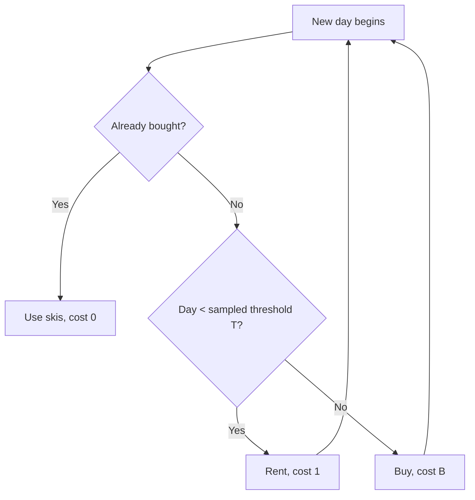
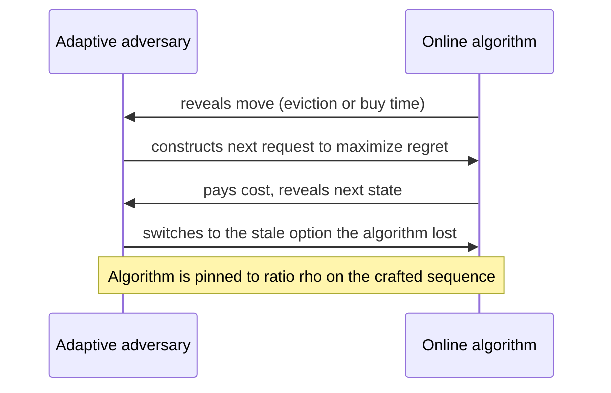

# Online Algorithms

## Overview

An online algorithm must commit to each decision as requests arrive, with no access to the
future, while an offline algorithm sees the whole input before acting. **Competitive
analysis** is the yardstick: bound the online cost by a constant or slowly-growing factor
times the offline optimum on *every* input — a worst-case contract that holds regardless of
how adversarial the future is. The field produces the sharpest examples of what information
is worth: ski rental prices hesitation at \( e/(e-1) \), LRU's \( k \)-competitiveness
explains why caching heuristics survive, and the secretary problem's \( 1/e \) is the
canonical optimal-stopping result. This page covers the theory (ratio definitions, adversary
models, lower-bound machinery); interview drills and pseudocode live in
[Chapter 146](../dsa/chapters/ch146-online-algorithms.md).

## 1. The Competitive Ratio

For a cost-minimization problem, a deterministic online algorithm `A` is **\( \rho \)-competitive**
if for every input sequence \( I \):

\[
\mathrm{cost}_A(I) \le \rho \cdot \mathrm{cost}_{\mathrm{OPT}}(I) + \alpha
\]

where `OPT` is the optimal offline algorithm and \( \alpha \) is a constant (often 0). For
profit-maximization problems the ratio flips: \( \mathrm{profit}_A(I) \ge \rho \cdot \mathrm{OPT}(I) \)
with \( \rho \le 1 \). The ratio is a *multiplicative* guarantee on the worst case — unlike an
average-case or instance-optimal bound, it is driven by the single most pathological input.

**Randomized competitive ratios** require an adversary model, because the meaning of
"expected cost" depends on what the adversary knows:

| Adversary | Knows the algorithm? | Sees random coins? | Strength |
|---|---|---|---|
| Oblivious | Yes | No — fixes input before execution | Weakest (standard model) |
| Adaptive offline | Yes | Yes — but must commit to its own optimal solution in advance | Middle |
| Adaptive online | Yes | Yes — builds the input as it watches the algorithm run | Strongest |

Randomization guarantees are stated against the *oblivious* adversary; against an adaptive
adversary, randomization provably does not help for several problems (paging is the classic
example), so always state which model a claimed ratio lives in.

### Offline vs Online at a Glance

| Aspect | Offline algorithm | Online algorithm |
|---|---|---|
| Input | Fully known at start | Arrives as a request stream |
| Decisions | Deferred, globally optimized | Forced immediately, irrevocable |
| Optimality notion | Exact optimum | Competitive ratio vs optimum |
| Lower-bound tool | NP-hardness reductions | Adversary constructions (Section 6) |
| Typical techniques | DP, LP, flows | Potential functions, doubling, primal-dual |
| Example | Belady's LFD for paging | LRU, FIFO, marking algorithms |

## 2. Ski Rental: Break-Even and Randomization

Rent skis at cost 1 per day, or buy for \( B \) once and ski free. If the season length \( L \)
were known, the optimum is \( \mathrm{OPT} = \min(L, B) \). Online, you must decide each morning
whether to keep renting or buy — the canonical **rent-or-buy** trade-off that reappears as
leasing vs buying servers, throwing hardware at a bottleneck vs engineering it, and TCP
retransmission timers.

### Deterministic Break-Even: 2-Competitive

Rent for exactly \( B \) days, then buy. Case analysis:

- If \( L < B \): you never buy, cost \( = L = \mathrm{OPT} \).
- If \( L \ge B \): you pay \( (B-1) \) rental days plus \( B \) for the skis, so
  \( \mathrm{cost} = 2B - 1 \le 2\,\mathrm{OPT} \).

Hence \( \mathrm{ALG} \le 2 \cdot \mathrm{OPT} \) and the constant is tight: an adversary lets
you rent for \( B - 1 \) days and then ends the season the day *after* any deterministic
algorithm finally buys, forcing ratio \( \to 2 \). No deterministic algorithm beats 2.

```python
# Break-even ski rental, B = 10: worst cases for every threshold.
def ski(threshold, season, B=10):
    return season if season < threshold else (threshold - 1) + B

for L in (5, 9, 10, 30):
    alg = ski(10, L)          # deterministic break-even: buy on day 10
    opt = min(L, 10)
    print(f"season={L:>3}  ALG={alg:>3}  OPT={opt:>3}  ratio={alg/opt:.2f}")
```

```text
season=  5  ALG=  5  OPT=  5  ratio=1.00
season=  9  ALG=  9  OPT=  9  ratio=1.00
season= 10  ALG= 19  OPT= 10  ratio=1.90
season= 30  ALG= 19  OPT= 10  ratio=1.90
```

### Randomized: \( e/(e-1) \approx 1.582 \)-Competitive

Randomization helps. Buy at time \( T \) sampled with CDF
\( F(t) = (e^{t/B} - 1)/(e - 1) \) for \( 0 \le t \le B \) (density \( f(t) = e^{t/B}/(B(e-1)) \)),
i.e. buy almost surely by day \( B \) but with a small chance of buying very early. In units
where \( B = 1 \), the expected cost against a season of length \( L \le 1 \) is:

\[
\mathbb{E}[\mathrm{cost}(L)] = \int_0^L (t+1) f(t)\,dt + L\,(1 - F(L))
= \frac{L e^{L}}{e-1} + L \cdot \frac{e - e^{L}}{e-1} = \frac{e}{e-1}\,L
\]

and for \( L \ge 1 \) the same integration by parts gives
\( \mathbb{E}[\mathrm{cost}(L)] = 1 + \mathbb{E}[T] = 1 + \frac{1}{e-1} = \frac{e}{e-1} \).
The algorithm is pointwise \( \frac{e}{e-1} \)-competitive — the ratio never exceeds
\( 1.582 \) on any season length. Karp (1992) proved this is optimal for randomized ski
rental, so randomization strictly improves 2 → 1.582. The general lesson: sample the
threshold from a distribution whose *tail decays exactly fast enough* to make the worst-case
ratio flat across all scenarios.



## 3. Paging and the k-Server Problem

**Paging**: a cache holds \( k \) pages of a universe of \( n \); a request stream names pages;
a miss forces an eviction. `OPT` is Belady's least-futurely-used (LFD) policy. The results
that every systems engineer should know:

| Algorithm | Type | Competitive ratio | Notes |
|---|---|---|---|
| LRU | Deterministic | \( k \) | Evict least-recently-used; the practical choice |
| FIFO | Deterministic | \( k \) | Simpler state, same guarantee |
| LFWU | Deterministic | \( k \) | Uses the future — an *offline* lower-bound benchmark |
| Marking (HARM) | Randomized | \( 2 H_k \approx 2 \ln k \) | Against oblivious adversary (Fiat et al. 1991) |
| Work function | Deterministic | \( 2k - 1 \) | Optimal for k-server (Koutsoupias–Papadimitriou 1994) |
| Any deterministic | — | \( \ge k \) | Matching lower bound (Sleator–Tarjan 1985) |

Two structural facts matter. First, LRU's \( k \)-competitiveness is *best possible* for
deterministic algorithms — the adversary always keeps a "stale" copy of a page just evicted,
so the algorithm can never be better than a factor \( k \) on some sequence. Second, LRU is
the only \( k \)-competitive policy that is also a good *practical* heuristic: it is
**conservative** (any consecutive \( k+1 \) distinct requests cause at most \( k+1 \) faults
under both LRU and any offline policy), which is why the OS community adopted it long before
the theory was proved. Implementation-level detail on LRU and its variants lives in
[OS: LRU](../os/virtual-memory/lru.md) and [page replacement](../os/virtual-memory/page-replacement.md).

The **k-server problem** generalizes paging: \( k \) mobile servers occupy points of a metric
space; each request is a point that must be covered by moving a server there at cost equal to
the distance traveled. Manasse, McGeoch and Sleator (1990) conjectured a \( k \)-competitive
deterministic algorithm exists for every metric space (paging is the special case where all
distances are 1 and the bound \( k \) is tight). The work function algorithm of
Koutsoupias and Papadimitriou settled it with a \( 2k-1 \)-competitive algorithm: maintain
\( w(S) \), the minimum cost of any configuration ending with servers at set \( S \), and move
the server whose relocation keeps the invariant \( w(S_{\text{alg}}) \le w(S_{\text{adv}}) + 2k-1 \)
intact. The potential-function proof is the template for dozens of online analyses.

## 4. The Secretary Problem: \( 1/e \) Optimal Stopping

Observe \( n \) candidates in random order; after each you must hire or reject irrevocably;
you want to maximize the probability of hiring the single best. The optimal strategy has two
phases: observe (no commitment) the first \( r \) candidates, recording the best seen; then
hire the first candidate better than everyone observed so far. For a fixed threshold \( r \)
the success probability is:

\[
P(\text{success}) = \sum_{i=r+1}^{n} P\!\left(c_i \text{ is best and selected}\right)
= \sum_{i=r+1}^{n} \frac{1}{n} \cdot \frac{r}{i-1}
= \frac{r}{n} \sum_{i=r+1}^{n} \frac{1}{i-1}
\approx \frac{r}{n} \ln\frac{n}{r}
\]

Maximizing \( \frac{r}{n}\ln(n/r) \) over \( r/n = x \) gives \( \ln(1/x) = 1 \), so \( x = 1/e \)
and the success probability is \( 1/e \approx 36.8\% \). Three details interviewers probe:

- **The \( 1/e \) is doubly optimal**: no strategy beats it, and it holds for every \( n \ge 1 \)
  asymptotically — with \( n = 100 \) you already succeed ~37% of the time.
- **Scale invariance**: the proof uses only the assumption that arrival order is uniformly
  random; the payoff distribution is irrelevant. This is what distinguishes it from
  **prophet-inequality** settings where the values are drawn independently and you compare
  against a gambler who sees the future (best ratio \( 1/2 \), Samuel-Cahn).
- **Generalizations that matter**: multiple hires (threshold \( \approx n/\ln k \) for \( k \)
  positions), the \( 1 - 1/e \) optimum for the *online matching* variant below, and
  matroid-secretary results. Applications: hiring pipelines, ad-allocation exploration
  budgets, and "when to stop sampling" questions in system tuning.

## 5. Online Matching and Online Packing/Covering

**Online bipartite matching** (Karp–Vazirani–Vazirani, STOC 1990): vertices on one side
(advertisers) are known; vertices on the other (impressions) arrive one at a time and must be
matched immediately or dropped. Greedy matching achieves only \( 1/2 \); the KVV
**randomized-ranking** algorithm achieves \( 1 - 1/e \approx 0.632 \), and no randomized
algorithm can beat this — the same constant as the secretary problem, not by accident: KVV
reduces to it. This algorithm underwrites display-ad allocation: with \( 1 - 1/e \) of the
value of an offline optimum that knows the whole day's traffic in advance.

**Online set cover and friends**: elements arrive and must be covered immediately by buying
sets at known prices. The primal-dual framework of Buchbinder and Naor unified this area:

- Online set cover: \( O(\log m \log n) \)-competitive for \( n \) sets over \( m \) elements
  (Alon, Awerbuch, Azar, Buchbinder, Naor, STOC 2003) — polylogarithmic, not constant.
- Online packing/covering LP pairs admit \( O(\log n) \)-competitive fractional algorithms;
  the primal solution "grows" as the dual constraints arrive, and the competitive ratio is
  read off the LP duality gap.
- The **fractional-to-integral** gap is the price of online rounding: this is exactly where
  online hardness shows up as a factor-\( \log \) rather than a constant.

| Problem | Offline optimum | Best online ratio | Hardness | Driver |
|---|---|---|---|---|
| Ski rental | \( \min(L, B) \) | \( e/(e-1) \approx 1.582 \) randomized; 2 deterministic | matches | tail-tuned threshold |
| Paging (\( k \) cache) | Belady LFD | \( k \) deterministic; \( 2H_k \) randomized | \( k \) deterministic | stale-copy adversary |
| k-server (metric) | — | \( 2k-1 \) deterministic | \( 2k-1 \) | work functions |
| Secretary | sees all, picks best | \( 1/e \) success | matches | stop after \( n/e \) |
| Online bipartite matching | max matching | \( 1 - 1/e \) randomized | matches | randomized ranking |
| Online set cover | \( \ln n \) greedy | \( O(\log m \log n) \) | \( \Omega(\log m \log n) \) | primal-dual |

## 6. Lower Bound Technique: Adversary Constructions

Online lower bounds are proved by *exhibiting* an adversary, not by reductions alone. The
deterministic template: after each algorithm move, the adversary appends the request that is
worst for the algorithm's current state. For paging, the adversary maintains two candidate
pages — one in the algorithm's cache, one it just evicted — and requests whichever the
algorithm cannot serve cheaply; over a window of \( k+1 \) distinct pages this forces a fault
per request for the algorithm while `OPT` faults once per block. The ski rental lower bound is
the same idea in continuous time: the adversary ends the season one day after the algorithm
buys, or stretches it forever, whichever is worse — the *adaptive* choice is what pins the
ratio at 2.

**Randomized lower bounds** go through **Yao's principle**: if there is a *fixed distribution*
\( \mathcal{D} \) over inputs such that every deterministic algorithm has expected competitive
ratio \( \ge \rho \) on \( \mathcal{D} \), then every randomized algorithm has expected ratio
\( \ge \rho \) against an oblivious adversary. Concretely for ski rental, take the season
length with density \( \propto e^{-L/B} \) at large \( L \); any deterministic threshold
performs poorly on some quantile of this distribution, and optimizing the threshold yields
exactly \( e/(e-1) \). The principle converts "worst case" into "one well-chosen average case"
and is the workhorse behind the \( 1 - 1/e \), \( 2H_k \), and \( \Omega(\log m \log n) \)
lower bounds. Worked adversary exchanges for paging appear in
[Chapter 146](../dsa/chapters/ch146-online-algorithms.md); the same adversary method gives the
\( \Omega(n \log n) \) sorting bound in [comparison sorting](comparison-sorting-lower-bound.md).



## 7. Applications: Caching, Scheduling, Infrastructure

- **Caching at every layer**: CPU caches, OS page cache, Redis/Memcached, and CDN edge nodes
  all run LRU-family policies; the \( k \)-competitive guarantee is a theorem about *any*
  request sequence, which is why it transfers across workloads where average-case models
  fail. When someone asks "why not just use LFU?" the theory answer is that LFU's equivalent
  guarantee requires knowing future frequencies — it is an offline benchmark, not a policy.
- **Load balancing and scheduling**: jobs arrive without knowing future runtimes; Graham's
  list scheduling (assign to least-loaded machine) is \( 2 - 1/m \)-competitive and needs no
  future information, while its offline sibling LPT needs sorted full knowledge. The full
  proof of the \( 2 - 1/m \) bound (average load + largest job anchors) is in
  [Approximation Algorithms, Section 5](approximation-algorithms.md); here the online reading
  is that the same bound holds against an adversary that picks runtimes after seeing your
  placements.
- **Rent-or-buy in infrastructure**: provision vs on-demand cloud capacity, reserving vs
  spot instances, caching vs refetching — each is a ski-rental instance with a measurable
  \( B \), and the break-even rule (buy at \( B \) units of accumulated demand) plus its
  randomized refinement is directly deployable.
- **Ad allocation**: the KVV \( 1 - 1/e \) result is the budget-aware matching engine behind
  modern auction sketching; its integration with pricing is covered in
  [Algorithmic Game Theory](algorithmic-game-theory.md) and the market mechanics in
  [MEV & PBS](../blockchain/mev-pbs.md) for the blockchain analogue.

## Interview Questions

1. **Why is LRU \( k \)-competitive, and why does that matter operationally?**
   LRU evicts the least-recently-used page; on any run, partition the sequence into phases of
   at most \( k \) distinct pages. Within a phase LRU faults at most once per distinct page
   (a page requested after another \( k \) distinct pages must have been evicted, so it was
   requested at least \( k \) steps ago), and OPT faults at least once per phase where LRU
   faults. This gives cost(LRU) ≤ k·OPT. Operationally, it means no request sequence — even a
   malicious one — makes LRU more than a factor \( k \) worse than Belady's clairvoyant
   optimum, which justifies shipping it in kernels and CDNs without workload modeling.

2. **Derive the deterministic 2-competitive ski rental bound and explain why randomization helps.**
   Break-even rents for \( B-1 \) days then buys: if the season is shorter you paid OPT
   exactly; if longer you paid \( 2B-1 \le 2\,\mathrm{OPT} \). No deterministic algorithm does
   better because an adversary ends the season immediately after you buy, and delaying the buy
   longer than \( B \) days loses to buying outright. Randomization helps because the
   adversary can no longer key the sequence to your deterministic threshold: sampling the buy
   time from \( F(t) = (e^{t/B}-1)/(e-1) \) spreads the "moment of regret" across all season
   lengths, achieving \( e/(e-1) \approx 1.582 \), which Karp proved optimal.

3. **State the secretary problem's optimal policy and prove the \( 1/e \).**
   Observe the first \( r \) candidates, then hire the first who beats all observed. If the
   global best lands at position \( i > r \) (probability \( 1/n \)), you win exactly when no
   candidate in positions \( r+1..i-1 \) was a new record (probability \( r/(i-1) \)).
   Summing: \( P = \frac{r}{n}\sum_{i=r+1}^{n}\frac{1}{i-1} \approx \frac{r}{n}\ln(n/r) \).
   Setting \( x = r/n \), maximize \( x\ln(1/x) \): derivative \( \ln(1/x) - 1 = 0 \) gives
   \( x = 1/e \) and \( P = 1/e \approx 36.8\% \).

4. **What is Yao's principle and how does it produce online lower bounds?**
   It says the worst-case ratio of the best randomized algorithm against an oblivious
   adversary equals the best bound achievable by fixing a probability distribution over
   inputs and measuring the best *deterministic* algorithm's expected ratio on it. So to
   lower-bound randomization, you design one distribution where every deterministic strategy
   is bad — e.g. the exponential-tail season-length distribution for ski rental — and read
   off the constant. It converts a min-max over randomized strategies into a single average-
   case argument, which is why it appears behind nearly every randomized competitive bound.

5. **Online bipartite matching: why is greedy 1/2 and KVV 1-1/e?**
   Greedy matches an arriving impression to any available advertiser; an adversary makes the
   greedy choices block two future high-value matches, and the two-for-one charge argument
   caps it at half the optimum. KVV instead assigns each advertiser a random rank up front and
   matches the arriving impression to the available advertiser of *highest rank* — the
   randomization decorrelates greedy choices from the adversary's structure, and the analysis
   (via a random-permutation reduction to the secretary problem) yields \( 1 - 1/e \), which
   is tight.

6. **Your cache is showing high miss rates — what does competitive analysis tell you to try first?**
   Check the workload's *locality radius*: LRU is \( k \)-competitive, so if misses are bad,
   either \( k \) (cache size) is too small relative to the working set, or the request
   sequence genuinely defeats LRU — in which case *every* policy is paying. The theory says
   look at the \( k+1 \)-distinct-page windows (conservativeness) rather than blaming the
   eviction heuristic; switching from LRU to FIFO or CLOCK changes constants, not the
   \( k \) worst-case factor.

## Key Takeaways

- The competitive ratio is a multiplicative worst-case guarantee: \( \mathrm{ALG} \le \rho \cdot
  \mathrm{OPT} + \alpha \) on every input, with \( \alpha \) a constant.
- Randomized ratios are only meaningful against an *oblivious* adversary; adaptive adversaries
  erase randomization's advantage for several problems.
- Ski rental: break-even is 2-competitive deterministically; the optimal randomized threshold
  distribution \( F(t) = (e^{t/B}-1)/(e-1) \) achieves exactly \( e/(e-1) \approx 1.582 \).
- Paging: LRU is \( k \)-competitive and this is optimal for deterministic policies;
  randomized marking reaches \( 2H_k \); the k-server generalization peaks at \( 2k-1 \) via
  work functions.
- Secretary: observe \( n/e \), then take the first record-beater — success probability
  \( 1/e \), optimal.
- KVV online bipartite matching achieves the matching \( 1 - 1/e \); online set cover sits at
  \( \Theta(\log m \log n) \) — polylog gaps are the signature of online packing/covering.
- Lower bounds are adversary constructions; randomized lower bounds route through Yao's
  principle, turning worst-case into one crafted distribution.

## References

1. Borodin & El-Yaniv, *Online Computation and Competitive Analysis*, Cambridge University Press, 1998.
2. Sleator & Tarjan, "Amortized Efficiency of List Update and Paging Rules", Communications of the ACM 28(2), 1985.
3. Karlin, Manasse, McGeoch & Owicki, "Competitive Randomized Algorithms for Non-Uniform Problems", Algorithmica 11(6), 1994.
4. Karp, "On-Line Algorithms Versus Off-Line Algorithms: How Far from the Future?", Pattern Recognition Practice 4, 1992.
5. Fiat, Karp, Luby, McGeoch, Sleator & Young, "Competitive Paging Algorithms", Journal of Algorithms 12(4), 1991.
6. Manasse, McGeoch & Sleator, "Competitive Algorithms for Server Problems", Journal of Algorithms 11(2), 1990.
7. Koutsoupias & Papadimitriou, "On the k-Server Conjecture", Journal of the ACM 42(5), 1995.
8. Karp, Vazirani & Vazirani, "An Optimal Algorithm for On-Line Bipartite Matching", STOC 1990.
9. Alon, Awerbuch, Azar, Buchbinder & Naor, "The Online Set Cover Problem", STOC 2003.
10. Buchbinder & Naor, "The Design of Competitive Online Algorithms via a Primal–Dual Approach", Foundations and Trends in Theoretical Computer Science 4(2-3), 2009.

## Cross-References

- [Chapter 146: Online Algorithms](../dsa/chapters/ch146-online-algorithms.md) — interview drills, pseudocode, and the taxi-driver framing of the same problems.
- [Approximation Algorithms](approximation-algorithms.md) — the offline twin: ratio definitions, list-scheduling proof, and PTAS hierarchy.
- [Complexity Classes](complexity-classes.md) — where offline hardness (P vs NP) comes from, and why it forces online thinking.
- [OS: LRU](../os/virtual-memory/lru.md) — the production implementation of the \( k \)-competitive paging policy.
- [OS: Page Replacement](../os/virtual-memory/page-replacement.md) — CLOCK, working sets, and how LRU approximations are engineered.
- [Comparison Sorting Lower Bound](comparison-sorting-lower-bound.md) — the adversary method applied to a decision-tree bound.
- [Algorithmic Game Theory](algorithmic-game-theory.md) — the strategic-layer sequel: prices of anarchy and auctions.
