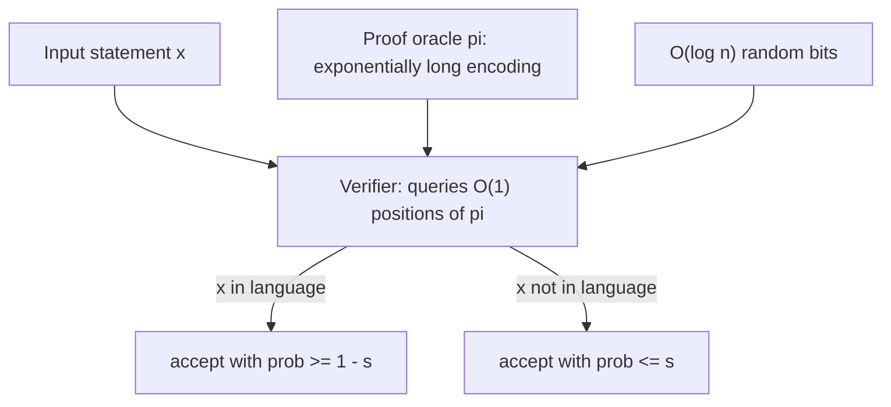
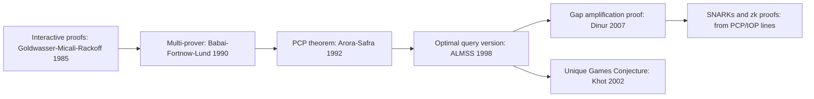

# PCP Theorem and Inapproximability

## Overview

The **PCP (Probabilistically Checkable Proofs) theorem** restates NP in terms of proof *spot-checking*: every NP statement has a proof encoded so that a randomized verifier can decide acceptance by reading a **constant number of bits**, with logarithmic randomness. This seemingly innocuous reformulation is the engine of hardness of approximation: it converts a constant gap between accepting and rejecting proofs into constant (and growing) gaps between satisfiable and near-satisfiable constraint systems, which reductions then propagate to concrete problems. Its direct consequence is a map of **approximation ceilings** — Max-3SAT cannot be approximated beyond 7/8, Set Cover beyond \\( \ln n \\), Clique beyond \\( n^{1-\varepsilon} \\) — telling practitioners exactly where polynomial-time approximation stops paying. This page states the theorem, dissects the verifier, walks the gap-reduction template, tabulates the inapproximability landmarks, and explains the Unique Games Conjecture's role; the algorithmic side of that map lives in [Approximation Algorithms](approximation-algorithms.md).

## 1. Proof Verification Before and After PCP

Classically, \\( \mathrm{NP} \\) is defined by verifiers that read the **entire** polynomial-size proof: SAT is in NP because a full satisfying assignment can be checked line by line. A **PCP verifier** weakens the reader and strengthens the encoding: given a claimed theorem \\( x \\), it gets oracle access to a proof string \\( \pi \\) (exponentially long in principle), tosses \\( r(n) \\) random coins, reads \\( q(n) \\) proof *bits* at adversarially chosen positions, and accepts or rejects. The notation \\( \mathrm{PCP}(r(n), q(n)) \\) names the class of languages admitting verifiers with \\( O(r(n)) \\) randomness and \\( O(q(n)) \\) queries, with

- **completeness** \\( c \\): if \\( x \\) is in the language, some proof makes the verifier accept with probability \\( \ge c \\);
- **soundness** \\( s \\): if \\( x \\) is not, *every* proof is accepted with probability \\( \le s \\).

The gap \\( c - s > 0 \\) is the entire point: a constant gap in acceptance probability is a constant factor of verifiable structure. Ordinary NP is the degenerate case \\( \mathrm{PCP}(0, \mathrm{poly}(n)) \\) — no randomness, read everything. PCP theory asks how far both resources can shrink while keeping the gap constant; the answer is the theorem below.

The budget evolution, from classical verification to deployed succinct proofs:

| Verification model | Randomness | Queries | Note |
|---|---|---|---|
| Classical NP verifier | 0 | \\( \mathrm{poly}(n) \\) (whole proof) | read everything, no gap |
| PCP theorem (ALMSS) | \\( O(\log n) \\) | \\( O(1) \\) | constant completeness-soundness gap |
| Dinur's amplification | \\( O(\log n) \\) | \\( O(1) \\), larger constants | combinatorial, modular proof |
| IOP / SNARK verifiers | \\( O(\log n) \\)-ish | polylog field elements | deployed succinct certification |



## 2. The PCP Theorem

> **PCP theorem** (Arora–Safra 1992; Arora, Lund, Motwani, Sudan, Szegedy 1998):
> \\[ \mathrm{NP} \;=\; \mathrm{PCP}\big(O(\log n),\; O(1)\big). \\]
> Every NP language has a verifier using logarithmic randomness and **constant** queries, with completeness 1 and soundness at most \\( 1/2 \\) (any \\( s < 1 \\) works after amplification).

Three readings, all interview-worthy:

- **Structural**: NP proofs can be re-encoded so that correctness is *locally* testable — a constant number of positions of the encoded proof suffice to catch any false claim with constant probability. Wrong proofs must be inconsistent in a detectable fraction of locations.
- **Quantitative**: the constants are genuinely constant but not small in explicit constructions; early versions needed thousands of queries, and modern constructions (via composition and Dinur's amplification) still use hundreds. The theorem's force is in \\( O(1) \\), not in the constant's value.
- **Computational**: \\( O(\log n) \\) randomness means only polynomially many verifier runs (random strings) exist — which is what makes the encoding-to-constraints reduction in Section 4 polynomial-time. With \\( O(1) \\) queries, each run inspects a constant-size constraint.

The original proof was a two-hundred-page composition of arithmetization, low-degree testing, and sum-check protocols. **Dinur (2007)** recast it as **gap amplification**: start with a PCP of *imperfect* soundness and repeatedly apply expander-walk "amplification plus consistency" steps, each squaring the soundness error while keeping size and queries controlled — a combinatorial, decentralized proof that also produced new PCP variants used elsewhere. The same amplification philosophy underlies parallel repetition theorems (Raz) used to shrink soundness in gap products.

### Why \\( O(\log n) \\) Randomness Is the Right Budget

The randomness bound is not cosmetic — it is what makes reductions polynomial. A verifier with \\( R \\) random bits has \\( 2^R \\) possible executions; the gap reduction of Section 4 emits one constraint per execution, so \\( R = O(\log n) \\) yields \\( \mathrm{poly}(n) \\) constraints while \\( R = \Theta(n) \\) would emit exponentially many and \\( R = O(1) \\) would leave nothing to verify (a constant number of executions over a constant-size proof claim). Any soundness target \\( s \\) is then reachable from a weaker verifier by independent repetition — \\( k \\) parallel runs cost \\( k \cdot R \\) randomness and \\( k \cdot q \\) queries, error \\( s^k \\) — the same amplification arithmetic as Monte Carlo algorithms, traded off inside the PCP budget.

## 3. Anatomy of a Verifier and Where the Hardness Comes From

A concrete mental model of the ALMSS-style construction: the proof \\( \pi \\) is organized as tables encoding (a) an alleged satisfying assignment, written in an error-correcting low-degree polynomial code, and (b) consistency checks derived from the computation the verifier wants to audit (arithmetization turns circuit evaluation into polynomial identities; the sum-check protocol verifies them with few queries). The verifier picks a random constraint, queries the constant number of oracle positions that constraint involves, and accepts iff the local check passes. Local testability is a property of the *encoding*: any globally false claim (an unsatisfiable assignment claim) must corrupt a constant fraction of every possible encoding, so some constant fraction of local checks fail.

The historical pipeline that produced the theorem, and the frontiers it opened:



Two details worth internalizing for interviews. First, PCP verifiers are **proofs of work, not proofs of knowledge**: they certify that *some* accepting oracle exists, not that the prover holds a witness. Second, the verifier's query positions depend on randomness the prover cannot see; this is exactly the derandomization-adjacent question of how much true randomness verification needs, connecting to [Randomized Algorithms](randomized-algorithms.md) and the amplification-by-repetition idiom used throughout Monte Carlo analysis.

### Composition: How \\( O(1) \\) Queries Are Actually Achieved

One verifier rarely does everything at once; the theorem's proof **composes** two verifiers. The *outer* verifier makes few queries but can only check relations between encoded values; the *inner* verifier certifies those relations (polynomial identities) using low-degree tests and the sum-check protocol, each an \\( O(1) \\)-query audit of a constant-size claim. Query complexities multiply (\\( q_{\text{out}} \cdot q_{\text{in}} \\) — constant times constant), randomness adds, and soundness gaps multiply — all three operations preserve the \\( \mathrm{PCP}(O(\log n), O(1)) \\) regime. The algebraic machinery involved (arithmetization, low-degree extension, sum-check) is exactly what later evolved into interactive proofs and SNARK proving systems, which is why the PCP literature is the recommended deep background for modern zk engineering.

## 4. Gap Problems and the Gap-Reduction Template

A **gap problem** is an optimization promise problem: given instance \\( I \\) and threshold \\( t \\), distinguish

\\[ \mathrm{OPT}(I) = a \quad\text{(the "yes" side)} \qquad\text{from}\qquad \mathrm{OPT}(I) \le b \quad\text{(the "no" side)}, \qquad \rho = a/b > 1. \\]

GAP-3SAT, the canonical example: distinguish fully satisfiable 3-CNF formulas from those where at most a \\( (7/8 + \varepsilon) \\)-fraction of clauses can be simultaneously satisfied. An \\( \alpha \\)-approximation algorithm for the underlying optimization problem decides the gap problem whenever \\( \alpha < \rho \\): run it, compare the objective to the threshold. Hence:

```text
  L (any NP language) --PCP verifier--> GAP-3SAT gap (1 vs 7/8 + eps)
  if an approximation better than the gap existed for Max-3SAT,
  running it on the constructed instance decides L  =>  P = NP.
```

The reduction from the PCP theorem to GAP-3SAT is a *counting* argument, worth being able to sketch:

1. Fix input \\( x \\) of length \\( n \\) and its PCP verifier with \\( R = O(\log n) \\) random bits and \\( q = O(1) \\) queries. There are only \\( 2^R = \mathrm{poly}(n) \\) random strings.
2. Build a 3-CNF formula with one clause per random string, encoding the predicate "the verifier's local check on this random string passes": the clause's variables are the (constantly many) proof bits that string queries. Total clauses: \\( \mathrm{poly}(n) \\), constant size each — polynomial time overall, courtesy of \\( R = O(\log n) \\).
3. If \\( x \\in L \\): a valid PCP proof satisfies **every** clause — the formula is satisfiable.
4. If \\( x \notin L \\): any proof is rejected with probability \\( \ge s \\), so **at most** a \\( 1 - s \\)-fraction of clauses can be satisfied by any assignment. With amplified soundness (repeated independent verifier runs, the standard Monte Carlo amplification), \\( s \\) approaches \\( 1 - 7/8 - \varepsilon \\), giving the \\( 7/8 + \varepsilon \\) no-side bound.

Note the elegant role reversal: 3SAT is satisfied by a \\( 7/8 \\) fraction of clauses *trivially* (assign each clause's variables independently and greedily, every clause has 7 satisfying local patterns), so hardness lives in the sliver between \\( 7/8 \\) and 1 — the theorem shows even that sliver is NP-hard to cross. The same template with different verifier predicates and gadgets yields the whole landmarks table of Section 5; keeping the reduction *gap-preserving* (no blowup of the constant) is the technical heart of every such proof.

### The FGLSS Graph: From Gap-3SAT to Clique

The **FGLSS construction** (Feige-Goldwasser-Lovasz-Safra-Szegedy) turns a verifier into a *graph*: one vertex per accepting local view — a random string \\( r \\) together with the proof bits \\( \pi \\) restricted to the positions it queries, such that the verifier accepts — with edges between views that agree on shared proof positions. If \\( x \\in L \\), a valid proof yields a clique of size \\( R = \mathrm{poly}(n) \\) (one consistent view per random string). If \\( x \notin L \\), any set of mutually consistent views can pass checks on at most a \\( (1-s) \\)-fraction of random strings, bounding the maximum clique by \\( (1-s)\cdot\mathrm{poly}(n) \\) — a constant-factor gap on a polynomial-size graph. Graph *products* amplify that constant gap multiplicatively, and the endpoint — after Håstad's optimizations and Zuckerman's amplifier — is the \\( n^{1-\varepsilon} \\) Clique hardness in the landmarks table: arguably the strongest consequence of the PCP theorem for a single natural problem.

### Why 7/8 Is the Floor, Stated Precisely

For a 3-clause with three distinct literals, exactly 7 of the \\( 2^3 = 8 \\) local assignments satisfy it, so a uniformly random assignment satisfies any given clause with probability \\( 7/8 \\); linearity of expectation over \\( m \\) clauses gives \\( \mathbb{E}[\text{satisfied}] = 7m/8 \\) for *every* formula, satisfiable or not. The algorithmic content of this observation is one line of code — sample uniformly — which is why the approximation ratio \\( 7/8 \\) is called trivial. Håstad's theorem states that improving on it by any \\( \varepsilon > 0 \\), even adaptively and even knowing the formula's structure, is NP-hard: the PCP verifier behind the result is engineered so that its local acceptance predicate has exactly this bias, which is the sense in which the verifier's constants *are* the hardness constants.

## 5. Inapproximability Landmarks

The table every approximation-theory interview expects. "Hardness" column states the assumption under which no polynomial-time algorithm achieves better than the listed ratio.

| Problem | Approximation achieved | Hardness ceiling | Assumption | Result |
|---|---|---|---|---|
| Max-3SAT | \\( 7/8 + \varepsilon \\) (random assignment) | \\( 7/8 + \varepsilon \\) for all \\( \varepsilon > 0 \\) | P \\( \ne \\) NP | Håstad 2001 |
| Max-Cut | \\( 0.8786 \\) (Goemans–Williamson SDP) | \\( 16/17 \approx 0.9412 + \varepsilon \\) | UGC (KKMO) | Håstad 2001 / Khot–Kindler–Mossel–O'Donnell |
| Set Cover | \\( H_n \approx \ln n \\) (greedy) | \\( (1 - \varepsilon)\ln n \\) | P \\( \ne \\) NP (via NP \\( \subseteq \) DTIME\\( (n^{O(\log\log n)}) \\)) | Feige 1998 |
| Maximum Clique | \\( n^{1-\varepsilon} \\) trivial (largest vertex) | \\( n^{1-\varepsilon} \\) for all \\( \varepsilon > 0 \\) | P \\( \ne \\) NP | Zuckerman 2006 (after Håstad 1996) |
| Chromatic number | \\( n^{1-\varepsilon} \\)-hard territory | \\( n^{1-\varepsilon} \\) | P \\( \ne \\) NP | Zuckerman 2006 |
| Vertex Cover | \\( 2 - O(1/\sqrt{\log n}) \\) | \\( 1.3606 \\) | P \\( \ne \\) NP | Dinur–Safra 2005 |
| Vertex Cover | — | \\( 2 - \varepsilon \\) | UGC | Khot–Regev 2008 |
| Metric TSP | \\( 1.5 \\) (Christofides) | constant \\( > 1 \\); no PTAS | P \\( \ne \\) NP | Engebretsen 2000 and successors |
| TSP (non-metric) | none | no \\( \rho(n) \\) at all | P \\( \ne \\) NP | Sahni–Gonzalez 1976 |

Reading the table like a practitioner:

- **Matched pairs** are the interesting rows: Set Cover's greedy \\( \ln n \\) is exactly the ceiling — the algorithm is *the* answer, and no cleverer polynomial method exists unless complexity collapses. Max-3SAT's random assignment meets its ceiling too. When algorithm and hardness coincide, stop searching and start engineering ([Approximation Algorithms](approximation-algorithms.md), sections 4 and 8).
- **Open gaps** are the research frontier rows: Vertex Cover (2 achieved, 1.3606 hard), Max-Cut (0.8786 vs 0.9412), metric TSP (1.5 vs a small constant). The gap between the two columns is precisely what the Unique Games Conjecture claims to close (Section 7).
- **Clique's total collapse** — no \\( n^{1-\varepsilon} \\) approximation, i.e. not even within a factor \\( n^{0.99} \\) — is the strongest known P≠NP hardness for a natural problem, and a standard answer to "is NP-hardness always quantitatively mild?"
- The conditional column matters: Feige's Set Cover hardness needs the slightly stronger assumption \\( \mathrm{NP} \not\subseteq \mathrm{DTIME}(n^{O(\log\log n)}) \\); UGC rows rest on an unproven (and contested) conjecture. Always state which assumption a hardness result uses — that precision is itself a signal of depth.

## 6. Amplification: Turning Weak PCPs into Strong Ones

The PCP theorem is often *used* through its amplification structure rather than its monolithic statement. Dinur's proof isolates the engine: view a PCP instance as a **constraint graph** — vertices are proof positions, edges are local constraints over an alphabet \\( \Sigma \\) — and repeatedly apply a gap-amplification step that composes the instance with an expander walk: each constraint is replaced by the conjunction of all constraints along a random short walk. Soundness error squares (roughly \\( 1-\beta \to (1-\beta)^2 \\)) while the graph grows only by a constant factor; \\( O(\log n) \\) iterations take soundness from \\( 1 - 1/\mathrm{poly}(n) \\) down to a constant, with alphabet reduction handled by a separate reduction step. Three properties made this proof famous: it is combinatorial (no arithmetization), each step is independent and locally analyzable, and it packages alphabet reduction as a reusable subroutine. The same template — square the gap, control the size — is what practitioners reach for whenever a weak gap must be strengthened before a final reduction.

## 7. The Unique Games Conjecture

Khot (2002) conjectured that a specific gap problem — **Unique Label Cover**, where every constraint relates two variables' labels by a bijection, so each violated constraint has exactly two "guilty" labels — is hard: distinguishing instances where a \\( (1 - \varepsilon) \\)-fraction of constraints is satisfiable from instances where at most an \\( \varepsilon \\)-fraction is, is NP-hard for every \\( \varepsilon > 0 \\). "Unique" refers to that bijection structure; the conjecture's power is that it yields *tight* hardness for constraint-satisfaction problems, matching algorithmic upper bounds almost everywhere:

- Vertex Cover hard to approximate within \\( 2 - \varepsilon \\) (Khot–Regev 2008) — meeting the trivial matching-based 2 upper bound.
- Max-Cut hard beyond \\( 16/17 \\) (Khot–Kindler–Mossel–O'Donnell 2007) — meeting Goemans–Williamson's 0.8786 = 16/17·... exactly the SDP constant; the matching is the celebrated "UGC is tight for Max-Cut" theorem.
- Hardness of coloring, ordering CSPs, and scheduling problems whose P≠NP hardness is unknown or weak.

Status, honestly stated: the conjecture is **unproven and unrefuted**. Evidence cuts both ways — subexponential algorithms for unique games (Barak et al., showing hardness cannot extend below \\( 2^{O(\sqrt{\log n})} \\) time), and arithmetic/algorithmic progress on special cases — so the responsible citation style is "hard under UGC", never "NP-hard". For a systems engineer the UGC functions as a second, independent axis of hardness: results can be organized as "unconditional, P≠NP-hard, UGC-hard", a taxonomy worth reproducing on a whiteboard.

Status in one paragraph: the conjecture is unproven, and its strongest forms are constrained — unique games admit subexponential-time algorithms (via Arora-Barak-Steurer), so UGC-hardness cannot be extended to statements about exponential hardness without contradiction. Dictator testing on Boolean functions is the technical heart of every UGC-based hardness proof, which is why the conjecture also seeded the modern analysis-of-Boolean-functions toolkit (majority-is-stablest, the KKMO Max-Cut analysis).

| Problem | Best algorithmic upper bound | UGC hardness | Status of the gap |
|---|---|---|---|
| Vertex Cover | \\( 2 - O(1/\sqrt{\log n}) \\) | \\( 2 - \varepsilon \\) | essentially closed by UGC |
| Max-Cut | \\( 0.8786 \\) (Goemans-Williamson SDP) | \\( 16/17 \approx 0.9412 \\) | closed under UGC (KKMO) |
| Max-3SAT (assignment) | \\( 7/8 + \varepsilon \\) | \\( 7/8 + \varepsilon \\) | closed under P \\( \ne \\) NP |
| Ordering CSPs (MMS) | \\( O(\log n/\log\log n) \\)-type | \\( \Omega(\log n) \\)-type | active area |

## 8. What the Ceilings Mean for Practitioners

PCP theory converts "this problem is NP-hard" from a statement about exactness into a statement about *closeness*: for Max-3SAT, Set Cover, and Clique, the era of "someone will find a better approximation" is provably over. The engineering consequences:

- **Pick algorithms at the ceiling.** For Set Cover-scale coverage problems, greedy \\( \ln n \\) is optimal; effort belongs in instance structure (geometry, planarity, bounded frequencies) where ratios *do* improve, not in beating \\( \ln n \\) in general.
- **Price the gap before building.** If a business decision needs a 1.1-factor and the problem is Vertex Cover-like, theory says plan for approximation 2 or exploit structure — the 1.3606 result is the formal reason no generic 1.2-factor exists.
- **Heuristics need baselines.** Measure ML/heuristic pipelines against the guaranteed approximation; the guarantee is a constant you can cite, the heuristic score is not (the standard argument from [Approximation Algorithms](approximation-algorithms.md), section 8).
- **PCP → cryptography.** The verifier-oracle view of proofs, refined through interactive oracle proofs (IOPs), is the direct ancestor of modern **SNARKs**: succinct, spot-checkable certificates for computations — the same "read a few positions of an encoded proof" architecture deployed in zk systems ([zk-SNARKs](../cryptography/zk-proofs.md)). A concept born to prove hardness became an efficiency technology.
- **Structure is the escape hatch.** Ceilings describe worst-case general instances: planar Max-Cut is solvable *exactly* (planar duality reduces it to matching), and bounded-occurrence or geometric variants of CSPs admit better ratios. When a ceiling blocks a project, the leverage is usually in the instance class, not the algorithm class.

## Interview Questions

1. **State the PCP theorem and explain both parameters.**
   \\( \mathrm{NP} = \mathrm{PCP}(O(\log n), O(1)) \\): every NP statement has a proof encoding that a randomized verifier can audit with logarithmic randomness and constant queries, accepting correct proofs always and rejecting false claims with constant probability (soundness < 1, amplifiable to < 1/2). \\( O(\log n) \\) randomness keeps the number of random strings polynomial — essential for building polynomial-size gap instances in reductions; \\( O(1) \\) queries make each check a constant-size constraint.
2. **How does the theorem give hardness of approximation? Sketch the reduction.**
   From a PCP verifier with \\( R = O(\log n) \\) randomness and \\( q = O(1) \\) queries, build one constraint (clause) per random string over the queried proof bits. Polynomial size follows from \\( 2^R = \mathrm{poly}(n) \\). Yes-instances are fully satisfiable; no-instances satisfy at most a \\( (1-s) \\)-fraction since every proof fails a constant fraction of checks. Any approximation algorithm beating that gap would distinguish the two cases and decide an NP language. Amplification of soundness (independent repetition) tunes the gap to the 7/8 Max-3SAT constant.
3. **Why is Max-3SAT hard at 7/8 when a random assignment achieves it?**
   Because every 3-clause is satisfied by 7 of its 8 possible local assignments, a uniformly random assignment already satisfies \\( 7/8 \\) of any formula in expectation — that is the trivial algorithm. Håstad's PCP-based result says that going even \\( \varepsilon \\) above \\( 7/8 \\) for all formulas is NP-hard: all the difficulty lives in the last \\( 1/8 \\) of the value range, and no polynomial algorithm can reliably harvest it.
4. **Compare the hardness assumptions behind the Set Cover and Vertex Cover results.**
   Feige (1998): Set Cover has no \\( (1-\varepsilon)\ln n \\) approximation unless \\( \mathrm{NP} \subseteq \mathrm{DTIME}(n^{O(\log\log n)}) \\) — a quasi-polynomial-time assumption, slightly stronger than P≠NP, and the best known form of that result. Dinur–Safra (2005): Vertex Cover hard below 1.3606 under plain P≠NP; hard below \\( 2 - \varepsilon \\) under the Unique Games Conjecture (Khot–Regev). Stating the assumption is part of the answer — P≠NP-hardness and UGC-hardness are different currencies.
5. **What does the Unique Games Conjecture add that P≠NP does not?**
   Tightness. P≠NP hardness results leave gaps (Vertex Cover: ≤ 2 − o(1) algorithms vs 1.3606 hardness); UGC-based results match known upper bounds (VC hard at \\( 2 - \varepsilon \\); Max-Cut hard at \\( 16/17 \\), exactly the Goemans–Williamson constant). UGC is unproven — subexponential algorithms rule out its strongest forms — so UGC-hard results must be labeled conditionally, but they define the de facto map of CSP approximability.
6. **Name one way PCP ideas show up outside hardness of approximation.**
   Succinct proof systems: SNARKs and other zk proof systems are built on PCP/IOP lines — an encoded proof (polynomial commitments) that a verifier spot-checks with a handful of queries to certify a long computation. The same local-testability versus query-complexity trade-offs PCP theory mapped are the design space of deployed cryptographic verifiers.

## Key Takeaways

- \\( \mathrm{NP} = \mathrm{PCP}(O(\log n), O(1)) \\): NP proofs can be encoded so constant spot-checks catch false claims with constant probability — verification decoupled from proof length.
- The gap \\( c - s \\) in verifier acceptance is the atom of hardness: it becomes a satisfiability gap via one-clause-per-random-string reductions, in polynomial time precisely because randomness is \\( O(\log n) \\).
- Landmark ceilings: Max-3SAT \\( 7/8 + \varepsilon \\) (Håstad), Set Cover \\( (1-\varepsilon)\ln n \\) (Feige), Clique and Chromatic number \\( n^{1-\varepsilon} \\) (Zuckerman), Vertex Cover 1.3606 (Dinur–Safra) and \\( 2-\varepsilon \\) under UGC.
- Matched algorithm/hardness pairs (Set Cover \\( \ln n \\), Max-3SAT \\( 7/8 \\)) mark solved approximation landscapes; unmatched pairs (Vertex Cover, Max-Cut, metric TSP) are the open frontier.
- UGC (Khot 2002) supplies tight conditional hardness for CSPs; always label results by assumption: unconditional vs P≠NP-hard vs UGC-hard.
- Dinur's gap amplification (2007) made the theorem combinatorial and portable, and PCP-lineage ideas underpin modern SNARK proof systems.
- For practitioners: ceilings tell you where to stop improving general algorithms and where to exploit instance structure instead.

## References

1. Arora, Lund, Motwani, Sudan & Szegedy (1998), *Proof Verification and the Hardness of Approximation Problems*, J. ACM 45(3) — <https://doi.org/10.1145/273865.273901>
2. Arora & Safra (1998), *Probabilistic Checking of Proofs: A New Characterization of NP*, J. ACM 45(1):70–122 (the 1992 PCP theorem paper).
3. Dinur (2007), *The PCP Theorem by Gap Amplification*, J. ACM 54(3), article 12 (STOC 2006).
4. Håstad (2001), *Some Optimal Inapproximability Results*, J. ACM 48(4):798–859 (Max-3SAT 7/8, Max-Cut 16/17).
5. Feige (1998), *A Threshold of ln n for Approximating Set Cover*, J. ACM 45(4) — <https://doi.org/10.1145/285055.285059>
6. Zuckerman (2006), *Linear Degree Extractors and the Inapproximability of Max Clique and Chromatic Number*, STOC 2006 (journal: Theory of Computing 3, 2007).
7. Khot (2002), *On the Power of Unique 2-Prover 1-Round Games*, STOC 2002 — the Unique Games Conjecture.
8. Dinur & Safra (2005), *On the Hardness of Approximating Minimum Vertex Cover*, Annals of Mathematics 162(1).
9. Vazirani, *Approximation Algorithms*, Springer (chapters on hardness and gap reductions) — <https://link.springer.com/book/10.1007/3-540-29112-1>
10. Williamson & Shmoys, *The Design of Approximation Algorithms*, Cambridge UP (chapter 16: hardness) — <https://www.cambridge.org/core/books/design-of-approximation-algorithms/88E0AEAEFF2382681A103EEA572B83C6>
11. Arora & Barak, *Computational Complexity: A Modern Approach* (chapter 11: PCP) — <http://theory.cs.princeton.edu/complexity/>
12. MIT OpenCourseWare, *6.045J Automata, Computability, and Complexity* — <https://ocw.mit.edu>

## Cross-References

- [Approximation Algorithms](./approximation-algorithms.md) — the algorithmic half of this map: PTAS/FPTAS hierarchy, greedy Set Cover, and the hardness table this page derives.
- [Complexity Classes](./complexity-classes.md) — NP, verifiers, and where PCP sits in the verification landscape.
- [Randomized Algorithms](./randomized-algorithms.md) — amplification by repetition and the Monte Carlo idiom reused in PCP soundness amplification.
- [zk-SNARKs](../cryptography/zk-proofs.md) — PCP/IOP descendants as deployed succinct proof systems.
- [Chapter 145: Approximation Algorithms](../dsa/chapters/ch145-approximation-algorithms.md) — implementation drills for the approximable side of the ceilings above.
