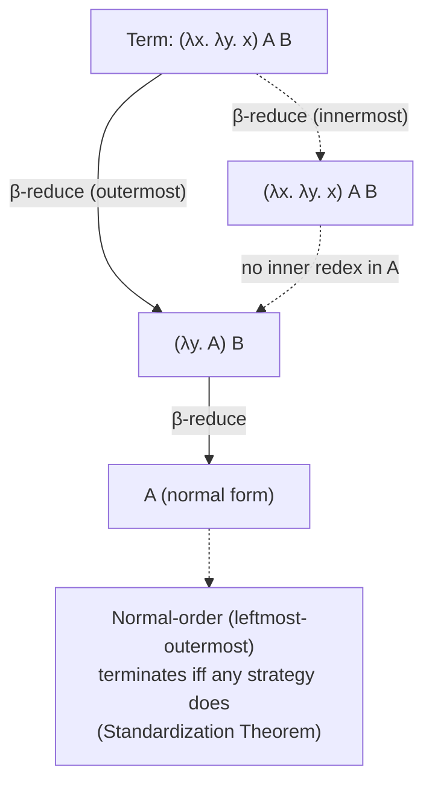
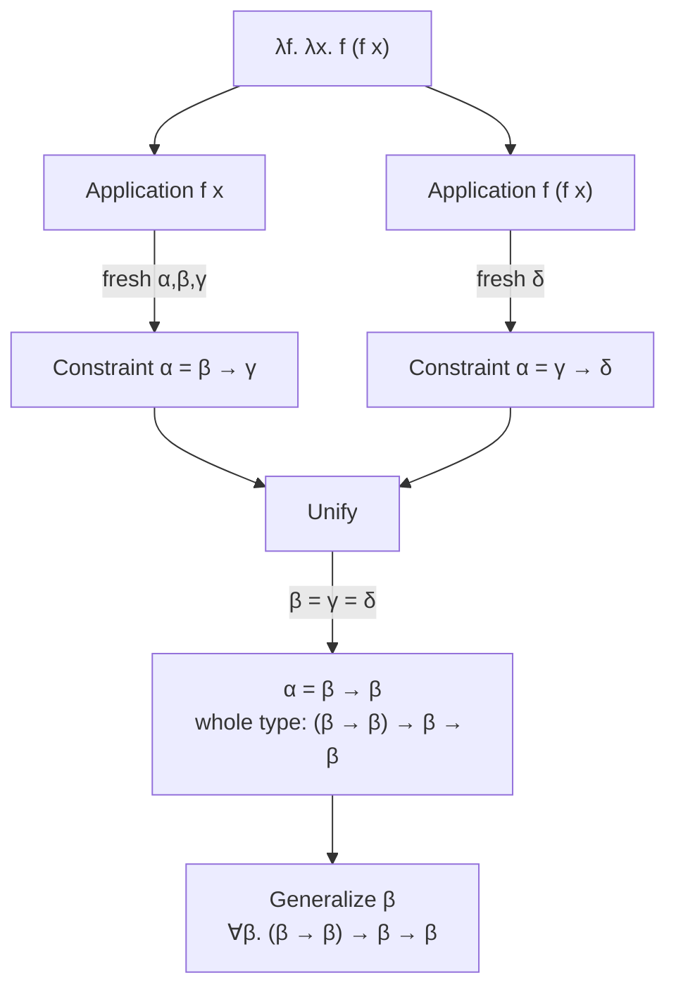
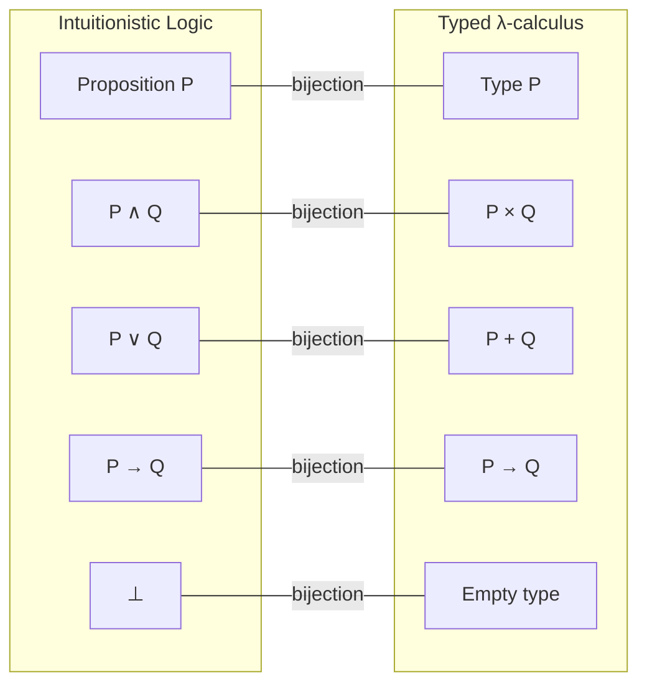

# Programming Language Theory

## Overview

**Programming language theory (PLT)** is the mathematical study of the design, definition, semantics, and implementation of programming languages. It sits at the intersection of logic, category theory, computability, and software engineering, and it provides the vocabulary in which every modern compiler, type checker, theorem prover, and verifier is ultimately expressed. Where a practitioner sees a Haskell type signature or a Rust borrow-checker error, a PL theorist sees an instance of Hindley–Milner inference or a flow-sensitive substructural type system; the goal of this page is to make that mapping explicit.

The field rests on three foundational results from the 1930s. Church (1936) introduced the **λ-calculus** as a formal model of computation and showed that the set of β-convertible terms is undecidable — the same year Turing (1936) proved the equivalent result for his machines, establishing the **Church–Turing thesis**. Curry (1934) and Howard (1969, circulating until 1980) observed that the simply-typed λ-calculus and intuitionistic propositional logic are *the same structure* — a result now called the **Curry–Howard correspondence**. Milner (1978) and Hindley (1969) independently discovered the polymorphic type-inference algorithm that bears their names, making ML-style "let the compiler figure out the types" possible. Girard (1972) and Reynolds (1974) invented **System F** (parametric polymorphism) and proved **parametricity** — the theorem that says a polymorphic function *cannot* inspect the type it is given, which is why `forall a. a -> a` has only one inhabitant (the identity).

This page covers the ~50 PLT topics listed in Section 4 of the master index: lambda calculus, type systems and inference, polymorphism, advanced types (dependent, linear, refinement), effects and control, evaluation strategies, formal semantics, the Curry–Howard correspondence, the calculus of constructions, and category theory for programmers. Each section is written so that an interviewer asking "explain X" will get a technically correct answer rather than a hand-wave.

> Related: [Logic](./logic.md), [Proof Techniques](./proofs.md), [Formal Methods](./formal-methods.md), [Turing Machines](./turing-machines.md), [Computability](./computability.md), [Formal Languages](./formal-languages.md), [Complexity Classes](./complexity-classes.md), [Semantic Analysis](../compilers/semantic-analysis.md), [OCaml](../languages/ocaml/README.md)

## The Lambda Calculus

The **λ-calculus** (Church, 1936) is a tiny formal system for expressing computation through function abstraction and application. Its grammar fits on one line:

```
M, N ::= x | λx. M | M N
```

Three constructors: a **variable** `x`, an **abstraction** `λx. M` (a function of one argument `x` returning `M`), and an **application** `M N` (apply `M` to `N`). Despite this minimalism, the untyped λ-calculus is Turing-complete: Church encodings represent natural numbers (the **Church numerals** `n := λf. λx. fⁿ x`), booleans (`true := λx. λy. x`, `false := λx. λy. y`), pairs, lists, and recursion (via the **Y-combinator** `Y := λf. (λx. f (x x)) (λx. f (x x))`).

The single computational rule is **β-reduction**: `(λx. M) N →β M[x := N]`, which substitutes `N` for every free occurrence of `x` in `M`. Two terms are **β-equivalent** if they reduce to a common normal form. **α-conversion** renames bound variables to avoid capture (so `λx. x` and `λy. y` are the same term). **η-equivalence** says `λx. f x ≡η f` when `x` is not free in `f` — the function and its η-expansion are observationally equal. A term has a normal form iff reduction terminates; **untyped λ-calculus is not strongly normalizing** (`Ω := (λx. x x) (λx. x x)` reduces to itself forever), and deciding whether an arbitrary term has a normal form is undecidable — equivalent to the halting problem.



The standardization theorem (Curry & Feys, 1958) says: if a term has any normal form, **normal-order reduction** (leftmost-outermost) finds it. This is the theoretical basis for lazy evaluation in Haskell. Applicative-order (leftmost-innermost) reduction is the basis for call-by-value: it avoids re-evaluating arguments but can diverge on terms that normal-order would reduce, e.g., `(λx. λy. y) Ω B`.

## Typed vs. Untyped Lambda Calculus

Adding types to the λ-calculus changes everything. The **simply-typed λ-calculus (STLC)** of Church (1940) annotates abstractions with the type of their argument:

```
M, N ::= x | λx:τ. M | M N
τ, σ ::= ι | τ → σ
```

The typing judgement `Γ ⊢ M : τ` reads "in environment `Γ`, term `M` has type `τ`". Three rules suffice:

```
(var)   x : τ ∈ Γ
        ───────────
        Γ ⊢ x : τ

(abs)   Γ, x : τ ⊢ M : σ
        ──────────────────────
        Γ ⊢ λx:τ. M : τ → σ

(app)   Γ ⊢ M : τ → σ    Γ ⊢ N : τ
        ──────────────────────────
        Γ ⊢ M N : σ
```

STLC is **strongly normalizing**: every well-typed term reduces to a normal form in finitely many steps. It is therefore *not* Turing-complete (no unbounded recursion). The trade-off is fundamental: every typed λ-calculus either gives up Turing-completeness (STLC, System F) or adds a recursion primitive that breaks normalization (PCF, ML, Haskell with `fix`). The table below contrasts the untyped and simply-typed calculi.

| Property | Untyped λ-calculus | Simply-typed λ-calculus |
|----------|--------------------|-----------------------|
| **Turing-complete** | Yes | No (strongly normalizing) |
| **Normalization** | Not guaranteed (`Ω`) | Strong (every term terminates) |
| **Typing judgement** | None; all terms are terms | `Γ ⊢ M : τ`, syntax-directed |
| **Type of `λx. x`** | N/A | `τ → τ` for any chosen `τ` |
| **Recursion** | Via `Y`-combinator | Forbidden; must add `fix : (τ→τ)→τ` |
| **Logical reading** | Inconsistent as logic | Intuitionistic propositional logic |
| **Type checking** | Trivial | Decidable, linear in term size |
| **Inhabitant of `τ → τ`** | Many | Only identity (in empty context) |

## Type Systems

A **type system** is a tractable syntactic method for proving the absence of certain program behaviors by classifying phrases according to the kinds of values they compute (Cardelli, 1996; Pierce, *TaPL*, 2002). Types serve three jobs: they document intent, they enable compiler optimization (unboxed representation, devirtualization), and they reject programs at compile time. The classification below organizes the ~20 typing concepts from the master index.

**Structural vs. nominal typing.** In a **structural** system, two types are equal if they have the same structure — TypeScript's `interface`, OCaml's objects, and Go's interfaces are structural. In a **nominal** system, two types are equal only if declared so — Java classes, Rust `struct`s, Haskell `data` types. Structural typing composes well with duck typing (if it walks like a duck…); nominal typing enables fast dispatch and explicit API boundaries.

**Gradual typing** (Siek & Tach, 2006) interpolates between static and dynamic typing by introducing an **unknown** type `?` and a consistency relation `≲` that allows implicit flow between typed and untyped code. TypeScript, Python type hints, and Typed Racket use gradual typing. The cost is runtime checks at type boundaries — without them, a typed module can be corrupted by an untyped caller (the "soundness vs. completeness" trade-off).

**Duck typing** (Python, Ruby) is the dynamic, runtime-only variant: a method call succeeds if the receiver has a matching method at run time, regardless of declared type. It is structural typing executed lazily.

**Type erasure** means types are used only at compile time and erased before execution (Java generics, ML, Haskell). **Reified types** persist into runtime values (C# generics, Dart, Java arrays via covariance). Erasure enables uniform representation; reification enables runtime reflection but complicates the ABI.

**Variance** describes how subtyping of compound types relates to subtyping of their components. Given `C<τ>`, the variance of the position determines whether `σ ⊆ τ` implies `C<σ> ⊆ C<τ>` (covariant), the reverse (contravariant), both (bivariant, rare), or neither (invariant).

| Position | Variance | Example | Why |
|----------|----------|---------|-----|
| Function **result** | Covariant | `() → Cat` ⊆ `() → Animal` | Producer of `Cat` can substitute for producer of `Animal` |
| Function **argument** | Contravariant | `Animal → ()` ⊆ `Cat → ()` | Consumer of `Animal` accepts `Cat` |
| Mutable **array** (read+write) | Invariant | `Array<Cat>` ⊄ `Array<Animal>` | Write would corrupt; Java arrays are unsound here |
| Immutable **list** (read-only) | Covariant | `List<Cat>` ⊆ `List<Animal>` | No writes, so safe — Scala `Seq[+A]`, Kotlin `List<out A>` |
| Function **input-output** | Bivariant | TypeScript `function` params | Unsoud; `strictFunctionTypes` flag makes it contravariant |

## Polymorphism

**Polymorphism** is the ability of a single piece of code to operate on values of different types. Strachey (1967) distinguished two species:

**Parametric polymorphism** — the same code works for *any* type, uniformly. The identity `fun x -> x` has type `forall a. a -> a` and behaves identically regardless of `a`. Parametricity (Reynolds, 1983; Wadler, "Theorems for Free!", 1989) is the theorem that says a parametrically polymorphic function *cannot* inspect or construct values of the abstract type. This yields **free theorems**: `forall a. [a] -> [a]` must preserve multiplicity of elements (it can only permute, drop, or duplicate), because it has no way to tell them apart.

**Ad-hoc polymorphism** — the code dispatches on type at runtime (or by dictionary-passing at compile time). Haskell type classes (Wadler & Blott, 1989), Rust traits, and Scala `given`s are ad-hoc. `show :: forall a. Show a => a -> String` produces different code per `a` — the constraint is solved by passing a hidden dictionary of `show` methods. This is also how C++ templates resolve (via name lookup at instantiation) and how Go generics are monomorphized.

| Aspect | Parametric (System F) | Ad-hoc (type classes) |
|--------|------------------------|------------------------|
| **Uniformity** | Same code for all types | Different code per type |
| **Type erasure** | Yes (or uniform representation) | No (dictionaries persist) |
| **Free theorems** | Hold (Reynolds/Wadler) | Do not hold — `show` may special-case |
| **Example** | `id :: forall a. a -> a` | `show :: forall a. Show a => a -> String` |
| **Coherence** | Trivial | Must be enforced (one instance per type) |

**Higher-kinded types (HKTs).** A type constructor like `List` has kind `* -> *` — it takes a type and returns a type. `Map` has kind `* -> * -> *`. A higher-kinded type abstracts over type constructors themselves: `fmap :: Functor f => (a -> b) -> f a -> f b`. Here `f` ranges over type constructors of kind `* -> *`. Haskell, Scala, and OCaml (5.x) support HKTs; Rust and Go do not (as of 2026), which is why `Future` and `Iterator` are concrete traits rather than parameterized functors.

**Algebraic data types (ADTs).** An ADT is a sum (`|`) of products. `data Bool = True | False` is the sum of two unit types (cardinality 2); `data Maybe a = Nothing | Just a` has cardinality `1 + |a|`; `data Either a b = Left a | Right b` has `|a| + |b|`; `data Pair a b = Pair a b` has `|a| × |b|`. The algebra of types mirrors the algebra of polynomials: `Maybe (Either a b) = 1 + (a + b) = (1+a) + b = Maybe a + b`. This is the foundation of generic programming, lens libraries, and derivations of `Eq`, `Ord`, `Show` in Haskell and Rust `#[derive]`.

**Universal and existential types.** A **universal type** `∀α. τ` is the type of a polymorphic value (`forall a. a -> a` is `∀α. α → α`). An **existential type** `∃α. τ` packages a value with an opaque type: `∃α. (α, α → String)` is "some type `α` together with a value of `α` and a printer". Existentials implement information hiding (abstract data types); in ML they arise as modules with abstract types. The duality `∃α. τ ≡ ¬∀α. ¬τ` (under classical logic) connects the two via CPS.

## Hindley–Milner Type Inference

**Hindley–Milner (HM)** is the type-inference algorithm at the heart of ML, Haskell, OCaml, F#, Elm, and Rust (the trait-resolution layer extends it). Discovered independently by Hindley (1969) for combinatory logic and by Milner (1978) for ML, it deduces the **principal type** (most general type) of an expression without any annotations. Damas and Milner (1982) proved it sound and complete. The algorithm runs in near-linear time in practice (though worst-case DEXPTIME-complete due to the occurs-check and union-find; Mairson, 1990).

HM works by **unification** on type variables. The two key ideas:

1. **Let-polymorphism** — `let x = e1 in e2` generalizes the type of `e1` before substituting into `e2`, so `let id = fun x -> x in (id 3, id true)` type-checks (each use of `id` gets a fresh instantiation). Function arguments are **not** generalized — `fun id -> (id 3, id true)` is rejected, because `id` would need to be both `int -> int` and `bool -> bool` simultaneously. This is the **value restriction** (Wright, 1995): only syntactic values are generalized, ruling out unsound ref-cell interactions.
2. **Algorithm W** — walk the syntax tree, generate fresh type variables, emit unification constraints, and solve them by substitution. When you see `f x`, generate `f : α → β`, `x : γ`, unify `α = γ`, and the result has type `β`.

A worked example — inferring `fun f -> fun x -> f (f x)`:

```text
1. Generate fresh vars: f : α,  x : β
2. Inner application f x:  unify α = β → γ        (so f : β → γ,   result γ)
3. Outer application f (f x): need f : γ → δ
   Now f has two constraints: α = β → γ  AND  α = γ → δ
   Unify:  β → γ = γ → δ   ⟹   β = γ,  γ = δ
4. Result type:  (β → β) → β → β
   i.e.,  ∀β. (β → β) → β → β     (generalize β at the top level)
```



| Aspect | Hindley–Milner | Bidirectional (Pierce & Turner, 2000) |
|--------|----------------|---------------------------------------|
| **Direction** | Synthesis only (infer from term) | Check (`⊢ ⇐`) + Synth (`⊢ ⇒`) |
| **Higher-rank types** | No (rank-1 only) | Yes (rank-n, dependent on algorithm) |
| **Annotations needed** | None | At higher-rank binders |
| **GADTs / dependent** | No | Yes (local constraint solving) |
| **Error messages** | Often poor (late unification) | Better (failure localizes to a check) |
| **Used in** | ML, OCaml, Haskell (pre-GHC 7) | GHC, Rust, TypeScript, Idris, Lean |

Modern systems (GHC's `OutsideIn(X)`, Dunfield & Krishnaswami's bidirectional HM) combine the two: bidirectional checking for higher-rank and GADTs, with HM-style let-generalization inside.

## Advanced Type Systems

**Dependent types.** A dependent type depends on a *value*: `Vec A n` is the type of length-`n` vectors of `A`. The function `replicate : ∀n. A → Vec A n` returns a vector whose length is statically known. Dependent types let types express arbitrary program properties: `append : Vec A m → Vec A n → Vec A (m + n)`, with the proof of length-addition carried in the type. Languages with full dependent types (Agda, Idris, Coq, Lean, F*) erase the boundary between types and terms — types are first-class values. Decidability of type-checking then requires either **termination checking** (Agda, Coq) or a strict positivity check to keep the logic consistent.

**Refinement types** (Freeman & Pfenning, 1991) layer predicate logic on top of an existing type system: `{ x : Int | x > 0 }` is the type of positive integers. The type system reduces to SMT solving (Z3, CVC5) to discharge the constraints. Liquid Haskell, Refined Racket, and F* use refinement types to encode pre/post-conditions, array-bounds safety, and information-flow properties without changing the underlying language.

**Linear and affine types.** A **linear type** (Girard, 1987; Wadler, "Linear Types Can Change the World!", 1990) requires that each variable of that type be used **exactly once** — neither dropped nor duplicated. This models resources: file handles, sockets, memory, capabilities. An **affine type** (Rust) relaxes "exactly once" to "at most once" — values may be dropped but not duplicated. Rust's ownership system is affine: every value has one owner; on `move` the old binding is unusable; on `&` (borrow) you may read; on `&mut` you may write, exclusively. Linear logic underlies Clean, Idris 2's quantitative type theory (QTT), and Linear Haskell's `a %1 -> b`.

**Linear vs. affine vs. unrestricted** forms a substructural hierarchy: ordered (only adjacent), linear (exactly once), affine (at most once), relevant (at least once), unrestricted (no constraint). Each removes one structural rule (exchange, contraction, weakening). The relevant type system is rarely seen in practice but appears in capability-secure languages.

## Evaluation Strategies

Evaluation strategy determines *when* arguments are computed. The five classical strategies:

- **Call-by-value (CBV)** — evaluate the argument fully before substituting. Strict, eager. ML, Scheme, JavaScript, Python, Java.
- **Call-by-name (CBN)** — substitute the argument expression unevaluated; re-evaluate each time it is used. Used in Algol 60; rarely used today because it duplicates work.
- **Call-by-need** (Wadsworth, 1971) — CBN with memoization: evaluate the argument the first time it is used, cache the result. This is **lazy evaluation**, used by Haskell. Implemented via **thunks** (suspensions).
- **Call-by-push-value** (Levy, 2003) — splits values and computations into separate categories; uniform framework for CBV and CBN.
- **Short-circuit / call-by-macro-expansion** — Lisp `fexpr`s, C preprocessor macros, hygienic macros in Racket.

Strict languages need **strictness analysis** to discover which arguments can safely be passed by need (a compiler optimization). Lazy languages need **strictness analysis** to discover which arguments must be forced eagerly for performance — the dual problem.

| Strategy | Evaluates args? | Re-evaluates? | Terminates when? | Example |
|----------|-----------------|---------------|------------------|---------|
| **Call-by-value** | Yes, eagerly | No | If any arg diverges, the call diverges | `f(diverge)` diverges |
| **Call-by-name** | No | Yes, on each use | If arg unused, never evaluated | `fst(x, diverge)` returns `x` |
| **Call-by-need** | On first use | No (cached) | Same as CBN but no rework | Haskell |
| **Call-by-push-value** | Explicit via `force`/`return` | Caller-chosen | — | Koka, some MLs |

Eager evaluation is simpler to reason about (no space leaks from built-up thunks), supports predictable performance, and aligns with how hardware executes. Lazy evaluation enables infinite data structures (`ones = 1 : ones`), decouples producers from consumers, and is the default for compositional programming (Hughes, "Why Functional Programming Matters", 1989). The trade-off is **space leaks** (thunks hold on to large subgraphs) and **predictability** (cost models are non-local). Strict Haskell extensions and strictness annotations (`!`, `BangPatterns`) are pragmatic compromises.

## Effects and Control

**Lexical vs. dynamic scoping.** In **lexical** (static) scoping, a free variable refers to the binding in the *textual* enclosing scope — the standard in virtually every modern language. In **dynamic** scoping, it refers to the binding on the *call stack* at the call site — historically used in Lisp (pre-Common Lisp, pre-Scheme), Emacs Lisp, and Perl `local`. Dynamic scoping breaks modularity (a callee's behavior depends on the caller's variables) but enables some patterns cleanly (exception handlers, dynamic variables like Common Lisp's `*standard-output*`). Modern languages expose controlled dynamic scope via `fluid-let`, Racket parameters, or Haskell's `ReaderT`/implicit configurations.

**Closures.** A **closure** is a function value paired with the environment in which it was defined — together they capture the free variables. Implementations represent a closure as a record of (code pointer, environment pointer). The heap-allocated environment is what makes first-class functions work: `(fun x -> x + y)` carries `y` even after the defining scope returns. **Escape analysis** can sometimes stack-allocate closures that do not outlive their defining frame.

**Continuations and CPS.** The **continuation** of an expression is "what the rest of the program will do with its value." **Continuation-passing style (CPS)** makes the continuation explicit: every function takes an extra argument `k`, the continuation, and instead of returning, it calls `k` with the result. `(+ 1 2)` becomes `(lambda (k) (+ 1 2 k))`. CPS is the standard intermediate representation for compilers (SML/NJ, Racket, GHC's Core) because every transfer of control is a tail call, every evaluation order is explicit, and lambda-lifting is direct. **Call/cc** (first-class continuations) reifies the current continuation as a value, enabling non-local exits, coroutines, generators, and backtracking. Its downside: it complicates reasoning about behavior and defeats tail-call optimization in naive implementations.

**Monads, functors, applicatives.** These are type-system abstractions for **effectful computation** in pure languages. A **functor** `f` supports `map : (a → b) → f a → f b` — apply a pure function inside a structure. An **applicative functor** adds `ap : f (a → b) → f a → f b` and `pure : a → f a` — combine independent effectful computations. A **monad** adds `bind : (a → f b) → f a → f b` (Haskell `>>=`) — sequence computations where each step depends on the previous result. The hierarchy `Functor ⊂ Applicative ⊂ Monad` is strict: `Maybe`, `List`, `IO`, `State`, `Reader`, `Writer`, `Either e`, `Cont` are all monads. Monads were introduced into programming by Moggi (1991, "Notions of Computation and Monads") and popularized by Wadler for Haskell. The `do`-notation is syntactic sugar for `>>=`.

**Algebraic effects and effect handlers.** An alternative to monads (Plotkin & Power, 2001; Bauer & Pretnar, 2012), algebraic effects model effects as a delimited continuation plus an operation. A handler interprets a tree of effect operations. They compose better than monads (no need to lift through transformer stacks) and integrate with type systems as **effect rows**: `λx. print "hi"; x + 1` has effect `{IO, Pure}`. Koka, Eff, Unison, OCaml 5 (with `effect` handlers), and Helium are effect-based languages. Rust's `try`/`?` operator is a restricted algebraic effect for error propagation.

## Formal Semantics

A programming language is fully specified only when its **semantics** is given — the mathematical meaning of every construct. Three main approaches:

**Operational semantics** defines meaning by how the program *executes*. **Small-step** (structural operational semantics, SOS) gives reduction rules `⟨M, σ⟩ → ⟨M', σ'⟩` that step one computation at a time. **Big-step** (natural semantics, eval rules) gives `⟨M, σ⟩ ⇓ v` for "evaluates to value `v`". Operational semantics is the most common in practice: it mirrors an interpreter, is easy to mechanize (PLT Redex, Ott, K framework), and is the foundation for type-soundness proofs via progress and preservation. Its weakness is that "meaning" is tied to a specific abstract machine.

**Denotational semantics** (Scott & Strachey, 1970) defines meaning as a mathematical object — a function from input domains to output domains — via a compositional translation `⟦M⟧ : Env → Value`. The translation is by structural recursion on syntax. The hard part is giving meaning to recursion and loops: this requires **domain theory** (complete partial orders, least fixed points). The least fixed point of a functional `F` is `⊔_{n} Fⁿ(⊥)` — the supremum of finite approximations. Denotational semantics is mathematically elegant and exposes program equivalence as equality of denotations, but it is hard to scale to rich languages with effects, concurrency, or higher-order state.

**Axiomatic semantics** (Hoare, 1969) defines meaning via logical rules — preconditions, postconditions, and **Hoare triples** `{P} S {Q}` ("if `P` holds before `S`, then `Q` holds after"). This is the foundation of program verification, refinement calculi, and proof-carrying code. Dijkstra's **weakest-precondition calculus** (`wp(S, Q)`) is the dual form. See [Formal Methods](./formal-methods.md) for tools (Dafny, Why3, Frama-C) that consume axiomatic specifications.

| Aspect | Operational | Denotational | Axiomatic |
|--------|-------------|--------------|-----------|
| **Meaning is** | A sequence of steps | A mathematical function | A Hoare triple |
| **Compositionality** | Per-rule (small-step) | Fully compositional | Per-rule |
| **Mechanization** | Easy (Redex, K) | Hard (domain theory) | Medium (separation logic) |
| **Equivalence** | Bisimulation | Equality of denotations | Mutual implication |
| **Best for** | Interpreters, type soundness | Program equivalence, optimization laws | Verification, refinement |
| **Concurrency** | Natural (labeled transitions) | Hard (powerdomains) | Natural (CSL, rely/guarantee) |

## Curry–Howard Correspondence

The **Curry–Howard correspondence** (Curry, 1934; Howard, 1969/1980) is the observation that propositions and types are the same thing, and proofs and programs are the same thing. The correspondence is not an analogy — it is a bijection between intuitionistic logic and the simply-typed λ-calculus:

| Logic | Programming |
|-------|-------------|
| Proposition `P` | Type `P` |
| Proof of `P` | Program of type `P` |
| Implication `P → Q` | Function type `P → Q` |
| Conjunction `P ∧ Q` | Product type `P × Q` |
| Disjunction `P ∨ Q` | Sum type `P + Q` |
| Truth `⊤` | Unit type `()` |
| Falsehood `⊥` | Empty type `Void` (no constructor) |
| Modus ponens | Function application |
| Substitution | β-reduction (proof normalization) |
| Hypothesis | Variable |
| Cut elimination | β-reduction (computational content) |

The **ex falso** rule `⊥ → P` corresponds to the eliminator for the empty type (absurd pattern in Rust, `Void -> a` in Haskell). The constructive reading of `∃x. P(x)` is a dependent pair `(x, p)` of a witness and a proof; `∀x. P(x)` is a dependent function. Classical logic, with its additional axioms (excluded middle, double-negation elimination), corresponds to adding control operators like **call/cc** (Griffin, 1990) — the type of call/cc is `((α → β) → α) → α`, Peirce's law, which is classically but not intuitionistically provable.



The practical payoffs are enormous. **Proof assistants** (Coq, Agda, Lean, Idris) are literally programming languages with dependent types: writing a proof *is* writing a program, and checking the proof *is* type-checking. The **calculus of constructions** (Coquand & Huet, 1988) extends the correspondence to higher-order predicate logic, and underlies Coq. The **Curry–Howard–Lambek correspondence** adds a third column — **category theory** — where propositions are objects, proofs are morphisms, conjunction is product, disjunction is coproduct, and implication is the exponential.

## Calculus of Constructions and Pure Type Systems

The **calculus of constructions (CoC)** (Coquand & Huet, 1988) is a dependent type theory that extends System F with dependent products and sums. It is the kernel of Coq (now Rocq), and its logical reading is intuitionistic higher-order predicate logic. The CoC has two universes, `Prop` (propositions) and `Type` (types), and a single dependent product constructor `Π` that generalizes both `∀` (universal quantification) and `→` (function arrow). A `Πx:τ. σ` is a function from `τ` to `σ` where `σ` may mention `x` — so it is simultaneously a polymorphic type and a universally quantified proposition.

**Pure type systems (PTS)** (Barendregt, 1991, "λ-cube") unify the typed λ-calculi into a single parameterized framework. The **λ-cube** has three axes of variation — polymorphism (types depending on types), type operators (types depending on terms... no, on types), and dependent types (types depending on terms):

| Calculus | Terms→Types | Types→Types | Types→Terms | Logic |
|----------|-------------|-------------|-------------|-------|
| **λ→** (STLC) | — | — | — | Prop. logic |
| **λ2** (System F) | ✓ | — | — | 2nd-order prop. |
| **λω** (System Fω) | ✓ | ✓ | — | Higher-order prop. |
| **λP** (LF) | — | — | ✓ | 1st-order pred. |
| **λC** (CoC) | ✓ | ✓ | ✓ | Higher-order pred. |

Each dimension adds expressiveness and removes normalization guarantees (System F is strongly normalizing; adding general recursion breaks it; adding dependent types keeps normalization only with strict positivity and termination checks).

## Category Theory for Programmers

**Category theory** is the branch of mathematics that studies structure-preserving transformations. Its relevance to PLT is that many abstractions — functor, monad, adjunction, natural transformation — were originally category-theoretic concepts that map cleanly onto programming constructs. The map is captured by the **Curry–Howard–Lambek correspondence**: a typed λ-calculus with products corresponds to a Cartesian closed category (CCC).

A **category** is a collection of **objects** and **morphisms** (arrows between objects), with composition and identity, satisfying associativity and unit laws. In programming: objects are types, morphisms are functions, composition is `(.)`, and identity is `id`. A **functor** `F : C → D` maps objects to objects and arrows to arrows, preserving structure — in programming, a type constructor with `map` (Haskell `Functor`). A **natural transformation** is a family of morphisms `α_A : F A → G A` that commutes with `F`'s and `G`'s `map` — in Haskell, `sequenceA :: Traversable t => t (f a) -> f (t a)` is a natural transformation between `t` and `f`.

An **adjunction** `F ⊣ U` between functors is the categorical notion behind **free constructions** — the free monoid functor is left adjoint to the forgetful functor from Mon to Set. In PLT, the **state monad** arises as the adjunction `F ⊣ U` where `U` is the "underlying value" functor and `F` is "pair with state"; the monad is the composite `U ∘ F`. The **Yoneda lemma** states that `Nat(Hom(a, –), F) ≅ F a` — in Haskell, `forall x. (a -> x) -> f x ≅ f a`, which is the basis of `Data.Functor.Contravariant.Yoneda` and CPS-based optimizations.

The practical takeaway: when a library author writes `Monad`, `Applicative`, `Traversable`, `Comonad`, `Profunctor`, they are inheriting categorical structure. The laws (associativity of `>>=`, naturality of `fmap`) are not arbitrary API conventions but theorems; following them gives free theorems, fusion laws, and predictable optimization. The categorical vocabulary also lets you transfer intuition between domains — a parser combinator library is a monad on `ParseResult`, a stream processor is a comonad, a probability distribution is the Giry monad.

## Pattern Matching and Metaprogramming

**Pattern matching** is the structural destructor for algebraic data types. A `match e with | p1 -> e1 | p2 -> e2 ...` matches `e` against patterns `p` and evaluates the corresponding branch, binding sub-terms. The exhaustiveness and overlap checks are a static analysis on the pattern matrix. **Dependent pattern matching** (Coq, Agda, Idris) refines types *inside* each branch — matching `Vec A (S n)` against `x :: xs` refines the length to `S n`, which lets the type-checker discharge arithmetic facts. This is implemented via **elaboration to eliminators** (the `match` desugars to applications of the induction principle for the type).

**Macros** are compile-time programs that produce code, dividing into **hygienic** and **unhygienic** varieties. **Hygienic macros** (Kohlbecker et al., 1986; Racket, Scheme, MacroML, Sweet.js) automatically rename introduced identifiers so they cannot capture or be captured by bindings at the macro use site — the macro behaves as if its template were textually inserted with all free identifiers resolved at the macro's *definition* site. **Unhygienic macros** (C preprocessor, classic Lisp defmacro) allow intentional capture but require careful discipline to avoid subtle bugs. Rust's declarative `macro_rules!` are hygienic; its procedural macros are compile-time Rust functions producing syntax trees. **Reflection** (Java, C#, Python `inspect`) inspects runtime type information; **metaprogramming** (Lisp, Elixir, Julia) generates code at runtime via `eval`. The trade-off between macros and reflection is the traditional compile-time/run-time boundary, with all its implications for performance, IDE support, and debugging.

## Interview Questions

**Q: What is the difference between parametric and ad-hoc polymorphism? Give a free theorem for each.**
A: Parametric polymorphism uses the *same* code for every type (`id :: forall a. a -> a`); ad-hoc polymorphism dispatches per type (`show :: Show a => a -> String`). Free theorem for `forall a. [a] -> [a]`: the function only permutes, drops, or duplicates elements — it cannot inspect or construct them. No free theorem exists for `show`, because each instance may behave arbitrarily.

**Q: Why does `let id = fun x -> x in (id 3, id true)` type-check in OCaml but `fun id -> (id 3, id true)` does not?**
A: Let-polymorphism generalizes the type of `id` to `∀α. α → α` at the `let`, so each use gets a fresh instantiation. Function arguments are *not* generalized — `id` would need to be both `int → int` and `bool → bool` simultaneously, which is unsound. The **value restriction** (Wright, 1995) further requires `let`-bound expressions to be syntactic values to prevent unsound generalization in the presence of mutable references.

**Q: Explain the Curry–Howard correspondence. What is the type of the law of excluded middle?**
A: Propositions are types, proofs are programs, implication is function arrow, conjunction is product, disjunction is sum, falsehood is the empty type. Excluded middle `P ∨ ¬P` corresponds to `Either P (P -> Void)`. It is not provable in STLC (intuitionistic), but **call/cc** has type `((α → β) → α) → α` (Peirce's law), which is equivalent to excluded middle under the negative translation.

**Q: Why is the simply-typed λ-calculus not Turing-complete, and how do real languages recover Turing-completeness?**
A: STLC is strongly normalizing: every well-typed term reduces to a normal form in finite steps, so there is no unbounded recursion. Real languages add a fixed-point combinator `fix : (τ → τ) → τ` (PCF, ML, Haskell) or general recursive function definitions, which break strong normalization but restore Turing-completeness. The cost is that type-checking no longer guarantees termination — termination must be proven separately (e.g., Coq's guardedness/termination checker) when needed.

**Q: Compare call-by-value, call-by-name, and call-by-need on `(λx. λy. x) Ω 1` where `Ω` diverges.**
A: **CBV** evaluates `Ω` first and diverges — never reaches the body. **CBN** substitutes `Ω` unevaluated into the body, returns `λy. Ω`, then evaluates the outer application to `Ω` — diverges when `x` is forced. Wait: with normal-order (leftmost-outermost), `x` is not used, so the result is `1` in CBN. **CB-need** similarly returns `1` and never evaluates `Ω`. So CBV diverges, CBN returns `1`, CB-need returns `1`. CBN may re-evaluate; CB-need caches.

**Q: What is a monad, and what problem does it solve in a pure language?**
A: A monad on a type constructor `m` is `(m, return, bind)` satisfying left-unit, right-unit, and associativity laws. In a pure language like Haskell, it solves the problem of sequencing effectful computations (IO, state, exceptions, parsing, non-determinism) without breaking referential transparency — the type `IO a` is a *description* of an effect, and the runtime interprets it. Monads were introduced to PLT by Moggi (1991) and popularized by Wadler.

**Q: What is the difference between linear and affine types, and which one does Rust implement?**
A: Linear types require each variable be used **exactly once**; affine types require **at most once** (may be dropped, never duplicated). Rust implements affine types via ownership: a moved value cannot be used again, but a value can be silently dropped at end of scope. Linear Haskell adds `a %1 -> b` for true linearity. Affine types model RAII resources well; linear types are stronger (force explicit disposal) but more constraining.

**Q: What is parametricity, and what is the "free theorem" for `forall a. a -> a`?**
A: Parametricity (Reynolds, 1983) is the property that a polymorphic function behaves uniformly across all type instantiations — it cannot inspect the abstract type. The free theorem (Wadler, 1989) for `f :: forall a. a -> a` is `f ∘ g = g ∘ f` for any `g`. Since `f` cannot construct or destruct `a`, it must be the identity; thus `forall a. a -> a` has exactly one inhabitant in a total language. This is why `void`/`absurd :: forall a. Void -> a` exists (free theorem: anything follows from contradiction) and why `unsafeCoerce :: forall a b. a -> b` cannot be defined in safe Haskell.

## Cross-References

- [Logic](./logic.md) — propositional and predicate logic, the foundation for Curry–Howard
- [Proof Techniques](./proofs.md) — induction, contradiction; the proof techniques used in PLT metatheory
- [Formal Methods](./formal-methods.md) — Coq, Lean, theorem provers built on dependent type theory
- [Turing Machines](./turing-machines.md) — Church–Turing thesis, equivalence with λ-calculus
- [Computability](./computability.md) — undecidability of type-checking dependent languages, halting problem
- [Formal Languages](./formal-languages.md) — Chomsky hierarchy, the syntax side of PLT
- [Complexity Classes](./complexity-classes.md) — type inference complexity (HM is DEXPTIME-complete)
- [Semantic Analysis](../compilers/semantic-analysis.md) — Hindley–Milner Algorithm W in practice
- [OCaml](../languages/ocaml/README.md) — a real-world HM language with modules and GADTs
- [Rust](../languages/rust/README.md) — affine types, ownership, borrow checking in production

## References

- Alonzo Church — "An Unsolvable Problem of Elementary Number Theory" (American Journal of Mathematics, 1936) — the original λ-calculus paper
- Alan Turing — "On Computable Numbers" (Proc. London Math. Soc., 1936) — Turing machines, equivalence with λ-calculus
- Haskell B. Curry & Robert Feys — *Combinatory Logic, Vol. I* (North-Holland, 1958) — standardization theorem
- Alonzo Church — "A Formulation of the Simple Theory of Types" (JSL, 1940) — simply-typed λ-calculus
- Jean-Yves Girard — *Interprétation fonctionelle et élimination des coupures de l'arithmétique d'ordre supérieur* (PhD thesis, Paris VII, 1972) — System F
- John C. Reynolds — "Towards a Theory of Type Structure" (Colloque sur la Programmation, 1974) — polymorphic λ-calculus
- John C. Reynolds — "Types, Abstraction and Parametric Polymorphism" (IFIP, 1983) — parametricity
- Philip Wadler — "Theorems for Free!" (FPCA, 1989) — free theorems from parametricity
- Roger Hindley — "The Principal Type-Scheme of an Object in Combinatory Logic" (JSL, 1969) — original HM
- Robin Milner — "A Theory of Type Polymorphism in Programming" (JCSS, 1978) — Algorithm W
- Luis Damas & Robin Milner — "Principal Type-Schemes for Functional Programs" (POPL, 1982) — soundness & completeness of HM
- Thierry Coquand & Gérard Huet — "The Calculus of Constructions" (Information and Computation, 1988) — CoC
- Henk Barendregt — "Lambda Calculi with Types" (Handbook of Logic in Computer Science, 1992) — the λ-cube and PTS survey
- Benjamin Pierce — *Types and Programming Languages* (MIT Press, 2002) — the standard textbook
- Robert Harper — *Practical Foundations for Programming Languages* (2nd ed., MIT Press, 2016) — PFPL
- Shriram Krishnamurthi — *Programming Languages: Application and Interpretation* (PLAI, free online) — PLAI
- Philip Wadler & Stephen Blott — "How to Make Ad-Hoc Polymorphism Less Ad Hoc" (POPL, 1989) — type classes
- Eugenio Moggi — "Notions of Computation and Monads" (Information and Computation, 1991) — monads in semantics
- Philip Wadler — "The Essence of Functional Programming" (POPL, 1992) — monads for I/O
- Wadler, "Linear Types Can Change the World!" (TCU, 1990); Jean-Yves Girard, "Linear Logic" (TCS, 1987)
- Frank Pfenning & Rowan Davies — "A Judgmental Reconstruction of Modal Logic" (2001) — modal types
- Conor McBride — "Dependently Typed Programs in Agda" (PLPV, 2007); the Epigram & Idris design lineage
- Rowan Davies & Frank Pfenning — "A Modal Analysis of Staged Computation" (POPL, 1996) — staged typing
- André Platkin & Matija Pretnar — "Handlers of Algebraic Effects" (ESOP, 2009); "Programming with Algebraic Effects and Handlers" (J. Logical & Algebraic Methods in Programming, 2013)
- Dale Miller & Gopalan Nadathur — *Programming with Higher-Order Logic* (Cambridge, 2012) — uniform proofs
- Saunders Mac Lane — *Categories for the Working Mathematician* (2nd ed., Springer, 1978) — the standard CT reference
- Bartosz Milewski — *Category Theory for Programmers* (online, 2018; Blurb, 2019)
- C. A. R. Hoare — "An Axiomatic Basis for Computer Programming" (CACM, 1969) — Hoare logic
- Gordon Plotkin — "The Origins of Structural Operational Semantics" (J. Logic & Algebraic Programming, 2004)
- Dana Scott & Christopher Strachey — "Toward a Mathematical Semantics for Computer Languages" (Oxford PRG, 1971) — denotational semantics
- Matthias Felleisen & Robert Hieb — "The Revised Report on the Syntactic Theories of Sequential Control and State" (TCS, 1992) — CESK machine, CPS semantics
- Olivier Danvy & Andrzej Filinski — "Abstracting Control" (LFP, 1990) — delimited continuations
- Tim Griffin — "A Formulae-as-Types Notion of Control" (POPL, 1990) — call/cc and classical logic
- Stephen Chang et al. — *Semantics Engineering with PLT Redex* (MIT Press, 2012)
- Xavier Leroy — "A Syntactic Theory of Type Abstraction" (unpublished notes); the CoqOfOCaml and CompCert verified-compiler lineage
- MIT 6.035 (Computer Language Engineering), 6.5840 (Distributed Systems), and 15-312 (CMU Programming Languages) lecture notes — freely available course materials
