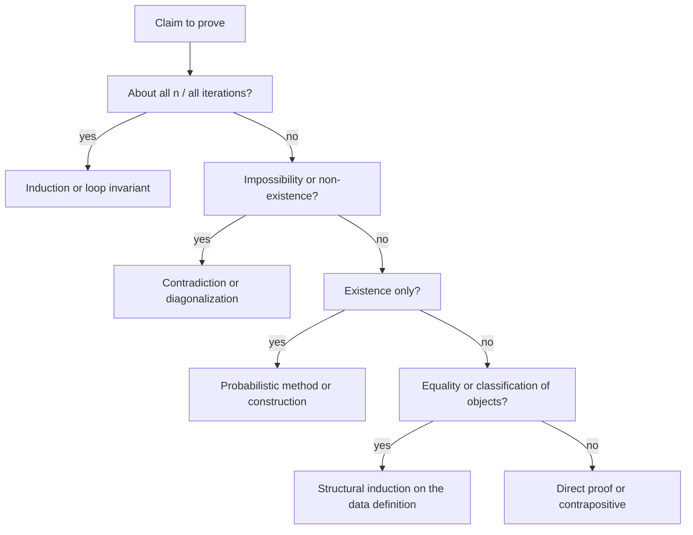

# Proof Techniques

## Overview

Interviews and systems work both reward the same skill: stating a claim precisely enough that the argument for it is short. This page catalogs the proof techniques with a canonical CS example for each, then drills the two that dominate systems correctness — loop invariants (induction over iterations) and structural induction (induction over data). It ends with fake proofs to calibrate your skepticism and 4-line templates you can reproduce under interview pressure.

## Technique Catalog

| Technique | Core move | Canonical CS example |
|---|---|---|
| Direct proof | Assume P, derive Q | n even ⇒ n² even; lower bound: each of n elements must be examined |
| Contrapositive | Prove ¬Q → ¬P instead of P → Q | If A ≤ₘ B and A is undecidable, then B is undecidable (non-reducibility direction) |
| Contradiction | Assume ¬C, derive ⊥ | Halting problem; √2 irrational; "greedy stays ahead" optimality |
| Induction (weak) | P(k) ⇒ P(k+1) | Loop invariant of insertion sort; Σ1..n = n(n+1)/2 |
| Strong induction | P(0)…P(k) ⇒ P(k+1) | Every n ≥ 2 factors into primes; Euclid's gcd terminates with a < b step |
| Structural induction | Case on constructors, assume subterms | Expression ASTs: eval correctness; #leaves = #internal + 1 in binary trees |
| Pigeonhole | Injection A→B ⇒ \|A\| ≤ \|B\| | Hash collisions; birthday bound; DFA path repeats a state (pumping lemma) |
| Diagonalization | Build an object differing from row i at column i | A_TM undecidable; Cantor: \|ℝ\| > \|ℕ\|; time/space hierarchy theorems |
| Probabilistic method | Show P(property) > 0 without exhibiting an object | Every graph has a cut ≥ half the edges (random assignment argument) |
| Exchange argument | Transform OPT into greedy, never losing value | Greedy interval scheduling; fractional vs integral optimality |

Two habits make the table usable. First, name the technique in interviews — "this is an exchange argument" signals rigor and structure faster than the derivation itself. Second, each technique has a *tell* for when to reach for it: universal claims over numbers suggest induction, impossibility suggests contradiction or diagonalization, and existence without construction suggests the probabilistic method (worked instances in [Randomized Algorithms](./randomized-algorithms.md), counting instances in [Sets, Relations & Functions](./sets-relations-functions.md)).



## Direct Proof

Assume P is true, prove Q is true.

**Example**: Prove "if n is even, then n² is even."
- Assume n is even: n = 2k for some integer k
- Then n² = (2k)² = 4k² = 2(2k²)
- Since 2k² is an integer, n² is even. ∎

## Proof by Contrapositive

To prove P→Q, prove the equivalent ¬Q→¬P.

**Example**: Prove "if n² is odd, then n is odd."
- Contrapositive: "if n is even, then n² is even"
- This is the direct proof above. ∎

## Proof by Contradiction

Assume the statement is false, derive a contradiction.

**Example**: Prove √2 is irrational.
- Assume √2 = p/q where p/q is in lowest terms
- Then 2 = p²/q², so p² = 2q²
- Thus p² is even, so p is even: p = 2k
- Then (2k)² = 2q² → 2k² = q² → q is even
- But then p/q is not in lowest terms — contradiction! ∎

CS version: the halting problem. Assume decider H exists, build D that loops iff H says its input halts, run D on D — D halts iff D does not halt. Contradiction, so H does not exist. The full derivation chain is in [Computability](./computability.md).

## Mathematical Induction

Prove P(n) for all n ≥ n₀:

1. **Base case**: Prove P(n₀)
2. **Inductive step**: Assume P(k) (inductive hypothesis), prove P(k+1)

**Example**: Prove 1+2+...+n = n(n+1)/2
- Base: n=1: 1 = 1(2)/2 ✓
- Assume: 1+2+...+k = k(k+1)/2
- Prove: 1+2+...+k+(k+1) = (k+1)(k+2)/2
  - = k(k+1)/2 + (k+1)
  - = (k+1)(k/2 + 1)
  - = (k+1)(k+2)/2 ✓ ∎

## Strong Induction

Assume P(n₀), P(n₀+1), ..., P(k) are all true, prove P(k+1).

**Example**: Every integer ≥ 2 has a prime factor.
- Base: 2 is prime, so it has a prime factor (itself).
- Assume true for all integers from 2 to k.
- If k+1 is prime, done. If composite, k+1 = ab where 2 ≤ a,b ≤ k.
- By hypothesis, a has a prime factor. This divides k+1. ∎

Strong and weak induction are equally powerful (either proves the other), but strong induction matches the natural structure of recursive algorithms: merge sort's correctness and termination are strong induction on input length (both halves are smaller, not just n−1), and Euclid's algorithm is strong induction on the smaller argument (it can drop by more than 1).

## Worked Induction: Loop Invariant Proof for Insertion Sort

Loop invariants are mathematical induction wearing a systems costume: the invariant plays P(k), loop iterations are the inductive step, and the *termination clause* — not the induction itself — extracts the correctness statement. CLRS prescribes exactly three parts:

```python
def insertion_sort(A):
    for j in range(1, len(A)):
        key = A[j]
        i = j - 1
        while i >= 0 and A[i] > key:
            A[i + 1] = A[i]
            i -= 1
        A[i + 1] = key
```

- **Invariant**: at the start of each iteration of the outer loop, `A[0..j-1]` consists of the *original* `A[0..j-1]` elements, in sorted order.
- **Initialization** (j = 1): the subarray `A[0..0]` is trivially sorted, and it holds the original element.
- **Maintenance**: if `A[0..j-1]` is sorted and holds the original elements, the while loop shifts every element greater than `key` one slot right, leaving a hole at the first element ≤ `key` (or index 0); placing `key` there yields a sorted `A[0..j]` still containing exactly the original j+1 elements.
- **Termination**: the loop ends with j = len(A); the invariant then says A[0..n−1] is sorted and holds the original elements — which *is* the correctness statement.

Two disciplines make this bulletproof in interviews: state the invariant *before* writing the proof, and make sure it is general enough to imply the final claim at termination (a weaker "first k elements are sorted" fails because it says nothing about which elements they contain). The same 4-part skeleton proves binary search invariants, Dijkstra's "settled set" invariant, and partition-correctness in quicksort.

## Structural Induction on Trees and ASTs

Structural induction replaces the n → n+1 step with the *constructor* structure of the data: to prove a property P(t) for all terms t, prove P for every base (leaf) form, assuming P of the immediate subterms for every composite form. No integers are involved; well-foundedness of the "subterm of" relation does the work, which is also why structural induction proves termination of recursive functions over inductive types.

**Worked example**: in a proper binary tree (every internal node has exactly 2 children), leaves = internal nodes + 1.

- Base: a single leaf — leaves = 1, internal = 0, and 1 = 0 + 1. ✓
- Step: a tree with root r and subtrees L, R. Assume the claim for L and R (this is where structural induction's "all subterms" hypothesis applies). If the whole tree has leaf count ℓ = ℓ_L + ℓ_R and internal count i = 1 + i_L + i_R (the root is internal), then ℓ_L + ℓ_R = i_L + i_R + 2 = (1 + i_L + i_R) + 1 = i + 1. ∎

**Compiler/PL example**: type preservation in a typed lambda calculus — "if Γ ⊢ e : τ and e → e′, then Γ ⊢ e′ : τ" — is proved by structural induction on the typing derivation (or evaluation context): each typing rule pairs with its operational rule, and substitution lemmas carry the load. Pierce's *Types and Programming Languages* organizes entire chapters around this pattern (https://www.cis.upenn.edu/~bcpierce/tapl/), and the proofs-as-programs reading of the same induction is [The Curry–Howard Correspondence](./curry-howard.md). In compiler interviews, "prove your AST rewrite is semantics-preserving by structural induction on expressions" is a standard senior-level prompt: enumerate the expression forms, give one case per form, and handle binders with a substitution lemma.

## Pigeonhole Principle

If n items are placed into m containers and n > m, then at least one container has more than one item.

**Applications**:
- In any group of 13 people, at least 2 share a birth month
- If you pick 5 numbers from {1,2,3,4}, at least two are equal
- Hash collisions are guaranteed when |keys| > |buckets|

The CS-generalized form: a DFA with p states that accepts a string of length ≥ p must revisit some state — the visited states are pigeons, positions are holes — which is exactly the pumping lemma's engine. The birthday bound (≈ 23 people for a 50% collision in 365 buckets, ≈ √m queries to break an m-bucket hash) is pigeonhole made quantitative; the derivation is in [Sets, Relations & Functions](./sets-relations-functions.md).

## Proof by Construction

Prove existence by constructing an example.

**Example**: Prove there exists an irrational number whose square is rational.
- Construct: x = √2 (irrational)
- x² = 2 (rational) ∎

## Fake Proofs: Calibrating Your Skepticism

Studying *broken* proofs is the fastest way to internalize where each technique's fine print lives. All three classics below appear in real code reviews disguised as performance or correctness claims.

**Fake 1 — "All horses are the same color" (induction).**
- Claim: in any set of n horses, all are the same color. Base n = 1: trivial. ✓
- Step: given n+1 horses, remove one to get n horses (same color by hypothesis); remove a *different* one to get another n-set (same color). Overlap joins everything, so all n+1 match. ∎?
- **Where it breaks**: at n = 2 the two (n)-subsets are {h₁} and {h₂} — the overlap is *empty*, so nothing joins. The inductive step silently assumes n ≥ 2. Lesson: check the step at the smallest size where its set-manipulation assumptions hold, not just the base case.

**Fake 2 — "1 = 2" (hidden division by zero).**
- Let a = b. Then a² = ab, so a² − b² = ab − b², so (a+b)(a−b) = b(a−b). Dividing both sides by (a−b): a + b = b. With a = b: 2b = b, so 1 = 2. ∎?
- **Where it breaks**: a − b = 0, and the division is by zero — an operation that is simply not legal. Lesson: every algebraic rewrite carries preconditions; in CS terms this is the "precondition violation" class of bug (dividing by a value an earlier step could zero out, e.g., normalizing a possibly-zero vector).

**Fake 3 — "1 + 2 + 4 + 8 + ⋯ = −1" (divergence breaks algebra).**
- Let S = 1 + 2 + 4 + 8 + ⋯. Then 2S = 2 + 4 + 8 + ⋯ = S − 1, so S = −1. ∎?
- **Where it breaks**: S is not a number — the series diverges, so S − 1 is not a legal subtraction, and S = −1 is meaningless. (The manipulation is *almost* right: it computes 1 + 2 + 4 + ⋯ in the 2-adics, where the value really is −1.) Lesson: "let S = ⋯" presupposes the limit exists; verify convergence (or finiteness of the quantity you are symbolically manipulating) before doing algebra on it. The CS flavor: this is exactly what happens when a saturating or overflowing counter is treated as a real number.

## Writing Proofs in Interviews: 4-Line Templates

Interview proofs should sound like lemmas, not essays. Four templates cover most asks:

```text
CORRECTNESS (loop/algorithm):
  Invariant: <property true at the top of each iteration>
  Init:      <it holds before iteration 1, trivially or by precondition>
  Maint:     <iteration j preserves it, using the loop body's semantics>
  Term:      <invariant + exit condition  =>  the required postcondition>
```

```text
EFFICIENCY (bound total cost):
  Charge:    <assign each elementary cost to a phase/element>
  Per-unit:  <each element pays O(1) per phase, ≤ P phases/levels>
  Sum:       <total ≤ Σ over levels = P · n  (telescope or level-sum)>
  Tighten:   <match with a lower bound or adversary argument if asked>
```

```text
GREEDY OPTIMALITY (exchange argument):
  Let OPT = o1, o2, ..., ok (an optimal solution)
  Compare:   greedy's first choice g1 is at least as good as o1 (<local dominance>)
  Exchange:  replace o1 with g1 in OPT — still feasible, value not decreased
  Induct:    repeat on the residual problem  =>  greedy is optimal
```

```text
LOWER BOUND (impossibility):
  Model:     <name it: comparison tree, I/O, messages>
  Count:     <#distinguishable inputs/outputs = N  (or adversary state)>
  Bound:     <any algorithm needs log2 N binary outcomes / N steps>
  Conclude:  <Ω(f(n)) in THIS model; name what breaks the model>
```

Use the template's discipline, then drop the scaffolding: "invariant: A[0..j−1] holds the original elements sorted; init trivially; maintenance because the shift leaves a hole after the first smaller element; termination with j = n gives sorted output."

## Common Mistakes in Induction

| Mistake | Example |
|---|---|
| Skipping base case | "Assume P(k), prove P(k+1)" without verifying P(0) |
| Circular reasoning | Using what you're trying to prove in the inductive step |
| Wrong base case | Proving for n=1 when the claim is for n≥0 |
| Weak hypothesis | Only assuming P(k) when you need strong induction |

## Interview Questions

**Q: When would you use strong induction vs regular induction?**
A: When the inductive step needs more than just P(k). Example: proving every integer ≥ 2 is a product of primes requires knowing the factorization of numbers smaller than k+1, not just k.

**Q: Use the pigeonhole principle to prove that in any group of 367 people, at least two share a birthday.**
A: There are 366 possible birthdays (including Feb 29). With 367 people and 366 possible birthdays, by the pigeonhole principle, at least two people must share a birthday.

**Q: What exactly is a loop invariant, and why do the four parts matter?**
A: A property true at the top of every iteration. Initialization shows it holds before the first iteration, maintenance that each iteration preserves it (this is the actual induction), and termination combines invariant + exit condition to yield the postcondition. Skipping termination is the classic mistake — an invariant that never implies the goal proves nothing. The format converts "it seems right" into a checkable argument in under a minute.

**Q: Prove that every binary tree with n internal nodes has n + 1 leaves.**
A: Structural induction. Base: a single leaf has 0 internal and 1 leaf (0 + 1 ✓). Step: a tree with root and subtrees L, R; by hypothesis leaves(L) = i(L) + 1 and leaves(R) = i(R) + 1. Then leaves(T) = i(L) + i(R) + 2 = (i(L) + i(R) + 1) + 1 = internal(T) + 1. ∎ Note the hypothesis is applied to both subtrees — structural induction on binary constructors needs the two-subterm version, not a chain from n to n+1.

**Q: Spot the bug: "the sum 1 + 2 + 4 + 8 + ... equals −1 because 2S = S − 1."**
A: The algebra is fine; the *precondition* fails — S is a divergent series, not a real number, so writing S and subtracting it is illegal. The same proof pattern (S = 1 + x + x² + ⋯ ⇒ S = 1/(1−x)) is valid only for |x| < 1, where the series converges. The general lesson: check that every operation used in a proof is defined on the values involved.

**Q: When is proof by contradiction better than contrapositive?**
A: Contrapositive only proves implications of the form P → Q, by deriving ¬Q → ¬P — it stays inside equivalent statements. Contradiction proves *any* statement C by deriving ⊥ from ¬C, which is strictly more flexible: you can mix the negation of the goal with your hypotheses and hunt for any inconsistency. Use contrapositive when the negation is cleaner to work with; use contradiction when you want to combine the negated goal with other assumptions (as in the halting proof, where the constructed adversary D is what generates the inconsistency).

## Key Takeaways

- Name the technique before the derivation — it structures the answer and signals rigor.
- Loop invariant proofs are induction with a termination clause; the invariant must be strong enough to imply the postcondition at exit.
- Structural induction handles trees, ASTs, and type derivations: one case per constructor, hypothesis on immediate subterms.
- Strong induction matches recursive algorithms whose subproblems shrink arbitrarily (merge sort, Euclid).
- Pigeonhole and its quantitative cousin (birthday bound) explain hash collisions and the DFA pumping lemma.
- Diagonalization and contradiction power the impossibility results — halting, A_TM, hierarchy theorems.
- Fake proofs fail at preconditions: empty overlap (n = 2 horses), division by zero, divergent series. Audit operations, not algebra.
- In interviews, use the 4-line templates: correctness (invariant/Init/Maint/Term), efficiency (charge/sum), greedy (exchange), lower bounds (model/count/conclude).

## References

- [MIT OCW 6.042J — Mathematics for CS](https://ocw.mit.edu/courses/6-042j-mathematics-for-computer-science-fall-2010/)
- How to Prove It: A Structured Approach (2nd ed.) — Daniel J. Velleman, Cambridge University Press, ISBN 978-0521675994
- [Types and Programming Languages — Benjamin C. Pierce (MIT Press)](https://www.cis.upenn.edu/~bcpierce/tapl/) — structural induction on typing derivations
- [Lectures on the Curry–Howard Isomorphism — Sørensen & Urzyczyn (Cambridge)](https://www.cambridge.org/core/books/lectures-on-the-curryhoward-isomorphism/)
- [Proofs and Types — Girard, Lafont & Taylor](http://www.paultaylor.eu/stable/Proofs+Types.html)
- Cormen, Leiserson, Rivest & Stein — *Introduction to Algorithms*, 4th ed., MIT Press — Chapter 2 (loop invariants) and Appendix I (proof techniques): https://mitpress.mit.edu/9780262046305/introduction-to-algorithms/

## Cross-References

- [Sets, Relations & Functions](./sets-relations-functions.md) — Cantor diagonalization worked and the pigeonhole/birthday derivations
- [Computability](./computability.md) — diagonalization as an undecidability machine
- [Logic](./logic.md) — the propositional and first-order substrate of every proof here
- [The Curry–Howard Correspondence](./curry-howard.md) — proofs as programs; induction as recursive datatypes
- [The Lambda Calculus](./lambda-calculus.md) — the smallest language whose properties are proved structurally
- [Coq and Lean](../formal-methods/coq-lean.md) — proof assistants that machine-check these techniques
- [Randomized Algorithms](./randomized-algorithms.md) — the probabilistic method in action
- [Comparison Sorting Lower Bound](./comparison-sorting-lower-bound.md) — decision-tree counting as a lower-bound template
