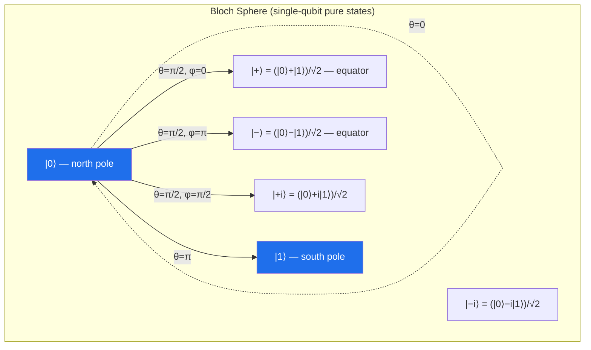
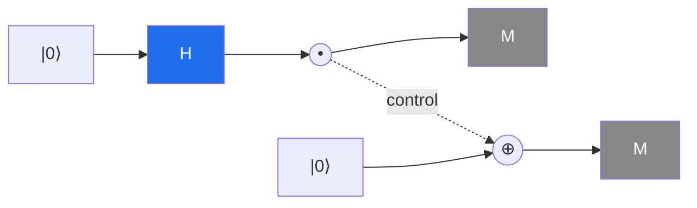
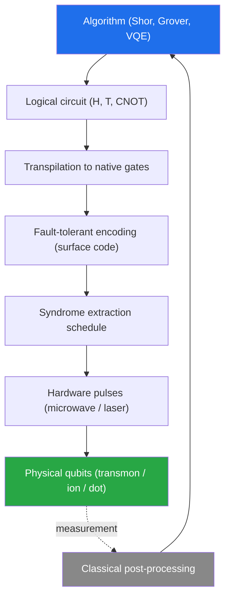

# Quantum Computing — Qubits, Circuits, Algorithms & the NISQ Era

## Overview

Quantum computing is a model of computation that exploits coherent superposition and entanglement of quantum-mechanical states to process information. The idea was first articulated by Richard Feynman in 1982 — "there is plenty of room at the bottom" — when he observed that simulating quantum systems on a classical computer appears to require exponential resources, and suggested that a computer built out of quantum components might do the job natively. David Deutsch formalized this in 1985 with the **universal quantum Turing machine** and the eponymous Deutsch–Jozsa algorithm, the first example of a problem a quantum machine could solve with fewer oracle queries than any classical deterministic algorithm.

The field remained mostly theoretical until Peter Shor's 1994 integer-factorization algorithm and Lov Grover's 1996 search algorithm demonstrated concrete, important problems where quantum computers offer a super-polynomial (Shor) or quadratic (Grover) speedup. Shor's result is the economic foundation of the entire industry: it would break RSA and elliptic-curve cryptography, motivating governments and large labs to invest in quantum hardware. Today the field is in the **NISQ era** (Noisy Intermediate-Scale Quantum, Preskill 2018) — machines with 50–1000 physical qubits, no error correction, and decoherence times measured in microseconds. Theorists distinguish this sharply from the **fault-tolerant** era that would be needed to run Shor's algorithm on cryptographically relevant keys (millions of physical qubits, with concatenated or surface-code error correction). Interviewers usually probe conceptual understanding — what a qubit *is*, why entanglement is not classical correlation, why Shor matters — rather than implementation details, so this page leans conceptual.

The Church–Turing thesis (see [Turing Machines](./turing-machines.md)) asserts that any effectively computable function is computable by a Turing machine; the **strong** Church–Turing thesis adds that any efficiently computable function is efficiently computable by a probabilistic Turing machine. Quantum computing challenges the *strong* form: factoring is in BQP but is *believed* not to be in BPP. The standard complexity-class relationship is $P \subseteq BPP \subseteq BQP \subseteq PSPACE$, with strict inclusion unknown for any of these. Whether $BPP = BQP$ is, in effect, the open question that decides whether the multi-billion-dollar quantum industry rests on a real computational advantage or merely on engineering novelty — and most complexity theorists believe the inclusion is strict, even though they cannot yet prove it.

> Related: [Complexity Classes](./complexity-classes.md) (BQP), [Proof Techniques](./proofs.md), [Formal Methods](./formal-methods.md), [Turing Machines](./turing-machines.md), [Memory Models & Concurrency](../concurrency/memory-model.md) (entanglement ≠ classical correlation), [Post-Quantum Cryptography](../cryptography/post-quantum.md)

## The Qubit and State Space

A classical bit is in one of two states, `0` or `1`. A **qubit** is a unit vector in a two-dimensional complex Hilbert space $\mathcal{H} = \mathbb{C}^2$. We fix an orthonormal basis $\{|0\rangle, |1\rangle\}$ (Dirac notation) and write

\\[|\psi\rangle = \alpha\,|0\rangle + \beta\,|1\rangle, \qquad \alpha, \beta \in \mathbb{C}, \qquad |\alpha|^2 + |\beta|^2 = 1.\\]

The normalization constraint reflects the probabilistic interpretation: when measured in the computational basis, the qubit yields `0` with probability $|\alpha|^2$ and `1` with probability $|\beta|^2$. The pair $(\alpha, \beta)$ has four real degrees of freedom; the normalization removes one and the global phase (which has no observable consequence) removes another, leaving **two real parameters**. A single qubit's pure state can therefore be visualized as a point on the unit sphere $S^2$, the **Bloch sphere**, with coordinates

\\[|\psi\rangle = \cos(\theta/2)\,|0\rangle + e^{i\varphi}\sin(\theta/2)\,|1\rangle.\\]

The Bloch vector $\vec{r} = (\sin\theta\cos\varphi,\; \sin\theta\sin\varphi,\; \cos\theta)$ points to the state on the sphere: $|0\rangle$ at the north pole, $|1\rangle$ at the south, equal superpositions on the equator. Mixed states live *inside* the ball, at radius equal to the state's purity. The Bloch sphere is an indispensable mental model: every single-qubit unitary is a rotation of this sphere, and reading a circuit reduces to composing rotations.

## Classical Bit vs Qubit

The contrast between a classical bit and a qubit is more than "a bit can also be 0 and 1 at once." Qubits differ along six independent axes — state space, allowed operations, measurement semantics, composition behavior, copying rules, and entanglement — and getting any of these wrong in an interview marks you as a tourist. The table below summarizes the contrast; the paragraphs that follow unpack the most consequential differences for algorithm design and complexity.

| Property | Classical bit | Qubit |
|---|---|---|
| State set | $\{0, 1\}$ (2 values) | Unit vectors in $\mathbb{C}^2$ (continuum) |
| Information content | 1 bit | Until measured, "hidden"; measurement yields 1 bit |
| Allowed operations | Any Boolean function (NOT, AND, OR…) | Unitary transformations $U \in U(2)$ (reversible); AND/OR not directly unitary |
| Measurement | Non-destructive read | Destructive — collapses state to basis vector |
| Composition of $n$ units | $2^n$ states, described by $n$ bits | $2^n$-dim Hilbert space, described by $2^n$ complex amplitudes |
| Copying | Trivial (`x = y`) | Forbidden (no-cloning theorem) |
| Entanglement | None — bits are independent | Possible; entangled states have no classical analog |

The exponential growth of the state space ($2^n$ amplitudes for $n$ qubits) is the source of every quantum speedup — and the source of the most common misunderstanding. A quantum computer does *not* "try all $2^n$ answers in parallel and pick the best one." That would require reading out $2^n$ amplitudes, which a single measurement cannot do. Speedups come from carefully designed interference: amplitudes for wrong answers are made to cancel, while amplitudes for the right answer reinforce.

The reversibility constraint is equally important. Quantum gates are unitary, hence invertible; classical gates like AND and OR are not invertible (they map two inputs to one output). This is why Toffoli (controlled-controlled-NOT) appears in the universal set: it is the reversible version of AND, with an extra "garbage" output that preserves bijectivity. Any classical circuit can be made reversible at constant overhead, so this is not a fundamental restriction — but it does change how one thinks about circuit design.

## Superposition

Superposition is the property that a qubit can be in any complex linear combination of $|0\rangle$ and $|1\rangle$, not just one or the other. The Hadamard gate $H$ produces the canonical equal superposition:

\\[H|0\rangle = \frac{|0\rangle + |1\rangle}{\sqrt{2}}, \qquad H|1\rangle = \frac{|0\rangle - |1\rangle}{\sqrt{2}}.\\]

Applied to $n$ qubits all initialized to $|0\rangle^{\otimes n}$, a layer of $n$ Hadamards produces a uniform superposition over all $2^n$ basis states:

\\[|0\rangle^{\otimes n} \;\xrightarrow{H^{\otimes n}}\; \frac{1}{\sqrt{2^n}}\sum_{x \in \{0,1\}^n} |x\rangle.\\]

This is the standard starting point for Shor, Grover, quantum phase estimation, and most quantum algorithms. The crucial subtlety is that *superposition is not parallelism in the classical sense*. A measurement collapses the state to a single basis vector drawn from the Born distribution $|\alpha_x|^2$; you do not get to inspect all $2^n$ amplitudes. Algorithms must exploit interference — the fact that amplitudes are complex numbers that can add constructively or destructively — to amplify the probability of the desired answer before measurement. This is why quantum algorithm design is hard: most naive "try everything at once" approaches do not produce useful interference and offer no speedup over classical random sampling.

## Entanglement — Bell States and EPR

Two qubits are **entangled** when their joint state cannot be written as a tensor product $|\psi\rangle \otimes |\phi\rangle$ of individual qubit states. The canonical example is the Bell state

\\[|\Phi^+\rangle = \frac{|00\rangle + |11\rangle}{\sqrt{2}}.\\]

Measuring the first qubit yields `0` or `1` with equal probability; *conditional* on that outcome, the second qubit is *guaranteed* to match. This perfect correlation holds regardless of the spatial separation between the qubits, which is what made Einstein, Podolsky, and Rosen (EPR, 1935) uncomfortable — they called it "spooky action at a distance" and argued it implied quantum mechanics was incomplete. Bell's 1964 theorem and the subsequent experiments (Aspect 1982, Hensen 2015, the 2022 Nobel Prize to Aspect, Clauser, and Zeilinger) showed that **no local hidden-variable theory** can reproduce the correlations predicted by quantum mechanics. Bell's inequality is violated by entangled quantum states but satisfied by any classically correlated ensemble.

The four Bell states form an orthonormal basis of the two-qubit space:

\\[|\Phi^\pm\rangle = \tfrac{1}{\sqrt{2}}(|00\rangle \pm |11\rangle), \qquad |\Psi^\pm\rangle = \tfrac{1}{\sqrt{2}}(|01\rangle \pm |10\rangle).\\]

It is critical to understand that entanglement is *not* classical correlation. A classical mixture of $|00\rangle$ and $|11\rangle$ with probability $1/2$ each also produces matching outcomes on measurement — but it cannot violate Bell's inequality, and it admits a local hidden-variable model. The distinction is in the **interference** statistics: only the coherent superposition $|\Phi^+\rangle$ produces the characteristic $\cos^2(\theta/2)$ correlations when measured along arbitrary axes. This is the same conceptual pitfall as conflating mutex-protected shared state with message passing — see [Memory Models](../concurrency/memory-model.md) for that analogy. Entanglement is a *resource*: it enables teleportation, superdense coding, quantum key distribution, and is the substrate of most quantum speedups.

## Quantum Gates and the Circuit Model

A quantum gate is a **unitary** operator $U$ acting on one or more qubits. Unitarity ($U^\dagger U = I$) is forced on us by the requirement that the evolution preserve total probability — it is the quantum analog of "reversible classical computation." A quantum circuit is a directed acyclic graph of gates applied left-to-right; the circuit is read like sheet music, with time flowing left to right and one wire per qubit. The standard universal gate set is any set whose generated group is dense in $U(2^n)$; the most commonly cited are `{H, T, CNOT}` (Clifford + T) and `{H, Toffoli}` (Shi 2003). The Clifford gates alone are efficiently classically simulable (Gottesman–Knill theorem), so non-Clifford gates like $T$ are essential for computational universality and are the most expensive to implement fault-tolerantly.

| Gate | Symbol | Matrix | Action |
|---|---|---|---|
| Pauli-$X$ (NOT) | $X$ | $\begin{pmatrix}0&1\\1&0\end{pmatrix}$ | Bit flip: $|0\rangle\!\leftrightarrow\!|1\rangle$ |
| Pauli-$Y$ | $Y$ | $\begin{pmatrix}0&-i\\i&0\end{pmatrix}$ | Bit + phase flip |
| Pauli-$Z$ | $Z$ | $\begin{pmatrix}1&0\\0&-1\end{pmatrix}$ | Phase flip: $|1\rangle\!\to\!-|1\rangle$ |
| Hadamard | $H$ | $\tfrac{1}{\sqrt 2}\!\begin{pmatrix}1&1\\1&-1\end{pmatrix}$ | Creates superposition |
| Phase $S$ | $S$ | $\begin{pmatrix}1&0\\0&i\end{pmatrix}$ | $\pi/2$ phase on $|1\rangle$ |
| Phase $T$ | $T$ | $\begin{pmatrix}1&0\\0&e^{i\pi/4}\end{pmatrix}$ | $\pi/4$ phase; non-Clifford |
| CNOT | $\oplus$ | $4{\times}4$ controlled-$X$ | Flips target iff control is $|1\rangle$; entangling |
| Toffoli | CCX | $8{\times}8$ controlled-controlled-$X$ | Universal for classical reversible logic |
| SWAP | $\times$ | $4{\times}4$ permutation | Exchanges two qubits |

The Hadamard–CNOT pattern below produces a Bell state from $|00\rangle$: the $H$ puts qubit 0 into $|+\rangle$, then the CNOT correlates qubit 1 with it.

Reading the circuit: $|00\rangle \xrightarrow{H\otimes I} \tfrac{1}{\sqrt 2}(|00\rangle+|10\rangle) \xrightarrow{\text{CNOT}} \tfrac{1}{\sqrt 2}(|00\rangle+|11\rangle) = |\Phi^+\rangle$.

## Measurement and the Born Rule

Measurement is the only **non-unitary**, **irreversible** operation in the quantum circuit model. The Born rule says: if the state is $|\psi\rangle = \sum_x \alpha_x |x\rangle$ and we measure in the computational basis, the outcome is $x$ with probability $|\alpha_x|^2$, and the post-measurement state *collapses* to $|x\rangle$. Repeated measurement of identically prepared states therefore samples the distribution $|\alpha_x|^2$ — a single shot reveals only one bit (per qubit) of information.

Two consequences dominate algorithm design. First, **you cannot read out the amplitudes directly**: an $n$-qubit state has $2^n$ complex amplitudes but a measurement gives at most $n$ classical bits. Any algorithm that hopes to extract a specific answer must use interference to concentrate the probability mass on that answer before measurement. Second, **intermediate measurement destroys superposition**: if you peek at a qubit halfway through a circuit, the rest of the evolution proceeds on a definite classical state, and any entanglement with that qubit is severed. This is why quantum circuits are drawn as fully coherent unitaries followed by a final measurement; mid-circuit measurement is used only in specialized protocols (measurement-based computing, error syndrome extraction, teleportation). The no-communication theorem guarantees that measuring one half of an entangled pair cannot transmit information to the other half — entanglement alone is not a channel, a point often confused with the EPR paradox.

## The No-Cloning Theorem

The no-cloning theorem (Wootters, Zurek, Dieks, 1982) states that there is no unitary $U$ such that $U|\psi\rangle|0\rangle = |\psi\rangle|\psi\rangle$ for all $|\psi\rangle$. Proof by contradiction in two lines: if such a $U$ existed, then for any $|\psi\rangle, |\phi\rangle$ we would have $\langle\psi|\phi\rangle = \langle\psi|\phi\rangle^2$, which forces $|\langle\psi|\phi\rangle| \in \{0,1\}$ — but the set of qubit states is connected, so this cannot hold for arbitrary pairs.

The theorem has deep consequences: it rules out naive amplification of quantum signals (you cannot "fan out" a qubit the way you fan out a classical bit), it underwrites the security of quantum key distribution (an eavesdropper cannot copy qubits in transit without disturbing them, leaving detectable traces), and it forces quantum error correction into a *redundant encoding* paradigm rather than a *copy-and-backup* paradigm. Classical repetition codes work by copying; quantum codes work by distributing the logical information across entangled physical qubits so that errors can be detected through syndrome measurements *without* ever learning the logical state directly. This is the operational reason that quantum error correction is so much harder than classical error correction, and why the physical-qubit overhead per logical qubit is so high (typically $10^3$–$10^4$ with surface codes).

## Quantum Teleportation

Quantum teleportation (Bennett et al., 1993) transfers an *unknown* quantum state from one qubit to another using a shared Bell pair and two classical bits — circumventing the no-cloning theorem because the original state is destroyed in the process. The protocol is the cleanest illustration of entanglement as a resource and is the building block of quantum repeaters in long-distance quantum networks. Alice holds the state $|\psi\rangle$ to be sent and one half of a Bell pair shared with Bob; she performs a Bell-basis measurement on her two qubits (implementable as a CNOT followed by an $H$, then a computational-basis measurement), obtaining two classical bits. She sends these bits to Bob over a classical channel. Depending on the bits, Bob applies one of $\{I, X, Z, XZ\}$ to his qubit, recovering $|\psi\rangle$.

Crucially, the classical bits alone reveal nothing about $|\psi\rangle$ (they are uniformly random), and Bob's qubit alone reveals nothing before the correction is applied. The information is "in the entanglement," not in either subsystem — a fact that demonstrates the principle that an entangled state has properties irreducible to its parts. Teleportation does not transmit information faster than light: Bob cannot recover the state until Alice's two classical bits arrive, which respects the speed-of-light bound. The same circuit pattern underlies cluster-state (measurement-based) quantum computing and the gate teleportation technique used to implement non-Clifford gates fault-tolerantly.

## Shor's Algorithm — Integer Factorization

Shor's algorithm (1994) factors an $n$-bit integer $N$ in time $O((\log N)^3)$ — polynomial in the input size. The best known classical algorithm, the general number field sieve, runs in subexponential time $2^{O((\log N)^{1/3}(\log\log N)^{2/3})}$, which is still exponential for cryptographically relevant sizes. This is the gap that breaks RSA: a 2048-bit modulus, which would take astronomical time classically, is in principle factorable by Shor's algorithm on a sufficiently large fault-tolerant quantum computer. The algorithm reduces factorization to **order-finding** — given $a$ coprime to $N$, find the smallest $r$ such that $a^r \equiv 1 \pmod N$. Classical reductions turn this into period finding on the function $f(x) = a^x \bmod N$, and the quantum Fourier transform (QFT) extracts the period in polynomial time.

| Problem | Best classical | Quantum (Shor) | Speedup |
|---|---|---|---|
| Integer factorization | $2^{O((\log N)^{1/3})}$ (NFS) | $O((\log N)^3)$ | Super-polynomial |
| Discrete log (finite fields) | $2^{O((\log p)^{1/3})}$ | $O((\log p)^3)$ | Super-polynomial |
| Discrete log (elliptic curves) | $O(\sqrt p)$ (BSGS, Pollard rho) | $O((\log p)^3)$ | Super-polynomial |

The catch is the resource cost. Running Shor's algorithm on a 2048-bit RSA modulus requires on the order of $20$ million noisy physical qubits and 8 hours of runtime with current surface-code schemes (Gidney & Ekerå, 2019) — three to four orders of magnitude beyond present-day hardware. This is the gap between the NISQ era and the fault-tolerant era, and the reason post-quantum cryptography (lattice-based, hash-based, code-based — see [Post-Quantum Cryptography](../cryptography/post-quantum.md)) is being standardized *now*, before any such machine exists. Theorists regard Shor's algorithm as the existence proof that quantum advantage is real, even if its practical impact lies a decade or more out.

## Grover's Algorithm — Unstructured Search

Grover's algorithm (1996) searches an unsorted database of $N$ items for a marked entry, using $O(\sqrt N)$ oracle queries versus the classical $\Omega(N)$. The speedup is *quadratic*, not super-polynomial, but it is provably optimal: Bennett, Bernstein, Brassard, and Vazirani (1997) showed that any quantum algorithm for unstructured search needs $\Omega(\sqrt N)$ queries. This optimality result is the quantum analog of the $\Omega(n \log n)$ comparison-sorting lower bound (see [Comparison Sorting Lower Bound](./comparison-sorting-lower-bound.md)) and is one of the few tight quantum lower bounds known.

The algorithm maintains a uniform superposition over all $N$ indices, then repeatedly applies the **Grover iterate**: an oracle that flips the phase of the marked state, followed by the **diffusion operator** $2|s\rangle\langle s| - I$ which reflects about the average amplitude. Each iteration rotates the state vector by $2\arcsin(1/\sqrt N)$ toward the marked state; after approximately $\frac{\pi}{4}\sqrt N$ iterations, the probability of measuring the marked index exceeds $1/2$. The geometric picture — a rotation in the two-dimensional subspace spanned by the marked state and the uniform superposition — is the standard intuition. Grover's algorithm applies to **any** problem expressible as "find an input satisfying a predicate," which includes SAT, collision finding, and many optimization problems. For NP-complete problems it gives a quadratic speedup over brute force — useful but not transformative; it does *not* imply $NP \subseteq BQP$.

## Quantum Phase Estimation

Phase estimation (Kitaev, 1995; Cleve et al., 1998) is the workhorse primitive behind Shor's algorithm, quantum simulation, and the HHL algorithm for linear systems. Given a unitary $U$ with eigenvector $|u\rangle$ and eigenvalue $e^{2\pi i \varphi}$ (so $U|u\rangle = e^{2\pi i \varphi}|u\rangle$), phase estimation outputs an $n$-bit approximation to $\varphi \in [0,1)$ using $n$ evaluation qubits and controlled-$U^{2^k}$ operations. The circuit prepares a uniform superposition on the evaluation register, applies controlled powers of $U$ to the eigenstate register, then applies the inverse quantum Fourier transform (QFT) to read out $\varphi$ in the computational basis.

The key insight is that the controlled-$U^{2^k}$ operations encode the phase into the *relative* phases of the evaluation register, which the inverse QFT then converts into bitstring amplitudes. The accuracy scales as $O(1/2^n)$ with $n$ evaluation qubits, and the success probability can be boosted by repeating or by using classical post-processing on multiple shots. Shor's algorithm uses phase estimation on the unitary $U|x\rangle = ax \bmod N$ to find the order $r$ of $a$ modulo $N$ — which then yields a non-trivial factor of $N$ via $\gcd(a^{r/2} \pm 1, N)$ with high probability. The QFT itself is polynomial-depth ($O(n^2)$ gates), and its efficient implementation is what makes the whole approach tractable.

## Quantum Error Correction

Physical qubits are noisy: decoherence times are short ($10$–$100\,\mu s$ for superconducting), gate error rates are around $10^{-3}$ to $10^{-4}$, and measurement is slow and error-prone. A useful quantum computer must achieve logical error rates of $10^{-15}$ or lower — many orders of magnitude below the physical rates. Quantum error correction (QEC) achieves this by encoding a logical qubit into many physical qubits in a way that errors can be detected and corrected *without* measuring the encoded state (which would collapse it). The trick is to measure **syndromes** — parity checks that reveal which error has occurred without revealing any information about the logical state, by design.

The **Shor code** (1995) is the first example: it concatenates a bit-flip code with a phase-flip code, using 9 physical qubits per logical qubit, and corrects arbitrary single-qubit errors. The **Steane code** (7 qubits) and **Laflamme et al.** (5 qubits) are more efficient. Modern fault-tolerant architectures are built on the **surface code** (Bravyi & Kitaev, 1998; Fowler et al., 2012), a topological code defined on a 2D lattice of physical qubits with local stabilizer checks. The surface code tolerates relatively high physical error rates (the threshold is around $1\%$) and is the leading candidate for large-scale quantum computing because its checks are geometrically local — essential for superconducting and trapped-ion hardware where long-range coupling is expensive. The cost is enormous: roughly $10^3$ to $10^4$ physical qubits per logical qubit, so a million-qubit machine yields only $\sim 10^2$ to $10^3$ logical qubits — barely enough for Shor.

| Code | Physical qubits / logical | Distance | Corrects | Notes |
|---|---|---|---|---|
| Shor 9-qubit | 9 | 3 | Arbitrary single-qubit errors | First QEC code, concatenation of bit/phase flip |
| Steane [[7,1,3]] | 7 | 3 | Arbitrary single-qubit errors | CSS code, naturally fault-tolerant |
| 5-qubit [[5,1,3]] | 5 | 3 | Arbitrary single-qubit errors | Smallest possible |
| Surface code | $O(d^2)$ | $d$ | $\lfloor(d-1)/2\rfloor$ errors | Topological, local checks, leading FT candidate |
| Color code | $O(d^2)$ | $d$ | $\lfloor(d-1)/2\rfloor$ errors | Topological, transversal Clifford |

The **threshold theorem** (Aharonov & Ben-Or, Knill, Laflamme, Zurek) is the foundational result: if the physical error rate is below a threshold (around $1\%$ for the surface code), then arbitrarily long quantum computations can be performed with arbitrarily low logical error rate, at polylogarithmic overhead. This theorem is what makes the entire fault-tolerant era plausible in principle — without it, scaling would be hopeless.

## The NISQ Era and Quantum Supremacy

Preskill (2018) coined **NISQ** — Noisy Intermediate-Scale Quantum — to describe the era we are in: machines with 50–1000 physical qubits, no error correction, and gate fidelities around $99\%$ to $99.9\%$. NISQ devices cannot run Shor's algorithm on cryptographically relevant inputs, but they may be useful for variational algorithms (VQE, QAOA) in quantum chemistry and combinatorial optimization, where the circuit is shallow enough that noise does not entirely overwhelm the signal. The evidence for practical NISQ advantage in these applications is mixed and remains an active research area.

**Quantum supremacy** (or **quantum advantage**) is the demonstration that a quantum device can perform some task — not necessarily useful — that is infeasible for any classical supercomputer. Google's Sycamore experiment (Arute et al., Nature, October 2019) claimed supremacy on the task of sampling random quantum circuits: 53 qubits, depth 20, in 200 seconds, with an extrapolated classical cost of 10 000 years. IBM contested the classical estimate (arguing it could be done in days with better simulation), but the broader community accepted the result as a milestone. Later work (2021–2023) extended the lead. The task is *not* useful in itself — it is a benchmark — but it demonstrates that quantum hardware has crossed a regime where naive classical simulation is intractable, a precondition for any future useful advantage.

```mermaid
graph LR
    subgraph N["NISQ era (2018–present)"]
        N1["50–1000 physical qubits"]
        N2["No error correction"]
        N3["Gate error ~1e-3"]
        N4["Decoherence ~100 µs"]
        N5["Variational algorithms (VQE, QAOA)"]
        N6["Supremacy demos"]
    end
    subgraph F["Fault-tolerant era (future)"]
        F1["10^6+ physical qubits"]
        F2["Logical qubits (surface code)"]
        F3["Logical error ~1e-15"]
        F4["Shor, Grover at scale"]
        F5["Quantum chemistry simulations"]
        F6["Cryptanalysis"]
    end
    N -->|"Threshold theorem + scaling"| F
    style N fill:#fff3cd
    style F fill:#d4edda
```

## Hardware Platforms

No single hardware modality has won. Each has different trade-offs in qubit count, gate fidelity, coherence time, connectivity, and manufacturability. The choice of modality constrains which codes and which algorithms are practical — for example, the surface code assumes a 2D nearest-neighbor grid, which fits superconducting qubits naturally but requires adaptation for trapped-ion all-to-all connectivity.

| Platform | Qubit carrier | Coherence | 2-qubit gate fidelity | Connectivity | Notable players |
|---|---|---|---|---|---|
| Superconducting | Josephson junctions | $50$–$200\,\mu s$ | $99\%$–$99.5\%$ | Nearest-neighbor (grid) | IBM, Google, Rigetti, IQM |
| Trapped ion | Atomic ion states | $1$–$10\,s$ | $99.5\%$–$99.9\%$ | All-to-all | IonQ, Quantinuum, Alpine QT |
| Photonic | Single photons | Long (in transit) | Limited by sources | Linear-optical, low | PsiQuantum, Xanadu |
| Neutral atom | Alkali atoms in optical tweezers | $1\,s$+ | $99\%$–$99.5\%$ | Reconfigurable | QuEra, Pasqal, Atom Computing |
| Topological | Majorana zero modes | Theoretically long | N/A (still research) | Intrinsic protection | Microsoft Station Q |
| Silicon spin | Electron spins in quantum dots | $1$–$10\,ms$ | $99\%$+ | CMOS-compatible | Intel, Diraq |

Topological qubits (Microsoft's bet) aim to encode information non-locally in Majorana zero modes, providing intrinsic protection against local noise. As of 2024, no topological qubit has been definitively demonstrated, though Microsoft has reported progress on device physics. The bet is that if it works, the overhead for fault tolerance collapses dramatically — perhaps to $10$–$100$ physical qubits per logical, instead of $10^4$. If it does not work, the field will rely on surface-code-based architectures.

Superconducting qubits lead on qubit count and gate speed (nanosecond-scale gates) but suffer from short coherence and the need for dilution refrigerators ($\sim 10\,mK$). Trapped ions lead on coherence (seconds) and gate fidelity (often above $99.9\%$ for two-qubit gates) and have native all-to-all connectivity, but gate speeds are slower (microseconds) and ion chains are harder to scale beyond $\sim 50$ ions per trap. Neutral-atom arrays have emerged as a credible third modality because they combine long coherence with reconfigurable optical-tweezer connectivity — moving atoms between zones mid-circuit is a unique capability. Photonic platforms promise room-temperature operation and native networkability (essential for distributed quantum computing and quantum repeaters) but are limited by probabilistic photon sources and the difficulty of deterministic two-photon gates, which forces them into measurement-based computational patterns.

## Quantum Complexity — BQP

**BQP** (Bounded-error Quantum Polynomial time) is the class of decision problems solvable by a quantum computer in polynomial time with error probability at most $1/3$. It is the quantum analog of BPP. Known inclusions:

\\[P \subseteq BPP \subseteq BQP \subseteq PSPACE, \qquad BQP \subseteq PP.\\]

Whether $BPP = BQP$ is open — but Shor's factoring algorithm is strong evidence that the inclusion is strict (since factoring is in BQP but is *believed* not to be in BPP, otherwise RSA would already be broken classically). See [Complexity Classes](./complexity-classes.md) for the full landscape. BQP is not known to contain NP, and most complexity theorists believe $NP \not\subseteq BQP$ — Grover's quadratic speedup over brute force is consistent with this, but the absence of any polynomial-time quantum algorithm for SAT after 30 years of effort is telling. The relationship between BQP and the polynomial hierarchy (PH) is also subtle: there exist oracle separations showing BQP is not in PH (Aaronson's "Forrelation" problem, 2010).

## Quantum Cryptography

Quantum cryptography exploits the no-cloning theorem and the disturbance caused by measurement to enable tasks impossible classically. The canonical example is **BB84** (Bennett & Brassard, 1984) quantum key distribution: Alice sends randomly-polarized qubits to Bob; they publicly compare bases (not values), discard mismatches, and check for eavesdropping by testing a subset for disturbance. Any eavesdropper measuring in transit collapses states and is detected with probability exponentially close to 1. BB84 is provably information-theoretically secure — its security rests on the laws of physics, not on computational assumptions, which is the qualitative difference from RSA and even from post-quantum lattice cryptography. Practical QKD networks exist (Tokyo, Geneva, China's Beijing–Shanghai link), but adoption is limited by distance (loss in fiber), the need for trusted nodes or quantum repeaters, and the fact that the *classical* infrastructure around the QKD link is still vulnerable.

## Software Stack — Qiskit, Cirq, and Friends

Practitioners rarely write quantum circuits at the gate matrix level. The two dominant open-source frameworks are **Qiskit** (IBM, Python, the de facto teaching standard with the accompanying Qiskit Textbook) and **Cirq** (Google, Python, used for Sycamore experiments). PennyLane (Xanadu) targets quantum machine learning, Strawberry Fields targets photonic, and QuTiP is a lower-level simulation library. A typical workflow: write a circuit in Qiskit, simulate it on a classical machine (statevector or shot-based), then submit the same circuit to IBM Quantum hardware via the cloud. Compilation (transpilation in Qiskit) maps the logical circuit to the hardware's native gate set and connectivity, respecting timing constraints and optimizing for depth. For fault-tolerant targets, the compilation pipeline also includes the surface-code encoding, syndrome extraction scheduling, and magic-state distillation for non-Clifford gates — a research field in itself.

The classical side of a quantum program is not negligible. Variational algorithms like VQE and QAOA run a hybrid loop: a quantum circuit evaluates an expectation value (e.g., the energy of a molecular Hamiltonian), and a classical optimizer (COBYLA, SPSA, L-BFGS) updates the circuit parameters. The quantum part is shallow — a few hundred gates — to stay within coherence, but the classical optimization can require thousands of iterations. This hybrid model is the realistic NISQ pattern: small quantum subroutines embedded in a classical control loop, with the quantum part providing a subroutine the classical part cannot simulate efficiently (hopefully). Whether this hybrid pattern produces a useful advantage for any practically relevant problem remains the central open question of the NISQ era — current evidence is mixed, with leading candidates in quantum chemistry (ground-state energy of small molecules) and combinatorial optimization (MaxCut via QAOA), but no convincing demonstration of advantage over the best classical heuristics on production-scale inputs.

## Interview Questions

**Q: What is a qubit, and how is it different from a classical bit?**
A: A classical bit is in one of two states; a qubit is a unit vector in a two-dimensional complex Hilbert space, written $|\psi\rangle = \alpha|0\rangle + \beta|1\rangle$ with $|\alpha|^2 + |\beta|^2 = 1$. A qubit can be in superposition, but measurement collapses it to a single classical bit. The state space of $n$ qubits has $2^n$ complex amplitudes — the source of every quantum speedup.

**Q: What is entanglement, and how do you know it's not just classical correlation?**
A: Entanglement is a joint state that cannot be written as a tensor product of individual qubit states, e.g. $|\Phi^+\rangle = (|00\rangle+|11\rangle)/\sqrt2$. Bell's theorem shows entangled states violate an inequality that any local hidden-variable (classical) theory must satisfy. The Aspect and Hensen experiments confirmed the violation experimentally — so entanglement is genuinely non-classical, not just a probabilistic mixture. See [Memory Models](../concurrency/memory-model.md) for the related classical distinction between shared-state and message-passing concurrency.

**Q: Why can't you clone an unknown quantum state?**
A: The no-cloning theorem. If a unitary $U$ satisfied $U|\psi\rangle|0\rangle = |\psi\rangle|\psi\rangle$ for all $|\psi\rangle$, then by linearity $\langle\psi|\phi\rangle = \langle\psi|\phi\rangle^2$, forcing $|\langle\psi|\phi\rangle| \in \{0,1\}$ — impossible for the continuum of qubit states. This forbids naive signal amplification and underlies QKD security.

**Q: What does Shor's algorithm do, and why does it matter?**
A: It factors an $n$-bit integer in $O((\log N)^3)$ time by reducing factorization to period finding and using the quantum Fourier transform to extract the period. The best classical algorithm is subexponential. This polynomial-vs-subexponential gap is what threatens RSA — and is the reason NIST is standardizing post-quantum cryptography now, before any sufficiently large fault-tolerant quantum computer exists.

**Q: How does Grover's algorithm achieve a quadratic speedup, and why is it optimal?**
A: Grover's iterate (phase oracle + diffusion) rotates the state vector toward the marked state by $2\arcsin(1/\sqrt N)$ per step, so $O(\sqrt N)$ iterations suffice. The BBBV lower bound shows $\Omega(\sqrt N)$ queries are necessary — any quantum unstructured-search algorithm needs at least that many, so Grover is asymptotically tight.

**Q: Why is quantum error correction so hard, given that classical error correction is routine?**
A: Two reasons: (1) the no-cloning theorem forbids simple repetition codes — you cannot copy a qubit; (2) measurement disturbs the state, so you cannot read the qubit to check for errors. QEC works by encoding logical information across entangled physical qubits and measuring only *syndromes* — parity checks that reveal the error without revealing the logical state. The surface code achieves this with $O(d^2)$ physical qubits per logical qubit at distance $d$.

**Q: What is the NISQ era, and what is it good for?**
A: Noisy Intermediate-Scale Quantum (Preskill 2018): 50–1000 physical qubits, no error correction, gate error rates around $10^{-3}$. NISQ machines cannot run Shor at scale but may offer advantage on variational algorithms (VQE, QAOA) for chemistry and optimization, where shallow circuits limit noise exposure. Demonstrated quantum supremacy (Google Sycamore 2019) is a benchmark, not a useful computation.

**Q: Is quantum computing going to break all of cryptography?**
A: No, only specific schemes. Shor breaks RSA, DH, and ECC — anything based on factoring or discrete log. Symmetric ciphers (AES) and hashes (SHA-2) are only quadratically weakened by Grover (so AES-256 becomes effectively AES-128). Lattice-based, hash-based, and code-based schemes are believed quantum-resistant and are being standardized by NIST (see [Post-Quantum Cryptography](../cryptography/post-quantum.md)).

**Q: What is the threshold theorem and why is it foundational for quantum computing?**
A: The threshold theorem (Aharonov & Ben-Or; Knill, Laflamme, Zurek) states that if the physical error rate per gate is below a threshold (around $1\%$ for the surface code), then arbitrarily long quantum computations can be performed with arbitrarily low logical error rate at polylogarithmic overhead in the computation length. Without this theorem, scaling would be hopeless — noise would accumulate and destroy any long computation. With it, scaling becomes "merely" an enormous engineering problem rather than a fundamental barrier.

**Q: Compare superconducting, trapped-ion, and photonic quantum computers.**
A: Superconducting (IBM, Google) leads on qubit count and nanosecond gate speeds but suffers from short coherence ($\sim 100\,\mu s$) and cryogenic requirements. Trapped ions (IonQ, Quantinuum) lead on coherence (seconds) and gate fidelity ($>99.9\%$) with all-to-all connectivity but are slower per gate and harder to scale per trap. Photonics (PsiQuantum, Xanadu) promise room-temperature operation and native networkability but are limited by probabilistic sources and require measurement-based computing. None is clearly dominant; the field is still searching for the right modality.

## References

- Nielsen, M. A. & Chuang, I. L. *Quantum Computation and Quantum Information*, 10th Anniversary Edition. Cambridge University Press, 2010. ISBN 978-1-107-00217-3.
- Feynman, R. P. "Simulating Physics with Computers." *International Journal of Theoretical Physics* 21 (1982): 467–488.
- Deutsch, D. "Quantum Theory, the Church–Turing Principle and the Universal Quantum Computer." *Proceedings of the Royal Society A* 400 (1985): 97–117.
- Shor, P. W. "Polynomial-Time Algorithms for Prime Factorization and Discrete Logarithms on a Quantum Computer." *SIAM J. Comput.* 26(5) (1997): 1484–1509. (Original conference paper 1994.)
- Grover, L. K. "A Fast Quantum Mechanical Algorithm for Database Search." *STOC* 1996: 212–219.
- Preskill, J. "Quantum Computing in the NISQ era and Beyond." *Quantum* 2 (2018): 79.
- Arute, F. et al. "Quantum Supremacy Using a Programmable Superconducting Processor." *Nature* 574 (2019): 505–510.
- Gidney, C. & Ekerå, M. "How to Factor 2048-bit RSA Integers in 8 Hours Using 20 Million Noisy Qubits." *Quantum* 5 (2021): 433.
- [Qiskit Textbook](https://qiskit.org/textbook/) — IBM's open online quantum computing course.
- [IBM Quantum Documentation](https://docs.quantum-computing.ibm.com/) — Platform and runtime reference.
- [Google Cirq](https://quantumai.google/cirq) — Google's quantum circuit framework.
- See also: [Complexity Classes](./complexity-classes.md) (BQP), [Turing Machines](./turing-machines.md), [Proof Techniques](./proofs.md), [Formal Methods](./formal-methods.md), [Post-Quantum Cryptography](../cryptography/post-quantum.md)
