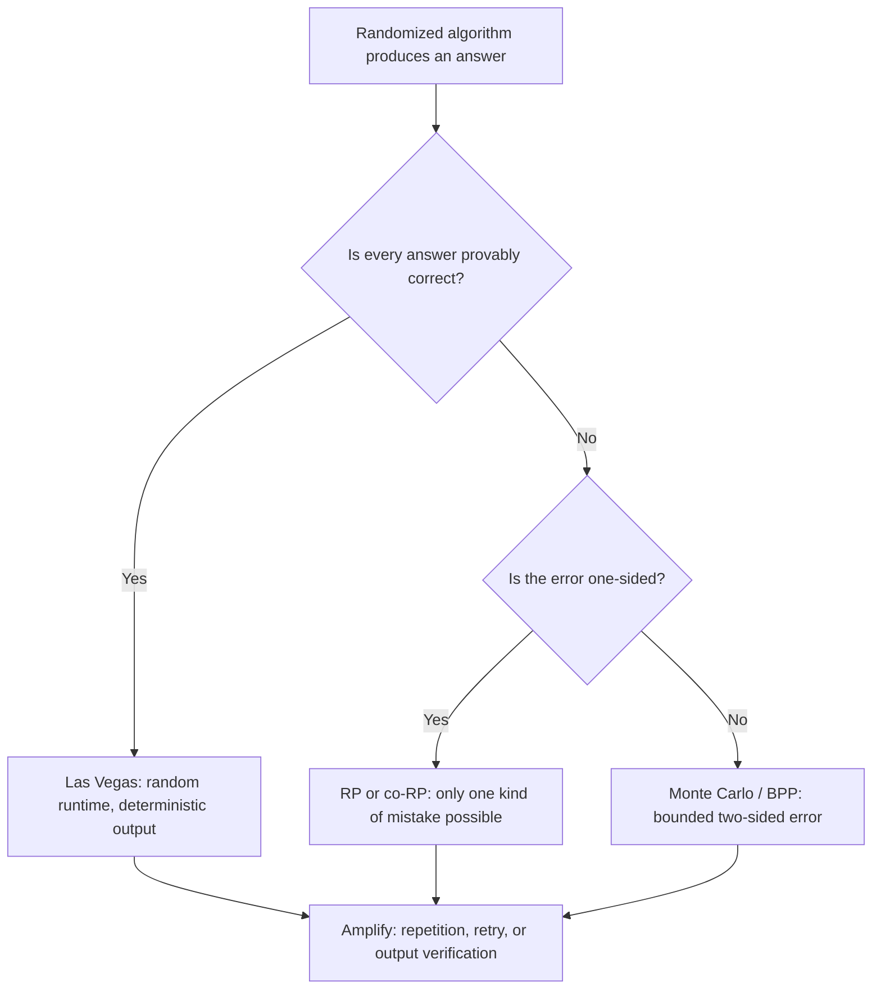

# Randomized Algorithms

## Overview

A randomized algorithm flips coins during execution; its guarantees hold for *every* input, but
are stated in probability over the algorithm's own coin tosses. This is the only standard way to
beat the adversary argument that breaks every deterministic algorithm (quicksort, hashing, min
cut, primality testing all have adversarial inputs that force their worst case). This page covers
the Las Vegas / Monte Carlo taxonomy with the complexity classes RP, co-RP, BPP, the two classic
analysis styles (indicator variables, survival probability), the proofs you may be asked to
reproduce on a whiteboard — Karger's contraction bound \\( \binom{n}{2}^{-1} \\), Freivalds'
\\( O(n^2) \\) matrix check with halving error, Schwartz–Zippel fingerprinting — and the
derandomization frontier. Implementation-level drills (reservoir sampling, skip lists, randomized
data structures) live in [Chapter 63: Randomized Algorithms](../dsa/chapters/ch63-randomized-algorithms.md);
probabilistic data structures built on these ideas are in
[Chapter 79: Probabilistic Data Structures](../dsa/chapters/ch79-probabilistic-ds.md).

## 1. Las Vegas vs Monte Carlo

The taxonomy is about **what is random**: runtime or correctness.

- **Las Vegas**: always returns a correct answer; only the running time is a random variable.
  Quicksort with a random pivot, randomized quickselect, randomized incremental construction.
  Analysis target: **expected** runtime. Weaker runtime guarantee, zero output risk.
- **Monte Carlo**: fixed (deterministic) runtime, but the answer is wrong with some bounded
  probability. Karger's contraction, Freivalds' check, Miller–Rabin primality. Analysis target:
  **success probability**, usually amplified by independent repetition.

A Monte Carlo test with one-sided error can often be converted to Las Vegas by adding a verifier:
if the verifier catches a wrong answer, retry. The reverse direction (Las Vegas to Monte Carlo) is
free — just cap the runtime and give up.

| Class | Guarantee | Error model | Example |
|---|---|---|---|
| Las Vegas | always correct | runtime random | randomized quicksort |
| RP | yes-instances accepted w.p. ≥ 1/2, no-instances never | one-sided | PIT (polynomial identity) |
| co-RP | mirror of RP | one-sided | Miller–Rabin compositeness (composites always rejected) |
| BPP | error ≤ 1/3 on both sides | two-sided | approximate median, interactive proof sim |
| PP | error < 1/2 (barely) | two-sided, weak | majority-of-circuits counting |

Two details interviewers probe: **BPP's 1/3 is arbitrary** — any constant below 1/2 works because
repetition plus majority vote drives error to \\( 2^{-\Theta(k)} \\) (Chernoff), at linear cost in
k; and **the randomness must be independent of the input** — "I randomized my test data" is a
different (and much weaker) statement, because it assumes a distribution on inputs, which is
exactly what an adversary defeats.



## 2. Randomness Against Adversaries: Quicksort

Deterministic quicksort with any fixed pivot rule has an input that forces \\( \Theta(n^2) \\) —
for first-element pivots it is simply the sorted array, and even median-of-3 pivots has a crafted
"median-of-3 killer" family (Musser's introsort exists precisely because adversarial inputs
appeared as denial-of-service attacks in practice). The adversary argument: pivot choices are a
deterministic function of the input, so an adversary who knows the rule can feed the input that
walks the recursion into the worst split.

Randomization breaks the causal chain: the pivot is chosen *after* the input is fixed, from a
distribution the adversary cannot predict. Sort a fixed input 20 times and the comparison count
varies; the adversary's sorted array is no longer worst case — it is an average case.

**Analysis by indicator variables.** Label the elements by rank. Elements \\( i < j \\) are
compared iff one of them is the *first* pivot chosen among ranks \\( i \dots j \\): every pivot
in that span splits them apart, and only a pivot in the span can touch both. Among the
\\( j - i + 1 \\) candidates each is equally likely to be first, so

\\[ \Pr[\text{compare } i, j] = \frac{2}{j - i + 1}, \qquad
E[C] = \sum_{i<j} \frac{2}{j-i+1} = 2(n+1)H_n - 4n \approx 2n\ln n \approx 1.39\, n \log_2 n. \\]

For \\( n = 10^6 \\) that is about \\( 2.48 \times 10^7 \\) comparisons — a factor of ~40 000
better than the adversarial \\( \Theta(n^2) \\). This is the template for most expected-runtime
proofs: define a 0/1 indicator per "event of interest", sum expectations, evaluate the geometric
or harmonic series that falls out.

```python
# Randomized quicksort vs deterministic first-pivot on an adversarial input.
import math, random

def comparisons(a, rule, seed=0):
    rng, a, count = random.Random(seed), list(a), 0
    def qs(lo, hi):
        nonlocal count
        if lo >= hi:
            return
        p_idx = lo if rule == "first" else rng.randint(lo, hi)
        a[p_idx], a[hi] = a[hi], a[p_idx]      # move pivot to the end
        p, i = a[hi], lo
        for j in range(lo, hi):
            count += 1
            if a[j] < p:
                a[i], a[j] = a[j], a[i]
                i += 1
        count += 1
        a[i], a[hi] = a[hi], a[i]              # pivot to its final spot
        qs(lo, i - 1)
        qs(i + 1, hi)
    qs(0, len(a) - 1)
    return count

n = 2000
inp = list(range(n))            # sorted input: worst case for the first pivot
print("n = {} (sorted input)".format(n))
print("first-pivot, deterministic:    {:,} comparisons".format(comparisons(inp, "first")))
print("first-pivot, run 2 (same in):  {:,} comparisons".format(comparisons(inp, "first")))
mean = sum(comparisons(inp, "random", seed=s) for s in range(20)) / 20
Hn = math.log(n) + 0.5772156649
print("random pivot, 20-run mean:     {:,.0f} comparisons".format(mean))
print("theory E = 2(n+1)H_n - 4n =    {:,.0f}".format(2 * (n + 1) * Hn - 4 * n))
print("theory n(n-1)/2 (quadratic) =  {:,}".format(n * (n - 1) // 2))
```

The deterministic run is identical twice (an adversary can rely on it); the randomized runs land
within a few percent of the harmonic-analysis prediction.

## 3. Karger–Stein: Min Cut by Contraction

**Karger's contraction algorithm** (1993): repeat until two vertices remain — pick a uniformly
random edge, contract it (merge endpoints, keep parallel edges as a weight). The surviving edge
between the last two super-vertices is a cut; output it. Runtime \\( O(n^2) \\) contractions with
union-find, i.e. \\( O(m) \\) per run with the standard implementation. It may output a cut
larger than the true minimum, so it is Monte Carlo with **one-sided error**: every cut it names
really exists; only optimality can fail.

**Survival probability.** Fix a minimum cut \\( C \\) with \\( \lambda = |C| \\) edges. Every
vertex has degree \\( \ge \lambda \\) (otherwise \\( C \\) would not be minimum), so the graph has
\\( \ge n\lambda/2 \\) edges, and a uniformly random edge hits \\( C \\) with probability

\\[ \Pr[\text{edge} \in C] \;\le\; \frac{\lambda}{n\lambda/2} \;=\; \frac{2}{n}. \\]

This stays true at every stage: while no edge of \\( C \\) has been contracted, the current
super-graph still has \\( \ge k\lambda/2 \\) edges when \\( k \\) super-vertices remain. So \\( C \\)
survives contraction \\( i \\) with probability \\( \ge 1 - 2/(n-i) \\), and

\\[ \Pr[C \text{ survives all } n-2 \text{ contractions}]
   \;\ge\; \prod_{i=0}^{n-2}\Big(1-\frac{2}{n-i}\Big)
   \;=\; \frac{2}{n(n-1)} \;=\; \binom{n}{2}^{-1}. \\]

The success probability is tiny — but **independent repetitions multiply**:
\\( K \\) runs fail with probability \\( \le (1 - 2/\tbinom{n}{2})^K \le e^{-2K/\tbinom{n}{2}} \\),
so \\( K = c\binom{n}{2}\ln n \\) runs give failure \\( \le n^{-c} \\). Each run costs \\( O(m) \\)
contractions, so Karger's standalone bound is \\( O(m n^2 \log n) \\) for high-probability success —
roughly \\( n^4 \log n \\) on dense graphs.

**Karger–Stein (1996) recycles work.** Stop contracting when \\( t = \lceil 1 + n/\sqrt{2} \rceil \\)
super-vertices remain: telescoping the product shows \\( C \\) survives to that point with
probability \\( \ge 1/2 \\), and the remaining graph has \\( O(t^2) \\) edges. Run **two** recursive
copies — failure \\( \le 1/4 \\) — giving

\\[ T(n) = 2\,T\!\big(O(n/\sqrt2)\big) + O(n^2) = O(n^2 \log n), \qquad \Pr[\text{failure}] = O(1/\log n). \\]

For decades this \\( O(n^2 \log n) \\) was the fastest known max-flow/min-cut bound until the
2022 near-linear max-flow algorithms (Chen et al., \\( m^{1+o(1)} \\)) subsumed it — a good
interview aside when discussing why randomized cut arguments still matter.

## 4. Freivalds' Algorithm: \\( O(n^2) \\) Matrix Product Check

Verifying \\( AB = C \\) by recomputing costs \\( O(n^\omega) \\) (\\( \omega \approx 2.37 \\)).
Freivalds (1979) verifies in \\( O(n^2) \\): pick a random vector \\( r \in \{0,1\}^n \\) and test

\\[ A(Br) \stackrel{?}{=} Cr. \\]

If \\( AB = C \\) the test always passes. If \\( AB \ne C \\), let \\( D = AB - C \ne 0 \\) and
\\( y = Dr \ne 0 \\) is required to pass: \\( r \\) must land in the kernel of a nonzero linear
map, which is a hyperplane containing at most half of \\( \{0,1\}^n \\). Hence

\\[ \Pr[\text{test passes} \mid AB \ne C] \;\le\; \frac{1}{2}. \\]

The cost is two matrix–vector products, \\( O(n^2) \\) — cheaper than one matrix multiplication.

**Error halving by repetition.** Independent trials with fresh random vectors, accept only if
*all* pass: the error probability multiplies, \\( \le 2^{-k} \\) after \\( k \\) trials, each extra
trial halving it; cost \\( O(k n^2) \\). Two standard upgrades: choose \\( r \\) uniformly from a
field \\( \mathbb{F}_q \\) instead of \\( \{0,1\}^n \\) — then one trial already errs with
probability \\( \le 1/q \\) (a nonzero degree-1 polynomial has ≤ 1 root), so a single evaluation
over \\( \text{GF}(2^{64}) \\) gives error \\( \le 2^{-64} \\); and since the error is one-sided,
a Las Vegas verifier exists wherever checking a claimed counterexample is cheap.

The same algebra powers **fingerprinting**: to test whether two objects \\( x, y \\) (files,
polynomials, sets) are equal, ship only \\( h(x) \\) vs \\( h(y) \\) for a random linear hash
\\( h \\). This is exactly the public-coin equality protocol of
[Communication Complexity](communication-complexity.md) — \\( O(\log 1/\varepsilon) \\) bits
instead of \\( n \\).

## 5. Fingerprinting and Schwartz–Zippel

**Polynomial Identity Testing (PIT)**: given a polynomial \\( P(x_1,\dots,x_n) \\) (explicitly, or
as an arithmetic circuit), decide whether it is identically zero. Expanding is exponential; the
randomized route: evaluate at a random point.

**Schwartz–Zippel theorem.** For a nonzero polynomial \\( P \\) of total degree \\( d \\) over a
field, and points chosen independently and uniformly from a finite set \\( S \\),

\\[ \Pr[P(r_1, \dots, r_n) = 0] \;\le\; \frac{d}{|S|}. \\]

Proof sketch by induction on \\( n \\): condition on all but one variable; either the resulting
univariate coefficient polynomial is identically zero (recurse) or it has at most \\( d \\) roots,
each killing at most \\( 1/|S| \\) of the choices. Degrees in algorithmic use are polynomial and
\\( |S| \\) can be a prime field of \\( \\Theta(\\log n) \\) bits, so error \\( d/|S| \\le 1/3 \\)
is cheap. Consequences worth citing:

- **PIT ∈ co-RP**: nonzero polynomials are never rejected; zero polynomials are accepted as
  nonzero only with probability \\( \le d/|S| \\). No deterministic polynomial-time PIT is known
  for general arithmetic circuits — PIT ∈ P would imply circuit lower bounds (via the
  Kabanets–Impagliazzo result), which is why derandomizing it is a frontier problem.
- **Perfect matchings**: a bipartite graph has a perfect matching iff the Edmonds (Tutte-style)
  symbolic determinant is not identically zero — a Schwartz–Zippel test in near-matrix-multiply
  time.
- **Fingerprint equality**: treat two byte strings as polynomials and compare random
  evaluations — the Karp–Rabin fingerprints of
  [Chapter 40: Rolling Hash](../dsa/chapters/ch40-rolling-hash.md) are the streaming version
  of the same idea.

## 6. Randomized Selection vs Median-of-Medians

Both compute the \\( k \\)-th smallest element in \\( \Theta(n) \\); they differ in where the
constant lives.

**Randomized select (quickselect)**: pick a random pivot, recurse into one side. With the same
indicator-variable method as quicksort, the expected comparisons for rank \\( k \\) are
\\( 2n + 2k\ln\frac{n}{k} + 2(n-k)\ln\frac{n}{n-k} + o(n) \\): about \\( 2n \\) for extremes and
\\( (2 + 2\ln 2)\,n \approx 3.39n \\) for the median. Worst case is \\( \Theta(n^2) \\), but no
input can force it.

**Median-of-medians (Blum–Floyd–Pratt–Rivest–Tarjan, 1973)**: group into 5s, find each group's
median recursively, recurse on the medians-of-medians as the pivot. This gives a **worst-case**
\\( O(n) \\) guarantee (≤ 5.43n comparisons with the classic analysis), but the constant is larger
and the recursion bookkeeping makes it slower than quickselect on real inputs — it is a
proof-of-existence tool and an interview favorite, not a production sort primitive.

| | randomized select | median-of-medians |
|---|---|---|
| Expected comparisons (median) | ~3.39n | — |
| Worst case | \\( \Theta(n^2) \\) (probability → 0 with median-of-3+ pivots) | ≤ ~5.43n |
| Randomness needed | pivot RNG | none |
| Practical winner | yes (cache-friendly, low overhead) | rarely |
| Whiteboard proof difficulty | 3-line indicator argument | careful recurrence \\( T(n) \le T(n/5) + T(7n/10) + O(n) \\) |

## 7. Randomness from Hashing: Universal Families

Randomness does not have to come from `rand()`: **hash function families** can supply it.
A family \\( \mathcal{H} \\) is **universal** if for all \\( x \ne y \\),
\\( \Pr_{h \in \mathcal{H}}[h(x) = h(y)] \le 1/m \\). The Carter–Wegman construction — pick a
prime \\( p > |\mathcal{U}| \\), draw \\( a, b \\) uniformly, use

\\[ h_{a,b}(x) = ((a x + b) \bmod p) \bmod m \\]

— is pairwise independent and computable with two multiplies. Pairwise independence is all the
analysis needs: expected chain length is \\( 1 + n/m \\), so expected \\( O(1) \\) lookup holds
**for every fixed input sequence**, with randomness only in the chosen \\( h \\) — again
defeating the adversary that breaks any fixed hash function (the "hash-flooding" DoS attacks on
deterministic hash maps in real runtimes are exactly this adversary). Implementations and deep
dives: [Chapter 7: Hashing](../dsa/chapters/ch07-hashing.md),
[Chapter 94: Hashing Deep Dive](../dsa/chapters/ch94-hashing-deep-dive.md),
[Zobrist Hashing](../dsa/advanced/zobrist-hashing.md) (XOR fingerprints — the same move as
Freivalds), and [Cryptographic Hashing](../cryptography/hashing.md) for when universality is not
enough. HyperLogLog, Count-Min, and Bloom filters
([Chapter 79](../dsa/chapters/ch79-probabilistic-ds.md)) are universal hashing + union/median
bounds in production form.

## 8. Derandomization Teaser

Randomness is a *resource*, and complexity theory asks whether it is necessary:

- **Method of conditional expectations**: the max-cut 2-approximation's expected value is
  \\( m/2 \\); fixing variables one at a time while never decreasing conditional expectation turns
  it into a deterministic algorithm with the same guarantee — expectation proofs derandomize for
  free when the expectation is computable. See
  [Approximation Algorithms](approximation-algorithms.md) for the max-cut SDP side.
- **Adleman's theorem**: BPP ⊆ P/poly — a good coin string exists for all inputs of a given
  length (counting argument), so BPP computations have polynomial-size *advice*. Randomness
  helps less than it appears.
- **AKS primality (2002)**: deterministic polynomial-time primality testing — a derandomization
  of the Miller–Rabin line; cryptography no longer needs trusted RNGs there.
- **Pseudorandom generators**: if some function in E requires circuits of size
  \\( 2^{\Omega(n)} \\), then BPP = P (hardness-vs-randomness, Nisan–Wigderson). "Is BPP = P?" is
  widely believed yes; derandomizing PIT (section 5) is the sharpest concrete sub-problem.

## Interview Questions

1. **Las Vegas vs Monte Carlo — when would you choose each?**
   Las Vegas (randomized quicksort, quickselect) when a wrong answer is unacceptable and variable
   runtime is fine: the answer is always right, only time varies. Monte Carlo (Miller–Rabin,
   Freivalds, Karger contraction) when you have a strict latency budget and can tolerate bounded
   error: runtime is fixed and repetition scales error down predictably (\\( 2^{-k} \\) for k
   trials). One-sided Monte Carlo tests upgrade to Las Vegas by verifying claimed witnesses and
   retrying on failure.
2. **Why does a random pivot defeat an adversary that a deterministic pivot rule cannot?**
   A deterministic rule is a function of the input, so for every rule there exists an input that
   induces all-worst splits (sorted input for first-element pivots; median-of-3 killers for that
   rule). With a random pivot the choice is statistically independent of the input and made after
   the adversary commits, so the expected split is uniform: \\( E[C] = 2(n+1)H_n - 4n \approx
   2n \ln n \\). The guarantee is per-input in expectation, not "expected over inputs".
3. **Walk through Karger's \\( \binom{n}{2}^{-1} \\) bound.**
   Fix a min cut of λ edges. Every vertex has degree ≥ λ, so ≥ kλ/2 edges cross between any k
   super-vertices; a random edge hits the cut with probability ≤ 2/k. Survival through all
   contractions is \\( \prod_{i=0}^{n-2}(1 - 2/(n-i)) = 2/(n(n-1)) = \binom{n}{2}^{-1} \\).
   Repeat \\( K \\) times: failure \\( \le e^{-2K/\binom{n}{2}} \\), so \\( O(n^2 \log n) \\) runs
   succeed with high probability. Karger–Stein stops at \\( n/\sqrt2 \\) vertices (survival ≥ 1/2)
   and recurses twice, reaching \\( O(n^2 \log n) \\) total.
4. **Freivalds checks AB = C in O(n²) — why can't that beat fast matrix multiplication?**
   It is a *verifier*, not a multiplier: it needs \\( A \\), \\( B \\), and \\( C \\) already
   given. It costs two matrix–vector products \\( O(n^2) \\) versus \\( O(n^\omega) \\) to
   recompute. One random \\( r \in \{0,1\}^n \\) errs ≤ 1/2 (r must fall in the kernel of the
   nonzero matrix AB − C); k independent trials err ≤ \\( 2^{-k} \\), or one evaluation over
   \\( \text{GF}(2^{64}) \\) errs ≤ \\( 2^{-64} \\).
5. **State Schwartz–Zippel and one consequence.**
   A nonzero degree-d polynomial evaluated at uniformly random points from \\( S \\) vanishes with
   probability ≤ d/|S| (induction: condition on all but one variable, count roots of the
   resulting univariate). Consequence: PIT is in co-RP — test whether an arithmetic circuit
   computes the zero polynomial by random evaluation, error ≤ d/|S| ≤ 1/3 with ~log n-bit primes;
   no deterministic poly-time algorithm is known, and PIT ∈ P would yield new circuit lower
   bounds.
6. **Where does universal hashing show up in production systems?**
   Everywhere an adversary can pick keys: language runtime hash tables (SipHash was adopted after
   hash-flooding DoS against deterministic maps), Bloom filters, Count-Min sketches, HyperLogLog.
   Universality — \\( \Pr[h(x)=h(y)] \le 1/m \\) for every distinct pair — suffices for expected
   O(1) chains and for the error bounds of sketching structures; cryptographic hashing is only
   needed when the hash output itself must resist inversion or forgery.

## Key Takeaways

- Las Vegas = always correct, random runtime (analyze expectation); Monte Carlo = fixed runtime,
  bounded error probability (analyze, then amplify by repetition).
- Randomization defeats adversaries because coin flips are independent of the input; "random test
  data" does not — that assumes an input distribution.
- Quicksort's \\( E[C] = 2(n+1)H_n - 4n \approx 1.39\,n\log_2 n \\) via the indicator-variable
  template: events compared, geometric series, harmonic sums.
- Karger's contraction: survival \\( \ge \binom{n}{2}^{-1} \\) per fixed min cut, amplification by
  \\( \Theta(n^2 \log n) \\) runs; Karger–Stein recursion gives \\( O(n^2 \log n) \\) whp.
- Freivalds: verify \\( AB = C \\) in \\( O(kn^2) \\) with error \\( \le 2^{-k} \\) — the
  fingerprinting pattern reused in equality protocols, rolling hashes, and PIT.
- Schwartz–Zippel (error ≤ d/|S|) puts PIT in co-RP and powers symbolic-determinant matching
  tests; derandomizing PIT is a live open problem tied to circuit lower bounds.
- Randomized select: ~3.39n expected comparisons for the median vs median-of-medians' ≤ 5.43n
  worst case — randomness usually wins the constant race in practice.
- Universal hashing (Carter–Wegman \\( (ax+b) \bmod p \bmod m \\)) imports coin-flip guarantees
  into data structures; pairwise independence suffices for expected O(1) and sketching bounds.

## References

1. Motwani & Raghavan, *Randomized Algorithms*, Cambridge University Press, 1995 — the standard
   text for sections 1–5, 7.
2. Cormen, Leiserson, Rivest & Stein, *Introduction to Algorithms*, 4th ed. (quickselect,
   median-of-medians, Miller–Rabin context) — <https://mitpress.mit.edu/9780262046305/introduction-to-algorithms/>
3. Karger & Stein, *A New Approach to the Minimum Cut Problem*, J. ACM 43(4), 1996 (STOC 1993
   contraction algorithm and the recursive improvement).
4. Freivalds (1979), *Probabilistic Machines Can Use Less Running Time*, IFIP Congress — the
   original matrix-product verifier.
5. Schwartz (1980), *Fast Probabilistic Algorithms for Verification of Polynomial Identities*,
   J. ACM 27(4) (with Zippel 1979, the PIT bound).
6. MIT OCW 6.045J *Automata, Computability, and Complexity* (randomized complexity classes,
   BPP) — <https://ocw.mit.edu>
7. Kabanets & Impagliazzo (2004), *Derandomizing Polynomial Identity Tests Means Proving Circuit
   Lower Bounds*, Computational Complexity 13(1–2).

## Cross-References

- [Complexity Classes](./complexity-classes.md) — where RP, co-RP, BPP sit relative to P and NP.
- [Approximation Algorithms](./approximation-algorithms.md) — conditional-expectation
  derandomization of max cut; randomized rounding of LPs.
- [Chapter 63: Randomized Algorithms](../dsa/chapters/ch63-randomized-algorithms.md) —
  implementation drills: reservoir sampling, skip lists, randomized data structures.
- [Chapter 79: Probabilistic Data Structures](../dsa/chapters/ch79-probabilistic-ds.md) — Bloom
  filters, HyperLogLog, Count-Min built on universal hashing.
- [Communication Complexity](./communication-complexity.md) — fingerprinting as the O(log 1/ε)
  equality protocol; Newman's theorem.
- [Cryptographic Hashing](../cryptography/hashing.md) — keyed hashing (SipHash) for
  adversary-resistant tables; when universality is not enough.
- [Probability and Statistics for Programmers](../mathematics/probability-statistics.md) —
  expectation, indicator variables, Chernoff bounds used throughout.
