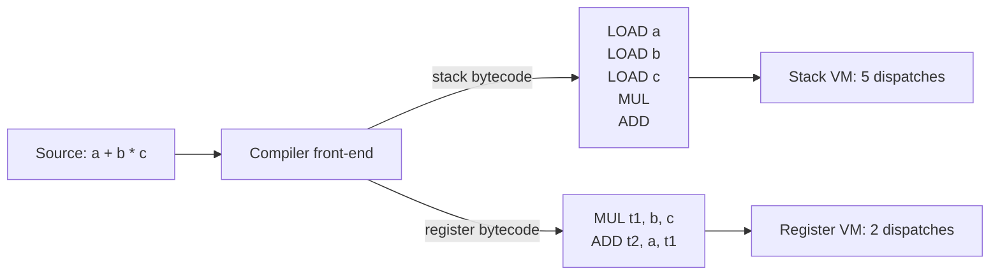
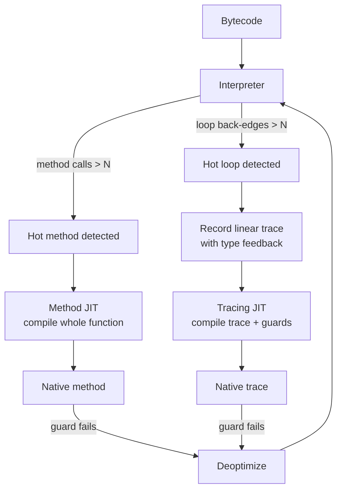
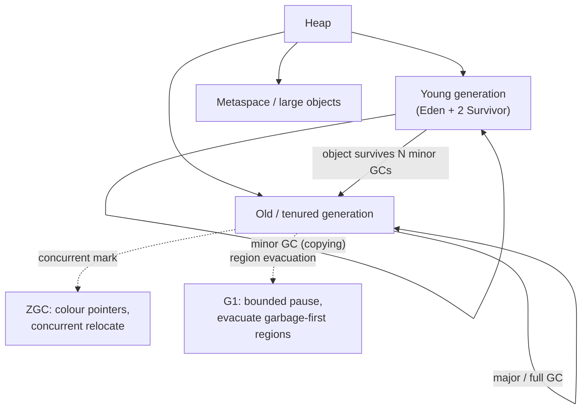
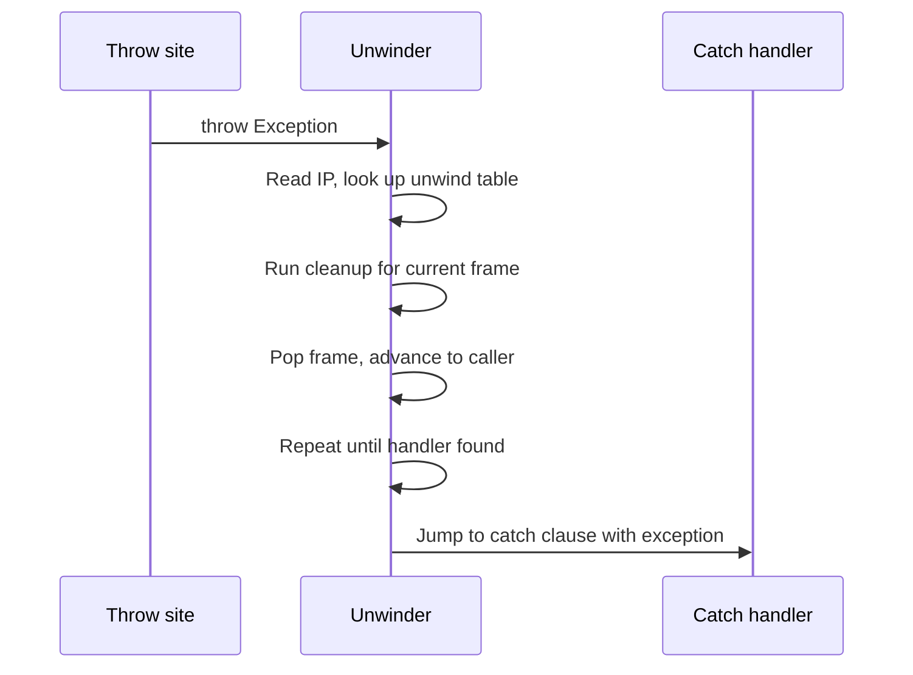
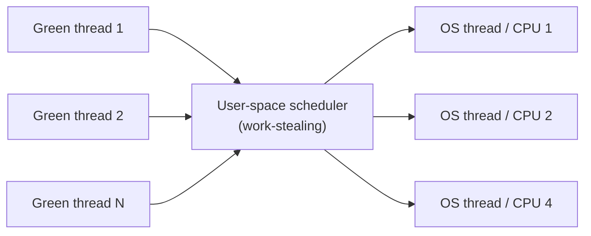

# Runtime Systems

## Overview

A **runtime system** is the layer of software that takes a program — source, bytecode, or IR — and *executes* it. It is the bridge between the abstract semantics of a language and the concrete instructions a CPU actually runs. Every interesting program has a runtime: even a statically-linked C binary links against `crt0`, libc, and the kernel; a Java program has the JVM; a Python script has CPython; an Erlang program has the BEAM virtual machine. The runtime is responsible for memory layout, allocation and reclamation, control flow primitives (calls, exceptions, tail calls, continuations), concurrency substrate (threads, fibers, actors), and the foreign function interface. SICP (Abelson & Sussman, 1985) frames the runtime as an interpreter for an abstract machine; Lisp in Small Pieces (Queinnec, 1994) shows how each chapter's evaluator is, in effect, a different runtime for the same language.

The ~33 topics listed in Section 5 of the master index fall into six clusters: **execution engines** (interpreters, bytecode VMs, JITs, AOT), **memory management** (allocators, GC algorithms, escape analysis, object layout), **control abstractions** (exceptions, tail calls, continuations, coroutines, fibers, green threads), **concurrency substrates** (actor model, software transactional memory), **runtime observability** (profiling, tracing, deoptimization), and **interoperability** (FFI, ABI, JNI). This page covers each cluster with enough depth that an interviewer asking "explain how the JVM decides to GC" or "why does Python have a GIL but Erlang doesn't" will get a technically correct answer rather than a hand-wave.

> Related: [JIT Compilation](../compilers/jit-compilation.md), [Code Generation](../compilers/code-generation.md), [Intermediate Representation](../compilers/intermediate-representation.md), [Green Threads](../os/threads/green-threads.md), [Thread Models](../os/threads/models.md), [Memory Profiling](../performance-engineering/memory-profiling.md), [CPU Profiling](../performance-engineering/cpu-profiling.md), [Programming Language Theory](./programming-language-theory.md), [WebAssembly](./webassembly.md)

## The Interpreter Loop

Every interpreter, no matter how fancy, ultimately reduces to a **fetch–decode–dispatch loop** over a stream of instructions. The canonical form, in pseudo-C, is:

```c
typedef enum { OP_LOAD_CONST, OP_ADD, OP_RETURN, /* ... */ } OpCode;

void interpret(Frame *frame) {
    uint8_t *ip = frame->code;
    Value *stack = frame->stack;
    int sp = 0;
    while (1) {
        OpCode op = (OpCode)*ip++;
        switch (op) {
            case OP_LOAD_CONST: stack[sp++] = frame->consts[*ip++]; break;
            case OP_ADD: { Value b = stack[--sp]; Value a = stack[--sp];
                           stack[sp++] = num_add(a, b); break; }
            case OP_RETURN: return;
            /* ... */
        }
    }
}
```

This is the structure of CPython's `ceval.c` (the `_PyEval_EvalFrameDefault` function), the Ruby YARV core loop, and the historical SICP metacircular evaluator. The performance of such a loop is dominated by **dispatch overhead**: each instruction pays for one indirect branch (the `switch`), one increment of `ip`, and one or two stack manipulations. Three classic optimizations reduce this cost:

1. **Direct threading** (Bell, 1973): replace the `switch` with computed `goto`s — each handler ends with `goto *dispatch_table[next_op]` instead of jumping back to the top of the loop. This collapses the dispatch into a single predicted indirect branch. GCC's `labels-as-values` extension enables it; CPython uses it on supported platforms.
2. **Token threading** (Anton Ertl, 1995): store the address of each handler inline in the bytecode stream, so dispatch becomes `goto *ip++`. This trades code density for branch-predictor friendliness.
3. **Superinstructions**: combine common instruction sequences (`LOAD_FAST` `LOAD_FAST` `BINARY_ADD`) into single opcodes, reducing dispatch count.

A **tree-walking interpreter** (the SICP metacircular evaluator, the original Ruby interpreter, early Perl) evaluates the AST directly without an intermediate bytecode stage. It is the simplest to implement but the slowest to run — every node dispatch is a switch on an AST tag, often with recursive calls. Almost every production interpreter today compiles to bytecode first because the bytecode is denser in cache and the dispatch is cheaper than AST recursion.

## Bytecode VMs: Stack vs Register

Bytecode virtual machines come in two architectural flavours, distinguished by where their operands live. **Stack-based VMs** keep operands on an implicit value stack: `ADD` pops two values and pushes one. The JVM, CPython, the WebAssembly interpreter, and the .NET CLR are stack-based. Their bytecode is dense (1–2 bytes) and verification is simple (static stack-height checks), but they execute more instructions per source operation because every intermediate value is a push/pop. **Register-based VMs** keep operands in named slots — `ADD r1, r2, r3` — used by the Lua VM, Dalvik (Android's pre-ART bytecode), the Android Runtime's interpreter, LuaJIT, and Parrot. Their bytecode is larger per instruction (typically 4 bytes) but they execute fewer instructions per source operation and avoid push/pop overhead.

| Aspect | Stack VM | Register VM |
|--------|----------|-------------|
| **Operand location** | Implicit value stack | Named virtual registers |
| **Instruction size** | 1–2 bytes (dense) | 3–4 bytes (sparser) |
| **Instructions per source op** | Many (push/pops) | Few (direct) |
| **Dispatch overhead** | Higher (more instructions) | Lower (fewer instructions) |
| **Verification** | Easy (stack-height check) | Harder (dataflow analysis) |
| **Code generator** | Trivial (push everything) | Needs register allocation |
| **Examples** | JVM, CPython, WASM, CLR | Lua VM, Dalvik, LuaJIT, Android Runtime |
| **Historical note** | P-code (Pascal), Smalltalk | Warren Abstract Machine (Prolog) |

Empirically, register VMs run ~30–40% fewer instructions for the same source program but use ~25% larger bytecode (Davis et al., "The Case for Virtual Register Machines", 2003). The choice is a trade-off between dispatch cost and instruction cache pressure.



The JVM bytecode verifier (Lindholm et al., *JVM Specification*, §4.10) statically checks that every code path leaves the operand stack at the same height and that values are used with consistent types — the payoff of stack discipline: a verifier can reject malformed bytecode without a full dataflow analysis. Register VMs pay for their speed by needing a more sophisticated verifier and a register allocator in the front-end compiler.

## Compilation Strategies: Interpreter, JIT, AOT

A language's runtime picks where on the **interpreter–JIT–AOT spectrum** it lives:

| Criterion | Interpreter | JIT | AOT |
|---|---|---|---|
| **Startup** | Fast (no compile) | Slow (warm-up) | Fast (pre-compiled) |
| **Peak perf** | 10–100x slower than native | Approaches native | Approaches native |
| **Binary size** | Tiny (just interpreter) | Medium (bytecode + JIT) | Large (full native) |
| **Runtime memory** | Low (no compiler resident) | Higher (JIT, code cache) | Lowest |
| **Profile data** | None | Runtime profiles | Only via PGO |
| **Dynamic features** | Full support | Full (can re-JIT) | Limited |
| **Determinism** | High | Lower (JIT timing varies) | High |
| **Examples** | Python (CPython), Ruby <2.6 | JVM HotSpot, V8, PyPy, .NET | C (gcc), Rust, Go, Swift, GraalVM Native Image |

The JIT and AOT endpoints share a compiler backend (LLVM, Cranelift, or a custom one); the difference is *when* compilation happens. PGO (profile-guided optimization) lets AOT compilers borrow runtime information by collecting profiles in an instrumented training run, then recompiling — this is how Chrome, Firefox, and the Linux kernel are built today.

### Method JIT vs Tracing JIT

Two flavours of JIT differ in their unit of compilation:

- **Method JIT** (HotSpot C1/C2, V8 TurboFan, .NET RyuJIT): the unit of compilation is a whole method/function. The compiler inlines aggressively, runs escape analysis, and unrolls loops. Works well when types are stable at method entry.
- **Tracing JIT** (PyPy, LuaJIT, early TraceMonkey): the unit of compilation is a *hot loop trace* — a linear path through the bytecode that the program executes many times. The compiler records the actual types seen during execution, compiles that linear path with guards, and falls back to the interpreter when a guard fails.



Tracing JITs suit dynamic languages well because they compile *only the path actually taken* — they don't need to handle every possible type combination, just the observed one, with a guard. PyPy's documentation calls this "the only way to make Python fast"; LuaJIT's trace compiler sustains roughly native C speed on numeric loops. The cost is complexity: guards must be correct in all corner cases, traces must be linked across loop exits, and the trace recorder must handle instruction aliases, side exits, and trace stitching.

## AOT Compilation and Deoptimization

**AOT** compilers — `gcc`, `rustc`, `clang`, the Go compiler, Swift's `swiftc`, and GraalVM Native Image — translate source directly to native machine code at build time. There is no interpreter, no JIT, no warm-up. The advantage is fast startup, low memory, and full predictability; the cost is the loss of runtime profile information (which the JIT uses for inlining, devirtualization, and branch prediction) unless PGO is used.

**Deoptimization** is the JIT's mechanism for reverting optimized code to the interpreter when a speculative assumption is violated. The classic example: HotSpot speculates that `List<Object>` always holds `String` and inlines `String.length()` directly; if a non-`String` is later stored, the optimized code is invalid and must bail out. The mechanism is **on-stack replacement (OSR)**: the runtime walks the optimized frame, materializes the de-optimized state (reconstructing interpreter frames from optimized registers), and resumes execution in the interpreter at the corresponding bytecode index. OSR also works in the other direction — entering optimized code mid-method during a long-running loop, so the program doesn't have to wait for the method to return before switching to native code.

```bash
# HotSpot: trace deoptimization events
java -XX:+PrintDeoptimization -XX:+TraceDeoptimization MyApp
# V8: trace opt/deopt
node --trace-deopt --trace-opt app.js
# HotSpot: lock in a compilation level (no C2)
java -XX:TieredStopAtLevel=1 MyApp
```

## Memory Management

### Allocation Strategies

Where objects live determines how they are allocated, how long they survive, and who reclaims them. The four classical strategies are:

| Strategy | Lifetime | Allocator | Reclamation | Examples |
|---|---|---|---|---|
| **Stack** | Lexical scope | Compiler-generated `sub rsp` | Implicit (return pops frame) | C locals, Rust non-`Box` values, JVM primitive locals |
| **Heap (managed)** | Until GC | Bump or free-list allocator | GC traces and reclaims | Java objects, OCaml heap blocks, Python `PyObject`s |
| **Heap (manual)** | Until `free` | `malloc`/`free` | Programmer calls `free` | C `malloc`, C++ `new`/`delete` without smart pointers |
| **Arena/Region** | Until arena reset | Bump allocator within arena | Whole arena at once | Apache `apr_pool`, Emacs buffers, game level data |
| **Stack-like (obstack)** | Until pop | Bump + explicit pop | Per-object pop or arena | GNU obstack, Rust `bumpalo` |

**Region-based memory** (Tofte & Talpin, 1994, "Region Inference for Polymorphic ML") assigns each allocation to a *region* whose lifetime is lexically scoped; the compiler inserts region alloc/dealloc. ML Kit implements this; Rust's borrow checker is a spiritual descendant (each `let` binding is its own micro-region).

**Arena allocation** trades fine-grained reclamation for allocation speed: `arena_alloc` is a single pointer bump (one `mov`), so it can be 10–100x faster than `malloc`. The cost is that nothing is freed until the whole arena is reset — fine for short-lived phases (request handling, AST construction, game frame data) but useless for long-lived objects.

### malloc Internals and Modern Allocators

The C library `malloc` is a general-purpose allocator that must satisfy three conflicting goals: fast allocation, fast free, low fragmentation. The classical design (K&R, 1988) uses a free-list of blocks tagged with size and a magic footer; `malloc` walks the list looking for a fit, `free` inserts the block back and coalesces with neighbours. This is slow under multithreaded contention and fragments badly under workloads with mixed object sizes.

Modern replacements use **thread-local caches** and **size-class bins**:

| Allocator | Authors | Key idea | Used by |
|---|---|---|---|
| **ptmalloc** | Wolfram Gloger (glibc) | Per-arena heaps, bins by size class | Most Linux programs |
| **jemalloc** | Jason Evans (Facebook) | Per-thread arenas, slab-like runs | Facebook, Firefox, Rust default |
| **tcmalloc** | Google | Thread-local caches, size classes | Google internal, Go runtime |
| **mimalloc** | Daan Leijen (Microsoft) | Per-thread heaps, deferred free, free-list sharding | Koka, faster than tcmalloc on many benchmarks |
| **scudo** | LLVM | Hardened allocator, security-focused | Android, Fuchsia |
| **Hoard** | Emery Berger | Per-heap size classes, lock-free free-lists | Research, some HPC |

The common pattern is: small allocations are satisfied from a **per-thread cache** (no lock), medium allocations from a **size-class slab** in a per-CPU arena (lightweight lock), large allocations go directly to `mmap`. `free` returns to the per-thread cache; periodically the cache is flushed back to the arena. This eliminates lock contention on the common path.

### Object Layout, vtables, RTTI, ABI

A language runtime must decide how objects are laid out in memory. The **C++ ABI** (Itanium C++ ABI, used by GCC and Clang on Linux) places a **vtable pointer** as the first word of every polymorphic object; the vtable is an array of function pointers, one per virtual method. Calling `obj->foo()` becomes `(*((void**)obj))[offset_foo](obj)` — one load, one indirect call.

```cpp
// C++ object layout under the Itanium ABI
struct Animal {
    void** vptr;            // -> Animal vtable
    int age;
};
struct Dog : Animal {
    void** vptr;            // -> Dog vtable (primary base)
    int weight;
};
// vtable layout: [offset_to_top, typeinfo_ptr, &Dog::~Dog, &Dog::bark, ...]
```

**RTTI (Run-Time Type Information)** is the metadata that lets a program inspect an object's dynamic type at runtime. In C++, `typeid(obj).name()` and `dynamic_cast<Dog*>(animal_ptr)` consult the vtable's `typeinfo` slot. Java stores a `Class*` pointer in every object header (alongside the hash code and GC bits). Python attaches type to every object via the `ob_type` field of `PyObject` — every Python value, including `int` and `None`, is a heap object with a type pointer.

The **ABI (Application Binary Interface)** is the contract that lets code compiled by different compilers (or different versions of the same compiler) interoperate. It specifies register usage, calling conventions, struct layout, exception unwinding tables, and name mangling. The System V AMD64 ABI (Linux, macOS on Intel) is the most widely deployed; the Windows x64 ABI differs in register assignment (e.g., shadow space). Mismatches in ABI are why you cannot link a binary compiled with `-m32` against one compiled with `-m64`, or call a `cdecl` function as if it were `stdcall`.

## Garbage Collection

**Garbage collection (GC)** is automatic memory management: the runtime, not the programmer, decides when objects are no longer reachable and reclaims their memory. The first GC was McCarthy's 1960 Lisp implementation; the modern theory is summarized in Jones, Hosking & Moss, *The Garbage Collector Handbook* (2016). Every GC faces two questions: *which objects are reachable?* and *when and how to reclaim the unreachable ones?*

### Reachability: The Tri-Color Abstraction

Dijkstra, Lamport, et al. (1978) introduced the **tri-color invariant**: every object is coloured **white** (not yet visited), **grey** (visited, children not yet scanned), or **black** (visited, all children scanned). The collector starts with all roots (registers, stacks, globals) grey; repeatedly picks a grey object, scans its children (greying any white ones), and paints itself black. When no grey objects remain, white objects are unreachable and can be freed.

```
// Tri-color marking (simplified)
grey_set = roots;
while (!grey_set.empty()) {
    obj = grey_set.pop();
    for (child : obj->pointers) {
        if (child->color == WHITE) {
            child->color = GREY;
            grey_set.push(child);
        }
    }
    obj->color = BLACK;
}
// Sweep: free all remaining WHITE objects
```

The invariant preserved by every correct GC is: *no black object points to a white object*. Mutator and collector must cooperate to maintain this — typically via a **write barrier** that the compiler inserts around every pointer store: if a black object gains a pointer to a white object, the white object is shaded grey (Dijkstra) or the black object is unshaded grey (Yuasa, snapshot-at-the-beginning).

### GC Algorithms

| Algorithm | Pause time | Throughput | Fragmentation | Compaction | Concurrency | Best for |
|---|---|---|---|---|---|---|
| **Mark-sweep** | Stop-the-world | Medium | Yes (free list) | No | No | Old Lisp systems, simple GCs |
| **Mark-compact** | Stop-the-world | Lower (move cost) | None | Yes | No | Older JVMs, IBM JDK |
| **Copying (semispace)** | Stop-the-world | High (bump alloc) | None | Yes (copy) | No | Young generations, Erlang |
| **Generational** | Short for minor | High | Depends on old-gen GC | Yes (in young) | Optional | Most JVMs, .NET, OCaml |
| **Incremental** | Many short pauses | Lower (barrier overhead) | Varies | Optional | No | Interactive systems |
| **Concurrent (CMS)** | Very short | Lower (barrier) | Yes | Optional | Yes | Web servers (deprecated) |
| **G1 (Garbage First)** | Bounded pause | Medium-high | Bounded | Yes (region evacuation) | Mostly | Default HotSpot since JDK 9 |
| **ZGC** | Sub-ms | Medium | Bounded | Yes (coloured pointers) | Yes | Large heaps (multi-TB), JDK 17+ |
| **Shenandoah** | Sub-ms | Medium | Bounded | Yes (Brooks pointer) | Yes | Low-latency JDK, Red Hat |
| **Reference counting** | None (incremental) | Low (refcount ops) | N/A | No | Yes | CPython, Objective-C ARC, Swift |



**Mark-sweep** (McCarthy, 1960) walks the object graph from roots, marks live objects, then sweeps the heap freeing unmarked ones. Simple but causes fragmentation: free memory is scattered, so a large allocation may fail despite enough total free space.

**Copying collection** (Minsky, 1963; Cheney, 1970) divides the heap into two semispaces; live objects are copied from `from-space` to `to-space` (a pointer-bump allocation), then the spaces swap. Allocation is fast (bump), there is no fragmentation, and the cost is proportional to the *live* set — not the heap size. The cost is half the heap is wasted and copying is expensive for large long-lived objects.

**Generational collection** (Lieberman & Hewitt, 1983; Ungar, 1984) exploits the **weak generational hypothesis**: most objects die young. The heap is split into a young generation (collected often, via copying) and an old generation (collected rarely, via mark-sweep or mark-compact). Objects that survive N minor collections are promoted to the old gen. The cost is a **write barrier** on every pointer store into the old gen, so the collector can remember which old objects point to young ones (the "remembered set").

**Concurrent and incremental GCs** reduce pause time by interleaving collector work with mutator execution. **G1** (Garbage First, Sun/Oracle) divides the heap into fixed-size regions and collects the most garbage-dense regions first, bounding pause time by limiting how many regions are collected per cycle. **ZGC** (Oracle, JDK 11+) uses **coloured pointers** — it steals high bits of the 64-bit pointer to encode marking/relocation state — and does all phases concurrently, achieving sub-millisecond pauses on multi-TB heaps. **Shenandoah** (Red Hat, JDK 12+) uses a **Brooks forwarding pointer** (one extra word per object pointing to itself or its forwarded copy) to enable concurrent relocation.

### Reference Counting

**Reference counting** (Collins, 1960) attaches a count of incoming pointers to each object; `inc_ref` on every pointer copy, `dec_ref` on every drop; when the count hits zero, the object is freed immediately. It has no pause (deallocation is incremental), it reclaims memory promptly, and it is simple to implement. CPython uses refcounting as its primary reclamation strategy, with a tracing GC only for cycle collection.

The three classical problems of refcounting:

1. **Cycles**: a cycle of mutually-referencing objects has refcount > 0 even when unreachable. Solution: a separate cycle collector (Bacon & Rajan, 2001) — CPython's `gc` module.
2. **Performance overhead**: every pointer assignment is `dec_ref` + `inc_ref`, two atomic ops under threading. CPython's GIL is partly justified by avoiding per-assignment atomics.
3. **Concurrency**: thread-safe refcounting needs atomic operations on every assignment, which is expensive. Swift's ARC (Automatic Reference Counting) inserts these atomically; Rust's `Arc<T>` does the same.

Modern variants — **deferred refcounting** (Deutsch & Bobrow, 1976) skips counts for stack/local pointers, recounting periodically; **coalesced refcounting** (Levanoni & Petrank, 2001) batches refcount updates — make refcounting competitive with tracing GC on modern hardware.

## Escape Analysis and Stack Allocation

**Escape analysis** (Choi, Gupta & Serrano, 1999; Kotzmann & Mössenböck, 2007) is a static analysis that determines whether an object allocated in a method can *escape* that method — be returned, stored in a field, or passed to another thread. If it cannot escape, the runtime is free to:

1. **Stack-allocate** the object: it lives in the method's frame, freed on return, no GC pressure.
2. **Scalar-replace** it: replace the object with its individual fields as local variables, enabling register allocation.
3. **Eliminate locking** on it: no other thread can see it, so `synchronized` is a no-op.

HotSpot C2 and Graal perform escape analysis; Go's compiler does a similar "does this escape?" check to decide stack vs heap allocation. Rust makes this explicit: `Box::new(x)` always heap-allocates; `let x = T::new()` is on the stack unless moved.

```go
// Go: the compiler decides based on escape analysis
func sum(n int) int {
    s := make([]int, n)        // does s escape?
    for i := range s { s[i] = i }
    total := 0
    for _, v := range s { total += v }
    return total               // s doesn't escape; stack-allocated
}

func newSlice() *[]int {
    s := make([]int, 100)
    return &s                  // s escapes to heap
}
```

The `go build -gcflags=-m` flag prints the compiler's escape-analysis decisions, an invaluable debugging tool.

## Exception Handling and Stack Unwinding

**Exception handling** is the runtime mechanism for non-local control transfer to a handler. Two implementation strategies dominate:

**Setjmp/longjmp** (C): the program calls `setjmp` to save the current stack/registers into a `jmp_buf`; `longjmp(buf, val)` restores them, aborting any intermediate calls. Destructors are *not* run (C has none). Cheap to set up, expensive to invoke, no cleanup.

**Zero-cost exceptions** (C++, Java, Rust): under normal execution, exception throwing is *free* — no setup cost per try block. The compiler emits an **unwind table** (DWARF `.eh_frame` on Linux, xdata on Windows) mapping each instruction to a stack-cleanup action. When an exception is thrown, the runtime walks the stack using these tables, running destructors/cleanup clauses at each frame until a handler is found.



HotSpot implements Java exceptions with a per-method exception table mapping bytecode ranges to handler offsets; throwing an exception walks this table. The **persona** extension to DWARF (Linux) and SEH (Windows) provide the same machinery for C++. Rust's `panic` uses the same unwinding infrastructure (or aborts, with `panic = "abort"`), as does Swift's `throw`.

## Tail Calls and Continuations

A **tail call** is a function call in tail position — the last action of the caller, whose return value is the callee's. Without optimization, each tail call pushes a new stack frame; for deeply-recursive code (a `while` loop written as recursion), this overflows the stack. **Tail-call optimization (TCO)** reuses the caller's frame for the callee, turning recursion into iteration. The Scheme specification (Sussman & Steele, 1975) made TCO *mandatory* — every conforming Scheme implementation must perform it, so loops are expressible as recursion without stack growth. SICP (Abelson & Sussman, 1985) builds a metacircular evaluator that supports TCO by transforming tail calls into jumps in the interpreter loop.

```scheme
;; Tail-recursive factorial — runs in constant space with TCO
(define (fact n acc)
  (if (= n 0) acc (fact (- n 1) (* acc n))))
(fact 1000000 1)  ; works in Scheme, stack-overflows in Python
```

TCO interacts poorly with debugging (the call stack no longer reflects the recursion that produced it), which is why the JVM does not guarantee it (a long-standing irritation for Scala and Clojure). The **ECMAScript 6** spec mandates TCO, but only Safari implements it; V8 declined, citing debuggability and stack-trace concerns.

### Continuations

A **continuation** is "the rest of the computation" — a first-class value representing what the program will do next. **`call/cc`** (call-with-current-continuation) in Scheme captures the current continuation as a callable; invoking it jumps back to the capture point, abandoning whatever was in between. This implements `return`/`break`/`exceptions`, coroutines, generators, backtracking, and even cooperative threads in a single primitive.

```scheme
;; Implementing exceptions with call/cc
(define (try thunk handler)
  (call/cc
    (lambda (k)
      (with-handlers ((exn? (lambda (e) (k (handler e))))) (thunk)))))
```

**Delimited continuations** (Danvy & Filinski, 1990) capture only a slice of the continuation up to a marker, rather than the entire rest of the program — easier to compose, type, and reason about. Felleisen's `reset`/`shift` operators are the standard form. Haskell's `Cont` and `Codensity` monads, OCaml 5's effect handlers, and Racket's continuation marks are all descendants. Peyton Jones's *"Implementing Functional Languages: A Tutorial"* (1992) walks through several implementations, including CPS conversion. A runtime that supports continuations must keep its stack in a *reified* form — either as an explicit chain of heap-allocated frames (CPS) or as a copyable stack segment (Racket). This is why continuations are rare in mainstream languages: the cost of supporting them well is a fundamental re-design of the call stack.

## Green Threads, Fibers, Coroutines

A **green thread** (or **fiber**, **coroutine**, **lightweight thread**) is a schedulable unit of execution that lives in user space, not the OS kernel. Many green threads multiplex onto one or a few OS threads (**M:N scheduling**). The classic M:N diagram:



The terminology is muddied; the useful distinctions are:

- **Coroutines** are cooperative (a coroutine yields explicitly); they are a control-flow construct, not a scheduler. Lua, Python (`async def`), and JavaScript (`async function`) have coroutines.
- **Fibers** are cooperative but can be suspended from any stack depth (not just at `yield`); Windows has a native Fiber API. Ruby's `Fiber` is similar.
- **Green threads** are preemptive or scheduled by a runtime scheduler, not the OS. Go's goroutines, Erlang's processes, Java's Project Loom virtual threads, and Rust's `tokio` tasks are green threads.

Goroutines deserve special mention. The Go runtime starts with `GOMAXPROCS` OS threads and schedules goroutines onto them. Each goroutine starts with a 2 KB stack that grows and shrinks as needed (a copying stack — Go's runtime copies the stack to a larger allocation when it overflows). The scheduler is **work-stealing**: idle OS threads steal goroutines from other threads' run queues. Goroutine switches cost ~200 ns, vs ~1–2 μs for an OS context switch — an order of magnitude faster.

Java's **Project Loom** (JDK 21, 2023) brings the same model to the JVM: `Thread.ofVirtual().start(...)` creates a virtual thread that the JVM schedules onto carrier (OS) threads. The win is that blocking IO operations (`socket.read()`) on a virtual thread *unmount* the virtual thread from its carrier, freeing the carrier for another virtual thread — so you can write synchronous-looking code that scales to millions of concurrent connections, the way `async`/`await` does in other languages.

## Actor Model and Software Transactional Memory

### Actor Model

The **actor model** (Hewitt, Bishop & Steiger, 1973) is a concurrency model where the unit of computation is an **actor**: an entity with a mailbox, a private state, and a behaviour. Actors communicate exclusively by sending asynchronous messages; they process one message at a time, so no locks are needed inside an actor. Erlang (Armstrong, 1986) is the canonical actor language — its `gen_server` and supervision trees built on actors run Ericsson's telephone switches at "five nines" availability. Akka (Scala/Java) ports the model to the JVM. The actor model trades the complexity of shared-memory synchronization for the complexity of asynchronous message passing: there are no data races (no shared state), but ordering and liveness must be reasoned about via message protocols. Erlang's "let it crash" philosophy — supervisors restart failed actors — turns failure handling into a topology problem rather than an exception-handling problem.

### Software Transactional Memory (STM)

**Software Transactional Memory** (Shavit & Touitou, 1995; Harris et al., 2005) offers shared-memory concurrency without locks. Code blocks run as **transactions**: reads and writes are logged, and at commit time the runtime checks that no other transaction touched the same variables; if so, the transaction aborts and retries.

```haskell
-- STM in Haskell (Harris et al., 2005)
transfer :: Account -> Account -> Int -> STM ()
transfer from to amount = do
  balance <- readTVar from
  if balance < amount
    then retry                          -- blocks until `from` changes
    else do writeTVar from (balance - amount)
            writeTVar to   (amount + balance)
```

STM composes (two `STM` actions can be sequenced into one transaction), avoids deadlocks (no locks held), and handles the granularity problem (you don't need a lock per object; conflicts are detected at commit). The cost is overhead — read/write logs, validation, and retry — and the difficulty of integrating IO (which cannot be rolled back) into transactions. Haskell, Clojure, and Scala (the STM helper library) provide STM; mainstream languages have largely adopted `async`/`await` and lock-free data structures instead.

## Runtime Profiling, Tracing, Deoptimization

A runtime that does JIT compilation must observe the program to know what to optimize. Three mechanisms: **instrumentation counters** (HotSpot's invocation/back-edge counters cross a `CompileThreshold`); **type profiling** (V8's inline caches and HotSpot's type profile record receiver types at call sites to enable speculative devirtualization, descended from Deutsch & Schiffman, 1984); and the choice of **sampling vs instrumented** profilers (sampling: cheap and approximate — `perf`, `async-profiler`; instrumented: expensive but exact — `gprof`, `gperftools`).

```bash
# HotSpot: see JIT compilation log
java -XX:+UnlockDiagnosticVMOptions -XX:+PrintCompilation -XX:+PrintInlining MyApp
# V8: CPU profile, then read with --prof
node --prof app.js && node --prof-process isolate-0x*-v8.log
# Linux: perf sampling profile, flamegraph
perf record -F 999 -g -- ./myapp && perf script | flamegraph.pl > perf.svg
# async-profiler for JVM, flame-graph output
./asprof -d 30 -f profile.html <pid>
```

**Tracing** at the OS level (eBPF, DTrace, SystemTap) lets you observe a running system without recompiling or restarting. eBPF programs run in the kernel and can attach to uprobes (user-space function entry), kprobes (kernel function entry), tracepoints, and perf events. `bpftrace` is a high-level language for writing one-liners: `bpftrace -e 'uprobe:/lib/libc.so.6:malloc { @[comm] = count(); }'` counts `malloc` calls per process.

## Foreign Function Interface (FFI)

A runtime that wants to call, or be called by, code in another language needs an **FFI**. Most languages can call C functions because C has a stable, documented calling convention — Python's `ctypes`, Go's `cgo`, Rust's `extern "C"`, Java's JNI, and Node's N-API all ultimately go through the C ABI. The wrapper layer translates between the language's value representation (Python `PyObject*`, Go's interface header) and C's plain structs and pointers.

| FFI | Language | Mechanism | Overhead per call |
|---|---|---|---|
| **JNI** | Java | C shim (`JNIEnv*`), bytecode `native` methods | High (~100s of ns) |
| **JNA** | Java | LibFFI-based, no C shim required | Higher than JNI (~2x) |
| **ctypes / cffi** | Python | LibFFI, dynamic dispatch | High (~µs) |
| **cpyext** | PyPy | Emulates CPython's C API on top of PyPy objects | Very high (compatibility layer) |
| **cgo** | Go | Generates C wrapper, may block for runtime reasons | ~200 ns |
| **`extern "C"`** | Rust | Direct C ABI, zero overhead | Same as C |
| **N-API** | Node.js | Stable ABI across V8 versions, C/C++ shim | Medium |
| **PyO3** | Rust ↔ Python | Rust macro layer, uses Python C API | Low (~tens of ns) |

**JNI** (Java Native Interface) is the classical example. A `native` Java method is declared `public native int compute(int x);` and implemented in a `.c`/`.cpp` file linked as a shared library. The cost per JNI call is the transition from JVM-managed code to native code: the GC must be aware of native frames (so it doesn't move objects out from under the C code), the JNI handle table must be consulted, and the calling convention may switch. The JVM spec (Lindholm et al., §2.19, "Native Method Bindings") specifies the binding mechanism; performance-conscious Java code calls JNI once per "chunk" of work, not once per element.

**PyPy's cpyext** is the case study in FFI pain. PyPy wants to run unmodified CPython C extensions (NumPy, pandas), but PyPy's object layout differs from CPython's. The cpyext compatibility layer emulates the CPython C API on top of PyPy objects — every `Py_INCREF` becomes a PyPy-level operation, every `PyObject*` is a wrapper. This makes cpyext 5–50x slower than CPython for extension-heavy code, which is why PyPy's pure-Python ports of NumPy/pandas have been a long-running project.

**LibFFI** (the Foreign Function Interface library) is the universal fallback: it can call any C function whose signature is known at runtime by constructing a call frame from a description (`ffi_call(cif, fn, rvalue, avalues)`). Python's `ctypes` and `cffi`, Ruby's `ffi` gem, and Java's JNA all use it. The cost is dynamic dispatch — every call goes through LibFFI's call-convention switch — but no C shim is needed.

## Languages' Runtime Models

| Language | Execution | Memory mgmt | Concurrency | FFI style |
|---|---|---|---|---|
| **C / C++** | AOT (gcc, clang) | Manual (RAII in C++) | OS threads, atomics | Native ABI |
| **Rust** | AOT (llvm) | Ownership, no GC | OS threads, async (tokio) | `extern "C"`, PyO3 |
| **Go** | AOT (custom) | GC (concurrent, low-latency) | Goroutines (M:N) | cgo |
| **Java** | Interpreter + JIT (HotSpot) | GC (G1/ZGC/Shenandoah) | OS threads + Loom virtual threads | JNI, JNA, Panama |
| **C# / .NET** | AOT (CoreRT) or JIT (RyuJIT) | GC (generational) | OS threads, async/await | P/Invoke |
| **Python (CPython)** | Interpreter (bytecode) | Refcount + cycle GC | GIL — single-threaded bytecode | ctypes, cffi, C ext |
| **Python (PyPy)** | Tracing JIT | Generational GC | GIL (or STM experiment) | cpyext |
| **JavaScript (V8)** | Interpreter + JIT (TurboFan) | Generational + Orinoco GC | Event loop, async/await | N-API |
| **Lua (LuaJIT)** | Tracing JIT | Generational GC | Coroutines | C ABI, Lua C API |
| **Erlang (BEAM)** | Register VM + JIT | Generational per-process | Actor model, preemption | NIFs |
| **Haskell (GHC)** | AOT + JIT REPL | Generational, parallel | `par`/`pseq`, STM, green threads | `foreign import ccall` |
| **OCaml** | AOT (bytecode + native) | Generational, incremental | Effect handlers (5.x), Lwt | `external` C bindings |
| **Swift** | AOT (llvm) | ARC (refcounting) | GCD, async/await | C ABI native |

## Interview Questions

**Q1: Compare interpreter, JIT, and AOT compilation. When would you pick each?**
A: Interpreters have the fastest startup (no compile step) but the slowest peak performance (10–100x slower than native). JITs pay an upfront warm-up cost but reach near-native peak performance using runtime profile information unavailable to AOT — they can devirtualize based on observed types, inline based on observed call frequencies, and deoptimize if assumptions break. AOT has the fastest startup and the lowest runtime memory (no JIT resident), and is fully predictable, but cannot use runtime profiles unless PGO is used. Pick AOT for CLIs, embedded systems, serverless cold-starts, and anything latency-sensitive at startup. Pick JIT for long-running services where peak throughput matters. Pick an interpreter for short-lived scripts, REPLs, and rapid prototyping where startup dominates.

**Q2: Why does CPython use reference counting instead of tracing GC, given that refcounting is "slow"?**
A: Three reasons. (1) **Promptness**: refcounting frees objects the instant they become unreachable, so memory is reclaimed predictably — important for CPython's heavy use of short-lived temporaries. (2) **Implementation simplicity**: refcounting is a few `Py_INCREF`/`Py_DECREF` macros woven through the C source, no separate collector thread. (3) **Pause-freedom**: refcounting has no stop-the-world pauses for typical workloads; only the cycle collector (a tracing GC, run rarely) pauses. The cost is the per-assignment overhead (two atomic ops in a threaded world, which is part of why the GIL exists) and the cycle problem (solved by the secondary `gc` module). Modern research — deferred refcounting, coalesced refcounting — narrows the gap, but CPython's design dates to 1989 and is now load-bearing for thousands of C extensions.

**Q3: Explain escape analysis and what optimizations it enables.**
A: Escape analysis is a static interprocedural analysis that determines whether an object allocated in a method can *escape* that method (be returned, stored in a heap field, or passed to another thread). If it does not escape, three optimizations apply: (1) **stack allocation** — the object lives in the method's frame, freed on return, no GC pressure; (2) **scalar replacement** — the object's fields become independent local variables, eligible for register allocation; (3) **lock elision** — `synchronized` on a non-escaping object is a no-op, since no other thread can see it. HotSpot C2, Graal, Go's compiler, and Scala's `scalac` (via the Graal pipeline) all implement it. Go makes the decision visible via `go build -gcflags=-m`.

**Q4: What is on-stack replacement (OSR) and why is it needed?**
A: OSR is the runtime mechanism for switching between interpreter frames and JIT-compiled frames *mid-method*. It is needed in two directions. **OSR on-ramp**: a long-running loop in the interpreter hits its back-edge counter; rather than wait for the method to return (which may be never), the runtime compiles the loop, materializes an optimized frame matching the loop's state, and resumes there. **OSR off-ramp (deoptimization)**: a speculative assumption in compiled code is violated (a type profile is wrong, an inlined class hierarchy changes); the runtime walks the optimized frame, reconstructs the corresponding interpreter frames (re-materializing scalar-replaced objects, restoring locks), and resumes in the interpreter. Without OSR, JITs would have to wait for method boundaries to compile or deoptimize, which is unacceptable for hot loops in long-running services.

**Q5: Compare G1, ZGC, and Shenandoah. When would you choose each?**
A: All three are regional, concurrent, low-pause collectors available in modern HotSpot. **G1** (default since JDK 9) divides the heap into regions, collects the most garbage-dense regions first, and bounds pause time via `-XX:MaxGCPauseMillis`. Pauses are typically 10–200 ms; good for heaps up to ~32 GB and most server workloads. **ZGC** (production-ready in JDK 17) uses coloured pointers (high bits of the 64-bit pointer encode marking/relocation state) and does *all* phases concurrently, achieving sub-millisecond pauses on multi-TB heaps. Choose ZGC when you have a huge heap and cannot tolerate >10 ms pauses. **Shenandoah** (Red Hat, JDK 12+) uses a Brooks forwarding pointer per object (one extra word) for concurrent relocation; pauses are also sub-ms. Choose Shenandoah on Red Hat distributions or when ZGC's pointer-colouring constraints are problematic. As of JDK 21, ZGC is generational, further reducing its overhead on young-object workloads.

**Q6: What is the difference between a coroutine, a fiber, and a green thread?**
A: The terms overlap but the useful distinctions are about scheduling and suspension. A **coroutine** is a control-flow construct: a function that can suspend itself (`yield`) and later resume. Coroutines are *cooperative* — they only switch at explicit yield points, so no scheduler is involved and there is no preemption. Python's `async def`, JavaScript's `async function`, and Lua's `coroutine` are coroutines. A **fiber** is a coroutine generalized to suspend from any stack depth, not just at the syntactic yield point; Windows has a native Fiber API and Ruby's `Fiber` is similar. A **green thread** is a runtime-scheduled lightweight thread — it can be preempted by a user-space scheduler, multiplexed onto OS threads (M:N), and is not tied to a specific yield point. Go's goroutines, Erlang processes, Java's Project Loom virtual threads, and Rust's `tokio` tasks are green threads. The confusion arises because some literature uses "fiber" and "green thread" interchangeably for M:N scheduled user-level threads.

**Q7: Why is JNI slow, and what are the alternatives?**
A: JNI is slow for three reasons. (1) **JNI handle table**: native code receives references as `jobject` handles, not raw pointers; every access goes through `(*env)->GetObjectField`-style indirection that consults a handle table the GC must keep consistent. (2) **GC cooperation**: the JVM must know which frames are native so it doesn't move objects out from under them; this means local GC roots must be tracked, and the JIT may be unable to optimize across JNI calls. (3) **Calling-convention transition**: switching from JVM-managed code to native code involves a state change that flushes registers and may acquire the JVM's `JVM_lock`. The total per-call overhead is hundreds of nanoseconds to microseconds. Alternatives: **JNA** (no C shim, but slower than JNI via LibFFI), **JNR-FFI** (faster than JNA, used by JRuby), **Project Panama** (JDK 22+, `MemorySegment` and `Linker` for direct native calls without JNI shim), and — best of all — **re-implementing the hot loop in Java** so no FFI is needed at all.

**Q8: What is the tri-color invariant, and why does every concurrent GC need a write barrier?**
A: The tri-colour invariant (Dijkstra et al., 1978) states that during marking, every object is white (unvisited), grey (visited, children not yet scanned), or black (visited, all children scanned), and the invariant is: *no black object points to a white object*. If the invariant holds when marking completes, all white objects are unreachable and can be freed. The problem in a *concurrent* collector is that the mutator runs while marking is in progress: it can violate the invariant by mutating a black object's field to point to a white object, then losing the only other reference to that white object — the collector would never see the white object and would free a live object. The **write barrier** is compiler-inserted code on every pointer store that maintains the invariant: Dijkstra-style barriers shade the target white object grey; Yuasa-style (snapshot-at-the-beginning) barriers shade the source object grey to capture the pre-store value. Either way, the cost is one extra write per pointer store, which is why concurrent GCs have higher mutator overhead than stop-the-world ones.

## Cross-References

- [JIT Compilation](../compilers/jit-compilation.md), [Code Generation](../compilers/code-generation.md), [Intermediate Representation](../compilers/intermediate-representation.md) — compiler backend and execution engines
- [Green Threads](../os/threads/green-threads.md), [Thread Models](../os/threads/models.md) — M:N scheduling, goroutines, virtual threads
- [Memory Profiling](../performance-engineering/memory-profiling.md), [CPU Profiling](../performance-engineering/cpu-profiling.md) — flame graphs, sampling vs instrumentation
- [Programming Language Theory](./programming-language-theory.md), [WebAssembly](./webassembly.md) — lambda calculus, continuations, a stack VM for the browser

## References

- Harold Abelson & Gerald Jay Sussman — *Structure and Interpretation of Computer Programs* (MIT Press, 2nd ed. 1996) — SICP
- Christian Queinnec — *Lisp in Small Pieces* (Cambridge University Press, 1994) — evaluators and compilers
- David Flanagan — *JavaScript: The Definitive Guide* (O'Reilly, 7th ed. 2020) — V8, event loop
- Tim Lindholm, Frank Yellin, Gilad Bracha, Alex Buckley & Daniel Smith — *The Java Virtual Machine Specification* (Oracle, Java SE 21 edition, 2023)
- Oracle HotSpot wiki — "HotSpot Garbage Collection Tuning", "Tiered Compilation" (openjdk.org)
- V8 design docs — "Ignition, Sparkplug, TurboFan, Maglev" (v8.dev/blog)
- PyPy documentation — "The JIT compiler", "cpyext" (doc.pypy.org)
- LLVM Project — "Building a JIT in LLVM"; ORC JIT v2 design (llvm.org/docs)
- Simon Peyton Jones & David Lester — *Implementing Functional Languages: A Tutorial* (Prentice Hall, 1992)
- Richard Jones, Antony Hosking & Eliot Moss — *The Garbage Collector Handbook* (2nd ed., CRC Press, 2016)
- Paul Wilson — "Uniprocessor Garbage Collection Techniques" (IWMM, 1992)
- David Detlefs, Christine Flood, Steve Heller & Tony Printezis — "Garbage-First Garbage Collection" (ISMM, 2004)
- Per Liden, Roman Kennke, et al. — "The Z Garbage Collector" (OpenJDK, JDK 17+)
- Christine Flood, Roman Kennke, et al. — "Shenandoah" (PPPJ, 2016)
- Jason Evans — "A Scalable Concurrent `malloc` Implementation for FreeBSD" (BSDCan, 2006) — jemalloc
- Sanjay Ghemawat — "TCMalloc: Thread-Caching Malloc" (Google, 2006)
- Daan Leijen — "mimalloc: Free List Sharding in Action" (ISMM, 2019)
- M. Anton Ertl — "Stack Caching for Interpreters" (SIGPLAN PLDI, 1995)
- Richard Kelsey, William Clinger & Jonathan Rees (eds.) — "Revised⁵ Report on the Algorithmic Language Scheme" (1998)
- Olivier Danvy & Andrzej Filinski — "Abstracting Control" (LFP, 1990) — shift/reset
- Tim Harris, Simon Marlow, Simon Peyton Jones & Maurice Herlihy — "Composable Memory Transactions" (PPoPP, 2005) — STM
- Nir Shavit & Dan Touitou — "Software Transactional Memory" (PODC, 1995)
- Gul Agha — *Actors: A Model of Concurrent Computation in Distributed Systems* (MIT Press, 1986)
- Joe Armstrong — *Programming Erlang: Software for a Concurrent World* (Pragmatic Bookshelf, 2nd ed. 2013)
- Ronald Cytron et al. — "Efficiently Computing Static Single Assignment Form" (TOPLAS, 1991)
- Brendan Gregg — *BPF Performance Tools* (Addison-Wesley, 2019)
- Itanium C++ ABI (https://itanium-cxx-abi.github.io/cxx-abi/); System V AMD64 ABI
