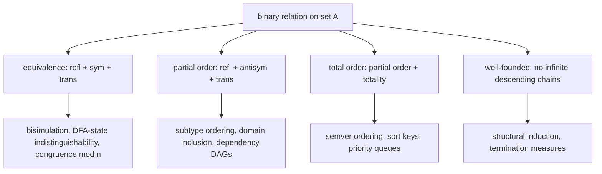
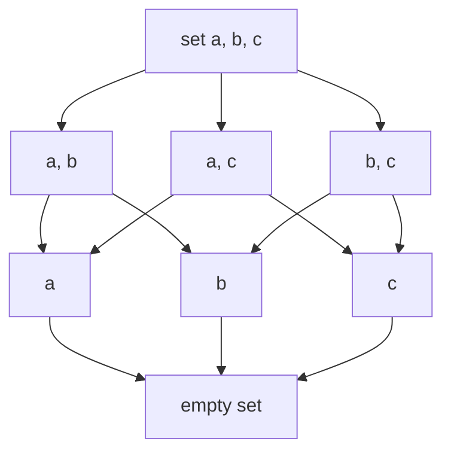

# Sets, Relations & Functions

## Overview

Sets, relations, and functions are the vocabulary in which every precise CS statement is written: type systems are partial orders, database theory is closure operators, hashing is a function with pigeonhole consequences, and undecidability proofs are diagonalization over sets. This page collects the definitions plus the CS-specific instantiations that interviewers actually probe — cardinality surprises, equivalence relations that buy you quotient structures, and fixpoint theorems that power static analyzers. Companion pages cover the proof techniques themselves ([Proof Techniques](./proofs.md)) and the logical connectives ([Logic](./logic.md)).

## Sets

A set is an unordered collection of distinct elements.

### Set Operations

```
A = {1, 2, 3, 4}
B = {3, 4, 5, 6}

Union:        A ∪ B = {1, 2, 3, 4, 5, 6}
Intersection: A ∩ B = {3, 4}
Difference:   A \ B = {1, 2}
Complement:   A' (everything not in A)
Symmetric:    A △ B = (A\B) ∪ (B\A) = {1, 2, 5, 6}
Cartesian:    A × B = {(1,3), (1,4), ..., (4,6)}
Power set:    P(A) = all subsets of A, |P(A)| = 2^n
```

### Set Laws

- **De Morgan's**: (A∪B)' = A'∩B', (A∩B)' = A'∪B'
- **Distributive**: A∩(B∪C) = (A∩B)∪(A∩C)
- **Absorption**: A∪(A∩B) = A

These laws are Boolean algebra in set clothing, and they are the same laws that power query optimizers (rewriting `WHERE a OR b` into union plans) and simplifying feature flags. The power set line deserves emphasis for interviews: |P(A)| = 2^|A| *strictly* exceeds |A| for every A — Cantor's theorem — and the gap never closes, even for infinite sets.

## Cardinality

Two sets have equal cardinality when a bijection connects them, which sidesteps the need to "count" infinite collections:

- |A| = |B| if there exists a bijection between A and B
- **Countable**: |A| ≤ |ℕ| (integers, rationals are countable)
- **Uncountable**: |A| > |ℕ| (reals are uncountable — Cantor's diagonal argument)

### Cantor Diagonalization, Worked

**Claim.** The real interval (0, 1) is uncountable.

**Proof.** Suppose f: ℕ → (0, 1) is surjective, and list its values, writing each as an infinite decimal f(n) = 0.dₙ₁dₙ₂dₙ₃… (fix a convention against dual expansions, e.g., no trailing 9s). Build x = 0.x₁x₂x₃… by setting xₙ = 5 if dₙₙ ≠ 5 and xₙ = 4 if dₙₙ = 5. Then x ∈ (0, 1), but x differs from f(n) in digit n for *every* n — so x ≠ f(n) for all n, contradicting surjectivity. Hence no surjection ℕ → (0,1) exists. ∎

The construction only ever needs the diagonal digits dₙₙ, which is why it defeats *any* proposed enumeration, no matter how clever. The same diagonal template reappears twice in theory: the halting problem's contradiction machine (see [Computability](./computability.md)) and Gödel's diagonal lemma (see [Gödel's Incompleteness Theorems](./godel-incompleteness.md)).

### Countable vs Uncountable: The CS-Relevant Ledger

| Set | Cardinality | Argument |
|---|---|---|
| ℕ, ℤ | countable | bijections with ℕ (zig-zag for ℤ) |
| ℕ × ℕ | countable | diagonal zig-zag enumeration of pairs |
| ℚ | countable | enumerate pairs (p, q) in lowest terms |
| Σ* for finite Σ (all strings) | countable | order by length, then lexicographically |
| All programs in a language | countable | programs are strings over ASCII |
| All computable real numbers | countable | countably many TMs, each computing ≤ 1 real |
| ℝ | uncountable | Cantor diagonalization above |
| All functions ℕ → ℕ | uncountable | diagonalization on function values |
| All languages over Σ* (subsets of Σ*) | uncountable | Cantor's theorem: \|P(Σ*)\| > \|Σ*\| |

The last three rows deliver a one-two punch that interviewers love: programs are countable but languages are uncountable, so **almost every language has no deciding program** — uncomputability is the norm, computability the countable exception. Likewise there are uncountably many reals but only countably many computable ones, so almost all real numbers are uncomputable in the strongest sense: no program can print their digits.

## Relations

A relation R from A to B is a subset of A × B.

### Properties of Relations on a Set A

| Property | Definition | Example |
|---|---|---|
| Reflexive | ∀a: (a,a) ∈ R | "≤" on integers |
| Symmetric | (a,b) ∈ R → (b,a) ∈ R | "is friend of" |
| Transitive | (a,b)∈R ∧ (b,c)∈R → (a,c)∈R | "is ancestor of" |
| Antisymmetric | (a,b)∈R ∧ (b,a)∈R → a=b | "≤" on integers |
| Equivalence | Reflexive + Symmetric + Transitive | "≡ mod n" |
| Partial Order | Reflexive + Antisymmetric + Transitive | "⊆" on sets |

### The CS Relation Taxonomy



### Equivalence Relations and Their Quotients

If R is an equivalence relation on A, then A is partitioned into equivalence classes:
- [a] = {x ∈ A : (a,x) ∈ R}
- Example: "≡ mod 3" on {0,1,2,3,4,5} → {[0]={0,3}, [1]={1,4}, [2]={2,5}}

The partition is the payoff: quotienting by an equivalence relation collapses each class to one point without losing the properties you care about. Three CS instances to have ready:

- **Bisimulation (≈)** relates states of a transition system that cannot be distinguished by any observable behavior; the quotient is the minimal equivalent system, and it is the mathematical core of state-space reduction in model checking (see [Bisimulation](../formal-methods/bisimulation.md)).
- **DFA state indistinguishability** (Myhill–Nerode): states p, q are equivalent if every suffix leads both to accept or both to reject; merging classes yields the unique minimal DFA used to canonicalize lexers.
- **Type equivalence**: structurally identical types, or α-equivalent lambda terms, form equivalence classes so that `int[3][4]` and `int[4][3]` can be judged once and reused.

### Partial Orders, Total Orders, Well-Foundedness

A partial order is reflexive, antisymmetric, and transitive (⊆ on sets; the subtype relation S <: T in Java/Scala/C#; module dependency with transitive closure). Partial orders admit *some* incomparable pairs — siblings in a class hierarchy need no ordering — and their Hasse diagrams drive greedy scheduling (topological sort = linear extension of the order). A total order adds totality (every pair comparable), which is what sorting, binary search, and priority queues require; version orderings in package managers (semver) must be total or dependency resolution deadlocks.

**Well-founded relations** have no infinite descending chains a₀ ≻ a₁ ≻ a₂ …, and this is the license for induction in its most general form: to prove P(a) for all a, prove that P holds of a whenever it holds of all ≺-smaller elements. Structural induction on terms is well-foundedness of the "subterm" relation; compiler termination proofs and termination checkers search for a *ranking function* into ℕ (a well-founded order) that strictly decreases on each loop iteration. Coq's guarded recursion and every proof assistant's induction tactic are this principle packaged as tooling (see [Proof Techniques](./proofs.md) and [The Curry–Howard Correspondence](./curry-howard.md)).

## Functions

A function f: A → B maps each element of A to exactly one element of B.

### Function Types

| Type | Definition | Example |
|---|---|---|
| Injective (one-to-one) | f(a)=f(b) → a=b | f(x)=2x on integers |
| Surjective (onto) | ∀b∈B, ∃a: f(a)=b | f(x)=x³ on reals |
| Bijective | Injective + Surjective | f(x)=x+1 on integers |

### Composition

If f: A→B and g: B→C, then g∘f: A→C defined by (g∘f)(x) = g(f(x)).

The counting consequences are the interview workhorses. If f: A → B is injective then |A| ≤ |B|; if surjective then |A| ≥ |B|; if bijective then |A| = |B| — this is how cardinality comparisons are actually executed. Composition preserves structure: bijections compose to bijections (giving the "same cardinality" equivalence relation), and injective∘injective stays injective, which is why layered encodings (compress, then encrypt, then base64) remain lossless end-to-end.

### Hashing: Injectivity on a Budget

A hash function h: keys → {0, …, m−1} cannot be injective when the key space exceeds m — the pigeonhole principle makes collisions *mathematically mandatory*, not an implementation bug. Three consequences every engineer should articulate:

- **Collision handling is not optional**: chaining and open addressing exist because injectivity is impossible in general; security additionally demands *collision resistance* (finding collisions should be computationally hard — SHA-256), which is stronger than mere non-injectivity.
- **Perfect hashing** is possible for *static* key sets: with the FKS two-level scheme, one can build an injective h for any fixed key set using O(n) space and O(1) lookups — injectivity purchased with preprocessing.
- **Birthday bounds**: with n keys dropped uniformly into m buckets, the first collision arrives around n ≈ 1.25·√m (so ~2⁶⁴ inputs break a 128-bit tag); this is the pigeonhole principle made quantitative.

### Parsing and Round-Trips as Function Properties

A parser is a relation strings → ASTs; it is a *function* exactly when the grammar is unambiguous, and injective exactly when no two distinct strings share a tree — ambiguity and injectivity are the same structural property viewed from different sides. Round-trip design is bijectivity engineering: `serialize`/`deserialize` compose to the identity only if the encoding is injective; XOR with a one-time pad is bijective (which is exactly why it decrypts perfectly); AES round operations are chosen to be bijective so decryption can invert them; lossy codecs (JPEG) deliberately drop injectivity to buy compression. When an interviewer asks "what does lossless mean formally?", the answer is: the encode function is injective.

## Closure Operators and Fixpoints

A **closure operator** on a set X is a function cl: P(X) → P(X) satisfying three axioms:

| Axiom | Statement | Intuition |
|---|---|---|
| Extensive | A ⊆ cl(A) | closure only adds |
| Monotone | A ⊆ B → cl(A) ⊆ cl(B) | bigger input, bigger closure |
| Idempotent | cl(cl(A)) = cl(A) | one pass reaches the fixed point |

Everyday instances: the **transitive closure** of a reachability relation (what "does a path exist?" computes), the **reflexive-transitive closure** Σ* of concatenation (Kleene star as closure), **attribute closure** under Armstrong's axioms in database normalization (see [Normalization](../dbms/normalization/README.md)), the **deductive closure** of a theory in logic, and the closure of a set of NFA states under ε-moves — the subset construction is a closure computation.

### Knaster–Tarski and Kleene Iteration

**Theorem (Knaster–Tarski).** A monotone function f on a complete lattice has a complete lattice of fixpoints; in particular it has a least fixpoint lfp(f) = ⋀{x : f(x) ≤ x} and greatest fixpoint gfp(f) = ⋁{x : x ≤ f(x)}.

**Theorem (Kleene).** If f is additionally ω-continuous, then lfp(f) = ⊔ᵢ fⁱ(⊥): the least fixpoint is the limit of iterating f from the bottom element.

```python
def lfp_iterate(f, bottom):
    """Least fixpoint of monotone f by Kleene iteration (finite lattices)."""
    x = bottom
    while True:
        nxt = f(x)
        if nxt == x:          # stabilized: nxt <= x and x <= nxt
            return x
        x = nxt               # ascending chain on a finite lattice

def reachable(edges, start):
    """Reachability = least fixpoint of 'add one successor step'."""
    return lfp_iterate(
        lambda s: s | {y for x in s for y in edges.get(x, ())},
        frozenset(start),
    )
```

This is not abstract bookkeeping — it is the semantics of real systems. Datalog's least Herbrand model is the lfp of the immediate-consequence operator (see [Datalog and Fixpoint Engines](./datalog-fixpoint-engines.md)); abstract interpretation computes program invariants as the lfp of a transfer function over a finite abstract lattice, soundness riding entirely on the iteration being conservative (see [Formal Methods](./formal-methods.md)); and the μ/ν quantifiers of the modal μ-calculus are literally "lfp" and "gfp" as temporal-logic operators (see [The μ-Calculus](../formal-methods/mu-calculus.md)). Widening/narrowing techniques in analyzers are exactly the tricks for forcing Kleene iteration to terminate on infinite lattices.

A **lattice** is a poset in which every pair of elements has a least upper bound (join, ∨) and greatest lower bound (meet, ∧); a *complete* lattice extends this to arbitrary subsets. The arena where Knaster–Tarski operates is the Boolean lattice — a power set ordered by ⊆:



Every subset of this lattice has a join (union) and a meet (intersection), so it is complete — and completeness, not finiteness, is what the Knaster–Tarski theorem needs. The monotone operator "add one edge-step of reachability" iterated from ∅ (bottom) climbs this lattice to the transitive closure at the least fixpoint; abstract-interpretation domains are exactly finite quotients of this picture sized to fit memory.

## Pigeonhole Instances in Interviews

The pigeonhole principle — n+1 objects in n boxes forces a collision — is cardinality in action, and it solves a surprising number of interview problems in one line:

- **Duplicate detection**: n+1 integers in the range [1, n] must contain a duplicate; the fix is an O(n) time / O(1) space index-marking or Floyd's cycle detection, justified by the pigeonhole guarantee that the duplicate exists.
- **Birthday paradox**: 23 people suffice for a >50% shared-birthday probability — the √m collision threshold from hashing reappears here.
- **Hash table sizing**: any hash from a larger key universe into m slots must collide; only *which* keys collide is under engineering control.
- **Round-robin guarantees**: distributing n requests over n−1 workers guarantees a worker with ≥ 2 requests — the basis of simple load and shard-assignment arguments.

For the full proof patterns (direct, contradiction, induction — of which pigeonhole is a corollary), see [Proof Techniques](./proofs.md); for the decision-tree counting argument that yields the Ω(n log n) sorting bound, see [Comparison Sorting Lower Bound](./comparison-sorting-lower-bound.md).

## Interview Questions

**Q: What is an equivalence relation? Give an example.**
A: A relation that is reflexive, symmetric, and transitive. Example: "has the same birthday as" — everyone has their own birthday (reflexive), if A shares B's birthday then B shares A's (symmetric), and it's transitive.

**Q: What is the difference between injective, surjective, and bijective?**
A: Injective: different inputs → different outputs (no collisions). Surjective: every output is hit by some input (no gaps). Bijective: both — a perfect one-to-one correspondence.

**Q: Sketch the proof that the reals are uncountable.**
A: Assume an enumeration f(0), f(1), f(2), … claims to list every real in (0,1). Build a new real x by walking down the diagonal: set x's n-th digit different from the n-th digit of f(n). Then x is a real of (0,1) that differs from every f(n), contradicting completeness of the list. The construction needs only the diagonal digits, so it defeats any enumeration whatsoever — and the same template proves the halting problem undecidable.

**Q: Why does "programs are countable, languages are not" matter?**
A: Programs are strings over a finite alphabet, hence countable; languages are subsets of Σ*, and there are uncountably many of them by Cantor's theorem. So almost all languages have no recognizing program at all — uncomputability is generic. This is the bird's-eye version of the halting problem and Rice's theorem: specific undecidability results are the computable-world's contact with that uncountable majority.

**Q: Why must hash collisions exist, and when can they be avoided?**
A: A hash compresses a larger key universe into m slots, and by the pigeonhole principle no function into a smaller set is injective — collisions are mandatory in general. They *can* be avoided for static key sets via perfect hashing (FKS two-level schemes give O(1) lookup with no collisions using O(n) space), and they can be made *computationally hard to find* via cryptographic collision resistance — which is a different, weaker-in-math but stronger-in-practice property.

**Q: Give a CS example of an equivalence relation and what its equivalence classes buy you.**
A: Bisimulation on the states of a transition system: reflexive, symmetric, transitive, and its classes collapse the state space to a minimal bisimilar system — reducing model-checking cost without changing observable behavior. The same pattern in DFA minimization (Myhill–Nerode classes) yields the unique minimal automaton for a regular language.

**Q: What does well-foundedness give you that ordinary induction structure does not?**
A: A license to do induction over *any* relation with no infinite descending chains — not just ℕ's <. Termination checkers exploit this: exhibiting a ranking function into a well-founded order proves every loop terminates, and proof assistants (Coq) accept recursive definitions only when the recursion is guarded by a well-founded measure. It generalizes structural induction to arbitrary decreasing measures.

**Q: Five points lie in a unit square. Prove that two are within distance √2/2.**
A: Split the square into four ½ × ½ boxes; by the pigeonhole principle, two of the five points share a box. The farthest two points inside one such box can be is its diagonal, √(½² + ½²) = √½ = √2/2. The whole proof is a partition argument — choosing boxes small enough that sharing one forces the desired bound — which is the standard template for geometric pigeonhole problems.

**Q: State Knaster–Tarski and name a system that runs on it.**
A: A monotone function on a complete lattice has a least and greatest fixpoint, and both live inside the lattice. Abstract interpretation computes program invariants as the least fixpoint of a transfer function on an abstract lattice; Datalog engines compute the least Herbrand model the same way; the μ-calculus builds temporal logics out of μ (lfp) and ν (gfp) quantifiers directly.

## Key Takeaways

- Cardinality comparisons run through bijections: injective means |A| ≤ |B|, surjective means |A| ≥ |B|, bijective means equal.
- Cantor diagonalization proves ℝ uncountable; the same diagonal template proves the halting problem undecidable and drives Gödel's incompleteness theorems.
- Strings, programs, and computable reals are countable; reals, functions ℕ→ℕ, and languages over Σ* are not — so almost all languages are uncomputable.
- Equivalence relations partition their set; the quotient structure (minimal DFA, bisimilar minimal system) is the practical payoff.
- Partial orders (subtyping, domain inclusion) tolerate incomparability; total orders (sorting, versioning) forbid it; well-founded orders license induction and termination proofs.
- Hash functions into a smaller range can never be injective (pigeonhole) — collision handling is mandatory, perfect hashing is possible only for static sets, and birthday bounds quantify the collision risk.
- Knaster–Tarski gives least/greatest fixpoints of monotone operators on complete lattices; Kleene iteration computes them — the engine inside Datalog, abstract interpretation, and the μ-calculus.

## References

- [Discrete Mathematics — Rosen](https://www.mheducation.com/highered/product/discrete-mathematics-applications-rosen/M9780073383095.html)
- [MIT OCW 6.042J — Mathematics for CS](https://ocw.mit.edu/courses/6-042j-mathematics-for-computer-science-fall-2010/)
- A. Tarski, "A Lattice-Theoretical Fixpoint Theorem and Its Applications," *Pacific Journal of Mathematics*, 5(2), 1955.
- P. Cousot and R. Cousot, "Abstract Interpretation: A Unified Lattice Model for Static Analysis of Programs by Construction or Approximation of Fixpoints," *POPL*, 1977.
- G. Cantor, "Über eine elementare Frage der Mannigfaltigkeitslehre," *Jahresbericht der DMV*, 1 (1891).

## Cross-References

- [Proof Techniques](./proofs.md) — induction, contradiction, and pigeonhole as proof patterns
- [Logic](./logic.md) — the propositional/predicate layer over these set-theoretic objects
- [Computability](./computability.md) — diagonalization over programs: the halting problem
- [Discrete Mathematics](../mathematics/discrete-math.md) — combinatorics and modular arithmetic tooling
- [Bisimulation](../formal-methods/bisimulation.md) — the equivalence relation behind state-space minimization
- [Datalog and Fixpoint Engines](./datalog-fixpoint-engines.md) — least-model computation as Kleene iteration
- [The μ-Calculus](../formal-methods/mu-calculus.md) — least/greatest fixpoints as logical quantifiers
- [Normalization](../dbms/normalization/README.md) — attribute closure and Armstrong's axioms in practice
