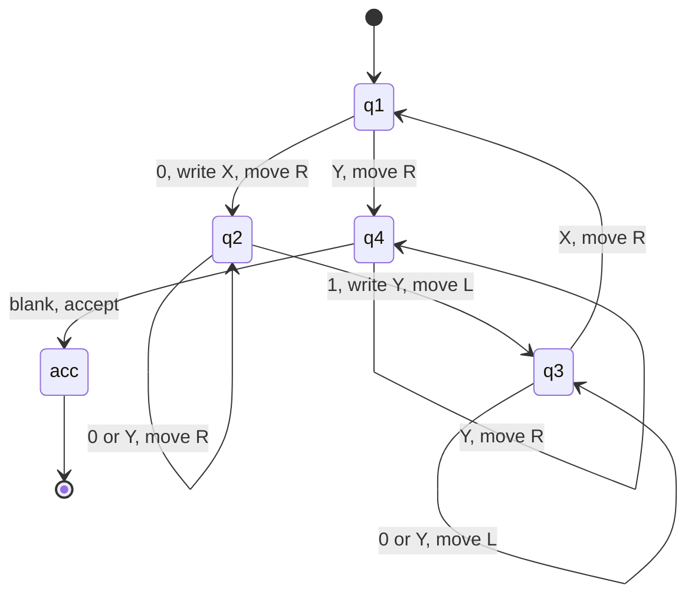
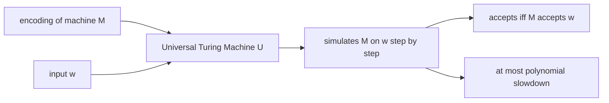
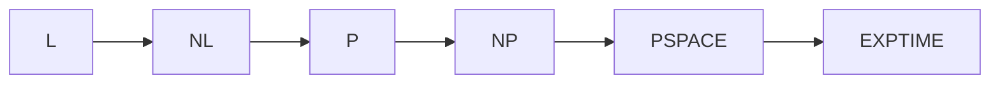

# Turing Machines

## Overview

The Turing machine is the minimal abstract device that captures everything computable: a finite control, a tape, and one moving head are provably enough to simulate any algorithm on any hardware. Because every reasonable model of computation collapses to the same class of computable functions, the TM gives complexity theory a stable yardstick — time and space classes are defined on it, and conclusions transfer to real machines. Interviews use TMs to test whether you understand the boundary between *what can be computed at all* (see [Computability](./computability.md)) and *what can be computed efficiently* (see [Complexity Classes](./complexity-classes.md)).

## Formal Definition

A Turing machine (TM) is a 7-tuple M = (Q, Σ, Γ, δ, q₀, q_accept, q_reject) where:

| Component | Description |
|-----------|-------------|
| Q | Finite set of states |
| Σ | Input alphabet (does not include blank ⊔) |
| Γ | Tape alphabet (Σ ⊂ Γ, includes ⊔) |
| δ | Transition function: Q × Γ → Q × Γ × {L, R} |
| q₀ | Start state |
| q_accept | Accept state |
| q_reject | Reject state (q_accept ≠ q_reject) |

The TM has an **infinite tape** divided into cells, each holding a symbol from Γ. A **read/write head** scans one cell at a time. At each step, δ determines the next state, symbol to write, and head movement.

### Configurations and Acceptance

A **configuration** of M is a string uqv, where q ∈ Q, uv ∈ Γ* is the tape content, and the head scans the first symbol of v (or ⊔ if v = ε). The **yields** relation C₁ ⊢ C₂ holds when one δ-step takes C₁ to C₂, and ⊢* is its reflexive-transitive closure. The machine **accepts** w if q₀w ⊢* u q_accept v for some u, v, and its language is L(M) = {w : M accepts w}; M is a *decider* if it halts (accepts or rejects) on every input, and only deciders define decidable languages.

For the machine deciding {0ⁿ1ⁿ} below, the computation on 0011 runs:

```
q₁ 0 0 1 1  ⊢  X q₁ 0 1 1   ⊢  X 0 q₂ 1 1   ⊢  X q₃ 0 Y 1
           ⊢  q₃ X 0 Y 1   ⊢  X q₁ 0 Y 1   ⊢  X X q₂ Y 1
           ⊢  X X Y q₂ 1   ⊢  X X q₃ Y Y   ⊢  X q₃ X Y Y
           ⊢  X X q₁ Y Y   ⊢  X X Y q₄ Y   ⊢  X X Y Y q₄ ⊔
           ⊢  accept
```



This machine decides {0ⁿ1ⁿ} by crossing off one 0 and one 1 per pass: q1 marks the leftmost unmarked 0, q2 scans right for the first unmarked 1, q3 rewinds, and q4 verifies only Y's remain. It is the standard example of a decider whose language is not regular — one state diagram shows the extra power a tape buys over a DFA's fixed states.

Real TM constructions reuse a handful of idioms worth naming, because decidability proofs are compositions of them: **marking** (overwrite a consumed symbol with an X/Y shadow alphabet, as above), **multi-pass** (one sweep per unit of work — the source of the O(n²) overhead in naive simulations), **zig-zag** (alternating right and left sweeps between two frontier positions), and **formatting guards** (q_reject on any unexpected symbol, so malformed inputs are rejected rather than accepted by accident). Recognizing that a proposed machine is just "marking + multi-pass" is usually the fastest way to convince an interviewer it terminates: each pass strictly reduces the number of unmarked symbols.

## Church-Turing Thesis

> Any function that is effectively computable by an algorithm can be computed by a Turing machine.

This is a **thesis**, not a theorem — it cannot be proved because "effectively computable" is informal. However, every proposed model of computation (lambda calculus, μ-recursive functions, Post systems, modern programming languages) has been shown equivalent to TMs.

The thesis has two strengths worth distinguishing. The ** Church–Turing thesis proper** concerns human-executable effective procedures; the **physical Church–Turing thesis** extends it to what any physical device can compute. All evidence supports the first; the second is contested at the margins (see [Physical Variants and Hypercomputation](#physical-variants-and-hypercomputation)). Convergence evidence is stronger than any single proof: mutually independent formalizations (Turing machines, lambda calculus, Post systems, random-access machines with realistic cost, cellular automata) all define the same computable functions.

### Physical Variants and Hypercomputation

Proposed ways "around" the thesis all assume something unphysical:

- **Zeno machines** perform infinitely many steps in finite time (step n takes 2⁻ⁿ units) — this requires infinite energy or precision and no known physics realizes it.
- **Malament–Hogarth spacetimes** in general relativity would let an observer receive the answer of an infinite computation; whether such spacetimes can exist with matter is open, and no engineer gets to choose their spacetime.
- **Analog computation** over real-valued quantities claims infinite precision in a single real number — but noise, thermal limits, and finite measurement precision reduce any real device to a finite-precision machine, which is a finite automaton at the extreme.

Quantum computing deserves a precise statement: it does **not** extend computability. BQP sits strictly inside the decidable languages; Shor's algorithm factors integers that classical machines can also factor, just slower. Quantum mechanics changes the *complexity* landscape, not the *computability* one (see [Quantum Computing](./quantum-computing.md)). The honest formal generalization of "adding an oracle" is Turing's own ordinal logics (1939) and relativized computation — mathematically rich, physically unimplementable.

## Variations

### Multi-tape Turing Machine

k tapes, each with its own head. Transition: δ: Q × Γᵏ → Q × Γᵏ × {L, R, S}ᵏ.

**Theorem**: Multi-tape TMs are equivalent in power to single-tape TMs (simulation overhead: O(n²) time).

The simulation stores all k tracks on one tape separated by markers; each simulated step requires a sweep between the leftmost and rightmost virtual heads, and after t steps that sweep costs O(t), giving O(t²) total. Hopcroft–Ullman-style blocked-tape constructions improve this, but the qualitative point is what matters: polynomial overhead, no change in language class. Other variations with the same moral: a **semi-infinite tape** (one-way infinite) is equivalent to the two-way tape; a **stay-put** option in δ changes nothing; **two stacks** simulate one tape.

### Non-deterministic Turing Machine (NTM)

δ: Q × Γ → 𝒫(Q × Γ × {L, R}). The machine "guesses" the correct transition. It accepts if **any** computation path reaches q_accept.

**Theorem**: NTMs are equivalent in power to deterministic TMs (simulation overhead: 2^O(n) time).

Deterministic simulation breadth-first searches the configuration graph: within t steps the number of reachable configurations is at most bᵗ · poly(t) for constant branching b, hence 2^O(t). This exponential-but-finite simulation is exactly why nondeterminism buys no new *languages* — and the open question of whether it buys polynomial *speed* is P vs NP (see [Complexity Classes](./complexity-classes.md)).

### Enumerators

A TM with a printer. It enumerates a language L by printing all strings in L. Equivalent to recognizable languages.

The equivalence has content in both directions: an enumerator for L gives a recognizer (run the enumerator, accept if w is ever printed), and a recognizer gives an enumerator (dovetail simulations of M on all inputs in lexicographic-with-skips order, printing each string when its simulation accepts). One caveat: an enumerator for an infinite language never halts, mirroring the fact that recognizers need not halt on non-members.

### Summary of Equivalence Theorems

| Variant | Power relative to standard TM | Simulation overhead | Consequence |
|---|---|---|---|
| Multi-tape | same languages | O(t²) time | complexity classes defined on multitape model |
| Nondeterministic | same languages | 2^O(t) time | nondeterminism is about speed, not solvability |
| Two stacks | same languages | polynomial | a tape = two stacks |
| Semi-infinite tape | same languages | constant factor | geometry of the tape is irrelevant |
| Enumerator | recognizes exactly RE languages | dovetailing | enumeration = recognition |

## Universal Turing Machine

A UTM U takes as input ⟨M, w⟩ (an encoding of TM M and input w) and simulates M on w. This is the theoretical basis for stored-program computers — the machine and its input share the same tape.

```python
def simulate_tm(tape, transitions, start_state):
    """Simplified TM simulation."""
    head = 0
    state = start_state
    while state not in ('q_accept', 'q_reject'):
        symbol = tape[head] if head < len(tape) else '⊔'
        if (state, symbol) not in transitions:
            state = 'q_reject'
            break
        new_state, write_symbol, direction = transitions[(state, symbol)]
        if head < len(tape):
            tape[head] = write_symbol
        state = new_state
        head += 1 if direction == 'R' else -1
    return state == 'q_accept'
```

The UTM is the conceptual ancestor of every interpreter, hypervisor, emulator, and virtual machine: one fixed machine executes descriptions of arbitrary machines. It also makes self-reference possible — a TM can be handed *its own* encoding — which is the fuel for the halting problem's diagonalization, for Rice's theorem, and for the recursion theorem (Kleene): a machine can obtain its own description and legally use it. Von Neumann's stored-program architecture is the engineering translation: instructions and data live in the same memory, so a "program" is just a bit string the universal machine can load.

The cost of universality is simulation overhead: a reasonable UTM slows its guest by at most a polynomial factor, which is why complexity classes are invariant under "which universal machine you pick." This invariance is what makes an interpreter hierarchy (emulators on emulators) merely slow rather than computationally weaker.



### Three Levels of Description

Sipser's convention distinguishes three ways to specify a TM, and knowing when each is legitimate avoids both hand-waving and page-long δ tables. An **implementation-level description** spells out states and transitions — needed when you are proving a simulation overhead bound or constructing a diagonalizing machine D. A **high-level description** describes the algorithm in prose ("find the leftmost unmarked 0, mark it, scan right for the first unmarked 1") with the guarantee that a TM can implement it — the standard currency for decidability proofs. Finally, the **run-with-input** convention fixes a particular w so the description becomes an execution trace. The UTM is what licenses the high-level style: since machines can interpret machine descriptions, a proof may reason at the algorithmic level and leave the δ-plumbing as a mechanical exercise.

## Time and Space Complexity Classes on TMs

With a machine model fixed, complexity classes are just quantified bounds on TM resources (Sipser-style definitions):

| Class | Model | Bound | Canonical members |
|---|---|---|---|
| TIME(t) | multitape TM | O(t) steps | sorting-related decision problems in TIME(n log n) |
| SPACE(s) | TM | O(s) tape cells | every regular language in SPACE(O(log n)) or less |
| L / NL | TM | O(log n) space, deterministic / nondeterministic | undirected s-t connectivity is in L (Reingold, 2005) |
| P | multitape TM | poly time | reachability, matching, LP, AKS primality |
| NP | NTM | poly time | SAT, Hamiltonian path |
| PSPACE | TM | poly space | QBF, generalized game evaluation |
| EXP | multitape TM | 2^poly time | games with exponentially large boards |



Known facts versus conjectures, a standard interview trap: L ⊆ NL ⊆ P ⊆ NP ⊆ PSPACE ⊆ EXPTIME, but only two of these inclusions are *known to be strict* — L ⊊ PSPACE and PSPACE ⊊ EXPTIME (by the space and time hierarchy theorems). Whether P ≠ NP, whether NP ≠ PSPACE, and whether NL = L are open. Definitions are made on the *multi-tape* model because it is the robust one: single-tape machines have idiosyncrasies (e.g., palindromes require Ω(n²) time on a one-tape TM by Hennie's crossing-sequence argument, but O(n) on two tapes), so class definitions would be model-fragile otherwise.

### Model Robustness and the Linear Speedup Theorem

Two theorems justify ignoring constant factors in complexity theory. **Polynomial invariance**: any two reasonable sequential models (single-tape, multi-tape, RAM with log-cost access, real programming languages) simulate each other with polynomial overhead, so P, NP, and PSPACE are the same classes under any reasonable choice. **Linear speedup** (for multitape TMs): a machine running in time t(n) can be converted into one running in t(n)/c + 2n for any constant c, by packing c input symbols per tape cell and pre-computing c-step macro-transitions — so constant factors are artifacts of encoding, and big-O is the right granularity. Space analogues hold similarly (tape compression). The caveats that keep the theorems honest: single-tape TMs cannot be linearly sped up below Ω(n) (they must read the input), and *unbounded* unit-cost RAMs with exotic word operations are not polynomially equivalent — the exception that proves the "reasonable model" rule.

## TMs vs the RAM Model

Algorithms courses count steps on a **word RAM**; complexity theory counts steps on a TM. The mismatch is a live interview discussion:

| Aspect | Turing machine | Word RAM |
|---|---|---|
| Memory access | sequential head movement | O(1) indexed access to memory[i] |
| Operation cost | one cell read/write per step | one word operation per step |
| Simulating the other | polynomial overhead | TM simulated directly; RAM on TM costs a log factor per random access |
| Data structure impact | none — no pointers to follow | central: heaps, hash maps, skip lists exist because of O(1) access |
| Used for | defining P, NP, PSPACE robustly | designing algorithms whose constants match hardware |

The reconciliation: a word RAM with Θ(log n)-bit words and unit-cost +, −, ×, comparisons is polynomially equivalent to TMs (each random access costs O(log n) TM steps), so the classes agree and only polynomial-vs-polylog factors differ. The pathological case is a *transdichotomous* temptation in reverse: allow unbounded-length words with unit-cost arithmetic, and the model can compute strictly more than a polynomial-time TM can — which is why real complexity theory never adopts unbounded unit-cost words. Practical consequence: when an interviewer asks "is O(1) array access realistic?", the answer is that it is a *model choice* justified by polynomial equivalence, and algorithmic comparisons should hold word size fixed at Θ(log n).

## Decidability Classes

| Class | Definition | Example |
|-------|-----------|--------|
| Decidable | TM halts on all inputs (accepts or rejects) | A_DFA, A_CFG |
| Recognizable | TM halts on accepted inputs, may loop on rejected | A_TM |
| Undecidable | No TM decides it | Halting problem |

## Interview Questions

**Q: What is the Church-Turing thesis and why can't it be proved?**
A: It states that any effectively computable function can be computed by a TM. It's a thesis because "effectively computable" is an informal, intuitive notion — there's no formal system to reason about. All known computational models have been proven equivalent, lending strong evidence.

**Q: Are multi-tape TMs more powerful than single-tape TMs?**
A: No. They are equivalent in the languages they recognize. A multi-tape TM can be simulated by a single-tape TM with quadratic overhead. They differ only in efficiency, not computational power.

**Q: What is a Universal Turing Machine and why does it matter?**
A: A UTM simulates any other TM given its description. It proves that a single fixed machine can perform any computation, which is the theoretical foundation for general-purpose computers and the concept of software.

**Q: Why does nondeterminism not increase the power of a Turing machine?**
A: An NTM accepts if *some* branch accepts, and a deterministic TM can find that branch by breadth-first search over configurations: after t steps, at most bᵗ·poly(t) configurations are reachable, so simulation takes 2^O(t) time. Every NTM has a deterministic TM for the same language, exponentially slower. What remains open is whether the exponential is necessary for *polynomial*-time problems — that is exactly P vs NP.

**Q: Why are complexity classes like P defined on multi-tape machines rather than single-tape or RAM?**
A: The multi-tape model is the robust middle ground: it avoids single-tape artifacts (palindromes need Ω(n²) on one tape but O(n) on two) while remaining polynomially equivalent to everything reasonable, including word RAMs with log-size words. Combined with the linear speedup theorem — which shows constant factors are encoding artifacts — this makes P, NP, and PSPACE model-independent, so definitions do not shift under reasonable hardware changes.

**Q: Does quantum computing break the Church–Turing thesis?**
A: No. A quantum computer's output can always be simulated by a classical TM (BQP ⊆ decidable — in fact BQP ⊆ PSPACE), so quantum mechanics extends *efficiency*, not *computability*. Shor's algorithm is faster, not more powerful. The thesis that quantum physics might genuinely challenge is the *physical* Church–Turing thesis regarding feasible computation, and even that is about polynomial factors.

**Q: How can a TM have an infinite tape when every real computer has finite memory?**
A: The infinity is an upper bound, not an inventory: for any fixed input, a TM touches only finitely many cells — at most one new cell per step. So "infinite tape" means "unbounded": no a-priori limit on how much scratch space a computation may need, which is exactly the property DFAs lack. Real machines emulate this by growing memory on demand (page allocation), and they fail the model only when the physical disk runs out — a resource limit, not a computability limit.

**Q: What is a configuration, and why does the yield relation matter?**
A: A configuration uqv records the tape content, the state, and the head position in one finite string; C₁ ⊢ C₂ means one transition step connects them. Everything about a TM — acceptance, time bounds, the configuration graph that nondeterministic simulation searches — is defined on configurations. The yield chain also shows why "does M accept w?" is semi-decidable: you can enumerate configurations reachable from q₀w, but if w ∉ L(M) that enumeration never ends.

**Q: Does it matter *how* we encode machines and inputs, e.g., for the UTM or for reductions?**
A: Only up to polynomial factors, and only if the encoding is reasonable — computable, unambiguous, and at most polynomially longer than a natural description. Any two reasonable encodings translate in polynomial time, so decidability conclusions are encoding-independent, and complexity classes stay put by the polynomial invariance theorem. The caveat that makes "reasonable" necessary: unary-encoded numbers or exponentially padded descriptions can move problems in and out of polynomial time, which is why complexity theory always states the encoding convention alongside a claim.

## Key Takeaways

- A TM is a 7-tuple with one infinite tape and one head; configurations uqv and the yield relation ⊢* formalize "one step of computation."
- Every reasonable variant — multi-tape, nondeterministic, two-stack, semi-infinite tape, enumerators — recognizes exactly the same language class; only overhead differs (O(t²), 2^O(t), polynomial in general).
- The universal TM is software's existence proof: one fixed machine runs any machine's description, enabling self-reference, the recursion theorem, interpreters, and the stored-program architecture.
- Simulation overhead is polynomial, which is precisely why complexity classes (P, NP, PSPACE) are model-independent across reasonable machines.
- Only L ⊊ PSPACE and PSPACE ⊊ EXPTIME are known strict inclusions; P vs NP and friends are open.
- The linear speedup theorem justifies big-O: constant factors on multitape TMs are encoding artifacts.
- Quantum computing changes efficiency (BQP), not computability; hypercomputation proposals (Zeno machines, analog precision) rely on unphysical assumptions.

## References

- [Introduction to the Theory of Computation — Sipser](https://www.cengage.com/c/introduction-to-the-theory-of-computation-sipser-3e/)
- [Computability — Nigel Cutland](https://www.cambridge.org/core/books/computability/)
- A. M. Turing, "On Computable Numbers, with an Application to the Entscheidungsproblem," *Proc. London Math. Soc.* s2-42 (1936) — [doi:10.1112/plms/s2-42.1.230](https://doi.org/10.1112/plms/s2-42.1.230)
- A. M. Turing, "Systems of Logic Based on Ordinals," *Proc. London Math. Soc.* s2-45 (1939).
- [Stanford Encyclopedia of Philosophy — The Church–Turing Thesis](https://plato.stanford.edu/entries/church-turing/)
- [Stanford Encyclopedia of Philosophy — Turing Machines](https://plato.stanford.edu/entries/turing-machine/)
- J. Hennie, "One-Tape, Off-Line Turing Machine Computations," *Information and Control*, 8 (1965).

## Cross-References

- [Computability](./computability.md) — what no TM can do: halting problem, Rice's theorem, reductions
- [Formal Languages](./formal-languages.md) — where TMs sit in the Chomsky hierarchy (Type 0)
- [Complexity Classes](./complexity-classes.md) — P, NP, PSPACE and reductions with time bounds
- [Lambda Calculus](./lambda-calculus.md) — an independent universal model, equivalent to TMs
- [Gödel's Incompleteness Theorems](./godel-incompleteness.md) — self-reference via encodings, the TM's trick in arithmetic
- [Quantum Computing](./quantum-computing.md) — BQP: a change of efficiency, not of computability
- [Computational Models and Complexity Classes](../dsa/chapters/ch70-computational-models.md) — interview-oriented survey of the same models
