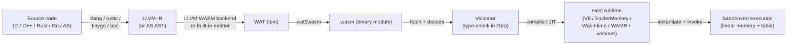
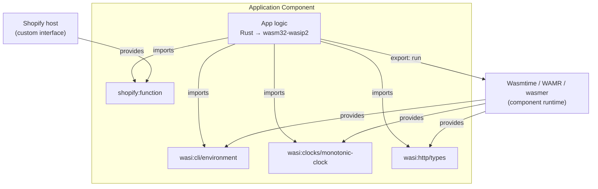

# WebAssembly — WASM, WASI, and the Component Model

## Overview

**WebAssembly (WASM)** is a binary instruction format for a stack-based virtual machine. It was designed as a portable compilation target for high-level languages like C, C++, Rust, Go, and AssemblyScript, enabling deployment on the web and beyond at near-native performance. The W3C finalized the core specification in December 2019, making WASM the fourth "first-class" language of the web alongside HTML, CSS, and JavaScript — the only one with a fully formal semantics published alongside the spec.

The motivating problem: JavaScript engines, despite extraordinary JIT investment, hit fundamental limits running compute-heavy workloads (video codecs, image processing, games, scientific simulations). asm.js demonstrated that a restricted subset of JS could be ahead-of-time compiled to near-native speed, but it remained text — megabytes of parseable source shipped over the wire. WASM solves this with a compact binary format, a typed stack-machine IR, deterministic validation, and a strict sandboxed execution model. Beyond the browser, WASM's safety/portability/performance triangle has made it attractive for plugin systems (Shopify Functions, Cloudflare Workers), edge computing (Fastly Compute@Edge), serverless (Fermyon Spin), and sandboxed extensions (where it competes with containers and microVMs).

The ecosystem is split into two layers: the **core WASM specification** (modules, instructions, linear memory, tables) and **WASI** — the WebAssembly System Interface — which standardizes how WASM modules access host capabilities (files, network, clock, random) without breaking portability or sandboxing. The newer **Component Model** layers a typed interface-description language and canonical ABI on top of core modules, enabling cross-language composition (a Rust component calling a Go component passing a Rust `String` to a Go `string`).

> Related: [Formal Methods](./formal-methods.md) (WASM's formal semantics, validation), [Compilers / LLVM](../compilers/README.md) (LLVM WASM backend), [Rust](../languages/rust/README.md) (prime WASM source language), [C](../languages/c/README.md) (Emscripten pipeline), [JavaScript / V8](../languages/javascript/v8.md) (host JIT integration), [Containers / Docker](../backend/containers/docker.md) (WASM as lighter alternative), [Linux Containers](../linux/containers/containerd.md)

## Compilation Pipeline

WASM is a *target*, not a *source language*. Developers do not write WASM directly (though the textual WAT format exists); they write in a source language whose compiler lowers to WASM. The dominant path is LLVM-based: Clang or rustc lowers source to LLVM IR, which the LLVM WASM backend (added in LLVM 8) lowers to a `.wasm` object. Languages without an LLVM frontend (Go, AssemblyScript) have their own WASM emitters. The pipeline below shows the canonical flow from source code to a running instance inside a host (browser engine or standalone runtime).



Three properties of this pipeline matter for performance. First, **validation is linear-time and ahead-of-time**: a module is type-checked once, before any execution, in a single streaming pass — there is no "warm-up" tier where unsafe code runs interpreted. Second, **the binary is dense** (about 0.8 bytes per instruction; a 1 MB binary encodes ~1.2 M instructions), reducing parse time relative to JavaScript by ~20×. Third, **the host runtime is free to tier the WASM itself** — V8 compiles WASM first with Liftoff (a fast single-pass baseline compiler) and then re-tiers hot functions with TurboFan; Wasmtime uses Cranelift to generate machine code in milliseconds. The result is consistent near-native performance from the first call, with no GC pauses in the core (non-GC) pipeline.

## Module Structure

A WASM **module** is the unit of deployment, distribution, and validation. It is a sequence of sections, each identified by a one-byte ID. The validator processes sections in order; references to later sections are forbidden, which keeps validation single-pass. The structural layout is fixed by the spec and identical across all conformant engines.

```mermaid
flowchart TB
    MOD["WASM Module (.wasm)"]
    MOD --> S1["§1 Type<br/>(function signatures)"]
    MOD --> S2["§2 Import<br/>(external deps)"]
    MOD --> S3["§3 Function<br/>(sig index → body index)"]
    MOD --> S4["§4 Table<br/>(funcref / externref arrays)"]
    MOD --> S5["§5 Memory<br/>(linear memory decl)"]
    MOD --> S6["§6 Global<br/>(module-scoped mutable cells)"]
    MOD --> S7["§7 Export<br/>(exposed names)"]
    MOD --> S8["§8 Start<br/>(entry function)"]
    MOD --> S9["§9 Element<br/>(table initializers)"]
    MOD --> S10["§10 Code<br/>(function bodies)"]
    MOD --> S11["§11 Data<br/>(memory initializers)"]
    MOD --> S12["§12 DataCount"]
    MOD --> S13["§13 Tag<br/>(event handling, proposal)"]
```



Each section is optional except the implicit structure; a module that exports nothing is valid. The **type section** lists function signatures as `($param_types) → ($result_types)`; the **import section** declares dependencies on the host (functions, tables, memories, globals) by a two-level name `(module, name)` — this is how WASM modules request capabilities rather than assuming them. The **export section** mirrors this: it publishes module-internal entities under string names so the host can invoke them. The **code section** holds function bodies as expression trees in postfix (stack-machine) order; the **data** and **element** sections hold initial bytes for memory and tables. Notably there is no section for "classes" or "objects" in core WASM — those are source-language abstractions lowered to memory + table primitives by the producer.

## Value Types and Instruction Set

Core WASM 1.0 (the MVP) supports exactly four value types: `i32`, `i64`, `f32`, `f64` — 32/64-bit integers and floats. Integers are interpreted as signed or unsigned by individual instructions, not by the type. The proposal pipeline has since added `v128` (SIMD), `funcref` and `externref` (reference types), and the GC proposal's `struct`, `array`, and `anyref` family. The instruction set is deliberately small (~170 instructions in the MVP) and stack-based: instructions pop operands and push results on an implicit operand stack, which the validator type-checks statically.

A minimal WAT module that exports an `add` function:

```wat
(module
  (func $add (export "add") (param i32 i32) (result i32)
    local.get 0    ;; push first param
    local.get 1    ;; push second param
    i32.add        ;; pop two, push sum
  )
)
```

The textual form is a 1:1 rendering of the binary: every WAT token corresponds to one opcode or immediate, and `wat2wasm`/`wasm2wat` round-trip losslessly. Instructions fall into families: **arithmetic** (`i32.add`, `i64.mul`, `f64.sqrt`), **control** (`block`, `loop`, `if`, `br`, `br_table`, `call`, `return`), **memory** (`i32.load`, `i64.store`, `memory.size`, `memory.grow`), **variable** (`local.get`, `local.set`, `global.get`), **reference** (`ref.func`, `ref.null`, `ref.is_null`), and **SIMD** (`v128.load`, `i8x16.add`). The validator tracks the operand stack's type at every program point; a function that would push the wrong type or leave the stack unbalanced at exit is rejected at validation, before execution.

## Linear Memory Model

A WASM **linear memory** is a contiguous, mutable byte array — conceptually `Vec<u8>` — addressed by `i32` (or `i64` under the memory64 proposal) offsets. The MVP permits a module to declare up to one memory; the multi-memory proposal lifts this. Memories grow by whole pages of 64 KiB; `memory.grow` returns the old size in pages or `-1` on failure. Memory access instructions encode an *alignment hint* and a static *offset immediate*; the effective address is `offset_immediate + dynamic_operand`. Bounds checks trap on overflow — there is no undefined behavior in safe WASM the way there is in C.

Linear memory is the substrate for everything the core spec doesn't model: C/C++ heaps, Rust `Box`/`Vec`, Go goroutine stacks, string data. The producer (the language's WASM backend) is responsible for laying out objects in linear memory; the host cannot introspect structure types unless it speaks a higher-level ABI. This design decision is central to WASM's portability and security: a function pointer in C becomes an index into a `funcref` table; a heap pointer becomes an `i32` byte offset. The sandbox guarantees that no offset, however corrupted, can address bytes outside the memory's current bounds — the classic buffer-overflow attack vector is structurally closed.

```wat
(module
  (memory (export "mem") 1 4)        ;; 1 page min, 4 pages max = 64–256 KiB
  (func (export "load_word") (param i32) (result i32)
    (i32.load offset=0 align=4 (local.get 0)))
  (func (export "store_word") (param i32 i32)
    (i32.store offset=0 align=4 (local.get 0) (local.get 1)))
)
```

The `align=` immediate is purely a performance hint; the trap behavior is identical for any alignment. Some runtimes (Wasmtime, V8) elide bounds checks when an offset+operand access provably falls within a guard page placed at the end of a 4 GiB reservation, achieving zero-overhead memory safety.

## Tables and Reference Types

Calls to **indirect functions** — function pointers, virtual method dispatch, dynamic callbacks — cannot be raw integers into the code section, because that would break sandboxing (a module could call into the middle of an arbitrary host function). Instead, WASM uses **tables**: arrays of typed references (`funcref` by default; `externref` under the reference-types proposal). The `call_indirect` instruction takes a table index and a type signature; the validator ensures the entry's signature matches at runtime, trapping on mismatch. This is the only runtime type check in core WASM.

```wat
(type $binop (func (param i32 i32) (result i32)))
(table 4 funcref)
(elem (i32.const 0) $add $sub $mul $div)

(func $dispatch (param $op i32) (param $a i32) (param $b i32) (result i32)
  (call_indirect (type $binop)
    (local.get $a) (local.get $b) (local.get $op)))
```

The **reference types proposal** (phase 4, shipped in all major engines by 2021) generalizes tables to hold `externref` — opaque host references that the WASM code cannot dereference but can pass around. This makes it cheap to pass JavaScript objects, DOM handles, or host-side resources into WASM without round-tripping through linear memory. The **function-references proposal** adds typed `ref $t` and `ref null $t`, enabling first-class function references with static type guarantees and paving the way for efficient closure representation.

## Control Flow and Structured Execution

WASM control flow is **structured**: the only control-transfer instructions are `block`, `loop`, `if`/`else`, `br` (branch to an enclosing block's label), `br_table` (computed branch), `return`, and `unreachable`. There is no unrestricted `goto`, no computed jump, no return-address manipulation. The validator enforces that branches target lexically enclosing block ends (for `block`/`if`) or starts (for `loop`), giving every program a structured-control-flow discipline.

This decision has three consequences. First, **validation is decidable in linear time** — no control-flow graph reconstruction is needed. Second, **the stack height is statically bounded**: the maximum operand-stack depth at every program point is known at validation, so the host can pre-allocate. Third, **the runtime cannot be hijacked by ROP-style gadgets**: an attacker who corrupts linear memory cannot redirect execution because there is no instruction pointer the attacker controls — `call_indirect` validates the target's signature, and `br` targets are lexically fixed. Structured control flow is thus both a portability feature (simplifies AOT compilation) and a security feature (closes return-oriented-programming attack vectors).

Loops are written as `(loop ...)` blocks where `br` to the loop's label jumps back to the loop's start, implementing iteration; `block` + `br` implements early-exit. The WAT form is famously noisy compared to a structured language, but it is a 1:1 surface over the binary and intended as an IR, not a human authoring language.

## WASM vs asm.js vs JIT-Compiled JavaScript

asm.js (Mozilla, 2013) was the immediate predecessor: a strict subset of JavaScript that annotated types via "virtual types" (`x | 0` for `int32`, `+x` for `double`). An ahead-of-time compiler (OdinMonkey in SpiderMonkey) could skip type inference and emit specialized machine code. WASM generalizes and supersedes asm.js.

| Aspect | asm.js | WASM (MVP) | JIT-compiled JS |
|---|---|---|---|
| Format | JavaScript text source | Compact binary (~0.8 B/insn) | JavaScript text source |
| Parse cost | High (megabytes of JS) | ~20× lower than JS | High (per-URL each load) |
| Type system | Annotations (`\| 0`, `+x`) | Static, validated | Inferred at runtime |
| Validation | None (it is JS) | Linear-time AOT | Speculative, may deoptimize |
| Memory | Typed arrays (`ArrayBuffer`) | Linear memory + tables | GC heap |
| Performance | ~1.5× native (peak) | ~1.1–1.5× native (peak) | 2–10× native (peak, hot) |
| Cold-start | Slow (parse + compile) | Fast (decode + compile) | Slow (parse + profile + JIT) |
| Standardization | Informal spec (asmjs.org) | W3C Recommendation | ECMAScript |
| Status | Deprecated; Emscripten targets WASM | Active | Active |

WASM's binary format is the single biggest win over asm.js: a 5 MB asm.js module parses in ~200 ms; the equivalent WASM decodes in ~10 ms. The static type system also lets engines skip the speculative tiering that JS requires, producing consistent performance from the first call. JIT-compiled JavaScript remains faster than WASM for many workloads where dynamic optimization (inline caching, hidden classes, escape analysis) pays off — but those wins require warm code and a GC, neither of which WASM's core spec provides.

## WASM vs JVM and CLR

WASM is sometimes called "the JVM done right" — a portable bytecode with a sandboxed runtime. The comparison is illuminating because the design priorities differ.

| Aspect | WASM | JVM | CLR (.NET) |
|---|---|---|---|
| Bytecode format | Stack machine, binary | Stack machine, bytecode | Stack machine, CIL |
| Memory model | Linear (sandboxed byte array) | GC heap, object references | GC heap, object references |
| Built-in GC | GC proposal (2023+); MVP has none | Mandatory, baked in | Mandatory, baked in |
| Type system | Structural function signatures | Nominal classes/interfaces | Nominal classes, generics |
| Sandbox | Capability-based imports; no ambient I/O | `SecurityManager` (deprecated in Java 17) | CAS (deprecated in .NET 4) |
| Standard library | None in core; WASI provides it | `java.*` (huge) | `System.*` (huge) |
| Verifiable safety | Mandatory validation pre-execution | `bytecodeverifier` (optional, often disabled) | Verifiable CIL (optional) |
| Startup | <1 ms (Wasmtime) | 50–200 ms (JVM cold) | 50–150 ms (.NET cold) |
| Binary size | Small (~KBs typical module) | Large (rt.jar ~50 MB) | Large (System.Private.CoreLib ~5 MB) |
| Cross-language | C/C++/Rust/Go/AS source → one target | JVM languages (Scala, Kotlin, Clojure) | C#/F#/VB.NET |

The crucial difference is the **absence of an opinionated runtime in core WASM**. The JVM ships with a mandatory GC, a mandatory class hierarchy, a mandatory standard library — and a 50 MB runtime. WASM ships none of those; it provides the minimum sandboxed primitives (memory, tables, function calls) and lets each source language bring its own runtime. This makes WASM suitable for embedding in places the JVM cannot fit: browser engines, CDN edge nodes, plugin sandboxes with millisecond budgets. WASI then adds *optional* system interfaces, also capability-scoped, on top.

## Sandboxing and Security Model

WASM's sandbox rests on four pillars. **Capability-based imports**: a module cannot access files, network, environment variables, or the clock unless the host explicitly supplies them via the import section. There is no ambient filesystem, no `os.environ`, no `socket()`. **Linear memory isolation**: a module's memory is not the host's memory; cross-boundary data transfer is by explicit copy or shared memory (under the threads proposal, gated by `atomic.wait`/`atomic.notify`). **No arbitrary control transfer**: structured control flow plus signature-checked `call_indirect` make ROP and vtable hijacking structurally infeasible. **Validation ahead of execution**: every type and bounds check that *can* be hoisted to validation time *is* hoisted; what remains is fast-path runtime checks (memory bounds, table signature) that engines either inline-check or elide via guard pages.

| Threat | JS engine | Native process | WASM module |
|---|---|---|---|
| Buffer overflow → RCE | Mitigated by engine invariants | Critical (the classic CVE) | Structurally impossible (bounds-checked, no IP control) |
| Use-after-free | Engine bug, very rare | Common CVE class | N/A in core (no manual memory; producer language enforces) |
| Spectre v1 (gadget) | Mitigated by timers/tiers | Mitigated by retpoline etc. | Mitigated by per-instance isolation; explicit `memory.shared` opt-in |
| Supply-chain attack | Import-time code runs | Same — runs at load | Module validates before *any* code runs |
| Untrusted plugin | Embed in iframe / worker | Container or microVM | WASM module with reduced imports |

The sandbox is not absolute: WASM is a *processor isolation* layer, not a *kernel isolation* layer. A browser engine running untrusted WASM still has to mitigate timing side channels (Spectre), and a server-side runtime running untrusted WASM still has to enforce CPU and memory quotas via the runtime, not the spec. The rule of thumb: WASM raises the bar for an attacker by several orders of magnitude relative to native code, and is comparable to a container but with millisecond startup and no kernel involvement.

## WASI — WebAssembly System Interface

**WASI** (WebAssembly System Interface) is the standardized API by which a WASM module accesses host capabilities. It was announced by Mozilla in 2019 with the slogan "the WebAssembly portability layer, beyond the browser". The design philosophy is **capability-based security**: a WASM program is given handles (file descriptors, sockets, clocks) at instantiation; it cannot manufacture new ones, only use what it was granted. This is the principle Linus Torvalds's "if you have a file descriptor, you can do anything with it" turned into a coherent security model — WASI generalizes the file-descriptor capability to *every* resource.

Two generations exist:

- **WASI preview1** (`wasi_snapshot_preview1`): the original 2019 snapshot, exposing 46 functions like `fd_read`, `fd_write`, `path_open`, `clock_time_get`, `random_get`. It is conceptually POSIX-shaped (every WASI program looks like a Unix process) but uses capability handles everywhere. It is widely deployed: Wasmtime, wasmer, WAMR, and Node's `--experimental-wasi` all support it. Emscripten, Rust's `wasm32-wasi` target, and Zig all target preview1.
- **WASI preview2** (the **Component Model** interface): the next generation, stabilized through 2023–2024. Preview2 is built on the Component Model's interface type system: instead of 44 fixed POSIX-ish functions, a component imports *typed interfaces* (WASI-IO, WASI-CLI, WASI-FS, WASI-Sockets, WASI-Clocks, WASI-Random) described in WIT (WebAssembly Interface Type) files. This is modular — a component can import only `wasi:clocks` and nothing else — and interface-typed (passing `string`, `list<u8>`, records, variants across the boundary with a canonical ABI).

The transition from preview1 to preview2 is via **adapter modules**: a preview1 module can be wrapped to run on a preview2 host by a small adapter that translates the 46 POSIX calls into the new typed interfaces. This lets the large existing body of preview1 modules (`wasm32-wasi` Rust crates, Emscripten outputs) keep running while the ecosystem migrates.

## WASI vs Containers

WASI is frequently compared to containers because both encapsulate an application with limited ambient authority. The comparison is real but the abstractions differ.

| Aspect | Linux container (Docker/OCI) | WASI component / WASM module |
|---|---|---|
| Isolation boundary | Linux namespaces + cgroups | WASM sandbox (validation + linear memory) |
| Kernel involvement | Shares host kernel syscalls | No syscalls; host provides capabilities |
| Startup time | 50–500 ms (image pull much more) | <1–5 ms |
| Memory footprint | MBs (process + libc + runtime) | KBs (module + runtime) |
| Image size | MBs to GBs | KBs to low MBs |
| Cross-platform | Architecture-specific (amd64, arm64) | Architecture-neutral (host JITs to native) |
| Capability model | Ambient (root FS, network visible by default) | Explicit (capabilities granted at instantiation) |
| Failure mode | Kernel exploit → host compromise | Spec-validation bug or runtime bug |
| Best fit | Long-running services, stateful | Serverless, edge, plugin systems, short-lived functions |

The two are complementary: a WASM runtime can itself run inside a container (Wasmtime packaged as an OCI image), and the Bytecode Alliance's `wasmtime serve` runs WASI HTTP components in a process that is then containerized. WASI is *not* a drop-in replacement for Kubernetes — it lacks process supervision, volume management, networking stack — but it is a credible replacement for short-lived functions previously served by Lambda-style FaaS or by very small containers.

## GC Proposal — First-Class Garbage Collection

The **GC proposal** (Phase 4, standardized 2023, shipping in V8, SpiderMonkey, JSC) extends core WASM with first-class garbage-collected data: `struct` and `array` types, `anyref` and its subtypes, and an integrated tracing GC implemented by the host runtime. The motivation: languages with managed heaps (Java, Kotlin, Dart, OCaml, Scheme, JS via AssemblyScript) previously had to ship their own GC inside the WASM module — a 200 KB+ overhead, and a GC that does not benefit from host optimizations. With the GC proposal, these languages lower their object model directly onto host-provided GC primitives.

```wat
(type $point (struct (field $x i32) (field $y i32)))
(func $mk_point (param $x i32) (param $y i32) (result (ref $point))
  (struct.new $point (local.get $x) (local.get $y)))
(func $get_x (param $p (ref $point)) (result i32)
  (struct.get $point $x (local.get $p)))
```

The GC proposal integrates with reference types — `ref $point` is a typed non-null reference to a `struct $point`, statically validated. Field accesses are bounds-checked at compile time (the field offset is part of the type) so there is no runtime bounds check. The runtime GC traces through `struct`/`array`/`anyref` fields, freeing cycles automatically. The design is language-agnostic: the JSC team demonstrated a Dart-to-WASM-GC compiler producing modules whose GC pauses match V8's for equivalent JavaScript workloads, without Dart shipping a collector of its own.

## Component Model — Cross-Language Composition

The **Component Model** is the architectural layer that turns WASM from "a portable function" into "a portable, composable unit of software". A **component** wraps one or more core WASM modules and exposes typed interfaces described in **WIT** (WebAssembly Interface Type). Where a core module imports a `(module.name)` function with raw integer parameters, a component imports a `wasi:clocks/wall-clock.now` function returning a `tuple<u64, u32>` — the canonical ABI translates between the source-language representation and the wire format automatically.



The Component Model's value proposition is **language-neutral composition**: a Rust component can import a Python component, which imports a Go component, and they exchange `string`/`list<u8>`/`record` values without any of them knowing what the others were compiled from. The canonical ABI specifies how every interface type is laid out in linear memory for every *repr* (string as UTF-8 with length, list as pointer+length, variant as tag+payload). This eliminates the per-language FFI glue that has historically made polyglot systems painful.

## Component Model vs JavaScript Module Systems

| Aspect | ES Modules (JavaScript) | WASM Component Model |
|---|---|---|
| Unit | Source file (`import`/`export`) | Component (typed WIT interface) |
| Type system | JS dynamic (or TS, erased) | Interface types (struct, variant, enum, resource) |
| Cross-language | JavaScript only (other langs transpile to JS) | Rust, Go, C/C++, Python, JS, Zig all first-class |
| ABI | Engine-specific (V8 vs JSC differ) | Canonical ABI, fully specified |
| Memory | Shared GC heap | Per-component linear memory + GC refs |
| Loading | Sync `import` resolution | Async component instantiation |
| Capability scoping | None (any module can `fetch`) | Explicit imports, capability-based |
| Versioning | npm semver, ad-hoc | WIT semver, interface-level |
| Sandboxing | Same JS realm (no isolation) | Component isolation + per-import authority |

The Component Model can be read as "ES Modules with a real type system, a real ABI, real isolation, and real cross-language support". The cost is a heavier instantiation pipeline (the canonical ABI lifting/lowering is non-trivial) and a smaller ecosystem — but the design is intentionally ES-module-shaped so that web developers find the mental model familiar.

## Server-Side WASM and Runtimes

Beyond the browser, WASM is deployed as a server-side sandbox. The dominant runtimes are:

- **Wasmtime** (Bytecode Alliance, Rust): the reference implementation of WASI preview2 and the Component Model. Uses Cranelift for code generation, achieving ~10 μs instantiation and sub-millisecond cold start for small modules. Hosts Shopify Functions, Fastly Compute@Edge, and many CI plugins.
- **WAMR** (WebAssembly Micro Runtime, Bytecode Alliance, C): an embeddable runtime optimized for IoT and embedded targets (Zephyr, VxWorks, AliOS). Supports interpreter, AOT, and JIT modes; footprints down to ~100 KB.
- **wasmer** (Rust): a runtime that pioneered the "run WASM as a CLI" use case (`wasmer run python.wasm`). Supports multiple backends (Singlepass, Cranelift, LLVM).
- **WasmEdge** (CNCF, C++): optimized for cloud and edge, with built-in OCI image support and a Rust-friendly SDK.
- **Node.js / Deno / Bun**: each embeds V8's WASM engine; Deno additionally exposes a native WASI implementation for CLI tools.

Production uses include Shopify Functions (per-merchant code in checkout), Cloudflare Workers (WASM modules for compute), Fastly Compute@Edge (WASM-based serverless), Fermyon Spin (serverless framework), and Adobe Photoshop (WASM plugins for filters). The common thread: a host that needs to run *untrusted* code with millisecond budgets and per-request isolation — exactly the slot where containers are too heavy and process isolation too slow.

## Interview Questions

**Q: What is WebAssembly and what problem does it solve that JavaScript does not?**
A: WebAssembly is a binary instruction format for a stack-based VM, designed as a portable compilation target for languages like C, C++, and Rust. It solves three problems JavaScript cannot: (1) *consistent cold-start performance* — WASM decodes in ~10 ms vs hundreds of ms to parse JS; (2) *predictable compute performance* — WASM is statically typed and validated ahead of execution, so there is no speculative JIT tier that can deoptimize; (3) *enabling non-JS languages on the web* — Rust, C++, Go can target WASM directly without first being transpiled to JavaScript.

**Q: Explain the WASM memory model. How does it differ from a C heap?**
A: A WASM linear memory is a contiguous, growable byte array addressed by `i32` (or `i64` under memory64) offsets, grown in 64 KiB pages. From the producer language's perspective (C, Rust) it *is* the heap — `malloc` and `Box` allocate inside linear memory. The crucial difference is sandboxing: no offset, however corrupted, can read or write outside the memory's current bounds; the engine either checks at runtime or uses guard pages to trap. C without WASM has undefined behavior on out-of-bounds access; C compiled to WASM traps cleanly. There is no separate "stack" in the spec — function activation records live in linear memory, laid out by the producer.

**Q: What is WASI and what does "capability-based" mean in this context?**
A: WASI is the WebAssembly System Interface — the standardized API by which a WASM module accesses host capabilities (files, network, clock, random). Capability-based means the module is *given* handles at instantiation time and cannot manufacture new ones. A WASI program receives open file descriptors as arguments; it cannot call `open("/etc/passwd")` because there is no such function — there is only `path_open` on a *directory handle it was granted*. This contrasts with ambient-authority systems like POSIX where any process can `open()` any path its uid permits. WASI generalizes the file-descriptor capability pattern to every resource.

**Q: What is the difference between WASI preview1 and preview2?**
A: Preview1 (`wasi_snapshot_preview1`, 2019) exposes 44 fixed POSIX-shaped functions (`fd_read`, `fd_write`, `path_open`, …) with raw integer parameters. Preview2 is built on the Component Model: a component imports typed interfaces described in WIT (e.g., `wasi:clocks/monotonic-clock.now`) and exchanges typed values via a canonical ABI. Preview2 is modular (import only `wasi:clocks`, nothing else) and language-neutral (passing `string`, `list<u8>`, records across the boundary is fully specified). A preview1 module runs on a preview2 host via an adapter that translates the 44 calls into the new typed interfaces, enabling gradual ecosystem migration.

**Q: How does WASM sandboxing prevent ROP (return-oriented programming) attacks?**
A: Three structural defenses. First, WASM control flow is *structured* — there is no `goto`, no computed jump, no return-address on a stack the attacker can overwrite. Branches target lexically enclosing blocks; `call_indirect` validates the target's signature against a type index. Second, the call stack lives in the host runtime, not in linear memory — corrupting linear memory cannot redirect control flow. Third, `call_indirect` checks that the table entry's type signature matches the call site's expected type, trapping on mismatch. An attacker who overwrites a function pointer in linear memory can at worst cause a controlled trap, not redirect to arbitrary code.

**Q: What is the WASM GC proposal and why does it matter?**
A: The GC proposal (Phase 4, standardized 2023, shipping in V8/SpiderMonkey/JSC) adds first-class garbage-collected data to WASM: `struct` and `array` types, `anyref` and subtypes, integrated tracing GC implemented by the host. Without it, managed-heap languages (Java, Kotlin, Dart, OCaml) had to ship their own GC inside the WASM module — 200+ KB overhead and no host optimization. With GC, these languages lower their object model onto host primitives; field accesses are bounds-checked at compile time (the offset is part of the type), and cycles are collected automatically by the host's collector.

**Q: Why is WASM often compared to the JVM? What are the key differences?**
A: Both are portable, sandboxed bytecode VMs. The JVM ships with a mandatory GC, a nominal class hierarchy, and a ~50 MB standard library; WASM's core ships none of these — only memory, tables, and function calls — and lets each source language bring its own runtime. The JVM's bytecode verifier is optional and often disabled for performance; WASM validation is mandatory and runs ahead of any execution. JVM startup is 50–200 ms; Wasmtime starts a small WASM module in <1 ms. The result: WASM fits in places the JVM cannot (browser engines, CDN edge nodes, plugin sandboxes with millisecond budgets), while the JVM remains superior for long-running services with large heaps.

**Q: What is the Component Model and what problem does it solve that core WASM does not?**
A: The Component Model layers typed interface description (WIT) and a canonical ABI on top of core WASM modules, enabling cross-language composition. Core WASM modules communicate only through raw integer parameters and shared linear memory — a Rust module calling a Go module must hand-roll a memory layout for every type. The Component Model specifies how every interface type (`string`, `list<u8>`, `record`, `variant`, `resource`) is lifted and lowered across the boundary, so a Rust component can call a Go component passing a `string` without either side knowing the other's source language. It also makes imports capability-scoped at the interface level (`wasi:sockets/tcp` is a separate capability from `wasi:fs/file`).

## Cross-References

- [Formal Methods](./formal-methods.md) — WASM's formal semantics and validation are a textbook application of operational-semantics specification
- [Compilers / LLVM](../compilers/README.md) — the LLVM WASM backend is the dominant compilation path for C/C++/Rust
- [Clang / LLVM](../linux/compilers/clang-llvm.md) — Clang lowers C/C++ to LLVM IR which LLVM lowers to WASM
- [Rust](../languages/rust/README.md) — prime source language; `wasm32-unknown-unknown`, `wasm32-wasi`, `wasm32-wasip2` targets
- [C](../languages/c/README.md) — Emscripten's C-to-WASM pipeline
- [JavaScript / V8](../languages/javascript/v8.md) — host JIT integration, Liftoff/TurboFan tiering
- [Containers / Docker](../backend/containers/docker.md) — WASM as a lighter alternative for short-lived workloads
- [Containerd](../linux/containers/containerd.md) — runtime that hosts WASM shims via OCI runtime spec
- [OCI Runtime Spec](../linux/containers/oci.md) — `runwasi` project runs WASM via the OCI interface
- [Edge Computing / CDN](../networks/cdn/edge.md) — Fastly, Cloudflare, Akamai run WASM at the edge

## References

- WebAssembly Working Group — "WebAssembly Core Specification" (W3C Recommendation, 2019, continuously updated) — https://www.w3.org/TR/wasm-core-2/ — the authoritative spec covering binary format, validation, and execution
- WebAssembly — "Specification Repository" — https://github.com/WebAssembly/spec — the spec source, including the formal semantics in OCaml
- WebAssembly — "Reference Types Proposal" — https://github.com/WebAssembly/reference-types
- WebAssembly — "GC Proposal" — https://github.com/WebAssembly/gc — first-class garbage collection, standardized 2023
- WebAssembly — "Component Model" — https://github.com/WebAssembly/component-model — the architecture and WIT format
- WASI — "WebAssembly System Interface" — https://github.com/WebAssembly/WASI — preview1 snapshot, preview2 (Component Model based)
- Bytecode Alliance — https://bytecodealliance.org/ — the non-profit steward of Wasmtime, WAMR, wasi-cli, and the Component Model tooling
- Wasmtime — https://wasmtime.dev/ — the reference Component Model and WASI preview2 runtime
- MDN Web Docs — "WebAssembly" — https://developer.mozilla.org/en-US/docs/WebAssembly — practical browser-side API docs
- WebAssembly Community Group — "WebAssembly Interface Type (WIT)" — https://component-model.bytecodealliance.org/ — WIT specification and design rationale
- Alon Zakai — "Emscripten: An LLVM-to-JavaScript Compiler" (DOOP 2011) — the seminal paper, predates WASM but motivated asm.js and WASM
- Andreas Rossberg et al. — "Bringing the Web up to Speed with WebAssembly" (PLDI 2017) — the foundational design paper
- Lin Clark — "Standardizing WASI: A system interface to run WebAssembly outside the web" (Mozilla Hacks, 2019) — https://hacks.mozilla.org/2019/03/standardizing-wasi-a-webassembly-system-interface/
- Emscripten — https://emscripten.org/ — the C/C++-to-WASM toolchain
