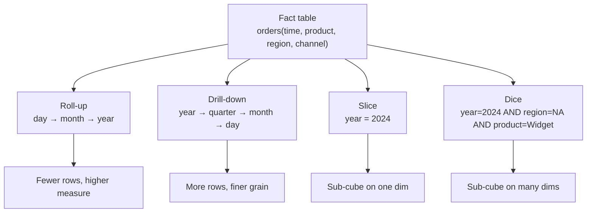
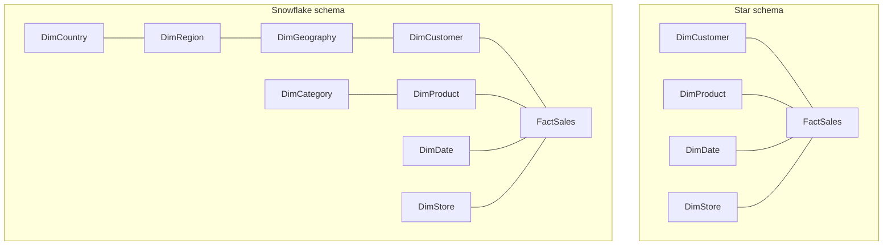
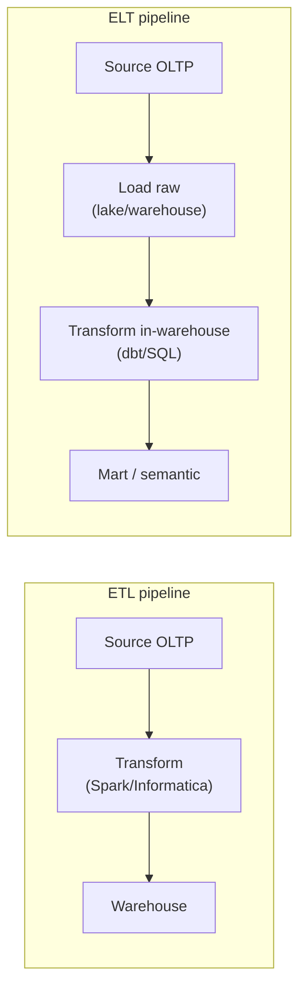
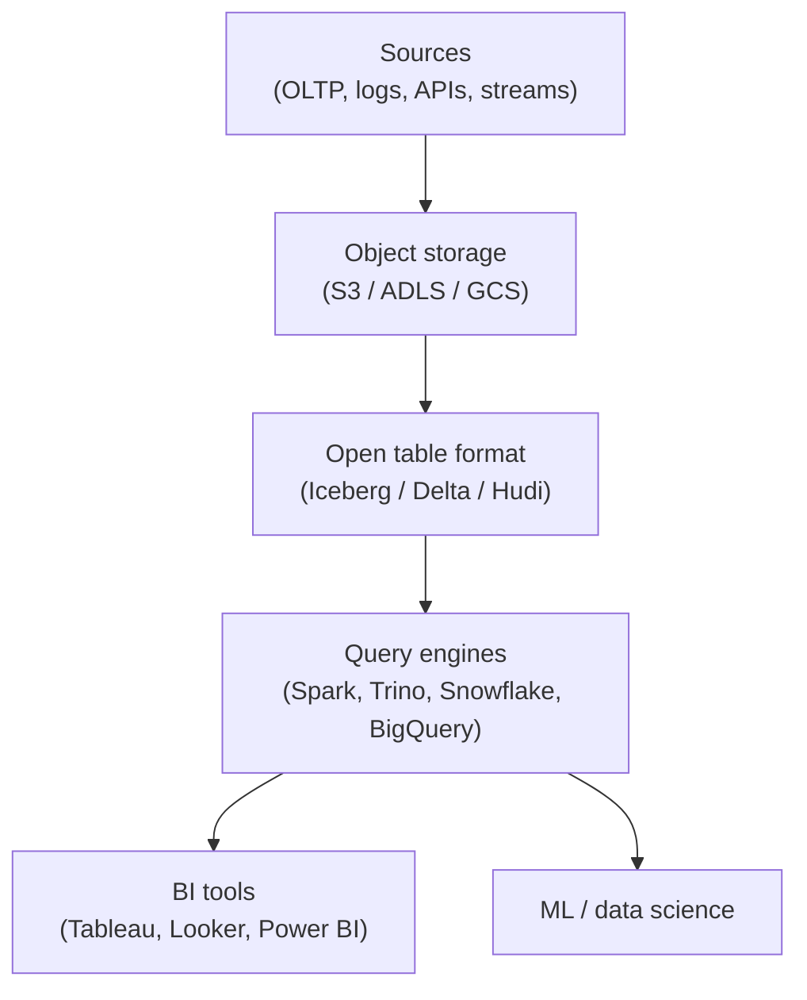

# Analytics Deep Dive

Analytics systems answer questions over massive historical datasets — revenue
by region, active users by cohort, inventory turns by SKU. The workload looks
nothing like OLTP: queries scan billions of rows, aggregate down to a
dashboard tile, and run for seconds to minutes. This page is the deep dive on
how analytical platforms are built — storage, query engines, dimensional
modeling, lakehouse architecture, OLAP cubes, and real-time analytics. For
higher-level context see [Fundamentals](./fundamentals.md); for lakehouse
table-format internals see [Lakehouses](./lakehouses.md); for SCD patterns see
[Slowly Changing Dimensions](./slowly-changing-dimensions.md).

## OLAP vs OLTP

Online Analytical Processing (OLAP) and Online Transaction Processing (OLTP)
are the two great workload archetypes in database engineering. OLTP captures
the *current state* of the business — orders flowing in, balances updating,
inventory decrementing — with thousands of short, ACID transactions per second
that touch a few rows each. OLAP captures the *history* of the business — every
order, every click, every payment — and answers aggregations across that
history. The access patterns are so different that running both on one engine
usually damages one or the other: a 30-second GROUP BY on the production OLTP
database will hold locks, blow caches, and degrade app latency. The classic
solution is to replicate OLTP data into a separate analytical store via CDC or
batch ETL.

| Axis | OLTP | OLAP |
|---|---|---|
| Purpose | Operational reads/writes | Analytical aggregations |
| Query pattern | Point lookups, single-row mutations | Wide scans, group-bys, joins |
| Latency target | Sub-50 ms p99 | Sub-second to minutes |
| Data volume | GB to TB | TB to PB |
| Storage layout | Row-oriented (heap + B-tree) | Columnar (Parquet, ClickHouse MergeTree) |
| Schema | Normalized (3NF) | Denormalized (star/snowflake) |
| Concurrency | Thousands of short txns | Tens–hundreds of long queries |
| Writes | High-frequency single-row updates | Bulk inserts, append-mostly |
| Consistency | Strong ACID | Snapshot, eventual on read |
| Examples | Postgres, MySQL, SQL Server, Oracle | Snowflake, BigQuery, Redshift, ClickHouse, Druid |

A useful mental model: OLTP is a *hash table keyed by entity*, OLAP is a
*columnar scan engine for measures*. The two are bridged by extraction,
replication, and CDC pipelines rather than by a single magic database.

## Columnar Storage

Columnar storage is the single most important physical choice in an analytical
system. A row store lays out a row's columns contiguously — great for fetching
or updating a whole row, terrible for `SUM(amount)`. A column store lays out a
column's values contiguously — great for scanning one column across billions of
rows, because (a) you read only the bytes you need, (b) adjacent values are
similar so compression ratios hit 5–10×+, and (c) the engine can process
batches of values in CPU vector registers (vectorized execution). The trade-off
is that reconstructing a full row requires gathering from many column files,
and updates force rewrite of an entire column chunk — which is why OLAP systems
are append-mostly with background compaction.

| Format / Engine | Type | Notes |
|---|---|---|
| **Parquet** | Open file format | Columnar, nested types, row-group statistics, predicate pushdown; de facto lake standard |
| **ORC** | Open file format | Stripe-based columnar; Hive ecosystem; light optimizations differ from Parquet |
| **Arrow** | In-memory format | Columnar memory layout for zero-copy exchange between engines (Python, Rust, Java) |
| **ClickHouse MergeTree** | Engine storage | Columnar with sparse primary index, data parts merged in background |
| **Druid segments** | Engine storage | Columnar, partitioned by time, bitmap-indexed for high-cardinality dims |
| **Pinot segments** | Engine storage | Columnar with forward + inverted indexes, optimized for real-time |

Columnar formats are described in detail in [Data Formats](./data-formats.md)
and [Column Stores](../dbms/storage/column-stores.md); this page focuses on how
analytical engines exploit them.

### Vectorized execution

Vectorized execution is the technique of processing arrays (vectors) of values
in tight loops that the compiler can auto-vectorize into SIMD instructions
(AVX2/AVX-512, NEON). Instead of the Volcano model's pull-based one-row-at-a-time
iterator — which spends most of its cycles on function-call overhead and branch
prediction — a vectorized engine pulls a batch of 1024–8192 values, runs an
operator over the whole batch in a tight loop, then passes the batch onward.
ClickHouse, DuckDB, and the new vectorized engines in Presto/Trino all rely on
this. Combined with columnar storage it is common to see 10–100× speedups over
row-at-a-time interpreters on analytical scans.

## Query Engines

The modern analytical landscape separates *storage* (Parquet on S3, MergeTree
on local disk) from *compute* (the query engine). A query engine reads the
files, applies predicate pushdown, projects columns, joins, and aggregates.
Choosing the right engine depends on latency target, data freshness, and
whether you need interactive or batch behavior.

| Engine | Style | Strengths |
|---|---|---|
| **Presto / Trino** | Distributed SQL-on-anything | Federated queries across warehouses, lakes, RDBMS; interactive latencies |
| **DuckDB** | In-process OLAP | Single-node, zero-server; powers Python analytics, dbt local runs |
| **ClickHouse** | OLAP database | Sub-second scans over TB; high ingest; real-time dashboards |
| **Druid** | Real-time OLAP | Sub-second queries on streaming events; time-series + high-cardinality |
| **Pinot** | Real-time OLAP | LinkedIn origin; segment-based; user-facing analytics at scale |
| **Spark SQL** | Batch + interactive | Large distributed transforms; lakehouse workhorse |
| **Snowflake / BigQuery / Redshift** | Managed warehouse | Separation of storage and compute; elastic scale |

Presto was forked into Trino in 2019; the community and most development has
moved to Trino. DuckDB is unique: an embedded OLAP engine that runs in your
Python process, reads Parquet/CSV directly, and feels like "SQLite for
analytics." For interactive dashboards on streaming data, the real-time
OLAP trio (ClickHouse, Druid, Pinot) dominates.

## Materialized Views

A materialized view persists the result of a query so subsequent reads hit the
precomputed answer rather than re-scanning the base fact table. For analytical
workloads where dashboards repeatedly ask the same `GROUP BY` over billions of
rows, materialized views turn 10-second queries into 50-millisecond queries.
Unlike a logical view (a saved query text), a materialized view is stored on
disk and must be refreshed when base data changes — incrementally if the engine
supports it, fully otherwise.

```sql
-- ClickHouse: incremental materialized view aggregating orders by day
CREATE MATERIALIZED VIEW orders_daily
ENGINE = SummingMergeTree
PARTITION BY toYYYYMM(day)
ORDER BY (day, customer_id)
AS SELECT
    toDate(created_at) AS day,
    customer_id,
    sum(amount) AS total_amount,
    count() AS order_count
FROM orders
GROUP BY day, customer_id;
```

Refresh strategies matter. A full refresh rebuilds the view on every load —
simple but expensive. An incremental refresh updates only affected aggregates,
which is what ClickHouse `SummingMergeTree` and BigQuery's incremental
materialized views do; Snowflake's automatic maintenance refreshes after
base-table changes with no user intervention. The trade-off is always write
amplification vs read speed, storage cost vs query latency. Many engines also
implement *transparent query rewrite*, where the optimizer automatically routes
queries to a matching materialized view instead of scanning the base table.

## OLAP Cubes and Operations

The OLAP cube is the conceptual model for multi-dimensional analysis. Think of
a fact table as an N-dimensional hypercube where each cell holds a measure
(revenue, units). Dimensions are the axes — time, product, region, channel.
OLAP operations are the navigation moves an analyst performs on the cube:

- **Roll-up** — aggregate up a hierarchy (day → month → quarter → year). The
  measure is summed as the grain coarsens.
- **Drill-down** — the inverse: go from year to quarter to month to day to see
  finer detail.
- **Slice** — pick a single value on one dimension (`year = 2024`) and take
  the resulting sub-cube.
- **Dice** — pick ranges on multiple dimensions
  (`year = 2024 AND region IN ('NA','EU') AND product = 'Widget'`) to extract a
  smaller cube.
- **Pivot (rotate)** — swap axes (rows ↔ columns) to view the data from a
  different angle.



Historically, cubes were pre-computed by MOLAP engines like Essbase or SSAS
into on-disk data structures; today most engines compute them on the fly from
columnar fact tables because columnar scans + vectorized aggregation are fast
enough. The conceptual model still drives how analysts and BI tools phrase
queries (drill paths, hierarchies, slicers).

## Dimensional Modeling: Star vs Snowflake

Dimensional modeling, codified by Ralph Kimball in *The Data Warehouse
Toolkit*, organizes a warehouse into **fact tables** (numeric measures of
business events plus foreign keys) and **dimension tables** (descriptive
attributes about customers, products, dates, stores). The fact is in the
center; dimensions surround it. Two physical arrangements exist:

- **Star schema** — dimensions are flat, denormalized tables joined directly to
  the fact by a single surrogate key. A `dim_customer` row holds the customer's
  name, address, segment, and region in one row.
- **Snowflake schema** — dimensions are normalized into multiple tables.
  `dim_customer` joins to `dim_geography` joins to `dim_region` joins to
  `dim_country`. Less storage redundancy, but more joins per query.

| Axis | Star schema | Snowflake schema |
|---|---|---|
| Dimension shape | Flat, denormalized | Normalized, multi-table |
| Joins per query | Few (fact → dim) | Many (fact → dim → sub-dim) |
| Query speed | Faster (fewer joins) | Slower |
| Storage | More redundant | Less redundant |
| Schema complexity | Simple | Complex |
| Modern guidance | **Default** — columnar compression absorbs the redundancy | Rarely worth it; considered for very large dims with shared sub-dims |



Kimball's guidance is unambiguous: prefer star schemas, use surrogate integer
keys for dimensions, and let columnar compression absorb the denormalization.
Snowflake is sometimes justified for shared sub-dimensions (a `dim_date` reused
across multiple facts), but the storage savings are rarely worth the join
penalty on modern columnar warehouses.

### Slowly Changing Dimensions

Dimension attributes change over time: customers move, products re-categorize,
sales reps switch territories. The warehouse must decide how to record that
change. Kimball defined several SCD types; the practical ones are 1, 2, 3, and
the hybrid Type 6. SCD Type 4 (mini-dimension for rapidly changing attributes)
and Types 5/6 (hybrids) are covered in detail in
[Slowly Changing Dimensions](./slowly-changing-dimensions.md).

| Type | Strategy | History | Use case |
|---|---|---|---|
| **SCD 1** | Overwrite in place | None | Correcting typos, status flags where history is irrelevant |
| **SCD 2** | Insert new row with `effective_start`/`effective_end`/`is_current` | Full | Customer moves, product re-categorization, rep reassignment |
| **SCD 3** | Add a `previous_value` column | One level back | "Current vs prior" comparisons (prior region, prior tier) |
| **SCD 6** | Hybrid 1+2+3 | Full + current + previous | When you need both the live row and history without separate queries |

The defining mechanic of SCD Type 2 is the surrogate key: every fact row stores
the surrogate key of the dimension row that was *current at the time of the
event*. A 2023 order joins to the 2023 version of the customer, even if the
customer has since moved — that is what makes point-in-time historical analysis
possible. The cost is dimension growth and the need for range joins on
historical queries; filtering `WHERE is_current = TRUE` keeps current-state
queries cheap.

## Data Warehouse Architecture

Bill Inmon (*Building the Data Warehouse*) defined the data warehouse as a
*subject-oriented, integrated, time-variant, non-volatile* collection of data
serving the enterprise. Kimball countered with a bottom-up approach: build
conformed dimensional models, one business process at a time, and assemble
them into a bus architecture. Inmon's warehouse is normalized (3NF) with
dependent data marts on top; Kimball's warehouse *is* the union of dimensional
data marts sharing conformed dimensions. In modern practice most teams land
somewhere in between — a curated warehouse layer with both normalized staging
and dimensional marts.

| Layer | Purpose | Example contents |
|---|---|---|
| **Landing / raw** | Immutable copy of source data | CDC events, daily extracts, JSON logs |
| **Staging / 3NF** | Cleansed, typed, deduplicated | Inmon-style normalized tables |
| **Integration / conformed** | Shared dimensions across processes | `dim_customer`, `dim_date`, `dim_product` |
| **Presentation / marts** | Dimensional models for consumption | Star schemas per business process |
| **Semantic layer** | Metric definitions, governance | Looker LookML, dbt metrics, Cube |

Modern cloud warehouses — Snowflake, BigQuery, Redshift — separate storage
from compute. Storage is cheap columnar files in object storage (S3, GCS);
compute is elastic clusters that spin up per query or workload. This
decoupling lets you scale BI and ad-hoc analytics independently and pay only
for compute seconds. Snowflake pioneered the model; BigQuery takes it further
with serverless per-query billing; Redshift RA3 adds a managed caching layer.

## ETL vs ELT

ETL and ELT differ in *where* the transformation happens. In classic ETL,
transformations run in a separate middleware engine (Informatica, SSIS, Talend)
before data lands in the warehouse — historically necessary because warehouse
compute was expensive and schemas had to be curated up front. In ELT, raw data
lands first and transformations run inside the warehouse using SQL or dbt —
made possible by cheap, elastic cloud warehouse compute and the rise of
schema-on-read lake patterns.

| Axis | ETL | ELT |
|---|---|---|
| Order | Extract → Transform → Load | Extract → Load → Transform |
| Transform location | Middleware / Spark / separate engine | Inside the warehouse (SQL, dbt) |
| Schema discipline | Schema-on-write enforced up front | Schema-on-read, transformed later |
| Tools | Informatica, Talend, SSIS, Airflow + Spark | dbt, BigQuery SQL, Snowflake SQL |
| Best for | On-prem warehouses, regulated curration | Cloud warehouses, fast iteration |
| Raw kept? | Often discarded after load | Yes — raw layer preserved for replay |



In practice most modern stacks are ELT-first with ETL-shaped steps for
regulated transformations. The raw layer preserved by ELT is also what makes
the lakehouse pattern possible: transformations become SQL views on
version-controlled table formats rather than pipelines that destroy originals.

### Change Data Capture (CDC)

CDC replaces nightly batch extracts by streaming changes from the OLTP
transaction log. Debezium reads Postgres WAL / MySQL binlog / MongoDB oplog and
emits row-level change events to Kafka; sinks (PeerDB, Kafka Connect, vendor
zero-ETL) write them into the warehouse with sub-minute freshness. CDC is the
mechanism that closes the freshness gap between OLTP and OLAP without
re-implementing batch jobs. See
[Kafka](../backend/messaging/kafka.md) for the transport and
[Distributed Replication](../dbms/distributed/README.md) for log-based
replication internals.

## Data Lake, Lakehouse, and Open Table Formats

A data lake is cheap object storage (S3, ADLS, GCS) holding raw data in open
formats — Parquet, ORC, Avro, JSON, images, anything. Lakes historically
lacked ACID, schema enforcement, and time travel, which led to "data swamps"
and the rise of the **lakehouse**: an open table format layer on top of object
storage that provides warehouse-style guarantees without sacrificing lake
flexibility or cost. The Databricks lakehouse paper (Armbrust et al., 2021)
argued this convergence formally; Apache Iceberg, Delta Lake, and Apache Hudi
are the three open formats implementing it.

| Axis | Data warehouse | Data lake | Lakehouse |
|---|---|---|---|
| Data types | Structured, curated | Any (structured/semi/unstructured) | Any on open formats |
| Schema | Schema-on-write, enforced | Schema-on-read, flexible | Both — enforced at table level |
| ACID | Yes (engine-managed) | Historically no | Yes via transaction log |
| Time travel | Usually yes | No (or manual) | Yes via snapshots |
| Storage cost | High (engine-managed) | Low (object storage) | Low (object storage) |
| Compute | Engine-coupled | External (Spark, Presto) | Decoupled (Spark, Trino, Snowflake, BigQuery) |
| Examples | Snowflake, BigQuery, Redshift | S3 + raw files | Databricks + Delta, Iceberg, Hudi |



For format-level internals (transaction log mechanics, hidden partitioning,
COPY-ON-WRITE vs MERGE-ON-READ), see [Lakehouses](./lakehouses.md) and
[Data Formats](./data-formats.md). The key architectural point is that the
lakehouse decouples storage, table format, and compute — you can read the same
Iceberg table from Snowflake, BigQuery, Trino, and Spark without copying data.

## Real-Time Analytics

Real-time analytics serves queries over data that is seconds to minutes old —
operational dashboards, user-facing analytics, fraud detection, observability.
The batch-oriented warehouse model (nightly ETL, next-day dashboards) is too
stale for these workloads. Real-time OLAP engines trade some flexibility (less
general SQL, more constrained joins) for sub-second queries on streaming
ingest at millions of events per second.

| Engine | Origin | Sweet spot |
|---|---|---|
| **Apache Druid** | Metamarkets / Apache | Time-series, high-cardinality dims, sub-second BI |
| **ClickHouse** | Yandex / ClickHouse, Inc. | General-purpose OLAP, very high ingest, SQL-rich |
| **Apache Pinot** | LinkedIn | User-facing analytics, real-time segment ingestion |

These engines share several design choices: columnar storage with bitmap
indexes on high-cardinality dimensions, pre-aggregation via materialized views
or rollups, time-based partitioning for fast range scans, and tight Kafka
integration. See [Stream Processing](./stream-processing.md) for ingestion
architecture. The line between "real-time OLAP database" and "warehouse with
streaming ingest" is blurring: ClickHouse now competes with Snowflake for
general analytical workloads, and warehouses increasingly support streaming
ingest natively.

## Bitmap Indexes and Analytical Joins

A bitmap index stores, for each distinct value of a column, a bitmap
indicating which rows hold that value. For low-to-medium cardinality columns
(`country`, `plan_tier`, `device_type`) bitmap indexes are extremely compact
and support set operations (AND, OR, NOT) directly on the bitmaps — ideal for
the multi-predicate filters common in OLAP. Druid and Pinot build bitmap
indexes (often compressed with Roaring bitmaps) on dimension columns precisely
for this reason.

Analytical joins have their own optimization profile. Star-schema joins are a
single fact-to-dimension hop, and the dominant technique is **broadcast hash
join**: the small dimension is broadcast to every worker, which builds an
in-memory hash table and streams the large fact through it. No shuffle of the
fact is required. For fact-to-fact joins (rare but necessary for cross-process
analysis), **sort-merge join** on a common sort key avoids shuffling when both
sides are already clustered. **Late materialization** — a columnar-store trick
— defers fetching row IDs until after filtering and aggregation, so the engine
never reads unused columns of matching rows.

## Approximate Queries

Some analytical questions tolerate approximate answers — distinct-count
estimation, top-K, quantiles. Approximate algorithms trade bounded error for
large speedups and memory savings, which matters when scanning petabytes for a
single dashboard tile.

| Algorithm | Purpose | Typical error |
|---|---|---|
| **HyperLogLog** | Distinct count (`COUNT(DISTINCT ...)`) | ~1–2% |
| **Top-K / Heavy Hitters** | Most frequent values | Exact on top items |
| **T-Digest / KLL** | Quantiles (p50, p95, p99) | <1% near tails |
| **Count-Min Sketch** | Frequency estimation with overestimation | Configurable |

ClickHouse exposes these as functions (`uniqHLL12`, `topK`, `quantileTDigest`);
Druid has built-in sketch aggregators. Approximate query engines like
approximate distinct counting in BigQuery (`APPROX_COUNT_DISTINCT`) and
Snowflake's `APPROX_TOP_K` reflect the same trade-off. The right question to
ask before reaching for an approximation is whether the consumer (a
dashboard, an alert threshold) can tolerate the error — for billing or
compliance, no; for "is traffic up 10% today," absolutely yes.

## BI Tools and the Semantic Layer

The top of the analytical stack is the BI tool — the surface analysts and
business users actually touch. BI tools issue SQL (or proprietary query
languages) against the warehouse or lakehouse, render results as charts and
dashboards, and provide a governed semantic layer that defines metrics once
for all consumers.

| Tool | Owner | Style | Notable feature |
|---|---|---|---|
| **Tableau** | Salesforce | Visual drag-and-drop | VizQL, broad connector library |
| **Looker** | Google | LookML semantic layer | Git-backed model, governed metrics |
| **Power BI** | Microsoft | Excel-integrated, DAX | Tight Office 365 / Azure integration |
| **Mode / Hex / Metabase** | Various | SQL-first notebooks | Analyst-friendly, code + viz |

The semantic layer is increasingly considered separate from the BI tool —
LookML, dbt metrics, Cube, and Snowflake's native semantic layer all define
metrics centrally so a "revenue" or "active user" number means the same thing
whether queried from Tableau, Looker, or an embedded product analytics
surface. This decoupling is the modern answer to metric sprawl.

## Interview Questions

**Q1: Why do OLAP databases use columnar storage?**
A: Analytical queries scan many rows but few columns. Columnar storage (a)
reads only the requested columns — dramatically less I/O; (b) compresses well
because adjacent values are similar (5–10× vs row stores); and (c) enables
vectorized execution over tight batches that the compiler turns into SIMD
instructions. Row stores are better for OLTP where you fetch or mutate whole
rows.

**Q2: What is the difference between a star schema and a snowflake schema,
and which do you choose?**
A: Star has flat denormalized dimensions joined directly to the fact by one
surrogate key; snowflake normalizes dimensions into multiple tables, adding
joins but reducing storage redundancy. Modern columnar compression makes the
storage savings of snowflake negligible, so the simpler query plan and fewer
joins of star win. Choose snowflake only when sub-dimensions are shared across
multiple facts and large enough that the redundancy hurts.

**Q3: Explain SCD Type 2 and how fact tables join to it.**
A: SCD Type 2 inserts a new dimension row on each change, with
`effective_start`, `effective_end`, and `is_current` columns plus a unique
surrogate key per version. Fact rows store the surrogate key that was current
at the event time, so historical queries join to the dimension version that
was valid then — point-in-time analysis. Current-state queries filter
`WHERE is_current = TRUE` for speed.

**Q4: What problem does a lakehouse solve that a data lake alone does not?**
A: A lake lacks ACID, schema enforcement, and time travel, which produces data
quality issues ("data swamp"). A lakehouse adds a transaction-log layer
(Iceberg, Delta, Hudi) on top of object storage, providing these guarantees
without sacrificing lake cost or format flexibility. Multiple engines can read
the same open-format table.

**Q5: When would you choose ELT over ETL?**
A: ELT fits cloud warehouses with cheap elastic compute, where you can land
raw data first and transform with SQL/dbt inside the warehouse. The raw layer
is preserved for replay and downstream consumers. ETL fits cases where
transformations must run before loading — on-prem warehouses with expensive
compute, regulated curation, or when the target cannot accept raw formats.

**Q6: How does CDC keep a warehouse fresh without batch jobs?**
A: CDC reads the OLTP transaction log (Postgres WAL, MySQL binlog) via tools
like Debezium, emits row-level change events to Kafka, and sinks them to the
warehouse with sub-minute latency. Because it reads the log (not queries),
load on the source is low. CDC handles ongoing deltas; initial bulk loads and
complex transforms still use ETL.

**Q7: What are the four classic OLAP cube operations?**
A: Roll-up aggregates up a hierarchy (day → month → year). Drill-down is the
inverse — go to finer grain. Slice picks a single value on one dimension
(`year = 2024`). Dice picks ranges on multiple dimensions
(`year=2024 AND region=NA AND product=Widget`). Modern columnar engines
compute these on the fly rather than pre-materializing cubes.

**Q8: When would you use an approximate query, and what algorithms are
common?**
A: Use approximations when the consumer tolerates bounded error — dashboards,
top-K lists, traffic trend checks. Avoid for billing or compliance. Common
algorithms: HyperLogLog for distinct count (~1–2% error), T-Digest or KLL for
quantiles, Count-Min Sketch for frequency estimation, and Top-K for most
frequent values. ClickHouse, Druid, BigQuery, and Snowflake all expose these
as built-in functions.

## Cross-References

- [Data Formats](./data-formats.md) — Parquet, ORC, Avro, Arrow internals
- [Lakehouses](./lakehouses.md) — Iceberg, Delta, Hudi format comparison
- [Slowly Changing Dimensions](./slowly-changing-dimensions.md) — SCD patterns
- [Fundamentals](./fundamentals.md) — ETL/ELT, OLTP/OLAP overview
- [Batch Processing](./batch-processing.md) — Spark, MapReduce, Airflow
- [Stream Processing](./stream-processing.md) — Kafka, Flink, real-time ingest
- [Column Stores](../dbms/storage/column-stores.md) — columnar internals
- [Bitmap Indexes](../dbms/indexing/bitmap-index.md) — bitmap mechanics
- [Materialized / SQL Views](../dbms/sql/views.md) — view semantics
- [Distributed Systems](../dbms/distributed/README.md) — replication, CDC
- [Kafka](../backend/messaging/kafka.md) — CDC transport
- [Object Storage](../storage/object-storage.md) — lake substrate

## References

- Ralph Kimball & Margy Ross, *The Data Warehouse Toolkit*, 3rd ed., Wiley, 2013 — https://www.kimballgroup.com/data-warehouse-business-intelligence-resources/kimball-techniques/dimensional-modeling-techniques/
- W. H. Inmon, *Building the Data Warehouse*, 4th ed., Wiley, 2005
- Michael Armbrust et al., *Lakehouse: A New Generation of Open Platforms that Make Data Lakes Cheap and Effective Again*, CIDR 2021 — https://www.cidrdb.org/cidr2021/papers/cidr2021_paper17.pdf
- Apache Iceberg — https://iceberg.apache.org/docs/latest/ · Delta Lake — https://docs.delta.io/latest/index.html · Apache Hudi — https://hudi.apache.org/docs/overview
- Snowflake — https://docs.snowflake.com/ · ClickHouse — https://clickhouse.com/docs · Apache Druid — https://druid.apache.org/docs/latest/design/ · Apache Pinot — https://pinot.apache.org/
- Trino — https://trino.io/docs/current/ · DuckDB — https://duckdb.org/docs/ · BigQuery — https://cloud.google.com/bigquery/docs · Redshift — https://docs.aws.amazon.com/redshift/
- Debezium CDC — https://debezium.io/documentation/
