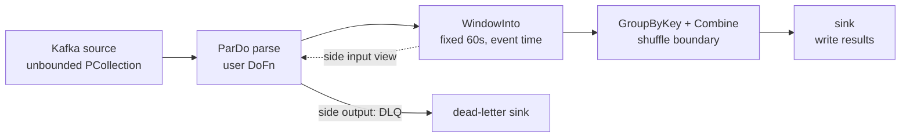
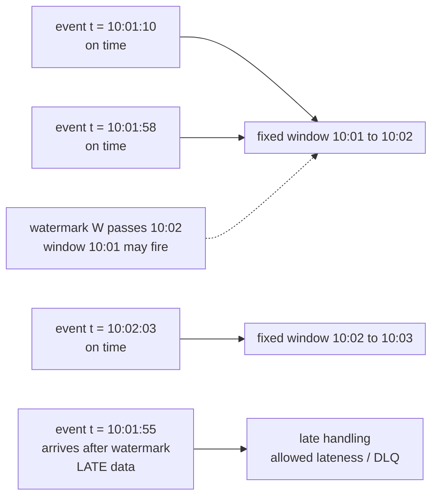
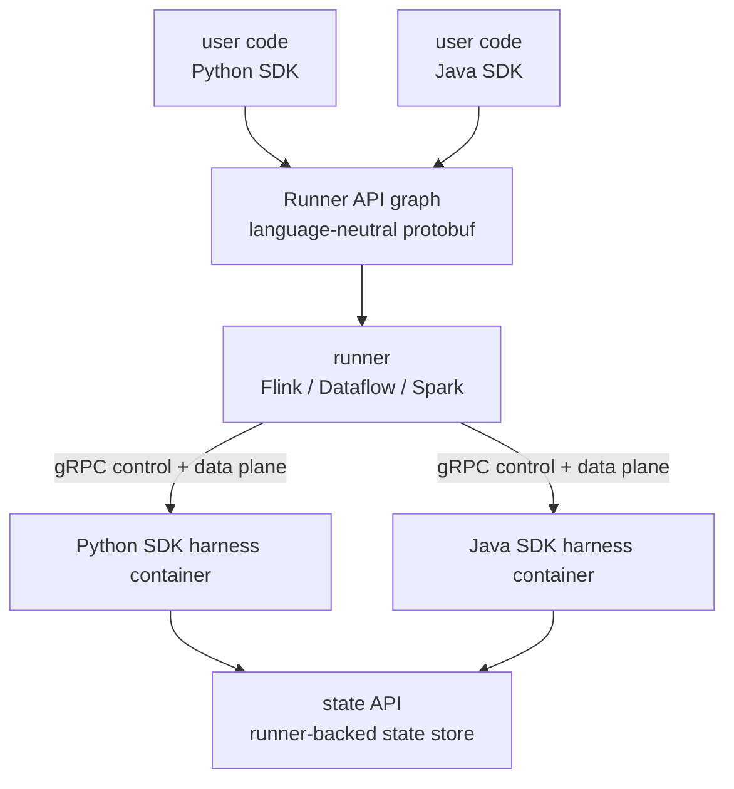

# Apache Beam: Portable Batch & Streaming

Apache Beam is a unified programming model for defining data-parallel batch and streaming pipelines, plus a set of runners that execute the same pipeline on different engines. The model's founding idea came from Google's Dataflow paper (Akidau et al., "The Dataflow Model: A Practical Approach to Lambda-Architecture-Free Processing", VLDB 2015), which merged two earlier systems: **FlumeJava** (Google's batch pipeline framework — parallel collections, deferred evaluation, automatic fusion of MapReduces) and **MillWheel** (Google's low-latency streaming system — event-time semantics, watermarks, exactly-once state). Dataflow unified them: one API where "batch" is just the special case of "streaming with finite input." Google offered it as the managed Cloud Dataflow service; the programming model was donated to the Apache Software Foundation as **Beam** in 2016, with runners contributed by other vendors (Flink, Spark, Apex) — making Beam the rare case of a *spec-first* execution framework. What Beam does *not* do is run anything itself: every pipeline needs a runner, and the model's guarantees are only as strong as a runner's implementation of them.

This page covers the model primitives (PCollection, PTransform, DoFn), the where/when/what/how decomposition of streaming semantics — windowing, watermarks, triggers, accumulation — the runner landscape (Direct, Flink, Dataflow, Spark), the portability API and cross-language transforms, and the decision framework for Beam vs raw Flink vs Spark Structured Streaming. The model and SDK docs live at [beam.apache.org](https://beam.apache.org/). Streaming fundamentals live in [stream-processing.md](stream-processing.md); batch fundamentals in [batch-processing.md](batch-processing.md); the two most important runners are covered in [flink.md](flink.md) and [spark-internals.md](spark-internals.md).

---

## The programming model: PCollection, PTransform, DoFn

A Beam program is a **Pipeline** — an acyclic graph of transforms over **PCollections**. Three concepts carry the whole model:

- **PCollection**: an immutable, potentially very large (and possibly *unbounded*) dataset. It is not a container you iterate; it is a handle to a distributed computation. Every PCollection carries a type (schema), a coder (serialization format), and crucially **windowing and watermark information** — in Beam, even *bounded* PCollections have an event-time windowing assignment, which is how batch becomes a special case of stream.
- **PTransform**: a data-parallel operation consuming and producing PCollections. The built-in vocabulary is deliberately small: `ParDo` (element-wise map), `GroupByKey` (aggregation by key), `Combine` (associative fold, like Flink's aggregate or Spark's `combineByKey`), `CoGroupByKey` (join), `Flatten` (union), `Partition` (split), plus I/O connectors (read/write).
- **DoFn**: the user code inside a `ParDo` — `@ProcessElement` per element, with lifecycle hooks (`@Setup`, `@StartBundle`, `@FinishBundle`), access to **side inputs** (broadcast views of small datasets, including *windowed* side inputs) and **side outputs** (tagged results for routing one input to several outputs).

Construction is **deferred**, FlumeJava-style: the pipeline methods only record the graph; nothing executes until the runner materializes it at `pipeline.run()`. That indirection is what makes the whole model portable — the runner sees a complete, optimization-friendly DAG (and can fuse, re-order stages, or translate it wholesale) rather than observing imperative execution step by step.

```python
import apache_beam as beam
from apache_beam.options.pipeline_options import PipelineOptions

with beam.Pipeline(runner="FlinkRunner", options=PipelineOptions()) as p:
    (p
     | "read" >> beam.io.ReadFromKafka(bootstrap_servers, topics)   # unbounded
     | "parse" >> beam.Map(parse_event)
     | "window" >> beam.WindowInto(beam.window.FixedWindows(60))
     | "key" >> beam.Map(lambda e: (e["page"], 1))
     | "count" >> beam.CombinePerKey(sum)
     | "write" >> beam.io.WriteToText("out/pageviews"))
```

The same graph text runs on the Direct runner (in-process, for tests), on Flink, on Spark, or on Cloud Dataflow — that is the *portability contract*: correctness semantics (windowing, triggers, watermarks, exactly-once aggregation) are properties of the **model**, guaranteed by every runner, while performance and deployment are properties of the **runner**.

Reading the snippet with model vocabulary: `ReadFromKafka` produces an *unbounded* PCollection; `WindowInto` assigns event-time windows (axis "where"); `CombinePerKey` is an associative fold the runner can pre-aggregate locally (combiner lifting); and the sink receives one result per window per key — emitted when triggers say so (axis "when"), in the accumulation mode configured for the window (axis "how"). Every named concept in this page is present in these five lines, which is exactly why this pipeline is the standard warm-up interview exercise.



Two model details interviewers probe. First, **bundles**: a runner delivers input to a DoFn in bundles and commits side effects at bundle boundaries — this is the unit of checkpointing and exactly-once aggregation (replayable source + idempotent-or-transactional sink). Second, **fusion**: like FlumeJava, the runner fuses element-wise transforms into a single stage until a shuffle boundary (`GroupByKey`, `Combine`, window boundary) forces materialization — so a chain of five `Map`s is one stage with zero sinks.

## Coders and schemas: the serialization contract

Every PCollection travels between machines at every shuffle boundary, so Beam makes serialization a first-class model concept:

- **Coders** translate elements to/from bytes. Beam infers default coders from PTransforms, and pipelines fail fast when an inference is ambiguous. The operational rule: coders for elements used as **keys or in state must be deterministic** (same element → same bytes), because hash partitioning and state addressing depend on byte equality. Non-deterministic coders (say, encoding a struct with a floating-point NaN or unordered map) corrupt shuffles silently — a real debugging story worth having ready.
- **Schemas** are the structured alternative: declare a row type (like a dataclass/POJO with inferred fields), and Beam supplies efficient coders, field selection, and interoperability with Beam SQL and cross-language transforms. Schemas let the runner and the SQL layer reason about columns instead of opaque bytes.
- **Logical types** extend schemas (a `UUID` backed by bytes, a `Money` backed by cents) — the model's answer to "my domain type survives the shuffle."

The interview soundbite: *coders are Beam's contract that an element means the same thing on every machine; schemas are the typed layer on top that makes cross-language pipelines possible.*

## Bounded vs unbounded, and the four questions of the Dataflow model

The Dataflow paper's lasting contribution is decomposing stream semantics into four independent axes, which Beam's API mirrors one-to-one — this is the canonical interview framing:

1. **What** results are computed? — the transform logic (`CombinePerKey(sum)`).
2. **Where** in event time are they computed? — **windowing** (fixed, sliding, session, custom).
3. **When** in processing time are they *materialized*? — **watermarks** and **triggers**.
4. **How** do refinements relate? — **accumulation mode** (discarding, accumulating, accumulating & retracting).

Batch systems fix axes 2-4 silently (one global window, emit at completion, replace previous results). The insight of the model is that unbounded data forces you to make these choices *explicit* — and that "correctness" in streaming means matching what an ideal, unbounded-latency batch job over the same events would have computed.

## Windowing and event time

**Event time** is when the business event happened (timestamp carried by the data); **processing time** is when the machine observes it. Distributed sources guarantee skew between the two — mobile clients queue, Kafka partitions lag, GC pauses happen. All aggregation that answers business questions ("pageviews per minute", "revenue per session") is over event time, so the engine needs a notion of *"how far has event time advanced?"* — the **watermark**: a monotonically advancing claim that all events with timestamps ≤ W have (probably) been seen. Watermarks are heuristic by nature ( Beam sources compute them from source metadata; Kafka sources from partition lag and arrival rates), and getting them wrong in either direction is the classic production incident: too aggressive → late data dropped; too conservative → results stuck in the past. Flink implements the same concept ([flink.md](flink.md)); Beam's contribution is specifying it portably.

Window families:

- **Fixed (tumbling)**: disjoint equal intervals, e.g. every 60 s — the metric-dashboard default.
- **Sliding**: overlapping windows defined by a period and a size (e.g. size 5 min, slide 1 min) — moving averages; each event lands in several windows.
- **Session**: windows around *activity* — every event opens a window of a gap duration; windows merge when events bridge the gap. Sessions cannot be pre-partitioned, so Beam builds them on window-merging during `GroupByKey`, which is why session aggregation is the question that separates people who have actually run streaming joins from people who have read about them.
- **Custom/global**: global window with triggers, or user-defined merging windows.

Calendaring matters in practice: business day windows, fiscal months, and DST-aware day boundaries are *not* fixed durations, so production pipelines often need custom window functions or pre-normalized timestamps (a classic operational bug: UTC days versus local-time days in a dashboard). Mentioning that you have felt this pain — or would guard against it — lands well in system-design rounds.



**Triggers** answer "when does a window emit?". Beam's vocabulary: the default **event-time trigger** (fire when the watermark passes window end), **processing-time triggers** (fire on the clock, for latency-bounded dashboards), **count triggers** (fire every N elements), and combinators (`Repeat`, `AfterEach`, `OrFinally`) plus `WithAllowedLateness`, which keeps a window's state alive for a grace period during which late data re-fires it. **Accumulation mode** then decides whether a re-fired window emits *deltas* (discarding — cheap, downstream must add), *full re-results* (accumulating — simple, redundant), or *retractions* (accumulating & retracting — emit + unemit old value, the only mode that supports correct downstream joins and exactly-once-style downstream aggregation). "Window fires twice: what does downstream see?" is a guaranteed interview follow-up.

### Window merging under the hood

Session windows expose the machinery the other window families hide. Sessions are implemented as **merging windows**: every element initially gets its own `[t, t+gap)` window, and at the aggregation boundary the runner merges all *overlapping* windows per key before grouping. This is why Beam separates **non-merging** windows (fixed, sliding — cheap, assignable at ingest) from **merging** ones (session — merge cost paid at `GroupByKey`), and why session pipelines perform worse under high fan-in. Two derived rules worth quoting: a window's **garbage-collection time** is `maxTimestamp + allowedLateness` — state lives exactly that long, no longer; and merging means window *identity* is emergent, so downstream keyed state must always be addressed by `(key, window)` pairs, never by the key alone. If an interviewer asks "how would you implement sessions?", the answer is merge-on-groupby plus event-time timers per merged window — the mechanism, not the API.

## State, timers, and side inputs

Beyond whole-window aggregation, Beam exposes per-key, per-window *stateful* processing — the primitive that custom streaming logic (fraud detectors, session enrichers, dedup windows) is built on:

- **State** (`BagState`, `ValueState`, `MapState`, `CombiningState`): scoped to `(key, window)` — the runner stores it durably (RocksDB on Flink, Dataflow's managed state backend) and clears it when the window expires. Unbounded per-key state is the classic leak; windowing or explicit `@Timer` cleanup bounds it.
- **Timers**: event-time timers fire when the watermark passes their timestamp (e.g. "emit this session 10 minutes after its last event"); processing-time timers fire on the clock (e.g. "flush a batch after 5 s even if the watermark stalls"). Timers + state together re-implement what triggers do globally, at user-controlled granularity.
- **Event-time order**: within a bundle, elements may arrive out of event-time order; stateful DoFns that care must buffer and sort themselves (or use timers), because the model promises watermark semantics, not per-key sorted delivery — a subtlety that surprises developers coming from batch sorting.
- **Side inputs**: broadcast views of another PCollection, joined *by window* — the "as-of-this-window" lookup pattern (enrich events with the rate table of their window). A side input that is itself unbounded updates per window; interviewers use this to test whether candidates understand that even joins are window-scoped in the model.

The model's decision to make state and timers **runner-managed** (not user-managed caches) is what makes replay safe: state is checkpointed with the pipeline, so bundle replay after failure restores the pre-failure state — the mechanics behind exactly-once aggregation.

## Sources, sinks, and exactly-once mechanics

End-to-end guarantees are assembled from three runner responsibilities:

1. **Replayable sources**: a `BoundedSource`/`UnboundedSource` splits into trackable parts, records positions (Kafka offsets, file positions), and re-delivers from a recorded position after failure. Non-replayable sources cap the pipeline at at-least-once with idempotent handling.
2. **Durable, window-scoped aggregation state**: grouped results live in runner state, checkpointed atomically with source positions — the Flink checkpoint barrier and Dataflow shuffle checkpoint both realize this ([flink.md](flink.md) details the barrier algorithm).
3. **Commit protocol at the sink**: exactly-once *effectively* requires idempotent writes, transactional sinks, or dedup on read; Beam's `WriteToX` connectors document which contract they provide. The honest interview answer: exactly-once in Beam means *exactly-once effect on the aggregation state and best-effort/transactional delivery at the sink*, and candidates should say which sinks are transactional (BigQuery load jobs, files) versus at-least-once (many external APIs).

## Batch mode: what actually changes

A bounded pipeline runs the same graph with three silent defaults: one global window; the watermark defined to infinity at input completion; and triggers reduced to "emit once, at completion." Everything else — coding, fusion, Combine's combiner lifting (map-side pre-aggregation, the analog of Flink's local combine and Spark's map-side combine) — behaves identically. That symmetry is the sales pitch and the interview trap: because batch is the degenerate streaming case, you can *test streaming logic as a bounded job* (recorded events, Direct runner, deterministic output) before pointing it at live sources — a development workflow raw streaming engines make harder.

## Hot keys and skew: the worked mini-exercise

"Compute the top 100 URLs per minute" — with one CDN URL holding 40 % of traffic. The naive `CombinePerKey` puts 40 % of the work in one worker. The Beam-flavored answer chain, which interviewers want to hear in order:

1. **Combiner lifting first**: if the aggregation is associative, `Combine` pre-aggregates per *bundle* before the shuffle (map-side combine), collapsing hot-key traffic by the bundle factor. `CombinePerKey(sum)` gets this for free; a hand-rolled `GroupByKey` + `ParDo` does not.
2. **Window-scoped fan-out**: for top-k specifically, two-stage aggregation — count per (worker, URL) within the window, then merge — is a combiner, not a workaround.
3. **Key salting** when no combiner exists: append a random suffix to the hot key, aggregate over salted keys, then a second pass strips the salt — trading a bounded blow-up in key space for parallelism. In Beam the salting transform must respect windows so the two aggregations share window assignments.
4. **Runner features**: Dataflow's streaming engine routes hot keys through a liquid-sharding path; Flink offers mini-batch/skew handling. Mentioning that *the model abstracts semantics but skew is physical* ties back to the runner-vs-model distinction.

The general lesson: Beam gives you correctness (windows, exactly-once) portably, but **data skew is a physics problem** — you fix it with combiners, salting, and runner features, not with API cleverness.

## Runners: Direct, Flink, Dataflow, Spark

| Runner | What it is | Strengths | Trade-offs | Typical use |
|---|---|---|---|---|
| **Direct** | local, in-process (per-SDK) | fast tests, determinism, debugging | single node | unit/integration tests |
| **Flink** | open-source cluster runner, streaming-first | best streaming performance, RocksDB state, savepoints | you operate a Flink cluster | self-managed streaming at scale |
| **Dataflow** | Google Cloud managed service (Beam's origin) | zero-ops autoscaling, shuffle/logging integrated, streaming engine with virtual machines for hot keys | Google-only, cost model, less visibility | GCP estates, managed batch+stream |
| **Spark** | runner over Spark engine | reuses existing Spark estates | micro-batch lineage shows in latency/state semantics | batch-mostly shops |
| others (Nemo, Hazelcast, Twister2, JetBrains) | experimental/minor | niche | thin communities | awareness only |

How to talk about runners in interviews: lead with the contract, not the brands — place a runner in one sentence (Direct for tests, Flink for streaming performance you operate, Dataflow for streaming you *don't* operate, Spark where the estate already exists) and only then argue trade-offs. Candidates who invert this order usually get trapped in benchmark arguments they cannot defend; candidates who hold the contract first can concede performance points without losing the argument.

The runner contract: a runner must implement **bundle delivery, checkpointing of unbounded sources, watermark propagation, state storage for stateful DoFns, and window merging**. How well each runner does so varies — the model guarantees semantics, but e.g. Spark's micro-batch shape historically degraded per-event latency and fine-grained watermark behavior relative to Flink's continuous dataflow. This is why "Beam on Flink" and "raw Flink" are *not* the same runtime (below).

A useful interview detail: the runner, not the model, decides **where shuffles physically live** — Dataflow uses a managed shuffle service, Flink its network-stack partitioning, Spark its RDD/block-manager shuffle. So two "identical" Beam graphs can differ by an order of magnitude in latency purely from runner-side shuffle engineering — the clearest demonstration that the model buys portability of *semantics*, not of *performance*.

## Portability API and cross-language transforms

Beam's second bet is **language portability**, delivered by the portability framework (FnAPI):

- Every SDK (Java, Python, Go, SQL, Scala, TypeScript, YAML) compiles a pipeline to the common **Beam Runner API** — a protobuf graph of the job.
- User code executes in **SDK harness containers**: per-language worker processes that talk to the runner over gRPC (control plane, data plane, state, and logging APIs are all protobuf/gRPC). A runner therefore does not care what language a `DoFn` was written in — it schedules *containers*.
- **Cross-language transforms** (via *expansion services*): a Python pipeline can use Java transforms — most importantly I/O connectors like `ReadFromKafka`, `WriteToJdbc`, or Snowflake connectors that exist only in Java — which are expanded into the graph and executed in Java containers while the rest runs in Python. This is Beam's practical answer to "the best connector isn't in my language."

The portability story has known seams worth acknowledging: the Go SDK historically lacked some cross-language and stateful features; Python and Java SDKs lead the feature matrix; and every cross-language boundary pays (de)serialization. Saying "portable, with per-SDK caveats — check the capability matrix" is a more credible interview answer than "fully portable."



The cost of the abstraction is real: an extra serialization boundary, container startup latency, and a debugging surface that spans two stacks. Beam's own SQL dialect (`ZetaSQL`-based `beam.Sql`) and the YAML mini-DSL exist to let analysts build pipelines without the SDKs at all — a signal of where the project sees the market (platform teams ship connectors and templates; analysts assemble).

Execution topologically: a runner-side **driver** (or job server) submits the Runner API graph; the runner translates it into its native plan (Flink streaming DAG, Spark stages, Dataflow's execution graph), schedules **SDK harness workers** per stage, and streams data between them through runner-managed transports (gRPC streams, or fused in-process channels when stages fuse). Understanding this split explains most operational surprises: a Python pipeline's memory profile lives in *its* harness containers; a "runner bug" may actually be a harness-to-runner protocol stall; and autoscaling decisions are made by the runner based on harness-reported backlog.

## Beam vs raw Flink vs Spark Structured Streaming

The decision framework interviewers expect:

- **Choose Beam (on Dataflow or Flink) when portability or the managed service is the point**: multi-cloud avoidance, "we might switch runners", GCP shops wanting zero-ops autoscaling, teams unifying batch and stream code *textually* (the same pipeline graph over bounded and unbounded sources), or organizations standardizing on one pipeline DSL for hundreds of jobs.
- **Choose raw Flink when streaming is the product and you want the engine, not the abstraction**: lowest latencies, richest stateful API (async I/O, broadcast state, cep), savepoint-driven ops, tuning access to every knob ([flink.md](flink.md)). You lose runner portability and gain a single, deeper stack.
- **Choose Spark Structured Streaming when the estate is already Spark and requirements are micro-batch-shaped**: Spark SQL interoperability, Delta Lake integration, unified batch/stream codebase ([spark-internals.md](spark-internals.md)). Beam-on-Spark does not make Spark less micro-batchy; it only changes the API.
- **The honest anti-pattern**: adopting Beam for a single-team, single-runner deployment and paying the abstraction tax forever. Beam is a *model* investment; if you will never change runners and you don't need the managed service, it is overhead.

A sanity check that impresses interviewers: restate the choice as a question about *what you standardize on*. Standardize on a semantic model and managed execution → Beam. Standardize on an engine and its state semantics → Flink. Standardize on a data platform and its SQL/interpreter → Spark. Most "Beam vs Flink" arguments are really disagreements about which layer a team wants to be married to — the model, the engine, or the platform — and surfacing that reframe is worth more than any feature table.

Failure-mode fluency matters more than the decision table: bundles that grow too large (OOM in state), watermarks stuck behind one idle partition (need `withIdleTimeout`-style watermark stalls handled), triggers firing duplicates because accumulation mode was wrong, and cross-language transforms breaking on serializer mismatch. These map 1:1 onto the interview questions below.

## Operating Beam pipelines

The operational surface a senior candidate should recognize:

- **Testing**: `TestPipeline` plus `PAssert` for assertion-based graph tests on the Direct runner; bounded-record integration tests before live rollout (see "Batch mode" above). Beam is one of the few streaming stacks where the unit-test story is genuinely good.
- **Deployment packaging**: prebuilt SDK harness images, pipeline **templates** (pre-staged graphs parameterized at launch — Dataflow's classic ops model), and template-driven launches from schedulers ([airflow.md](airflow.md) orchestrates these launches like any other DAG task).
- **Observability**: per-stage element counts, wall-time, and watermark lag surfaced in the runner's UI (Dataflow's job view, Flink's dashboard); DoFn-level metrics; the watermark-lag graph is the first thing to open during a "results are late" incident.
- **Autoscaling**: Dataflow (and Flink's reactive modes) scale stages from queue backlogs; fusion matters here — a fused stage's parallelism is bounded by its shuffle boundary, so overly fused graphs under-parallelize. This is the operational reason to insert reshuffle-like boundaries deliberately.
- **Cost**: on managed runners, shuffle/state storage and autoscaled workers dominate; batch pipelines on spot/preemptible capacity are the standard mitigation, and idempotent sinks make preemption safe.
- **Upgrades**: pipeline code and runner versions drift independently — savepoints (Flink) let state survive redeploys; Dataflow handles it internally; every runner has its own story for schema evolution in state, so pin and test versions explicitly.

## Batch + stream unification: the interview theme

Interviewers ask about Beam less for API trivia and more for the *unification argument* it embodies:

1. **Lambda architecture** ran the same logic twice (batch layer for correctness, speed layer for latency) and merged results at query time — two codebases, two bugs. The Dataflow model's claim is that a stream processor with correct event-time semantics *subsumes* the batch layer: bounded input is a degenerate unbounded stream ([stream-processing.md](stream-processing.md) covers lambda/kappa in full).
2. **Batch is a special case** — in Beam this is literal: a bounded source is an unbounded one whose watermark runs to infinity. Windowing, triggers, and accumulation collapse to batch defaults. Kappa architecture ("log + one stream processor, reprocess by replaying the log") is the deployment-shaped version of the same idea.
3. **Correctness as replayability**: exactly-once aggregation = replayable source + deterministic state + idempotent/transactional sink; the model fixes the semantics, runners implement the mechanics (checkpoint barriers on Flink, shuffle checkpointing on Dataflow, micro-batch commits on Spark).
4. **The cost side of unification**: the highest-common-denominator API (no engine-specific features), abstraction overhead, and runner-dependent performance cliffs. Knowing when *not* to unify is the senior answer.
5. **Unification is about people too**: one pipeline DSL means one code-review culture, one testing harness (`TestPipeline`/`PAssert` for both modes), and one CI story — organizations frequently cite the testing story, not the runtime, as the real win of unified batch+stream code.

The 30-second version to say out loud: "Beam is the *semantic standard* for streaming — what/where/when/how — with portable runners; Flink is the best *engine*; Dataflow is the best *managed service*; Spark is the best *estates shortcut*. You pick where your constraints bind: correctness portability, per-event latency, ops budget, or existing investment."

## Common pitfalls

1. **Confusing processing-time windows with event-time windows.** Processing-time windows are cheap and lie to you: they miscount during backpressure and lag. Business aggregates belong in event time.
2. **Treating watermarks as deadlines.** They are heuristics. Always pair them with allowed-lateness and a late-data path; "the watermark passed" is not a data-loss excuse.
3. **Wrong accumulation mode.** Accumulating (re-emitting full results) into a downstream that also aggregates double-counts. Discarding into something that overwrites silently loses increments. Match mode to the consumer.
4. **Giant DoFn state.** State is per-key-and-window; unbounded per-key state without window/TTL bounds eventually OOMs every runner.
5. **Assuming runner equivalence.** Model semantics port; performance and operational behavior do not. Benchmark on the runner you deploy on ([flink.md](flink.md), [spark-internals.md](spark-internals.md)).
6. **Side effects inside DoFns without idempotency.** A `DoFn` may be re-executed on bundle replay; calling a non-idempotent external API inline turns at-least-once replay into duplicate business effects. Route effects through transactional sinks or dedupe by key.

## Interview Questions

**Q1. What problem does Apache Beam solve that Flink or Spark alone do not?**
Answer: Beam decouples the *definition* of a pipeline from the *engine* that runs it. The model (PCollection/transform/windowing/trigger semantics) is engine-neutral, so the same pipeline runs on Flink, Spark, Dataflow, or Direct. That buys runner portability, a managed-service option (Cloud Dataflow), cross-language transforms, and one DSL for batch+stream. Flink/Spark alone couple you to one engine and its operational ecosystem.

**Q2. Explain the heritage: what did FlumeJava contribute and what did MillWheel contribute to the Dataflow model?**
Answer: FlumeJava contributed the batch programming model — parallel collections with deferred evaluation, automatic parallel-op fusion, and multi-stage MapReduce composition — which became Beam's bounded-PCollection model. MillWheel contributed the streaming semantics — event-time processing, watermarks, per-key state, and exactly-once delivery — which became Beam's unbounded model. The Dataflow paper unified them by showing batch is streaming with a finite input and a watermark that reaches infinity.

**Q3. What are the four questions of the Dataflow model, and why does the decomposition matter?**
Answer: What (the computation), Where (event-time windows), When (watermarks + triggers deciding materialization), How (accumulation mode of repeated results). It matters because every streaming correctness bug is a mistake on one axis — and batch systems fix three of the four silently, which is why developers who only know batch mispredict streaming behavior.

**Q4. A window fires, then a late event arrives for the same window. What options does Beam give you, and what does the downstream see in each?**
Answer: With `WithAllowedLateness` the window's state stays alive and a trigger can re-fire. In *discarding* accumulation the downstream receives only the delta (it must merge increments itself); in *accumulating* it receives the full recomputed result (idempotent consumers only, or it double-counts); in *accumulating-and-retracting* it receives a retraction of the old result plus the new one — the only mode safe for downstream joins and exact aggregation. Beyond allowed lateness, data goes to the late/dropped path.

**Q5. Why can't you run a plain GroupByKey on an unbounded PCollection without windowing?**
Answer: Unbounded data never completes, so a global GroupByKey would never emit. Beam requires windows (or an explicit global window with triggers) so aggregation is defined over finite event-time slices; grouping is per-window, triggers decide emission, and the watermark provides the progress signal that substitutes for "input finished."

**Q6. How do Beam triggers differ from watermarks, and when would you use a processing-time trigger?**
Answer: Watermarks are the engine's estimate of event-time completeness; triggers are the policy for *when a window emits* given that progress signal. The default event-time trigger fires at watermark-passes-window-end. Processing-time triggers fire on wall-clock (e.g. every 30 s) — used when consumers need latency-bounded updates regardless of event-time progress, at the cost of counting skewed/misordered data as it arrives rather than as it happened.

**Q7. What is the Beam portability framework, and what does a cross-language transform actually do?**
Answer: SDKs compile pipelines to the language-neutral Runner API (protobuf). User code runs in per-language SDK harness containers talking gRPC to the runner (control, data, state APIs). A cross-language transform is a sub-graph authored in another SDK (usually Java I/O) that gets *expanded* into your pipeline via an expansion service and runs in that language's harness — e.g. a Python pipeline reading Kafka through the Java connector.

**Q8. Your team must choose Beam-on-Dataflow, raw Flink, or Spark Structured Streaming for a real-time pricing pipeline with strict per-event latency. What do you pick and why?**
Answer: Raw Flink. Strict per-event latency and rich stateful logic favor the engine with continuous dataflow execution, event-driven state, and full tuning access; Beam's portability layer and Spark's micro-batch model both add latency or lose control. Beam would be right if we wanted managed zero-ops (Dataflow) or expected to switch engines; SSS if we were a Spark shop with micro-batch-tolerant requirements. Naming the condition that would change the answer is the senior move.
