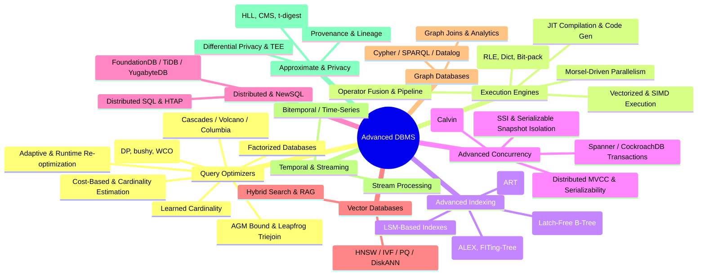

# Section E — Advanced Database Systems

This section covers cutting-edge database internals that go beyond what is covered in the core DBMS chapters. Topics range from modern query optimizer architectures (Cascades/Volcano/Columbia) to vectorized execution engines, learned indexes, serializable snapshot isolation, deterministic databases, vector databases for AI workloads, graph databases, temporal/streaming systems, and approximate query processing with privacy-preserving techniques.

## Topic Map

## Reading Order

| Order | File | Prerequisites | Core Focus |
|-------|------|---------------|------------|
| 1 | `query-optimizers.md` | [../query-processing/optimization.md](../query-processing/optimization.md) | Optimizer architectures, join theory |
| 2 | `execution-engines.md` | [../storage/column-stores.md](../storage/column-stores.md) | Modern execution models |
| 3 | `index-advanced.md` | [../indexing/b-tree.md](../indexing/b-tree.md), [../internals/lsm-trees.md](../internals/lsm-trees.md) | Next-gen index structures |
| 4 | `concurrency-advanced.md` | [../transactions/mvcc.md](../transactions/mvcc.md), [../transactions/isolation-levels.md](../transactions/isolation-levels.md) | Distributed concurrency & SSI |
| 5 | `distributed-databases.md` | [../transactions/distributed.md](../transactions/distributed.md) | NewSQL & HTAP systems |
| 6 | `vector-databases.md` | None | Vector search & AI-native DBs |
| 7 | `graph-databases.md` | None | Graph query languages & analytics |
| 8 | `temporal-streaming.md` | None | Temporal data & streaming |
| 9 | `approximate-privacy.md` | None | Sketches, privacy, provenance |

## Foundations vs. Advanced

| Category | Foundations (existing files) | This Section (advanced) |
|----------|---------------------------|----------------------|
| Optimization | Rule-based, basic cost | Cascades, learned cardinality, WCO, factorized |
| Execution | Volcano iterator model | Vectorized, JIT, morsel-driven |
| Indexing | B-tree, hash, bitmap | Learned, Bw-tree, ART, LSM indexes |
| Concurrency | 2PL, basic MVCC, locks | SSI, deterministic DBs, distributed MVCC |
| Transactions | 2PC, basic serializability | Spanner TrueTime, Calvin, CockroachDB |

## Cross-References to Existing Content

- **Query Processing**: [../query-processing/](../query-processing/) — parsing, optimization, joins, cost estimation
- **Transaction Internals**: [../internals/transaction-internals.md](../internals/transaction-internals.md), [../internals/wal.md](../internals/wal.md)
- **Transactions**: [../transactions/](../transactions/) — ACID, isolation levels, MVCC, distributed TXNs
- **Indexing**: [../indexing/](../indexing/) — B-tree, hash, bitmap, GiST, GIN
- **Storage**: [../storage/](../storage/) — column stores, buffer management
- **Internals**: [../internals/](../internals/) — engines, compaction, LSM trees, WAL