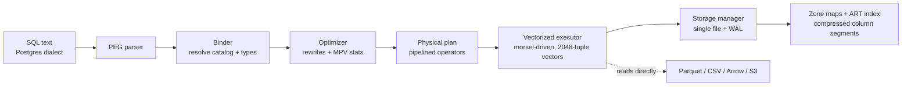
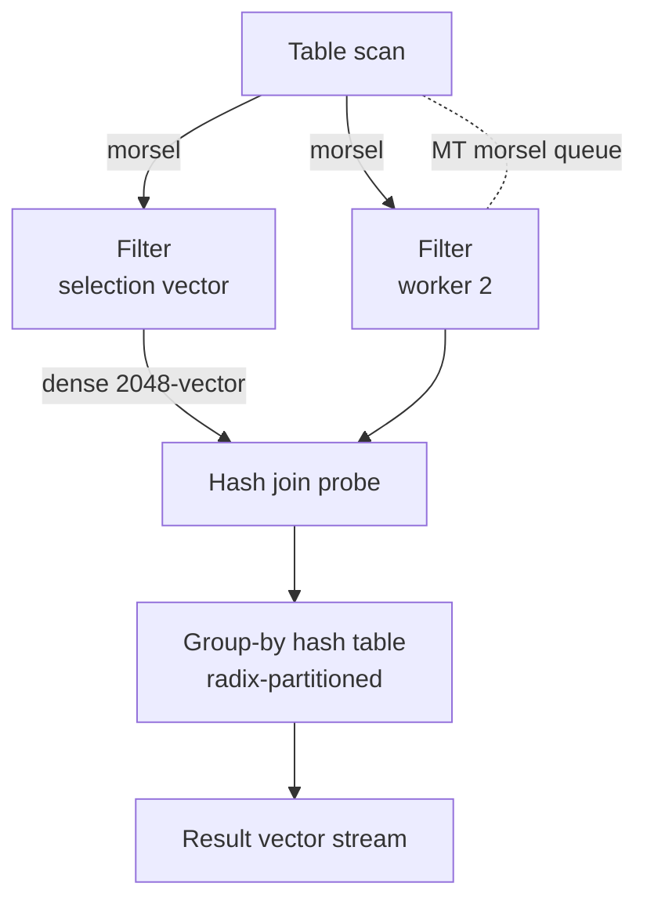
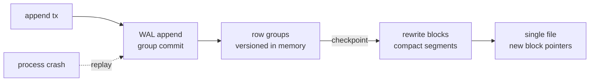

# DuckDB: Vectorized OLAP in-Process

DuckDB is an open-source, in-process analytical DBMS built at CWI Amsterdam (first release 2019, by Mark Raasveldsen and Hannes Mühleisen, out of the same database group that produced MonetDB and the X100 vectorized-execution paper). It is routinely described as "SQLite for analytics": a single library that links directly into your process — no server, no network, no configuration — but instead of SQLite's row-oriented B-tree OLTP engine, DuckDB embeds a full columnar, vectorized OLAP engine with a single-file persistent format, ACID transactions (optimistic MVCC, single writer), and surprisingly complete SQL. The engineering goal is that analytical queries on hundreds of millions of rows should run in milliseconds on a laptop with zero deployment, and the published results and widespread adoption (Python/R/JVM/CLI bindings, dbt, Jupyter, Polars interop) show the design point landed.

This page covers the architecture, the vectorized push-based execution engine, the optimizer and its Most-Probable-Values (MPV) statistics, the single-file storage format with zone maps and ART indexes, the lightweight compression stack, the SQL surface interviewers probe (window functions, ASOF joins), how DuckDB compares to SQLite, ClickHouse, Polars, and Spark, and the embedded-analytics use cases (including direct Parquet/Arrow reading and MotherDuck). Execution-model background lives in [vectorized-execution.md](vectorized-execution.md) and [execution-engines.md](execution-engines.md); optimizer background lives in [volcano-optimizer.md](volcano-optimizer.md).

---

## What DuckDB is — and what it is not

The defining choice is the **process model**. Client-server engines (PostgreSQL, ClickHouse, Spark) pay for every query in serialization, network hops, and context switches between client and server. DuckDB runs *inside* the data-processing application: the query engine is a library, data crosses the boundary once, in shared memory. That makes it the natural query engine for notebooks, IDE plugins, desktop apps, edge gateways, and CI jobs.

What it **is**:

- An in-process, single-node **OLAP** engine: columnar storage, vectorized execution, aggressive compression, scan-optimized aggregation.
- **Single-file database** (arbitrary extension, commonly `.duckdb`) containing data, indexes, and metadata — plus a WAL for crash recovery. One `cp` copies the whole database.
- A **frictionless reader** of external data: `read_parquet`, `read_csv`, `read_json`, Arrow tables, and remote object storage via the `httpfs` extension — no import step required.
- Full SQL with analytical extensions: window functions, CTEs, `QUALIFY`, `GROUP BY ALL`, `ASOF JOIN`, `PIVOT`, nested list/struct/map types with lambdas.

What it **is not**:

- Not an OLTP workhorse: writes are serialized (single writer, optimistic MVCC), there is no row-level locking story for thousands of concurrent writers, and B-tree-style hot-update workloads are the wrong shape.
- Not a distributed engine: one process, one machine. Scale-out means exporting Parquet to a lake and querying with a distributed engine instead (see [distributed-query-execution.md](distributed-query-execution.md)).
- Not a serving database: there is no built-in network protocol, replication, or high-availability story. (MotherDuck, covered below, sells exactly that missing layer as a cloud service.)

The interview one-liner: **DuckDB bets that most analytical data fits on one machine once you compress it columnar, and that the network — not the CPU — is the slowest component of most analytics stacks.**

### The performance mental model

To reason about DuckDB's speed in an interview, anchor on the three cost layers it removes. **Network**: no client-server round trips, no wire serialization — a scan result crosses a shared-memory boundary at DRAM bandwidth, orders of magnitude above 10-25 GbE. **Serialization**: with Arrow, even the boundary crossing is zero-copy. **CPU**: columnar vectors let every operator loop run as straight-line SIMD-friendly code, with zone maps deleting most of the work before it starts. What remains is memory bandwidth and cache behavior — which is why DuckDB's design conversations are about tuple layouts, dictionary codes, and vector sizes rather than about the network stack. The model also explains the *limits*: an engine that removes the network cannot remove cross-machine shuffles, so beyond one machine's RAM and disk you graduate to a server engine.

## Architecture overview

DuckDB's front-end is a hand-written PEG parser (with a PostgreSQL-compatible dialect), followed by a binder that resolves names against the catalog, an optimizer built from statistics-driven rewrite rules, and a pipelined, morsel-driven, vectorized executor. Everything lives in one process; the storage manager maps the single file into block reads on demand. Alongside the data path sit a transaction manager (optimistic MVCC, single-writer validation) and a catalog holding tables, views, macros, and prepared statements — small components, but interviewers appreciate the acknowledgment that an in-process engine still needs a *complete* database skeleton, only without the server.



Extension points matter as much as the core: DuckDB loads statically-typed extensions at runtime (`httpfs` for S3/HTTP, `json`, `spatial`, `full-text search`, `postgres_scanner` for querying a live Postgres). The extension ABI is the reason DuckDB keeps appearing in unexpected places — inside pandas replacements, inside other databases, inside browsers via WASM.

## Vectorized push-based execution

Two ideas combine here, and both have their own chapter in this book. First, **vectorization**: operators process batches of 2048 tuples per column rather than one tuple at a time, amortizing interpreter overhead and enabling SIMD ([vectorized-execution.md](vectorized-execution.md)). Second, **push-based pipelining**: instead of the Volcano iterator's pull model, where every operator calls `next()` up the tree and pays a virtual call per tuple, operators *push* materialized vectors into their consumers ([execution-engines.md](execution-engines.md) contrasts the models; [volcano-optimizer.md](volcano-optimizer.md) explains why the pull iterator became the default in classic engines in the first place).

The parallelism story is **morsel-driven** (the HyPer design): the plan's pipeline of operators is shared, and worker threads grab *morsels* — chunks of input, sized around the 2048-tuple vector — and push them through the whole pipeline, so parallelism adapts to core count without plan changes. Per-operator state is partitioned (hash tables are radix-partitioned), and operators that block (hash join build, sort, group-by) can pipeline-break and spill to disk while keeping the vectorized inner loops.



Selection vectors are the load-bearing detail. A filter operator does not emit a full vector padded with nulls; it emits a *selection vector* listing surviving positions, and downstream operators loop only over selected entries. Chains of filters therefore shrink work multiplicatively without re-materialization — the difference between 40 % and 3 % CPU on selective scans in the DuckDB team's published breakdowns.

When a blocking operator (sort, hash join build, group-by) exceeds memory, it spills: inputs are radix-partitioned to disk, and each partition is later processed independently — external algorithms chosen so the vectorized inner loops never change, only the outer orchestration. The interview question this answers is "what happens when your group-by exceeds RAM?": the answer is *partitioned spilling with the same vectorized kernels*, not failure, and not a silently slower row-based fallback.

## The optimizer: rules, statistics, and MPV

DuckDB's optimizer is a rule-based framework whose rules are heavily statistics-driven — closer in spirit to System-R-style cost-based optimization ([volcano-optimizer.md](volcano-optimizer.md)) than to a full Cascades memo ([cascades-optimizer.md](cascades-optimizer.md)). Key components:

- **Filter/projection pushdown** through joins and into scans; predicate transitivity (`a=b AND a=5` implies `b=5`).
- **Join ordering** by dynamic programming for small-to-medium join graphs (near-exhaustive search with the "leapfrog-style" tightening of bounds for hard cases), falling back to greedy for very large ones — guided by per-column statistics rather than by a memo.
- **Statistics propagation**: every operator summarizes min/max/distinct counts of its output, so later rules make informed choices.
- **MPV statistics** — the distinctive piece. DuckDB sketches the *most probable values* of a column (effectively a compact top-k list with frequencies). The optimizer uses MPV lists for much sharper cardinality estimates than a histogram gives on skewed data, and certain rules fire *only* when an MPV proves a predicate is trivially true or false. Interview framing: MPV answers "what does the data look like where it matters most" — the skewed head of the distribution that uniform histograms misprice ([cardinality-estimation.md](cardinality-estimation.md)).
- **Dynamic filter pushdown**: at runtime, a hash-join build side publishes its observed keys back into the probe-side scan, which uses zone maps to skip blocks — a semi-join filter discovered during execution, not planned ahead ([adaptive-query-execution.md](adaptive-query-execution.md) covers the general pattern).
- **Late materialization** for strings: filters run on small integer keys/dictionaries and full string payloads are reconstructed only for final results ([late-materialization.md](late-materialization.md)).
- **Top-N and limit rewrites**: `ORDER BY ... LIMIT k` becomes a bounded heap pushed into the scan path.

The rules run in a deliberate pipeline — rewrite → join order → statistics recompute → final cost-based choices — and the interplay is the interview-worthy part: after filter pushdown changes a scan's estimated cardinality, the join-order search re-prices its plans, and a *different* join order can win purely because zone maps and MPV stats made one filter nearly free. Optimizers fail when estimates and rewrites don't talk to each other; DuckDB's design keeps them in one loop.

DuckDB deliberately has **no default JIT** — vectorized interpretation at 2048-tuple granularity gets most of the code-generation win without compile latency ([query-compilation.md](query-compilation.md) covers both camps).

## Single-file storage: blocks, zone maps, ART indexes

The persistent format is the storage-interview gold mine:

- The database is a sequence of fixed-size blocks (256 KiB by default) in one file; a checkpoint rewrites blocks and truncates the WAL. Writes go to the WAL, readers proceed against the last checkpoint under optimistic MVCC — copy-on-write semantics, single writer.
- Tables are stored **row-group-wise** (122,880 rows = 60 vectors of 2048) split into column segments. Each segment carries a **zone map**: min/max/null-count statistics per block, maintained incrementally. A predicate consults zone maps *before* decompression and skips non-overlapping blocks — the same min-max pruning idea as Parquet row-group statistics and ClickHouse skip indexes ([columnar-formats.md](columnar-formats.md), [column-stores.md](../storage/column-stores.md)).
- **Indexes are ART — Adaptive Radix Trees** — used for primary keys, unique constraints, and explicit `CREATE INDEX`. ART is chosen because it is cache-friendly, adapts node size to key density (node4 → node16 → node48 → node256), and supports efficient point and range lookups over the leaf-to-node ordering. DuckDB's ART is hybrid: in-memory mutable structures backed by blocks in the file. The data structure is dissected in [adaptive-radix-tree.md](adaptive-radix-tree.md), with the Bw-tree comparison in [bwtree-art.md](bwtree-art.md).
- **Compression** is per-segment, chosen per block by trial: the encoder tries candidate schemes and keeps the smallest. The stack: bit-packing with frames-of-reference for integers, dictionary and run-length encoding for low-cardinality data, constant encoding for degenerate blocks, **FSST** for strings — random-access string compression at near-LZ4 speed ([fsst-string-compression.md](fsst-string-compression.md)) — and **ALP** (Adaptive Lossless floating-Point, VLDB 2024) for doubles: values are rewritten as small integers times a power-of-ten factor and exponent (so `1.75` becomes `175 × 10⁻²`), then bit-packed; the paper reports ~2× better compression than previous float schemes with SIMD-friendly decoding. The payoff: analytical scans often become CPU-bound on *decompressed* domain values — I/O disappears first.

### Inside a row group

The concrete layout makes the interview answers about pruning and compression concrete:

```text
row group = 122,880 rows (60 vectors x 2048)
  column segment "ts"      [block: min=14:00:00 max=14:03:59  alg=ALP/FSST-compressed...]
  column segment "user_id" [block: dictionary{42:'a', ...} + bit-packed codes]
  column segment "amount"  [block: min=0.0 max=999.9  alg=bitpacking(for=0)]
  every block header: row count, offset, compression algorithm, zone-map stats
```

Three facts to memorize for interviews. (1) **Pruning is per column segment**: a `ts` range filter consults only the `ts` zone map; other columns are never touched for skipped blocks. (2) **Compression is chosen per block, by trial**: the encoder compresses the block under each candidate algorithm and keeps the smallest — a brute-force that beats heuristics and adapts as data distributions shift within a column. (3) **Vectors and blocks agree**: 60 vectors of 2048 make one row group, so a scan can decompress exactly one vector at a time without re-batching — the storage layer and the execution layer were co-designed around the same 2048 constant.

## SQL features interviewers actually probe

Window functions, CTEs, and set operations match the PostgreSQL dialect ([window-functions.md](../sql/window-functions.md), [gaps-and-islands.md](../sql/gaps-and-islands.md)). Beyond that, DuckDB's distinctive surface:

```sql
-- ASOF JOIN: nearest-match on time, the join OLAP engines historically lacked
SELECT t.ts, t.symbol, t.price, n.news_title
FROM trades t
ASOF JOIN news n
  ON t.symbol = n.symbol AND n.published_at <= t.ts;   -- latest news at trade time

-- QUALIFY: filter window results without a subquery
SELECT * FROM orders
QUALIFY ROW_NUMBER() OVER (PARTITION BY user_id ORDER BY ts DESC) = 1;

-- ergonomics: GROUP BY ALL, EXCLUDE, sampling
SELECT region, count(*) AS n, avg(amount) AS avg_amt
FROM sales GROUP BY ALL;
SELECT * EXCLUDE (debug_col) FROM events USING SAMPLE 1 PERCENT;
```

**ASOF joins** deserve attention because they come up constantly in time-series and fintech interviews: they answer "for each left row, the most recent matching right row at or before a time" — expressible with a correlated subquery or lateral join elsewhere ([lateral-joins.md](../sql/lateral-joins.md)), but DuckDB executes it efficiently and reads like a spec. Time-series engines build the same feature in; see [time-series-databases.md](../nosql/time-series-databases.md) for the InfluxDB/TimescaleDB take.

Reading data with zero import is the other headline:

```sql
SELECT version, count(*), avg(latency_ms)
FROM read_parquet('s3://logs/2024/*.parquet', hive_partitioning = true)
WHERE region = 'eu' GROUP BY version;
```

`ATTACH` rounds out the story: DuckDB can attach external databases — `ATTACH 'dbname=prod host=...' AS pg (TYPE postgres)` via `postgres_scanner`, or another `.duckdb`/SQLite file — and query them side by side with local Parquet, which makes it a practical *federation scratchpad* for the "join our warehouse export with the OLTP replica" class of questions.

The Arrow connection is zero-copy: DuckDB scans Arrow record batches in place and can *return* Arrow batches to Polars/pandas without serialization, which is why DuckDB is now embedded inside dataframes as their "query engine mode" — Arrow as the interchange contract ([columnar-formats.md](columnar-formats.md)).

The type system carries the analytical weight too: nested `STRUCT`/`LIST`/`MAP` types with inline lambda functions (`list_transform(x, y -> y * 2)`), `ENUM`s stored as dictionary codes, `UNION` types, and `PIVOT`/`UNPIVOT` as first-class operators. Interviewers increasingly ask about semi-structured SQL: DuckDB reads JSON and extracts typed fields at scan time (`json_extract` in the projection pushdown), avoiding a separate document store for JSON-heavy event data.

One more ergonomic worth naming because interviewers use it as a shibboleth: `COPY (SELECT ...) TO 'file.parquet' (FORMAT parquet, COMPRESSION zstd)` — analytical systems are judged as much on their *export* story as their query story, and DuckDB treats writing Parquet (and CSV/JSON) as a first-class operation with compression options.

### Reading a plan: EXPLAIN and its numbers

DuckDB's `EXPLAIN ANALYZE` output is a text tree of pipelines with per-operator cardinality and timing — the interview-friendly way to demonstrate you understand the engine's shape:

```text
┌───────────────────────────┐
│      HASH_GROUP_BY        │
│   groups: region          │
│   aggs: avg(amount)       │
└──────────┬────────────────┘
┌──────────┴────────────────┐
│         HASH_JOIN         │  probe: 12,884 rows   (dynamic filter pushed)
│   region = r_id           │  build:     58 rows
└──────────┬────────────────┘
┌──────────┴────────────────┐
│         SEQ_SCAN          │  12,884 of 3.1M rows (100% pruning)
│   filters: ts >= ...      │  ~0.02s      C=zone-map pruned blocks
└───────────────────────────┘
```

What to call out: the scan's cardinality versus the table's (zone-map pruning and pushed filters at work), the dynamic filter on the probe side (learned from the build side at runtime), and the absence of exchange operators — parallelism is morsel-driven inside operators, not expressed as plan nodes as in Spark. Being able to narrate this tree, in this vocabulary, is most of the DuckDB-internals interview.

## Transactions and concurrency

DuckDB implements **ACID with optimistic MVCC**: transactions read a consistent snapshot and validate at commit. Writers serialize — a single writer holds the write lock, appends to the WAL, and records undo/redo information in row groups; readers never block on writers because they read the last checkpoint plus WAL-derived versions. Conflict handling follows optimistic-concurrency rules: two writers touching the same rows abort the later one with a serialization error that the application retries ([optimistic-concurrency.md](optimistic-concurrency.md)). The design is honest about the process model: with one process, you do not need distributed locking — you need cheap snapshots and fast validation.



Checkpointing is where the single-file format shows its columnar nature: the checkpoint rewrites affected row groups, merges small segments, recomputes zone maps and compression choices, and swaps the block pointers — an incremental version of what bulk columnar systems do at compaction. Long-running writers should checkpoint periodically or the WAL grows unbounded and startup replay gets slow.

## DuckDB vs SQLite vs ClickHouse vs Polars vs Spark

| Dimension | DuckDB | SQLite | ClickHouse | Polars | Spark |
|---|---|---|---|---|---|
| Process model | in-process library | in-process library | client-server cluster | in-process library | JVM cluster + driver |
| Storage | single file, columnar, compressed | single file, row B-tree | MergeTree columnar, replicated | no native persistent store (in-memory/buffers) | external: Parquet/Delta/Hive |
| Execution | vectorized push, morsel-driven | interpreted bytecode VM, row-at-a-time | vectorized, async-IO heavy | Apache Arrow, Rust, streaming | codegen + Tungsten, shuffle-based |
| Write pattern | bulk append, single writer | frequent small reads/writes | append-mostly, batching advised | eager/lazy transforms | batch/stream jobs |
| Concurrency | many readers, one writer | many, with locking | many, replicated shards | single process | multi-tenant via cluster |
| Sweet spot | local/edge analytics, notebooks, embedded BI | app-local OLTP state | high-QoS server analytics, logs | single-node dataframe speedup | lakehouse ETL at cluster scale |
| Interview one-liner | "SQLite-shaped, X100-hearted" | "the universal embedded row store" | "fastest server for raw scans" | "DuckDB's dataframe cousin" | "cluster-scale fault-tolerant SQL" |

The comparison interviewers usually want: **SQLite is a row store optimized for point transactions inside one app; DuckDB is a column store optimized for scans and aggregations inside one app.** ClickHouse keeps the server boundary but scales horizontally and handles concurrent serving workloads; DuckDB trades multi-tenancy for zero ops. Polars is the dataframe-native sibling — same Arrow heart, no SQL-first persistence. Spark is for data too big for one machine, paying coordination and shuffle costs for it ([clickhouse internals](../../data-engineering/clickhouse.md), [Spark internals](../../data-engineering/spark-internals.md), [Trino's serverless-SQL angle](../../data-engineering/trino.md)).

## Embedded analytics: use cases and MotherDuck

Where DuckDB shines in production settings:

1. **Notebook and data-science acceleration** — replace multi-minute pandas group-bys with DuckDB over the same files; out-of-core execution spills past RAM gracefully.
2. **Lakehouse queries without a cluster** — `read_parquet('s3://...')` plus `httpfs` gives predicate-pushdown Parquet scans with no Spark cluster for interactive sizes ([lakehouses.md](../../data-engineering/lakehouses.md), [data-formats.md](../../data-engineering/data-formats.md)).
3. **Embedded BI and desktop apps** — ship a `.duckdb` file inside the app; dashboards run offline (business-intelligence tools embed it as a local cache).
4. **CI data validation** — dbt-duckdb runs transformation tests in seconds per PR without warehouse spend.
5. **Edge/IoT gateways** — aggregate sensor data locally, export compact Parquet upstream; pairs naturally with time-series systems ([time-series-databases.md](../nosql/time-series-databases.md)).
6. **As an engine inside other tools** — DuckDB embedded as the query layer of larger products (the "data system as a library" pattern; the same niche SQLite occupied transactionally).
7. **Interactive log/trace triage** — point DuckDB at a directory of gzipped JSON logs or Parquet trace exports; ad-hoc analytical filtering of incidents runs orders of magnitude faster than `jq` pipelines, without shipping anything to a log platform.

**MotherDuck** is the managed cloud companion built by the DuckDB-linked company of the same name: it hosts DuckDB in the cloud, adds durability, sharing, and a web IDE, and its differentiating trick is **hybrid execution** — one query can run some operators in the cloud and some on the laptop, moving minimal data across the wire. For interviews: MotherDuck exists because the in-process model deliberately *lacks* sharing; a cloud service re-adds persistence, collaboration, and scale on top of the same engine. There is also a spec-compatible ecosystem of DuckDB-in-the-cloud services from other vendors — worth one sentence to show awareness that "in-process engine + hosted service" is now a recognized product pattern.

## Common pitfalls

1. **Treating DuckDB as an OLTP database.** Concurrent writers block; hot-row updates thrash the optimistic path. It is a scanning engine with transactional convenience, not a Postgres replacement.
2. **Assuming network durability.** The single file is local state; recovery = WAL replay, availability = your problem. Multi-machine needs MotherDuck-style services or an explicit Parquet-lake architecture.
3. **Ignoring checkpointing in long-running writers.** An ever-growing WAL slows startup; periodic `CHECKPOINT` (or restarting) is normal hygiene.
4. **Filtering on columns without zone-map utility.** Zone maps prune only when data is *correlated with insertion order*; append-ordered time columns prune beautifully, random IDs do not. Sort or cluster your bulk loads.
5. **Believing "in-process" means "single-threaded."** DuckDB saturates all cores by default; resource contention inside a host app is a real failure mode (set `threads`/`memory_limit`).
6. **Reading huge remote Parquet without projections.** `SELECT *` over S3 defeats projection pushdown and pulls every column; columnar formats reward selecting only needed columns, and Parquet statistics feed DuckDB's optimizer even before it opens the file ([columnar-formats.md](columnar-formats.md)).

## Extension ecosystem, in one paragraph

DuckDB's community surface is an extension ABI rather than a plugin marketplace: `httpfs` (S3/HTTP/GCS/Azure filesystems — the lake-reading backbone), `postgres_scanner` and `mysql_scanner` (attach and query live OLTP databases read-only), `sqlite_scanner`, `spatial` (GEOS-backed geometry types), `fts`, `icu`, `parquet` (built-in), and a UI extension that serves a local web IDE. The interview-relevant point: extensions register *filesystems, types, functions, and scanner operators* — the same four hooks a real engine needs — which is why "query Postgres and Parquet side by side from a notebook" is a three-line DuckDB script rather than an integration project. When comparing to Polars or pandas in interviews, this ecosystem breadth (SQL dialect + storage scanners + GIS + document types) is DuckDB's defensible moat, more than raw benchmark numbers.

## Interview Questions

**Q1. Why is DuckDB fast without JIT compilation when systems like HyPer argue compilation is necessary?**
Answer: HyPer's claim predates the morsel-driven vectorization consensus. Per-tuple interpretation pays one virtual call per tuple; per-*vector* interpretation amortizes that over 2048 tuples, and tight columnar loops auto-vectorize to SIMD, recovering most of the codegen win without compile latency or expression specialization. DuckDB also pushes (rather than pulls) vectors between operators, removing iterator overhead entirely. The measured gap between well-built vectorized engines and JIT engines is small on OLAP scans, so DuckDB chose determinism and simplicity.

**Q2. What are zone maps, and why do they make DuckDB's scans so cheap on time-ordered data?**
Answer: Zone maps are per-block min/max (plus null-count) statistics stored alongside each compressed column segment. A predicate compares its bounds against the zone map and skips whole blocks without decompression. Because analytical data is usually append-ordered and time-correlated, consecutive blocks cover narrow time ranges, so a time-range filter prunes most blocks. On random-key columns there is no block-level correlation and pruning collapses — the fix is sorting/clustering bulk loads.

**Q3. Why does DuckDB use an Adaptive Radix Tree instead of a B-tree for indexes?**
Answer: ART indexes keys by byte-prefix trie with adaptive node sizes (4/16/48/256), so path compression keeps depth proportional to key *distinctness*, not key length, and node sizes match local density for cache efficiency. It gives ordered-structure semantics (range scans, prefix lookups) with fewer cache misses than B-tree nodes, and leaves are stable for MVCC versioning. The trade-offs and structure are detailed in [adaptive-radix-tree.md](adaptive-radix-tree.md).

**Q4. Explain MPV statistics and give one optimization that requires them.**
Answer: DuckDB sketches the most probable values (top-k with frequencies) of columns during ingest and stores them as statistics. The optimizer uses them for skewed-aware cardinality estimation — a predicate on an MPV value gets its true selectivity, not a histogram average — and rules can resolve trivially-true/false predicates when MPV data proves it. Any plan choice that hinges on a heavy-hitter predicate (join-order decisions, pushdown priorities) benefits.

**Q5. When would you choose DuckDB over ClickHouse, and vice versa?**
Answer: Choose DuckDB for embedded, zero-ops, single-machine analytics — notebooks, apps, edge, CI, ad-hoc lake queries — where data volume fits one machine compressed and concurrency is modest. Choose ClickHouse when you need a shared server: many concurrent analysts/ingestors, replication and horizontal scale, continuous high-rate ingestion with serving SLAs. The dividing line is process model and multi-tenancy, not raw speed.

**Q6. How does ASOF JOIN semantics differ from a regular INNER JOIN, and where does it matter?**
Answer: ASOF JOIN matches each left row to the *nearest* right row on an ordered column (the latest right row at or before the left's time under `<=`), rather than requiring equality. It matters for point-in-time correctness: attaching the latest price/quote/news/config to each event without duplicates, which equality joins cannot express and correlated subqueries express only slowly.

**Q7. What does MotherDuck add over embedding DuckDB, and what design tension does it reveal?**
Answer: MotherDuck adds persistence, collaboration/sharing, a UI, and scale — the things an in-process library intentionally omits. Its hybrid-execution mode splits a query between cloud and laptop. The tension: DuckDB's speed comes from eliminating the network; cloud services reintroduce it, so the product minimizes data movement per query instead of eliminating it. Interviewers like candidates who can articulate this trade.

**Q8. Why does DuckDB store strings compressed with FSST rather than a plain dictionary, and what operations still work on compressed data?**
Answer: Dictionaries only collapse *identical* strings; real string columns (URLs, emails, UUIDs) are similar-but-not-equal, so FSST compresses each string independently by replacing frequent substrings with single-byte codes — with LZ4-class speed and random access preserved. Equality, hashing, joins, and group-by work directly on compressed codes (coding is deterministic, so equal strings are byte-equal); ordering and LIKE do not, and those decode first ([fsst-string-compression.md](fsst-string-compression.md)).
