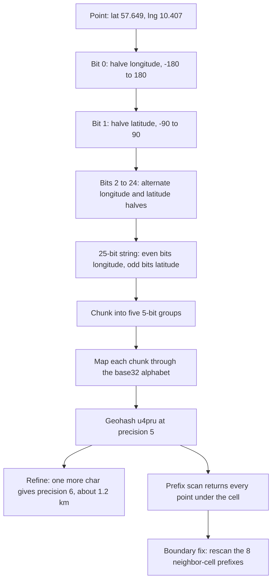
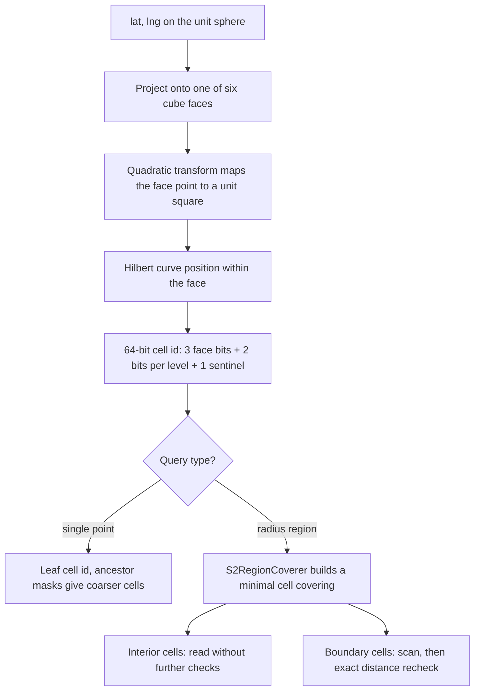
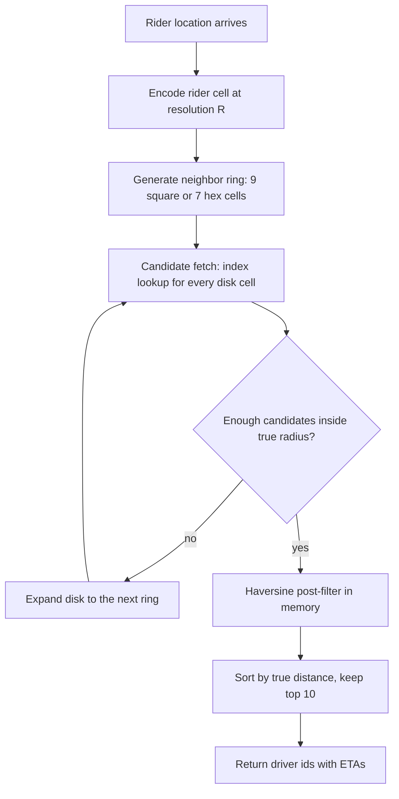

# Geospatial Indexing: Geohash, S2, H3, and Spatial Queries

## Overview

Every "find what's near me" feature reduces a two-dimensional sphere to one-dimensional sortable keys that ordinary indexes — B-trees, LSM memtables, Redis sorted sets — already know how to serve. This page covers the encoding systems that perform that reduction: geohash's interleaved-bit prefix strings, S2's Hilbert-curve cell ids on a cube-projected sphere, and Uber's H3 hexagonal hierarchy, together with the query patterns built on them: prefix scans, neighbor expansion, region coverings, and hexagonal k-rings. The tree structures that answer the same queries natively — R-trees inside GiST — are covered structurally by the [GiST Indexes](../indexing/gist.md) page, which owns bounding-box internals, operator classes, and the PostGIS index examples; the production dispatch system built on these indexes is the [Ride-Hailing System Design](../../interview/system-design/real-world/ride-hailing.md) case study. Underneath every encoding sit the same two primitives: one-dimensional ordering ([B-Tree Fundamentals](../indexing/btrees.md)) and the space-filling-curve bit math dissected in [De Bruijn, Morton, and Friends](../../dsa/chapters/ch135-debruijn-morton.md).

## Why B-Trees Fail on Two Dimensions

A B-tree answers queries expressible as ranges over a single total order. An Earth-surface point has two coordinates and no order that preserves proximity: sort by longitude and latitude collapses into ties; sort by latitude and every longitude in the band is a candidate. A composite `(lat, lng)` index fails identically — the planner seeks the leading column's latitude band, then must scan every row in it, because within that band the second key is effectively unbounded.

A radius window is not even a clean rectangle in `(lat, lng)` space:

```sql
-- Looks plausible, silently wrong near Fiji (antimeridian):
SELECT * FROM pois
WHERE lat BETWEEN -18.35 AND -18.05
  AND lng BETWEEN 179.70 AND 180.15;   -- no longitude exceeds 180
```

Near the antimeridian the correct longitude window wraps from +180 to -180, which a numeric `BETWEEN` cannot express; near the poles a 50 km radius spans every longitude on Earth, so the "rectangle" degenerates toward a global scan. The fix is the space-filling-curve idea: partition the sphere into discrete cells, number the cells so that spatial neighbors receive nearby numbers, and store `(cell_key, point)` rows in any sorted store. A 2-D radius query then becomes a small set of 1-D key ranges — plus a correction for cells the region boundary merely clips — and every sorted store in the stack (B-tree, LSM, sorted set) serves it unchanged.

## Geohash: Interleaved Bits and Prefix Scans

Geohash is the minimal version of the scheme. It alternately halves the longitude range and the latitude range — longitude first — appending one bit per halving: bit 0 splits the world at the prime meridian, bit 1 splits latitude at the equator, bit 2 splits the surviving longitude half, and so on. After 25 bits (precision 5) the point sits in a ≈ 4.9 km × 4.9 km rectangle. The bits are grouped in fives and each 5-bit group maps to one character of the base32 alphabet `0123456789bcdefghjkmnpqrstuvwxyz` (a, i, l, o omitted to prevent misreads).

| Precision | Bits | Cell size |
|---|---|---|
| 4 | 20 | 39 km × 20 km |
| 5 | 25 | 4.9 km × 4.9 km |
| 6 | 30 | 1.2 km × 0.6 km |
| 7 | 35 | 153 m × 153 m |
| 8 | 40 | 38 m × 19 m |

Because each appended character refines the previous cell, a longer geohash is a descendant of the shorter one: cell `u4pru` (Jutland, Denmark) contains every point whose hash starts with `u4pru`. Proximity search therefore becomes a B-tree prefix scan — `WHERE geohash LIKE 'u4pru%'` — which the planner executes as the key range `[u4pru, u4prv)`.

```sql
-- Precision-5 cell scan plus two of its eight neighbors:
SELECT driver_id FROM driver_locations
WHERE geohash LIKE 'u4pru%' OR geohash LIKE 'u4prv%' OR geohash LIKE 'u4prt%';
-- candidates only: exact distance filtering happens after the scan
```

The **boundary problem** is the encoding's defining flaw: two riders ten meters apart on opposite sides of a cell edge carry different precision-5 prefixes, and scanning only the rider's own cell misses one of them. The standard fix computes the neighbor cells — geohash defines string arithmetic that derives the 8 adjacent cells without decoding — and scans each of them too. Two further distortions matter: near the poles the longitude halving still spans 360°, so cells stretch absurdly wide and hash locality stops matching geographic locality; and the ±180° wrap means a prefix scan can never cross the antimeridian, so a radius query near Fiji must explicitly union cells from both sides of the date line.

Redis internalizes exactly this design: `GEOADD` stores each member in a sorted set whose score is a 52-bit geohash (26 longitude and 26 latitude bits interleaved, sub-meter resolution), and `GEOSEARCH` (Redis 6.2+) computes the covering hash boxes for the radius, issues one `ZRANGEBYSCORE` range per box — contiguous scores, because the score *is* the encoded cell — then filters candidates by exact haversine distance. The sorted-set machinery underneath is covered in [Redis Key-Value Internals](../nosql/key-value.md).



## S2: Hilbert Cells on a Cube-Projected Sphere

S2 (Google) projects the sphere onto the six faces of a cube, applies a quadratic transform that compensates the cube's area distortion, and overlays each face with a Hilbert curve, producing cells at 31 levels (0–30). Level 0 is one of six face cells; each cell subdivides into four children per level; level-30 leaf cells average about 1 cm across. A cell id is a 64-bit integer: 3 bits of face number, 2 bits of Hilbert position per level, and a trailing 1 bit marking the cell's own level, with zeros below it. That layout makes ancestry a mask test — a cell contains another iff the child's id masked to the parent's level equals the parent's id — and makes neighbor lookup integer arithmetic on Hilbert positions. "Which cells intersect this region" becomes a handful of integer comparisons instead of string scans.

Hilbert versus Z-order matters here. Both are quadtree orders, but Z-order (Morton) interleaving jumps across the quadrant at every power-of-two boundary — two spatially adjacent points can receive distant 1-D keys — while Hilbert keeps consecutive ids spatially contiguous. Range scans over Hilbert cell ids therefore touch contiguous key space with far fewer discontinuous seeks, which is precisely why S2 chose Hilbert over the cheaper-to-compute Morton order. The bit-level contrast is worked through in [De Bruijn, Morton, and Friends](../../dsa/chapters/ch135-debruijn-morton.md).

The `S2RegionCoverer` answers the real query shape: given a region (an `S2Cap` for a radius disk, an `S2Polygon` for a fence), it produces a minimal set of cells — deliberately mixing levels — that covers the region, distinguishing interior cells (everything inside can be read unconditionally) from boundary cells (candidates need an exact recheck). This is why S2-backed stores — MongoDB's `2dsphere` index is built on S2, and application libraries encode cell ids into Bigtable, Spanner, and DynamoDB keys — never need a `LIKE`-style scan: the covering is a concrete list of 64-bit keys to seek.



## H3: Hexagons on an Icosahedron

Uber's H3 starts from a different base solid: the icosahedron, whose surface is tiled with 122 hexagonal base cells at resolution 0, then subdivides every hexagon into 7 children (aperture-7 subdivision) across 16 resolutions (0–15). Cell area shrinks roughly 7× per level — resolution 7 averages ≈ 5.2 km² per cell, resolution 8 ≈ 0.74 km², and city-scale dispatch commonly lands at resolutions 7–9. The H3 index packs a mode field, a 4-bit resolution, a 7-bit base cell, and one 3-bit base-7 digit per refinement level into 64 bits, so an index both names the cell and encodes its full ancestry.

Hexagons are chosen for neighbor uniformity. On a square grid a cell has 8 neighbors at two distinct distances (edge = 1, diagonal = √2); the triangular grid likewise has two distances. A hexagon's 6 neighbors are all equidistant, so every cell at the same k-ring distance is equally far away: the grid disk of radius k contains exactly 1 + 3k(k+1) cells, ring k contains exactly 6k cells, catchment areas are honest approximations of circles, and aggregation math (supply per cell, coverage per ring, matching radii) needs no diagonal correction. That is what makes H3 pleasant for analysis rather than pure lookup.

The cost is the 12 pentagons — one at each icosahedron vertex. Pentagons have 5 neighbors, distort distances near them, and never subdivide into 7 clean hexagons (their children mix pentagons and hexagons), so any globally uniform argument needs pentagon special-casing. The mindset difference from S2 is the interview takeaway: S2 answers "which cells cover this shape" — precise lookups and coverings — while H3 is a uniform analysis grid: join metrics by cell first, then index those cells.

```python
import h3

cell = h3.latlng_to_cell(rider.lat, rider.lng, 8)   # ~0.74 km^2 cells
disk = h3.grid_disk(cell, 1)                        # 7 cells: center + 6 neighbors
cands = [d for c in disk for d in index.scan(c)]    # per-cell hash lookups
top10 = heapq.nsmallest(10, cands, key=lambda d: haversine(rider, d))
```

## R-Trees, GiST, and PostGIS Query Flow

The [GiST Indexes](../indexing/gist.md) page owns the tree internals — bounding-box summaries, R-tree-style splits, operator classes — so here we care only about the query flow. A spatial predicate executes in two stages: the GiST index prunes using bounding-box approximations (cheap rectangle tests), then the executor rechecks each surviving row with the exact geometry function. The index is lossy by design — it may return false positives, never false negatives — and the recheck is visible in `EXPLAIN` output as `Filter` lines under the index scan.

PostGIS offers two types. `geometry` treats coordinates as planar: fast, SRID-agnostic, ideal at city scale where curvature error over a few kilometers is negligible. `geography` interprets `(lat, lng)` as points on the WGS84 spheroid — `ST_DWithin(geog, point, 2000)` means a true 2,000-meter geodesic radius, computed with spheroid math and therefore slower, but correct across long distances. Both are GiST-indexable, and both prune with bounding boxes over angular coordinates.

The sargability rule interviews probe: `ST_DWithin(geom, pt, r)` uses the index because its distance test can be rewritten as an index-searchable bounding-box expansion plus an exact recheck, while the visually identical `WHERE ST_Distance(geom, pt) < r` computes distance per row and never touches the index. Nearest-neighbor ordering works through the `<->` operator: `ORDER BY geom <-> pt LIMIT 10` is index-assisted KNN, and for `geography` columns it orders by true geodesic distance (PostGIS 2.2+).

```sql
CREATE INDEX ON drivers USING GIST (geog);

SELECT id
FROM drivers
WHERE ST_DWithin(geog, ST_SetSRID(ST_MakePoint(-73.985, 40.748), 4326)::geography, 2000)
ORDER BY geog <-> ST_SetSRID(ST_MakePoint(-73.985, 40.748), 4326)::geography
LIMIT 10;
```

## Elasticsearch and Lucene Spatial Fields

Lucene's original `geo_point` implementation was literally the geohash idea: each point was indexed as a set of prefix-tree terms — geohash or quadtree cells at multiple lengths — so a distance query compiled to a union of cell-term matches plus an exact filter. Since Lucene 6 (Elasticsearch 5), `geo_point` moved to BKD trees that store Morton-interleaved lat/lon as 64-bit values: the space-filling-curve idea survives, but the "prefix scan" became a KD-tree range search.

The query mechanics still follow the discipline of this page. The `geo_distance` query decomposes the circle into a set of rectangular latitude/longitude ring boxes — explicitly split where they would cross the antimeridian — runs them as BKD range queries, and rechecks haversine distance per candidate. `geo_bounding_box` is a plain two-dimensional double-range query. `geo_shape` indexes polygons either by recursive prefix-tree tessellation (the classic quadtree/geohash approach) or by BKD triangle decomposition in modern versions. The pattern to remember: Elasticsearch never hands you a geohash string to `LIKE`; every geo query is cell/range decomposition plus exact recheck — the same shape as the worked example below.

```json
GET /drivers/_search
{
  "query": {
    "bool": {
      "filter": {
        "geo_distance": {
          "distance": "2km",
          "location": { "lat": 40.748, "lon": -73.985 }
        }
      }
    }
  }
}
```

## Worked Example: The Ten Nearest Drivers

Query: a rider at (40.748, -73.985) needs the 10 nearest available drivers out of millions of moving points. The full system view — matching, surge, trip state — is the ride-hailing case study; here is the index mechanics, identical in shape across all three encodings:

1. Encode the rider into a cell at resolution R.
2. Generate the neighboring cells — 8 for square grids (geohash/quadtree), 6 for H3 — forming the rider's disk.
3. Fetch every point stored under the disk's cells. This is the only index work: prefix scans (geohash), a covering of sorted 64-bit id ranges (S2), or per-cell hash lookups (H3).
4. Post-filter in memory by true haversine distance; sort; return the top 10.
5. If the disk held too few candidates, expand to the next ring and repeat.

Resolution is the tuning knob, and the trade-off is candidate count versus lookup count. With driver density ρ and cell area A, a nine-cell disk holds ≈ 9·ρ·A candidates; you want that to be a small multiple of 10 — pick A so the in-memory filter sees 30–100 candidates, not 30,000 (too coarse: the filter dominates) and not 3 (too fine: the query degenerates into ring after ring of index seeks). A practical rule: choose the resolution whose cell diagonal is on the order of the search radius, then expand rings on demand. The early-stop criterion is what makes this provably correct: once the 10th-nearest candidate is closer than the distance to the disk's edge, no unscanned cell can contain a closer driver.

In geohash terms: precision 6 (≈ 1.2 km × 0.6 km cells), nine `LIKE` scans, app-side filter. In S2 terms: `S2RegionCoverer` on the 2 km cap returns a handful of mixed-level cells; one range seek per cell over the sorted 64-bit id index; boundary cells rechecked. In H3 terms: `grid_disk(cell, 1)` returns exactly 7 cells, each a hash-map lookup. All three converge on the same invariant: the index does coarse pruning, the CPU does exact math.



## Design Patterns and Pitfalls

Geofencing ("is this pickup inside the airport polygon?") has two standard implementations: ray casting — cast a ray from the point and count polygon-edge crossings; odd count means inside — at O(vertices) per test, or precomputed cell-sets: tessellate the polygon into cells once at write time and answer membership as an O(1) set lookup per cell, rechecking only boundary cells. The cell-set approach wins at query volume; ray casting wins when polygons change constantly. The remaining patterns in the table are where geospatial systems actually fail in production:

| Pattern | Approach | Pitfall |
|---|---|---|
| Geofencing | Precomputed inside-cell sets + boundary recheck, or ray casting | Cell tessellation drifts when the polygon is edited; version the cell sets |
| Catchment assignment | Assign each driver/order to its H3 cell; match within rings | Coarse cells leak cross-boundary demand; fine cells fragment supply |
| Privacy bucketing | Quantize to coarse cells (geohash 4–5, H3 res 5–6) + jitter | Fine cells in analytics re-identify individuals via joins |
| Hot-cell skew | Stadium: split the cell into finer children or salt keys into N shards | Naive per-cell sharding puts the whole stadium on one node |
| Moving-object churn | Update index only on cell change; TTL stale entries | Updating every GPS ping burns write IOPS on unchanged cells |
| Antimeridian wrapping | Split query windows at ±180° and union both sides | Prefix scans and BETWEEN silently return empty near the date line |
| Driver-location caching | Redis GEOADD with TTL + ZREM on deactivate | Stale scores linger without TTL; ghosts get matched |

Two of these deserve emphasis. Hot-cell skew compounds with ring expansion: a stadium event pins thousands of drivers into one cell at any sane resolution, so the cell must be split into finer-resolution children (or its key salted into virtual shards that the matcher fans out to). Moving-object churn is the write-side mirror: at 4-second GPS intervals most updates do not change cells, so updating on cell change plus a TTL (Redis key expiry or a background `ZREM`) keeps the index fresh at a fraction of the write rate.

## Choosing an Encoding: Comparison

No encoding wins everywhere; pick by query shape and store. If the points live in Postgres with PostGIS, `geometry`/`geography` over GiST is usually correct and geohash becomes a sharding helper rather than the primary index. If points live in a key-value store at scale, S2 or H3 cell ids as keys give O(1) per-cell access: S2 wins when arbitrary polygons must be covered exactly (fences, map tiles), H3 wins when cells are the analytical grain (metric joins, pricing zones). Geohash remains the lowest-friction option — debuggable strings, prefix scans on any B-tree, first-class integration in Redis and Elasticsearch — at the price of the boundary and pole distortions above.

| Property | Geohash | S2 | H3 | R-tree / GiST |
|---|---|---|---|---|
| Cell shape | Axis-aligned lat/lng rectangles | Spherical quads over cube faces | Hexagons + 12 pentagons | Arbitrary bounding rectangles |
| Hierarchy | Base32 prefix, 1–12 chars | 31 levels, 4-way, 64-bit ids | 16 resolutions, 7-way, 64-bit ids | Depth set by node capacity and splits |
| Neighbor uniformity | Mixed near edges, poor near poles | Good; integer arithmetic | Exact: 6 equidistant neighbors | None: MBRs overlap by design |
| Stored-key form | Base32 string, sortable prefix | 64-bit integer cell id | 64-bit integer (mode + res + base cell + base-7 digits) | Bounding boxes in tree pages |
| Typical store | Postgres B-tree, Redis zset, ES, DynamoDB sort keys | MongoDB 2dsphere, S2 libs over KV stores | Uber stack, warehouses (ClickHouse), Redis hashes | Postgres/PostGIS, SQLite R*Tree, Oracle SD |
| Failure modes | Boundary misses, IDL/pole distortion | Implementation complexity, cube-edge skew | Pentagons, mixed child orientations | Overlapping MBRs inflate candidates; update churn |

## Interview Questions

1. **Why can't a composite `(lat, lng)` B-tree answer a radius query efficiently?**

   The planner can only seek the leading column's band; within a latitude band the second key is unbounded, so it scans the entire band. Worse, a radius is not a rectangle near the antimeridian (the longitude window wraps ±180°) or near the poles (it spans all longitudes). Cell encodings fix this by reducing proximity to 1-D key ranges plus neighbor corrections.

2. **What is the geohash boundary problem and its standard fix?**

   Two nearby points on opposite sides of a cell edge land in different cells, so a prefix scan over the rider's own cell misses neighbors. The fix computes the 8 adjacent cells with geohash neighbor arithmetic and scans each, then post-filters candidates by exact haversine distance.

3. **Why is Redis `GEOADD` implemented as a sorted set?**

   The score is a 52-bit interleaved geohash of the location. Because the encoding is monotone in the score, a radius search reduces to a handful of contiguous `ZRANGEBYSCORE` ranges — one per covering hash box — followed by exact distance filtering. No secondary index is needed.

4. **Hilbert curve versus Z-order (Morton) curve for spatial keys?**

   Both map 2-D cells to 1-D with locality, but Z-order jumps across quadrant boundaries at every power of two, so adjacent points can receive distant keys. Hilbert keeps consecutive ids spatially contiguous, producing tighter key ranges for region scans — the reason S2 chose it despite the extra computation.

5. **How does S2 answer "all drivers within 3 km" without `LIKE` scans?**

   `S2RegionCoverer` computes a minimal mixed-level cell covering of the 3 km cap. Interior cells are read unconditionally; boundary cells are read and their candidates rechecked with exact distance. Each covering cell is an O(log n) seek on a 64-bit key.

6. **Why did Uber choose hexagons for H3?**

   All 6 neighbors of a hexagon are equidistant, whereas squares and triangles each have two distinct neighbor distances. Uniform rings — ring k is exactly 6k cells — make catchment, coverage, and aggregation math identical everywhere on the grid.

7. **What are H3's pentagons and why do they complicate things?**

   The 12 icosahedron vertices produce pentagon cells with only 5 neighbors, stronger local distortion, and children that mix pentagons and hexagons. Any globally uniform argument — ring sizes, centroid distances — needs pentagon special-casing.

8. **When would you pick PostGIS `geography` over `geometry`?**

   `geometry` treats coordinates as planar: faster and index-friendly, correct enough at city scale. `geography` computes true geodesic distances on the WGS84 spheroid; choose it when queries span large distances and meter-accurate radii matter.

9. **Why does `ST_DWithin` use the GiST index while `ST_Distance(...) < r` does not?**

   `ST_DWithin` is rewritten as an index-searchable bounding-box expansion plus an exact recheck, so the planner can use the spatial index. A `ST_Distance` call inside `WHERE` is a per-row function with no indexable structure and forces a full scan.

10. **One city cell is boiling hot (stadium event). How do you keep the index usable?**

    Split the hot cell into finer-resolution children and shard them apart, or salt the cell key into N virtual shards and fan out queries to all of them. Combine with cell-change-only GPS updates and driver-entry TTLs so the hot shard's write rate stays bounded.

## Key Takeaways

- A spatial index is a space-filling curve plus an agreement on correcting for boundary cells — the storage underneath is a sorted store you already have.
- Geohash gives prefix scans on any B-tree, but a cell scan is never complete without its neighbor cells; poles and the antimeridian distort both cells and scans.
- S2 packs a Hilbert-curve position into 64 bits, turning containment and neighbor lookup into integer arithmetic; region coverings replace string scans entirely.
- H3's uniform hexagon neighbors make it the analysis grid of choice; the 12 pentagons are the standing exception to every uniform argument.
- The index only prunes — bounding boxes, covering cells, k-rings — while exact distance and polygon tests always run as a post-filter.
- Resolution tuning balances in-memory filter load (too coarse) against index-lookup count (too fine); expand rings on demand and stop when the k-th nearest candidate is inside the scanned disk.
- Sargability in PostGIS means `ST_DWithin` and the `<->` KNN operator, never `ST_Distance` inside `WHERE`.
- The cross-cutting pitfalls — IDL wrapping, hot cells, update churn, privacy bucketing — are query-design problems, not encoding problems.

## Cross-References

- [GiST Indexes](../indexing/gist.md) — owns R-tree/GiST structure internals and PostGIS index examples
- [B-Tree Fundamentals](../indexing/btrees.md) — the 1D backbone every cell encoding rides on
- [Redis Key-Value Internals](../nosql/key-value.md) — GEOADD = geohash + sorted set
- [Ride-Hailing System Design](../../interview/system-design/real-world/ride-hailing.md) — the full system view this page's indexes serve
- [De Bruijn, Morton, and Friends](../../dsa/chapters/ch135-debruijn-morton.md) — space-filling-curve bit math

## References

- H3 documentation (Uber) — resolutions, k-ring/grid-disk API, pentagon caveats — https://h3geo.org/docs/
- uber/h3 source repository — core algorithms for hierarchical hexagon indexing on the icosahedron — https://github.com/uber/h3
- S2 Geometry library site — cell ids, region coverer, spherical geometry — https://s2geometry.io/
- S2 cell hierarchy developer guide — 64-bit id layout, levels 0–30, neighbor and containment math — https://s2geometry.io/devguide/s2cell_hierarchy.html
- PostGIS documentation — geometry vs geography, `ST_DWithin`, KNN `<->` operator — https://postgis.net/docs/
- PostGIS project documentation portal — guides, workshop, and indexing best practices — https://postgis.net/documentation/
- Elasticsearch geo-query documentation — `geo_point`/`geo_shape` fields and `geo_distance`/`geo_bounding_box` mechanics — https://www.elastic.co/guide/en/elasticsearch/reference/current/geo-queries.html
