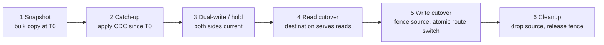

# Online Resharding and Shard Migration

Sharding is a commitment you will break: node counts change, tenants grow,
hotspots appear, and the mapping "key → shard" that looked right at launch
becomes wrong within quarters. Online resharding is the machinery that
changes it **without downtime** — moving live data between shards while
reads, writes, and transactions continue against both the old and new
placement. It is the operation every sharded system must survive, and the
interview question that separates "I know consistent hashing" from "I have
thought about running it."

Foundations are in [Database Sharding](./database-sharding.md) (strategies,
routing), [Consistent Hashing](../../distributed/partitioning/consistent-hashing.md)
and [Jump Consistent Hashing](../../distributed/advanced/jump-consistent-hashing.md)
(assignment math), and [Online Schema Change](./online-schema-change.md) —
which solves the same *live-migration-under-traffic* problem for schemas
instead of data.

## Why resharding is hard: four concurrent problems

Moving rows between two databases while clients keep touching them is not a
copy; it is a distributed state transition:

1. **Atomicity of the move + route switch.** A row exists in two places
   mid-move; the system must guarantee exactly one authoritative location
   for any write at any instant, and both locations for reads-on-fallback.
2. **In-flight mutations.** Between "copy started" and "copy finished," the
   source keeps taking writes — the copy is stale the moment it completes.
3. **Secondary indexes and derived state.** Indexes, materialized caches,
   and denormalized copies must move in lockstep, or the destination serves
   wrong answers even though primary data "arrived."
4. **Client-visible consistency.** A read-your-writes session that wrote to
   shard A at t must not read the pre-copy value from shard B at t+1.

Every production design below is a different packaging of the same cure:
**snapshot + change-stream catch-up + fenced cutover**, with ownership of a
data range expressed as a *versioned lease* rather than a static route.

## The enabler: virtual shards (fixed buckets)

Direct key→node mapping makes any topology change a full repartition. The
fix, now universal: map keys to a **large fixed number of virtual shards**
(buckets), and map buckets to physical nodes as metadata:

```text
key --hash--> bucket (0..1023, never changes) --routing table--> node (changes freely)
```

Consequences: adding a node redistributes *bucket ownership*, not data
semantics; splitting a hot physical shard = reassigning some of its buckets;
moving one bucket = one migration unit. Range-sharded systems get the same
property via **range splits/merges** (CockroachDB ranges, HBase regions,
MongoDB chunks): the unit of movement is a range, and ranges can split
wherever load demands. The remaining hard case — choosing boundaries so the
future doesn't re-shard everything — is what
[jump consistent hashing](../../distributed/advanced/jump-consistent-hashing.md)
and power-of-two bucket counts solve.

## The migration protocol, phase by phase

Per migration unit (bucket/range/chunk), the canonical six-phase protocol
(what Vitess's VReplication `Reshard`/`MoveTables`, MongoDB's chunk
migration, and hand-rolled CDC pipelines all implement):



- **Phase 1 — snapshot.** Bulk copy the unit at a recorded watermark `T0`
  (a binlog/GTID/LSN position, not a wall clock). Snapshot must be
  transactionally consistent per chunk (MVCC snapshot or chunk write-freeze
  window); otherwise the copy is a torn read.
- **Phase 2 — catch-up.** Replay the change stream from `T0` (log-based
  CDC — the [Debezium](../../data-engineering/debezium.md) model; in-DB
  systems use their own oplog/raft log). Apply idempotently: upserts keyed
  by primary key make replays harmless. Lag shrinks as the tail approaches.
- **Phase 3 — dual-write (or held quiesce).** Two options, per tolerance:
  keep streaming until lag is ~zero and hold briefly (simpler, tiny freeze),
  or have the routing layer write both sides with fencing on the source
  (no freeze, but the app now depends on a write coordinator — and
  dual-write without a coordinator is the classic source of silent drift;
  see the failure table below).
- **Phase 4 — read cutover.** The router sends reads to the destination;
  shadow reads against the source for verification (checksums, sampled
  comparison) catch copy bugs before they are user-visible.
- **Phase 5 — write cutover.** The atomic step: bump the routing-table
  epoch, fence the source (its subsequent writes are rejected — the
  fencing-token lesson in [Distributed Locks](../../distributed/fundamentals/distributed-locks.md)),
  and route writes to the destination. There is a window where a client
  holds stale routing; fencing plus retry-on-stale-epoch converts that into
  a bounded blip instead of split-brain.
- **Phase 6 — cleanup.** Drop the source copy, update metadata
  transactionally, warm destination caches (post-cutover load spike is
  real: the destination's buffer pool is cold).

The whole state machine lives in a **metadata store with transactional
ownership changes** — ZooKeeper/etcd (MongoDB config servers, historically
HBase), or a dedicated placement service (TiDB's PD, CockroachDB's
distributed range descriptors, Vitess's topology service). Metadata must be
replicated and its changes fenced against stale owners: a source that
"thinks" it still owns a bucket after the epoch bump is a zombie writer.

## Failure modes during migration

| Failure | Symptom | Defense |
|---|---|---|
| Crash mid-cutover | Unknown whether destination owns the unit | Cutover is a *transactional* metadata flip with epoch; on restart, reconcile against the epoch, not memory |
| Zombie writer on source | Divergent rows after cutover | Fencing: source rejects writes with epoch < current; verify with periodic checksums |
| CDC lag spike | Cutover blocked; business pressure to "just switch" | Enforce lag gates in the pipeline; alert on lag age (wall-clock) not just bytes |
| Dual-write drift | "Moved" rows differ from source | Prefer log-based catch-up over app-level dual writes; compare-and-repair reconciliation job |
| Destination cache cold | Latency cliff right after cutover | Cache warming / shadow reads in phase 4; cutover off-peak per unit |
| Hot unit keeps moving | Migration traffic competes with serving | Throttle per unit (MongoDB's `_secondaryThrottle`), pace with rate limits, migrate during low-traffic windows |

## What the real systems do

- **Vitess (sharded MySQL).** `Reshard` workflows split/merge/move shard
  ranges; VReplication streams binlog-filtered changes into the target
  tablets; cutover is staged (`SwitchReads`, then `SwitchWrites` with
  reverse-replication retained for rollback). The rollback story —
  replicating *back* to the source after cutover — is the feature that
  makes resharding reversible, and it is worth naming in interviews.
- **MongoDB.** The balancer migrates chunks: internal moveChunk does
  copy → apply oplog → coordinate commit through the config servers'
  metadata. Chunk splitting is triggered by size/insert-rate heuristics;
  balancer windows and throttling are the operational knobs
  ([balancer administration](https://www.mongodb.com/docs/manual/core/sharding-balancer-administration/)).
- **CockroachDB.** Ranges split on load/size
  ([load-based splitting](https://www.cockroachlabs.com/docs/stable/load-based-splitting))
  and rebalance by moving *replicas* (Raft snapshots) then transferring the
  lease — the fencing epoch is the range descriptor generation, and
  ownership transfer piggybacks on Raft so the move inherits consensus
  safety. The [replication layer docs](https://www.cockroachlabs.com/docs/stable/architecture/replication-layer)
  describe the learner-replica + lease-transfer sequence.
- **TiDB.** PD owns placement; regions (Raft groups, ~96 MiB) move via
  scheduling with region epochs — same shape, epoch-fenced, raft-carried.
  Details in [TiDB Internals](./tidb-internals.md).

The pattern across all four: **move the data by log, move the ownership by
metadata transaction, fence the old owner by epoch.** Systems differ in
whether they build the CDC stream themselves (Vitess/MongoDB) or reuse the
consensus log (CRDB/TiDB).

## Hotspots and re-shard triggers

Resharding is usually *caused by* skew, so its design review must include
skew fixes:

- **Sequential-key hotspots** (monotonic IDs, timestamps): hash sharding or
  key salting defeats the locality; range systems split the hot prefix
  (load-based splitting above).
- **Celebrity / tenant hotspots**: one account or tenant outgrows its
  shard. Options: move the tenant to a dedicated shard (VIP bucket),
  split the tenant's *activity* across shards (denormalized per-shard
  aggregates), or isolate it entirely as a cell — see
  [Cell-Based Architecture](../../sre/cell-architecture.md).
- **Small-tenant pileup**: thousands of small tenants sharing a bucket with
  one loud tenant — bucket-per-tenant is fragmentation; bucket *grouping*
  with migration units finer than tenants is the balanced answer.

## Interview questions

1. **Why not just dual-write from the application and switch reads?**
   App-level dual writes are not atomic: a crash between the two writes
   leaves drift that no later switch repairs, ordering is not guaranteed,
   and secondary indexes drift independently. Log-based catch-up from the
   source's own log is authoritative; dual-write is a last-resort tool that
   requires its own reconciliation.
2. **How do you make the write cutover safe for a client holding a stale
   route?** Epoch/fencing: every write carries the routing epoch it
   believed; a source with a lower epoch rejects and returns a
   redirect signal; the client refreshes its map and retries. The blip is
   one round-trip, not lost data.
3. **When is resharding unnecessary?** When the "shard count" is already
   virtual and abundant (buckets ≫ nodes), adding nodes is a metadata
   change plus bucket moves, and the *scheduled* migration pipeline is the
   same machinery — the difference between a fire drill and a routine.
4. **What breaks that the protocol above doesn't cover?** Distributed
   transactions spanning moved and unmoved units during cutover (needs
   2PC/coordinator awareness of the epoch — see
   [Cross-Shard Transactions](./database-sharding.md)), global secondary
   index consistency, and long-running analytical reads pinned to old
   snapshots (snapshot retention interacts with MVCC GC).

## Key Takeaways

- Virtual shards (fixed buckets) or splittable ranges are the prerequisite;
  direct key→node maps make every topology change a full repartition.
- The protocol is snapshot + CDC catch-up + fenced, epoch-bumped cutover;
  ownership is a versioned lease, never a static route.
- Move data by log (authoritative), move ownership by metadata transaction,
  fence the old owner by epoch; verify with checksums before read cutover.
- Reversibility (reverse replication) and lag gates are what make the
  operation operationally survivable, not just theoretically correct.

## Cross-References

- [Database Sharding](./database-sharding.md) — strategies, routing, cross-shard transactions.
- [Online Schema Change](./online-schema-change.md) — the same live-migration problem for schemas.
- [Jump Consistent Hashing](../../distributed/advanced/jump-consistent-hashing.md) — minimal-disruption bucket assignment math.
- [Debezium (CDC)](../../data-engineering/debezium.md) — log-based change capture powering catch-up.
- [TiDB Internals](./tidb-internals.md) — PD scheduling and region epochs in production.
- [Distributed Locks and Fencing Tokens](../../distributed/fundamentals/distributed-locks.md) — the fencing primitive behind safe cutover.

## References

- Vitess Documentation, "[Resharding a Vitess Cluster](https://vitess.io/docs/20.0/user-guides/configuration-advanced/resharding/)" — VReplication-based split/merge/move workflow and traffic-switch phases.
- MongoDB Documentation, "[Shard Zone/Chunk Balancer Administration](https://www.mongodb.com/docs/manual/core/sharding-balancer-administration/)" — chunk migration internals and throttling knobs.
- CockroachDB Documentation, "[Load-based Splitting](https://www.cockroachlabs.com/docs/stable/load-based-splitting)" and "[Replication Layer](https://www.cockroachlabs.com/docs/stable/architecture/replication-layer)" — range splits and Raft-snapshot replica moves with lease transfer.
- S. Nishimura et al., "[ZooKeeper: Wait-free coordination for Internet-scale systems](https://www.usenix.org/legacy/event/usenix10/tech/full_papers/Hunt.pdf)", *USENIX ATC 2010* — the metadata-plane pattern (HBase, historically MongoDB) resharding control planes build on.
- Debezium Documentation, [debezium.io/documentation](https://debezium.io/documentation/) — change-data-capture connectors used as the migration catch-up stream.
