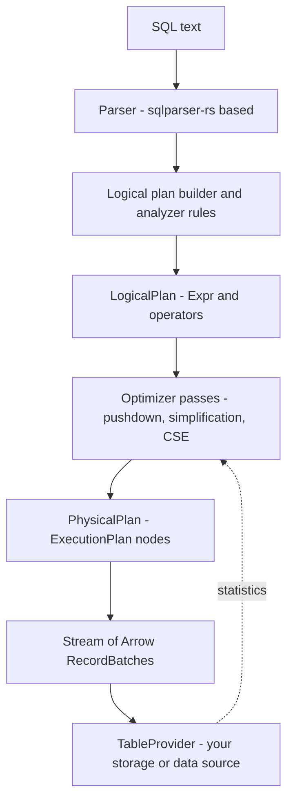
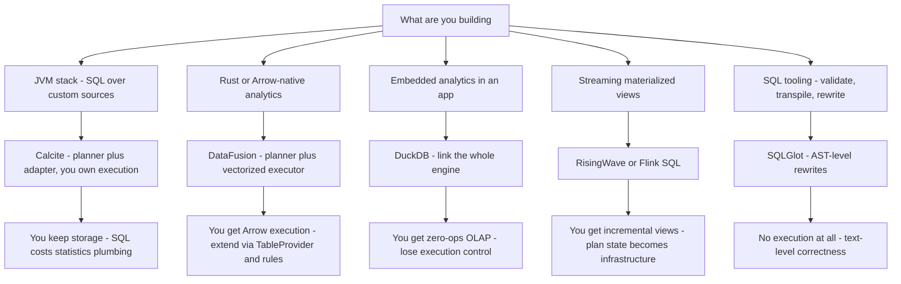

# Build-a-Query-Engine Frameworks: Calcite, DataFusion, and Friends

## Overview

Most new query engines are not written from scratch — they are assembled from planner and execution libraries, with the team's own code reserved for what makes them different (storage, index structures, domain semantics). Apache Calcite supplies parse-plan-optimize to the JVM world (Flink, Hive, Druid); Apache DataFusion does the same for Rust on Arrow; SQLGlot handles dialect translation; Polars and DuckDB can simply be embedded whole. The interview probe behind this page is "how would you add SQL to your storage engine?" — a systems-design question that tests whether you understand the layer boundaries of a query engine: parser, validator, logical plan, optimizer, physical plan, executor. Planner theory (memo, rules, costs) lives in [Cascades Optimizer](./cascades-optimizer.md) and [Volcano Optimizer](./volcano-optimizer.md); this page is about reusing those ideas as libraries.

## The Reuse Spectrum

Building SQL support is a dial, not a binary. At one end you write your own planner; at the other you embed a complete engine and only own the data:

| Option | What it gives you | What it locks you into | Typical adopter |
|---|---|---|---|
| Apache Calcite | SQL parser, validator, RelNode algebra, rule-based + cost-based optimizer, JDBC adapter model | JVM, Java planner API surface, you still write the executor | Flink, Hive, Druid, Beam |
| Apache DataFusion | Rust/Arrow logical + physical planning *and* a working vectorized executor | Rust, Arrow memory model, columnar execution | InfluxDB IOx, Ballista, GlareDB |
| Apache Arrow compute kernels | Columnar in-memory primitives only — no planner | Arrow buffers and ABI | Custom engines that want their own planner |
| DuckDB embedded | A complete OLAP engine (planner + executor + storage) inside your process | DuckDB's SQL dialect, single-writer model | Apps adding analytics without building anything |
| SQLGlot | Parse/transpile/validate SQL across ~20 dialects | Python, no execution at all | Data tooling, migration scripts, validators |

The dividing line is **who owns execution**. Calcite hands you a plan and stops — you implement the executor against your storage. DataFusion hands you a plan *and* runs it (streaming Arrow batches), but you can override any stage. DuckDB stops asking questions and just runs the whole query itself. Choosing wrong is expensive in one direction: teams that embed a full engine for a bespoke workload end up fighting it, and teams that adopt Calcite for a quick SQL surface end up writing an entire executor underneath — which is the real cost of "just use Calcite".

### Who Ships What

The adoption map doubles as a provenance check in interviews — when a system says "SQL", the interesting question is whose planner is underneath:

| System | Borrows | Layer borrowed |
|---|---|---|
| Apache Flink | Calcite | SQL parse, validate, optimize over streaming conventions |
| Apache Hive | Calcite | Cost-based optimization (CBO) on top of its own runtime |
| Apache Druid | Calcite | SQL layer over its scan/aggregation runtime |
| Apache Beam | Calcite | SQL parsing and planning for batch/stream pipelines |
| InfluxDB 3.0 (IOx) | DataFusion | Query planning/execution over its own storage + IOx planner extensions |
| Ballista | DataFusion | Distributed scheduling around DataFusion execution |
| GlareDB, Arroyo, Comet | DataFusion | Whole-engine embedding with custom storage/scheduling/dialects |
| RisingWave | Own (Rust) | Postgres-compatible frontend; shows the build-from-scratch end still exists |

Two patterns in that table: JVM streaming/olap systems standardized on Calcite's planner; the Rust columnar generation standardized on DataFusion + Arrow. RisingWave is the instructive outlier — its frontend is homegrown, which is what it takes when wire compatibility (Postgres protocol) and streaming semantics dominate the requirements.

Read the "Borrows" column as a build-vs-buy ledger: every entry there decided that owning a planner was not its differentiator, and the ones that moved (Hive gaining CBO via Calcite, Spark gaining DataFusion via Comet) show the layer can be swapped late — a retrofit, not a rewrite.

## Apache Calcite

Calcite is the granddaddy of planner reuse: a pure Java library with no storage of its own, structured so every stage is replaceable.

- **RelNode** — the relational algebra tree (`LogicalProject`, `LogicalFilter`, `LogicalJoin`, `LogicalTableScan`). Optimizer rules match and rewrite RelNode trees.
- **RexNode** — row expressions inside operators: comparisons, arithmetic, `RexInputRef` (column reference), `RexCall` (function), `RexLiteral`. Predicate pushdown means physically moving a `RexNode` subtree from one RelNode to another.
- **SqlNode** — the parse/validate AST, deliberately dialect-flavored so a SQL parser can be configured per source.
- **Convention** — the tag that marks which physical world a RelNode belongs to (`EnumerableConvention` for Calcite's own interpreter, `Bindable`, or your custom convention), and the mechanism that forces the optimizer to plan *into* your executor's operators.

### Planner Phases: Heuristic vs Cost-Based

Calcite ships two planners, and the difference is a classic interview beat. The **HepPlanner** is heuristic: apply rules in a fixed sequence, fire-and-rewrite, no cost model — fast and predictable, good for canonical rewrites (constant folding, predicate pushdown). The **VolcanoPlanner** is the cost-based, Cascades-style search: it maintains equivalence groups, applies rules to enumerate alternatives, and picks the cheapest plan under your `RelOptCost` implementation. Production systems typically chain both — a hep pass to normalize, then Volcano to optimize — which mirrors the multi-phase search described in [Cascades Optimizer](./cascades-optimizer.md). The cost model is pluggable, which is also a warning: if you feed Volcano garbage statistics from your storage engine, it will confidently pick a garbage plan; cardinality estimation quality dominates optimizer quality (see [Cardinality Estimation](./cardinality-estimation.md)).

### The Rule System, Concretely

A Calcite rule declares a match pattern and a rewrite. The pushdown-through-project rule is the canonical example:

```java
// Match:  Filter( Project(x) , predicate p )
// Rewrite: Project( Filter(x, p substituted through the project) )
public class FilterProjectTransposeRule
    extends RelOptRule {
  // operand: matches Filter over Project over any input
  public void onMatch(RelOptRuleCall call) {
    LogicalFilter filter = call.rel(0);
    LogicalProject project = call.rel(1);
    // rewrite each RexInputRef in the predicate
    // to point at the project's *input* columns
    RexNode pushed = project.getMapping()
        .apply(filter.getCondition());
    call.transformTo(
      LogicalProject.create(
        LogicalFilter.create(project.getInput(), pushed),
        project.getProjects()));
  }
}
```

Three things to notice, because they generalize to every rule engine: the rule fires *locally* on a tree pattern; correctness depends on rewriting column references (`RexInputRef` offsets shift as operators move); and rules must preserve semantics exactly (filter over project composes freely only when the project is row-preserving). Calcite's rule set is a few hundred such rewrites — reading five of them teaches the genre faster than any tutorial.

### The Adapter Model and Parser Reuse

Calcite's adapter framework is why non-SQL systems adopt it: implement `Schema` + `Table` (optionally `TranslatableTable` for pushdown) and Calcite gives you a SQL surface over anything — CSV files, Elasticsearch, Kafka topics. The engine declares what it can do (filter pushdown via `FilterableTable`, joins only at the top, aggregates only locally) and the planner plans around those limits; Flink uses exactly this to plan SQL over streams, Hive for its CBO, and Druid for its SQL layer. The parser is reusable too: the JavaCC template is configurable with operator precedence, custom statements, and reserved words, so systems expose their dialect extensions without forking the grammar — one of the least glamorous and most leveraged parts of the library.

## Apache DataFusion

DataFusion is the modern Rust counterpart: an extensible query engine built on Apache Arrow, explicitly designed to be forked-as-a-library. Where Calcite ends at the plan, DataFusion continues through execution.



The architecture points that matter for interviews:

- **Logical/physical split.** `LogicalPlan` nodes carry `Expr` trees; analyzer rules (type coercion, common-subexpression elimination) normalize them. Optimizer passes — predicate/projection pushdown, limit pushdown, join reorder — rewrite the logical tree. Then physical planning binds each node to an `ExecutionPlan` implementation that produces partitioned streams of Arrow `RecordBatch`es. The batch/columnar execution model is the same vectorized story as [Advanced Execution Engines](./execution-engines.md), with Arrow as the fixed memory contract (see [Columnar Formats](./columnar-formats.md)).
- **Extension points are the product.** Implement `TableProvider` to expose any data source (Parquet dir, custom KV store, REST endpoint); register `ScalarUDF`/`AggregateUDF`; add `OptimizerRule`s; or replace the planner entirely for custom conventions. Most adopters are "DataFusion plus": InfluxDB 3.0 (IOx) runs its storage-optimized planner around DataFusion; Ballista extends it with distributed scheduling; GlareDB, Arroyo, and Comet (a Spark accelerator) each override different layers — evidence that the seams are real, not aspirational.
- **Cost model is lighter than Calcite's.** Join reordering leans on statistics plugins rather than a full Cascades memo; for workloads dominated by scans and filters (the common case for its adopters) that is a reasonable trade, but it is the first thing you extend when building an OLAP engine on top.

A custom optimizer rule shows the extension surface concretely (Rust, simplified):

```rust
// Rewrite: filter on a partitioned table's date column
//          into partition pruning metadata on the scan.
impl OptimizerRule for PrunePartitionsRule {
    fn try_optimize(
        &self, plan: &LogicalPlan,
        config: &dyn OptimizerConfig,
    ) -> Option<Result<LogicalPlan>> {
        let filter = plan.as_filter()?;
        let scan   = filter.input.as_table_scan()?;
        // extract conjuncts on the partition column,
        // move them into TableScan.filters / projection
        let pruned = scan.with_pruned_partitions(preds);
        Some(Ok(rebuild_plan(filter, pruned)))
    }
}
```

Same shape as the Calcite rule above — match a local pattern, rewrite, return the new plan — which is the point: rule engines differ in API, not in concept.

### Arrow Compute: The Layer Below

DataFusion sits on **Apache Arrow compute kernels** — vectorized, type-specialized functions over Arrow buffers (`add`, `eq`, `hash`, `take`, sort, aggregations). Some teams stop one layer down and use Arrow kernels directly, writing their own planner but borrowing the execution primitives; that is the row in the reuse-spectrum table with "no planner". The layering is: Arrow defines the in-memory columnar format and ABI; kernels are the SIMD-friendly functions over it; DataFusion adds plans, rules, and scheduling on top. Knowing which layer a bug or bottleneck lives in (format, kernel, planner) is the debugging skill the Arrow ecosystem rewards.

## SQL Boundary Tooling: SQLGlot and sqlparse

Between "regex over SQL strings" (fragile, dialect-blind) and "adopt a planner" (a project) sits SQLGlot: a pure-Python SQL parser, transpiler, and optimizer covering ~20 dialects. Its niche is precise SQL manipulation — transpile a BigQuery query to Snowflake, validate user-submitted SQL before executing it, rewrite table names or inject predicates (row-level security) at the AST level, or diff two queries semantically. A dialect-aware rewriter beats regex exactly when the rewrite depends on grammar context: a regex that renames a CTE will happily rename a string literal containing the same word; SQLGlot's AST cannot make that mistake. `sqlparse` is the lighter sibling — tokenizing/formatting only, no validation, no dialect semantics — appropriate for pretty-printing, wrong for rewriting. The rule of thumb: if you are transforming SQL you do not fully control, use a real parser; SQLGlot is also the most readable codebase to learn what a parser actually does.

## Polars: Lazy Frames and Streaming

Polars is the DataFrame library that applies query-optimizer thinking to pandas-shaped workloads. Eager pandas executes every operation immediately, materializing an intermediate DataFrame per step — memory blows up on wide pipelines, and nothing knows the whole plan, so no cross-step optimization happens. Polars' `LazyFrame` API instead records the whole pipeline as a logical plan and optimizes it before touching data: predicate and projection pushdown mean a `filter` on column A followed by a `select` of columns B,C never reads column A or the filtered rows; the optimizer reorders and fuses operations the way a database engine would. Execution runs on Rust over Arrow-compatible columnar chunks with a streaming engine, so pipelines are multi-threaded by default and scale past RAM where pandas would swap. The takeaway for query-engine interviews is architectural, not API: Polars demonstrates that "DataFrame library" and "query engine" are the same object once evaluation becomes lazy — the optimizer is the product. Reference docs: [Polars user guide](https://docs.pola.rs/).

## RisingWave: Streaming SQL

RisingWave closes the loop from the other side: SQL over *streams*, planned once and maintained incrementally forever. You declare `CREATE MATERIALIZED VIEW` over a source (Kafka, CDC from Postgres); the frontend plans the query into a streaming dataflow graph (an MPP topology of operators), and each operator incrementally applies incoming deltas to its state — insert one row and only affected operators recompute, rather than re-running the whole view query. This is incremental view maintenance (theory in [Incremental View Maintenance](./incremental-view-maintenance.md)) fused with stream semantics from [Temporal, Streaming & Time-Series](./temporal-streaming.md): event-time windows, watermarks, and upserts become plan operators. The planner lesson generalizes — the difference between a batch engine and a streaming engine is largely *when* the plan runs (once per query vs continuously) and what state operators must own between invocations, and RisingWave shows the SQL stack (parse, plan, optimize) surviving that shift intact.

### State Management Under a Streaming Plan

Continuous plans change the storage contract: every operator with state (window aggregates, joins, deduplication) needs durable, checkpointable state that survives recovery, because the plan runs 24/7 and cannot recompute from scratch on restart. RisingWave puts operator state in **Hummock**, its shared-nothing LSM storage layer, with barrier-based checkpointing providing consistency — the same "everything is an LSM" decision as RocksDB-class engines, now serving operator state instead of tables (see [LSM Compaction](../../storage/lsm-compaction.md)). The interview-worthy observation is the shift of failure semantics: a batch plan that crashes is simply re-run; a streaming plan must recover *to a point in time* — which is what turns state stores and checkpoint barriers into first-class planner-adjacent infrastructure.

## Worked Example: Adding SQL to a Toy KV Store with Calcite

The interview favorite: "your team has a KV store; give it a SQL API." With Calcite the skeleton is small — conceptual pseudocode:

```java
// 1. Wrap the KV store as a Calcite schema
Schema schema = new AbstractSchema() {
  protected Map<String, Table> getTableMap() {
    return Map.of("kv", new KvTable(kvStore));   // implements ScannableTable
  }
};
// 2. KvTable.getRowType() declares columns;
//    scan() yields rows; Calcite handles the rest.
// 3. Parse and validate SQL into a RelNode plan:
RelNode plan = planner.parse("SELECT v FROM kv WHERE k = 'a'")
                      .validate().toRel();
// 4. Optimize under EnumerableConvention:
RelNode best = planner.transform(EnumerableConvention, rules, plan);
// 5. Either run the Enumerable interpreter over scan() rows,
//    or register a custom convention whose rules bind
//    LogicalFilter(k = ?) directly to kvStore.get(k).
```

Steps 1-3 are an afternoon; step 5 is the whole engineering project. The naive path (scan everything, let the Enumerable interpreter filter) is embarrassingly slow; the real work is teaching the planner your storage's access paths — turn `WHERE k = 'a'` into a point `get`, push range predicates into iterator bounds, expose statistics so the cost model can choose. That mapping — *which logical operators your storage can execute natively* — is the honest answer to "how do you add SQL to an engine."

The same skeleton maps to DataFusion with different nouns: `TableProvider` instead of `Schema`/`Table`, `Expr` predicates arriving in `supports_filters_pushdown`, and an `ExecutionPlan` streaming Arrow batches instead of an Enumerable interpreter. Teams evaluating the two should prototype the same toy on both and judge by two questions: how far did a point-lookup push down without custom code, and how much of the executor did we end up replacing anyway. Those two answers, not benchmarks of someone else's workload, decide the framework.

## Comparison Table

| Dimension | Calcite | DataFusion | Calcite via Flink | DuckDB embedded |
|---|---|---|---|---|
| Language | Java (JVM) | Rust (C FFI possible) | Java host, any Flink target | C/C++ core, many bindings |
| What you get | Parser, validator, planner, optimizer — **no executor** | Planner **and** vectorized executor on Arrow | Full streaming runtime with Calcite planning | Whole OLAP engine incl. storage |
| Execution model | Yours to build (iterators, vectorized, interpreted — anything) | Push-based streams of Arrow batches | Dataflow graph over keyed streams | Vectorized, in-process, single-file storage |
| Extension story | Rules, conventions, adapters, parser templates | TableProvider, UDFs, optimizer rules, planner swap | DataStream/SQL API surface | Extensions (httpfs, icu), UDFs, replacement scans |
| Maturity signal | Flink/Hive/Druid/Beam since ~2014 | InfluxDB 3, Ballista, Comet | Decade of Flink SQL in production | Widespread embedded analytics adoption |
| Best when | JVM stack, non-SQL sources, you own execution | Rust/columnar, Parquet/Arrow, engine-as-library | Streaming jobs with SQL UX | Zero-ops analytics inside an application |

## Choosing Guidance



- **JVM shop, custom storage or weird sources** → Calcite. You keep your executor and gain a production-grade parser/planner; budget for statistics plumbing.
- **Rust or columnar-first, Parquet/Arrow data** → DataFusion. You get vectorized execution immediately and can replace any layer later.
- **Embedded analytics in an app, zero ops** → DuckDB. Do not build an engine; link one (see [DuckDB Internals](./duckdb-internals.md)).
- **Streaming materialized views** → RisingWave (database) or Flink SQL (compute framework, Calcite underneath).
- **Dialect translation, validation, SQL-in-SQL-out tooling** → SQLGlot; never regex.
- **DataFrame-shaped pipelines in Python** → Polars lazy frames; you inherit an optimizer for free.

The meta-rule: pick the layer you actually need to own. If storage is your product, borrow a planner. If analytics is your product, borrow an engine. Building both is a multi-year commitment that only pays off when your execution model is itself the differentiator.

### Planner Pitfalls When Hosting Someone Else's Optimizer

Recurring failure modes teams hit after adopting a planner framework — worth listing because each maps to an interview follow-up:

- **Garbage statistics, confident plans.** A cost-based planner faithfully optimizes whatever cardinalities you report; under-reported filter selectivity silently produces nested-loop joins over millions of rows. Instrument plan output (`EXPLAIN`) from day one.
- **Rules that don't terminate.** Two rules that undo each other (pushdown vs pullup) can loop; rule engines rely on plan-hash memoization — verify equivalence, not just idempotence.
- **Partial pushdown, silent semantics change.** Pushing a predicate below a join or into a storage layer that treats NULLs or collations differently changes results. Every pushdown rule needs a test corpus with nulls, empty sets, and collation variants.
- **Dialect drift at the parser.** Custom parser templates let you accept your dialect, but error messages, implicit casts, and function signatures must stay consistent — the place users feel "almost SQL" most sharply.

## Interview Questions

1. **You have a storage engine and want a SQL interface. Where do you start, and what is the hard part?** Wrap storage as a schema/table provider in a planner framework (Calcite on JVM, DataFusion in Rust), get the naive path working (scan + filter at the executor), then make it fast by declaring native access paths: bind equality/range predicates to point gets and iterator bounds, expose row counts and histograms so the cost model chooses plans, and push aggregates or joins into storage only where it can execute them. The hard part is not the SQL surface — it is the statistics and pushdown contract, because a planner without trustworthy cardinalities optimizes fiction.
2. **Why does Flink embed Calcite instead of writing its own SQL planner?** Calcite's adapter model lets Flink declare stream-specific operators and conventions while reusing a hardened parser, validator, type system, and rule engine — SQL semantics are subtle (null handling, implicit casts, subquery decorrelation) and getting them right is years of edge cases. Flink's value is its streaming runtime (watermarks, state, exactly-once), not SQL grammar. Embedding buys the boring 80% and concentrates effort on the 20% that differentiates — the same reasoning behind DataFusion adoption in Rust systems.
3. **Contrast heuristic and cost-based optimization with concrete examples.** Heuristic (Calcite's HepPlanner): fixed rule sequence, no costs — constant folding, `Filter` merging, deterministic pushdowns; predictable and cheap, but cannot choose between a scan and an index without cost numbers. Cost-based (VolcanoPlanner): enumerate plan alternatives under a cost model and pick the minimum — required for join ordering and access-path selection. Production pipelines use both: normalize heuristically, optimize with costs, because heuristic rules shrink the search space and cost search exploits it.
4. **What does DataFusion's TableProvider abstraction let you do, and what are its limits?** It lets any data source join the engine: you implement schema, projection/pushdown hooks (`supports_filter_pushdown`), and return an ExecutionPlan that streams Arrow batches — so Parquet, a KV store, or an API can all appear as tables and participate in plans. Limits: the executor's contract is columnar batches, so sources with expensive random-access row semantics fit awkwardly; the default cost model is lighter than a full Cascades memo, so complex multi-join reorderings may need custom optimizer rules or statistics plugins.
5. **When would a dialect-aware rewriter like SQLGlot beat both regex and a full planner?** When the task is *transformation or validation of SQL text you do not control* — transpiling between dialects, injecting row-security predicates, renaming tables across a migration. Regex fails on grammar context (string literals, comments, nested parens); a full planner is overkill because no execution is needed — you want parse → AST edit → emit, with dialect-specific emission rules. SQLGlot occupies exactly that gap, and its pure-Python source makes it the best readable example of what parsers do.
6. **Your data pipeline in pandas OOMs at 32 GB. Why is Polars lazy a structural fix, not just "faster pandas"?** Pandas executes eagerly, so each step materializes an intermediate frame and nothing sees the whole computation — no pushdown, no fusion, peak memory is the sum of intermediates. Polars LazyFrame records the full pipeline as a plan, then optimizes: predicates push to scan time, projections drop unused columns before materialization, and operations fuse into streaming stages over Arrow chunks, so peak memory tracks the working set rather than the expression count. The lesson generalizes: laziness is not a speed feature, it is what makes an optimizer possible at all.

## Key Takeaways

- Query engines decompose into parser → validator → logical plan → optimizer → physical plan → executor; frameworks differ in how many of those stages they hand you.
- Calcite gives the JVM a planner without an executor: RelNode/RexNode algebra, HepPlanner (heuristic) and VolcanoPlanner (cost-based), rules, conventions, and an adapter model that made it the SQL layer for Flink, Hive, and Druid.
- DataFusion gives Rust a planner *and* vectorized Arrow execution, with extension seams (TableProvider, UDFs, optimizer rules) that real engines like InfluxDB IOx and Ballista override.
- The real cost of "just use Calcite" is writing an executor and statistics plumbing; the real cost of embedding DuckDB is giving up control of execution — choose the layer you need to own.
- Rule-based rewriting is pattern-match-and-rewrite with column-reference remapping; reading a handful of rules (filter pushdown, projection merge) teaches the entire genre.
- SQLGlot/sqlparse occupy the text-tooling layer: dialect-aware AST rewrites where regex is unsafe and a planner is overkill.
- Polars shows laziness is what makes DataFrame optimization possible; RisingWave shows the same SQL stack running plans continuously over streams via incremental view maintenance.

## References

- [Apache Calcite documentation](https://calcite.apache.org/docs/) — algebra, planner architecture, adapter model
- [Calcite javadoc aggregate](https://calcite.apache.org/javadocAggregate/) — RelNode, RexNode, rule API details
- [github.com/apache/calcite](https://github.com/apache/calcite) — rule implementations, parser templates
- [Apache DataFusion documentation](https://datafusion.apache.org/) — architecture, extension points, optimizer passes
- [DataFusion Rust docs](https://docs.rs/datafusion) — crate-level API for TableProvider, UDFs, plans
- [github.com/apache/datafusion](https://github.com/apache/datafusion) — optimizer pass sources, Ballista integration
- [Polars documentation](https://docs.pola.rs/) — lazy API and streaming engine
- [Polars Python API reference](https://docs.pola.rs/api/python/stable/reference/) — LazyFrame semantics
- [github.com/pola-rs/polars](https://github.com/pola-rs/polars) — Rust optimizer and streaming executor
- [RisingWave documentation](https://docs.risingwave.com/) — streaming materialized views, architecture
- [github.com/risingwavelabs/risingwave](https://github.com/risingwavelabs/risingwave) — frontend planner and Hummock storage
- [SQLGlot on GitHub](https://github.com/tobymao/sqlglot) — dialects, optimizer module
- [SQLGlot documentation site](https://sqlglot.com/) — transpilation and rewrite examples
- B. Begoli, J. Camacho-Rodríguez, J. Hyde, M. Mior, D. Lemire, "Apache Calcite: A Foundational Framework for Optimized Query Processing Over Heterogeneous Data Sources" (SIGMOD 2018), [arXiv:1806.00415](https://arxiv.org/abs/1806.00415)

## Cross-References

- [Advanced Execution Engines](./execution-engines.md) — the executor designs DataFusion's vectorized model descends from
- [Cascades Optimizer](./cascades-optimizer.md) — the memo/rule framework Calcite's VolcanoPlanner implements
- [Volcano Optimizer](./volcano-optimizer.md) — cost-based search and the iterator model, the theory under both planners
- [Columnar Formats](./columnar-formats.md) — Arrow/Parquet, the data contract DataFusion and Polars execute on
- [DuckDB Internals](./duckdb-internals.md) — the embed-the-whole-engine end of the reuse spectrum
- [Incremental View Maintenance](./incremental-view-maintenance.md) — the mechanism RisingWave builds its streaming SQL on
- [Temporal, Streaming & Time-Series](./temporal-streaming.md) — stream semantics (windows, watermarks) behind streaming planners
- [Cardinality Estimation](./cardinality-estimation.md) — the statistics feeding any cost-based planner you adopt
