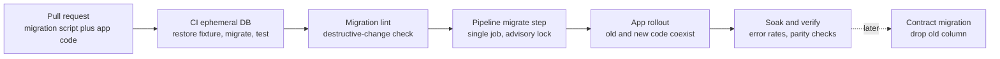
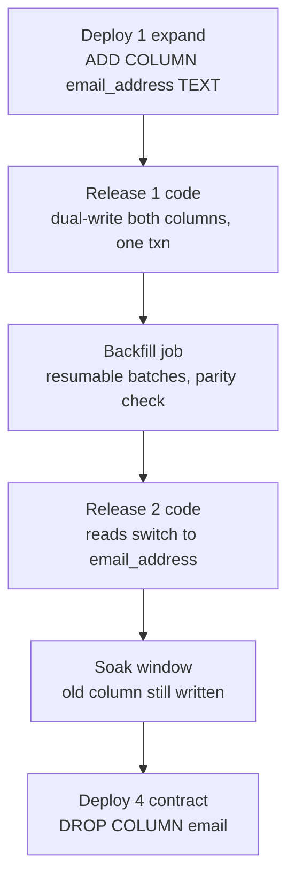
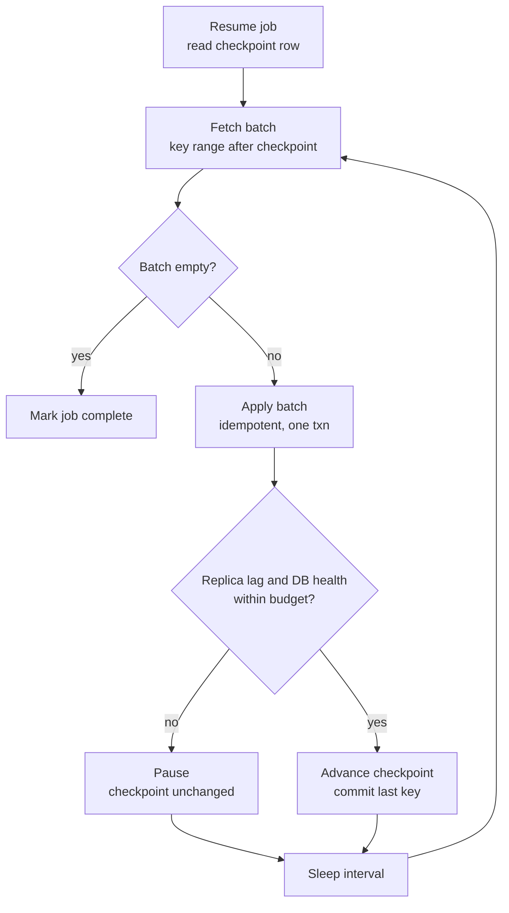

# Schema Migration Tooling: Versioned Migrations and Expand–Contract

## Overview

Schema changes are deployments. They ship through review, CI, and a pipeline like any code change, and they must land in lockstep with the application versions that depend on them — yet they mutate shared state used by every running replica and every environment. This page covers the *workflow* layer of schema evolution: how migrations are authored (versioned scripts vs declarative desired state), the tools that implement each model (Flyway, Liquibase, sqitch, Atlas, Alembic, Django/Rails), where migrations execute (a dedicated pipeline step — never app startup), and how the expand–contract pattern makes even destructive changes safe under rolling deploys. The low-level mechanics of altering huge tables under load — pt-online-schema-change, gh-ost, native online DDL — are owned by [Online Schema Change](./online-schema-change.md) and treated here only as building blocks. Engine-level constraints on which DDL is metadata-only come from [Database Storage Engines](../internals/engines.md), and the index-maintenance cost every migration pays is in [Indexing Overview](../indexing/README.md).

## Schema Changes Are Deploys

A production `ALTER TABLE` applied from a console session is indistinguishable from any other unreviewed production change: no code review, no test run, no record of *why* the column exists, no way to reproduce the environment. At team scale this fails four ways. **Audit**: when an incident traces back to a schema change, you need who, when, and why — a migration history table plus VCS gives you that; shell history does not. **Repeatability**: CI, staging, a new hire's dev box, and the disaster-recovery region must all converge to the same schema; only a deterministic, ordered set of scripts guarantees it. **Drift**: a hotfix column added by hand on Friday exists only in prod — every environment, every schema dump, and every ORM model is now subtly wrong, and the next migration written against the wrong baseline fails in a mysterious place. **Coupling**: the application is a function of the schema — version N of the code assumes version M of the schema, and both roll out gradually (rolling deploys, canaries), so for a window *two versions of code coexist against two versions of schema*. Managing that window deliberately is the core discipline of this page; everything else — tools, runners, testing — exists to make it routine.

This is the database extension of the [Twelve-Factor App](../../backend/twelve-factor-app.md) build/release/run split: the migration set is part of the *release*, applied exactly once per release in a separate step — not mixed into the run phase as per-instance bootstrap work.

## Versioned Migrations vs Declarative State

**Versioned (migration-based) tooling** — Flyway, Liquibase, sqitch, Alembic — applies ordered, immutable scripts: `V1`, `V2`, `V3`, ... The tool records applied versions in a history table and refuses to run out of order or re-run a modified file (checksums). Strengths: exact repeatability (every environment executes the same byte-for-byte DDL), reviewability (a PR shows the precise SQL that will hit prod), and universality (anything the database can do, a script can express — including data migrations). Weaknesses: history is cumulative — a fresh environment replays thousands of migrations (mitigated by baselining/squashing), and nothing checks that the *accumulated result* matches what anyone believes the schema is; manual DDL drift stays invisible until a migration collides with it.

**Declarative (state-based) tooling** — Atlas's HCL mode, and the diffing half of every ORM — describes the *desired* schema and computes the DDL to move the current schema to it. Strengths: the desired state is the single source of truth (no migration-number merge conflicts across long-lived branches), and drift detection is intrinsic — re-diff prod against desired state and every hand-made change falls out. Weaknesses: the generated DDL must still be reviewed, because a diff cannot know the safe *data-preserving* path — a column rename diffs as "drop column + add column" (data loss!) unless intent is annotated, and a type change diffs as an unsafe implicit cast. Declarative diffing answers "what changed," never "is this change safe."

The production pattern is hybrid: author declaratively, emit versioned migrations. Atlas generates versioned migration files from the desired state and lints them; Alembic's `--autogenerate` drafts a migration from a model-vs-DB diff for human correction. You get declarative ergonomics with versioned auditability.

## The Tool Landscape

| Tool | Authoring model | Distinguishing mechanics | Rollback story |
|---|---|---|---|
| Flyway | Versioned SQL: `V<version>__desc.sql`, repeatable `R__name.sql` | history table with per-file checksums; editing an applied file fails hard; `locations` define the search path | no generated down; fix forward with a new migration |
| Liquibase | Changelog (XML/YAML/JSON/SQL) of changesets | contexts + labels gate which changesets run in which environment; preconditions verify state before applying | auto-rollback for some changeset types; authored `rollback` blocks otherwise |
| sqitch | Plain SQL scripts + plan file | deploy/verify/revert script triples ordered by a dependency graph, not sequence numbers; VCS-native, no framework | authored `revert` scripts; `verify` catches failed applies |
| Atlas | Declarative HCL/SQL desired state; versioned authoring | `migrate diff` derives migration files from the desired state; `migrate lint` flags destructive, data-losing changes against a dev database | forward-first; lint blocks dangerous diffs pre-merge |
| Alembic | Python scripts bound to SQLAlchemy metadata | `revision --autogenerate` drafts a migration from a model-vs-DB diff; offline mode emits SQL for DBA review | authored `downgrade()` — same honesty caveats as all down-migrations |
| Django / Rails | ORM model-syncing (`makemigrations`, `rails g migration`) | migrations are code linked to model state; `schema.rb`/`structure.sql` snapshots the result | Rails `reversible`/`down`; Django authored backward operations |

Choosing among them is less about features than about *who owns the schema*. If the ORM models are the source of truth (Django, Rails, SQLAlchemy), model-syncing tools minimize drift between code and schema. If DBAs own it — regulated environments, databases shared across services — script-first tools like Flyway and sqitch keep SQL in review. If you want state-as-truth with lint enforcement, Atlas. One caution applies to every autogenerating tool: they diff only what the tool's inspector can see. Server defaults, triggers, partial indexes, and column collations are commonly invisible, so an empty autogenerate diff does not prove prod matches your models (see Interview Questions).

## Where Migrations Run

Migrating inside application startup is the classic anti-pattern. With N replicas, all N processes race to apply the same migration — the tool's lock serializes them, but every pod still waits on the migration before serving, so a slow migration turns into a liveness-probe kill loop: pods die mid-migration, restart, retry — a startup storm that can outlast the migration itself. Worse, startup migration couples two failure domains: a failed migration blocks deploys of *unrelated* code, and rolling back the app re-runs the old image's migration logic against the new schema. It also violates the twelve-factor one-step release rule — the release step is not a per-instance bootstrap concern.

The production options, in rough order of preference:

- **Dedicated pipeline step**: the deploy pipeline runs migrations as its own gated job — its own logs, its own retry policy, its own blast radius — before the app rollout begins. Simplest, and sufficient for most teams.
- **Kubernetes Job, or init container with a lease**: a singleton Job (or an init container guarded by a Postgres advisory lock / lease row) applies migrations exactly once per release. An init container *without* a lock is just the startup anti-pattern with extra steps — every pod runs one, and N init containers means N migration attempts.
- **CI job**: migrations are validated — and sometimes applied to pre-prod environments — on every pull request, against a database restored from a fixture or snapshot.

Ordering relative to the app rollout is the second half of the decision: **migrate-before-deploy** is required for expand steps (the new column must exist before any pod writes it), while **contract** steps must run *after* the rollout fully completes and soaks — no pod may still be reading the dropped column. The compatibility matrix section below formalizes this.



## Expand–Contract: The Parallel-Change Pattern

Expand–contract (parallel change) is the discipline that makes a *destructive* schema change safe under rolling deploys: instead of one breaking migration, ship four — add (expand), populate, switch, remove (contract) — such that **every intermediate state runs both the old and the new code correctly**. The canonical example: rename `users.email` to `users.email_address` with zero downtime.

**Deploy 1 — expand.** Add the new column, nullable. The code in this release dual-writes: every write to `email` also writes `email_address`, in the same transaction. A dual-write outside the transaction is drift waiting to happen.

```sql
-- V42__expand_email_address.sql
ALTER TABLE users ADD COLUMN email_address TEXT;
```

```sql
-- application write path, release 1
UPDATE users
SET email = $1,
    email_address = $1
WHERE id = $2;
```

**Deploy 2 — backfill.** A resumable batch job (next section) copies historical rows: set `email_address = email` where it is still `NULL`, batched by primary key. When the backfill completes and parity is verified — row counts and checksums comparing the two columns — add the indexes and constraints the new column needs, built concurrently: a plain `CREATE UNIQUE INDEX` on a hot table is exactly the blocking operation [Online Schema Change](./online-schema-change.md) exists to avoid.

**Deploy 3 — read cutover.** This release flips every *read* of `email` to `email_address`. Writes keep dual-writing — the old column must stay current, because it is the rollback path. Soak this state. The soak window is where subtleties surface: trailing-whitespace collation differences, silent truncation, a forgotten client still writing the old column only.

**Deploy 4 — contract.** Only after the confidence window: drop the old column. After this, any old code reading `email` fails — which is precisely why contract is gated on rollout completion *and* soak time, and why a rollback after contract means restoring from backup, not redeploying.

```sql
-- V47__contract_email.sql
ALTER TABLE users DROP COLUMN email;
```



| Step | What it does | What breaks if you skip it |
|---|---|---|
| 1. Expand + dual-write | New column exists; all new writes fill both columns | A bare rename (`ALTER ... RENAME`) breaks every old replica and in-flight request instantly; skipping dual-write means rows written during the backfill have a stale or NULL new column |
| 2. Backfill | Historical rows get the new value | Read cutover sees NULLs — historical emails silently vanish from every query |
| 3. Read cutover + soak | Reads verified on the new column | Dropping the old column breaks code paths nobody audited; parity bugs (collation, truncation) surface in prod instead of the soak window |
| 4. Contract | Old column dropped | Keeping it forever doubles write cost and leaves ambiguous truth — but it must be last, gated on rollout *and* soak |

### Recipe: Split a Column

`users.full_name` → `first_name` / `last_name` is the same four-step shape with one twist: the transformation is *lossy and ambiguous* ("Mary Jane Watson", "van der Berg"). Expand adds both columns and dual-writes all three; the backfill parses `full_name` (Postgres: `split_part(full_name, ' ', 1)` and friends); the contract step must wait for a *data-quality* review of the parse, not just a parity checksum — a checksum will happily prove that you consistently mangled every name. Where parsing is genuinely ambiguous, the recipe changes: keep `full_name` as the authoritative read column, treat the split columns as derived data, and apply the validation playbook from [Data Quality](../../data-engineering/data-quality.md) before any cutover.

### Recipe: NOT NULL Without Downtime

A naive `ALTER TABLE orders ALTER COLUMN customer_id SET NOT NULL` takes an `ACCESS EXCLUSIVE` lock and scans the whole table — and while it waits for one long-running transaction, every subsequent query on `orders` queues behind it: the metadata-lock stall described in [Online Schema Change](./online-schema-change.md). PostgreSQL's staged alternative:

```sql
-- 1. Expand: attach the check NOT VALID — brief lock only.
--    Enforced for new rows immediately; existing rows unchecked.
ALTER TABLE orders
  ADD CONSTRAINT orders_customer_id_not_null
  CHECK (customer_id IS NOT NULL) NOT VALID;

-- 2. Validate: full scan under SHARE UPDATE EXCLUSIVE —
--    reads and writes continue during the scan.
ALTER TABLE orders
  VALIDATE CONSTRAINT orders_customer_id_not_null;

-- 3. Contract: PG12+ proves no NULLs exist via the validated
--    check and skips its own table scan; only a brief metadata
--    lock remains.
ALTER TABLE orders ALTER COLUMN customer_id SET NOT NULL;

-- 4. Remove the scaffolding.
ALTER TABLE orders DROP CONSTRAINT orders_customer_id_not_null;
```

`SET NOT NULL` and the `CHECK` constraint are not interchangeable: the check is a real constraint you can attach and validate in stages, while `SET NOT NULL` is a single all-or-nothing catalog change that historically required the scan. MySQL has no `NOT VALID`, so the equivalent goes through a table rebuild — gh-ost or `ALGORITHM=INPLACE` — subject to the engine constraints in [Database Storage Engines](../internals/engines.md).

## Backfills as Online Jobs

A backfill is a migration of *data*, not schema, and it belongs in a job — not in a migration script that the tool runs inside one transaction. The canonical loop: pick a batch by primary-key range, apply it, sleep, repeat. Three properties make it production-safe. **Checkpoint/resume**: a state table records the last processed key; the worker crashes at batch 40,000 of 60,000 and resumes exactly there, and the job can be paused for traffic peaks. **Idempotency**: every batch is safe to re-run — a `WHERE email_address IS NULL` guard (or upsert semantics) makes a double-applied batch a no-op, which is what makes resume-after-crash trustworthy. **Lag-awareness**: the worker pauses when replica lag or database health crosses a budget, exactly like gh-ost's throttle — a backfill that saturates the primary's WAL output is a self-inflicted read-replica outage.

```sql
-- checkpoint table
CREATE TABLE backfill_state (
  job_name   TEXT PRIMARY KEY,
  last_id    BIGINT NOT NULL,
  updated_at TIMESTAMPTZ NOT NULL DEFAULT now()
);

-- one batch (idempotent; re-running is a no-op)
UPDATE users
SET email_address = email
WHERE id > $1 AND id <= $1 + 10000
  AND email_address IS NULL;
```

The batching pitfalls are all versions of "the batch was not small enough." A single monolithic `UPDATE` is one long transaction: it holds row locks for hours, streams a WAL spike to replicas all at once, and blocks vacuum — and long transactions are the same metadata-lock hazard the ALTER sections described. Massive updates rewrite index entries for every touched row, bloating indexes that then need maintenance (see [Indexing Overview](../indexing/README.md)). And updating *hot rows* — top accounts, current-day partitions — contends directly with foreground traffic; batching by key with a sleep between batches gives hot ranges breathing room, and scheduling the job off-peak finishes it.



## Deploy-Ordering Compatibility Matrix

Every step of a migration cycle must be safe in **both directions**: migrations run *before* the code rollout (so new schema meets old code), and a rolled-back deploy means old code meets new schema. If any cell of that matrix breaks, the deployment ordering you assumed does not hold during the incident.

| Combination | When it happens | Requirement |
|---|---|---|
| New schema + old code | Expand window; also any app rollback after migrate | Old code must ignore added columns and must not be the only writer of anything new — dual-write keeps the old column live as the rollback path |
| Old schema + new code | Code deploy precedes or outruns the migrate step; migrate failed mid-rollout | New code must degrade gracefully: schema-dependent paths gated behind a flag whose value flips once the migrate step succeeds |
| New schema + new code | After full rollout and soak | Contract steps only; the confidence window is what the whole cycle was spent earning |

Two rules keep the matrix tractable. **One change per migration**: a migration that renames a column, changes its type, and adds an index in one transaction cannot be decomposed into compatible windows — if the third statement fails, you are in an undocumented intermediate state that neither old nor new code was tested against; give each change its own expand–contract cycle. (Combining statements into one efficient `ALTER` for engine reasons is a different concern — see [Online Schema Change](./online-schema-change.md) — and does not change the compatibility story.) **Schema-gated feature flags**: the flag enabling code that reads a new column is flipped by the pipeline *after* the migrate step succeeds, or derived from the schema itself (probe for the column at boot). That makes "old schema + new code" a tested, supported state instead of an outage. Flag hygiene, canaries, and kill switches are the [Progressive Delivery](../../backend/patterns/progressive-delivery.md) toolkit.

## Testing Migrations

Migrations get the least testing of any production change and deserve the most, because by definition they execute without a human watching. The core loop runs in CI on every migration PR:

1. **Restore a production snapshot** — anonymized, or at minimum prod-shaped in row counts — into a throwaway database: [Testcontainers](../../testing/testcontainers.md) for small fixtures, snapshot restore for fidelity. Migration bugs are data-dependent; they do not reproduce on 50 seed rows.
2. **Run the full migration chain from zero** to head. This is the only test of what a brand-new environment (or a DR region) will actually execute.
3. **Diff the resulting schema** against the expected state: an ORM inspector dump, `pg_dump --schema-only`, or Atlas's diff against the declared desired state. The diff catches the silent class of bug — a migration that *applies cleanly* but leaves the wrong nullability, default, or missing index.
4. **Contract-test the data layer against the migrated schema**: run the persistence layer's suite in both compatibility-matrix combinations — old code against new schema, new code against new schema.

**Speed budgets** are part of testing. Measure migration wall-clock on prod-sized data and enforce a lock-window budget in CI: a migration that runs in 3 seconds on 10k CI rows can hold an exclusive lock for 30 minutes on 300M rows. CI is where you discover that — and switch the change to the staged `NOT VALID` recipe or an online tool before it merges. **Migration lint** is the automated reviewer: Atlas `migrate lint` replays candidate migrations against a dev database and flags destructive changes — dropped tables and columns, type narrowings — that would silently fail on real data. The same gate catches the classic ORM accident: an autogenerate that emitted a `DROP COLUMN` because someone deleted a model field.

## Rollback Discipline

Down-migrations usually lie. They are written as if schema state is recoverable, and it is not: a dropped column's data is gone — restoring it to `NULL` is a lie, and restoring it to the values it had requires data that no longer exists. Removing a `NOT NULL` constraint and re-adding it can fail on rows inserted in between. A lossy backfill (the full_name split) cannot be un-parsed. A `down()` that runs successfully while producing wrong data is worse than no `down()` at all, because it *reports* success to the pipeline.

The production discipline is **forward-only**. Rollback of a bad migration means a *new* compensating migration that moves the schema forward to a safe state: re-add the column as nullable, re-attach the dual-write, schedule a new contract — in other words, another expand–contract cycle run in reverse. Rollback of *bad data* means point-in-time restore from backup, which is the only true rollback a database has; everything else is schema surgery. This is also why the expand–contract cycle keeps the old column through the soak window: it *is* the forward-only escape hatch for the one step (read cutover) that can be safely reversed.

Two hygiene rules complete the discipline. **Squash deliberately**: once a chain grows past a horizon, collapse pre-baseline migrations into a baseline snapshot (Flyway `baseline`, or a fresh `V1` generated from the schema dump) so new environments do not replay four thousand scripts — but coordinate the cutover, because squashed checksums break environments that applied the originals. **Never edit an applied migration**: versioned tools checksum applied files and fail loudly on drift — treat that failure as the feature it is.

## Interview Questions

1. **Why is running migrations at application startup an anti-pattern?**
   With N replicas, all N race to migrate — the tool's lock serializes them, but every pod waits on the migration before serving, so a slow migration becomes a liveness-kill restart storm. It also couples failure domains: a failed migration blocks unrelated deploys, and a rolled-back app re-runs old migration logic against the new schema. A single gated pipeline step, or a leased Kubernetes Job, fixes all three.
2. **When would you choose declarative schema management over versioned migrations, and what does declarative diffing get wrong?**
   Declarative wins when the desired state should be the single source of truth and you want intrinsic drift detection. But a diff cannot know intent: a rename diffs as drop-plus-add (data loss), and a type change diffs as an unsafe cast. The production pattern is hybrid — author declaratively, generate versioned migrations, review the SQL.
3. **Walk me through a zero-downtime rename of a hot column.**
   Four deploys: expand (add a nullable column, dual-write both columns in one transaction), backfill (resumable idempotent batches, then a parity check), read cutover (reads flip, writes keep dual-writing through a soak window), contract (drop the old column). Every intermediate state runs old and new code; the soak window is what makes the final drop a non-event.
4. **Why the `NOT VALID` → `VALIDATE` → `SET NOT NULL` dance instead of one `SET NOT NULL`?**
   A bare `SET NOT NULL` takes an `ACCESS EXCLUSIVE` lock and scans the table, and it queues behind the oldest transaction — after which every later query queues behind it. `ADD CHECK ... NOT VALID` enforces for new rows under a brief lock; `VALIDATE` scans under `SHARE UPDATE EXCLUSIVE` without blocking DML; on PG12+ the final `SET NOT NULL` skips its scan by using the validated check.
5. **Why do down-migrations usually lie, and what is the real rollback?**
   They assume recoverable state, but dropped columns are gone, re-added NOT NULLs can fail on intervening rows, and lossy backfills cannot be un-parsed. The honest model is forward-only: a compensating migration for schema, point-in-time backup restore for data. Anything else reports success while producing wrong state.
6. **How would you backfill 500 million rows without hurting production?**
   A job, not a migration: primary-key-ranged batches inside short transactions, a checkpoint table for resume, idempotent batch conditions, sleep between batches, and pause on replica-lag or health budgets. Avoid monolithic UPDATEs — one long transaction means held locks, a WAL spike, and blocked vacuum — and watch index bloat from mass rewrites; schedule off-peak.
7. **What must be true for a migration to be safe to run before the app deploy?**
   It must be backward-compatible: old code must work against the new schema — added columns ignored, nothing removed that old code reads or writes. That is the expand window of the compatibility matrix, and it must hold in the reverse direction too, because deploys roll back.
8. **Where do advisory locks and migration-history locks matter?**
   Anywhere more than one runner can execute migrations concurrently: parallel CI jobs, an init container per pod, or two operators in different terminals. Tools serialize via their history and lock tables (Flyway's history table, Liquibase's `DATABASECHANGELOGLOCK`) or explicit advisory locks — a custom runner without one is a data race with DDL. The related contention source is long transactions holding metadata locks against your DDL.
9. **What does ORM autogenerate drift look like in practice?**
   Autogenerate diffs only what the tool's inspector sees: server defaults, triggers, partial indexes, and collations are commonly invisible, so the tool reports "no changes" while prod differs — or worse, emits a `DROP COLUMN` for something it mis-models. Always review generated SQL, and in CI check that a fresh autogenerate against a freshly migrated database is a no-op.
10. **A teammate ships one migration doing a rename, a type change, and an index. Why do you block it?**
    The compatibility window becomes unreasonable: if the third statement fails, you are in an undocumented intermediate schema that neither old nor new code was tested against. Each change gets its own expand–contract cycle so every intermediate state is a supported configuration — and the index build alone may need an online tool on a hot table.

## Key Takeaways

- Schema changes are deploys: reviewed, versioned, tested, and applied through a pipeline — never from a console, never inside app startup.
- Versioned migrations buy audit and repeatability; declarative state buys drift detection. The hybrid (author declaratively → emit versioned migrations → lint) is the production pattern.
- Migrations run once per release in a dedicated step — a pipeline job or a leased Kubernetes Job; expand runs before deploy, contract runs after soak.
- Expand–contract is the universal recipe: add and dual-write, backfill in resumable idempotent batches, switch reads and soak, drop last. Every intermediate state must run old and new code.
- Backfills are data migrations: batched by key, checkpointed, idempotent, and lag-aware — never one giant transaction.
- Every migration must be safe in both directions — new schema + old code, old schema + new code; one change per migration keeps that matrix tractable.
- Test migrations on prod-shaped data (restore → migrate → diff → contract-test the data layer) with an explicit lock-window budget and a destructive-change linter in CI.
- Down-migrations lie: go forward-only with compensating migrations, and treat backup/PITR as the only true rollback.

## Cross-References

- [Online Schema Change](./online-schema-change.md) — owns pt-osc/gh-ost/native online DDL mechanics for huge tables.
- [Indexing Overview](../indexing/README.md) — index lifecycle costs migrations must respect.
- [Database Storage Engines](../internals/engines.md) — engine-level constraints on DDL.
- [Data Quality](../../data-engineering/data-quality.md) — validating data during backfills.
- [Progressive Delivery](../../backend/patterns/progressive-delivery.md) — rollout mechanics that migrations ride on.
- [The Twelve-Factor App](../../backend/twelve-factor-app.md) — build/release/run separation and one-step migration runs.
- [Testcontainers](../../testing/testcontainers.md) — throwaway databases for migration tests.

## References

- [Flyway documentation](https://flywaydb.org/documentation/) — versioned/repeatable migrations, checksum validation, locations, baselining.
- [Flyway (Red Gate) documentation](https://documentation.red-gate.com/flyway) — current maintained docs for Flyway concepts and commands.
- [Liquibase documentation](https://docs.liquibase.com/) — changelogs, changesets, contexts/labels, rollback semantics.
- [Sqitch — sane database change management](https://sqitch.org/) — plan-file, dependency-ordered plain-SQL change management.
- [Atlas (Ariga) documentation](https://atlasgo.io/) — declarative desired state, `migrate diff`, and `migrate lint` destructive-change detection.
- [Alembic documentation](https://alembic.sqlalchemy.org/en/latest/) — autogenerate diffs, offline SQL mode, SQLAlchemy migration recipes.
- [Django migrations documentation](https://docs.djangoproject.com/en/stable/topics/migrations/) — model-syncing migration workflow and its drift modes.
- [Ruby on Rails Active Record Migrations guide](https://guides.rubyonrails.org/active_record_migrations.html) — migration DSL, reversible/up-down, schema dumps.
- [PostgreSQL ALTER TABLE documentation](https://www.postgresql.org/docs/current/sql-altertable.html) — `NOT VALID`/`VALIDATE` lock semantics and the PG12+ `SET NOT NULL` scan-skip.
