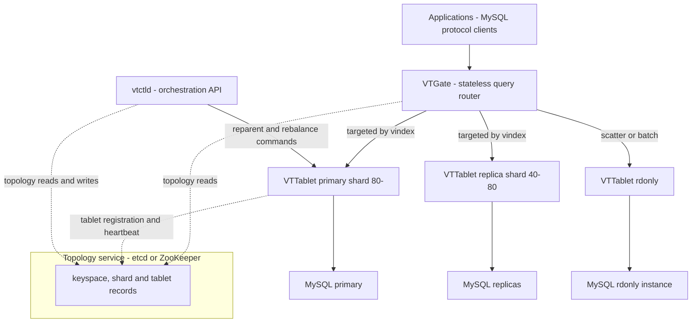
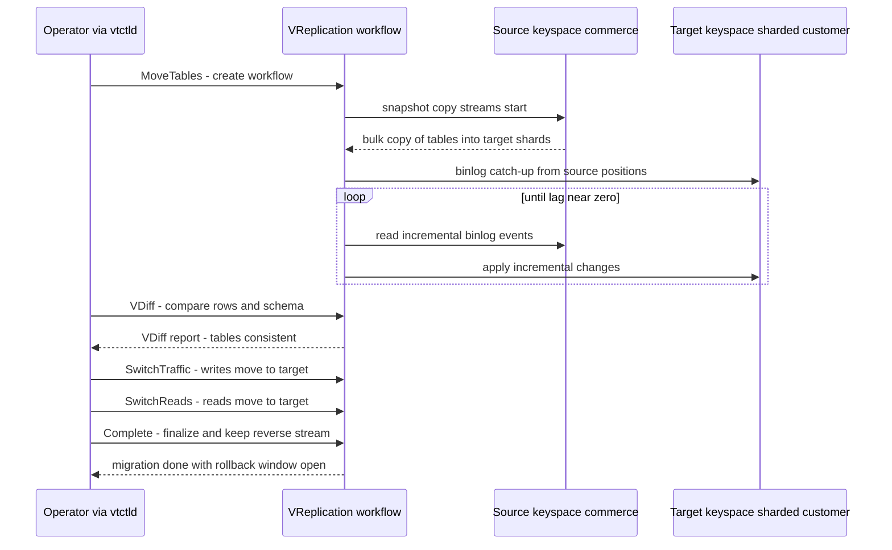

# Vitess: Sharding Middleware for MySQL

## Overview

Vitess is horizontal-sharding middleware for MySQL, originally built at YouTube to run its metadata store, open-sourced in 2013 and now a graduated CNCF project. It is the canonical answer to "make one logical MySQL out of many physical MySQL servers without rewriting the application": applications speak the MySQL wire protocol to a stateless router, which plans each query across shards, and a topology service tracks what lives where. Placement interviews at infra-heavy companies probe Vitess because it forces you to demonstrate the whole sharding curriculum — shard-key choice, scatter queries, resharding, cross-shard transactions — grounded in a system that actually runs at YouTube/Slack/GitHub scale. General sharding theory lives in [Database Sharding](./database-sharding.md); this page covers what Vitess adds on top.

## Why Middleware Instead of Built-in Sharding

There are two ways to get sharded SQL: use a database that shards natively (TiDB, CockroachDB, YugabyteDB), or keep MySQL and put a proxy in front. Vitess is the mature proof of the second path, and the argument for it is economic: MySQL replication is operationally understood by thousands of DBAs, the storage engine is battle-tested, and sharding — which is mostly routing and metadata — is a tractable distributed-systems problem *if* you are willing to give up cross-shard ACID. The middleware keeps the data plane boring and concentrates novelty in the routing plane.

| Dimension | Vitess (over MySQL) | TiDB | CockroachDB | Aurora-style vertical scaling |
|---|---|---|---|---|
| Where sharding lives | Middleware + vanilla MySQL | Built-in, Raft regions in TiKV | Built-in, Raft ranges | Nowhere — one big machine, read replicas |
| SQL surface | MySQL dialect, minus cross-shard edge cases | MySQL protocol, distributed planner | PostgreSQL dialect | Full MySQL/PostgreSQL |
| Cross-shard transactions | Best-effort or 2PC (opt-in) | Percolator-style distributed ACID | Serializable, distributed | Single-node ACID only |
| App migration cost | Low — same protocol/driver | Low-moderate | Moderate (PG dialect gaps) | Zero |
| Shard-key discipline | Required (vindex) | Optional (planner handles it) | Optional | N/A |
| Operational model | You run the Vitess fleet + MySQL fleet | One new distributed system | One new distributed system | Managed, but single-writer ceiling |

The honest comparison: native distributed SQL databases give you transactions across shards that Vitess cannot, at the cost of adopting an entire new storage engine. Vitess gives you MySQL's ecosystem and per-shard predictability at the cost of asking applications to respect the shard key. Neither is free; the choice is which constraint your workload tolerates.

The third option — application-level sharding, where every service holds its own shard map and parses ids — is what Vitess actually replaces, and it is the strongest argument in its favor. Hand-rolled sharding spreads routing logic across dozens of services, makes resharding a multi-team project, and turns every "simple cross-shard query" into bespoke code. Vitess centralizes exactly that layer in one inspected, tested place, so the comparison to run in an interview is not "Vitess vs TiDB" alone but "buy a router vs build one in every service".

## Architecture: VTGate, VTTablet, Topology

Vitess splits into a stateless routing tier, a per-MySQL agent tier, and a coordination tier:



- **VTGate** is the connection point: it speaks the MySQL protocol, authenticates, parses each query, plans it against the VSchema, executes it against the right tablets, and merges results. Gates are stateless — run as many as you like behind a load balancer; scaling the SQL entry point is horizontal and boring.
- **VTTablet** is an agent in front of exactly one MySQL instance. It manages a connection pool to mysqld, enforces query timeouts and size limits, maintains its own query buffer and transaction sessions, and advertises a **tablet type**: `primary` (takes writes for its shard), `replica` (serves client reads, used for failover), `rdonly` (batch/OLAP and resharding streams, never promoted). The tablet layer is what makes failover orchestrated and safe: reparenting a shard means demoting one tablet and promoting another via the tablet RPCs, not manual `CHANGE MASTER` surgery.
- **Topology service** (etcd, ZooKeeper, or consul) is the source of truth for the keyspace/shard/tablet graph. Gates and tablets are clients of it; the master election state and shard records live there.
- **vtctld** is the admin plane — the CLI/API for reparents, resharding workflows, and schema migrations. Everything it does is expressed as topology updates plus tablet RPCs, so the control plane is inspectable.

Compare this to the TiDB stack in [TiDB Internals](./tidb-internals.md): TiDB server ≈ VTGate, TiKV ≈ MySQL-plus-tablet, PD ≈ topology-plus-scheduler. The layered shape is identical; Vitess differs in what the storage layer is (unmodified MySQL) and what it costs (no cross-shard ACID by default).

## VSchema and Keyspaces

A **keyspace** is Vitess's namespace for a set of shards — roughly "a database". An **unsharded keyspace** has one shard (or a primary plus replicas) and behaves like plain MySQL. A **sharded keyspace** splits its rows by a chosen column using a **vindex**. The VSchema is the JSON metadata that declares, per table, which keyspace it lives in, which vindex is primary, and which secondary vindexes exist.

- The **primary vindex** is the sharding function: deterministic, writes always consult it. Its output is a *keyspace ID* (an arbitrary byte string), which the shard map partitions into contiguous ranges — each shard owns a range like `[80-, C0-)`.
- **Secondary vindexes** are additional lookup structures so queries on other columns can still route. They cost extra writes (the lookup table must be maintained transactionally-ish with the main row) but turn would-be scatter queries into targeted ones.
- A **hash vindex** maps the sharding key through a 64-bit hash; a **lookup vindex** is a backing table mapping column value → keyspace ID (e.g., `email → user_id`), with ownership rules for how it is written.

A concrete VSchema fragment makes the pieces legible:

```json
{
  "keyspaces": {
    "customer": {
      "sharded": true,
      "vindexes": {
        "hash_index": {"type": "hash"},
        "email_lookup": {"type": "consistent_lookup_unique",
                          "params": {"table": "customer.email_lookup"}}
      },
      "tables": {
        "users": {
          "column_vindexes": [
            {"column": "user_id", "name": "hash_index"},
            {"column": "email", "name": "email_lookup"}
          ],
          "auto_increment": {"column": "user_id", "sequence": "customer.user_seq"}
        }
      }
    }
  }
}
```

Read it as routing rules, not schema: `user_id` hashes to pick the shard, `email` goes through a maintained lookup table, and `user_id` values come from a sequence table. Everything VTGate does for `users` traces back to these lines.

Worked example — hash vindex routing. Suppose `users` is sharded by `user_id` with a hash vindex over 4 shards owning ranges `[-40)`, `[40-80)`, `[80-c0)`, `[c0-)`:

```text
user_id = 12345
  -> hash: 0x6a3f...c2   (64-bit, big-endian byte string keyspace id)
  -> first byte 0x6a = 106 -> falls in range [80-c0) -> shard 2
VTGate plans: Insert into users on shard [80-c0)
Later: SELECT ... WHERE user_id = 12345 -> same targeted route
```

One hash, one lookup in the shard map, one shard touched. The same calculation happens on every write and every equality read, which is why choosing the primary vindex is the single most consequential decision in a Vitess deployment — everything downstream (joins, transactions, resharding) inherits it.

### Inside VTGate: Planning Passes

For every query VTGate runs a mini-optimizer pipeline: parse the SQL, resolve table names against the VSchema, compute routes (one or many shards), plan projections and predicates per route, and build an execution tree of **primitives** (the Vitess executor nodes: `Send`, `Join`, `OrderBy`, `Aggregate`, `Limit`, `Route`). The gate is not a full query optimizer — it does not choose join algorithms or scan paths; those remain MySQL's job inside each shard. It optimizes the *distribution* layer only: which shards, which sub-queries, how to merge. That division of labor is worth quoting verbatim in interviews: Vitess plans across shards; MySQL plans within a shard.

### The Vindex Catalog

| Vindex | Kind | Maps | Typical use |
|---|---|---|---|
| `hash` | Primary-capable, unique, functional | 64-bit hash of the value | Numeric sharding keys (`user_id`) — even distribution, cheap computation |
| `unicode_loose_md5` / `binary_md5` | Primary-capable, unique, functional | MD5-derived keyspace id | String keys (emails, usernames) with case/unicode normalization |
| `numeric` | Primary-capable, unique, functional | Value as-is | Keys already allocated from a global sequence, zero rehash cost |
| `consistent_lookup_unique` | Secondary, unique, lookup | Column value → keyspace id, maintained in a backing table | Route by `email` when `user_id` is the primary key |
| `lookup` (non-unique) | Secondary, non-unique, lookup | One value → many keyspace ids | Route by `org_id` when an org maps to multiple owners/shards |
| `region_experimental` | Secondary, affine | Value → (region, hash) | Geo-pinned rows — keep EU users on EU shards |

Functional vindexes are pure functions (no storage); lookup vindexes are backed by real tables and must be kept consistent with the main row — Vitess wraps both writes in the same transaction when the lookup lives in the same keyspace, and flags `write_only`/degraded modes during backfill. The catalog exists so that access-path changes are metadata edits, not re-shardings: adding `email` routing means creating a lookup vindex and backfilling it, not moving data.

### Sequence Tables: Auto-Increment After Sharding

`AUTO_INCREMENT` is per-MySQL-server, so a sharded table's ids would collide across shards. Vitess replaces it with a **sequence table**: a tiny *unsharded* table whose single row is an in-memory counter; shards allocate blocks (default 1000) from it, so insert-heavy shards do not round-trip to the sequence per row.

```sql
-- In the VSchema: users.auto_increment = {"sequence": "user_seq"}
-- At runtime, INSERT INTO users(name) VALUES ('ada'):
--   VTGate asks a sequence tablet for the next id block,
--   routes the row by hash(that id),
--   the ids are unique cluster-wide, allocated in blocks,
--   but NOT gap-free and NOT strictly monotonic across shards.
```

The property trade is the interview point: you gain cluster-wide uniqueness and cheap allocation; you lose the dense, ordered semantics of per-server `AUTO_INCREMENT`. Anything that assumed consecutive ids (pagination by id, gap-based audits) needs redesign — usually to `search_after`-style keyset pagination.

## Query Routing

VTGate classifies each query by how far it must travel:

- **Targeted**: a single shard satisfies it — equality or `IN` on the primary vindex, or on a secondary vindex. Fastest path; no fan-out.
- **Scatter**: the query must go to every shard of the keyspace — range predicates over the vindex, filters on non-vindexed columns, or any aggregation without a key constraint. Cost scales with shard count; latency is the slowest shard.
- **Multi-keyspace**: joins across keyspaces (e.g., sharded `users` with unsharded `product_catalog`) execute as separate plans merged at the gate.

**Why cross-shard joins hurt**: a join between two sharded tables on a non-sharding-key predicate scatters both sides and joins at VTGate, buffering one side in gate memory. If `orders` joins `users` on `user_id` (the key), each shard joins locally and nothing crosses the wire — co-locating hot joins on the shard key is the whole game. The **avoid-scatter playbook**, in order of preference:

1. Make the hottest equality predicate the primary vindex.
2. Add secondary/lookup vindexes for the next-most-common filters (paying their write cost).
3. Denormalize or materialize the offending join (Vitess `Materialize` workflows maintain derived tables for you).
4. Accept scatter for low-QPS admin queries and cap their concurrency.

For queries that must scatter, Vitess still does structured splitting: each shard applies the local `ORDER BY` and returns more than the requested `LIMIT` (the gate merges ordered streams, applies the global limit); aggregates push down per shard (`SUM`, `COUNT` per shard, merged at the gate; `AVG` becomes sum/count pairs). This is the same fan-out aggregation pattern as [Distributed Query Execution](./distributed-query-execution.md), just re-derived at the proxy layer.

### Read Routing and Failover in Practice

Read routing flags per connection or query select the tablet class: primaries for read-your-writes, replicas for stale-tolerant reads, rdonly for batch. Gate-side *buffering* softens failover: when a primary fails, the tablet layer reparents a replica (the topology record for the shard flips), and VTGates buffer writes for that shard for a bounded window instead of erroring immediately — masking brief failovers without application retries. Two honest caveats: buffering trades latency spikes for a short window of delayed error surfaces, and reparenting is *not* lossless by definition — if the old primary had local transactions the replicas never received, those are gone (Vitess prefers availability of the routing plane with MySQL-semi-sync-style durability settings left to the operator). This is exactly the replication-topology flexibility that a Raft-based store like CockroachDB automates; Vitess exposes it as commands because MySQL gives no consensus layer underneath.

## Resharding Workflows

Resharding is Vitess's crown jewel because it is *routine*: add shards without downtime, using the VReplication engine that streams binlog like a fan-out of MySQL replication.

Three workflow flavors cover the matrix: **Reshard** changes a keyspace's shard count (1 → 8, 8 → 16, or merge 16 → 8 for consolidation); **MoveTables** relocates selected tables across keyspaces (the classic unsharded → sharded migration); **Materialize** continuously maintains a derived table (denormalized join results, cross-keyspace copies) rather than moving ownership. All three share the same copy-catch-up-validate-switch engine, which is the point: learn one machinery, apply it to every topology change.



The workflow mechanics: **MoveTables** copies selected tables from a source keyspace to a target (sharded or unsharded) via snapshot streams, then streams binlog changes until lag is near zero. **VDiff** validates that source and target agree (row counts, checksums). **SwitchTraffic** atomically flips writes — VTGate routing rules change, writes go to the new home, and a *reverse* VReplication stream runs back to the source so a rollback remains possible. **Complete** finalizes and drops the streams (and optionally the source tables). The same machinery drives `Reshard` (moving a keyspace from 1 shard to N), `MigrateTables` across clusters, and `Materialize` (maintaining derived/denormalized tables). This is the production-hardened instance of the general patterns in [Online Resharding](./online-resharding.md) — copy, catch up, validate, cutover with a reverse path — with the notable Vitess twist that dual-write is replaced by *binlog streaming plus a switch*, so there is no application-level double-write code to get wrong.

## Feature Deltas vs Raw MySQL

Vitess aims for transparent MySQL, but the deltas are exactly where interview questions live:

| Feature | Raw MySQL | Vitess reality |
|---|---|---|
| Auto-increment | `AUTO_INCREMENT` per table | Sharded tables use **sequence tables** (unsharded single-row counters VTTablet allocates from) — cluster-wide unique, but not gap-free or monotonic per insert |
| Transactions | Full ACID | **SINGLE** mode: atomic only if all statements hit one shard. **MULTI**: best-effort multi-shard, no atomicity. **TWOPC**: opt-in two-phase commit across shards with prepared transactions |
| Foreign keys | Enforced by InnoDB | Cross-shard FKs cannot be enforced locally; Vitess v15+ adds managed FK modes with defined semantics, but many deployments avoid cross-shard FKs entirely |
| DDL | Blocking or external tools | Managed online DDL: `gh-ost`/`pt-osc` launch or VReplication-based migrations with cut-over control, throttling, and cancel |
| `SELECT ... FOR UPDATE` across shards | Works | Limited to single-shard scope; cross-shard locking is not coordinated |
| Global ordering | Binlog order per server | Sequence numbers per shard; cross-shard causality is the application's problem |

The transaction modes deserve a sharp sentence each: SINGLE is what most applications actually need (shard the data so transactions are local — the same "make it single-shard" advice as every sharding system); MULTI is explicitly best-effort and should be treated as a debugging hazard; TWOPC gives atomicity at the cost of latency and a recovery manager for in-doubt transactions. If your workload *requires* cross-shard serializable transactions as a norm, that is the signal to evaluate TiDB or CockroachDB instead — see [CockroachDB Architecture](./cockroachdb.md) and [YugabyteDB Architecture](./yugabytedb.md).

## Operational Lessons

Practitioner rules that survive contact with production:

- **Tablet and shard sizing**: keep per-MySQL working sets comfortably in buffer-pool territory (hundreds of GB, not multiple TB per node); more, smaller shards make resharding cheaper and failover less impactful. Shards are cheap; a 4 TB shard is not.
- **Rebalance cadence**: reshard proactively at ~60-70% capacity, not at 90% — VReplication catch-up needs headroom on the source, and the whole workflow is smoother when the cluster is not already saturated.
- **Replication lag**: VTTablet exposes lag per replica; gates can route reads with lag awareness, and rdonly tablets absorb batch traffic so dashboards do not stall the primary. Applications that read-after-write must either target the primary or tolerate staleness — the usual read-replica contract, now per-shard.
- **Topology is load-bearing**: etcd quorum loss stops control-plane operations (failovers, resharding) even though data-plane traffic keeps flowing. Size it like the metadata store it is — 3-5 nodes, watched, backed up.

### When NOT to Use Vitess

Honesty box, because this is the senior-engineer answer: **you probably do not need Vitess** if your data fits in the low hundreds of GB, write throughput sits below what one well-tuned MySQL primary handles (thousands of small writes per second), and your read scaling is satisfied by 2-5 replicas. Plain MySQL plus replicas plus good indexes is dramatically simpler, and "we might need to shard someday" is not a reason to run a proxy fleet, a topology service, and vindex discipline today. Concrete signals that flip the decision: multi-terabyte per-table growth with no natural eviction, sustained single-digit-k-writes/s that one primary cannot absorb, noisy multi-tenant neighbors pinning one database, or an existing sharded-MySQL deployment held together with application-level sharding code — *that* last one is Vitess's best-fit migration, because it deletes the homemade sharding layer. The general decision framework is the same as in [Database Sharding](./database-sharding.md): shard when one machine genuinely cannot hold or absorb the workload, not before.

## PlanetScale Connection

PlanetScale, founded by Vitess's engineering leads (Jiten Vaidya, Sugu Sougoumarane), runs Vitess as a managed database-as-a-service and funds most of its development. Whatever one thinks of the company's product moves, the existence of a commercial steward proves the stack is operable by teams that do not employ its authors — the managed product exercises the same VTGate/tablet/topology architecture described above, at thousands of customer databases. For interviews, the useful takeaway is that "middleware over boring storage" is a viable business and engineering strategy, not just a YouTube one-off.

## Cells, Locality, and Multi-Tenant Patterns

Vitess partitions deployments into **cells** (typically a datacenter or cloud AZ). Tablets belong to a cell; gates route locally first, and cross-cell traffic is explicit — replicas in each cell serve that cell's reads, with the primary allowed in one cell per shard by default (inter-cell writes cross AZ boundaries). This gives a clean geo story: pin read latency per region, plan failover by promoting across cells, and use `region` vindexes to keep a tenant's rows on one continent. Multi-tenant SaaS stacks lean on the same knobs: one keyspace per tenant tier (big tenants sharded, small tenants pooled unsharded), with routing values pinning each request to the right shard — tenant isolation becomes a metadata question instead of separate server fleets.

## Monitoring and Golden Signals

The Vitess-specific surfaces worth watching: **tablet lag** per replica (`vttablet` status vars) for read-staleness SLOs; **VReplication workflow lag** (seconds behind master) while any MoveTables/Reshard is running — cutover only when it is near zero; **gate query counts by plan type** (targeted vs scatter vs join) — a rising scatter ratio is the leading indicator of a vindex gap; and **topology health** (etcd quorum, lease status). Add the MySQL-level per-shard signals you would watch anyway (buffer-pool hit ratio, replication lag, slow log) and you have the full dashboard. The unifying principle: because Vitess is a metadata-driven router over ordinary MySQL, every anomaly is either a routing decision gone wrong (scatter growth) or ordinary MySQL trouble underneath — the monitoring design should make both visible separately.

## Interview Questions

1. **Why put a proxy in front of MySQL instead of using a natively distributed SQL database?** The proxy keeps the storage layer as unmodified MySQL — known operations, known tooling, per-shard ACID and performance — and concentrates distribution in routing and metadata, which are tractable problems. You give up cross-shard ACID (best-effort or 2PC in Vitess) and take on shard-key discipline. Native distributed SQL (TiDB, CockroachDB) buys transactions with a new storage engine and its own operational learning curve. The choice is really "adopt new storage" vs "adopt new routing"; Vitess is the strongest argument for the latter because YouTube-scale deployments de-risked it.
2. **What is a vindex, and what happens on a query with no usable vindex?** A vindex maps column values to keyspace IDs; the primary vindex decides where rows live, secondary vindexes are maintained lookup tables for other access paths. A query whose predicates hit no vindex scatters to every shard of the keyspace and merges at VTGate — correct, but O(shards) cost, so hot paths should never scatter. Adding a secondary lookup vindex converts that scatter into a targeted route at the price of an extra table write per mutation.
3. **Walk through moving a sharded table from 1 to 8 shards with zero downtime.** Create the new sharded keyspace, run a Reshard/MoveTables workflow: VReplication bulk-copies rows via snapshot streams to their new shard ranges while streaming binlog changes for catch-up. Run VDiff to verify row counts and checksums match. SwitchTraffic flips writes at VTGate (with a reverse replication stream back to the source kept alive), then SwitchReads flips reads. Observe, then Complete to drop streams and optionally prune source tables. Rollback is possible any time before Complete by reversing traffic.
4. **How do transactions behave across shards in Vitess?** SINGLE mode is atomic only within one shard — the design goal is to make transactions single-shard through shard-key choice. MULTI mode executes across shards without atomicity guarantees (a crash can leave partial application). TWOPC adds real two-phase commit with prepared transactions and a recovery manager, at latency and operational cost. There is no serializability across shards like a Raft-based SQL database provides, which is the deliberate trade for keeping MySQL as the storage engine.
5. **Your service has 40 GB of data and 200 writes/s. Should you adopt Vitess?** No — one MySQL primary with 2-3 replicas covers it with a fraction of the operational surface (no topology service, no vindex design, no gate fleet). Vitess earns its cost at multi-terabyte growth, sustained throughput beyond one primary, multi-tenant isolation needs, or when replacing an existing application-level sharding mess. Adopting sharding infrastructure "for future scale" buys complexity now for a capacity problem you may never hit; the threshold signals, not titles, should drive the decision.
6. **How does Vitess resharding avoid the dual-write consistency problem?** It never asks the application to double-write. VReplication reads the source's binlog and applies changes to the target, so the source remains the single writer until cutover; lag converges because the binlog is a total order per source. Traffic switch is a routing change at VTGate, after which the reverse stream keeps the *old* home updated for rollback. Consistency is validated by VDiff before cutover, not hoped for afterward.

## Key Takeaways

- Vitess = routing plane (VTGate) + agent plane (VTTablet per MySQL, typed primary/replica/rdonly) + control plane (topology service, vtctld); applications see one MySQL protocol endpoint.
- The vindex system makes sharding a metadata problem: primary vindex routes writes, secondary vindexes rescue non-key filters, and the shard map partitions keyspace-ID ranges.
- Scatter queries are the tax of a poor vindex choice; the playbook is vindex selection → lookup vindexes → materialized denormalization → tolerated scatter for admin paths.
- Resharding is routine infrastructure: binlog-stream copy, VDiff validation, atomic traffic switch with a live reverse stream — no application dual-write code.
- Transactions are single-shard ACID by design; MULTI is best-effort, TWOPC is opt-in two-phase commit — if you need normative cross-shard serializability, that is a signal to evaluate TiDB or CockroachDB instead.
- Feature deltas vs MySQL (sequence tables for auto-increment, managed online DDL, FK restrictions) are the practical migration checklist.
- The "you probably do not need it" box is the senior answer: hundreds of GB and low-thousands writes/s belong on plain MySQL plus replicas.

## References

- [Vitess documentation](https://vitess.io/docs/) — architecture, VSchema, routing, resharding workflows
- [Vitess reference](https://vitess.io/docs/reference/) — vindex catalog, transaction modes, tablet types
- [github.com/vitessio/vitess](https://github.com/vitessio/vitess) — VReplication engine, VTGate planner source
- Sugu Sougoumarane, Madhan Raj Mookkiah, "Vitess: a cloud-native approach to scaling MySQL" — Vitess design talks/CNCF materials (no stable URL cited; see the documentation above)
- CNCF project materials — Vitess graduated project status (2018); see vitess.io for current governance

## Cross-References

- [Database Sharding](./database-sharding.md) — partitioning strategies and the decision framework Vitess operationalizes
- [Online Resharding](./online-resharding.md) — the generic copy-catch-up-validate-cutover theory behind MoveTables
- [TiDB Internals](./tidb-internals.md) — the natively-distributed contrast with the same layered shape
- [CockroachDB Architecture](./cockroachdb.md) — distributed ACID that Vitess's 2PC mode approximates
- [YugabyteDB Architecture](./yugabytedb.md) — the PostgreSQL-dialect member of the distributed-SQL family
- [Distributed Query Execution](./distributed-query-execution.md) — fan-out aggregation and merge patterns VTGate reuses
- [MongoDB Sharding](../nosql/mongodb-sharding.md) — another router-based sharding design (mongos vs VTGate)
