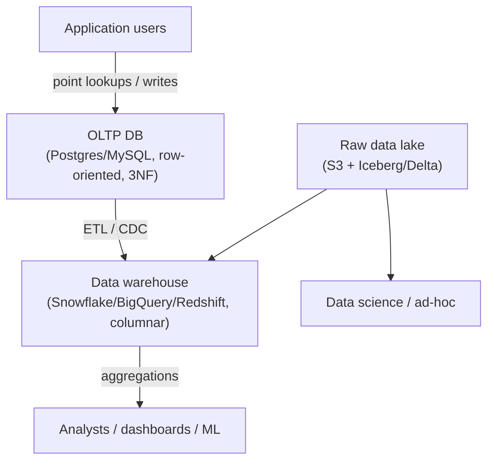
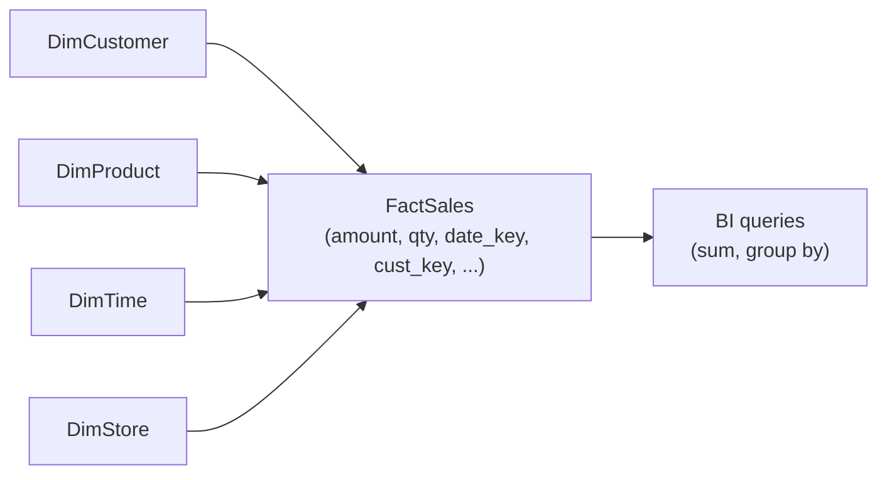

# OLTP vs OLAP, Data Warehouses and Data Lakes

## Overview

Databases are built around two fundamentally different workloads:

- **OLTP (Online Transaction Processing)** — high-frequency, low-latency reads and writes of *current state* (your app's PostgreSQL/MySQL).
- **OLAP (Online Analytical Processing)** — large aggregations and scans over *historical* data (BI dashboards, analytics).

Trying to serve both from one engine usually fails: an OLTP database is optimized for point lookups and writes, while analytical queries scan millions of rows. This page covers the OLTP/OLAP distinction, dimensional modeling, and the data warehouse / data lake / lakehouse continuum.

## OLTP vs OLAP

| Axis | OLTP | OLAP |
|---|---|---|
| Purpose | Operational reads/writes | Analytical reads |
| Query pattern | Point lookups, single-row mutations | Aggregations, group-bys, wide scans |
| Latency target | Sub-50 ms p99 | Sub-second to seconds (terabyte scans) |
| Data volume | Gigabytes–terabytes | Hundreds of GB to petabytes |
| Storage layout | **Row-oriented** (heap + B-tree) | **Column-oriented** (columnar files, data skipping) |
| Schema | Normalized (3NF) | Denormalized (star/snowflake, wide fact tables) |
| Concurrency | Thousands of short transactions, row locking | Tens–hundreds of long queries (MVCC snapshots) |
| Write profile | High-frequency single-row updates | Bulk inserts, append-mostly |
| Compression | 1–2× | 5–10×+ (columnar) |
| Indexing | B-tree, hash on primary/secondary keys | Sparse indexes, partitioning, clustering, materialized views |
| Consistency | ACID, strong | Snapshot consistency, eventual on reads |
| Examples | PostgreSQL, MySQL, SQL Server, Oracle | ClickHouse, Snowflake, BigQuery, Redshift, Druid |

## Why Separate OLTP and OLAP

1. **Different storage layout** — row-oriented stores all columns of a row together (fast point lookup/update); column-oriented stores each column contiguously (fast scans: only read needed columns, high compression).
2. **Different consistency needs** — OLTP wants ACID on every transaction; OLAP wants snapshot consistency for long queries without blocking writers.
3. **Workload isolation** — analytics on the production DB slows the app; a separate warehouse absorbs the load.
4. **Historical vs current** — OLTP keeps current state (updates in place); OLAP stores history for time-series analysis.

## Data Warehouse Design: Dimensional Modeling

Warehouses are typically modeled with **facts and dimensions**:

- **Fact table** — numeric measures of business events (sales amounts, quantities) + foreign keys to dimensions. Often huge (billions of rows).
- **Dimension tables** — descriptive attributes (customer, product, time, store). Smaller, denormalized.

### Star vs Snowflake schema

| | Star | Snowflake |
|---|---|---|
| Dimensions | Denormalized (flat) | Normalized (multiple tables) |
| Joins | Fewer, simpler | More, complex |
| Query speed | Faster | Slower |
| Storage | More redundant | Less redundant |
| Modern guidance | **Default choice** | Rarely worth it (columnar storage makes redundancy cheap) |

**Best practice**: star schema with surrogate integer keys for dimensions; columnar compression absorbs the denormalization cost, and query simplicity wins.

## Data Lake vs Warehouse vs Lakehouse

| | Data warehouse | Data lake | Lakehouse |
|---|---|---|---|
| Data | Structured, curated, modeled | Raw, any format (structured/semi/unstructured) | Raw + curated on open formats |
| Schema | Schema-on-write (enforced) | Schema-on-read (flexible) | Enforced on open table formats |
| Use | BI, reporting | ML exploration, staging, archives | Both (BI + ML) |
| Cost | Higher per TB | Cheap object storage | Moderate |
| Consistency | ACID | Not historically (now via Iceberg/Delta) | ACID via table formats |
| Examples | Snowflake, BigQuery, Redshift | S3 + raw files | Databricks + Delta Lake, Iceberg, Hudi |

**Lakehouse** (Databricks/Delta Lake, Apache Iceberg, Hudi) adds ACID transactions, schema enforcement, and time travel to object storage — closing the warehouse/lake gap. Modern warehouses (Snowflake, BigQuery) also read/write open lake formats, blurring the boundary further.

## Getting Data In: ETL/ELT and CDC

- **ETL** — extract, transform, load: transform *before* loading into the warehouse.
- **ELT** — load raw first, transform *in* the warehouse (modern cloud warehouses compute cheaply): load → transform with SQL/dbt.
- **CDC (Change Data Capture)** — stream OLTP changes (log-based) into the warehouse with sub-minute freshness (Debezium, AWS DMS, PeerDB). Replaces nightly batch ETL for near-real-time analytics.
- **Zero-ETL** — cloud-vendor integrations that replicate OLTP→OLAP automatically (Aurora→Redshift, AlloyDB→BigQuery).

## HTAP and Modern Convergence

**HTAP (Hybrid Transactional/Analytical Processing)** engines try to serve both workloads from one store (TiDB, ClickHouse's dual-mode, SAP HANA). Trade-off: you lose some OLTP or OLAP specialization. Most organizations still run separate OLTP + OLAP with CDC/ETL between them — HTAP is for cases where freshness matters and the compromise is acceptable.

## Interview Questions

### Q: Why do OLAP databases use columnar storage?

Analytical queries scan millions of rows but use few columns. Columnar storage (a) reads only the needed columns (less I/O), (b) achieves 5–10×+ compression because similar values are adjacent, and (c) enables vectorized processing. Row-oriented storage is better for OLTP point lookups/updates where you touch whole rows and mutate them in place.

### Q: What is the difference between a data warehouse and a data lake?

A warehouse stores curated, modeled, structured data with enforced schemas (schema-on-write) — optimized for BI and analytics. A data lake stores raw data in any format with schema-on-read — flexible for ML and exploration, historically without ACID. A lakehouse (Delta Lake/Iceberg/Hudi) adds warehouse-style ACID, schema enforcement, and time travel on top of cheap object storage.

### Q: What is a star schema and why is it the default?

A star schema has one central fact table (measures + dimension keys) surrounded by denormalized dimension tables. Queries join facts to dimensions and aggregate — few joins, fast, intuitive. Snowflake (normalized dimensions) saves storage but adds joins; with modern columnar compression, that saving is negligible, so star is the default.

### Q: How do you keep a warehouse fresh without nightly batch jobs?

Use **change data capture (CDC)**: read the OLTP transaction log (not queries), stream changes to the warehouse (Debezium → Kafka → sink, or vendor zero-ETL), achieving sub-minute freshness with low load on the source. ETL still handles initial loads and complex transformations; CDC handles the ongoing delta.

### Q: Why not just run analytics on the production OLTP database?

Because the workloads conflict: OLTP is tuned for point lookups/writes with row-level locking and 3NF schemas; analytical scans lock rows, read every column, and slow production. Separate OLTP and OLAP systems let each be tuned independently, and analytics users don't degrade application latency.

## References

- ClickHouse: *OLTP vs OLAP* — https://clickhouse.com/resources/engineering/oltp-vs-olap
- Kimball Group: dimensional modeling (star schema) — https://www.kimballgroup.com/data-warehouse-business-intelligence-resources/kimball-techniques/dimensional-modeling-techniques/
- Apache Iceberg documentation — https://iceberg.apache.org/
- Delta Lake documentation — https://docs.delta.io/latest/index.html
- AWS: Modern Data Architecture (warehouse + lake) — https://aws.amazon.com/big-data/datalakes-and-analytics/

## Related Topics

- [Column Stores](../storage/column-stores.md) — columnar storage internals
- [Normalization](../normalization/README.md) — why OLTP schemas are 3NF
- [SQL](../sql/README.md) — query patterns on both sides
- [Data Pipelines](../../ml/system-design/data-pipeline.md) — ML data flows
- [Cloud Storage](../../storage/overview.md) — object storage as the lake
- [Replication and CDC](../../distributed/replication/README.md) — log-based replication
