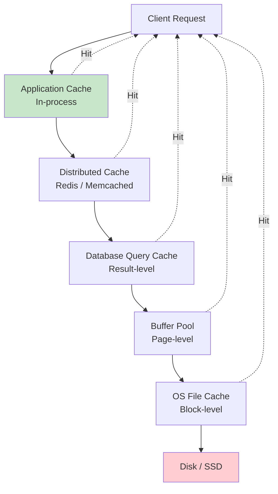
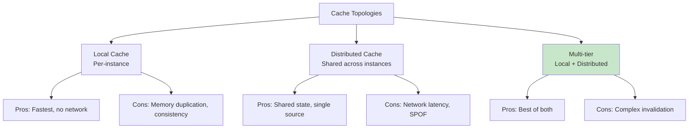
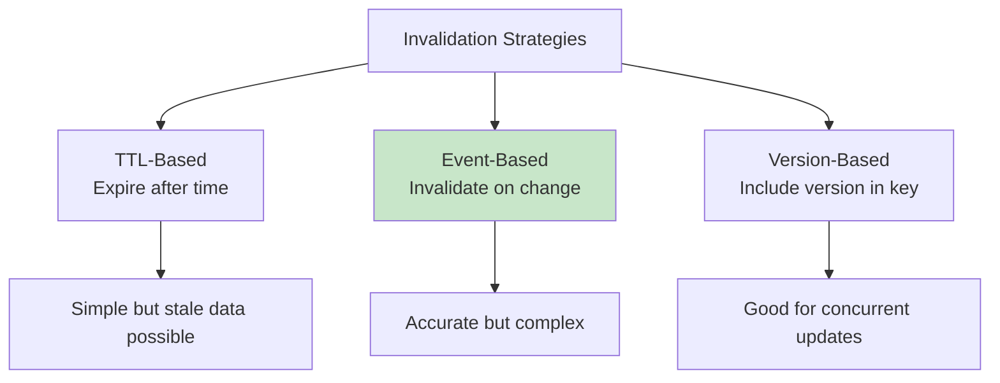

# Caching

## Overview

Caching is the practice of storing frequently accessed data in faster storage (typically memory) to reduce latency and load on slower backends. In database systems, caching operates at multiple levels — from low-level buffer pools that cache disk pages, to high-level query caches that store entire result sets, to external caching systems like Redis and Memcached that sit between the application and database.

Understanding caching is essential for system design interviews, as it's one of the most common strategies for improving performance and scalability.

## Detailed Explanation

### The Caching Hierarchy



### Cache Levels Comparison

| Level | Granularity | Scope | Latency | Example |
|-------|-------------|-------|---------|---------|
| **Application** | Object/function result | Single process | < 1ms | Local HashMap |
| **Distributed** | Key-value pairs | Cluster-wide | 1-5ms | Redis, Memcached |
| **Query Cache** | Query result sets | Database | 1-10ms | MySQL Query Cache |
| **Buffer Pool** | Disk pages | Database | 10-100μs | PostgreSQL shared_buffers |
| **OS Cache** | File blocks | OS | 100μs-1ms | Linux page cache |

### Why Caching Works

Caching exploits **temporal and spatial locality**:

```
Temporal Locality: Recently accessed data is likely to be accessed again
  → User profiles, configuration, session data

Spatial Locality: Data near recently accessed data is likely to be accessed
  → Sequential scans, related records

Power Law: 20% of data handles 80% of requests
  → Cache the hot 20%, serve most requests from cache
```

### Cache Topologies



### Cache Policies

| Policy | Description | When to Use |
|--------|-------------|-------------|
| **Cache-Aside** | App checks cache, loads from DB on miss | General purpose |
| **Read-Through** | Cache loads from DB automatically | Simpler app code |
| **Write-Through** | Write to cache and DB simultaneously | Strong consistency |
| **Write-Behind** | Write to cache, async flush to DB | Write-heavy, eventual consistency |
| **Write-Around** | Write directly to DB, cache on read | Write-heavy, rarely read |

**Cache-Aside (most common):**
```python
def get_user(user_id):
    # 1. Check cache
    user = cache.get(f"user:{user_id}")
    if user:
        return user  # Cache HIT
    
    # 2. Cache MISS — load from DB
    user = db.query("SELECT * FROM users WHERE id = ?", user_id)
    
    # 3. Store in cache
    cache.set(f"user:{user_id}", user, ttl=3600)
    
    return user
```

### Cache Invalidation

The hardest problem in caching — keeping cache consistent with the source of truth:



**TTL (Time-To-Live):**
```python
cache.set("user:123", user_data, ttl=3600)  # Expires in 1 hour
```

**Event-Based Invalidation:**
```python
def update_user(user_id, new_data):
    db.update("UPDATE users SET ... WHERE id = ?", user_id)
    cache.delete(f"user:{user_id}")  # Invalidate cache
```

### Cache Stampede (Thundering Herd)

When a popular cache key expires, many requests simultaneously miss and hit the database:

```
Time 0: Cache key "popular_item" expires
Time 1: 1000 requests arrive, all miss cache
Time 2: 1000 queries hit database simultaneously
Time 3: Database overloaded!
```

**Solutions:**

| Solution | How It Works |
|----------|-------------|
| **Locking** | One request loads, others wait |
| **Probabilistic early refresh** | Refresh before expiry with probability |
| **Stale-while-revalidate** | Serve stale data while refreshing |

```python
# Locking solution
def get_with_lock(key):
    value = cache.get(key)
    if value:
        return value
    
    if cache.acquire_lock(f"lock:{key}", ttl=10):
        try:
            value = db.load(key)
            cache.set(key, value, ttl=3600)
        finally:
            cache.release_lock(f"lock:{key}")
    else:
        time.sleep(0.1)  # Wait for lock holder
        return cache.get(key)  # Should be populated now
```

## Topics in This Section

### 1. [Buffer Pool](./buffer-pool.md)
Deep dive into database-level page caching.

### 2. [Query Cache](./query-cache.md)
Database-level query result caching.

### 3. [Redis](./redis.md)
The most popular in-memory data structure store for caching.

### 4. [Memcached](./memcached.md)
The original distributed memory caching system.

## Interview Focus Areas

1. **When to use caching vs. just optimizing the database?** — When read-heavy, data fits in memory, and some staleness is acceptable
2. **How to handle cache invalidation?** — TTL, event-based, version-based
3. **What is a cache stampede and how to prevent it?** — Locking, early refresh
4. **Redis vs. Memcached?** — Data structures, persistence, clustering
5. **How to size a cache?** — Working set analysis, hit ratio monitoring

## Cross-References

- [Buffer Management](../storage/buffer-management.md) — database-level page caching
- [Replication](../distributed/replication.md) — cache consistency in distributed systems
- [Consistency](../distributed/consistency.md) — consistency models affecting caching
- [Query Processing](../query-processing/) — how caching affects query performance


## Cross References

- [Buffer Pool](buffer-pool.md)
- [Redis](redis.md)
- [Cache Hierarchy](../../arch/memory-hierarchy/README.md)
- [Paging (OS)](../../os/memory/paging.md)
