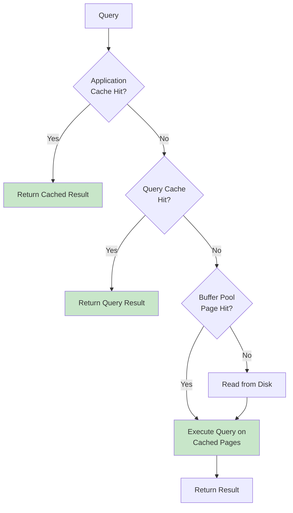
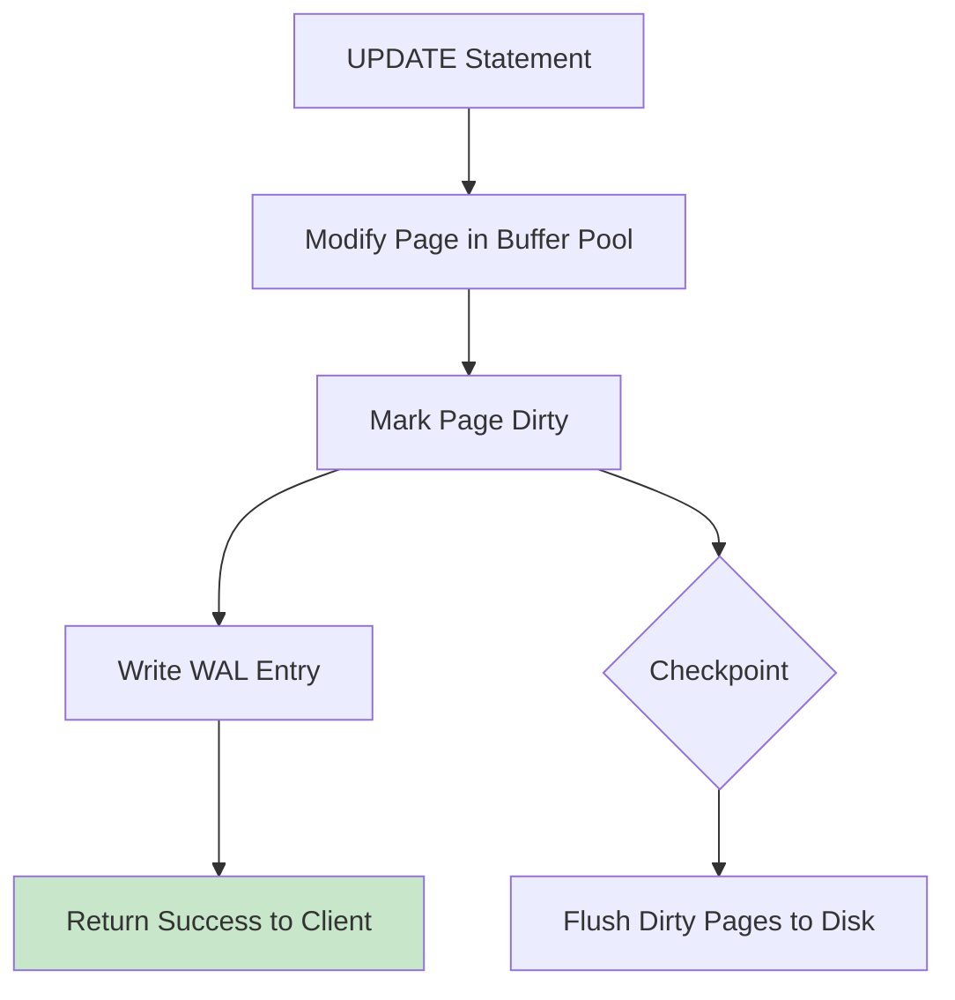

# Buffer Pool

## Overview

The Buffer Pool is the database's primary in-memory cache for disk pages. It sits between the query executor and disk storage, keeping frequently accessed pages in RAM to minimize expensive I/O. Understanding buffer pool internals is essential for database performance tuning and was covered in detail in the [Storage section](../storage/buffer-management.md). This page focuses on buffer pool as a caching mechanism and its interaction with higher-level caches.

## Detailed Explanation

### Buffer Pool as a Cache Layer



### Buffer Pool vs. Application Cache

| Aspect | Buffer Pool | Application Cache |
|--------|-------------|-------------------|
| **Granularity** | Disk pages (8-16KB) | Query results, objects |
| **Managed by** | Database engine | Application code |
| **Eviction** | LRU/Clock algorithm | TTL, manual invalidation |
| **Consistency** | Always consistent with disk | May be stale |
| **Scope** | Single database instance | Application-wide |
| **Latency** | ~100μs (memory access) | ~1ms (network for Redis) |

### Buffer Pool Hit Ratio Monitoring

**PostgreSQL:**
```sql
-- Overall hit ratio
SELECT 
    sum(heap_blks_hit) as hits,
    sum(heap_blks_read) as reads,
    sum(heap_blks_hit)::float / 
    (sum(heap_blks_hit) + sum(heap_blks_read)) as hit_ratio
FROM pg_statio_user_tables;

-- Per-table hit ratio
SELECT 
    relname,
    heap_blks_hit,
    heap_blks_read,
    heap_blks_hit::float / 
    (heap_blks_hit + heap_blks_read) as hit_ratio
FROM pg_statio_user_tables
ORDER BY heap_blks_read DESC;
```

**MySQL:**
```sql
SHOW ENGINE INNODB STATUS;
-- Look for "Buffer pool hit rate"

-- Or via variables:
SHOW GLOBAL STATUS LIKE 'Innodb_buffer_pool_read%';
-- Hit ratio = 1 - (Innodb_buffer_pool_reads / Innodb_buffer_pool_read_requests)
```

### Buffer Pool Sizing

**Rule of thumb:**
- **OLTP workloads:** Buffer pool should hold the working set (hot data)
- **OLAP workloads:** Less critical (large scans bypass buffer pool anyway)

**PostgreSQL sizing:**
```sql
-- Check current size
SHOW shared_buffers;  -- In 8KB pages

-- Recommended: 25% of system RAM (up to 8GB for large systems)
-- Too large → OS swapping, double buffering
-- Too small → excessive disk I/O
```

**MySQL sizing:**
```sql
-- Check current size
SHOW VARIABLES LIKE 'innodb_buffer_pool_size';

-- Recommended: 70-80% of dedicated DB server RAM
SET GLOBAL innodb_buffer_pool_size = 8 * 1024 * 1024 * 1024;  -- 8GB
```

### Buffer Pool and Write Performance

Dirty pages in the buffer pool affect write performance:



**Key insight:** Writes return after WAL write, not after dirty page flush. This makes writes fast, but checkpoints can cause I/O spikes.

### Multiple Buffer Pools (MySQL InnoDB)

MySQL supports multiple buffer pool instances to reduce contention:

```sql
-- Configure multiple instances
SET GLOBAL innodb_buffer_pool_instances = 8;

-- Each instance has its own LRU, free list, and flush list
-- Reduces mutex contention on high-concurrency workloads
```

### Buffer Pool Preloading

Warm up the buffer pool after restart by preloading frequently accessed pages:

**MySQL:**
```sql
-- Dump buffer pool state on shutdown
SET GLOBAL innodb_buffer_pool_dump_at_shutdown = ON;

-- Load on startup
SET GLOBAL innodb_buffer_pool_load_at_startup = ON;
```

**PostgreSQL:**
```sql
-- Use pg_prewarm extension
CREATE EXTENSION pg_prewarm;
SELECT pg_prewarm('orders');  -- Load entire table into buffer pool
```

## Interview Questions

### Q1: What is the buffer pool and why is it important?
**Answer:** The buffer pool is an in-memory cache of disk pages managed by the database engine. It's important because disk I/O is 10,000-100,000x slower than memory access. By keeping frequently accessed pages in memory, the buffer pool reduces disk I/O and dramatically improves query performance. A well-tuned buffer pool with >99% hit ratio means most queries never touch disk.

### Q2: How does the buffer pool differ from Redis/Memcached?
**Answer:** 
- **Buffer pool** caches raw disk pages (8-16KB blocks), managed automatically by the DB engine, always consistent with disk
- **Redis/Memcached** caches application-level data (query results, objects), managed by application code, may be stale

The buffer pool is transparent to the application — you don't need to change queries. Application caches require explicit get/set logic and invalidation strategies.

### Q3: How do you determine the right buffer pool size?
**Answer:** Monitor the hit ratio:
- **>99%** — Well sized
- **95-99%** — Consider increasing
- **<95%** — Definitely increase, or optimize queries

Also consider:
- Working set size (how much data is actively accessed)
- System RAM (leave room for OS and other processes)
- Workload type (OLTP needs larger pool than OLAP)

### Q4: What happens when the buffer pool is full?
**Answer:** The buffer pool uses a replacement policy (LRU, Clock) to evict pages:
1. Find a victim page using the replacement policy
2. If the victim is dirty (modified), write it to disk first
3. If the victim is pinned (in use), skip it
4. Read the requested page into the freed frame
5. Update the page table

### Q5: How do you warm up a cold buffer pool?
**Answer:** After a restart, the buffer pool is empty. Strategies:
1. **Preloading** — Load critical tables/indexes into the buffer pool (`pg_prewarm`)
2. **Buffer pool dump/load** — Save page references on shutdown, reload on startup (MySQL)
3. **Gradual warmup** — Let natural traffic populate the pool (slow, may cause slow queries initially)
4. **Read-ahead** — Some databases support aggressive read-ahead during warmup

## Common Mistakes

- ❌ **Setting buffer pool too large** — Can cause OS swapping, worse than disk I/O
- ❌ **Not monitoring hit ratio** — Blind tuning without metrics
- ❌ **Ignoring checkpoint I/O spikes** — Too many dirty pages cause periodic slowdowns
- ❌ **Double buffering with OS** — Use direct I/O to avoid caching data twice
- ❌ **Not warming up after restart** — Cold buffer pool causes slow queries

## Summary

| Aspect | Details |
|--------|---------|
| **Purpose** | Cache disk pages in memory |
| **Granularity** | 8-16KB pages |
| **Eviction** | LRU / Clock |
| **Target hit ratio** | >99% for OLTP |
| **Sizing** | 25-80% of RAM depending on DBMS |

The buffer pool is the foundation of database performance. Proper sizing and monitoring is essential for any production database.

## Cross-References

- [Buffer Management](../storage/buffer-management.md) — detailed buffer pool internals
- [Query Cache](./query-cache.md) — higher-level caching
- [Redis](./redis.md) — external caching layer
- [WAL](../internals/wal.md) — write-ahead logging and dirty page management
- [File Organization](../storage/file-organization.md) — how pages are organized
