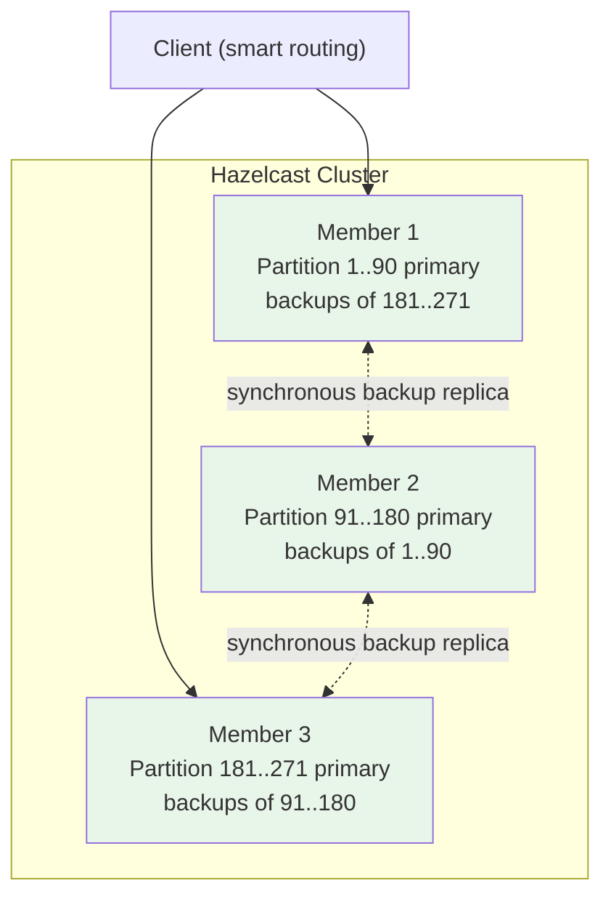
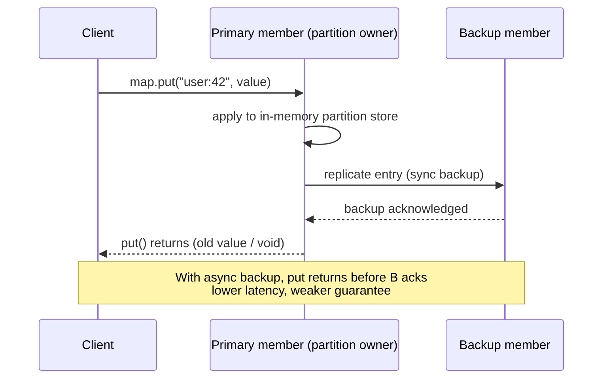
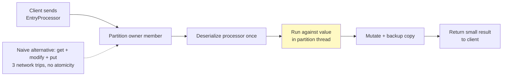

# In-Memory Data Grids: Hazelcast & Coherence

## Overview

An **In-Memory Data Grid (IMDG)** is a cluster of machines that collectively hosts a data structure — usually a key-value map — partitioned across the cluster's memory, with each partition replicated onto other nodes for fault tolerance. Unlike a [cache](./README.md) that sits *in front of* a database, an IMDG can **be** the system of record: writes commit into memory (optionally persisted asynchronously or via write-behind), reads and writes scale horizontally by adding members, and — the killer feature — **computation can be shipped to the node that owns the data** instead of pulling data over the network.

[Redis](./redis.md) is a single-server (or sharded) data structure store that you usually use *as a cache*. An IMDG like [Hazelcast](https://hazelcast.com/) (open source at [github.com/hazelcast/hazelcast](https://github.com/hazelcast/hazelcast)) is a **distributed data fabric**: the map is transparently partitioned across N JVMs, clients talk to any member, and every key has a primary owner plus synchronous backup replicas. Oracle **Coherence** is the legacy enterprise grandfather of the category; **Apache Ignite** is the persistence-native cousin.

## Detailed Explanation

### IMDG vs. Distributed Cache — the Mental Model

| Question | Distributed cache (Redis, [Memcached](./memcached.md)) | In-Memory Data Grid (Hazelcast, Coherence, Ignite) |
|---|---|---|
| What is it? | A fast lookup layer in front of a durable store | A partitioned, replicated data fabric that can be the primary store |
| System of record? | Usually no — cache misses fall through to a database | Frequently yes — with write-behind persistence, the grid *is* the database |
| Data placement | Client- or proxy-sharded (hash slots) | Automatic: 271 virtual partitions spread over members, rebalanced on join/leave |
| Fault tolerance | Replica sets / slot migration | Synchronous in-memory backups (every put is copied to a backup replica before ACK) |
| Compute | Lua scripts / functions run on the server holding data | First-class: entry processors, distributed executor, co-located query, streaming engine |
| Query | Limited (match expressions, sorted sets) | Predicate API, indexes, full SQL engine (Hazelcast 5+) |
| Topology feel | "Database-ish server you connect to" | "Your data structures, cloned into a cluster" |

The interview one-liner: *a cache accelerates your database; an IMDG distributes your application's heap.*

### Hazelcast Architecture

A Hazelcast **cluster** is a group of JVMs (or native processes) called **members** (nodes). Membership is maintained via a gossip-based protocol — the same family of protocols as [memberlist/SWIM gossip](../../distributed/systems/memberlist-gossip.md) — so members detect join/leave/failure without a master.

**Partitioning.** The keyspace is split into **271 partitions by default** (a prime number chosen to divide well across cluster sizes of ~5–100 members). Each key maps to one partition via hashing; each partition has **one primary and N backup replicas** (default 1) hosted on *different members*. When a member joins or dies, the cluster redistributes partitions — this is automatic, unlike manual [resharding](../advanced/online-resharding.md).



**Replication semantics.** `put()` on an `IMap` with `backup-count=1` writes to the primary partition owner *and* its backup before returning — so a single member crash loses nothing, at the cost of one extra network hop per write. Async backups trade that guarantee for latency:



**Client routing.**

| Mode | How it works | Trade-off |
|---|---|---|
| **Smart client** | Client keeps a copy of the partition table; sends each request **directly to the partition owner** | Lowest latency; client must be able to reach every member (all network paths open) |
| **Uni-socket** | Client sends everything to one member, which proxies to the owner | Works across firewalls / Kubernetes ingress boundaries; one extra hop |

**Embedded vs client-server topology.** A classic interview fork:

| | Embedded mode | Client-server mode |
|---|---|---|
| Where the grid lives | Inside your application JVMs | Standalone member cluster; apps connect as clients |
| Latency | Lowest — data access is an in-JVM call, no hop | One network hop from app to owner |
| Coupling | App deploys and grid scale together; GC pauses hit data serving too | Independent scaling and lifecycle; safer for heterogeneous fleets |
| Typical use | Session replication for a monolithic servlet app | Dedicated data tier shared by many services |

Modern practice is client-server for anything shared; embedded survives mostly in session-clustering scenarios.

**AP by default, CP when you need it.** Hazelcast's maps and queues are **AP** designs (gossip membership + replication; available during partitions, last-write-wins-ish merges — see [consistency models](../distributed/consistency.md)). For operations that *must* be linearizable, Hazelcast 4+ ships a **CP subsystem**: a separate group of 3–7 CP members running **Raft** (same consensus family as [Raft itself](../distributed/raft.md)) offering `FencedLock`, `ISemaphore`, `ICountDownLatch`, `IAtomicLong`, and `IAtomicReference`. These primitives survive network partitions at the cost of unavailability when the CP group loses quorum. Rule of thumb: data plane = AP, coordination plane = CP.

### Core Data Structures

- **`IMap<K,V>`** — the workhorse: a partitioned, replicated `ConcurrentHashMap` with TTLs, eviction policies, entry listeners, indexes, and map-interceptors.
- **Near-Cache** — a local (client- or member-side) read-through cache of hot keys, with **invalidation events** pushed when the master copy changes. Turns repeated reads of stable keys into zero-network operations. The same idea originated in Coherence — see below.
- **EntryProcessor** — the co-located compute primitive. You submit code that is **serialized once and executed on the thread that owns the key's partition**; it can read/modify the value in-place atomically without any network round trips for intermediate steps.



This is the **"move compute to data"** argument interviewers want: for a read-modify-write workload (e.g., `INCR`-style counters, portfolio revaluation), N round trips collapse into one, and atomicity falls out of the single-partition-thread execution.

A typical map configuration in Java — backups, near-cache, eviction, and a map-store (persistence) in one place:

```java
Config config = new Config();
MapConfig mapConfig = config.getMapConfig("orders");
mapConfig.setBackupCount(1)                 // 1 sync backup on another member
         .setAsyncBackupCount(1)            // plus 1 async backup
         .setTimeToLiveSeconds(3600);
NearCacheConfig nc = new NearCacheConfig("orders");
nc.setInMemoryFormat(InMemoryFormat.OBJECT) // skip deserialization on hit
  .getEvictionConfig().setEvictionPolicy(EvictionPolicy.LRU)
                      .setSize(10_000);
mapConfig.setNearCacheConfig(nc);
// MapStore: write-through (synchronous) or write-behind (delayed batch)
// mapConfig.getMapStoreConfig().setWriteDelaySeconds(5);  // write-behind
```

And the entry-processor equivalent of a rate-limit counter:

```java
public class RateLimitProcessor
        implements EntryProcessor<String, Long, Boolean> {
    public Boolean process(Entry<String, Long> entry) {
        long hits = entry.getValue() == null ? 0 : entry.getValue();
        if (hits >= LIMIT) return false;          // denied — no network churn
        entry.setValue(hits + 1);                 // mutated in partition thread
        return true;
    }
}
boolean allowed = map.executeOnKey("client:193", new RateLimitProcessor());
```

- **Queries & SQL (5.0+).** Predicate API (`Predicates.equal("age", 30)`), SQL indexes, and since Hazelcast 5 a full **SQL engine** (Calcite-based, documented at [docs.hazelcast.com](https://docs.hazelcast.com/)) with a JDBC driver that can query and update maps — including joins across maps and partial-result streaming. This pushes IMDGs into [HTAP](../advanced/htap.md) territory: operational lookups plus ad-hoc analytical queries on the same live data.
- **Jet streaming engine.** Hazelcast Jet (a DAG-based stream processor with windowing, exactly-once guarantees, Kafka/JDBC/file sources) was **unified into the Hazelcast 5 distribution** — one cluster can hold maps *and* run continuous streaming jobs that read change streams or Kafka and write back into the grid:

```java
Pipeline p = Pipeline.create();
p.readFrom(KafkaSources.<String, Order>bootstrap("orders-topic"))
 .withNativeTimestamps(0)
 .groupingKey(Order::getCustomerId)
 .window(WindowDefinition.tumbling(minutes(1)))
 .aggregate(AggregateOperations.counting())
 .writeTo(Sinks.map("order-rates-per-minute"));
// Submit to the same cluster that hosts your IMaps — no separate Jet deployment
```

### Use Cases in Production

| Workload | Why an IMDG fits | Notes |
|---|---|---|
| **Session clustering** | Sticky-free app servers; any node serves any user; sessions survive deploys | The original embedded-mode use case |
| **Compute grid** | Risk revaluation, pricing, fraud scoring run next to the reference data | Entry processors + distributed executor |
| **Low-latency lookups beside OLTP** | Hot entities served at ~0.1–1 ms; write-behind flushes to the database | Database shielded from read storms |
| **Distributed coordination** | Leader election, distributed locks/semaphores across services | CP subsystem for correctness-critical cases |
| **Streaming enrichment** | Jet jobs join Kafka events with grid-held dimensions in memory | One platform for state + streaming |
| **Real-time querying** | SQL over live operational data without an ETL copy | Indexes make predicate scans viable |

### WAN Replication & Merge Policies

Hazelcast replicates maps between **separate clusters** (across data centers) via WAN replication — event-based or batched/snapshot-based, with acknowledgements. In **active-active** setups, two clusters that were split by a network partition will both have taken writes; when the link heals, each key must be **merged**, and the configured merge policy decides the winner:

| Merge policy | Winner after split-brain heal |
|---|---|
| `PutIfAbsentMergePolicy` | Only fills keys missing on the destination — never overwrites |
| `HigherHitsMergePolicy` | The copy with more cache hits (proxy for "most used") |
| `LatestAccessMergePolicy` | The copy accessed most recently |
| `LatestUpdateMergePolicy` | The copy written most recently (wall-clock — beware skewed clocks) |
| `PassThroughMergePolicy` | Incoming replica always wins |
| Custom `MergePolicy` | Application code — e.g., CRDT-style merge of counters |

Related safety net: **split-brain protection** lets you declare a minimum cluster size (quorum) for reads/writes on critical maps, so a minority side of a partition refuses to serve traffic rather than fork history — the same discipline as quorum reads in [replication](../distributed/replication.md).

### When to Choose an IMDG — and Failure Scenarios

**Choose an IMDG when:**

1. **Co-located computation matters.** You repeatedly compute *over* large shared state (pricing, risk, fraud scoring, session-affinity rules). Pulling the data out to a compute tier costs more than running the logic where the data lives.
2. **The grid is the system of record.** Low-millisecond reads *and* writes at scale, with persistence as a safety net rather than the primary path.
3. **Session clustering / shared application state.** HTTP session replication and distributed coordination primitives (locks, semaphores) across many app servers.
4. **Low-latency lookups beside an OLTP database** — the grid holds hot entities with write-behind to the source of truth.

**Failure scenarios to be ready to discuss:**

- **Split-brain.** Gossip protocols can elect two islands. Mitigations: split-brain protection quorums, deterministic merge policies, or (for strong guarantees) routing that operation through the CP subsystem.
- **Rebalancing storms.** Rolling-restart a 50-member cluster and 271 partitions × backups are *migrating for the entire rollout*: backup copies saturate NICs, entry listeners fire storms, near-caches invalidate wholesale, and tail latencies spike. Mitigations: `member-list`-based graceful shutdown, partition-grouping (host-aware placement so backups never share a rack), staggering node restarts, and capacity planning that assumes migration bandwidth.
- **Serializable hot keys.** One partition = one owner thread; a celebrity key serializes all its entry processors. Spread hot keys (composite keys, sharded counters) — the same trick as [sharding](../distributed/sharding.md) a database.

### Apache Ignite (Brief)

[Apache Ignite](https://ignite.apache.org/) is the **persistence-native** IMDG: unlike Hazelcast's memory-first-plus-write-behind model, Ignite treats disk persistence as a first-class peer (WAL + checkpointing), so you can run it purely in-memory or as a distributed SQL database that survives full-cluster restarts. It also ships a **compute grid** (map-reduce-style `IgniteCompute` with **affinity collocation** — route tasks to nodes holding the data, Hazelcast's entry-processor idea generalized) and a built-in **machine learning module** (distributed linear algebra, gradient boosting, k-means) that runs training over grid data. SQL support is deeper than Hazelcast's (optimized distributed joins).

### Oracle Coherence (Name-Level)

**Coherence** (originally Tangosol, acquired by Oracle) is the enterprise veteran of the category: `NamedCache` API, **near caches and entry processors were popularized here** (Hazelcast/Ignite adopted both concepts), continuous query caches, storage-disabled members (compute-only JVMs), and "Elastic Data" (off-heap + persistence). It is heavily embedded in large Java estates (banking, telco) but is legacy-license commercial software; new greenfield IMDG projects overwhelmingly pick Hazelcast or Ignite. Know it at name-and-concepts level: *if an interviewer from an old enterprise shop says "Coherence", they mean partitioned near-cached replicated maps with server-side processing.*

### Comparison Table

| Dimension | **Hazelcast** | **Redis** | **Apache Ignite** | **Memcached** |
|---|---|---|---|---|
| Model | Partitioned JVM cluster; rich Java/C++/.NET/Python clients; maps, queues, topics | Single-threaded data-structure server; hash-slot sharding via Cluster | Partitioned cluster with native disk persistence; SQL + compute | Flat distributed hash table over consistent hashing |
| System of record? | Often (write-behind persistence) | Rarely (RDB/AOF exist but ops culture treats it as cache) | Often (disk-first design) | Never |
| Consistency | AP data plane + Raft CP subsystem for locks/atomics | Per-key linearizable; async replication; no multi-key CP | Tunable: sync/async replicas, transactions, PRIMARY affinity | None (best-effort, no replication) |
| Compute story | Entry processors, distributed executor, SQL, unified Jet streaming | Lua/EVAL, functions | IgniteCompute + affinity collocation, ML module | None — get/set only |
| Persistence | Hot persistence / map store (write-through, write-behind) | RDB snapshots + AOF log | Native WAL + page cache (disk-first) | None |
| Query | Predicates, indexes, SQL (5.x) | Limited (match, sorted sets) | Full SQL, distributed joins | None |
| Sweet spot | Session clustering, co-located compute, low-latency SoR beside OLTP | Caching, counters, queues, leaderboards | Distributed SQL + compute grid, persistence-heavy grids | Massive tiny-object page caching |
| Ops footprint | Medium (JVM cluster, partition management) | Low–medium | Medium-high (memory + disk tuning) | Minimal |

### Common Mistakes

- ❌ **Treating an IMDG like a cache** — forgetting backup counts and persistence, then losing data on a double-node failure.
- ❌ **Defaulting to sync backups everywhere** — every write pays a network hop; async backups or none for disposable data.
- ❌ **Rolling restarts at full speed** — triggering rebalancing storms; restart in waves with graceful shutdown.
- ❌ **Storing giant blobs in `IMap`** — one entry per partition key; huge values bloat partition migration and near-cache invalidations.
- ❌ **Using CP primitives as the default data path** — the CP subsystem is for coordination, not bulk data; it goes unavailable when the CP group loses quorum.
- ❌ **No merge policy review before enabling active-active WAN** — default merges can silently resurrect deleted keys or revert newer writes.
- ❌ **Ignoring near-cache hit-ratio metrics** — a near-cache invalidating constantly (write-heavy keys) adds overhead with no benefit.

## Summary

An IMDG partitions an application's data structures across a cluster's memory with synchronous backups, making the grid a credible system of record — and its defining trick is **co-located computation**: entry processors run where the data lives, collapsing N network round trips into one. Hazelcast = AP-by-default maps + Raft CP primitives + SQL + unified streaming; Ignite = the persistence-native, SQL-and-ML-flavored sibling; Coherence = the legacy enterprise original whose ideas (near cache, entry processor) everyone adopted. Know the comparison against [Redis](./redis.md) and [Memcached](./memcached.md), and be ready to argue the compute-locality case in a system design interview.

## Cross-References

- [Redis](./redis.md) — the cache-first in-memory store most teams reach for first
- [Memcached](./memcached.md) — the minimal multi-get cache; no replication, no compute
- [Caching Overview](./README.md) — where IMDGs sit in the caching landscape
- [Advanced Caching Patterns](./advanced-caching.md) — cache-aside, write-behind, stampede protection
- [Query Cache](./query-cache.md) — database-level query caching contrast
- [Buffer Pool](./buffer-pool.md) — the single-node ancestor of grid caching
- [Key-Value Stores](../nosql/key-value.md) — the NoSQL category IMDGs overlap with
- [Cassandra Architecture](../nosql/cassandra-architecture.md) — partitioning and replication without a grid compute story
- [Online Resharding](../advanced/online-resharding.md) — what partition migration looks like when it's manual
- [HTAP](../advanced/htap.md) — blending operational and analytical workloads
- [Consistency Models](../distributed/consistency.md) — AP vs CP trade-offs in depth
- [Memberlist & Gossip](../../distributed/systems/memberlist-gossip.md) — how grid membership is maintained

## Interview Questions

**Q1: What is an in-memory data grid, and how does it differ from a distributed cache like Redis?**
**Answer:** An IMDG partitions application data structures (typically maps) across the memory of a cluster of machines, with each partition replicated as a synchronous backup on other members. A distributed cache is an *acceleration layer* in front of a durable database; an IMDG can *be* the system of record — writes commit to primary+backup in memory, with persistence layered on via write-through/write-behind. The other differentiator is compute: IMDGs ship code to the data owner (entry processors, co-located compute), whereas caches are usually accessed via get/set round trips. Redis is phenomenal at cache-shaped workloads; IMDGs target "distributed heap for a stateful application" workloads.

**Q2: Explain Hazelcast's partitioning model. Why 271 partitions, and what are backups?**
**Answer:** The keyspace is divided into 271 virtual partitions by default — a prime number chosen so partitions distribute evenly across common cluster sizes (2–100 members) with minimal skew, and so small membership changes only move a bounded fraction of data. Each key hashes to a partition; each partition has one primary owner and (by default) one backup replica on a *different* member. With sync backups, `put()` returns only after primary and backup both acknowledge, so a single member crash loses nothing. On member join/failure the cluster rebalances partition ownership automatically.

**Q3: Smart vs uni-socket client routing — when would you pick the "dumb" client?**
**Answer:** A smart client downloads the partition table and routes each request directly to the partition owner — one hop, lowest latency, but it needs network reachability to every member. A uni-socket client connects to a single member which proxies requests — one extra hop, but it works when clients can only reach a subset of members (across firewalls, through a load balancer, or into Kubernetes via a bounded ingress). You pick uni-socket when network topology, not latency, is the constraint.

**Q4: Hazelcast's default maps are AP. What does the CP subsystem give you, and when do you use it?**
**Answer:** The CP subsystem is a Raft-replicated coordination layer run by a dedicated group of 3–7 CP members. It offers linearizable primitives — FencedLock, semaphores, count-down latches, atomic long/reference — that remain strongly consistent even during network partitions, at the cost of unavailability when CP quorum is lost. You use it for control-plane coordination: leader election, distributed mutexes, rate-limiter tokens — not for bulk data. Data-plane maps stay AP with sync/async backups and merge policies because availability and partition tolerance matter more there.

**Q5: Make the co-located computation argument for an IMDG.**
**Answer:** For read-modify-write workloads over shared state, the naive pattern is get → compute → put: N network round trips, no atomicity between them. An IMDG serializes an EntryProcessor once, executes it on the thread that owns the key's partition, mutates the value in place, copies to backup, and returns only the small result — one round trip, and single-thread-per-partition execution gives atomicity for free. Scale that to aggregations over co-located key sets (route tasks to nodes by data affinity) and you avoid shipping gigabytes across the network. That is the argument: *bandwidth and latency favor moving computation to data, not data to computation.*

**Q6: A network partition splits your Hazelcast cluster in half. What happens, and how do you limit the damage?**
**Answer:** Both islands keep serving (AP), each taking writes to the same keys — divergent history. When the partition heals, gossip merges the islands and every conflicting key is resolved by the configured merge policy (put-if-absent, higher-hits, latest-access, latest-update, or custom). Damage control: (1) enable split-brain protection so a minority island refuses writes/reads on critical maps (quorum-based); (2) choose merge policies deliberately — put-if-absent for append-only data, custom policies for counters; (3) route truly linearizable operations through the CP subsystem; (4) monitor `partition-runtime` metrics during healing, since merges trigger partition migrations.

**Q7: Your team does a rolling upgrade on a 40-node grid and p99 latency triples for an hour. Diagnose.**
**Answer:** That's a partition rebalancing storm: every node leaving/joining triggers migration of its primary and backup partitions — with 271 partitions and backups, tens of thousands of partition copies fly across the network for the duration, saturating NICs, firing entry-listener and near-cache invalidation storms. Mitigations: graceful shutdown (`shutdownGracefully`) so backups are promoted before the member exits; restart in waves with cool-down periods; host-aware partition grouping so primaries and backups never share a rack/node (survives top-of-rack failure too); pre-size partition migration bandwidth; and canary the rollout on a fraction of the fleet first.

**Q8: When would you choose Hazelcast over Redis over Apache Ignite for a new "hot state" service?**
**Answer:** Default to **Redis** when the workload is cache- or queue-shaped: TTL'd lookups, counters, leaderboards, pub/sub — smallest ops footprint, richest ecosystem. Choose **Hazelcast** when application state is deeply shared and computational: session clustering across many services, co-located read-modify-write logic, distributed coordination primitives, or when you want streaming (Jet) and SQL against the same live data — and it embeds naturally in JVM estates. Choose **Ignite** when the grid must be the durable system of record with full SQL semantics — disk persistence is native, distributed joins are strong, and the ML module matters for in-grid training. Memcached only if the workload is flat get/put of tiny objects with no durability or compute needs.
