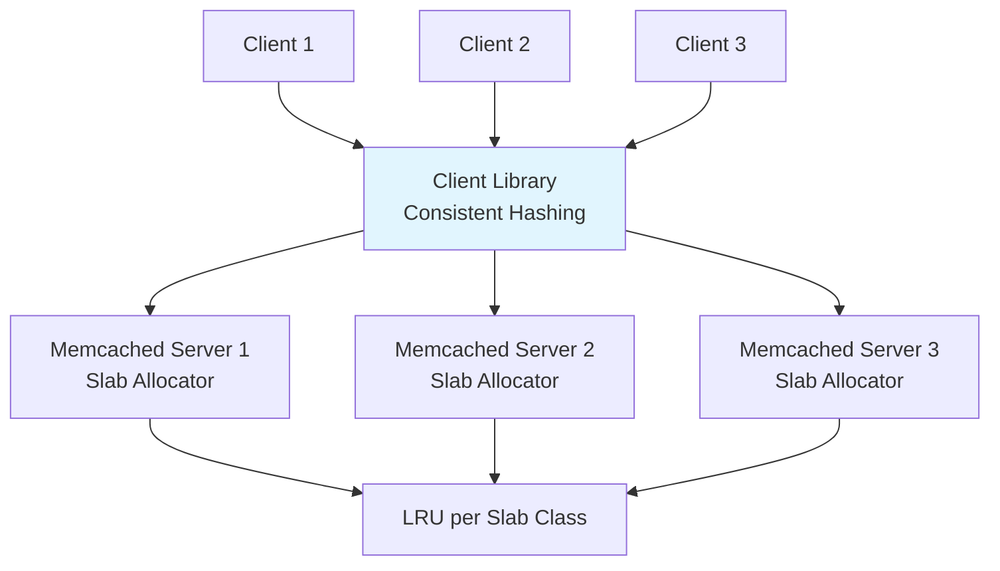
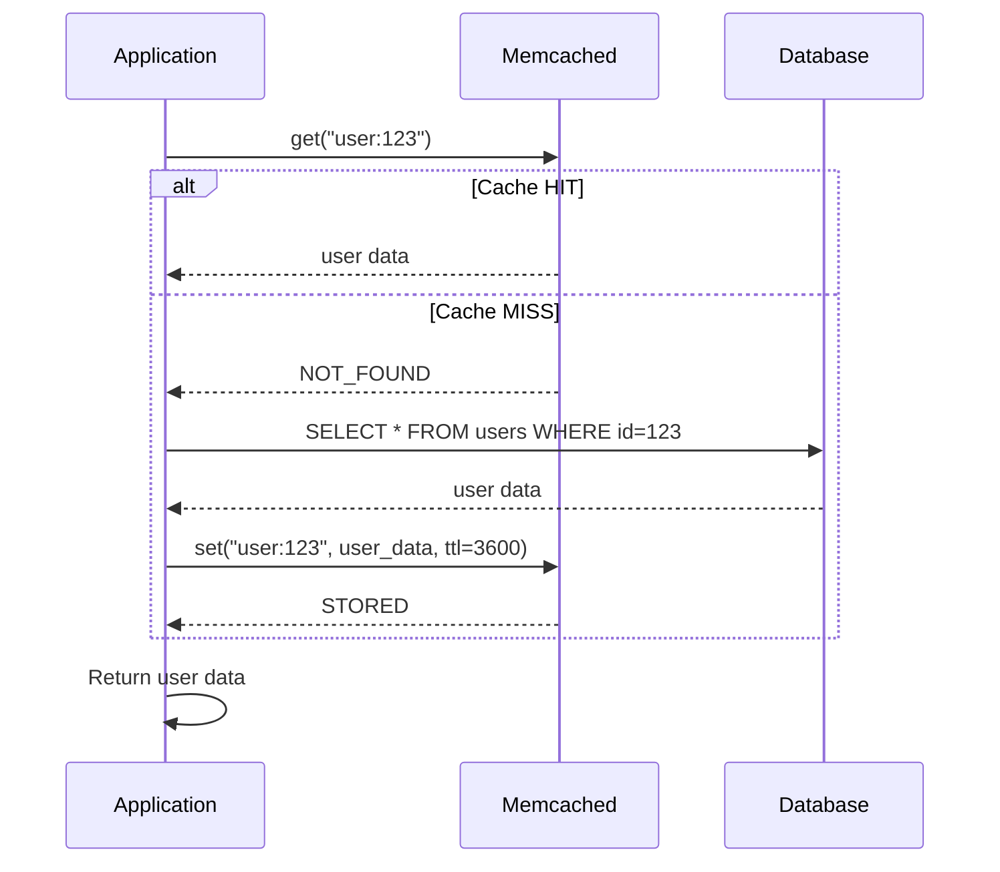
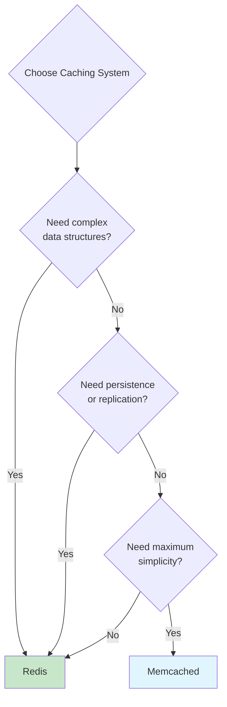

# Memcached

## Overview

Memcached is a free, open-source, high-performance, distributed memory object caching system. It was originally developed by Brad Fitzpatrick in 2003 for LiveJournal and has become one of the most widely deployed caching systems in the world, used by Facebook, Twitter, YouTube, and Wikipedia. Memcached is designed for simplicity — it's a distributed hash table in memory with no persistence, no complex data structures, and minimal configuration.

## Detailed Explanation

### Memcached Architecture



### Key Features

| Feature | Description |
|---------|-------------|
| **Simple key-value** | Only stores strings (serialized objects) |
| **Multi-threaded** | Uses multiple threads for concurrency |
| **No persistence** | Purely in-memory, data lost on restart |
| **Distributed** | Clients handle distribution via consistent hashing |
| **Slab allocator** | Memory management with fixed-size chunks |
| **LRU eviction** | Per-slab-class LRU for memory management |
| **Zero CAS overhead** | Compare-and-swap for optimistic locking |

### How Memcached Works



### Slab Allocator

Memcached uses a **slab allocator** to manage memory efficiently:

```mermaid
flowchart TD
    A[Memory Pool] --> B[Slab Class 1<br/>64 bytes chunks]
    A --> C[Slab Class 2<br/>128 bytes chunks]
    A --> D[Slab Class 3<br/>256 bytes chunks]
    A --> E[Slab Class N<br/>1MB chunks]

    B --> B1[Page 1: [64B][64B][64B]...]
    B --> B2[Page 2: [64B][64B][64B]...]
    C --> C1[Page 1: [128B][128B]...]

    style B fill:#e1f5fe
```

**How it works:**
1. Memory is divided into **slab classes**, each with a fixed chunk size
2. Each slab class has **pages** (1MB each) divided into equal-size chunks
3. When storing a value, Memcached picks the smallest slab class that fits
4. Each slab class has its own LRU list

**Slab class sizes (default):**
```
Class 1:   64 bytes  (item overhead: 48 bytes → 16 bytes data)
Class 2:  128 bytes  (80 bytes data)
Class 3:  256 bytes  (208 bytes data)
...
Class N:   1 MB
Growth factor: 1.25 (default)
```

### Memcached Commands

```bash
# Basic operations
set key flags ttl bytes\r\nvalue\r\n      # Store value
get key\r\n                               # Retrieve value
delete key\r\n                            # Delete key
incr key delta\r\n                        # Increment numeric value
decr key delta\r\n                        # Decrement numeric value

# Multiple operations
get key1 key2 key3\r\n                    # Multi-get (batch)

# Compare and swap
gets key\r\n                              # Get with CAS token
cas key flags ttl bytes cas_token\r\n     # Set only if CAS matches

# Stats
stats\r\n                                 # Server statistics
stats slabs\r\n                           # Slab statistics
stats items\r\n                           # Item statistics
```

**Python example:**
```python
import pymemcache

client = pymemcache.Client(('localhost', 11211))

# Set with 1-hour TTL
client.set('user:123', '{"name":"Alice"}', expire=3600)

# Get
user = client.get('user:123')

# Multi-get
users = client.get_many(['user:123', 'user:456', 'user:789'])

# Increment
client.set('counter:views', '0')
client.incr('counter:views', 1)

# CAS (compare-and-swap)
value, cas = client.gets('user:123')
# Modify value...
client.cas('user:123', new_value, cas)  # Fails if modified by another client
```

### Consistent Hashing for Distribution

Memcached clients use consistent hashing to determine which server stores a key:

```mermaid
flowchart LR
    A[Key: "user:123"] --> B[hash("user:123") = 4567]
    B --> C[4567 maps to Server 2<br/>on consistent hash ring]
    C --> D[Server 2 stores the value]

    style D fill:#c8e6c9
```

**Consistent hashing benefits:**
- Adding/removing a server only redistributes ~1/N keys
- Minimal cache misses during scaling
- No central coordination needed

### Memcached vs. Redis

| Aspect | Memcached | Redis |
|--------|-----------|-------|
| **Data structures** | String only | String, Hash, List, Set, Sorted Set, Stream |
| **Persistence** | None | RDB, AOF |
| **Threading** | Multi-threaded | Single-threaded (I/O threads in 6+) |
| **Memory efficiency** | Better (slab allocator) | Higher overhead per key |
| **Replication** | None | Built-in master-replica |
| **Clustering** | Client-side (consistent hashing) | Built-in Redis Cluster |
| **Max value size** | 1MB (default) | 512MB |
| **Atomic operations** | CAS | Lua scripts, transactions |
| **Pub/Sub** | No | Yes |
| **Best for** | Simple caching, high throughput | Rich data structures, complex caching |

### When to Choose Memcached



**Choose Memcached when:**
- Simple key-value caching (serialized objects)
- Maximum memory efficiency needed
- Multi-threaded performance required
- No need for persistence or complex operations
- Already have external replication/HA solutions

**Choose Redis when:**
- Need data structures (lists, sets, sorted sets)
- Need persistence
- Need pub/sub or streaming
- Need built-in replication/clustering
- Need atomic operations beyond CAS

### Facebook's Memcached Architecture

Facebook uses one of the largest Memcached deployments:

```
Facebook's Memcached:
  - Trillions of items cached
  - Petabytes of memory
  - Hundreds of millions of requests/second

Architecture:
  1. Client-side consistent hashing
  2. Regional caching (cache near users)
  3. Cross-region replication (for cache warming)
  4. Memcache pools (different pools for different data)
  5. Mcrouter (proxy layer for routing and replication)
```

### Memory Management and Eviction

```
Memcached Memory Management:

1. Pre-allocate memory at startup (-m flag)
2. Divide into slab classes
3. Each slab class has LRU list

Eviction:
  - Per-slab-class LRU (not global)
  - When a slab class is full, evict oldest item in that class
  - Items with TTL=0 (never expire) are evicted first
  - No persistence — all data lost on restart

Memory fragmentation:
  - Slab allocator can waste memory if item sizes don't match slab sizes
  - "memcached -f 1.25" adjusts growth factor
  - Monitor with "stats slabs" command
```

### Monitoring Memcached

```bash
# Key metrics
stats
# STAT pid 12345
# STAT uptime 86400
# STAT curr_items 1000000
# STAT total_items 5000000
# STAT bytes 1073741824
# STAT curr_connections 500
# STAT cmd_get 10000000
# STAT cmd_set 5000000
# STAT get_hits 9500000
# STAT get_misses 500000
# STAT evictions 1000

# Hit ratio
# hit_ratio = get_hits / cmd_get = 9500000 / 10000000 = 95%

# Slab statistics
stats slabs
# Shows memory usage per slab class
```

## Interview Questions

### Q1: What is the slab allocator in Memcached?
**Answer:** The slab allocator is Memcached's memory management system. Instead of malloc/free for each item, Memcached pre-allocates memory into **slab classes**, each with fixed-size chunks. When storing a value, it picks the smallest chunk size that fits. This eliminates memory fragmentation (within a slab class) and makes allocation/deallocation O(1). The downside is wasted space if items are much smaller than the chunk size.

### Q2: How does Memcached handle distribution across multiple servers?
**Answer:** Memcached uses **client-side consistent hashing**. The client library:
1. Hashes each server address to points on a virtual ring
2. Hashes the key to find its position on the ring
3. Walks clockwise to find the first server

When servers are added/removed, only ~1/N keys need to be redistributed. There's no central coordinator — the client decides where each key goes.

### Q3: What happens when Memcached runs out of memory?
**Answer:** Memcached uses **per-slab-class LRU eviction**. When a slab class is full and a new item needs that size:
1. The least recently used item in that slab class is evicted
2. The new item takes its place
3. If no evictable items exist, the set fails (returns SERVER_ERROR)

Note: Eviction is per slab class, not global. This means a hot slab class might evict items while another class has free space.

### Q4: How is Memcached different from Redis for simple caching?
**Answer:** For simple key-value caching:
- **Memcached** is more memory-efficient (slab allocator vs. Redis overhead)
- **Memcached** is multi-threaded (better CPU utilization)
- **Redis** has richer features (persistence, replication, data structures)
- **Redis** has better operational tools (Lua scripting, transactions)

If you only need "get/set/delete" with maximum throughput, Memcached is slightly better. If you need any advanced features, Redis is the clear choice.

### Q5: What is the "thundering herd" problem and how does Memcached handle it?
**Answer:** The thundering herd occurs when a popular cached item expires and many requests simultaneously miss the cache, all hitting the database. Memcached solutions:
1. **CAS (Compare-and-Swap)** — First client to get the miss wins the CAS token; others wait
2. **Lease-based** — Memcached gives a "lease" to one client to rebuild; others get a short delay
3. **Stale-while-revalidate** — Return stale data while one client refreshes

Facebook uses a lease mechanism built into their modified Memcached (memcachelint).

## Common Mistakes

- ❌ **Assuming Memcached is persistent** — It's purely in-memory; data lost on restart
- ❌ **Not monitoring slab fragmentation** — Wasted memory from size mismatches
- ❌ **Using too few servers** — Single server = single point of failure
- ❌ **Ignoring the 1MB value limit** — Default max item size is 1MB
- ❌ **Not setting TTL** — Items live forever without TTL, causing memory exhaustion
- ❌ **Confusing Memcached with Redis** — They have different feature sets and use cases

## Summary

| Aspect | Details |
|--------|---------|
| **Type** | Distributed in-memory cache |
| **Data model** | Simple key-value (strings) |
| **Memory** | Slab allocator, pre-allocated |
| **Distribution** | Client-side consistent hashing |
| **Persistence** | None |
| **Threading** | Multi-threaded |
| **Best for** | Simple caching at massive scale |

Memcached remains relevant for large-scale caching where simplicity and memory efficiency matter. For most new projects, Redis is the better choice due to its richer feature set.

## Cross-References

- [Redis](./redis.md) — feature-rich caching alternative
- [Query Cache](./query-cache.md) — database-level caching
- [Buffer Pool](./buffer-pool.md) — database page caching
- [Sharding](../distributed/sharding.md) — data distribution strategies
- [Consistent Hashing](../distributed/sharding.md) — distribution mechanism


## Cross References

- [Redis](../dbms/caching/redis.md)
- [Consistent Hashing](../distributed/partitioning/consistent-hashing.md)
- [Buffer Pool](../dbms/caching/buffer-pool.md)
- [LRU (OS)](../os/virtual-memory/lru.md)
