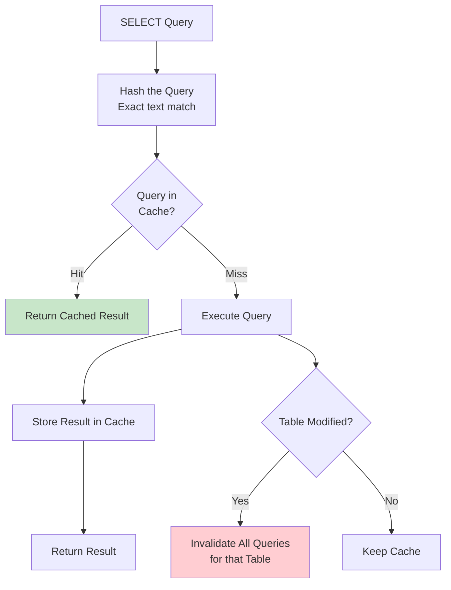
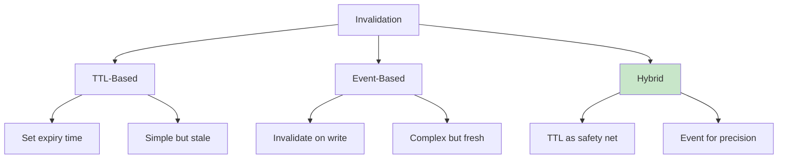

# Query Cache

## Overview

Query Cache is a database-level feature that stores the results of SELECT queries in memory. When the same query is executed again, the cached result is returned without re-executing the query. While conceptually simple, query caching has significant limitations and has been removed from many modern databases in favor of application-level caching (Redis, Memcached).

## Detailed Explanation

### How Query Cache Works



### Query Cache in MySQL (Deprecated)

MySQL had a built-in query cache (removed in MySQL 8.0):

```sql
-- Enable query cache
SET GLOBAL query_cache_type = 1;
SET GLOBAL query_cache_size = 1048576;  -- 1MB

-- Check status
SHOW STATUS LIKE 'Qcache%';
```

**MySQL Query Cache limitations:**
1. **Exact match required** — Query text must match byte-for-byte
2. **Table-level invalidation** — Any write to a table invalidates ALL cached queries for that table
3. **Global mutex** — Single lock for all cache operations (bottleneck)
4. **No prepared statement support** — Different parameter values = different cache entries
5. **Fragmentation** — Cache degrades over time

**Why MySQL removed it:**
```
Problem scenario:
  Table 'orders' has 1000 cached queries
  One INSERT into 'orders' → All 1000 queries invalidated!
  
  Write-heavy workload → Cache constantly invalidated → More overhead than benefit
```

### PostgreSQL Approach

PostgreSQL has **no built-in query cache**. Instead, it relies on:
1. **Buffer pool** — Caches data pages (not query results)
2. **Prepared statements** — Cached execution plans
3. **External caches** — Redis, Memcached, pgBouncer

**Why PostgreSQL doesn't have query cache:**
- Table-level invalidation is too coarse
- The buffer pool already caches hot data pages
- Application-level caching is more flexible and efficient

### Application-Level Query Caching

The modern approach — cache at the application layer:

```python
import redis
import json
import hashlib

redis_client = redis.Redis()

def cached_query(sql, params=None, ttl=3600):
    # Generate cache key from query + params
    cache_key = f"query:{hashlib.md5(f'{sql}:{params}'.encode()).hexdigest()}"
    
    # Check cache
    cached = redis_client.get(cache_key)
    if cached:
        return json.loads(cached)  # Cache HIT
    
    # Execute query
    result = db.execute(sql, params)
    
    # Store in cache
    redis_client.setex(cache_key, ttl, json.dumps(result))
    
    return result

# Usage
users = cached_query(
    "SELECT * FROM users WHERE status = %s AND created_at > %s",
    params=['active', '2024-01-01'],
    ttl=300  # 5 minutes
)
```

### Cache Key Design

Effective cache key design is critical:

```python
# Bad: Just the SQL (ignores parameters)
key = f"query:{hash(sql)}"

# Good: Include all parameters
key = f"query:{hash(f'{sql}:{sorted(params.items())}')}"
```

**Key patterns:**

| Pattern | Example | Use Case |
|---------|---------|----------|
| `user:{id}` | `user:123` | Single entity |
| `query:{hash}` | `query:a1b2c3...` | Query result |
| `list:{type}:{page}` | `list:orders:1` | Paginated lists |
| `agg:{type}:{range}` | `agg:daily:2024-01` | Aggregations |

### Cache Invalidation Strategies



**Event-Based Invalidation:**
```python
def update_user(user_id, data):
    # Update database
    db.execute("UPDATE users SET ... WHERE id = ?", user_id)
    
    # Invalidate specific cache entries
    redis.delete(f"user:{user_id}")
    
    # Invalidate related query caches
    # Option 1: Delete specific patterns
    for key in redis.scan_iter(f"query:*user*"):
        redis.delete(key)
    
    # Option 2: Use tags for bulk invalidation
    # Store: cache_key → tags mapping
    # On invalidation: delete all keys with affected tags
```

### Materialized Views as Query Cache

Some databases support **materialized views** — pre-computed query results stored as tables:

```sql
-- Create materialized view
CREATE MATERIALIZED VIEW daily_sales AS
SELECT date, SUM(amount) as total, COUNT(*) as count
FROM orders
GROUP BY date;

-- Query the view (reads pre-computed results)
SELECT * FROM daily_sales WHERE date = '2024-01-15';

-- Refresh when data changes
REFRESH MATERIALIZED VIEW daily_sales;
```

**Pros:**
- Database-managed, no application code needed
- Supports indexes
- Consistent with database transactions

**Cons:**
- Refresh can be expensive
- Not real-time (unless incremental refresh)
- Storage overhead

### Query Cache vs. Buffer Pool

| Aspect | Query Cache | Buffer Pool |
|--------|-------------|-------------|
| **Caches** | Query results | Disk pages |
| **Granularity** | Result sets | 8-16KB pages |
| **Hit condition** | Exact query match | Page in memory |
| **Invalidation** | Table-level (coarse) | Page-level (fine) |
| **Overhead** | High (result serialization) | Low (page pointer) |
| **Modern usage** | Rare (removed from MySQL) | Universal |

## Interview Questions

### Q1: Why was MySQL's query cache removed in version 8.0?
**Answer:** The MySQL query cache had several fundamental problems:
1. **Table-level invalidation** — Any write to a table invalidated ALL cached queries for that table, making it useless for write-heavy workloads
2. **Global mutex** — A single lock for all cache operations became a bottleneck under high concurrency
3. **Exact text matching** — Slightly different queries (whitespace, comments) couldn't share cache
4. **Inconsistent with prepared statements** — Each parameter combination was a separate cache entry

The overhead of maintaining the cache often exceeded the benefit, so MySQL 8.0 removed it in favor of application-level caching.

### Q2: When should you use query caching?
**Answer:** Query caching is beneficial when:
1. **Read-heavy workload** — >90% reads, <10% writes
2. **Expensive queries** — Aggregations, joins, subqueries that take seconds
3. **Data tolerance** — Some staleness is acceptable (seconds to minutes)
4. **Repeated queries** — Same queries executed frequently

Don't cache when:
- Write-heavy (cache constantly invalidated)
- Highly unique queries (low hit rate)
- Real-time accuracy required

### Q3: What is the difference between query cache and buffer pool?
**Answer:** 
- **Query cache** stores **query results** — the final output of a query. Hit condition: exact query text match.
- **Buffer pool** stores **disk pages** — raw data blocks. Hit condition: page is in memory.

The buffer pool benefits ALL queries that access cached pages, regardless of query text. The query cache benefits only exact repeated queries. The buffer pool is always beneficial; query cache is only beneficial for repeated identical queries.

### Q4: How do you invalidate a query cache when data changes?
**Answer:** Three strategies:
1. **TTL** — Set expiry time; simplest but data may be stale
2. **Event-based** — Invalidate on write operations; precise but complex
3. **Tag-based** — Group cache entries by tags (e.g., "user:123"); invalidate all entries with a tag

For SQL queries, the challenge is identifying which cache entries depend on which tables/columns. Solutions:
- Parse SQL to extract table dependencies
- Use naming conventions for cache keys
- Accept coarse invalidation (all queries for a table)

### Q5: What are materialized views and how do they compare to query caching?
**Answer:** Materialized views are pre-computed query results stored as tables in the database. They're like a persistent, database-managed query cache.

**Advantages over query cache:**
- Support indexes (fast lookups)
- Database-managed consistency
- Incremental refresh possible

**Disadvantages:**
- Storage overhead (must store the full result)
- Refresh cost (can be expensive)
- Not real-time (unless triggers or incremental refresh)

Materialized views are best for expensive aggregations that change infrequently (e.g., daily reports).

## Common Mistakes

- ❌ **Caching everything** — Low hit-rate caches waste memory and add complexity
- ❌ **Not invalidating properly** — Stale data causes bugs
- ❌ **Cache key collisions** — Different queries mapping to same key
- ❌ **Ignoring cache overhead** — Serialization, network, memory all have costs
- ❌ **Relying solely on query cache** — Buffer pool and indexes are more fundamental

## Summary

| Approach | Pros | Cons |
|----------|------|------|
| **MySQL Query Cache** | Simple, built-in | Coarse invalidation, bottleneck, removed in 8.0 |
| **Application Cache (Redis)** | Flexible, fine-grained | Requires code changes |
| **Materialized Views** | Database-managed, indexable | Refresh overhead, storage |

Modern systems prefer application-level caching (Redis) over database query caching for flexibility and control.

## Cross-References

- [Buffer Pool](./buffer-pool.md) — page-level caching
- [Redis](./redis.md) — application-level caching
- [Memcached](./memcached.md) — simpler caching alternative
- [Query Processing](../query-processing/) — what caching avoids re-executing


## Cross References

- [Buffer Pool](../dbms/caching/buffer-pool.md)
- [Query Optimization](../dbms/query-processing/optimization.md)
- [Redis](../dbms/caching/redis.md)
- [Cache Hierarchy](../arch/memory-hierarchy/README.md)
