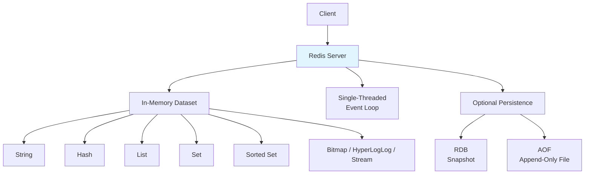
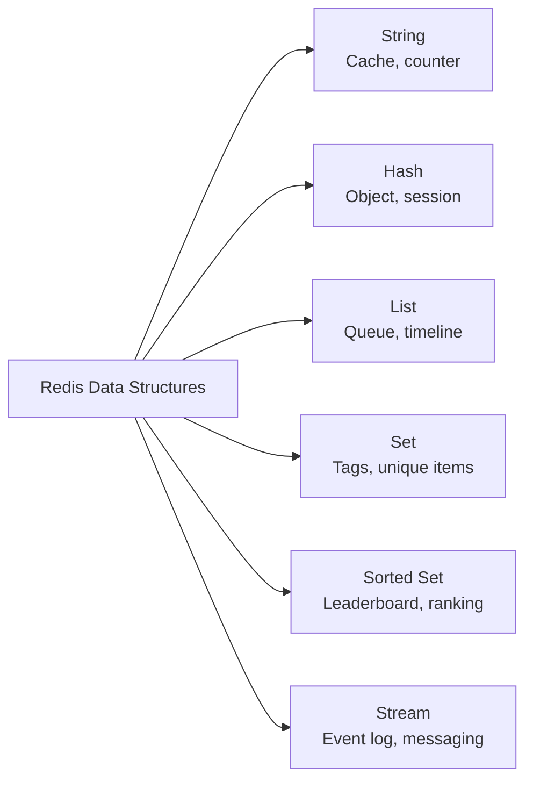
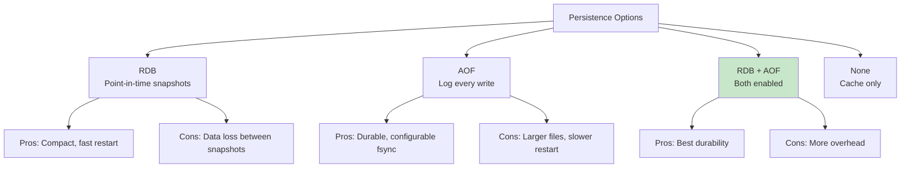
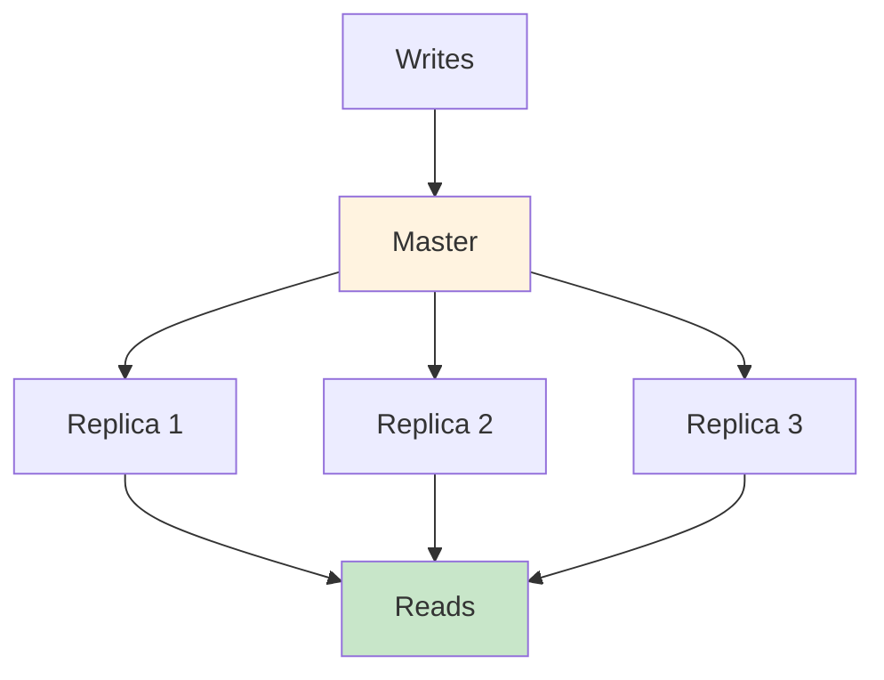
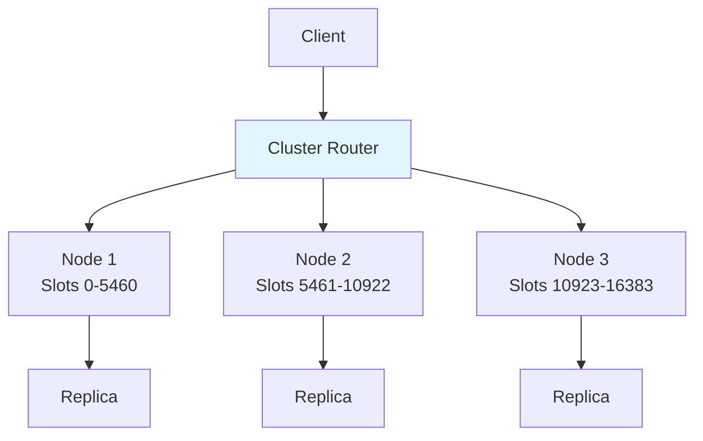

# Redis

## Overview

Redis (Remote Dictionary Server) is an open-source, in-memory data structure store that can be used as a database, cache, and message broker. It's the most popular caching solution in the industry, known for its speed (sub-millisecond latency), rich data structures, and versatility. Redis is a must-know for system design and backend interviews.

## Detailed Explanation

### Redis Architecture



### Key Features

| Feature | Description |
|---------|-------------|
| **In-memory** | All data in RAM, sub-millisecond latency |
| **Rich data structures** | Strings, Hashes, Lists, Sets, Sorted Sets, etc. |
| **Single-threaded** | No lock contention, simple concurrency model |
| **Persistence** | Optional RDB snapshots and AOF logging |
| **Replication** | Master-replica for high availability |
| **Clustering** | Horizontal sharding across nodes |
| **Pub/Sub** | Built-in message broker |
| **Lua scripting** | Server-side scripting for atomic operations |
| **TTL** | Built-in key expiry |

### Data Structures and Use Cases



#### String
```bash
SET user:123 '{"name":"Alice","email":"alice@example.com"}'
GET user:123
SET counter:page_views 0
INCR counter:page_views          # Atomic increment
INCRBY counter:page_views 10     # Increment by 10
SET session:abc "data" EX 3600   # With 1-hour expiry
```

#### Hash
```bash
HSET user:123 name "Alice" email "alice@example.com" age 30
HGET user:123 name              # "Alice"
HGETALL user:123                # All fields
HINCRBY user:123 age 1          # Increment age
```

**Use case:** Store user profiles, sessions, objects with multiple fields.

#### List
```bash
LPUSH queue:tasks "task1"       # Push to left
RPUSH queue:tasks "task2"       # Push to right
LPOP queue:tasks                # Pop from left (FIFO queue)
RPOP queue:tasks                # Pop from right (LIFO stack)
LRANGE queue:tasks 0 -1         # Get all elements
BLPOP queue:tasks 30            # Blocking pop (wait 30s)
```

**Use case:** Message queues, recent activity feeds, task queues.

#### Set
```bash
SADD user:123:tags "python" "redis" "backend"
SMEMBERS user:123:tags          # All tags
SISMEMBER user:123:tags "redis" # Check membership
SINTER user:123:tags user:456:tags  # Common tags (intersection)
SUNION user:123:tags user:456:tags  # All tags (union)
```

**Use case:** Unique items, tags, set operations (intersection, union, difference).

#### Sorted Set
```bash
ZADD leaderboard 100 "Alice"
ZADD leaderboard 85 "Bob"
ZADD leaderboard 92 "Charlie"
ZREVRANGE leaderboard 0 2 WITHSCORES    # Top 3 (by score desc)
ZRANK leaderboard "Bob"                  # Bob's rank
ZINCRBY leaderboard 10 "Bob"             # Add 10 to Bob's score
ZRANGEBYSCORE leaderboard 90 100         # Scores between 90-100
```

**Use case:** Leaderboards, priority queues, time-series data.

### Caching Patterns with Redis

#### Cache-Aside (Lazy Loading)
```python
def get_user(user_id):
    # Check cache first
    user = redis.get(f"user:{user_id}")
    if user:
        return json.loads(user)
    
    # Cache miss - load from DB
    user = db.query("SELECT * FROM users WHERE id = ?", user_id)
    if user:
        redis.setex(f"user:{user_id}", 3600, json.dumps(user))
    return user

def update_user(user_id, data):
    db.update("UPDATE users SET ...", data)
    redis.delete(f"user:{user_id}")  # Invalidate cache
```

#### Write-Through
```python
def save_user(user_id, data):
    # Write to both cache and DB
    db.update("UPDATE users SET ...", data)
    redis.setex(f"user:{user_id}", 3600, json.dumps(data))
```

#### Write-Behind (Write-Back)
```python
def save_user(user_id, data):
    # Write to cache only
    redis.setex(f"user:{user_id}", 3600, json.dumps(data))
    # Queue async DB write
    redis.rpush("write_queue", json.dumps({"user_id": user_id, "data": data}))
```

### Redis Persistence



**RDB (Redis Database):**
```
# Save snapshot every 60 seconds if >= 1000 keys changed
save 60 1000

# Trigger manually
BGSAVE  # Background save
```

**AOF (Append-Only File):**
```
appendonly yes
appendfsync everysec  # fsync every second (good balance)
# appendfsync always  # fsync every write (slow but safe)
# appendfsync no      # Let OS decide (fastest, least safe)
```

### Redis Replication



```bash
# Replica configuration
REPLICAOF 192.168.1.100 6379

# Master checks
INFO replication
```

**Replication features:**
- Asynchronous by default (eventual consistency)
- Partial resynchronization after disconnect
- Read replicas for scaling reads

### Redis Cluster

For horizontal scaling beyond a single machine:



**Hash slot mechanism:**
```python
slot = CRC16(key) % 16384
# Key "user:123" → slot 4567 → Node 2
```

### Common Redis Interview Commands

```bash
# Performance
INFO                    # Server stats
INFO memory            # Memory usage
SLOWLOG GET 10         # Slow queries
CLIENT LIST            # Connected clients

# Key management
KEYS user:*            # Find keys (DANGEROUS in production!)
SCAN 0 MATCH user:*   # Safe iteration
TTL key                # Remaining TTL
PERSIST key            # Remove TTL

# Memory
MEMORY USAGE key       # Bytes used by key
CONFIG SET maxmemory 2gb  # Memory limit
CONFIG SET maxmemory-policy allkeys-lru  # Eviction policy
```

## Interview Questions

### Q1: Why is Redis single-threaded and how is it still fast?
**Answer:** Redis is single-threaded for the **command execution** (event loop), which eliminates lock contention and simplifies the code. It's fast because:
1. **In-memory** — No disk I/O for reads/writes
2. **Efficient data structures** — Optimized for each use case
3. **Non-blocking I/O** — Uses epoll/kqueue for handling thousands of connections
4. **Simple operations** — Most operations are O(1) or O(log N)

Redis can handle 100,000+ operations per second on a single thread. For CPU-bound operations (Lua scripts, big sorted sets), Redis 6+ supports I/O threads.

### Q2: How do you choose between Redis data structures?
**Answer:** 
- **String** — Simple key-value, counters, cached JSON objects
- **Hash** — Object with multiple fields (user profile, session data)
- **List** — Ordered collection, queues, recent items (FIFO/LIFO)
- **Set** — Unique items, membership checking, set operations
- **Sorted Set** — Ranked data, leaderboards, time-series with scores
- **Stream** — Event log, message queue with consumer groups
- **HyperLogLog** — Approximate counting of unique items (very memory efficient)
- **Bitmap** — Feature flags, user activity tracking

### Q3: What happens when Redis runs out of memory?
**Answer:** Redis uses an **eviction policy** to remove keys when `maxmemory` is reached:
- **noeviction** — Return error on write (default)
- **allkeys-lru** — Evict least recently used key (any key)
- **volatile-lru** — Evict LRU key that has TTL set
- **allkeys-lfu** — Evict least frequently used key
- **volatile-ttl** — Evict key with shortest TTL
- **allkeys-random** — Evict random key

For caching, use **allkeys-lru**. For mixed data (some persistent, some cached), use **volatile-lru**.

### Q4: How do you handle cache stampede in Redis?
**Answer:** Cache stampede occurs when many requests miss cache simultaneously and all hit the database. Solutions:

1. **Distributed lock (SETNX):**
```python
if redis.set("lock:user:123", "1", nx=True, ex=10):
    # Only this request loads from DB
    user = db.get_user(123)
    redis.setex("user:123", 3600, user)
    redis.delete("lock:user:123")
else:
    # Wait and retry
    time.sleep(0.1)
    return redis.get("user:123")
```

2. **Probabilistic early refresh:**
```python
ttl = redis.ttl(key)
if ttl < 300 and random.random() < 0.1:  # 10% chance when TTL < 5min
    refresh_cache(key)
```

### Q5: What is Redis Cluster and how does it scale?
**Answer:** Redis Cluster provides horizontal scaling by sharding data across multiple nodes:
- **16,384 hash slots** distributed across nodes
- Each key maps to a slot: `CRC16(key) % 16384`
- Each node owns a range of slots
- Client receives MOVED redirect if key is on different node
- Each node has replicas for fault tolerance

**Limitations:**
- Multi-key operations only work if keys are in same slot (use `{hash_tag}`)
- No cross-slot transactions (limited to same-slot operations)
- Cluster management complexity

## Common Mistakes

- ❌ **Using KEYS in production** — Blocks the event loop; use SCAN instead
- ❌ **Not setting TTL** — Cache entries live forever, causing memory issues
- ❌ **Storing large values** — Redis is for small, hot data; not for large objects
- ❌ **Ignoring memory limits** — Set maxmemory and eviction policy
- ❌ **Using Redis as primary database** — It's a cache/secondary store; persistence is optional
- ❌ **Not considering serialization overhead** — JSON serialization adds CPU and memory

## Summary

| Aspect | Details |
|--------|---------|
| **Type** | In-memory data structure store |
| **Latency** | Sub-millisecond |
| **Data structures** | String, Hash, List, Set, Sorted Set, Stream |
| **Persistence** | RDB snapshots, AOF (optional) |
| **Scaling** | Replication + Cluster |
| **Best for** | Caching, session store, leaderboards, queues |

Redis is the de facto standard for application-level caching. Understanding its data structures, patterns, and operational considerations is essential for any backend engineer.

## Cross-References

- [Memcached](./memcached.md) — simpler caching alternative
- [Query Cache](./query-cache.md) — database-level caching
- [Buffer Pool](./buffer-pool.md) — database page caching
- [Distributed Caching](../distributed/) — caching in distributed systems
- [Consistency](../distributed/consistency.md) — cache consistency challenges


## Cross References

- [Memcached](memcached.md)
- [Consistent Hashing](../../distributed/partitioning/consistent-hashing.md)
- [Cache Hierarchy](../../arch/memory-hierarchy/README.md)
- [Pub/Sub](../../distributed/messaging/pubsub.md)
