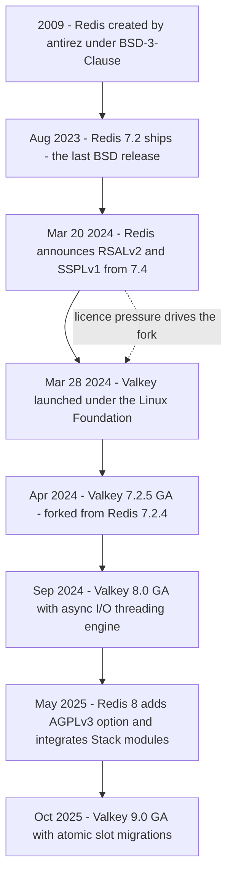
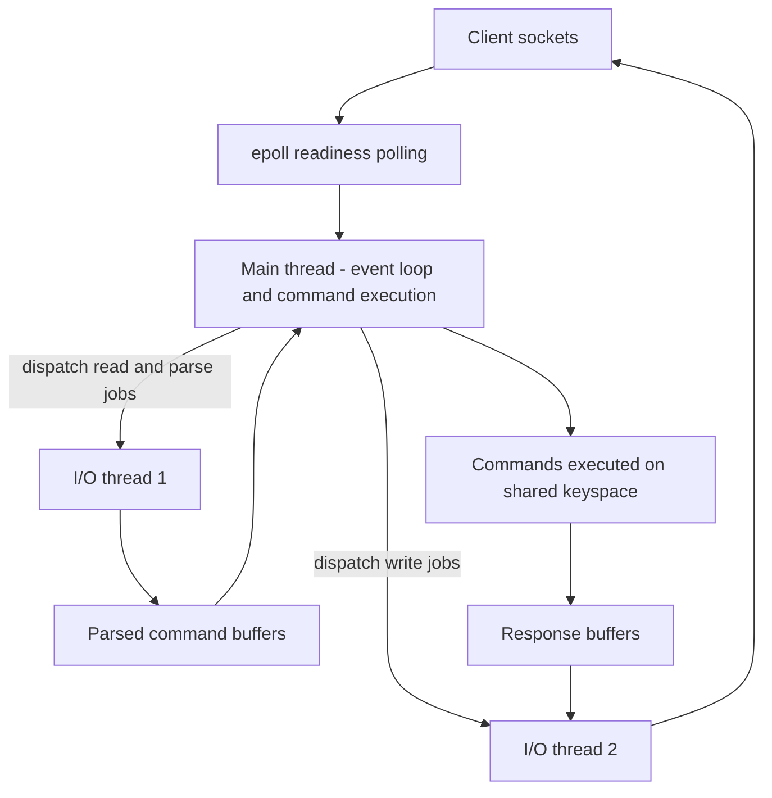
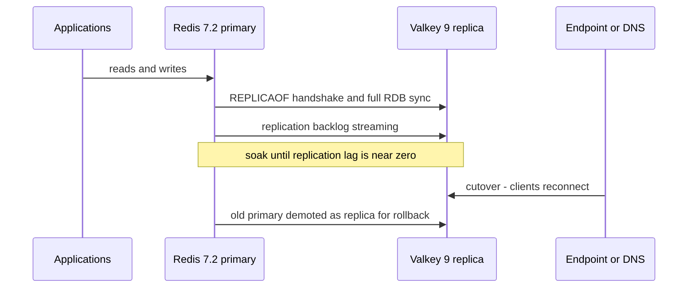

# Valkey: the Linux Foundation Fork of Redis

## Overview

Valkey is an open-source, BSD-3-Clause-licensed, in-memory data structure server created in March 2024 as a community fork of Redis under the Linux Foundation. It speaks the same RESP2/RESP3 wire protocol, implements the Redis 7.x command set, and loads the same RDB and AOF persistence files, which is why it is marketed — and widely used — as a drop-in replacement for Redis OSS. Its reason to exist is licence and governance neutrality; its reason to keep existing is that it has since developed its own engineering identity: a rebuilt asynchronous I/O-threading engine in 8.0, atomic slot migrations and hash-field expiration in 9.0, first-party modules for JSON, Bloom filters, and vector search, and the foundation-maintained Glide client libraries.

For interview purposes Valkey matters in three distinct ways. First, it is now the default key-value cache shipped by several Linux distributions and by major managed services, so you may be running it without having explicitly chosen it. Second, it is the cleanest recent case study of what happens to a ubiquitous open-source project when its steward changes the licence: forks, governance moves, and service-provider politics can be discussed concretely rather than hypothetically. Third, the Valkey 8.0 I/O redesign is the modern, numbers-backed answer to the classic question "why is Redis single-threaded and still fast?" — the command-execution model did not change, but the socket pipeline around it did.

The [Redis](./redis.md) page in this book covers data structures, persistence, and cluster basics; this page deliberately complements it with the fork story, the threading-engine deltas, client and module compatibility, and the operational migration picture. Where the two overlap — for example cluster slot arithmetic — this page cross-links rather than re-explains.

## The Fork Story: a Licence Change and Three Busy Weeks

Redis was created in 2009 by Salvatore Sanfilippo ("antirez") and licensed BSD-3-Clause from day one, a permissive licence that lets anyone embed, resell, modify, or ship the software with nothing more than an attribution notice in return. That licence choice is a large part of why Redis ended up everywhere: inside Linux distributions, in every cloud provider's managed catalogue, in products ranging from GitHub's queues to session stores at virtually every internet company, and as the default target of hundreds of client libraries. Permissive licensing also shaped the engineering culture — Redis's famously readable C codebase (`t_string.c`, `dict.c`, `ae.c`) was always meant to be forked, studied, and embedded. Maintenance stewardship later moved through VMWare and Pivotal sponsorship into Redis Ltd (formerly Redis Labs), which funded development while selling commercial products around the open core.

On March 20, 2024, Redis Ltd announced that, starting with Redis 7.4, the software would be distributed under a dual licence of RSALv2 or SSPLv1. Neither is an OSI-approved open-source licence. RSALv2 is "source-available": you may use, modify, and redistribute it, but not if your product competes with Redis Ltd's, with the managed-service case written in explicitly. SSPLv1 requires anyone offering the software as a service to release the entire service-management stack — monitoring, backup, orchestration — under SSPL, an obligation no hyperscaler has ever accepted. The company's stated motivation was that cloud providers were extracting enormous value from Redis without compensating or even licensing from the project. That argument has a real business rationale, but the effect was immediate: the software that thousands of distributions and platforms shipped as "open source" stopped being open source by the standard definition, and every downstream consumer had a legal decision to make.

The ecosystem responded in roughly three weeks, and the speed is itself the lesson. A coordination effort code-named PlaceholderKV became Valkey, hosted by the Linux Foundation and announced on March 28, 2024 with backing from AWS, Google Cloud, Oracle, Ericsson, and Snap, among others. The fork point was Redis 7.2.4 — deliberately chosen as the last BSD-licensed release — and the first Valkey release, 7.2.5, reached general availability in April 2024 with a stated focus on compatibility and licence continuity rather than new features. That "boring first release" was the point: it let every downstream consumer swap the package and keep everything else identical, converting a legal problem into a one-line deployment change.

The story has one more act. In May 2025, Redis 8 added AGPLv3 as a third licence option, joining RSALv2 and SSPLv1, and reintegrated the Redis Stack modules — JSON, time series, probability structures, and the search-and-query engine — into the single Redis package. AGPLv3 is genuinely open source, so "is Redis open source again?" now has a qualified yes. But the reconciliation was partial. Governance of Redis remains with Redis Ltd; the cloud providers had already built Valkey-based services and joined a foundation they co-govern; and AGPL's network copyleft obligation (running a modified copy as a network service requires offering your source) is a compliance posture many enterprises and vendors avoid by default. The ecosystem therefore did not re-merge: Valkey and Redis continue as separate fast-moving codebases sharing a common command surface, and "which licence is Redis under?" is now a question that has three answers.



| Date | Event | Why it matters |
|---|---|---|
| 2009 | Redis created by antirez under BSD-3-Clause | Permissive licence fuels universal adoption |
| Aug 2023 | Redis 7.2 released | Becomes the last BSD-licensed Redis |
| Mar 20, 2024 | Redis Ltd announces RSALv2/SSPLv1 dual licence from 7.4 | "Open source" status lost; managed-service restrictions added |
| Mar 28, 2024 | Valkey announced under the Linux Foundation | Vendor-neutral governance; fork of Redis 7.2.4 |
| Apr 2024 | Valkey 7.2.5 GA | Compatibility-first release; the drop-in story begins |
| Sep 2024 | Valkey 8.0 GA | New asynchronous I/O-threading engine; first real divergence |
| May 2025 | Redis 8 adds AGPLv3 option; Stack modules integrated | Partial reconciliation; tri-licence election required |
| Oct 2025 | Valkey 9.0 GA | Atomic slot migrations; hash-field expiration closes a Redis 7.4 gap |

## Architecture: Single-Threaded Execution on a Multi-Threaded I/O Engine

The threading debate in this ecosystem has a history worth one paragraph. Redis itself added an early `io-threads` option back in Redis 6, but it serialized most work against the main thread and rarely helped real workloads, so it stayed off by default and mostly off in practice. AWS separately built Enhanced I/O and Multiplexing into ElastiCache and MemoryDB to raise per-node performance for its own fleet, accumulating years of production evidence that threaded socket I/O was worth the complexity if execution stayed single-threaded. Valkey 8.0 is where that evidence was generalized and contributed upstream as the new default-capable engine. Knowing this lineage lets you answer "why did it take until 2024?" — the idea was old, the proving ground was a managed service, and the fork created the governance vehicle to donate it.

The classic Redis engine runs one main thread that does everything on the hot path: poll sockets with `epoll_wait`, read bytes, parse commands, execute them against the keyspace, and write responses. Single-threaded command execution is the memory-consistency story — every command is atomic with respect to all others, there are no per-key latches and no data-path deadlocks, and Lua scripts or `MULTI/EXEC` blocks behave predictably because nothing can interleave with them. It also keeps the implementation honest about complexity: no lock manager on the data path means no priority-inversion bugs to debug at 3 a.m. The cost is a ceiling. The main thread saturates exactly one core no matter how many cores the host has, and Valkey's profiling showed `epoll_wait` alone consuming more than 20 percent of main-thread time — pure syscall overhead — with the 7.x engine topping out around 380 thousand requests per second on a large AWS instance regardless of core count.

Valkey 8.0 (September 2024) rearchitected the socket pipeline while preserving that execution model. The work was contributed largely by AWS engineers drawing on the "Enhanced I/O and Multiplexing" features already running inside ElastiCache and MemoryDB, which is a good example of a fork absorbing production lessons faster than the upstream could. The design is a worker pool with two-phase barriers: the main thread runs the event loop and executes every command, while a configurable pool of I/O threads receives jobs — reading and parsing commands from client sockets, writing responses back, polling connection readiness, and freeing client memory. Each round trips through a barrier: the main thread dispatches a batch of jobs, the I/O threads work in parallel, they join, and only then does the main thread execute the parsed commands against the shared keyspace. Three refinements make this fast. The number of active I/O threads is tuned dynamically by the main thread according to current load. Per-client thread affinity keeps the same client on the same thread to preserve CPU-cache locality. And at most one thread — main or I/O — ever executes `epoll_wait` at a given moment, which removes polling races without giving up parallelism.



The measured results from the project's engineering blog are the numbers to quote in an interview. On an AWS C7g.16xlarge with 8 I/O threads, 3 million keys, 512-byte values, and 650 clients issuing sequential `SET`s, Valkey 8.0 reached roughly 1.19 million requests per second against 360 thousand for Valkey 7.2 — about a 230 percent throughput increase — while average latency dropped 69.8 percent, from 1.792 ms to 0.542 ms. Those figures include the new prefetch mechanism, which warms dictionary entries into CPU cache before execution and cuts cache misses on the main dictionary. The gains are not free parallelism in the general case: they scale with the fraction of time previously lost to socket I/O, so workloads with many connections, pipelining, or large payloads benefit most. A single hot key executing an O(N) command is still bounded by the one thread that runs commands, which is why sharding strategy has not been retired.

A useful mental model is to list what runs where, because every interview follow-up — atomicity, hot keys, latency tails — resolves against this partition.

- **Main thread only**: the event loop, command dispatch, all command execution against the keyspace, expiry and eviction decisions, and cluster message processing.
- **I/O threads**: socket reads and protocol parsing, response writes, readiness polling jobs, and client-object deallocation, all under main-thread orchestration.
- **Background threads**: persistence (RDB child process, AOF rewrite), replication transfer, and lazy freeing, unchanged from the Redis lineage.
- **Never threaded**: the command table, Lua/Function execution, and anything that reads or writes key data — this is the line that keeps the consistency story intact.

### Configuring and Testing the I/O Engine

The operational knob is `io-threads`, and its compiled default in both Valkey and Redis remains `1` — pure single-threaded — so threading is an explicit decision, not a silent upgrade. The Valkey documentation recommends enabling it only on hosts with at least three cores, suggesting roughly two or three I/O threads on a 4-core box and six on an 8-core box, and warns that the feature earns its keep only when the instance is already CPU-saturated. The old `io-threads-do-reads` toggle is deprecated in the new engine because reads and writes are threaded as one job model rather than two opt-in directions.

```text
# valkey.conf — I/O threading for a 4-core host
io-threads 3

# Measure before and after; match the benchmark's own threading
# valkey-benchmark -t set,get -n 3000000 -d 512 -c 650 --threads 3
```

Replication rides the same pool in recent versions: Valkey 8.1 offloads replication-stream reads on replicas and writes on primaries, which means replicas serve more read traffic while syncing, and full TLS syncs got up to 18 percent faster by removing redundant checksumming during diskless replication. Redis moved the same architectural direction in Redis 8 (May 2025), improving its own I/O threading on the same single-executor shape, so both projects now describe the same consensus design. What differs is implementation maturity and tuning defaults — and in an interview, being able to say "the model converged, the code did not" puts you ahead of most candidates.

### Why the Consistency Story Survives

The I/O threads never touch the keyspace. Parsing produces command objects; execution happens exclusively on the main thread between barrier points; responses are handed back as buffers for the I/O threads to flush. This is precisely the design boundary that lets the project keep describing itself as "single-threaded, simple, and primed for future enhancements" — no conversation about memory-model subtleties in command semantics, no per-command lock acquisition cost, and an API that can evolve without reasoning about races. Atomicity guarantees for scripts and transactions are inherited unchanged because the executor is unchanged. The worker-dispatch pattern here is the same shape as a generic I/O thread pool handing parsed work to a single consumer, which is why it composes cleanly with pipelining: batch sizes grow, barriers amortize, and the executor stays untouched.

Valkey 8.0 also shipped memory-efficiency work that changed the per-key cost function. Keys are now embedded in the main dictionary instead of living behind separate pointers, which the project measured as a 9-10 percent reduction in overall memory for workloads with 16-byte keys and small values. A per-slot dictionary replaced a slot-membership linked list, saving 16 bytes per key-value pair in cluster mode while also making slot-key enumeration cheaper for migration. None of this changes application semantics — it changes how much RAM your cache bill requires for the same keyspace.

## Compatibility: Protocol, Keyspace, Clients, and Modules

On the wire, Valkey is a Redis 7.2 server. It supports both RESP2 and RESP3 with the standard `HELLO` negotiation, so every mainstream client — Jedis, Lettuce, Redisson, redis-py, go-redis, node-redis — connects without code changes. The keyspace is command-compatible, persistence files load unchanged, and Redis 6 ACLs carry over, so users and permission rules migrate as configuration rather than as data conversion. Even observability was treated as a compatibility surface: Valkey's `INFO` output reports both `valkey_version` and `redis_version`, a deliberate decision so that monitoring dashboards and fleet scripts parsing the Redis field keep working during and after migration. The 8.0 release notes commit explicitly to "no backwards-incompatible changes to existing command syntax or responses".

```text
# Compatibility is visible, not just claimed
127.0.0.1:6379> INFO server
# redis_version:7.2.4      <- compatibility field, kept for tooling
# valkey_version:9.0.0     <- the real engine version
```

### Recent Feature Deltas on Both Sides

Command drift since the fork is real but trackable, and it flows in both directions. The table below is the delta inventory that matters for migration decisions; it changes with each release, so re-derive it from the release notes of the exact versions you run. The pattern to internalize is that both projects prioritize their own headline work first and backfill the other's features when users ask loudly enough.

| Capability | Redis | Valkey | Migration note |
|---|---|---|---|
| Hash-field expiration (HEXPIRE family) | 7.4+ | 9.0+ | Replicating from 7.4+ to pre-9.0 Valkey drops this feature |
| Conditional SET (IFEQ/IFNEQ compare-and-set) | — | 8.1+ | Saves a read-before-write round trip; Redis-native code must not depend on it |
| RDMA transport | — | 8.0+ experimental | Up to 275 percent throughput claim; niche hardware requirement |
| Dual-channel replication (RDB plus backlog in parallel) | — | 8.0+ | Heavy-read full syncs cut by up to 50 percent |
| JSON documents | Integrated in Redis 8 | valkey-json module | Different module, same data-format concept; test serialization |
| Vector similarity search | Integrated query engine in Redis 8 | valkey-search module | Both are HNSW-class; APIs differ |

Concretely: Redis 7.4 — the first RSAL/SSPL release — introduced hash-field expiration (`HEXPIRE` and friends); Valkey closed that gap in Valkey 9.0, two major versions later. In the other direction, Valkey added compare-and-set style conditional updates to `SET` (`IFEQ`/`IFNEQ`) in 8.1, saving a read-before-write round trip, and an experimental RDMA transport in 8.0 that the project measured at up to 275 percent throughput improvement on RDMA-capable hardware. The engineering rule this teaches: treat "Redis-compatible" as a lagging synchronization target, not a contract. Inventory your actual command surface — including Lua scripts and functions — before any cross-engine move, because the delta that bites is always application-specific.

The module story follows the same fork-point logic. Valkey implements the Redis 7.2 module API (the `RM_` interface), so modules compiled against a 7.2-era API generally load on Valkey, but module APIs added in Redis 7.4 and later are absent. The Redis Stack modules under their source-available licence are not shipped by the project; the foundation instead maintains first-party modules under its own GitHub organization: `valkey-json` for JSON documents, `valkey-bloom` for Bloom and Cuckoo filters, and `valkey-search` for vector similarity search, plus a Rust SDK for module authors. If your workload depends on RediSearch-grade query capabilities, check whether valkey-search covers your case or whether Redis 8's integrated query engine is the better fit before committing to either engine.

Glide ("General Language Independent Driver for the Enterprise") is the Valkey project's own client family, maintained by the foundation with a core written in Rust and thin language-specific extensions. It ships for Java, Python, Node.js, and Go, with C# and PHP in preview and more languages in development; it supports client-side caching on Java, Node, and Go, and provides documented migration paths from Jedis, Lettuce, Redisson, ioredis, and redis-py. Glide is an option, not a mandate — the protocol compatibility above means existing clients remain fully supported. Teams typically adopt it when they want one foundation-governed client contract across languages, or when client-side caching with consistent behaviour across SDKs is worth a library swap.

## Migration: Moving Workloads Between Redis and Valkey

There are three practical migration mechanics, and most real projects use the first. Replica-based switchover exploits the fact that a Valkey server can act as a replica of a Redis primary: provision the Valkey fleet, point it at the Redis primary with `REPLICAOF`, let it full-sync via the standard `PSYNC` handshake, and then flip client endpoints (DNS, connection strings, or service mesh configuration) and promote. Rollback is cheap if you keep the old Redis primary attached as a replica of the new Valkey primary during a soak window, because the same replication channel works in that direction. The version rule to respect is the standard replication rule — the replica should be the same version or newer than the primary — so Redis 7.2 primary to Valkey 8/9 replica is the canonical path. If the source is Redis 7.4 or newer, match features deliberately, because a pre-9.0 Valkey replica cannot replicate hash-field expirations it does not implement.

```text
# Replica-based switchover walkthrough
# 1. On the new Valkey node:
REPLICAOF redis-primary.internal 6379
# 2. Watch until master_link_status:up and replication lag ~ 0
INFO replication
# 3. Flip endpoints (DNS / mesh / connection string), then promote
# 4. Keep the old Redis primary as a replica of Valkey for rollback
```

Snapshot-based migration is the blunt alternative: `BGSAVE` on the source, copy the RDB (and AOF, if used), and load it into a fresh Valkey deployment, planning a maintenance window equal to the load time. Configuration ports over with little drama — `maxmemory` and eviction policies, ACL files, and most `redis.conf` directives have Valkey equivalents with identical semantics — which is why the snapshot path doubles as the recovery drill for the replica path. Managed services wrap the same mechanics: AWS documents migration from ElastiCache for Redis OSS to ElastiCache for Valkey with minimal downtime, and underneath it is replica streaming plus a service-managed cutover.



| Path | Downtime | Rollback | Watch for |
|---|---|---|---|
| Replica switchover | Near zero (endpoint flip only) | Re-promote old primary kept as replica | Version direction rule; module and command-surface gaps |
| RDB/AOF restore | One maintenance window | Re-import original files | Load time scales with dataset; TTL and AOF rewrite state |
| Managed live migration | Near zero, service-managed | Provider-specific | Engine-specific features (e.g. Redis OSS modules) not carried |

What actually bites in practice is rarely the server. Client-side scripts that parse `INFO` fields, tooling pinned to specific version strings, Lua scripts or functions that call module commands, and mixed-version replication rules cause most migration incidents. Data itself is the least of the problem — RDB and AOF formats are compatible, so the keyspace arrives intact. Run your application's full integration suite against Valkey before cutover, verify that persistence and ACL behaviour match your runbooks, and treat the endpoint flip as a rehearsed operation rather than a first attempt.

A pre-cutover checklist that survives contact with real fleets:

- Confirm the exact source version and that every command your code and scripts issue exists on the target (grep your client call sites, not your memory).
- Verify persistence expectations: RDB save schedule, AOF `appendfsync` policy, and where rewrite children land on disk.
- Load the ACL file on the Valkey side and run one authenticated round trip per user, not just the default user.
- Rehearse the endpoint flip and the rollback in staging, including TLS rehandshake behaviour if you terminate certificates at the server.
- Check monitoring: dashboards parsing `INFO`, alert rules on replication lag, and memory-explosion alerts that assume Redis thresholds.
- Time the full sync of your largest node, because Valkey 8's dual-channel replication changes that number in your favour.

## Valkey vs Redis: the Comparison

| Dimension | Valkey | Redis |
|---|---|---|
| Licence | BSD-3-Clause throughout | RSALv2/SSPLv1 since 7.4; AGPLv3 added as option in Redis 8 |
| Governance | Linux Foundation project with vendor-neutral TSC | Controlled by Redis Ltd (company steward) |
| Origin | Fork of Redis 7.2.4 (last BSD release), March 2024 | Original project, created 2009 by antirez |
| First release | 7.2.5, April 2024 (compatibility-focused) | Long continuous history; 7.4 was first non-BSD release |
| Threading | Async I/O engine in 8.0; `io-threads` knob, compiled default 1 | Redis 8 improved I/O threading on the same single-executor shape; default 1 |
| Release cadence | Community time-boxed: 8.0 (Sep 2024), 8.1 (Mar 2025), 9.0 (Oct 2025) | Company-driven: 7.4 (2024), 8.0 (May 2025), ongoing 8.x stream |
| Modules | Redis 7.2 module API; first-party valkey-json, valkey-bloom, valkey-search | Stack modules integrated into Redis 8 package (JSON, time series, search engine) |
| Client libraries | All RESP clients plus foundation-maintained Glide (Rust core; Java, Python, Node, Go and more) | All RESP clients plus Redis Ltd's official clients |
| Memory efficiency | Embedded-key dictionary plus per-slot structures: about 9-10 percent less memory and 16 bytes per key-value pair in cluster mode (8.0) | Baseline the fork diverged from; Redis 8 carries its own efficiency work |
| Managed clouds | ElastiCache and MemoryDB for Valkey (AWS), Memorystore for Valkey (Google) | Azure Managed Redis (Redis Enterprise technology), Redis Cloud; ElastiCache Redis OSS is legacy |
| Distro defaults | Default package on several Linux distributions post-2024 | Source-available builds; selection is now an explicit choice |

Reading the table as an engineer rather than a lawyer: the protocol and keyspace rows are effectively identical, so day-to-day application code does not care which engine is behind the socket. The rows that drive real decisions are governance (who controls the roadmap you depend on), the modules row (which engine covers JSON, search, and vector workloads natively), and the managed-cloud row (which engine your provider prices and supports better on your platform). Release cadence is a secondary signal: both projects now ship majors roughly yearly, but Valkey's roadmap is negotiated in public through a foundation TSC while Redis's is set by one company.

## Operational Guidance: Choosing and Running

Choose Valkey when licence neutrality and governance matter to your organization. That covers distributions and platform teams that must ship OSI-approved code, companies standardizing on foundation-governed projects, and buyers who want the option to move between clouds without licence renegotiation. Cost is a concrete second argument: on AWS, ElastiCache Serverless for Valkey is priced 33 percent lower than the other supported engines, with a 100 MB minimum data storage that is 90 percent lower, and Google's Memorystore for Valkey gives a one-step upgrade path from Valkey 7.2 to 8.0. The 8.x I/O engine is the third argument when you have a genuinely I/O-bound hot path and want the documented 3x-class throughput headroom on large nodes.

Choose Redis when you need Redis 8's integrated capabilities as a package — the query engine, vector search, JSON, and time series shipping in one distribution with one vendor's support contract behind them — or when your platform is Azure, whose managed offering is built on Redis Enterprise technology rather than Valkey. Choosing Redis is also the conservative answer when an existing commercial agreement, certification, or tooling investment assumes the Redis Ltd release stream. Neither choice is reversible at zero cost, so make it with the same module and client inventory you would run before any migration. In interviews, the strongest answers present this as a governance-plus-features decision, not a "which is faster" meme — on identical hardware the shared execution model makes raw performance closer than the marketing suggests.

Cluster and replication behaviour is shared DNA. Valkey Cluster uses the same gossip-based membership and 16384-slot model as Redis Cluster, with the same `CLUSTER MEET` and `SETSLOT` machinery, `MOVED`/`ASK` redirects, and hash-tag semantics for multi-key operations — so the Redis cluster explanations and the gossip-protocol material apply almost verbatim. Valkey's first big divergences here are operational polish: 8.0 added synchronous replication of slot-migration state to replicas and per-slot metrics measured at about 0.7 percent QPS overhead, and 9.0 replaced key-by-key `MIGRATE` with atomic slot migrations that move whole slots in AOF format, eliminating the partial-migration redirect churn that made resharding delicate in the 7.x lineage. Plan resharding windows accordingly: the failure mode you are avoiding is no longer "stuck migration" but "mis-sized slot distribution", which the per-slot metrics are designed to expose.

### Day-2 Operations: What to Monitor

After cutover, the interesting observability deltas are the ones Valkey added rather than changed. Per-slot metrics (key counts, CPU time, and network bytes per slot, at roughly 0.7 percent QPS overhead when enabled) turn cluster rebalancing from folklore into arithmetic — you can finally see that three slots carry 60 percent of your traffic instead of inferring it from latency graphs. Dual-channel replication shows up as faster `INFO replication` recovery after replica restarts, and the 8.1 I/O offload of the replication stream means replicas no longer fall behind read traffic while catching up. The `valkey_version` versus `redis_version` fields in `INFO` are your fleet inventory: alert on any node where the two disagree with your CMDB, because that is how shadow versions creep into production.

Memory behaviour is the other day-2 delta. The embedded-key dictionary and per-slot structures from 8.0 cut roughly 9-10 percent of overall memory for small-key workloads and 16 bytes per key-value pair in cluster mode, so your `used_memory` will read slightly lower than the same keyspace on Redis 7.2 — which is good, but it also invalidates capacity spreadsheets copied from the old fleet. Re-baseline `maxmemory` headroom and eviction alarms after a week of production traffic rather than trusting pre-migration projections.

Packaging is worth one paragraph because it is where most engineers first meet the fork. Major Linux distributions and package ecosystems now ship Valkey packages alongside or instead of Redis packages, often with the same default port and configuration layout, so a routine `apt install` may hand you Valkey today where it handed you Redis OSS in 2023. Container images follow the same pattern under the valkey organization on Docker Hub. The practical consequence for runbooks: record the exact binary, image, and version in your deployment manifests, and make sure your health probes and backup scripts call commands that exist on both engines during any transition period.

A final operational note on versioning. Valkey's cadence since the fork has been a major roughly every nine to twelve months (7.2.5 in 2024, 8.0 in September 2024, 8.1 in March 2025, 9.0 in October 2025) plus point releases for fixes, which is a faster major cadence than pre-fork Redis maintained. Track release notes for both engines even if you run only one, because their feature races define the compatibility surface you will have to audit at every upgrade. And when you document your fleet, record the engine and version explicitly — "Redis-compatible cache" is no longer a precise enough description for a production dependency.

## Cross-References

- [Redis](./redis.md) — the upstream engine: data structures, persistence, replication, and cluster internals that Valkey inherits
- [Memcached](./memcached.md) — the flat key-value alternative and the third point of the cache-engine comparison
- [In-Memory Data Grids](./in-memory-data-grids.md) — transactional, data-affinity in-memory platforms when a cache engine is not enough
- [Advanced Caching](./advanced-caching.md) — the cache patterns (stampede control, multi-tier, invalidation) these engines serve
- [Caching overview](./README.md) — the section map for all caching pages in this book
- [Memberlist and Gossip Protocols](../../distributed/systems/memberlist-gossip.md) — the membership model underlying both engines' cluster mode
- [Thread Pools](../../concurrency/thread-pools.md) — the worker-dispatch pattern that Valkey 8's I/O engine instantiates
- [Licensing](../../linux/foundations/licensing.md) — the open-source vs source-available spectrum that frames the fork story

## Interview Questions

1. **Why was Valkey forked from Redis, and what exactly changed licence-wise?**
   Redis was BSD-3-Clause from 2009, which let every distribution, cloud, and vendor ship it freely. In March 2024 Redis Ltd moved to a dual RSALv2/SSPLv1 licence starting with Redis 7.4 — both "source-available" rather than OSI-approved open source, and both designed to restrict offering Redis as a managed service. Within about three weeks, a fork of the last BSD release (7.2.4) launched as Valkey under the Linux Foundation, backed by AWS, Google Cloud, Oracle, and others, first shipping as 7.2.5 in April 2024. In May 2025 Redis 8 added AGPLv3 as a third option, which is genuine open source, but governance remained with Redis Ltd and the cloud providers had already committed to the foundation project — so both engines continue in parallel.

2. **Explain Valkey 8's multi-threaded I/O engine. What do the I/O threads do, and why does command execution stay single-threaded?**
   The main thread runs the event loop and executes every command; I/O threads are workers that receive jobs — reading and parsing commands, writing responses, polling connection readiness, and freeing client memory. The round is barrier-based: dispatch a batch, I/O threads work in parallel, join, then the main thread executes the parsed commands, so I/O threads never touch the keyspace concurrently. On a C7g.16xlarge with 8 I/O threads, throughput went from 360K to 1.19 million requests per second (about a 230 percent increase) and average latency fell from 1.792 ms to 0.542 ms on SET-heavy benchmarks. The consistency win is that atomicity and the absence of data-path locks survive unchanged; the trade-off is that gains scale with the I/O share of the work, so a single hot key running O(N) commands is still limited by one execution thread.

3. **How would you migrate a production Redis 7.2 deployment to Valkey with near-zero downtime?**
   Provision a Valkey fleet and attach it as a replica of the Redis primary with `REPLICAOF`; the standard `PSYNC` full sync and backlog streaming work because the protocols are compatible. Once replication lag is near zero, flip client endpoints (DNS or connection strings) and promote the Valkey side, keeping the old Redis primary attached as a replica of the Valkey primary during a soak window so rollback is a re-promotion. Respect the version rule — replica same-or-newer than primary — so Redis 7.2 to Valkey 8/9 is clean, while Redis 7.4+ sources need feature checks like hash-field expiration, which Valkey only supports from 9.0. Validate with your full integration suite first, and inventory any module-dependent commands before the flip.

4. **Is "drop-in replacement" marketing or engineering? Where does compatibility actually break?**
   At the protocol, keyspace, and persistence layers it is engineering: RESP2/RESP3 negotiation, command replies, RDB/AOF formats, and ACL semantics are compatible, and Valkey even reports both `valkey_version` and `redis_version` in `INFO` so tooling keeps parsing. The edges are version-relative. Modules are compatible at the Redis 7.2 API level, so Redis 7.4+ module APIs and the source-available Stack modules are not present — the foundation ships valkey-json, valkey-bloom, and valkey-search instead — and each project adds commands the other lacks until a lagging sync catches up, as happened with `HEXPIRE` arriving in Valkey 9.0. Client code using core commands is genuinely drop-in; applications leaning on search, JSON, or post-fork commands need a compatibility audit. The professional answer is "drop-in for the 7.2 surface; audit your delta above it".

5. **Your cluster is Redis Cluster with three masters and 16,384 slots. What changes if you run Valkey in that topology?**
   Almost nothing structurally: Valkey Cluster uses the same slot model (CRC16 of the key modulo 16384), the same gossip-based membership, `MOVED`/`ASK` redirects, and hash-tag rules for multi-key operations, so client-side cluster logic carries over. What changes is operational polish around resharding: Valkey 8.0 replicates slot-migration state to replicas and adds per-slot metrics at roughly 0.7 percent QPS overhead, and Valkey 9.0 introduced atomic slot migrations that move whole slots in AOF format rather than key-by-key `MIGRATE`, removing the redirect-churn failure mode of the 7.x lineage. The gossip layer underneath is the same membership design as any modern cluster protocol. So the topology is unchanged; the migration tooling inside it is materially better.

6. **When would you choose Valkey over Redis, Memcached, or an in-memory data grid for a new service?**
   For a cache or session store needing rich data structures, both Valkey and Redis are the default choice, and the tiebreaker is governance and ecosystem: licence neutrality and foundation governance favour Valkey, while an integrated query/vector/JSON package with vendor support favours Redis 8. Memcached remains competitive only for very large, flat, get/set-heavy caches where its simpler memory model and multi-threaded core buy predictability, and you give up persistence, replication, and data structures. An IMDG earns its keep when you need transactional multi-object updates and data-affinity compute, not just caching. Concretely: pick Valkey for neutral-governance data-structure caching with strong managed-service economics (AWS prices Serverless Valkey 33 percent below the other engines), and cross-check the vector/search requirement before assuming either engine covers it.

## Key Takeaways

- Valkey is a BSD-3-Clause fork of Redis 7.2.4 created in March 2024 under Linux Foundation governance after Redis moved Redis 7.4+ to RSALv2/SSPLv1; AWS, Google Cloud, Oracle, and others backed it within three weeks of the announcement.
- Redis 8's May 2025 AGPLv3 option made Redis open source again in one of its three licences and reintegrated the Stack modules, but governance stayed with Redis Ltd and the ecosystem did not re-merge — both engines now evolve as separate codebases over a shared command surface.
- Valkey 8.0's engine keeps command execution single-threaded (the atomicity and memory-consistency story) while moving socket reads, parsing, writes, and readiness polling to barrier-synchronized I/O threads — 360K to 1.19M requests per second and 69.8 percent lower average latency on the reference benchmark.
- The `io-threads` default is still `1` in both projects; enable two or three threads on 4-core hosts and more on larger ones, and expect gains proportional to the I/O share of your workload.
- Compatibility is protocol- and keyspace-deep: RESP2/RESP3, RDB/AOF files, ACLs, and even the `redis_version` INFO field are preserved; module compatibility stops at the Redis 7.2 API, with valkey-json, valkey-bloom, and valkey-search as the foundation's first-party answer.
- Migration is replica-based in practice: `REPLICAOF` to build a Valkey replica of a Redis primary, endpoint flip at near-zero lag, and the old primary retained as a replica for rollback; the version direction rule and post-7.4 command gaps are the two checks that matter.
- Cluster mode is the same 16384-slot gossip design as Redis Cluster; Valkey 9.0's atomic slot migrations and 8.0's per-slot metrics are the operational deltas, not the topology.
- Managed-service economics differ materially: AWS prices Serverless Valkey 33 percent below the other engines with a 100 MB minimum storage, Google offers Memorystore for Valkey, while Azure's managed path remains Redis Enterprise technology.

## References

- Valkey topics documentation (protocols, clients, cluster, administration): <https://valkey.io/topics/>
- Valkey developer documentation (commands, configuration, module API): <https://valkey.io/docs/>
- Valkey source repository (valkey-io organization on GitHub): <https://github.com/valkey-io/valkey>
