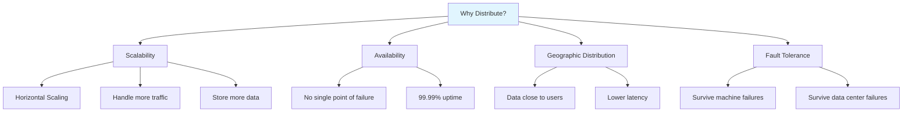
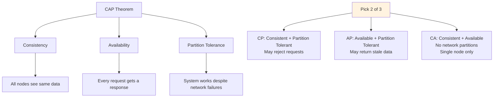
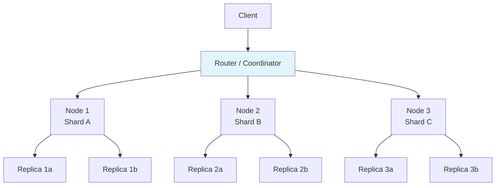

# Distributed Databases

## Overview

Distributed databases store data across multiple machines (nodes) connected by a network. They provide scalability (handling more data and traffic than a single machine), availability (continuing to operate despite failures), and geographic distribution (data close to users). Understanding distributed systems is essential for system design interviews, as most production databases today are distributed.

## Detailed Explanation

### Why Distribute?

### Single Machine Limitations

| Limitation | Description |
|-----------|-------------|
| **Storage** | Single machine has finite disk (TB range) |
| **Throughput** | Single CPU/memory bus limits queries per second |
| **Availability** | Machine failure = complete outage |
| **Latency** | Users far from the machine experience high latency |

### The CAP Theorem

The fundamental constraint of distributed systems:

**In practice:** Network partitions are unavoidable, so the real choice is between **CP** and **AP**.

| System | Type | Trade-off |
|--------|------|-----------|
| **PostgreSQL** | CA (single node) | No partition tolerance |
| **MongoDB** | CP (default) | Rejects writes during partition |
| **Cassandra** | AP | Returns stale data during partition |
| **Redis Cluster** | CP | Rejects writes during partition |
| **DynamoDB** | AP (default) | Eventual consistency |

### Distributed Database Architecture

## Topics in This Section

### 1. [CAP Theorem](./cap.md)
Deep dive into consistency, availability, and partition tolerance trade-offs.

### 2. [Consistency Models](./consistency.md)
Strong consistency, eventual consistency, and everything in between.

### 3. [Replication](./replication.md)
How data is copied across nodes for availability and read scaling.

### 4. [Sharding](./sharding.md)
How data is partitioned across nodes for write scaling.

### 5. [Consensus](./consensus.md)
How nodes agree on values despite failures.

### 6. [Paxos](./paxos.md)
The classic consensus algorithm.

### 7. [Raft](./raft.md)
The understandable consensus algorithm used by etcd, CockroachDB, etc.

## Distributed Database Types

| Type | Examples | Best For |
|------|----------|----------|
| **Distributed SQL** | CockroachDB, TiDB, Spanner | ACID transactions across nodes |
| **Distributed NoSQL** | Cassandra, MongoDB, DynamoDB | High availability, eventual consistency |
| **NewSQL** | CockroachDB, TiDB, YugabyteDB | SQL + distributed scalability |
| **Distributed Cache** | Redis Cluster, Memcached | Low-latency reads |

## Interview Focus Areas

1. **CAP theorem** — Explain the trade-offs and real-world implications
2. **Consistency models** — Strong vs. eventual vs. causal consistency
3. **Replication strategies** — Sync vs. async, leader-follower vs. multi-leader
4. **Sharding strategies** — Hash-based vs. range-based, resharding
5. **Consensus algorithms** — Why consensus is hard, Raft vs. Paxos

## Cross-References

- [Caching](../caching/) — distributed caching strategies
- [NoSQL](../nosql/) — distributed NoSQL databases
- [Storage](../storage/) — local storage fundamentals
- [Query Processing](../query-processing/) — distributed query execution
