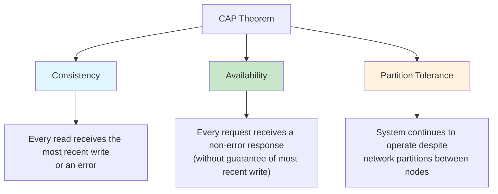
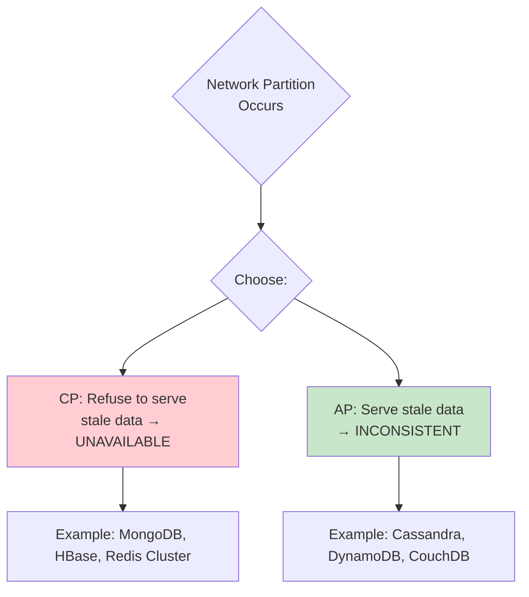
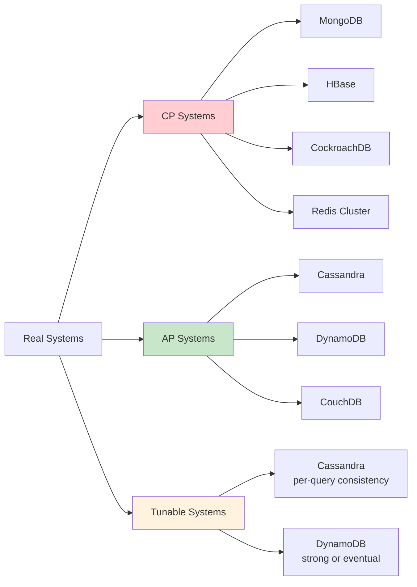
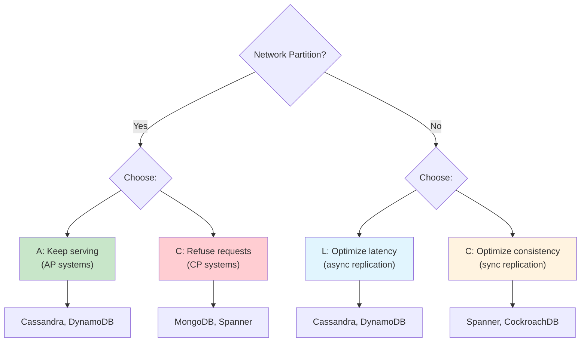

# CAP Theorem

## Overview

The CAP Theorem (also known as Brewer's Theorem) states that a distributed data store can only provide **two out of three** guarantees: **Consistency**, **Availability**, and **Partition Tolerance**. Since network partitions are inevitable in distributed systems, the practical choice is between consistency and availability during a partition.

Proposed by Eric Brewer in 2000 and proven by Gilbert and Lynch in 2002, CAP is the foundational theorem for understanding distributed database design.

## Detailed Explanation

### The Three Properties



### Consistency (C)

All nodes see the same data at the same time. A read always returns the most recent write.

```
Consistent System:
  Node A: x = 5 (latest write)
  Node B: x = 5 (same value)
  
  Read from any node → returns 5

Inconsistent System:
  Node A: x = 5 (latest write)
  Node B: x = 3 (stale)
  
  Read from Node B → returns 3 (stale data!)
```

### Availability (A)

Every request receives a response (success or failure), without guarantee that it contains the most recent write.

```
Available System:
  Request → Response (always, even if data is stale)

Unavailable System:
  Request → Timeout or Error (system refuses to respond)
```

### Partition Tolerance (P)

The system continues to operate despite network partitions (messages being lost or delayed between nodes).

```
Network Partition:
  Node A ←✗→ Node B  (communication broken)
  
Partition Tolerant: System still works (somehow)
Not Partition Tolerant: System halts entirely
```

### The CAP Trade-off



### Real-World Scenario

Consider a distributed database with two nodes:

```
Normal Operation:
  Client → Write x=5 to Node A
  Node A replicates x=5 to Node B
  Client → Read from Node B → returns 5 ✓

During Network Partition (Node A ←✗→ Node B):
```

**CP Choice (Consistency over Availability):**
```
  Client → Write x=5 to Node A ✓ (accepted)
  Client → Read from Node B → ERROR (can't guarantee consistency)
  
  Node B refuses to serve reads because it can't verify
  it has the latest data from Node A.
```

**AP Choice (Availability over Consistency):**
```
  Client → Write x=5 to Node A ✓ (accepted)
  Client → Read from Node B → returns old value (x=3)
  
  Node B serves reads with potentially stale data.
  When partition heals, nodes sync (eventual consistency).
```

### PACELC: Extending CAP

The CAP theorem only describes behavior during partitions. **PACELC** extends it:

```
If Partition (P):
  Choose Availability (A) or Consistency (C)
Else (E - normal operation):
  Choose Latency (L) or Consistency (C)
```

| System | Partition | Else | Classification |
|--------|-----------|------|----------------|
| **Cassandra** | A | L | PA/EL |
| **MongoDB** | C | C | PC/EC |
| **DynamoDB** | A | L | PA/EL |
| **CockroachDB** | C | C | PC/EC |
| **PNUTS (Yahoo)** | A | C | PA/EC |

### CAP in Practice



### Tunable Consistency

Many modern systems allow choosing consistency level per operation:

**Cassandra:**
```sql
-- Strong consistency (wait for all replicas)
CONSISTENCY ALL;
INSERT INTO users (id, name) VALUES (1, 'Alice');

-- Eventual consistency (wait for one replica)
CONSISTENCY ONE;
SELECT * FROM users WHERE id = 1;

-- Quorum consistency (majority of replicas)
CONSISTENCY QUORUM;
SELECT * FROM users WHERE id = 1;
```

**DynamoDB:**
```python
# Strongly consistent read
table.get_item(Key={'id': 1}, ConsistentRead=True)

# Eventually consistent read (default, faster)
table.get_item(Key={'id': 1}, ConsistentRead=False)
```

### Why "Pick 2 of 3" is Misleading

The CAP theorem is often oversimplified. In reality:

1. **You can't "not pick P"** — Network partitions happen; you must handle them
2. **It's a spectrum** — Not binary; there are degrees of consistency and availability
3. **Latency matters too** — Even without partitions, strong consistency adds latency
4. **It's per-operation** — Different operations can have different consistency levels

```
Reality: During a partition, you choose between:
  - Refusing some requests (CP)
  - Serving potentially stale data (AP)

Normal operation: You can have both C and A
  (but strong consistency still adds latency)
```

## Interview Questions

### Q1: Explain the CAP theorem in your own words.
**Answer:** The CAP theorem states that a distributed database can guarantee at most two of three properties: Consistency (all nodes see the same data), Availability (every request gets a response), and Partition Tolerance (system works despite network failures). Since network partitions are unavoidable, the real choice is between consistency and availability during a partition. CP systems refuse to serve potentially stale data (becoming unavailable); AP systems serve stale data (becoming inconsistent). When there's no partition, both can be achieved, but strong consistency still adds latency.

### Q2: Give an example of CP and AP systems.
**Answer:**
- **CP systems**: MongoDB (with majority write concern), HBase, CockroachDB, Redis Cluster. These systems will reject reads/writes during a partition to maintain consistency.
- **AP systems**: Cassandra, DynamoDB, CouchDB. These systems continue serving requests during partitions but may return stale data.

Example: If a network partition isolates a MongoDB secondary, reads from that secondary will fail (CP). In Cassandra, the same partition allows reads from the isolated node, but the data may be stale (AP).

### Q3: What is PACELC and why is it useful?
**Answer:** PACELC extends CAP by considering the trade-off during normal operation (no partition). It states: if there's a Partition, choose A or C; Else (normal operation), choose Latency or Consistency. This captures the reality that even without partitions, strong consistency requires coordination between nodes, adding latency. For example, Cassandra is PA/EL (available during partitions, low latency normally), while CockroachDB is PC/EC (consistent always, higher latency).

### Q4: Can a system be both consistent and available?
**Answer:** Yes, but only when there's no network partition. In normal operation, a system can be both consistent and available by replicating data synchronously. However, strong consistency always adds latency (waiting for replicas to acknowledge), so there's a latency trade-off. The CAP theorem specifically addresses what happens during partitions — that's when you must choose.

### Q5: How do modern databases handle the CAP trade-off?
**Answer:** Modern databases offer **tunable consistency**:
- **Cassandra**: Per-query consistency level (ONE, QUORUM, ALL)
- **DynamoDB**: Strongly consistent or eventually consistent reads
- **MongoDB**: Write concern (w=1 for fast, w=majority for safe)
- **CockroachDB**: Serializable isolation by default (CP), but can be configured for lower consistency

This lets applications choose the right trade-off per operation: strong consistency for critical writes, eventual consistency for reads where staleness is acceptable.

## Real-World Deep Dive: Database Classifications

### Cassandra (AP — Available + Partition Tolerant)

```
Architecture:
  - Peer-to-peer (no master)
  - Consistent hashing for data distribution
  - Tunable consistency per query

During partition:
  - Both sides continue accepting reads/writes
  - Conflict resolution: last-write-wins (LWW)
  - May lose writes if timestamps conflict

Normal operation:
  - Low latency (no coordination for reads/writes at ONE level)
  - Consistency achieved via QUORUM (majority)

Example:
  3 replicas, RF=3
  CL.ONE  → Any 1 replica responds (fast, may be stale)
  CL.QUORUM → 2 of 3 replicas respond (balanced)
  CL.ALL → All 3 respond (slow, strong consistency)

Classification: PA/EL (Available during partition, low latency normally)
```

### MongoDB (CP — Consistent + Partition Tolerant)

```
Architecture:
  - Replica set: 1 primary + N secondaries
  - Primary handles all writes
  - Majority write concern ensures consistency

During partition:
  - Partition with majority elects new primary
  - Minority partition: reads fail, no writes accepted
  - Consistency preserved (no split-brain)

Example:
  5-node replica set, partition {A,B} vs {C,D,E}
  {C,D,E} has majority → elects new primary
  {A,B}: old primary steps down, becomes read-only
  When healed: A,B sync from new primary

Classification: PC/EC (Consistent always)
```

### Google Spanner (Externally Consistent)

```
Architecture:
  - Globally distributed, synchronous replication
  - Uses Paxos for replication (not Raft)
  - TrueTime API: GPS + atomic clocks for bounded clock uncertainty

Key innovation: TrueTime
  - Provides time interval [earliest, latest]
  - Actual time is guaranteed to be in this interval
  - Uncertainty typically < 7ms

External consistency (stronger than linearizability):
  If T1 completes before T2 starts (real time),
  then T1's timestamp < T2's timestamp

How it works:
  - Each transaction waits out clock uncertainty before committing
  - "Commit wait" = TT.after(s) — wait until timestamp s is definitely in the past
  - This ensures timestamps reflect real-time ordering

Classification: PC/EC with external consistency
```

### CockroachDB (CP — Consistent + Partition Tolerant)

```
Architecture:
  - Inspired by Spanner (but uses NTP instead of TrueTime)
  - Each range is a Raft group
  - Serializable isolation by default

Clock uncertainty handling:
  - Uses hybrid logical clocks (HLC)
  - If read encounters value with uncertain timestamp → retries
  - "uncertainty interval" based on max clock offset

Classification: PC/EC
```

### DynamoDB (Tunable)

```
Architecture:
  - Managed AWS service
  - Consistent hashing with virtual nodes
  - Sloppy quorum + hinted handoff

Consistency options:
  - Eventually consistent reads (default, faster)
  - Strongly consistent reads (slower, guaranteed latest)

Classification: PA/EL (default), can be PC with strong reads
```

### Redis Cluster (CP)

```
Architecture:
  - Hash slots (16384 slots)
  - Master-replica per slot
  - Asynchronous replication

During partition:
  - Minority masters become unavailable (after timeout)
  - No writes to minority (consistency preserved)
  - Reads may fail

Classification: PC/EC
```

## PACELC Decision Framework



## Common Mistakes

- ❌ **"Pick 2 of 3"** — You can't opt out of P; the real choice is C vs. A during partitions
- ❌ **Assuming CA systems exist** — Single-node "CA" systems don't handle partitions
- ❌ **Ignoring latency** — Even without partitions, strong consistency has latency costs
- ❌ **Treating CAP as binary** — It's a spectrum with tunable consistency levels
- ❌ **Confusing consistency models** — CAP "C" means linearizability, not ACID consistency
- ❌ **Ignoring PACELC** — CAP only describes partition behavior; PACELC describes normal-operation trade-offs
- ❌ **Thinking "eventual" means "never"** — Eventual consistency guarantees convergence; it just doesn't say when

## Summary

| Property | Meaning | Trade-off |
|----------|---------|-----------|
| **Consistency** | All nodes see same data | Adds latency, may reduce availability |
| **Availability** | Every request gets a response | May serve stale data |
| **Partition Tolerance** | Works despite network failures | Unavoidable in distributed systems |

The CAP theorem is the starting point for understanding distributed database design. In practice, systems offer tunable consistency, allowing the right trade-off per operation.

## Cross-References

- [Consistency Models](./consistency.md) — detailed consistency guarantees
- [Replication](./replication.md) — how data is replicated across nodes
- [Sharding](./sharding.md) — how data is partitioned
- [Consensus](./consensus.md) — how nodes agree despite failures
- [NewSQL](../nosql/newsql.md) — systems that try to provide both C and A


## Cross References

- [CAP Theorem (Distributed)](../../distributed/fundamentals/cap.md)
- [Consistency Models](../../distributed/fundamentals/consistency.md)
- [Sharding](sharding.md)
- [Replication](replication.md)
