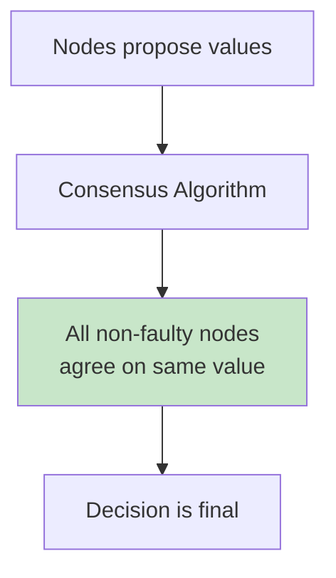
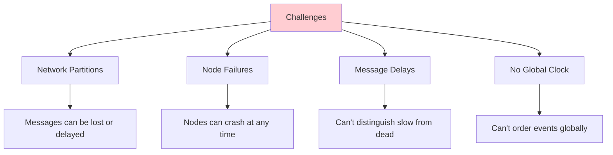
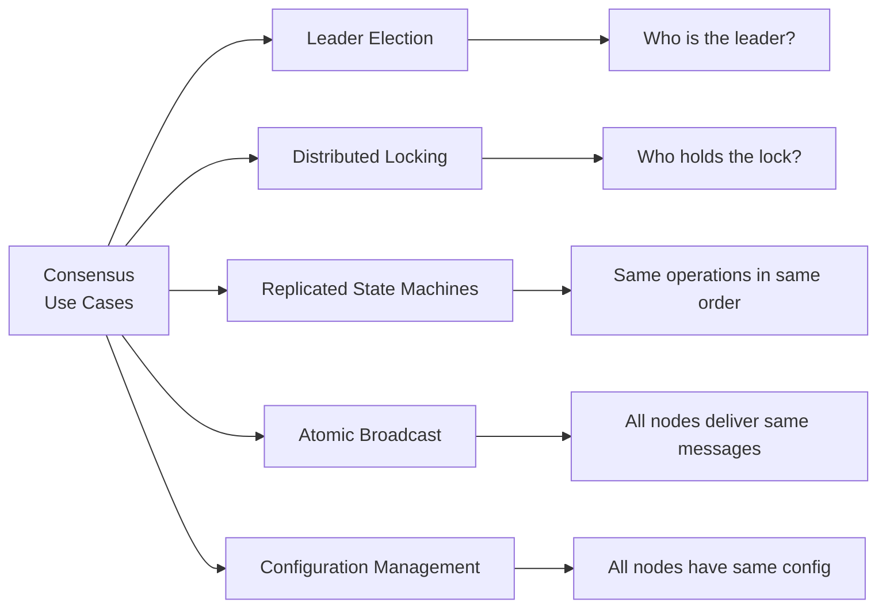
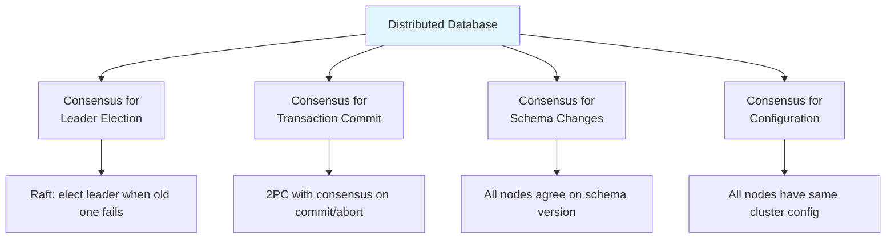
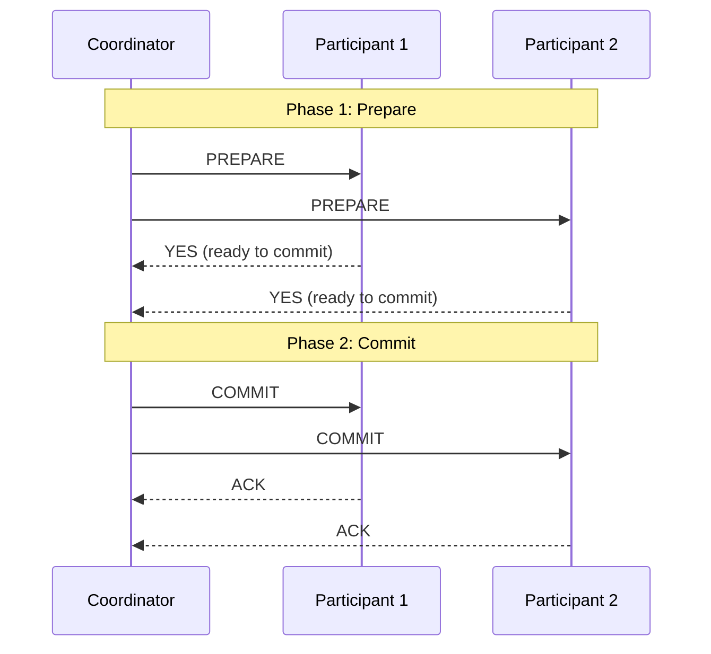
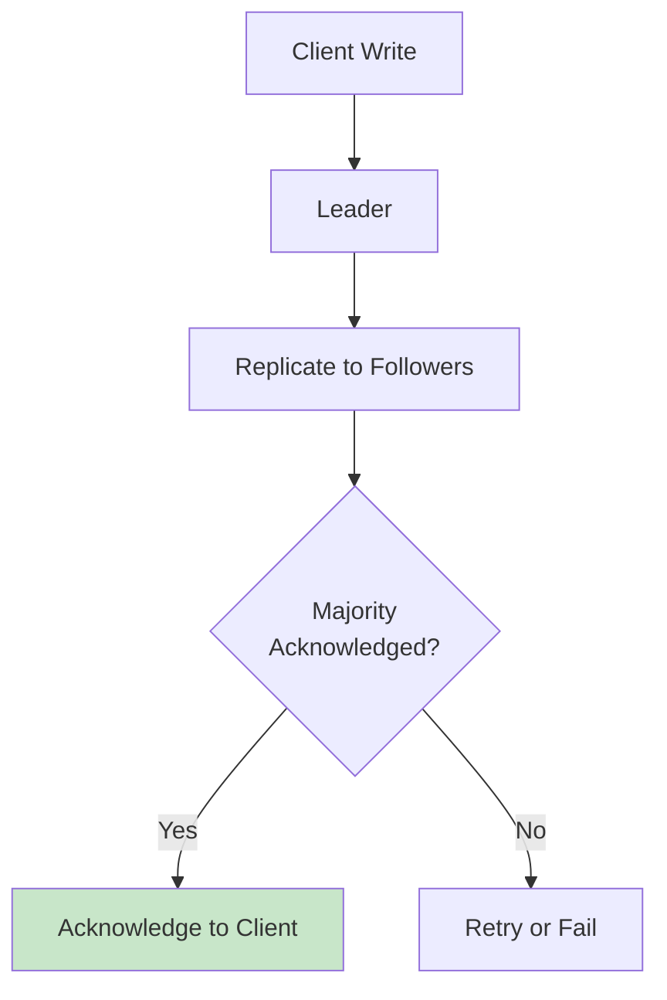
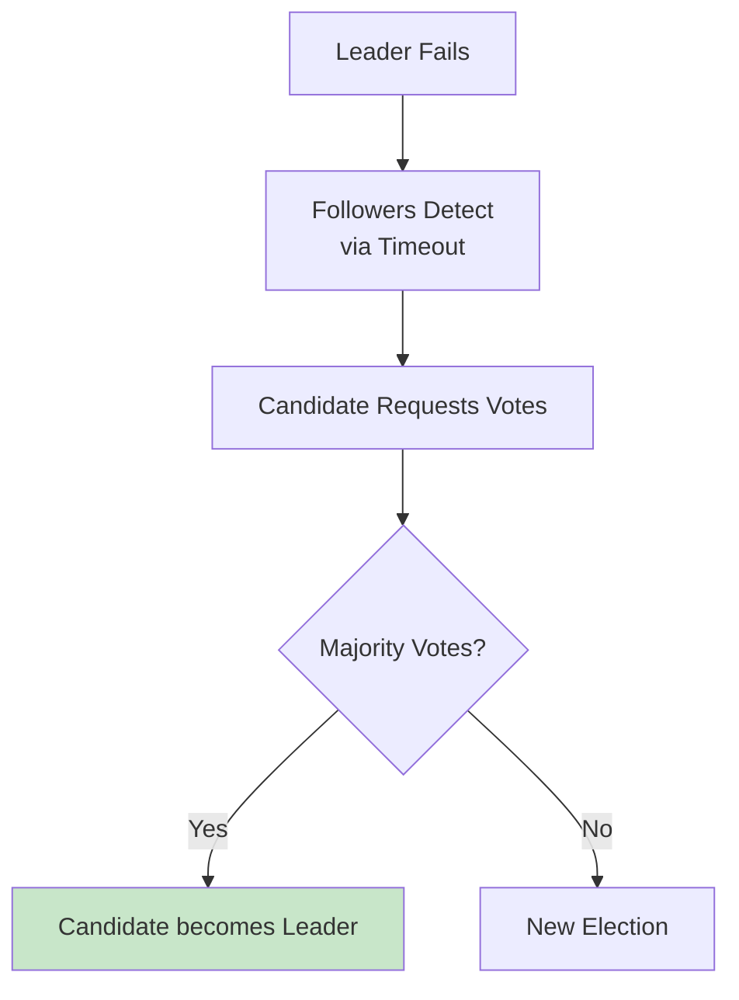

# Consensus

## Overview

Consensus is the fundamental problem in distributed systems: how do multiple nodes agree on a single value (or sequence of values) despite failures? Consensus algorithms ensure that a distributed system behaves as a single, reliable entity. They are the backbone of strongly consistent distributed databases, leader election, and distributed locking.

## Detailed Explanation

### The Consensus Problem



**Requirements for consensus:**

| Property | Description |
|----------|-------------|
| **Validity** | If a node decides value v, then v was proposed by some node |
| **Agreement** | No two non-faulty nodes decide different values |
| **Termination** | Every non-faulty node eventually decides |
| **Integrity** | Each node decides at most once |

### Why Consensus is Hard



**The FLP Impossibility Result (1985):**
In an asynchronous system, no deterministic consensus algorithm can guarantee termination if even one node can crash. This means consensus algorithms must use **timeouts** or **failure detectors** to make progress.

### Consensus Use Cases



### Consensus Algorithms

| Algorithm | Year | Used By | Complexity |
|-----------|------|---------|------------|
| **Paxos** | 1989 | Chubby, Spanner | Hard to implement |
| **Raft** | 2014 | etcd, CockroachDB, TiKV | Understandable |
| **ZAB** | 2008 | ZooKeeper | Similar to Raft |
| **PBFT** | 1999 | Hyperledger | Byzantine fault tolerant |
| **Viewstamped Replication** | 1988 | Some databases | Predecessor to Raft |

### Consensus in Databases



### Two-Phase Commit (2PC)

The classic distributed transaction protocol (not consensus, but related):



**2PC is NOT consensus:**
- Coordinator is a single point of failure
- If coordinator crashes after PREPARE, participants are blocked
- Doesn't handle Byzantine failures

**2PC vs. Consensus:**

| Aspect | 2PC | Consensus (Raft/Paxos) |
|--------|-----|------------------------|
| **Purpose** | Atomic commit across nodes | Agree on a value/leader |
| **Coordinator** | Fixed, SPOF | Elected, fault-tolerant |
| **Blocking** | Yes (coordinator failure) | No (makes progress) |
| **Use case** | Distributed transactions | Leader election, replication |

### Consensus for Replication

Modern databases use consensus to replicate data:



**Raft-based replication:**
1. Client sends write to leader
2. Leader appends to its log
3. Leader replicates log entry to followers
4. Once majority acknowledges, entry is **committed**
5. Leader applies entry and responds to client

### Consensus for Leader Election



### Quorum-Based Consensus

A quorum is the minimum number of nodes that must agree:

```
N = Total nodes
Quorum = ⌊N/2⌋ + 1

N=3 → Quorum=2
N=5 → Quorum=3
N=7 → Quorum=4

Any two quorums overlap → ensures consistency
```

**Why quorum works:**
```
Nodes: A, B, C, D, E (N=5, Quorum=3)

Write quorum: {A, B, C}
Read quorum: {C, D, E}

Overlap: {C} → Read sees latest write

Every pair of quorums shares at least one node.
This ensures no two conflicting decisions can be made.
```

## Interview Questions

### Q1: What is the consensus problem in distributed systems?
**Answer:** Consensus is the problem of getting multiple distributed nodes to agree on a single value despite failures. Requirements:
- **Validity**: The decided value was proposed by some node
- **Agreement**: All non-faulty nodes decide the same value
- **Termination**: All non-faulty nodes eventually decide
- **Integrity**: Each node decides at most once

Consensus is fundamental to leader election, replicated state machines, and distributed transactions.

### Q2: Why is consensus hard?
**Answer:** Three main challenges:
1. **Network unreliability** — Messages can be lost, delayed, or duplicated
2. **Node failures** — Nodes can crash at any time, including during the protocol
3. **No global clock** — Can't determine the order of events across nodes

The FLP impossibility result proves that no deterministic algorithm can guarantee consensus in an asynchronous system with even one possible failure. Practical algorithms use timeouts to work around this.

### Q3: What is the difference between 2PC and consensus?
**Answer:**
- **2PC (Two-Phase Commit)**: A distributed transaction protocol where a coordinator asks participants to prepare, then commit. It's **blocking** — if the coordinator crashes after prepare, participants are stuck.
- **Consensus (Raft/Paxos)**: A protocol for nodes to agree on a value. It's **non-blocking** — makes progress as long as a majority of nodes are alive.

2PC is for atomic commit across databases; consensus is for leader election and replication within a system.

### Q4: What is a quorum and why is it important?
**Answer:** A quorum is the minimum number of nodes (majority) that must agree for a decision to be valid. For N nodes, quorum = ⌊N/2⌋ + 1. It's important because:
1. Any two quorums overlap by at least one node
2. This ensures no two conflicting decisions can be made
3. The system tolerates up to ⌊(N-1)/2⌋ failures

For N=5, quorum=3. The system tolerates 2 node failures and still makes progress.

### Q5: How do databases use consensus?
**Answer:** Databases use consensus for:
1. **Leader election** — Raft/Paxos elects a leader when the current one fails
2. **Log replication** — Leader replicates write-ahead log to followers; committed when majority acknowledges
3. **Configuration changes** — All nodes agree on cluster membership
4. **Schema changes** — DDL operations require consensus
5. **Distributed transactions** — 2PC or Paxos for cross-shard commits

Examples: CockroachDB uses Raft for replication, etcd uses Raft for key-value storage, Spanner uses Paxos.

## Common Mistakes

- ❌ **Confusing 2PC with consensus** — 2PC is blocking; consensus is not
- ❌ **Assuming consensus is free** — It adds latency (round trips to majority)
- ❌ **Not understanding quorum** — Must be majority, not just "more than half"
- ❌ **Ignoring the FLP result** — Consensus requires timeouts/failure detectors
- ❌ **Overusing consensus** — Not every operation needs consensus; use it for critical decisions only

## Summary

| Concept | Description |
|---------|-------------|
| **Consensus** | Nodes agree on a value despite failures |
| **Quorum** | Majority of nodes (⌊N/2⌋ + 1) |
| **2PC** | Blocking distributed commit protocol |
| **Raft/Paxos** | Non-blocking consensus algorithms |
| **Use cases** | Leader election, replication, distributed transactions |

Consensus is the foundation of strongly consistent distributed systems. Understanding it is essential for system design interviews.

## Cross-References

- [Paxos](./paxos.md) — the classic consensus algorithm
- [Raft](./raft.md) — the understandable consensus algorithm
- [CAP Theorem](./cap.md) — why consensus affects availability
- [Consistency Models](./consistency.md) — what consensus provides
- [Replication](./replication.md) — how consensus enables replication


## Cross References

- [Raft](../distributed/consensus/raft.md)
- [Paxos](../distributed/consensus/paxos.md)
- [Two-Phase Commit](../dbms/transactions/two-phase-commit.md)
- [Distributed Transactions](../dbms/transactions/distributed.md)
