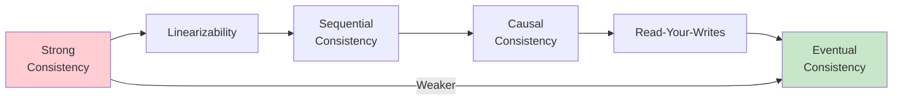
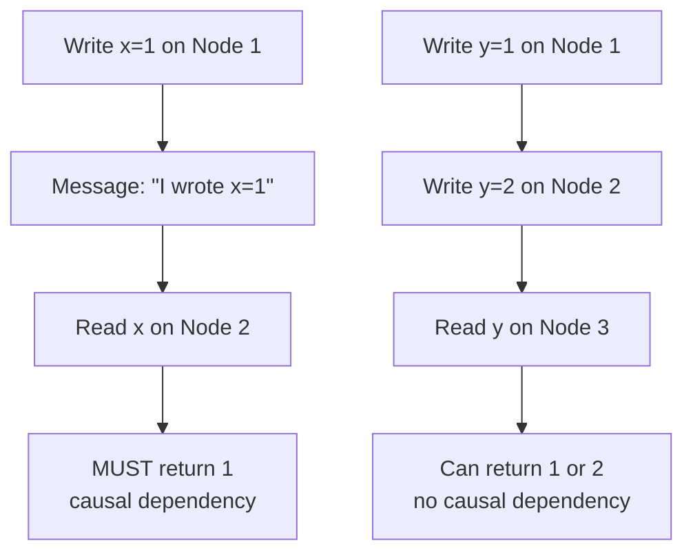
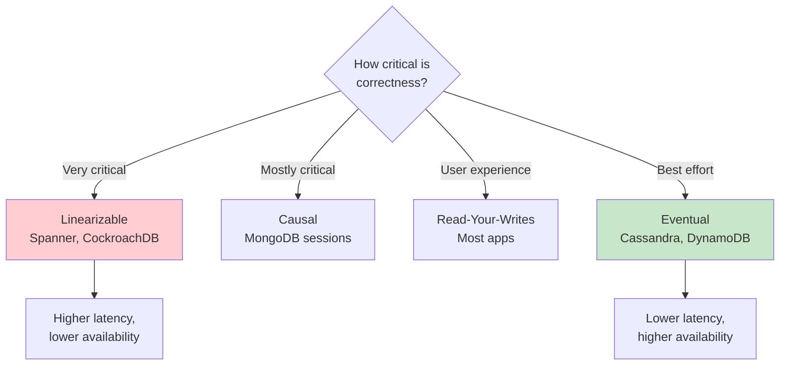

# Consistency Models

## Overview

Consistency models define the guarantees a distributed system provides about how and when updates become visible to readers. They form a spectrum from **strong consistency** (immediate, global visibility) to **eventual consistency** (eventually, all nodes agree). Choosing the right model is a fundamental trade-off between correctness, performance, and availability.

## Detailed Explanation

### Consistency Spectrum



### Linearizability (Strongest)

The strongest consistency model. Operations appear to execute atomically at some point between their invocation and response, and this point is consistent with real-time ordering.

```
Linearizable:
  T1: Write(x=1)  [──────]
  T2:           Read(x) → 1  [──────]
  T3: Write(x=2)           [──────]
  T4:                        Read(x) → 2  [──────]

All reads see the most recent write in real-time order.
```

**Properties:**
- Every read returns the most recent write
- Operations appear instantaneous (linearization point)
- Global ordering consistent with real time
- Equivalent to having a single copy of the data

**Used by:** CockroachDB, Spanner, etcd, ZooKeeper

**Cost:** High latency (requires coordination between nodes)

### Sequential Consistency

All operations appear to execute in some sequential order that is consistent with the program order of each individual process (node), but not necessarily with real-time order.

```
Sequential (but not linearizable):
  Node 1: Write(x=1) → Write(x=2)
  Node 2: Read(x) → 2, Read(x) → 1  ← OK (valid sequential order)

  But in real time, x=1 was written before x=2.
  Node 2 saw x=2 first — not linearizable, but sequentially consistent
  (there exists a valid sequential ordering: x=2 was written "first")
```

**Key difference from linearizability:** Doesn't respect real-time ordering, only per-process ordering.

### Causal Consistency

Operations that are causally related are seen in the same order by all nodes. Concurrent (unrelated) operations may be seen in different orders.

```
Causal Consistency:
  Node 1: Write(x=1) → "I wrote x=1" (message to Node 2)
  Node 2: Receives message → Read(x) → MUST see x=1

  The message creates a causal relationship.
  But independent writes can be seen in any order.
```



**Used by:** MongoDB (with causal sessions), COPS, Eiger

### Read-Your-Writes

A client always sees its own writes. After writing a value, subsequent reads by the same client return that value (or a newer one).

```
Read-Your-Writes:
  Client A: Write(x=1) → Read(x) → MUST return 1
  Client B: Read(x) → may return old value (OK)

  Only guarantees that you see YOUR writes, not others'.
```

**Implementation:**
- Track the timestamp/version of the client's last write
- Ensure reads go to a replica that has at least that version
- Or read from the leader

**Used by:** Most systems as a minimum guarantee

### Eventual Consistency (Weakest)

If no new updates are made, eventually all replicas will converge to the same value. No guarantee about when.

```
Eventual Consistency:
  T0: Write(x=1) on Node 1
  T1: Read(x) on Node 2 → may return old value
  T2: Read(x) on Node 2 → may still return old value
  ...
  T∞: Read(x) on Node 2 → will return 1 (eventually!)

  "Eventually" could be milliseconds or hours.
```

**Used by:** Cassandra (default), DynamoDB (default), DNS, CouchDB

### Monotonic Read Consistency

Once a client reads a value, subsequent reads will never return an older value.

```
Monotonic Reads:
  Read 1: x = 5
  Read 2: x = 7  ← OK (newer)
  Read 3: x = 5  ← VIOLATION (went backwards!)

  Monotonic: Read 3 would return 7 or newer, never 5
```

### Comparison Table

| Model | Guarantee | Latency | Use Case |
|-------|-----------|---------|----------|
| **Linearizability** | Global real-time ordering | High | Financial, inventory |
| **Sequential** | Per-process ordering | High | General correctness |
| **Causal** | Causal ordering | Medium | Social media, collaboration |
| **Read-Your-Writes** | See own writes | Low | User sessions |
| **Monotonic Reads** | No going backwards | Low | Dashboards |
| **Eventual** | Converge eventually | Lowest | DNS, caching |

### Consistency in Practice



### Implementing Strong Consistency

**Quorum-based:**
```
N = Total replicas
W = Write quorum (replicas to acknowledge write)
R = Read quorum (replicas to read from)

Strong consistency if: W + R > N

Example: N=3, W=2, R=2 → 2+2=4 > 3 → Strong consistency
```

**Consensus-based:**
```
Use Paxos/Raft to agree on operation order
Leader replicates to majority before acknowledging
All reads from leader (or read from majority)
```

## Interview Questions

### Q1: What is the difference between linearizability and sequential consistency?
**Answer:** 
- **Linearizability** requires that operations appear to execute atomically at some point in **real time** between invocation and response. The global order must respect real-time ordering.
- **Sequential consistency** requires a total order consistent with each process's program order, but doesn't need to respect real-time ordering.

Linearizability is stronger. Example: If write(x=1) completes before write(x=2) starts in real time, a linearizable system guarantees all subsequent reads see x=2. Sequential consistency might allow a reader to see x=2 then x=1 (valid sequential order, but not real-time order).

### Q2: What is eventual consistency and what are its guarantees?
**Answer:** Eventual consistency guarantees that if no new updates are made, all replicas will **eventually** converge to the same value. Guarantees:
- Updates will eventually propagate to all replicas
- All replicas will eventually agree

Does NOT guarantee:
- When convergence happens (could be seconds or hours)
- That reads return the latest value
- Any ordering of operations

It's the weakest consistency model but offers the best availability and performance.

### Q3: How do you implement strong consistency in a distributed system?
**Answer:** Two main approaches:
1. **Quorum-based**: Require W + R > N (write quorum + read quorum > total replicas). For N=3, W=2, R=2 ensures every read overlaps with every write.
2. **Consensus-based**: Use Paxos/Raft to agree on operation order. A leader replicates to a majority before acknowledging writes. All reads go through the leader or a majority read quorum.

Consensus-based is more common for strong consistency (CockroachDB, Spanner, etcd).

### Q4: What is causal consistency and when is it useful?
**Answer:** Causal consistency ensures that operations with a causal relationship (one caused or influenced the other) are seen in the same order by all nodes. Concurrent operations may be seen in different orders.

Useful for:
- **Social media**: If you post a comment, then "like" it, friends should see the comment before the like
- **Collaborative editing**: If user A's edit depends on user B's edit, the dependency must be preserved
- **Chat messages**: Reply must appear after the original message

### Q5: How does MongoDB handle consistency?
**Answer:** MongoDB offers multiple consistency levels:
- **Default**: Causal consistency (sessions). Within a session, reads reflect prior writes.
- **Read concern "majority"**: Reads from a majority of replicas (linearizable)
- **Read concern "local"**: Reads from the nearest node (eventual)
- **Write concern "majority"**: Write must be replicated to majority
- **Write concern "1"**: Write to single node (fast, less durable)

MongoDB is CP by default (rejects writes during partition with majority write concern).

## Common Mistakes

- ❌ **Confusing linearizability with sequential consistency** — Linearizability respects real-time ordering
- ❌ **Assuming eventual consistency means "instant"** — It could take arbitrarily long
- ❌ **Not understanding the latency trade-off** — Stronger consistency = higher latency
- ❌ **Ignoring read-your-writes** — Most applications need at least this guarantee
- ❌ **Treating consistency as binary** — It's a spectrum with many intermediate levels

## Summary

| Model | Guarantee | Example Systems |
|-------|-----------|-----------------|
| **Linearizable** | Global real-time order | CockroachDB, Spanner, etcd |
| **Sequential** | Global program order | Some academic systems |
| **Causal** | Causal order preserved | MongoDB sessions, COPS |
| **Read-Your-Writes** | See own writes | Most systems |
| **Monotonic Reads** | No going backwards | Most systems |
| **Eventual** | Converge eventually | Cassandra, DynamoDB |

Consistency models are the foundation of distributed system design. Choosing the right model depends on the application's correctness requirements and latency tolerance.

## Cross-References

- [CAP Theorem](./cap.md) — the fundamental trade-off
- [Replication](./replication.md) — how consistency is maintained across replicas
- [Consensus](./consensus.md) — how nodes agree on values
- [Raft](./raft.md) — consensus algorithm for strong consistency
- [Distributed Transactions](./consistency.md) — multi-operation consistency


## Cross References

- [Consistency Models (Distributed)](../../distributed/fundamentals/consistency.md)
- [CAP Theorem](cap.md)
- [Replication](replication.md)
- [Isolation Levels](../transactions/isolation-levels.md)
