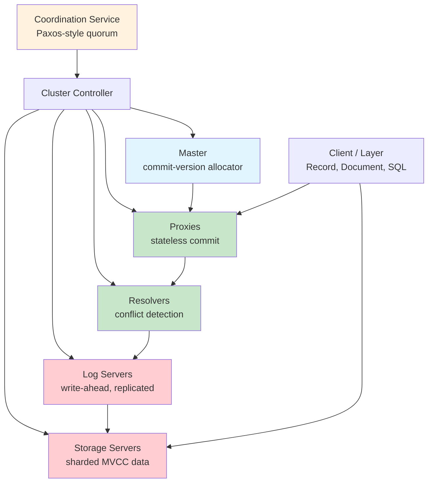
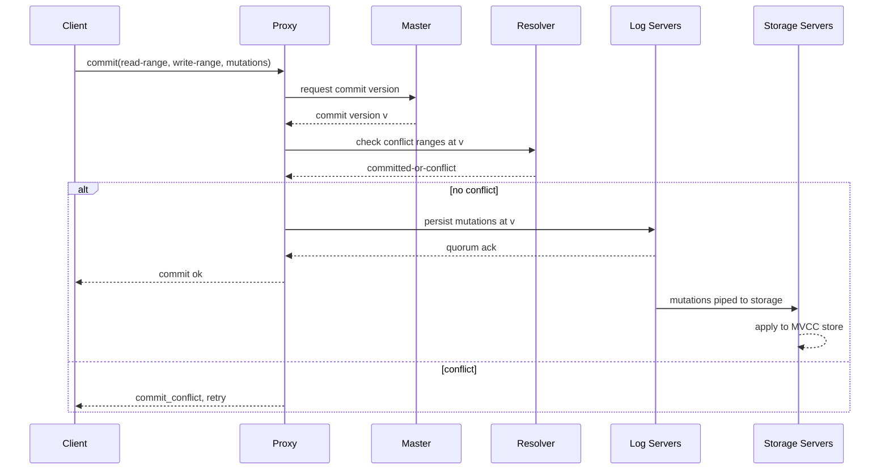
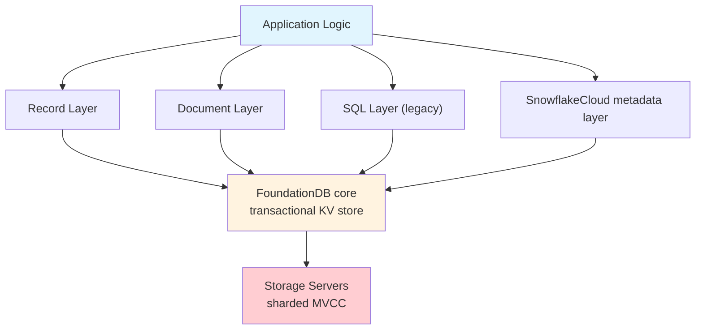
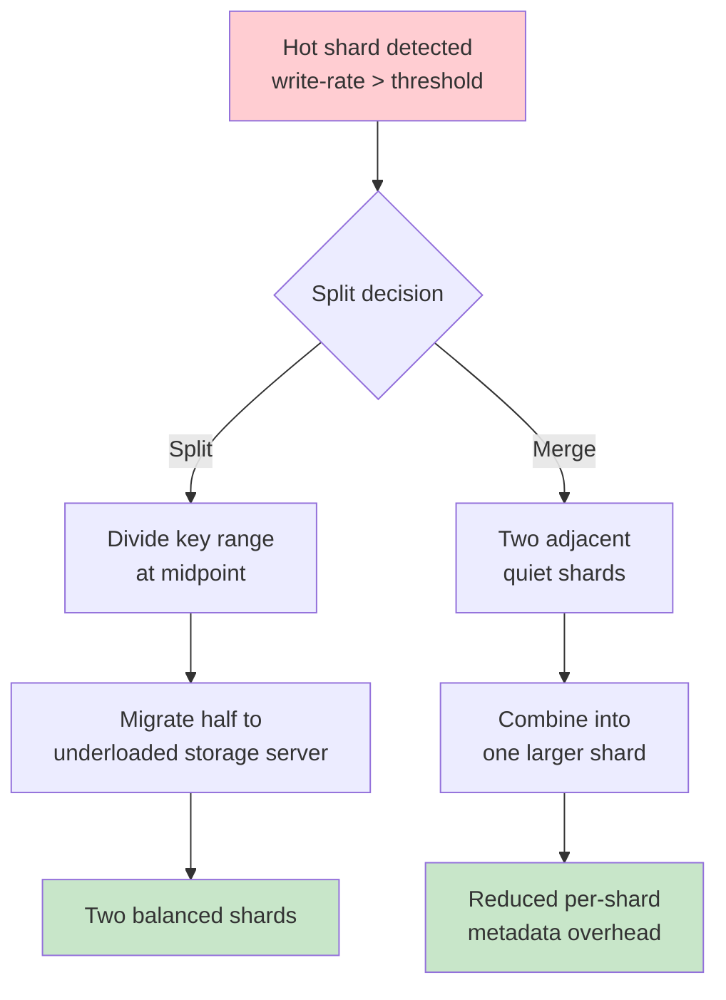
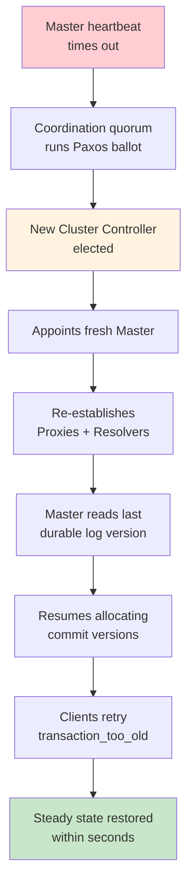

# FoundationDB

## Overview

FoundationDB (FDB) is an open-source, distributed, transactional key-value store originally developed by a startup of the same name, acquired by Apple in 2015, and now powering large-scale production workloads such as Apple iCloud, SnowflakeCloud metadata, and the iTunes store. Its defining trait is the **unbundled** design: rather than fusing compute, storage, and transaction coordination into a single monolithic process, FDB separates them into independently scaled, stateless and stateful roles that communicate over a shared network fabric. This separation lets each role be elastically provisioned, restarted, and rebalanced without affecting the others — a property the SIGMOD 2021 paper by Zhou et al. ("FoundationDB: A Distributed Unbundled Transactional Key Value Store") argues is the key to FDB's ability to serve millions of short transactions per second with strict serializability.

Underneath, FDB is a bare key-value store ordered lexicographically by byte-string keys. It exposes a minimal API — `get`, `get_range`, `set`, `clear`, and atomic `commit` — and pushes richer data models (documents, records, SQL) into **layers**: client-side libraries that encode their state as keys and values. Apple's Record Layer, the Document Layer, the deprecated SQL Layer, and SnowflakeCloud's metadata layer all sit on top of this KV substrate. The combination of strict serializable isolation, a layered architecture, and an unbundled core that survives data-center failures makes FDB a frequent interview topic for distributed systems and database infrastructure roles, especially at companies operating planet-scale transactional workloads where latency, throughput, and correctness all matter simultaneously.

Historically, FDB grew out of work on the FDB startup (founded 2009 by Nick Lavezzo, Dave Scherer, and Will Wilson), which bet that an unbundled, OCC-based, strictly serializable key-value store could outperform the leader-per-shard designs of the 2010s. Apple's 2015 acquisition validated that bet, and the subsequent open-source release (under the Apache 2.0 license) plus the publication of the SIGMOD 2021 paper made the design accessible to a wide audience. SnowflakeCloud's adoption of FDB as the metadata backbone for its cloud data platform — described by Zhe Wu and colleagues — further cemented FDB's reputation as the system to reach for when a cloud service needs strict transactions over a large, hot dataset. Interviewers often probe this adoption history to check whether candidates understand why a company would choose FDB over a more conventional SQL database.

## Detailed Explanation

### Architecture: The Unbundled Design

FDB's architecture decomposes the traditional database engine into a constellation of cooperating processes, each playing one well-defined **role**. The stateless roles — **proxies**, **resolvers**, and **cluster controllers** — can be killed and respawned freely because they hold no durable state. The stateful roles — **storage servers**, **log servers**, and **transaction servers** — persist data and are replicated for fault tolerance. A small **coordination service** (a ZooKeeper-like quorum of processes, historically using a Paxos-style leader election) bootstraps the system by electing a **cluster controller**, which in turn appoints a **master** that owns the global commit-version counter. Because the coordination quorum is small and only used for leadership decisions, it can survive the failure of a minority of its members without blocking the data path.

The unbundled split pays off in three ways. First, each role scales independently: more proxies absorb more client commits, more log servers widen write bandwidth, and more storage servers grow dataset size. Second, failures are isolated: a crashed proxy is restarted elsewhere without touching committed data, and a dead storage server is rebuilt from its log replica. Third, the design tolerates rolling upgrades — Apple upgrades its iCloud FDB clusters in production by replacing roles one at a time. The Apple FoundationDB documentation (apple.github.io/foundationdb) and the `design.md` design doc in the FDB repository describe each role's responsibilities in depth, and Wilson FdnDB's conference talks emphasise how the unbundled split keeps the recovery time after a master failure under a few seconds.

A useful mental model for interviews is to think of FDB as a pipeline of role groups, each owning one phase of the commit lifecycle: the coordination service owns leadership, the master owns version allocation, the proxy owns commit orchestration, the resolver owns conflict detection, the log servers own durability, and the storage servers own the readable MVCC snapshot. Each role group can be scaled, restarted, and upgraded in isolation, and the failure of any single member is recoverable by the rest. This is the "shared-nothing per role" property that distinguishes FDB from monolithic databases where a single process owns several of these phases and a crash stalls the whole pipeline.



### Transaction System: OCC, MVCC, and Conflict Ranges

FDB transactions use **optimistic concurrency control (OCC)** combined with **multi-version concurrency control (MVCC)**. A client opens a transaction, reads from storage servers (which return the latest committed value at or before the client's read version), buffers all writes locally, and then submits a commit request containing its **read conflict ranges** and **write conflict ranges** plus its mutated key-value pairs. Read conflict ranges are the keys the client read and depends upon; write conflict ranges are the keys it intends to mutate. Crucially, conflicts are detected at the granularity of these ranges, not the entire transaction, so two transactions writing disjoint keys commit in parallel.

The commit pipeline flows through the **proxy**, which obtains a fresh commit version from the **master** (the global sequencer), then forwards the transaction's conflict ranges to a **resolver**. The resolver compares the ranges against a recent in-memory conflict map of committed transactions and decides whether the transaction conflicts. If clean, the proxy persists the writes to the **log servers** — a sharded, replicated write-ahead log — and only after a quorum of log replicas acknowledges does the proxy report success to the client. **Storage servers** later pull mutations from the logs in commit-version order and apply them to their local LSM-tree-like structures, providing the MVCC read path. This sequencing — sequencer → resolver → log → storage — is what gives FDB strict serializability: every committed transaction appears to occur at a single, globally agreed instant between its begin and commit.

Conflict detection is the resolver's central job, and its design is worth understanding. The resolver keeps a small in-memory map of recently committed write conflict ranges (recent enough to cover any in-flight transaction's read range) and checks each incoming commit's read ranges against that map. A read-write conflict occurs when the new transaction read a key that a recent commit wrote; a write-write conflict occurs when the new transaction's write range overlaps a recent commit's write range. Because the map is keyed by range and queried by range overlap, the check is O(log n) per range, not O(n), which is why a handful of resolvers can handle millions of commits per second. The resolver does not see the actual values being written — only the ranges — which keeps the data path private from the conflict-detection path.



### Strict Serializable Isolation

FDB advertises **strict serializability**, the strongest practical isolation level: transactions appear to execute in a total order that respects real-time precedence. If transaction \\(T_1\\) commits before \\(T_2\\) begins (in wall-clock time), then \\(T_2\\) must observe \\(T_1\\)'s effects. This is stronger than mere serializability because serializability alone permits reordering that violates real-time order, and stronger than snapshot isolation because snapshot isolation can produce write skew on overlapping-but-disjoint keys. FDB achieves strict serializability by (1) issuing monotonically increasing commit versions from the master, (2) reading at a specific committed version obtained at transaction begin, and (3) detecting read-write and write-write conflicts at commit time via the resolver. The result is a system where short transactions behave as if they ran one at a time against a single copy of the data.

The trade-off is latency: every commit crosses proxy, resolver, and a quorum of log servers, typically costing a few milliseconds within a data center and tens of milliseconds across data centers. Read-only transactions are cheaper because FDB can serve them at a recent committed version without contacting the master, but they still respect the real-time ordering. The cost model matters for application design: developers are encouraged to keep transactions short, to scope read and write conflict ranges as narrowly as possible (using explicit `add_read_conflict_key` calls only for keys the logic actually depends on), and to batch independent operations into separate transactions rather than one large transaction. The table below positions FDB's isolation against common alternatives.

A subtle point worth emphasising in interviews is the difference between FDB's strict serializability and Spanner's external consistency. Both guarantee a real-time-respecting total order, but Spanner achieves it via TrueTime (atomic clocks with bounded uncertainty) and per-shard Paxos leader leases, whereas FDB achieves it via a single global master that allocates versions on demand. Spanner's approach scales to true global deployment without a single sequencer bottleneck because each shard's leader leases its own time range; FDB's approach is simpler within a region or a small set of regions but ultimately funnels version allocation through one master, which is why FDB's largest deployments are regional or multi-region with a single designated primary. Neither approach is universally better; the choice depends on the geographic shape of the workload.

| Isolation Level | Guarantees | Anomalies Possible | Systems |
|-----------------|------------|--------------------|---------|
| **Strict Serializable** | Real-time total order | None | FDB, Spanner (linearizable ops), CockroachDB (serializable) |
| **Serializable** | Some total order | Real-time reorder | PostgreSQL SSI, TiDB (optional) |
| **Snapshot Isolation** | Per-tx snapshot | Write skew | MySQL InnoDB RR, Oracle |
| **Read Committed** | No dirty reads | Non-repeatable, phantom | PostgreSQL default, MySQL RC |
| **Read Uncommitted** | Allows dirty reads | All anomalies | Rarely used |

### Read Path and Version Caching

FDB's read path is deliberately decoupled from the commit path so that reads scale horizontally across storage servers. When a client begins a read-only or read-write transaction, it first obtains a **read version** — a commit version at which all subsequent reads will be served. The client asks a proxy for the latest committed read version, which the proxy derives from the master's current version counter. Once armed with a read version, the client issues `get` and `get_range` RPCs directly to whichever storage server currently owns the relevant shard; the storage server looks up the value in its MVCC store at the supplied version and returns the data. No proxy or resolver involvement is needed for individual reads, which is why read throughput scales linearly with the number of storage servers.

To reduce overhead, FDB clients cache the read version for a short window (by default a few seconds) and reuse it across sequential transactions on the same client object, amortising the round trip to the proxy. Range reads are served by streaming the lexicographically ordered key-value pairs back from the storage server, with the client controlling batch size and continuation tokens. Because the read version is a real commit version, the snapshot a reader sees is guaranteed to be consistent and to reflect every transaction that committed at or before that version — no torn reads, no intermediate states. The trade-off is that reads at a stale cached version may not reflect the very latest writes; applications needing read-your-writes within a session pin the read version to a value known to include the session's prior commits.

### Write Path and Log Pipeline

The write path is the throughput-critical spine of FDB. Once a proxy has obtained a commit version and the resolver has cleared the conflict check, the proxy sends the mutations to a **log team** — a set of log servers responsible for a contiguous slice of the key-space. Each shard maps to exactly one log team, and a log team replicates every mutation to all its members before acknowledging. The proxy batches many transactions' mutations together into a single message to each log server, which amortises RPC overhead and is the single biggest reason FDB achieves millions of TPS: a proxy that processes ten thousand commits per second issues only a few dozen large log-write RPCs per second, not ten thousand small ones.

Storage servers do **not** sit in the commit critical path. Instead, each storage server continuously **peeks** the log team for its shards, pulling new mutations in commit-version order and applying them to its local MVCC store. This decouples commit latency (bounded by the log quorum write) from storage apply latency (bounded by disk speed and how far behind the storage server has fallen). The diagram below shows the pipeline.

```
Proxy ──batch──▶ Log Team (7 replicas) ──quorum ack──▶ Proxy ──commit ok──▶ Client
                     │
                     └──peek──▶ Storage Server (applies to MVCC)
```

Two consequences follow. First, if a storage server falls behind (e.g., due to a slow disk), committed transactions still succeed — the log quorum has already persisted them — and the lagging storage server catches up when it can. Second, the log servers act as a short-term replay buffer; FDB can garbage-collect log entries once all storage servers for the affected shards have applied them, which is why long-running transactions that pin old read versions also stall log garbage collection. Operators monitor the storage-server lag metric (the gap between the latest committed version and the version each storage server has applied) as the leading indicator of a struggling cluster — sustained lag growth usually points to a slow disk or an under-provisioned storage server that needs to be replaced or augmented with peers.

### Client API and Transaction Patterns

The FDB client API is intentionally tiny. A typical transaction reads keys, mutates a buffer, and commits — conflict detection and ordering are handled by the cluster, not the application. The snippet below (Python binding) shows the canonical shape: open a transaction, read with an explicit conflict range, write mutations, and commit with automatic retry on transient failures.

```python
import fdb
fdb.api_version(710)
db = fdb.open("cluster_file")

@fdb.transactional
def transfer(db, src, dst, amount):
    src_balance = db[src]              # adds src to read-conflict range
    dst_balance = db[dst]              # adds dst to read-conflict range
    if int(src_balance) < amount:
        raise InsufficientFunds()
    db[src] = str(int(src_balance) - amount)
    db[dst] = str(int(dst_balance) + amount)
    # commit is implicit at function exit;
    # on conflict the decorator retries the whole body
```

Two things to notice. First, the `@fdb.transactional` decorator wraps the body in a retry loop; on `commit_conflict` or `transaction_too_old` the function re-executes from scratch with a fresh read version, so the body must be idempotent and free of side effects that are not transactional. Second, every `db[key]` read implicitly adds that key to the transaction's read-conflict range, which is how the resolver learns about the transaction's dependencies. Developers can tighten or relax these ranges with `tr.add_read_conflict_range` and `tr.add_write_conflict_range` — for example, a write-only transaction can drop the read-conflict ranges entirely to avoid false conflicts. The combination of a tiny API, automatic retry, and explicit conflict-range control is what lets application developers reason precisely about which transactions can run in parallel without diving into the storage engine's internals.

### Layer Architecture

FDB itself is "just" a transactional key-value store; its expressiveness comes from **layers** — client libraries that encode richer data models as FDB keys and values and run application logic on top. A layer typically defines a key-encoding scheme (e.g., prefixing keys with a tenant or record-type id), maintains secondary indexes as additional keys, and uses FDB transactions to keep indexes in sync with primary records atomically. The **Record Layer** (open-sourced by Apple) provides relational-style records with indexes, foreign keys, and stored schemas; the **Document Layer** exposes a MongoDB-compatible API; the **SQL Layer** (deprecated but historically important) implemented a PostgreSQL-flavored SQL frontend. SnowflakeCloud's metadata service, described by Zhe Wu et al. in their SnowflakeCloud FDB layer writeup, uses a custom layer to store catalog, access-control, and query-plan state on FDB, exploiting its strict serializability to simplify concurrency reasoning.

The layered model has clear costs and benefits. On the plus side, layers inherit FDB's transactions for free, can be developed and versioned independently of the core, and can be swapped without touching the storage substrate. On the minus side, layers cannot push complex operators into the storage engine (no server-side joins, aggregates, or predicates), so every multi-record operation round-trips to the client — making layer design a constant battle against read amplification. This is the central contrast with **native** distributed databases, which embed query processing into the storage tier and can evaluate predicates close to the data. The comparison table below contrasts the two architectural styles.



| Aspect | Layered (FDB + Record Layer) | Native (CockroachDB, TiDB) |
|--------|------------------------------|----------------------------|
| **Data model** | Defined by layer; KV at core | SQL built into storage |
| **Query execution** | Client-side; reads rows over network | Server-side pushdown; fewer round trips |
| **Schema evolution** | Layer-managed; flexible | DDL via SQL; tightly coupled |
| **Cross-cutting features** | Layer chooses (indexes, FKs) | Built-in (constraints, triggers) |
| **Operational surface** | Core + layer versions independently | Single binary, coordinated upgrades |
| **Best fit** | Specialized, high-write workloads | General-purpose SQL OLTP |

### Failure Handling and Recovery

FDB is engineered for data-center-grade resilience. A production cluster is typically configured with **three data centers** (or three failure domains) and uses a **5-of-7 redundancy** mode for its replicated log: seven log replicas spread across the three DCs, with a commit acknowledged once five have durably persisted. Because 5-of-7 tolerates two replica failures and the replicas are spread across three DCs, the system survives the loss of an entire data center plus one additional replica without losing committed data. Storage servers are similarly replicated, typically with three copies (or more using FDB's "triple" or "double+1" modes), and each shard's replicas are placed in different failure domains by the cluster controller's data-distribution component.

Recovery from a master failure is fast because the coordination service runs a Paxos-like leader election that picks a new cluster controller within seconds, which then promotes a fresh master and re-establishes the proxy/resolver set. During the brief recovery window (typically 1–10 seconds), in-flight commits fail with a `transaction_too_old` error and clients transparently retry. Committed data is never lost because the log servers' quorum has already persisted it. The cluster controller also continuously rebalances shards: when a storage server becomes overloaded, FDB **splits** the hot shard into smaller pieces and migrates some to other servers; when a shard becomes too cold and small, FDB **merges** it with a neighbour to reduce per-shard overhead. This load-driven split/merge keeps the per-server workload balanced without manual intervention, and the recovery machinery is exercised continuously by the rolling-upgrade workflow so operators gain confidence that it works under real failure conditions.

### Sharding and Load Balancing

FDB partitions the key-space into **shards** (called "data distribution" units) and assigns each shard to a small set of storage servers. Shards are range-based on the lexicographic key order, which is what enables efficient range reads — but unlike a static range-partitioning scheme, FDB dynamically **splits and merges** shards at runtime based on observed load. A shard that receives too many writes or grows too large is split in half; the resulting sub-shards can be migrated independently to underloaded storage servers. Conversely, two adjacent quiet shards can be merged to amortise per-shard metadata cost. The data-distribution process, running under the cluster controller's supervision, monitors write rate, byte size, and operation count per shard and triggers splits/merges when thresholds are crossed.

This dynamic rebalancing has two consequences worth highlighting in interviews. First, FDB does **not** require upfront capacity planning for shard counts — operators add storage servers and FDB rebalances shards onto them automatically, typically within minutes. Second, the system avoids hotspots that plague hash-based sharding for sequential workloads: a sequential-write pattern would create one giant hot shard under static range partitioning, but FDB's splitter breaks it into many sub-shards distributed across servers, effectively converting a sequential workload into a parallel one. The trade-off is that range reads spanning many shards incur scatter-gather across storage servers, so applications that need very large range scans should design their key layout to localise access where possible. SnowflakeCloud's metadata layer, for example, carefully prefixes keys with tenant and object identifiers so that a single metadata object's keys live in one or two shards rather than being scattered across the cluster.



### Performance Characteristics

FDB is tuned for **short, high-throughput transactions** rather than long-running analytical queries. Apple has publicly reported clusters sustaining millions of transactions per second across petabyte-scale datasets, with single-region commit latencies of a few milliseconds and cross-region commits in the tens of milliseconds. The bottleneck is typically the log-server quorum write — every commit must round-trip to a majority of log replicas — so throughput scales with the number of independent log "teams" (each shard maps to one log team) and latency is dominated by the slowest replica in the quorum. Storage servers apply mutations asynchronously from the log, decoupling commit latency from storage write latency.

For read-heavy workloads, FDB clients can read directly from any storage server at a known committed version, so read throughput scales linearly with the number of storage servers. Long-running transactions are discouraged because they hold old read versions, preventing log garbage collection and inflating storage server memory; FDB enforces a default 5-second transaction timeout and a 60-second read-version staleness limit. The comparison below situates FDB against other distributed databases frequently discussed in interviews.

Operationally, FDB clusters are tuned through a few key knobs: the number of proxies (more = more commit throughput, but more load on the master's version allocator), the number of resolvers (more = more conflict-check parallelism), the redundancy mode (sets log quorum), and the storage engine (`ssd` for SSDs, `ssd-redwood-1` for Apple's Redwood engine optimised for large datasets, `memory` for in-memory). Operators observe commit latency, resolver queue depth, and storage-server lag (the gap between the latest committed version and the version applied by the slowest storage server) as the primary health metrics. A cluster is considered healthy when storage-server lag stays under a second and the resolver queue stays drained; sustained growth in either signals that the bottleneck has moved and a role needs to be scaled out.

| System | Data Model | Isolation | Coordination | Best Workload |
|--------|-----------|-----------|--------------|---------------|
| **FoundationDB** | KV core + layers | Strict serializable | Sequencer + resolver + log quorum | Short OLTP, metadata |
| **Spanner** | SQL + relational | External consistency (TrueTime) | Paxos per shard + 2PC | Global SQL OLTP |
| **CockroachDB** | SQL | Serializable (strict with flags) | Raft per range + 2PC | Geo-distributed SQL |
| **TiDB** | SQL | Snapshot isolation (default) | Raft per region + 2PC | HTAP (OLTP + OLAP) |

### Operational Considerations and Recovery Flow

Running FDB in production means thinking about failure domains, redundancy modes, and the recovery sequence that follows a master loss. The diagram below traces the recovery flow: the coordination quorum detects the master heartbeat timeout, elects a new cluster controller via a Paxos-style ballot, the new controller appoints a fresh master and re-establishes the proxy and resolver sets, and the new master resumes allocating commit versions from the last durable log position. Committed data is safe throughout because it was already persisted to the log quorum before the old master acknowledged any commit; only in-flight transactions (those whose commits had not yet been acknowledged) need to retry.



Operators control resilience through the **redundancy mode**, which sets how many log and storage replicas are maintained and what quorum is required. The default `double` mode keeps two copies and tolerates one failure; `triple` keeps three copies for higher durability; the multi-DC `three_datacenter` mode spreads replicas across three failure domains and survives the loss of an entire DC. The table below summarises the trade-offs.

| Redundancy Mode | Log Replicas | Commit Quorum | Survives | Use Case |
|-----------------|-------------|---------------|----------|----------|
| **single** | 1 | 1 | No failures | Dev / test only |
| **double** | 2 | 2 | 1 replica failure | Single-DC production |
| **triple** | 3 | 2 | 1 replica failure, higher durability | Single-DC, durable |
| **three_datacenter** | 7 (3+3+1) | 5 | Loss of 1 DC + 1 replica | Multi-DC HA |
| **three_datacenter_fdb** | 9 (3+3+3) | 6 | Loss of 1 DC | Multi-DC, balanced |

### Transaction Coordination Strategies Compared

The way a distributed database coordinates a multi-shard transaction commit reveals a great deal about its performance profile and failure semantics. FDB's design separates the three core coordination responsibilities — ordering, conflict detection, and durability — into distinct role groups that can be scaled and failed over independently. The master allocates commit versions (ordering), resolvers check conflict ranges (conflict detection), and log-server quorums persist mutations (durability). A single proxy orchestrates the full pipeline for each batch of commits, so cross-shard transactions pay no extra 2PC overhead compared to single-shard transactions — the proxy commits the whole batch atomically to the log.

By contrast, Spanner, CockroachDB, and TiDB fold these responsibilities into per-shard (or per-range) Paxos/Raft leaders. A cross-shard transaction acquires write intents on each shard's leader and then runs a two-phase commit across those leaders, adding a prepare round that FDB avoids. The leader-based approach enables server-side query pushdown (a major win for SQL) but makes cross-shard commits inherently more chatty. The table below contrasts the strategies directly.

| Strategy | FoundationDB | Spanner / CockroachDB | TiDB |
|----------|--------------|------------------------|------|
| **Ordering** | Global master allocates commit version | Leader lease + TrueTime / HLC | HLC per region |
| **Conflict detection** | Dedicated resolver processes | Per-range leader (write intent) | Per-region leader (write intent) |
| **Durability** | Quorum of log servers per shard | Paxos/Raft quorum per range | Raft quorum per region |
| **Cross-shard commit** | Single proxy commits atomically | 2PC across range leaders | 2PC across region leaders |
| **Recovery** | Re-elect master via coordination | Raft leader election per range | Raft leader election per region |
| **SQL pushdown** | None (layer fetches rows) | Full server-side evaluation | Full server-side evaluation |

### When to Choose FoundationDB

FDB is the right default when the workload is **short, high-throughput transactions** over a key-value or layer-encoded data model, with strict serializability required and operational simplicity valued. Concrete good fits include: metadata stores for cloud platforms (SnowflakeCloud's catalog), configuration and feature-flag services that need transactional updates across many small keys, queue and work-distribution systems that use atomic key operations to assign work items, and application backends that need multi-key ACID transactions without the operational weight of a full SQL database. Apple's iCloud uses FDB for syncing user state across devices because its strict serializability simplifies the reasoning about concurrent updates from multiple devices.

FDB is a poor fit when the workload is dominated by long-running analytical scans, complex SQL joins with server-side optimisation, or applications that require a rich standard SQL surface out of the box. For those, Spanner, CockroachDB, or TiDB offer better price/performance because they push predicates and joins into the storage tier. FDB is also a stretch for workloads that need relaxed isolation to maximise throughput on contended keys: FDB's strict serializability is non-negotiable, so a workload that would benefit from read-committed or snapshot-isolation trade-offs cannot opt out. The decision table below summarises when FDB is the right pick versus a native distributed SQL database.

| Workload Shape | FDB | Spanner / CockroachDB / TiDB |
|----------------|-----|------------------------------|
| **Short KV transactions, strict serializability** | Best fit | Acceptable, heavier |
| **Complex SQL with joins and aggregation** | Poor (client-side joins) | Best fit |
| **Multi-DC HA, sub-10s failover** | Strong (5-of-7 logs) | Strong (per-shard Raft) |
| **Custom data model (graph, queue, counter)** | Strong (layer it) | Weak (SQL only) |
| **Long analytics scans** | Poor (MVCC pressure) | Better (TiFlash / columnar) |
| **Operational simplicity, single binary** | Medium (many roles) | High (single process per node) |

## Interview Questions

### Q1: What does "unbundled" mean in FoundationDB, and why does it matter?

**Answer:** Unbundled means FDB separates the database engine's responsibilities — transaction ordering, conflict detection, write-ahead logging, and storage — into independent processes that can be scaled, restarted, and upgraded separately. A proxy failure does not affect committed data; a storage server can be rebuilt from the logs; a hot shard can be split without touching the proxy tier. This matters because it lets each layer be provisioned for its own bottleneck (more proxies for commit throughput, more logs for write bandwidth, more storage servers for capacity) and because it enables fast, isolated recovery. The Zhou et al. SIGMOD 2021 paper frames this as the central architectural decision that lets FDB scale to millions of TPS while keeping recovery time under a few seconds. A monolithic database cannot match this flexibility because every role shares a process lifetime and a failure domain.

### Q2: How does FDB achieve strict serializability?

**Answer:** Three mechanisms combine. First, a single elected master allocates monotonically increasing commit versions, giving every committed transaction a unique global timestamp. Second, read-only transactions obtain a read version at begin and read from storage servers at that version, so they see a consistent MVCC snapshot. Third, at commit time the client sends its read and write conflict ranges to a resolver, which checks them against recent commits; if any committed transaction wrote to a key in this transaction's read range, or read a key in this transaction's write range, the commit is rejected. Because commit versions reflect real-time order (a version is allocated only when the proxy requests it, after the client has finished its work), the resulting execution is strict serializable — stronger than serializability, which permits reorderings that violate real time, and stronger than snapshot isolation, which allows write skew.

### Q3: Explain the commit path from client to durable storage.

**Answer:** The client buffers writes locally and submits a commit containing read-conflict ranges, write-conflict ranges, and mutations to a proxy. The proxy asks the master for a fresh commit version, forwards the conflict ranges to a resolver for conflict detection, and — if clean — sends the mutations to the log servers. Once a quorum of log servers (e.g., 5 of 7) acknowledges durable persistence, the proxy returns success to the client. Storage servers asynchronously pull mutations from the logs in commit-version order and apply them to their local MVCC store, after which the mutations become visible to readers. The client-visible commit latency is bounded by the proxy + resolver + log-quorum round trip, not by storage-server apply latency, which is why commits stay fast even when storage is busy replaying a backlog. A conflicted transaction is rejected before it reaches the log, so failed commits consume no log bandwidth — a useful property under contention because it keeps the log clear for transactions that will actually commit.

### Q4: What happens when the master fails?

**Answer:** The coordination service (a small Paxos-style quorum) detects the master failure and elects a new cluster controller, which appoints a fresh master. The new master re-establishes the proxy and resolver sets and resumes allocating commit versions from the last known durable log position. In-flight commits during the recovery window (typically 1–10 seconds) fail with `transaction_too_old` and are retried by clients. Because committed data was already persisted to the log quorum before the old master acknowledged it, no committed transaction is lost. The speed of recovery is a direct consequence of the unbundled design: the master holds no durable data, only the commit-version counter, so re-election is cheap. Contrast this with a monolithic leader that must replay a WAL before serving — FDB's recovery is bounded by leader election, not log replay. Operators can trigger a controlled master switchover during maintenance and observe the same sub-10-second recovery window, which builds confidence that failover will work in a real outage.

### Q5: Why does FDB use a layered architecture, and what are the trade-offs?

**Answer:** FDB provides a minimal, strictly serializable key-value API and pushes richer models (records, documents, SQL) into client-side layers. This separation lets the core stay small, well-tested, and focused on transactions, while layers can evolve independently — Apple's Record Layer can add features without touching the storage engine. The trade-off is that layers cannot push operators into storage: every join, aggregate, or predicate evaluation runs client-side, fetching matching keys/values over the network. This makes layer design sensitive to read amplification. SnowflakeCloud's metadata layer, for example, carefully co-locates related catalog entries under common key prefixes to minimise round trips. The upside is that the core can be reused for workloads (queues, counters, graph stores) that a SQL engine would not natively support, and that a bug in a layer cannot corrupt the transactional guarantees of the core — a strong isolation property for a system serving many independent applications.

### Q6: How does FDB handle hot shards?

**Answer:** FDB's data-distribution process continuously monitors each shard's write rate, byte size, and operation count. When a shard exceeds a threshold, FDB splits it in half along its key range and migrates one half to a less-loaded storage server; the split is transparent to clients because the key-space remains contiguous. Conversely, two adjacent quiet shards can be merged to reduce per-shard overhead. This dynamic split/merge converts a sequential-write hotspot (which under static range partitioning would overload one server) into many smaller sub-shards spread across the cluster, effectively parallelising the workload. Operators only need to add storage servers; FDB rebalances automatically. The key insight is that split decisions are made on observed load, not on key distribution alone, so even an adversarial access pattern self-heals over seconds to minutes. This contrasts with hash-based sharding, which gives even distribution but destroys range-read locality — FDB keeps range locality and recovers balance through splitting.

### Q7: Compare FDB and Spanner for a globally distributed OLTP workload.

**Answer:** Spanner uses TrueTime and per-shard Paxos to provide external consistency with SQL semantics, optimised for globally distributed relational workloads where SQL pushdown and cross-shard joins matter. FDB uses a global master + resolver + log quorum for strict serializability over a key-value core, with richer semantics pushed into client layers. FDB tends to win on raw short-transaction throughput within a region or a small number of regions because its commit path is simpler (one proxy round-trip to log quorum, no 2PC across shards), and on operational flexibility (independent scaling of roles). Spanner tends to win on cross-shard SQL workloads, where its leader-based 2PC and SQL engine avoid the client-side round trips that FDB layers incur. Both tolerate DC failures; FDB via 5-of-7 log redundancy, Spanner via per-shard Paxos across DCs. The right choice depends on whether the workload is KV-shaped (FDB) or SQL-shaped (Spanner).

### Q8: Why are long-running transactions discouraged in FDB?

**Answer:** FDB's MVCC store keeps old versions of keys so that readers at old commit versions see consistent snapshots. A long-running transaction pins an old read version, which prevents the log servers from garbage-collecting mutations newer than that version and forces storage servers to retain old MVCC entries in memory. This inflates memory pressure and can degrade the whole cluster, not just the offending transaction. FDB enforces a default 5-second transaction timeout and a 60-second staleness limit on read versions to bound this damage. Workloads that need long analytics should snapshot to a separate system or use FDB's `backup` and `restore` facilities rather than holding a long-lived transaction. For analytical queries over large ranges, an OLAP engine (or TiFlash-style columnar replica) is a better fit than scanning FDB directly. The discipline of short transactions is a feature, not a limitation: it keeps the system's working set in cache and prevents any single client from degrading the cluster's garbage-collection cadence.

## Common Mistakes

- ❌ **Treating FDB as a SQL database** — the core is a KV store; SQL is a layer that may not be present or may be deprecated (as the legacy SQL Layer is).
- ❌ **Confusing strict serializability with snapshot isolation** — FDB rejects write skew that snapshot isolation would allow, because it checks read/write conflict ranges at commit time.
- ❌ **Assuming the master is a bottleneck for throughput** — the master only allocates versions; data flows through proxies and log servers, which scale horizontally.
- ❌ **Forgetting that reads bypass the proxy** — clients read directly from storage servers at a chosen version, which is why read throughput scales linearly.
- ❌ **Ignoring the 5-second transaction timeout** — long transactions fail by design; batch your work or snapshot it to a separate system.
- ❌ **Expecting cross-shard joins** — the KV core has no server-side joins; layers fetch keys and join client-side, so careful key-prefix design is essential.
- ❌ **Over-broad conflict ranges** — adding a giant read-conflict range to "be safe" serialises your transaction against every writer in that range, killing throughput. Scope ranges as narrowly as the correctness argument permits.
- ❌ **Forgetting the idempotent-retry contract** — the `@transactional` decorator re-runs the whole body on conflict; any side effect outside the transaction (an HTTP call, a log emit, a counter increment) will be duplicated on retry.
- ❌ **Treating FDB as an AP system** — FDB is CP; during a partition that breaks the log quorum, commits fail rather than accept stale data. Do not assume eventual consistency.
- ❌ **Putting non-transactional side effects inside a transaction** — external calls (sending an email, calling another service) inside a transaction body will be replayed on retry, often causing duplicate external actions.
- ❌ **Ignoring client locality** — placing application servers far from the FDB cluster adds round-trip latency to every read and commit; co-locate clients and proxies in the same region for sub-10ms transactions.
- ❌ **Confusing read-version caching with stale reads** — caching a read version for a few seconds is a latency optimisation, not a relaxation of isolation; the snapshot is still consistent, just not the very latest.
- ❌ **Assuming the resolver sees your data** — resolvers only see conflict ranges, not values, so encrypting or encoding values at the layer does not weaken conflict detection.
- ❌ **Forgetting that `get_range` adds the whole range as a read-conflict** — a wide range read serialises against any writer to that range; use `snapshot` reads when you do not need the conflict guarantee.
- ❌ **Treating FDB clusters as horizontally joinable** — two FDB clusters do not automatically merge; multi-cluster designs need explicit sharding at the application layer or FDB's multi-region mode.

## Summary

FoundationDB is a distributed, transactional, key-value store with an **unbundled** architecture: stateless proxies, resolvers, and cluster controllers orchestrate commits, while stateful log servers and storage servers provide durable, MVCC-protected storage. Strict serializability comes from a global master-allocated commit version, version-pinned reads, and resolver-based conflict detection over read and write ranges. The layered model lets richer data models — records, documents, SQL, or bespoke catalogs like SnowflakeCloud's metadata service — sit atop the KV core, inheriting transactions while trading off server-side query pushdown. With 5-of-7 log redundancy across three data centers, dynamic shard split/merge, and recovery in seconds, FDB powers some of the largest transactional workloads in production and is a staple of distributed-database interview loops. Its central lesson — separate ordering, conflict detection, and durability into independently scaled roles — generalises far beyond FDB to any system that needs to scale transactions past what a single leader can coordinate.

The interview-relevant takeaways are: (1) understand the unbundled role split and why each role scales independently; (2) be able to walk the commit path from client through proxy, resolver, master, log quorum, and storage; (3) explain why strict serializability is stronger than snapshot isolation and how FDB enforces it; (4) articulate the trade-offs of the layered architecture versus a native SQL database; and (5) know the failure model — 5-of-7 quorum, Paxos-style master election, and recovery in seconds. Candidates who can connect FDB's design choices back to the general distributed-systems theory (consensus, MVCC, OCC, sharding) will stand out, as will those who can compare FDB against Spanner, CockroachDB, and TiDB on the dimensions where the designs genuinely diverge.

| Dimension | FDB Choice |
|-----------|-----------|
| **Architecture** | Unbundled; stateless compute + stateful storage |
| **Isolation** | Strict serializable |
| **Conflict detection** | Read/write conflict ranges at resolver |
| **Durability** | Log-server quorum (e.g., 5 of 7) |
| **Data model** | KV core + client layers |
| **Sharding** | Dynamic range split/merge |
| **Recovery** | Paxos-style master election, seconds |

## Cross-References

- [Distributed Databases (README)](./README.md) — where FDB sits among distributed DB topics
- [Consistency Models](./consistency.md) — strict serializability in the consistency spectrum
- [CAP Theorem](./cap.md) — FDB is CP, choosing consistency over availability during partitions
- [Replication](./replication.md) — log and storage replication strategies, including 5-of-7 quorum
- [Sharding](./sharding.md) — FDB's dynamic split/merge compared to static strategies
- [Consensus](../../distributed/consensus/README.md) — Paxos-style quorum used by FDB's coordination service for master election
- [Distributed Algorithms](../../distributed/fundamentals/distributed-algorithms.md) — leader election and logical-clock primitives FDB relies on for ordering

These references ground FDB's design in the broader distributed-systems theory: its strict serializability is a specific point on the consistency-model spectrum, its master election is a Paxos variant, and its dynamic split/merge is a refinement of the range-sharding techniques covered in the sharding page. Reading them together gives the full picture of why FDB's combination of choices — unbundled roles, OCC with conflict ranges, layered data models — is well-suited to high-throughput transactional workloads where correctness cannot be sacrificed.

For deeper study, the primary sources are: the Apple FoundationDB documentation portal at apple.github.io/foundationdb (which includes the `design.md` design doc, the administration guide, and the API reference); the SIGMOD 2021 paper by Zhou et al. ("FoundationDB: A Distributed Unbundled Transactional Key Value Store"), which is the definitive academic treatment; Wilson Liao's and the FDB team's conference talks (available on the FoundationDB YouTube channel and the Apple FoundationDB blog), which cover operational lessons; and the SnowflakeCloud metadata-layer writeup by Zhe Wu et al., which is the best public case study of a large FDB-backed cloud service. Reading the design doc alongside the paper is especially valuable: the doc explains the role-level mechanics, while the paper justifies the architectural decisions and reports production-scale performance numbers.

Together, these materials give the complete picture of why FDB's design has endured for over a decade as the substrate for some of the world's largest transactional workloads, and why it remains a fixture of distributed-database interviews.
