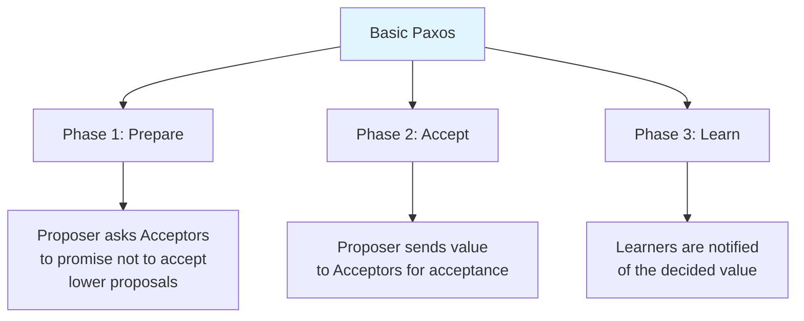
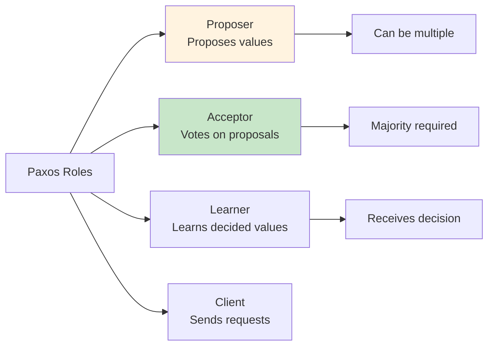
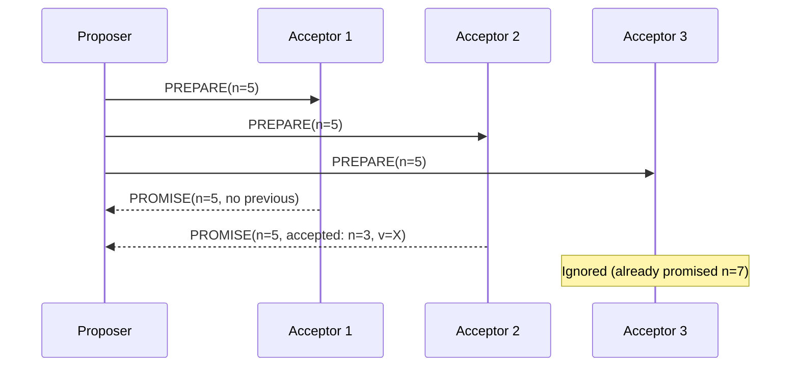
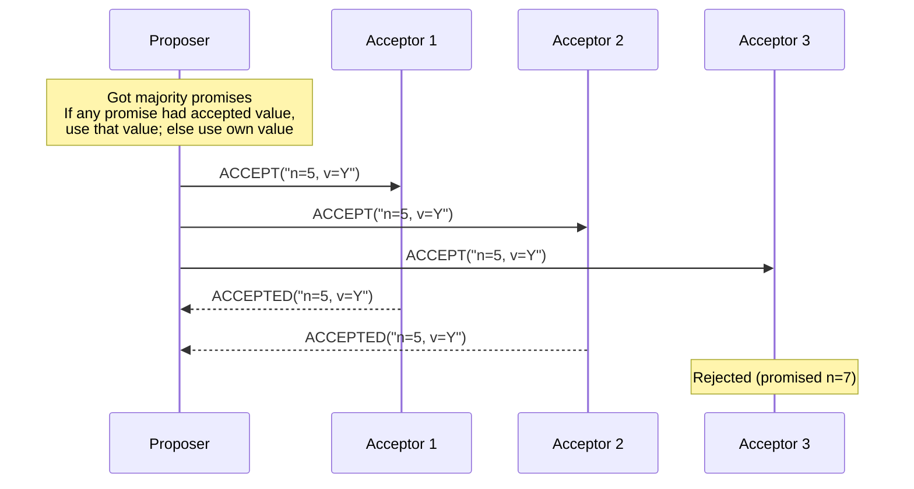
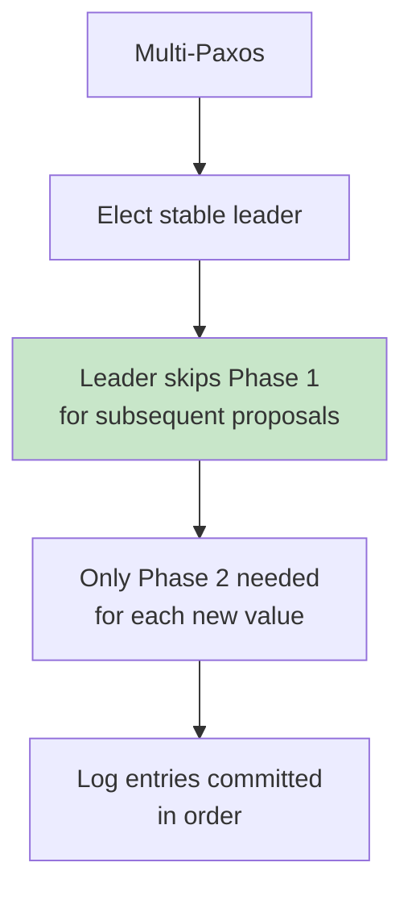

# Paxos

## Overview

Paxos is the classic consensus algorithm, first described by Leslie Lamport in 1989 (published 1998). It solves the consensus problem in asynchronous distributed systems with crash failures. While notoriously difficult to understand and implement, Paxos is the foundation for many distributed systems including Google's Chubby, Spanner, and Megastore.

## Detailed Explanation

### Paxos Background

Lamport's paper "The Part-Time Parliament" used an allegory about a Greek parliament on the island of Paxos, making it famously hard to understand. The algorithm was later simplified and explained in "Paxos Made Simple" (2001).

### Basic Paxos: Single-Value Consensus



### Roles in Paxos



**Note:** A single node can play multiple roles (and usually does).

### Proposal Numbers

Each proposal has a unique, monotonically increasing number:
```
Format: (round_number, node_id)
Example: (1, A), (1, B), (2, A), (2, B), (3, A)

Higher round number = higher priority
Same round number → higher node_id wins
```

### Phase 1: Prepare



**Acceptor behavior:**
```
On receiving PREPARE(n):
  if n > highest_promised:
    highest_promised = n
    respond PROMISE(n, accepted_value)
  else:
    ignore (or respond with NACK)
```

**PROMISE includes:**
- The proposal number n
- Any previously accepted value (if any)

### Phase 2: Accept



**Acceptor behavior:**
```
On receiving ACCEPT(n, v):
  if n >= highest_promised:
    accepted_value = v
    accepted_number = n
    respond ACCEPTED(n, v)
  else:
    reject
```

**Key rule:** If a proposer sees an accepted value in any PROMISE, it MUST propose that value (not its own). This ensures all proposers converge on the same value.

### Phase 3: Learn (Decision)

```
When a majority of ACCEPTED responses are received:
  The value is DECIDED
  Learners are notified
  The decision is final and irrevocable
```

### Full Paxos Example

```
Scenario: 3 Acceptors, 2 Proposers competing

Proposer A (n=1):
  Phase 1: PREPARE(1) → PROMISE from A1, A2
  Phase 2: ACCEPT(1, X) → ACCEPTED from A1, A2
  Decision: X is chosen! (majority of 3 = 2)

Proposer B (n=2, concurrent):
  Phase 1: PREPARE(2) → PROMISE from A2, A3
    A2's promise includes accepted: (1, X)
  Phase 2: MUST propose X (not its own value!)
  ACCEPT(2, X) → ACCEPTED from A2, A3
  Decision: X (same value, consistent)
```

### Why Paxos Works

**Key insight:** Once a value is accepted by a majority, any future proposer must see it (because any two majorities overlap) and must propose the same value.

```
Majority 1 accepts X: {A1, A2}
Majority 2 promises: {A2, A3}

Overlap: A2 has accepted X
→ Proposer must propose X
→ Consensus maintained
```

### Multi-Paxos

Basic Paxos decides a single value. Multi-Paxos decides a **sequence of values** (for replicated log):



**Optimization:** Once a leader is established (via Phase 1), it can skip Phase 1 for future proposals. This reduces the round trips from 2 to 1 per value.

```
Basic Paxos per value: 2 round trips (Prepare + Accept)
Multi-Paxos with stable leader: 1 round trip (Accept only)
```

### Paxos vs. Raft

| Aspect | Paxos | Raft |
|--------|-------|------|
| **Understandability** | Hard | Easy |
| **Leader** | Optional (Multi-Paxos has one) | Required |
| **Log ordering** | Can have gaps/hole | Strictly sequential |
| **Membership changes** | Complex | Joint consensus |
| **Implementation** | Many variations | Well-specified |
| **Used by** | Chubby, Spanner | etcd, CockroachDB |

### Problems with Paxos

1. **Hard to understand** — The original paper used an allegory
2. **Hard to implement** — Many edge cases not covered in the paper
3. **No standard specification** — Many variants (Fast Paxos, Cheap Paxos, etc.)
4. **Log gaps** — Multi-Paxos can have holes in the log
5. **Leader changes** — Complex to handle correctly

This is why Raft was created — to be a more understandable alternative.

## Interview Questions

### Q1: Explain Paxos in simple terms.
**Answer:** Paxos is a consensus algorithm where:
1. A **proposer** sends a **prepare** request with a unique number to a majority of acceptors
2. Acceptors **promise** not to accept lower-numbered proposals and return any previously accepted value
3. If the proposer gets a majority of promises, it sends an **accept** request with a value (using the highest accepted value from promises, or its own if none)
4. If a majority accepts, the value is **decided**

The key insight is that any two majorities overlap, so once a value is decided, future proposers must see it and propose the same value.

### Q2: What happens if two proposers compete (livelock)?
**Answer:** Two proposers can livelock by continuously preempting each other:
- Proposer A sends PREPARE(1)
- Proposer B sends PREPARE(2), preempts A
- Proposer A sends PREPARE(3), preempts B
- ...

Solutions:
1. **Random backoff** — Wait random time before retrying
2. **Leader election** — Only one proposer at a time (Multi-Paxos)
3. **Priority** — Give some proposers higher priority

### Q3: What is Multi-Paxos and why is it needed?
**Answer:** Basic Paxos decides a single value. Multi-Paxos decides a sequence of values (for a replicated log). It optimizes by:
1. Electing a stable leader
2. The leader skips Phase 1 (prepare) for subsequent proposals
3. Only Phase 2 (accept) is needed per value

This reduces round trips from 2 to 1 per value, making it practical for replication.

### Q4: Why was Paxos considered hard to implement?
**Answer:** Lamport's original paper was abstract and didn't cover many practical details:
- How to handle leader changes
- How to handle log gaps
- How to do membership changes
- How to garbage collect old values
- How to handle network partitions

Google's Chubby team spent years implementing Paxos correctly. This led to Raft, which provides a complete specification.

### Q5: How does Paxos ensure safety?
**Answer:** Paxos ensures safety through:
1. **Unique proposal numbers** — No two proposals have the same number
2. **Promise mechanism** — Acceptors reject lower-numbered proposals
3. **Value inheritance** — Proposers must use the highest accepted value from promises
4. **Majority quorum** — Any two majorities overlap by at least one node

These ensure that once a value is accepted by a majority, no conflicting value can ever be decided.

## Common Mistakes

- ❌ **Confusing Paxos with 2PC** — Paxos is consensus; 2PC is distributed commit
- ❌ **Assuming Paxos is always 2 phases** — Multi-Paxos can skip Phase 1
- ❌ **Not understanding the value inheritance rule** — Proposers must use previously accepted values
- ❌ **Ignoring livelock** — Competing proposers can prevent progress without backoff
- ❌ **Trying to implement Paxos from the original paper** — Use Raft instead

## Summary

| Aspect | Details |
|--------|---------|
| **Purpose** | Consensus in asynchronous distributed systems |
| **Phases** | Prepare → Accept → Learn |
| **Quorum** | Majority of acceptors |
| **Safety** | Once decided, never changes |
| **Liveness** | Requires stable leader or backoff |
| **Modern alternative** | Raft (more understandable) |

Paxos is the theoretical foundation of distributed consensus. While Raft is more commonly implemented, understanding Paxos helps in understanding the fundamental challenges of distributed agreement.

## Cross-References

- [Raft](./raft.md) — the understandable consensus algorithm
- [Consensus](./consensus.md) — the consensus problem
- [CAP Theorem](./cap.md) — why consensus affects availability
- [Replication](./replication.md) — how consensus enables replication
- [Two-Phase Commit](../transactions/two-phase-commit.md) — the related distributed commit protocol
