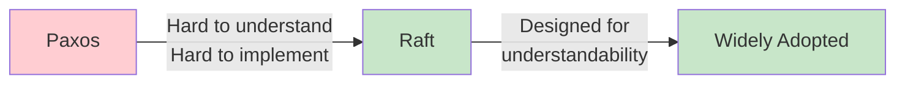
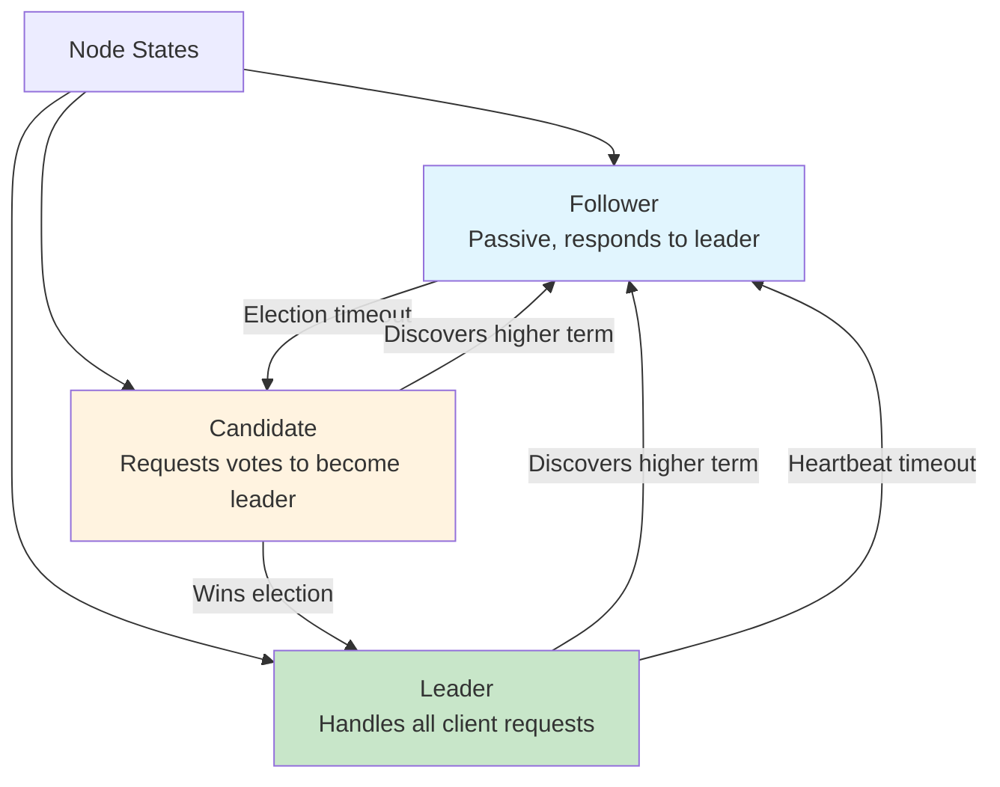
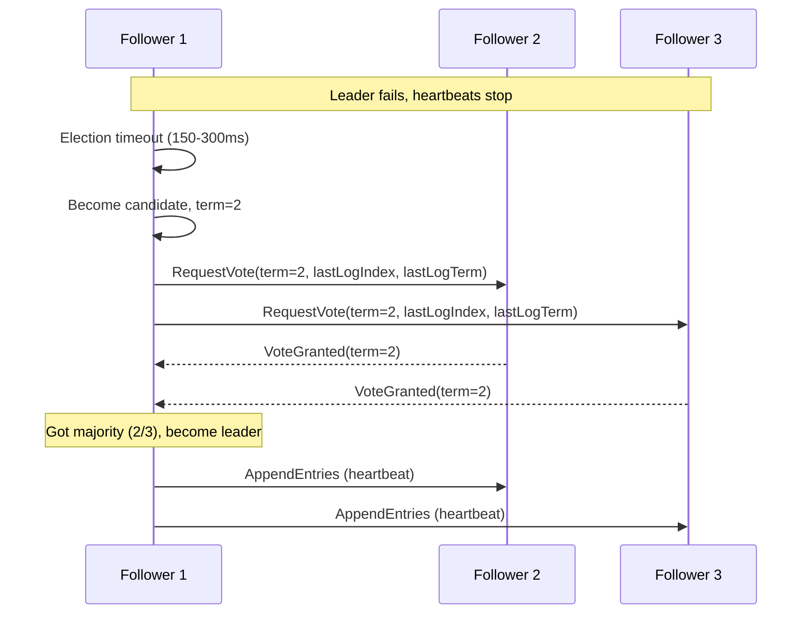
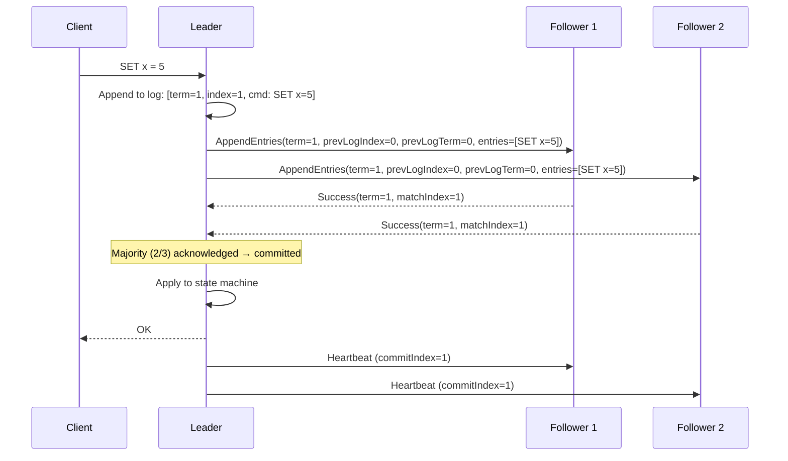
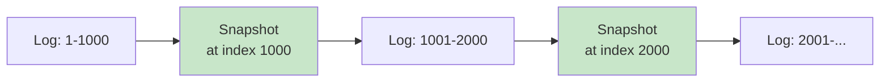

# Raft

## Overview

Raft is a consensus algorithm designed to be **understandable** while being equivalent to Paxos in correctness and performance. Created by Diego Ongaro and John Ousterhout in 2014, Raft has become the dominant consensus algorithm in modern distributed systems, used by etcd (Kubernetes), CockroachDB, TiKV, Consul, and many others.

## Detailed Explanation

### Why Raft?



Raft decomposes consensus into three independent subproblems:
1. **Leader Election** — Choosing a leader
2. **Log Replication** — Replicating log entries
3. **Safety** — Ensuring consistency

### Raft Roles



| Role | Behavior |
|------|----------|
| **Follower** | Passive; responds to leader heartbeats and candidate votes |
| **Candidate** | Actively requests votes to become leader |
| **Leader** | Handles client requests, replicates log to followers |

### Term (Election Epoch)

Raft divides time into **terms**, each beginning with an election:

```
Term 1: Leader A (elected)
Term 2: Leader B (A failed, B elected)
Term 3: Split vote, no leader elected
Term 4: Leader C (elected after retry)
```

**Term serves as a logical clock:**
- Each node tracks the current term
- Higher term = more recent
- Stale leaders are detected by term comparison

### Leader Election



**Election rules:**
1. Follower becomes candidate if no heartbeat received within **election timeout**
2. Candidate increments term and votes for itself
3. Candidate sends RequestVote to all other nodes
4. A node votes for the candidate if:
   - Candidate's term ≥ node's current term
   - Node hasn't voted in this term yet
   - Candidate's log is at least as up-to-date as node's log
5. If majority votes received → become leader
6. If another leader discovered (higher term) → become follower

**Split vote handling:**
```
If no candidate gets majority:
  - Election timeout expires
  - New term begins
  - Random timeout prevents repeated split votes

Random timeout: 150-300ms (each node picks random value)
Probability of repeated split votes: very low
```

### Log Replication



**Log entry structure:**
```
┌───────┬───────┬───────────────────┐
│ Term  │ Index │ Command           │
├───────┼───────┼───────────────────┤
│   1   │   1   │ SET x = 5         │
│   1   │   2   │ SET y = 10        │
│   2   │   3   │ SET x = 7         │
│   3   │   4   │ SET z = 15        │
└───────┴───────┴───────────────────┘
```

**Log matching property:**
- If two entries at the same index have the same term, all preceding entries are identical
- This ensures consistency across replicas

### AppendEntries RPC

```python
# Leader → Follower
AppendEntries(
    term,              # Leader's current term
    leaderId,          # So follower can redirect clients
    prevLogIndex,      # Index of entry before new ones
    prevLogTerm,       # Term of entry at prevLogIndex
    entries[],         # Log entries to append (empty for heartbeat)
    leaderCommit       # Leader's commit index
)

# Follower → Leader response
Response(
    term,              # Follower's current term (for leader to update)
    success,           # True if entry was appended
    matchIndex         # Follower's last log index
)
```

**Consistency check:**
```
If follower doesn't have entry at prevLogIndex:
  → Return false
  → Leader decrements nextIndex and retries
  → Eventually finds matching point
  → Overwrites follower's divergent entries
```

### Safety Guarantees

Raft ensures these safety properties:

| Property | Description |
|----------|-------------|
| **Election Safety** | At most one leader per term |
| **Leader Append-Only** | Leader never overwrites its own log |
| **Log Matching** | If two logs have entry with same index and term, all preceding entries match |
| **Leader Completeness** | If entry committed in term T, all future leaders have that entry |
| **State Machine Safety** | If node applies entry at index, no other node applies different entry at same index |

### Log Compaction (Snapshotting)

Over time, the log grows unboundedly. Raft uses **snapshots** to compact:



```
Snapshot:
  - Contains state machine state at a point in time
  - Includes last included index and term
  - Old log entries before snapshot are discarded

InstallSnapshot RPC:
  - Leader sends snapshot to lagging follower
  - Follower replaces its state with snapshot
```

### Membership Changes

Changing the cluster membership (adding/removing nodes) requires care:

```mermaid
flowchart TD
    A[Old Config: {A, B, C}] --> B[Joint Consensus:<br/>{A,B,C} and {A,B,C,D}]
    B --> C[New Config: {A, B, C, D}]

    style B fill:#fff3e0
```

**Joint consensus (Raft's approach):**
1. Leader creates log entry with **joint configuration** (old + new)
2. Decisions require majority from BOTH old and new configs
3. Once joint config is committed, create log entry with new config only
4. Once new config is committed, old nodes can be removed

### Raft in Practice

**etcd (Kubernetes' key-value store):**
```
3 or 5 node cluster
Leader handles all writes
Followers replicate log
Used for: configuration, service discovery, leader election
```

**CockroachDB:**
```
Each range (shard) has its own Raft group
Leader handles reads and writes for the range
Multi-range transactions use 2PC across Raft groups
```

**TiKV (TiDB's storage layer):**
```
Region = Raft group (default 96MB)
Leader handles reads/writes
Replicas on different machines
Auto-rebalancing when nodes added/removed
```

## Interview Questions

### Q1: How does Raft ensure only one leader is elected per term?
**Answer:** Raft's election rule requires a candidate to receive votes from a majority of nodes. Each node votes at most once per term. Since any two majorities overlap by at least one node, it's impossible for two candidates to both get a majority in the same term. If a candidate discovers a higher term, it steps down to follower.

### Q2: What happens when a Raft leader fails?
**Answer:**
1. Followers stop receiving heartbeats
2. A follower's election timeout expires (150-300ms, randomized)
3. The follower becomes a candidate, increments term, requests votes
4. If it gets a majority, it becomes the new leader
5. The new leader accepts client requests and replicates the log

During the election (~200ms), the cluster is unavailable for writes. Reads may be served by followers (stale) or rejected (linearizable reads).

### Q3: How does Raft handle network partitions?
**Answer:** In a partition:
- The partition with the majority of nodes elects a new leader and continues operating
- The minority partition's leader (if any) discovers the higher term and steps down
- When the partition heals, the stale nodes catch up via log replication

Example: 5 nodes, partition into {A,B} and {C,D,E}:
- {C,D,E} elects a new leader (3 nodes = majority)
- {A,B} can't elect a leader (2 nodes < majority)
- When healed, A and B replicate from the leader

### Q4: What is the "election timeout" and how is it chosen?
**Answer:** The election timeout is the time a follower waits before becoming a candidate. It must be:
- **Long enough** to avoid unnecessary elections (heartbeat interval << election timeout)
- **Short enough** to detect failures quickly
- **Randomized** to prevent split votes

Typical values:
- Heartbeat interval: 50-100ms
- Election timeout: 150-300ms (random per node)
- Rule: broadcastTime << electionTimeout << MTBF (mean time between failures)

### Q5: How does Raft differ from Paxos?
**Answer:**
- **Leader**: Raft has a strong leader; Paxos can have competing proposers
- **Log ordering**: Raft has strictly sequential logs; Paxos can have gaps
- **Understandability**: Raft is designed for understandability; Paxos is notoriously complex
- **Specification**: Raft is fully specified; Paxos leaves many details to the implementer
- **Membership changes**: Raft has joint consensus; Paxos requires external mechanisms

Raft is equivalent to Multi-Paxos in power but much easier to implement correctly.

## Common Mistakes

- ❌ **Not randomizing election timeouts** — Causes repeated split votes
- ❌ **Setting election timeout too short** — Causes unnecessary elections during normal operation
- ❌ **Not handling the old leader** — Old leader may still think it's leader (stale term)
- ❌ **Ignoring log compaction** — Log grows unboundedly without snapshots
- ❌ **Confusing commit with apply** — Entry is committed when majority acknowledges; applied when state machine executes it

## Summary

| Aspect | Details |
|--------|---------|
| **Purpose** | Understandable consensus algorithm |
| **Subproblems** | Leader election, log replication, safety |
| **Leader** | Required, handles all writes |
| **Terms** | Logical clock for detecting stale leaders |
| **Log** | Replicated, strictly ordered, snapshotted |
| **Used by** | etcd, CockroachDB, TiKV, Consul |

Raft has become the standard consensus algorithm for modern distributed systems, replacing Paxos in most new implementations due to its clarity and well-defined specification.

## Cross-References

- [Paxos](./paxos.md) — the classic consensus algorithm
- [Consensus](./consensus.md) — the consensus problem
- [Replication](./replication.md) — Raft enables strong replication
- [Consistency Models](./consistency.md) — what Raft provides
- [WAL](../internals/wal.md) — write-ahead log (Raft log is similar)


## Cross References

- [Paxos](../dbms/distributed/paxos.md)
- [Raft (Distributed)](../distributed/consensus/raft.md)
- [Consensus](../dbms/distributed/consensus.md)
- [Leader Election](../distributed/consensus/raft.md)
