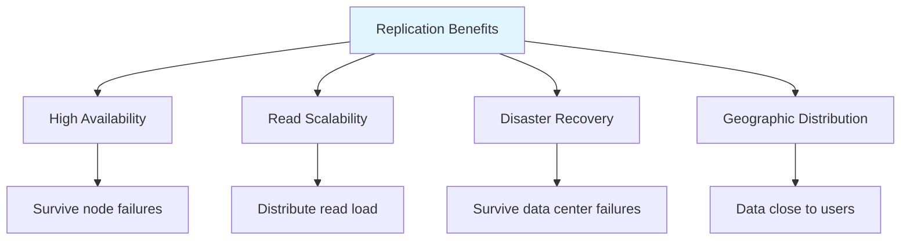
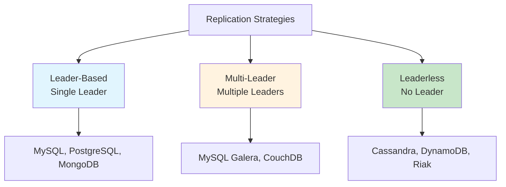
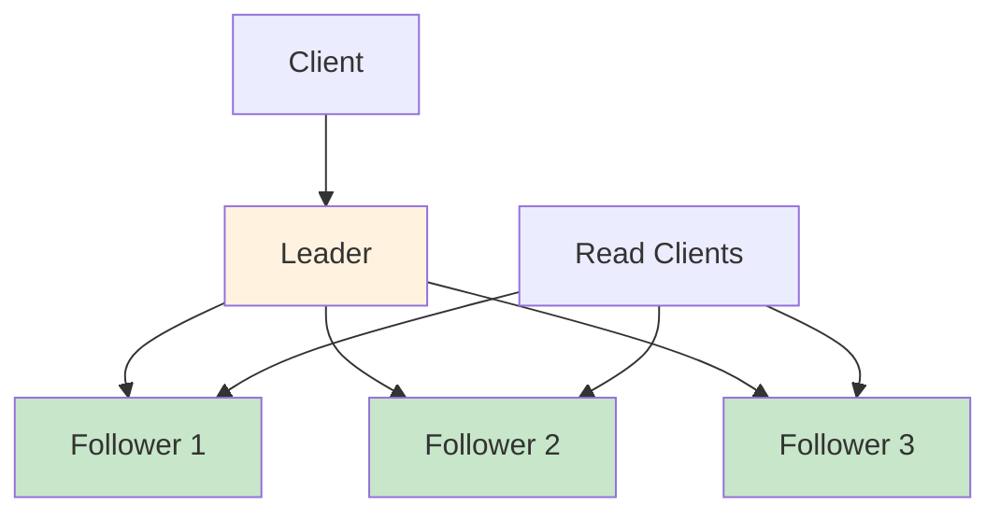
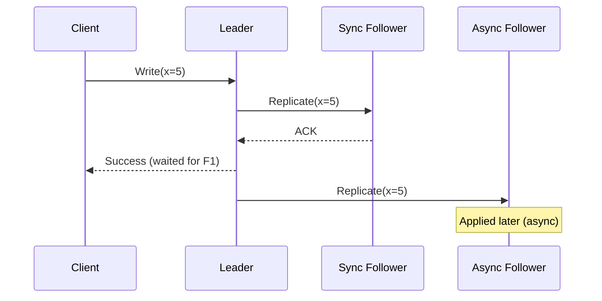
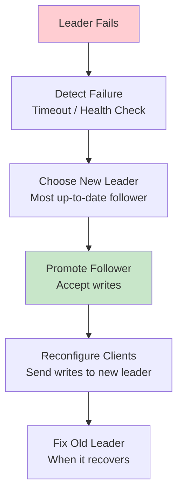
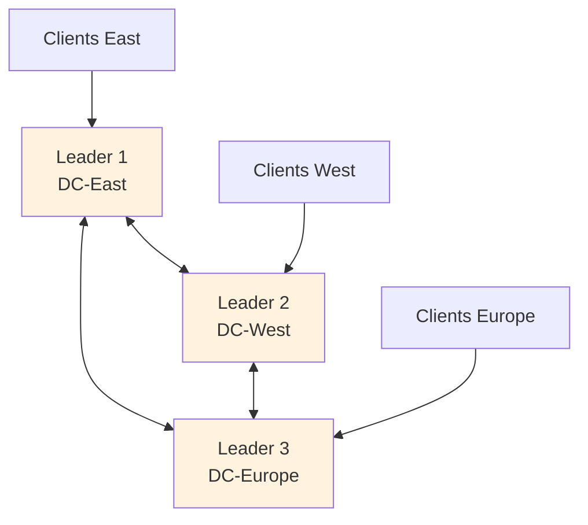
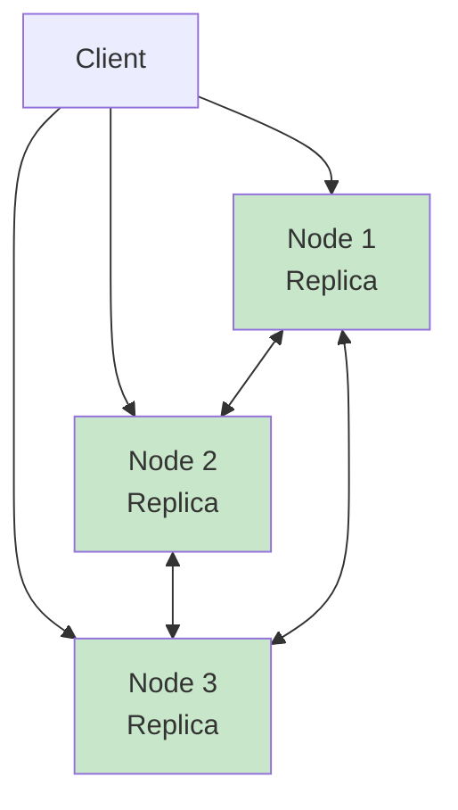

# Replication

## Overview

Replication is the process of copying data across multiple nodes in a distributed system. It provides **high availability** (system survives node failures), **read scalability** (distribute read load across replicas), and **disaster recovery** (data survives data center failures). Replication is one of the two fundamental techniques in distributed databases (the other being sharding/partitioning).

## Detailed Explanation

### Why Replicate?



### Replication Strategies



### 1. Leader-Based (Single Leader) Replication



**How it works:**
1. All **writes** go to the **leader**
2. Leader sends changes to **followers** (via replication log)
3. **Reads** can go to leader or followers
4. If leader fails, a follower is **promoted** to new leader

**Replication Log:**
```
Leader's WAL / Binlog:
  LSN 1: INSERT INTO users (id, name) VALUES (1, 'Alice')
  LSN 2: UPDATE users SET name = 'Bob' WHERE id = 1
  LSN 3: DELETE FROM users WHERE id = 1

Follower applies these changes in order.
```

#### Synchronous vs. Asynchronous Replication



| Type | Durability | Latency | Availability |
|------|-----------|---------|-------------|
| **Synchronous** | High (data on multiple nodes) | High (wait for followers) | Lower (blocked if follower down) |
| **Asynchronous** | Lower (data may be lost) | Low (return immediately) | Higher (don't wait) |
| **Semi-synchronous** | Medium (1 sync follower) | Medium | Medium |

**Semi-synchronous (common compromise):**
```
Leader → Follower 1 (SYNC - wait for ACK)
Leader → Follower 2 (ASYNC - don't wait)
Leader → Follower 3 (ASYNC - don't wait)

If leader fails, at most 1 write lost (from async followers)
```

#### Handling Leader Failure (Failover)



**Failover challenges:**
1. **Data loss** — Async replication may lose writes not yet replicated
2. **Split brain** — Two nodes think they're leader
3. **Timeout** — How long to wait before declaring failure?

### 2. Multi-Leader Replication



**Use case:** Multi-datacenter deployment where each datacenter has a leader.

**Advantages:**
- Writes can be local (low latency)
- Survives datacenter failures

**Challenges:**
- **Write conflicts** — Same data modified in multiple datacenters
- **Conflict resolution** — Last-write-wins, custom merge, application-level

**Conflict Resolution Strategies:**

| Strategy | Description | Example |
|----------|-------------|---------|
| **Last-Writer-Wins (LWW)** | Highest timestamp wins | Cassandra |
| **Custom merge** | Application-specific merge function | CouchDB |
| **Conflict avoidance** | Partition data so conflicts can't happen | Route users to nearest DC |
| **Manual resolution** | Store both versions, let user choose | Git-like |

### 3. Leaderless Replication



**How it works:**
1. Client writes to **W** replicas (quorum write)
2. Client reads from **R** replicas (quorum read)
3. If W + R > N, reads are guaranteed to see latest write

**Example (Dynamo-style):**
```
N = 3 replicas
W = 2 (write to 2 replicas)
R = 2 (read from 2 replicas)

Write: Client → Node 1 ✓, Node 2 ✓, Node 3 ✗ (failed)
Read: Client → Node 1 (v=5, ts=10), Node 3 (v=3, ts=8)
  → Returns v=5 (highest timestamp)

W + R = 4 > N = 3 → Strong consistency
```

**Read Repair and Anti-Entropy:**
```
Read Repair:
  Client reads from 2 replicas, gets different values
  Client writes latest value to stale replica

Anti-Entropy:
  Background process compares replicas
  Synchronizes differences using Merkle trees
```

### Replication Log Formats

| Format | Description | Used By |
|--------|-------------|---------|
| **Statement-based** | Log SQL statements | MySQL (old) |
| **Row-based** | Log row changes | MySQL (binlog), PostgreSQL |
| **Write-ahead log** | Log page changes | PostgreSQL, Oracle |
| **Trigger-based** | Application triggers | Some NoSQL |

### Replication Lag

Asynchronous replication creates a **replication lag** — followers may be behind the leader:

```
Replication Lag:
  Leader:   x = 5 (latest)
  Follower: x = 3 (lagging by 2 writes)
  
  Lag = time between write on leader and appearance on follower
  Typical: milliseconds to seconds
  Problem: reads from follower may return stale data
```

**Problems caused by replication lag:**

| Problem | Description | Solution |
|---------|-------------|----------|
| **Read-after-write** | Write then read returns old value | Read from leader after write |
| **Monotonic reads** | Read goes backwards | Always read from same replica |
| **Consistent prefix** | Reads see partial updates | Causal consistency |

## Interview Questions

### Q1: What is the difference between synchronous and asynchronous replication?
**Answer:**
- **Synchronous**: Leader waits for follower acknowledgment before returning success to client. Guarantees data is on multiple nodes but adds latency.
- **Asynchronous**: Leader returns success immediately, replicates in background. Lower latency but data may be lost if leader fails before replication.

Most systems use **semi-synchronous**: one follower is synchronous (for durability), others are asynchronous (for performance).

### Q2: How does leader failover work and what can go wrong?
**Answer:** Failover steps:
1. Detect leader failure (health check timeout)
2. Choose new leader (most up-to-date follower)
3. Reconfigure system to use new leader
4. Resume operations

What can go wrong:
- **Data loss** — Async replication may lose unreplicated writes
- **Split brain** — Two nodes think they're leader (network partition)
- **Cascading failures** — New leader can't handle the load
- **Client confusion** — Clients still sending to old leader

### Q3: What is a write conflict in multi-leader replication?
**Answer:** A write conflict occurs when the same data is modified concurrently on different leaders. For example:
- Leader 1: UPDATE SET title = 'A' WHERE id = 1
- Leader 2: UPDATE SET title = 'B' WHERE id = 1
Both succeed locally, but when replicated, there's a conflict. Resolution strategies include last-writer-wins, custom merge functions, or manual resolution.

### Q4: How does quorum-based (leaderless) replication work?
**Answer:** The client writes to W replicas and reads from R replicas. If W + R > N (total replicas), every read is guaranteed to see at least one replica with the latest write. For example, with N=3, W=2, R=2:
- Write succeeds if 2 of 3 replicas acknowledge
- Read gets 2 responses; the one with the highest timestamp is the latest
- Since 2+2=4 > 3, the read and write sets always overlap

### Q5: What is replication lag and how do you handle it?
**Answer:** Replication lag is the delay between a write on the leader and its appearance on followers. In async replication, lag can be milliseconds to seconds. Problems:
- Read-after-write inconsistency: User writes, then reads stale data
- Monotonic read violation: User sees data "go backwards"

Solutions:
- Read from leader after writes
- Always read from the same replica
- Use synchronous replication (at the cost of latency)
- Monitor lag and alert if it exceeds threshold

## Common Mistakes

- ❌ **Assuming replication = backup** — Replication replicates errors and deletions too
- ❌ **Ignoring replication lag** — Applications must account for stale reads
- ❌ **Not planning for failover** — Automatic failover can cause split brain
- ❌ **Using sync replication everywhere** — Too much latency for most workloads
- ❌ **Confusing replication with sharding** — Replication copies data; sharding splits data

## Summary

| Strategy | Writes | Reads | Conflicts | Use Case |
|----------|--------|-------|-----------|----------|
| **Single Leader** | To leader only | From any replica | No conflicts | Most databases |
| **Multi-Leader** | To any leader | From any replica | Possible | Multi-datacenter |
| **Leaderless** | To W replicas | From R replicas | Possible | High availability |

Replication is fundamental to distributed databases. The choice between sync/async and leader/leaderless determines the system's consistency, availability, and latency characteristics.

## Cross-References

- [CAP Theorem](./cap.md) — replication trade-offs
- [Consistency Models](./consistency.md) — consistency guarantees from replication
- [Sharding](./sharding.md) — complementary technique for scaling
- [Consensus](./consensus.md) — how replicas agree on leader
- [Raft](./raft.md) — consensus-based replication


## Cross References

- [Consistency Models](consistency.md)
- [Replication (Distributed)](../../distributed/replication/README.md)
- [Quorum](../../distributed/replication/quorum.md)
- [CAP Theorem](cap.md)
