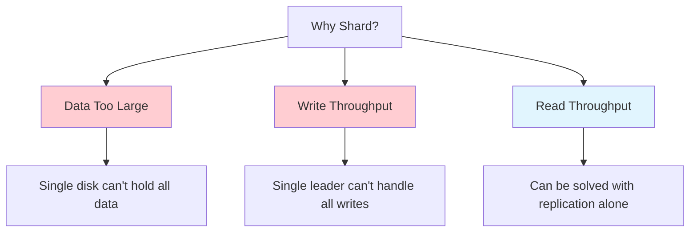
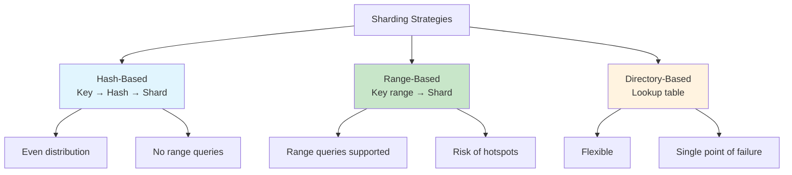
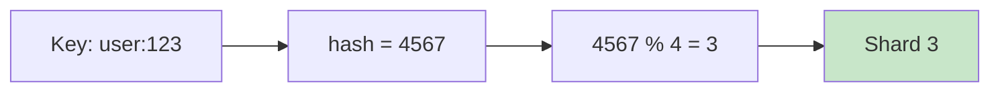
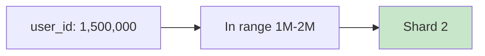
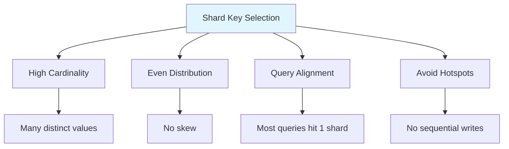
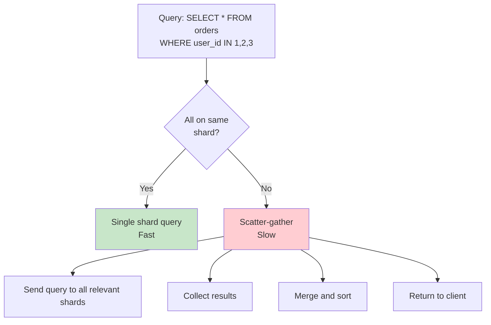
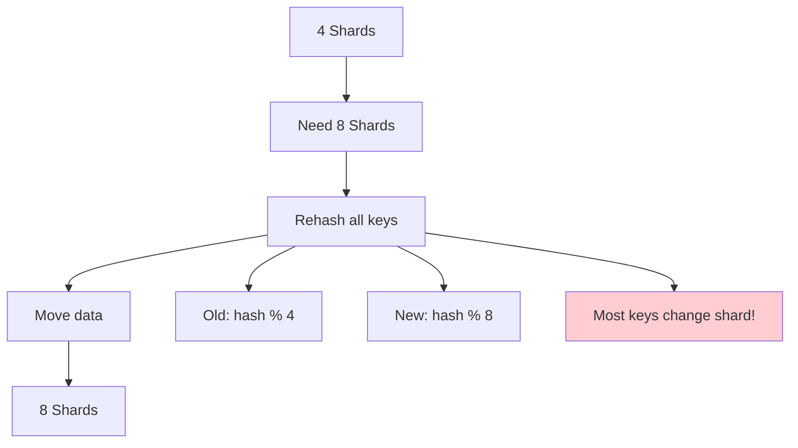
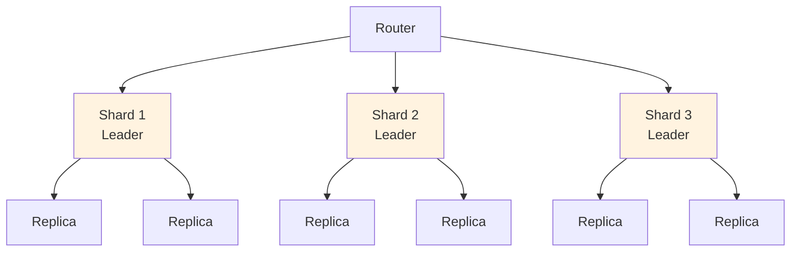

# Sharding (Partitioning)

## Overview

Sharding (also called partitioning) is the technique of splitting a large dataset across multiple machines (shards). While replication copies data for availability, sharding splits data for **scalability** — allowing the system to handle more data and write throughput than a single machine can support. Sharding is the other fundamental technique in distributed databases alongside replication.

## Detailed Explanation

### Why Shard?



**Key insight:** Replication helps with read scaling and availability, but only sharding helps with write scaling and data volume.

### Sharding Strategies



### 1. Hash-Based Sharding

Each key is hashed, and the hash determines which shard stores the data.

```python
shard_id = hash(key) % num_shards

# Example:
hash("user:123") = 4567
shard_id = 4567 % 4 = 3  → Shard 3
```



**Advantages:**
- Even distribution (good hash function spreads keys uniformly)
- No hotspots

**Disadvantages:**
- Range queries require scanning ALL shards
- Resharding (changing number of shards) requires moving data

**Example (Cassandra):**
```
Token range: -2^63 to 2^63-1
Shard 1: tokens -2^63 to -2^62
Shard 2: tokens -2^62 to 0
Shard 3: tokens 0 to 2^62
Shard 4: tokens 2^62 to 2^63-1
```

### 2. Range-Based Sharding

Data is divided into contiguous ranges based on the shard key.

```
Users table, sharded by user_id:

Shard 1: user_id 1 - 1,000,000
Shard 2: user_id 1,000,001 - 2,000,000
Shard 3: user_id 2,000,001 - 3,000,000
```



**Advantages:**
- Range queries are efficient (data is contiguous)
- Easy to understand and manage

**Disadvantages:**
- **Hotspots** — If data is written sequentially (e.g., timestamps), one shard gets all writes
- Uneven distribution if data is skewed

**Example (HBase, Bigtable):**
```
Row key: com.example.www:80
Shard by row key prefix → all www.example.com data on same shard
```

### 3. Directory-Based Sharding

A lookup table maps each key to its shard.

```
Directory:
  user:123 → Shard 2
  user:456 → Shard 1
  user:789 → Shard 3
```

**Advantages:**
- Maximum flexibility (can assign keys to any shard)
- Can handle heterogeneous data sizes

**Disadvantages:**
- Directory is a single point of failure
- Extra lookup for every operation
- Directory can become a bottleneck

### Shard Key Selection

Choosing the right shard key is critical:



| Good Shard Keys | Bad Shard Keys |
|----------------|---------------|
| `user_id` (UUID) | `status` (few values) |
| `order_id` (UUID) | `created_at` (sequential) |
| `customer_id` (many) | `country` (skewed) |

**Example — Bad shard key (status):**
```
Shard 1: status = 'active'    → 90% of data!
Shard 2: status = 'inactive'  → 5% of data
Shard 3: status = 'deleted'   → 5% of data

Shard 1 handles 90% of queries → bottleneck!
```

**Example — Good shard key (user_id):**
```
Shard 1: user_id hash 0-25%    → ~25% of data
Shard 2: user_id hash 25-50%   → ~25% of data
Shard 3: user_id hash 50-75%   → ~25% of data
Shard 4: user_id hash 75-100%  → ~25% of data

Evenly distributed!
```

### Cross-Shard Operations

When a query needs data from multiple shards:



**Cross-shard JOIN:**
```sql
-- If users and orders are on different shards:
SELECT u.name, o.amount
FROM users u JOIN orders o ON u.id = o.user_id
WHERE u.id = 123;

-- If user 123 is on Shard 1 and their orders on Shard 2:
-- Must fetch from both shards and join in memory
-- Very expensive!
```

### Resharding

Adding or removing shards requires moving data:



**Consistent hashing minimizes data movement:**
```
With simple modulo: Adding 1 shard moves ~all keys
With consistent hashing: Adding 1 shard moves ~1/N keys
```

**Online resharding:**
1. Create new shards
2. Double-write to old and new shards
3. Backfill historical data to new shards
4. Cut over reads to new shards
5. Remove old shards

### Sharding + Replication

In practice, each shard is replicated for fault tolerance:



## Interview Questions

### Q1: What is the difference between sharding and replication?
**Answer:**
- **Replication** copies the same data to multiple nodes. Purpose: availability, read scaling. Every node has all data.
- **Sharding** splits different data across nodes. Purpose: write scaling, data volume. Each node has a subset of data.

They're complementary: each shard is typically replicated for fault tolerance.

### Q2: Hash-based vs. range-based sharding — when to use which?
**Answer:**
- **Hash-based**: When you need even distribution and don't need range queries. Example: user profiles accessed by user_id.
- **Range-based**: When you need range queries and data is naturally ordered. Example: time-series data, logs by timestamp.

Hash-based is more common because even distribution prevents hotspots. Range-based is used when range queries are critical (analytics, time-series).

### Q3: What is a hot shard and how do you fix it?
**Answer:** A hot shard receives disproportionately more traffic than others. Causes:
- Bad shard key (e.g., sequential timestamps → latest shard gets all writes)
- Skewed data (e.g., celebrity user has 100x more followers)

Fixes:
1. **Better shard key** — Use higher cardinality key
2. **Split the shard** — Divide hot shard into smaller shards
3. **Caching** — Cache hot data at the application level
4. **Rate limiting** — Limit writes to hot keys

### Q4: How do you handle cross-shard queries?
**Answer:** Cross-shard queries (scatter-gather) are expensive:
1. **Send query to all relevant shards** in parallel
2. **Collect results** from each shard
3. **Merge and sort** results in memory
4. **Return** to client

To minimize cross-shard queries:
- Choose shard key aligned with query patterns
- Denormalize data to keep related data on same shard
- Use global indexes (with their own sharding overhead)

### Q5: How does consistent hashing help with resharding?
**Answer:** With simple modulo hashing (`hash % N`), changing N redistributes almost all keys. With consistent hashing:
- Keys and servers are mapped to a virtual ring
- Each key is assigned to the next server clockwise
- Adding/removing a server only affects keys in its segment
- Only ~1/N keys need to move

This makes resharding much cheaper and enables gradual, online resharding.

## Common Mistakes

- ❌ **Choosing a low-cardinality shard key** — Creates hotspots (e.g., sharding by country)
- ❌ **Not considering query patterns** — Shard key should align with common queries
- ❌ **Forgetting about cross-shard joins** — They're expensive; design to avoid them
- ❌ **Not planning for resharding** — Data grows; you'll need to add shards eventually
- ❌ **Confusing sharding with replication** — They serve different purposes

## Summary

| Strategy | Distribution | Range Queries | Resharding | Use Case |
|----------|-------------|---------------|------------|----------|
| **Hash-based** | Even | ❌ No | Hard | General purpose |
| **Range-based** | Can be uneven | ⭐ Yes | Medium | Time-series, analytics |
| **Directory-based** | Flexible | ⭐ Yes | Easy | Heterogeneous data |

Sharding is essential for scaling beyond a single machine. The choice of shard key is the most important decision — it determines distribution, query efficiency, and resharding difficulty.

## Cross-References

- [Replication](./replication.md) — complementary technique for availability
- [CAP Theorem](./cap.md) — sharding trade-offs
- [Consistent Hashing](../../distributed/partitioning/consistent-hashing.md) — distribution mechanism
- [NoSQL](../nosql/) — many NoSQL databases are designed for sharding
- [Redis Cluster](../caching/redis.md) — hash slot-based sharding
